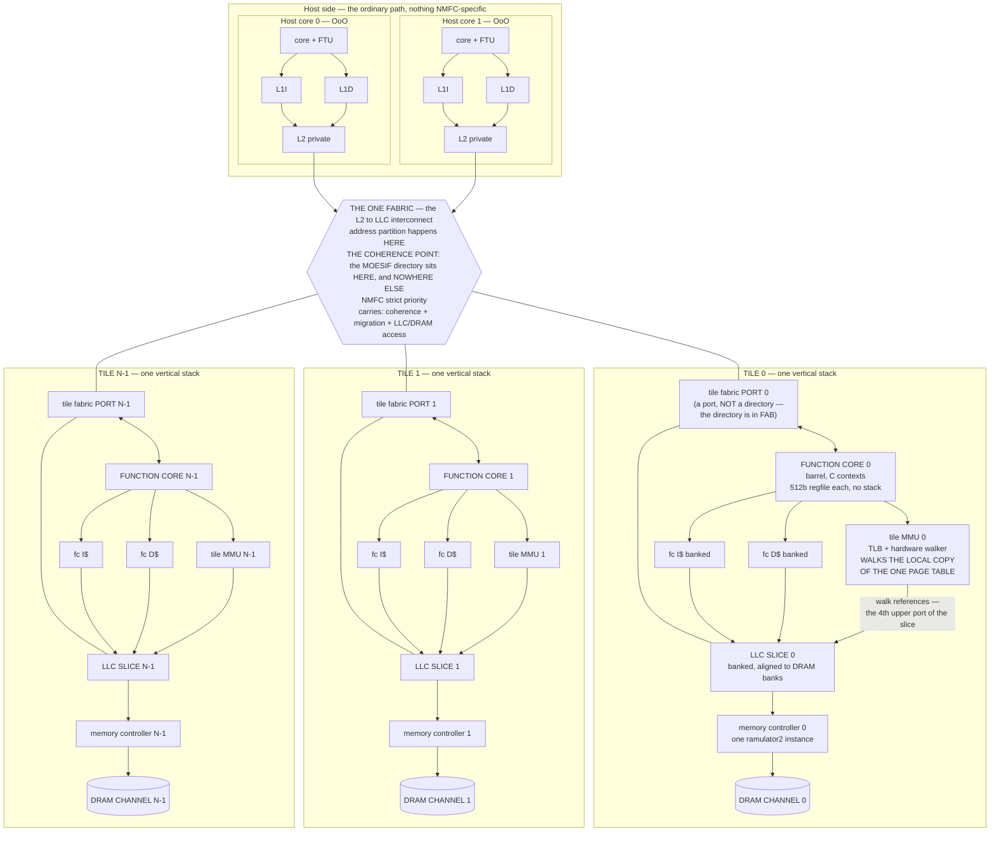
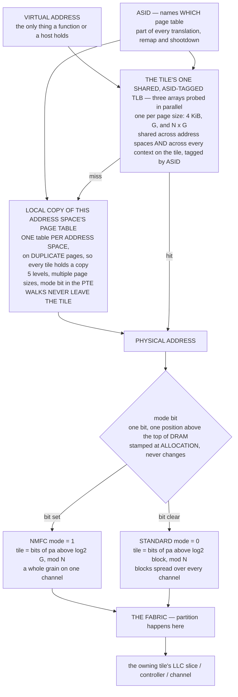
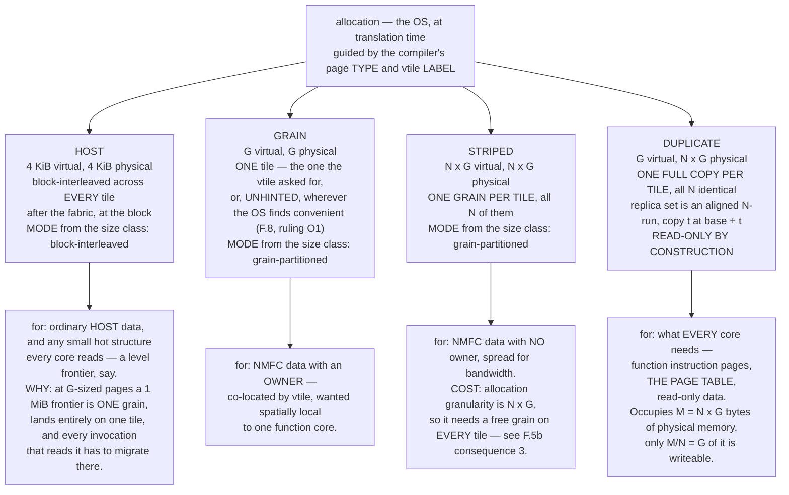
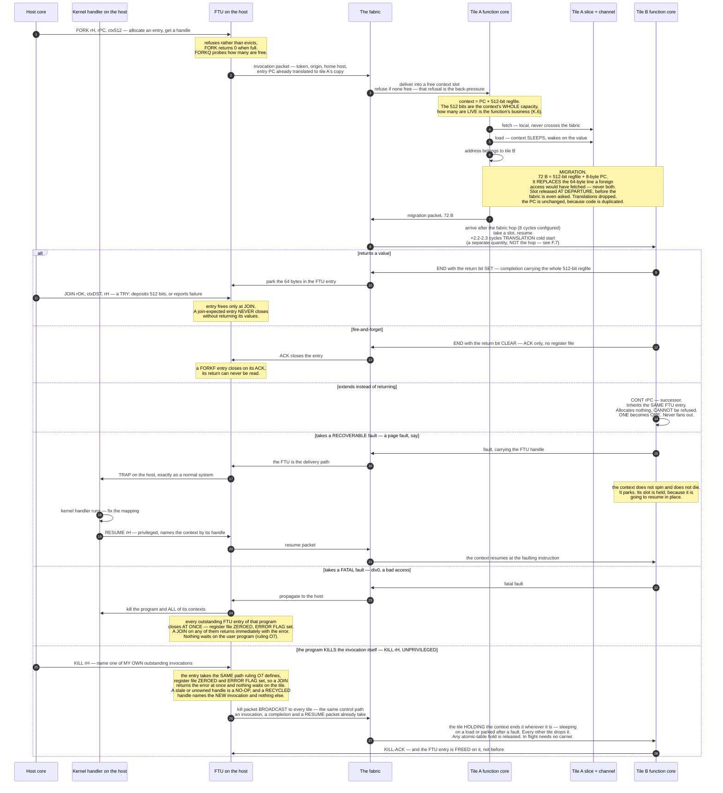
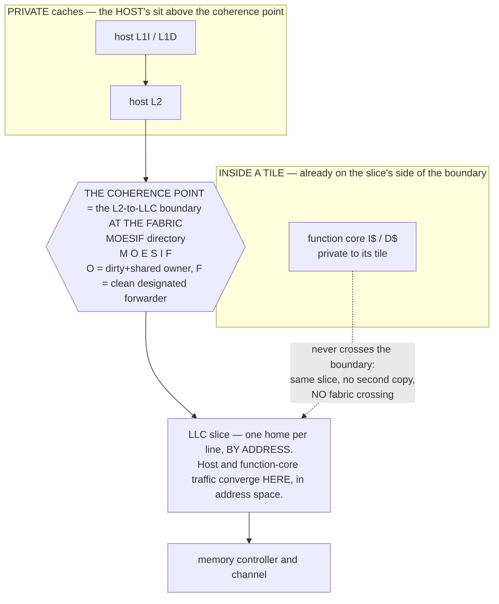

# NMFC — CANONICAL DESIGN

**Status: Ratified against the user's rulings of 2026-09-02/03; this file is the design. DESIGN.md is the historical record.**

**What this document is.** One authoritative, self-contained statement of what the
Near-Memory Function Core machine *is*. It was produced because the design was
repeatedly re-derived wrong between turns, from the wrong sources. It is written to
be literal rather than short: numbers, sizes, encodings, invariants, and every
rejected alternative *with its reason* are all load-bearing and none of them are
summarised away.

**Two sections come first because they are what the document needs FROM the reader:**
**RULINGS NEEDED FROM THE USER** — **EVERY RULING THE USER GAVE IS APPLIED, and the count of
rulings still to give fell from forty-nine to zero: 2026-09-02** (twenty-one numbered rulings
plus three), **2026-09-03** (the last ten), and **again later on 2026-09-03** — the per-context
translation cache, liveness, `W1b`, **`KILL`** and **the page model** — and **once more on
2026-09-03, on the eight items U1–U8, ALL OF WHICH ARE NOW CLOSED.** **THE COUNT IS ZERO
AGAIN, and this time on every kind at once: no ruling is unapplied, no reading awaits
confirmation, and no question is open.** `[UPDATED - user ruling 2026-09-03 on U1-U8. This
paragraph read "WHAT IS NOT ZERO … ONE READING AWAITING CONFIRMATION … and SEVEN MISSING RULES …
U1 through U8, tabled below". The user answered all eight and the table is REMOVED: `KILL` is
UNPRIVILEGED (U1 CONFIRMED — no longer a reading); a STRIPED page is a huge page, one contiguous
`N·G` extent allocated and freed like any other (U2-U4); `KILL` is BROADCAST on the control path
and the FTU entry is freed on the tile's KILL-ACK (U5, U6); a recycled handle names the NEW
invocation and nothing else (U7); a striped page's shootdown is ANY REMAP (U8). The closures are
stated at every point of use and recorded at ledger **L59** and **L60**.]` **The ONE thing still
offered, and it is not a question of any kind: TWO PROPOSED NAMES, `HOST`
and `STRIPED`, which change no statement in this document** (F.5b) — and
**SELECTED CONFIGURATION FOR SIMULATION**, which holds every value this document used to
state as a design constant and now states as a *configured* value with its file and line.
Everything after them is the document proper.

---

## RULINGS NEEDED FROM THE USER

**THE USER RULED ON 2026-09-02 AND AGAIN ON 2026-09-03 — AND THEN SEVERAL MORE TIMES LATER ON
2026-09-03. EVERY SET IS APPLIED IN THIS REVISION, AND NOTHING IS LEFT OPEN.** They are tier 1,
they are the newest words in the record, and they are binding. **The later rulings of 2026-09-03
have their own table below** — the per-context translation cache, liveness, `W1b`, **`KILL`** and
**the page model** — recorded there rather than as new `O`-rows, because the ten-row table's
membership is an audit invariant of this document.

`[A THIRD SET WAS RULED ON 2026-09-03 (MORNING) — THE REGISTER-NAMING QUESTIONS — AND IT IS THE
ONE PLACE THIS SECTION'S "NOTHING IS LEFT OPEN" NEEDS A QUALIFIER. Read this before quoting the
count as zero.]`

**THE RULING: "*Okay, lets go with A.*" DESIGN A IS ADOPTED — the register number IS the bit
range of the 512-bit context.** `x8`–`x15` are the eight 64-bit tiles, `x16`–`x31` the sixteen
32-bit tiles, the halves of `x`*n* are `x`*2n* and `x`*2n+1*, `x0` reads zero at any width, and
**`x1`–`x7` are illegal and trap.** Nothing outside the instruction encoding and the 512 bits
participates. **Migration stays 72 B.** Full statement: **H.10**; invariants sharpened at
**I2** and **I7**; admission at **K.6**; rejected alternatives at **P.5 R111–R113**.

| | question | the user's words, verbatim | status |
|---|---|---|---|
| **Q1** | where to stop — A, or a richer scheme? | "*No idea what this means.*" | **RULED as: A now; A2 and B reserved as hatches, built only if a truly hard constraint appears** (**H.10.9**). The ladder notation the question used is not used in this canon. `[CORRECTED — user ruling 2026-09-03 (liveness). The question was put as though the richer schemes reached widths Design A could not. **They do not.** Under A every width is reachable — a value narrower than a name is packed and accessed by shift-and-mask through a SCRATCH name at about 2–3 operations (**H.10.6**). **The hatches buy DIRECTNESS — instructions per access — never capability.** The ruling stands unchanged; only the reason for reserving them does.]` Ledger **L53** |
| **Q2** | does `f`*n* ≡ `x`*n*? | "*I don't know what that means.*" | **RULED as: YES — one pool, type from the opcode** (**H.10.5**). Carries the base-ISA spelling amendment: `RV64IMA` + Zfinx/Zdinx semantics on the tile; **O4's substance untouched, float is in**. **`[CONFIRMED — user, 2026-09-03, verbatim: "Unless there are any advantages to non-equivalency (for example, the min size of a float is 32 bits), then keep them the same." There are none — under A the smallest name is already 32 bits, so every `f` name has a 32- or 64-bit slice; the reasoning is at H.10.5. Tag RETIRED, reading STANDS.]`** Ledger **L51** |
| **Q3** | supersede I.7 item 3? | "*I don't know what CANON I.7 is.*" | **RULED as: SUPERSEDE, and price the divergence** — a function-core binary is **not host-executable** (**I.7 item 3**, **H.10.8**). **`[CONFIRMED — user, 2026-09-03, verbatim: "Q3: Accepted, function should not be host-executable. Functions may need to have preambles to prevent incorrectness (so fetch refuses to execute a function on host)." Tag RETIRED at every point of use; the reading STANDS. AND THE CONFIRMATION CARRIED A NEW REQUIREMENT WITH IT — the machine must REFUSE to execute a function on a host core, and it must refuse AT FETCH — stated at **I.7a**, where the one mechanism recorded (an ENTRY MARKER) is marked PROPOSAL — NOT RULED.]`** Ledger **L50** |
| **Q4** | is the run-time undefined-register trap a requirement or a preference? | "**Requirement.**" | **RULED: REQUIREMENT.** The illegal-name trap is **built and free** (**I7**, **H.10.4**). **What A cannot trap is MISUSE of a legal name — that is admission's job (K.6 test 3).** **`[SCOPE CONFIRMED — user, 2026-09-03, verbatim: "I think that is okay." The requirement is the trap on an ILLEGAL NAME; misuse of a legal name is ADMISSION'S job (K.6 test 3). Tag RETIRED at every point of use; the choice of A stands.]`** Ledger **L52** |
| **W1b** | should the integer-ALU width rule be *"from the widest register operand; `*W` forms 32"*, as this revision's drafting instruction worded it? | "**W1b: Not really sure what this is getting at? We can't do more than one op at once, so might as well make the ALU 64-bit always, it really makes no difference. FP/DP require floating point hardware we are already going to have to support alongside the integer ops.**" — user ruling 2026-09-03 | **CONFIRMED, AND W1b IS WITHDRAWN.** The amended rule is not merely what this document wrote on a proposal's authority — **it is now the BUILT rule at tier 1**: the **ALU always executes at 64 bits**, a **32-bit-named integer source is sign-extended on read** (RV64's own convention), the **write port keeps only the named tile's bits**, **`*W` opcodes behave exactly as RV64 defines them**, and **no "execute at the named width" mode exists.** Floating point is unaffected and was never the question: the **FPU computes at the opcode's format** — `f32` in a `w` tile, `f64` in a `d` tile — and **FP hardware is present under `IMAFD` regardless** (O4). **The `[USER TO CONFIRM]` tag is RETIRED at every point of use**; SW2 and §10.5's execution-unit work stay deleted (**H.10.3**). Ledger **L54**, CONFIRMED |

**SO THE HONEST COUNT FOR THIS TABLE IS: ZERO QUESTIONS OPEN, AND ZERO AWAITING CONFIRMATION.**
**`[SCOPED - identified 2026-09-03. This line said "THE HONEST COUNT" with no qualifier, and a
reader took it for the document's count. It is the count for THE Q-SET AND THE W1b ROW ABOVE, and
for those it is still exactly right: Q1-Q4 are ruled, all three readings are confirmed, and W1b
is confirmed and withdrawn. AND THE DOCUMENT'S COUNT IS NOW ZERO TOO - the U1-U8 items the two
newest rulings exposed were put to the user and ALL EIGHT WERE ANSWERED on 2026-09-03, so the
OPEN QUESTIONS table is REMOVED and the closures live at their points of use and at ledger L59
and L60.]`**
**[UPDATED - user ruling 2026-09-03, W1b: "**W1b: Not really sure what this is getting at? We can't do more than one op at once, so might as well make the ALU 64-bit always, it really makes no difference. FP/DP require floating point hardware we are already going to have to support alongside the integer ops.**" **The last item in this section is
CONFIRMED and the drafting instruction is WITHDRAWN.** The count fell from "ZERO open, ONE
awaiting confirmation" to **ZERO and ZERO**: no reading of a Q1-Q4 ruling is flagged, and the one
struck drafting instruction (**W1b**, **L54**) — which was never a ruling at all, but needed the
same act from the reader — has had that act. **Every `[USER TO CONFIRM]` tag in this document is
retired: H.10.3, the notation table's membership check, Appendix 1's preamble and L54, and
Appendix 3 item 6.** A live instance of that tag, or of
`[ASSISTANT'S READING … — user may overturn]`, is now a regression **on any subject**.]**
**`[RESTORED AS AN ABSENCE CHECK - user ruling 2026-09-03 on U1-U8. For one revision this was a
CENSUS rather than a zero: the KILL ruling had been given as a hedged question - "As to whether
this is privileged, probably not?" - and answering a question mark by derivation IS a reading,
so [ASSISTANT'S READING - user may overturn] was live in SEVEN instances across FOUR sections,
all on KILL. THE USER ANSWERED, and the answer retires every one of them. Privilege: "1.
unprivileged." - a plain word, no hedge, so the derivation is now the user's own. The handle
reading: "The core only has a fixed number of handles … when an FTU entry is cleared, it is
recycled" - the user's own words name handles and FTU entries, which is the reading. Ruling O7's
closure path: the one part of it that was ever in question was WHEN the entry is freed, and that
is ruled - "On kill-ACK." The count of fourteen follows from the two ruled facts and is not a
separate reading. SO THE CHECK IS AN ABSENCE AGAIN, ON EVERY SUBJECT: no live instance of
[ASSISTANT'S READING … — user may overturn] and none of [USER TO CONFIRM …] anywhere in this
document. The closures are at I.3a, I.4, I.5, the KILL row below and ledger L57, L59 and L60.]`**
`[HISTORICAL, kept so the audit trail survives — user confirmations of 2026-09-03: **Q2** ("*Unless there are
any advantages to non-equivalency (for example, the min size of a float is 32 bits), then keep
them the same.*"), **Q4** ("*I think that is okay.*") and now **Q3** ("*Q3: Accepted, function
should not be host-executable. Functions may need to have preambles to prevent incorrectness (so
fetch refuses to execute a function on host).*") are CONFIRMED, so the readings-awaiting count
drops from THREE to ZERO and the total from FOUR to ONE. All three tags are retired at every
point of use — H.10.4, H.10.5, H.10.8, I7, I.0, I.7 item 3 — and at ledger rows **L50**, **L51**
and **L52**.]`
`[THE DISCREPANCY THAT STOOD HERE IS CLOSED BY THE Q3 RULING, and it is closed rather than
deleted so the audit trail survives. It read: this document does not retire a tag on an
expectation — the instruction that carried the Q2 and Q4 confirmations expected the single
remaining item to be **W1b**, and it was not, because **L50 (Q3 — that a function-core binary is
not host-executable) was not in that batch** and its `[ASSISTANT'S READING … — user may overturn]`
flag at **I.7 item 3** was still live. **The user ruled on Q3 on 2026-09-03 — "*Q3: Accepted,
function should not be host-executable*" — so the count is now what that instruction expected:
the one remaining item IS W1b.** The expectation was met by a RULING, not by a retirement, which
is the whole of the difference the note existed to preserve.]`
`[CORRECTED — an earlier revision of this line counted THREE and omitted
W1b, which had a live tag at H.10.3, no row in this table and no ledger row; a reader auditing by
this count or by the ledger would not have found it.]` Every one
of the four questions was ruled, every ruling is applied, and **all four readings are now
confirmed.** **AND SO IS THE FIFTH ITEM, WHICH WAS NEVER A READING:** the drafting instruction
this document struck on a proposal's authority — **W1b** — was put to the user on 2026-09-03 and
answered, "**W1b: Not really sure what this is getting at? We can't do more than one op at once, so might as well make the ALU 64-bit always, it really makes no difference. FP/DP require floating point hardware we are already going to have to support alongside the integer ops.**" **Nothing in this section is flagged any more.**
**AND THE ONE THAT COULD HAVE CHANGED THE DESIGN IS NOW CLOSED:** Q4's scope was confirmed as the
illegal-name half — "*I think that is okay*" — so the reading that misuse of a legal name is
**admission's** job (K.6 test 3) stands, **Design A is not in tension with the requirement**, and
the wider reading that would have forced design B is a record rather than a question (**L52**).

**AND THE Q3 CONFIRMATION CARRIED A NEW REQUIREMENT WITH IT, WHICH IS NOT A CONFIRMATION OF
ANYTHING AND MUST NOT BE READ AS ONE.** The user's words, verbatim: "*Q3: Accepted, function
should not be host-executable. Functions may need to have preambles to prevent incorrectness (so
fetch refuses to execute a function on host).*" **The first sentence confirms L50. The second adds
a requirement this document did not have: the machine must REFUSE to execute a function on a host
core, and it must refuse AT FETCH.** It is stated at **I.7a**, cross-referenced from **H.10.8**
and Part B **I7**, and the one mechanism recorded there — an **ENTRY MARKER** — is marked
**PROPOSAL — NOT RULED**, because "*may need to have preambles*" names a shape and not a design.

**THE 2026-09-02 SET.** Twenty-one numbered rulings (`R1`–`R21`) plus one on the
instruction count, one on the memory geometry and one on the stress workload **closed
thirty-three of the forty-nine questions this section used to carry outright, and reduced
four more to a single residual clause each**. A thirty-fourth (the 4 MiB LLC slice, old
question 15) was closed not by a ruling but by running the two-command lookup the question
itself named — it returns nothing, so that configuration was never committed. Every
application is cited in the body as **user ruling 2026-09-02 R\<n\>**.

**The arithmetic, so it can be checked: 33 closed by ruling + 1 closed by lookup + 4
reduced to residues (`O4`, `O6`, `O7`, `O9`) + 11 untouched (`O1`, `O2`, `O3`, `O5`, `O8`,
`O10`–`O15`) = 49.**

**And then six of those eleven were closed IN EDITING.** They were never
rulings to ask for: two are simulator facts to be looked up (`O11`, `O10`), two are already
forced by rules this document has adopted (`O14` by Appendix 3 item 8, `O13` by R6–R10),
one is a document-internal inconsistency to reconcile (`O8`), and one is an editing chore
(`O2`). Their dispositions are recorded under the table. **One item was ADDED** — the
privilege level of `RESUME`, which R20 explicitly left as a question and which no `O`-row
carried. **Ten then remained: `O1`, `O3`–`O7`, `O9`, `O12`, `O15`, `O16`.**

**THE 2026-09-03 SET CLOSED ALL TEN.** The user ruled on every one of them. Their words
are quoted verbatim in the table below, they are **tier 1, newest, and binding**, and every
application in the body is cited as **user ruling 2026-09-03 O\<n\>**. Where a ruling has a
consequence the user did not spell out but which follows from it and from an existing
tier-1 rule, the consequence is drawn in the body and tagged
**[derived from ruling O\<n\>]** so it is never mistaken for the user's own words.

**THE ARITHMETIC OF THE CLOSE: 33 + 1 (lookup) + 6 (in editing) + 10 (2026-09-03) = 50,
against 49 original questions plus `O16`, which was added. Nothing is left.**

**THE FINAL COUNT IS ZERO.** This section is now a record of rulings, not a request for
them. **The ids are NOT renumbered and NOT retired**: every existing body citation of an
`O`-number still resolves here, and now resolves to a *ruling* rather than to a question.

---

### THE RULINGS, AND WHERE EACH ONE NOW LIVES

| ruling | what it says | closed | applied at |
|---|---|---|---|
| **R1** | "*delete it. CONT/extend is fine, and can stay.*" — `op::SPAWN` is deleted from ChampSim. | old q9, **L3** | I10, P.2, Appendix 2 D0 |
| **R2** | "*That is fine, relabel is fine. You are correct the defaults should be switched to the physical/nuca router.*" | old q10, **L4**; the relabel half of old q2/**L35** | A.4, F.10, L4, Appendix 2 D0 |
| **R3** | "*I was under the impression that was derived from invoking ramulator now, the `--llc-banks` should be inert. **ChampSim updates stop** until we deem it a good idea to go back.*" | old q11, **L5** — and, by the freeze, old q3, q4, q5, q7, q8, q16 | **D.2**, Appendix 2 **D0** |
| **R4** | "*ChampSim doesn't have a byte model, just a cycles-to-transmit model. No need to back port it, **SST is correct**.*" | old q12, **L7** | I5, J.2, M.4, L7 |
| **R5** | "*That sounds like a bug. Needs investigation. The image being written into memory should itself be trivial, done by the OS at load … If it is impacting us in any way, that suggests a bug.*" | old q14, **L14/L15** — as a **defect in the simulated environment**, not a design question | I14, C.5, L14, L15 |
| **R6–R10** | "*Why would we define values for these in the design doc? **Do ISAs define how many cores they support? NO!** We can build a table showing the selected values when simulating, but it should not be fixed parts of the design.*" | **all of old group B — q19–q29** | **SELECTED CONFIGURATION FOR SIMULATION**, below |
| **R11** | "*Lets do RISCV. x86 was chosen initially since initial develop was on PIN. RISCV is easier.*" | old q32's base-ISA half, **L46** (the *subset* stays open) | **I.0**, I7, K.6 |
| **R12** | "*I am fairly certain real machines have separate page tables per address space? TLBs are shared, page tables themselves should not be shared between address spaces?*" — **one page table PER ADDRESS SPACE, duplicated on every tile; TLBs shared.** | old q34, **L49**; the surface half of old q2/**L35** | **I3**, C.2, F.5a, F.8 |
| **R13** | "*I thought the mode bit was encoded in the page table itself, carried as an extra bit on any physical address? … 5-level page tables are common. PTE layout should inevitably be derived from that. Multi-size pages are already supported in modern hardware, this shouldn't be an open implementation question.*" | old q33 | **F.5a**, E.2 |
| **R14** | "*That was an artifact of the ChampSim design, since ChampSim doesn't model coherence, data, or atomics. By necessity, a core must poll said block to see if the writeback of the data has occurred (coherence propagated). Potentially using atomics.*" | old q30, **L47** | **I.11**, C.4, I.7 |
| **R15** | "*Yes, the same structure. … it must enforce atomics. It allows contexts to obtain/release/pass atomics quickly. Capacity is something that must be sized from experimentation. Full table must either be unachievable by construction or safely block (sleep context until possible). … chain bound must be experimentally derived.*" | old q31, **L48** | **H.7**, H.6, SELECTED CONFIGURATION |
| **R16** | "*Okay, sounds correct.*" — `compact`/`expand` are ratified as a **consequence of partitioning at the fabric** (I13, DESIGN §5.6). | old q35 | **C.2**, E.1 |
| **R17** | "*Okay, sounds correct.*" — a remap invalidates cached translations **exactly as a normal TLB shootdown does**; the generation counter and per-grain log are the **simulator's** cheap model of that, not hardware. | old q37 | **F.8** |
| **R18** | "*Possibly, maybe OOM. Unsure. … **channel is odd language here, should definitely be using 'tile'***" and "*the sim print a warning when it happens, but let's not hard-error or anything.*" | the failure-behaviour and vocabulary halves of old q38 | **F.8**, O.4 |
| **R19** | "*size it according to modern systems. Make sure it is not a bottleneck. Look at other modern systems.*" — directory **sizing is configuration**. | the sizing half of old q42 | **C.5**, SELECTED CONFIGURATION |
| **R20** | "*faults should go to the kernel handler, execute, then resume the work just like a normal system. On fault, it is probably necessary to pass the fault to the core via the FUT and have it handle it, then send a 'resume' instruction with the context handle to resume it.*" and "*RESUME needs an extra instruction (privileged???? this is real question, not sure if it needs to be or not).*" | the recoverable-fault half of old q39 | **I.6**, I.3, I.9, C.4 |
| **R21** | "*Undecided, once again something that must be experimentally derived. We start at common and implement tuning/algorithm adjustments as needed.*" | old q40 | **G.4**, SELECTED CONFIGURATION |
| **INSTRUCTION COUNT** | "*RETC and ENDC are the same instruction, with a return bit.*" → **twelve** base instructions; **RESUME** (R20) makes thirteen, one of them privileged; and **`KILL`** — user ruling 2026-09-03, "*we probably need an instruction specifically to kill a failed program's contexts*" — makes **fourteen**, unprivileged. **The count is now stated as 12 base + RESUME (privileged) + KILL = 14.** | old q18, **L44**, **L57** | **I.3**, **I.3a**, I.6, I.9, A.2, C.4 |
| **GEOMETRY** | "*Ranks are included. 32 banks per channel assumes DDR5 and one rank. … the entire system must adapt to an arbitrary bank count, tile-memory-sizing, grain-sizing. Please do not lock in any bank/rank/column/row/channel counts as if they were the only ones supported. **WE MUST SUPPORT ALL POSSIBLE VALUES FOR EACH, WITHIN A FULL 48-bit PHYSICAL ADDRESS SPACE.***" | old q28, **L8** | **I12**, E.3, E.4, D.2 |
| **L32** | the reshaped stress workload **works**: sum verified against the host, loads / migrations / instructions **25.0% on every tile**, zero stores, **196,904 migrations for 262,143 loads**. The rejected chase shape's 2.5:1 spread was predicted exactly from its addresses (12.5 / 37.5 / 37.5 / 12.5) — congruent routing, not a broken machine. `[RE-READ — user 2026-09-04: the workload's PASS is untouched, but the occupancy and sweep numbers this row makes quotable were measured on the IN-ORDER host, which limits forks and joins alike; "FTU full, tiles idle" is a starved feed, and whether the FTU binds on the out-of-order host is being measured and is not known. H.9, L63.]` | old q1, **L32** | **G.6**, H.9, N.4, L32, **L63** |

---

### THE ONE RULE THAT CLOSED THE MOST QUESTIONS

**Values are not design.** The user stated it as a rule, and it disposes of the whole of
what this section used to call "design values no source fixes":

> "*Why would we define values for these in the design doc? **Do ISAs define how many
> cores they support? NO!** We can build a table showing the selected values when
> simulating, but it should not be fixed parts of the design.*"
> — user ruling 2026-09-02, R6–R10

So: **sizes, counts, capacities, thresholds, chain bounds, backoff parameters and clocks
are CONFIGURATION.** The canon states the **mechanism** and the **constraint** the value
must satisfy; the value itself lives in **SELECTED CONFIGURATION FOR SIMULATION**, below,
per simulator, with its file and line. Every place in the body that used to state one of
these as a design constant now says *configuration; see SELECTED CONFIGURATION*.

**This is not a licence to leave a number unstated.** A constraint is still binding —
`G = row_bytes × banks_per_channel(all ranks) × total_channels` fixes what `G` *is* at any
geometry even though it fixes no digits — and a measurement is still quoted with the
configuration that produced it (Appendix 3 item 8).

---

### ALL TEN ARE RULED — user ruling 2026-09-03, verbatim, and where each one is applied

**NO RULING REMAINS OPEN.** The check is unchanged and only its expected *result* has
changed: `grep -nE '^\| \*\*O[0-9]+\*\* \|'` over the table below still yields
`O1, O3, O4, O5, O6, O7, O9, O12, O15, O16` — **ten rows, deliberate gaps where the six
closed-in-editing rows were, and EVERY ROW NOW READS RULED.** A row that reads anything
else is a regression, not a new question.

| # | the user's ruling, 2026-09-03, verbatim | what it settles | applied at |
|---|---|---|---|
| **O1** | "*Unhinted grains are up to the OS/hardware to place. So, presumably the OS could map it wherever was most convenient.*" | **RULED.** An unhinted grain's placement is the **address-space owner's free choice** — allocator convenience, nothing more. **No partition semantics attach to its virtual address.** `(va >> grain_bits) % num_tiles` is therefore permitted as *one* convenient default a placer may use and is **not** a rule, not a guarantee, and not something any other mechanism may rely on; F.3's delete-on-sight list stops naming it as an architectural partition and keeps naming it as a router. **#269's rejection of virtual-address partitioning stands untouched** — that is about the architecture reading the VA, not about an allocator picking a convenient frame. | **F.3**, **F.8**, A.4a, ledger **L38** |
| **O3** | "*I think this is just a simulator thing and not a meaningful design choice, so I say we describe it as implementation choice.*" | **RULED — option (a).** `funct7`/`funct3` values are **implementation choice**; **the canon does not fix them.** The canon fixes only the **count** (**12 base + RESUME (privileged) + KILL = 14**, the last added by user ruling 2026-09-03), the **membership** of the groups, and that `RESUME` and `KILL` each get a slot. SST's `nmfc_isa.h` is **one implementation's** choice, recorded in **SELECTED CONFIGURATION** and never quoted as canon. | **I.9**, SELECTED CONFIGURATION, ledger **L43** |
| **O4** | "*I think we want float, so C.*" | **RULED — option (c): RV64IMAFD.** Floating point is in the subset. **AND THE CONSEQUENCE, STATED CORRECTLY: it does NOT widen the context.** The context is **512 bits, BIT-PACKED** (#232, #238) — *not* eight 64-bit registers, so there is no per-register set to widen. A float occupies bits of the same 512 like any other value (`f64` = 64 bits, `f32` = 32); **the compiler packs them.** Invariants 2 and 11 and the 72-byte migration are **untouched**. A RISC-V encoding names `f0`–`f31` separately from `x0`–`x31`, so the packed file is presented under **two register namespaces over the same 512 bits** — a naming convention, never a second file. ~~**And the namespaces do NOT alias, because a register name is not a fixed bit offset here:**~~ **[SUPERSEDED IN PART — user ruling 2026-09-03 (morning), Design A; H.10.5, ledger L51. THE STRUCK CLAUSE IS KEPT IN PLACE, NOT DELETED, so a reader who was quoting it can see what replaced it. Under Design A a register name IS a fixed bit offset — that is the whole design — and `f`*n* IS `x`*n*, identical bits, type from the opcode. The half that survives and is STRENGTHENED is the next clause: 512 bits of live storage, not 64 architectural slots. Disjointness of simultaneously-live VALUES is still required, but it is verified at admission (K.6 test 3), not asserted by the compiler's naming.]** the core implements **512 bits of live storage, not 64 architectural slots**, and ~~the compiler binds each simultaneously-live name — `f` or `x` — to a **disjoint bit range** within them~~ *(struck with the clause above; the binding is fixed at tape-out — H.10.2)*. What is bounded is **liveness in bits across both namespaces together** (invariant 2), never the size of the name space. **Consequence: the machine is an RV64IMAFD target under a register-pressure constraint, not a general-purpose RV64IMAFD core** — a stock unconstrained binary is rejected by the admission test, exactly as one with a stack or a spill already was (I7). **The admission test checks the IMAFD subset and counts liveness in BITS.** | **I.0**, I.7, **K.6**, ledger **L46** |
| **O5** | "*a.*" | **RULED — option (a).** **Three message classes on the ONE fabric — COHERENCE, MIGRATION, FILL — with per-destination queues (H.8).** Arbitration: **COHERENCE strictly first** (I14 makes NMFC priority an ORDER, not a tie-break, and a coherence response the order depends on may not sit behind a fill), **then MIGRATION and FILL at EQUAL WEIGHT** — and that equal weight is exactly what makes invariant 11's 72 B / 64 B byte parity hold. | **C.5**, **H.8**, **J.2** |
| **O6** | "*Presumably the vtile's home would be where we first tried to place it and discovered we couldn't. It should therefore be placed where the next-largest cluster of similar vtiles are, and if none exist, the least-loaded.*" | **RULED.** The spill target is **the tile holding the next-largest cluster of the same vtile**; **if no such cluster exists, the least-loaded tile.** Vocabulary is **tile** (R18). The simulator **warns and never hard-errors** (R18). | **F.8** |
| **O7** | "*I think B, anything else could delay quit until the user program decides to join, which could be forever.*" | **RULED — option (b).** On a **FATAL** fault, the program's outstanding FTU entries **close with a zeroed register file and an error flag**. `JOIN` returns **immediately** with the error. **Nothing waits on the user program**, which is the whole reason: any teardown that waits for a join can wait forever. I.4's "a join-expected entry never closes without returning its values" is satisfied **literally** — a zeroed file plus an error flag *is* a well-formed return. | **I.4**, **I.5**, **I.6**, C.4 |
| **O9** | "*Whichever can scale best. the maximal targeted system is a substantially beefy multi-core system with up to 32 memory tiles. We should expect a LOT of traffic.*" | **RULED by criterion**, and the choice the criterion forces is stated in the body with its scaling argument and prior art, tagged **[derived from ruling O9]**: **an EXACT BIT VECTOR over host cores and tiles, INCLUSIVE of the private caches above the fabric, with BACK-INVALIDATE on eviction.** The alternative (limited pointers with coarse-vector overflow, non-inclusive) loses at this scale and the reason is given. **The sizing target is now a stated number: up to 32 memory tiles plus a substantial host core count.** | **C.5**, SELECTED CONFIGURATION |
| **O12** | "*I think bimodal is fine, since it only ever speculatively issues a single fetch, never executes. It is also essentially free (built into the btb table, tracks a particular branch).*" | **RULED — option (a): ADOPTED.** A **block-granular BTB with a bimodal bit per entry**, used **ONLY** to issue a **single** speculative instruction-stream fetch. **It never executes on the prediction.** It is essentially free because it lives in the BTB entry that already exists. **H.1's clause narrows to "no predictor in the EXECUTION path".** The **never-mispredicts caveat on every measured function-core number in this document STANDS** — nothing about this changes what was measured. | **H.1**, **H.5**, D.6 |
| **O15** | "*a.*" | **RULED — option (a).** Parts **G, K, L and N are HISTORICAL OBSERVATIONS** of an earlier tree. Their **configurations are unreproducible from git**, they are **labelled as such** at every Part preamble and at N.0, and **ChampSim stays frozen** (R3). They are never quoted as evidence about the machine, only as observations of a run that happened. | **G**, **K**, **L**, **N** preambles; N.0; ledger L28c |
| **O16** | "*Yes, privileged.*" | **RULED — option (a): `RESUME` IS PRIVILEGED.** The **kernel** delivers the fault through the FTU and the **kernel** resumes the context — the `sret`/`mret` shape: the party that took delivery of the trap is the party that returns from it. `FORK`, `JOIN` and the rest stay user-level. **Every `[USER TO CONFIRM …]` tag carrying the `RESUME`-PRIVILEGE subject is REMOVED**, because `RESUME`'s privilege level was the only clause that carried one *when this row was written*. `[CORRECTED — this row used to read "every tag in this document is REMOVED". The 2026-09-03 (morning) revision reinstated the tag with a new subject and four live instances (L50, L51, L52, L54) — of which **L50, L51 and L52 were all confirmed by the user later on 2026-09-03 and retired, leaving ONE: L54**; see the notation table. O16 closed a subject, not the vocabulary.]` | **I.3**, **I.6**, **I.9**, **C.4**, A.2 |

**NO RULINGS REMAIN OPEN.** There is no eleventh item, no residue of any of the ten, and
no `[FOR THE USER TO RULE]` tag left live anywhere in this document — the two that were
(`L38`/`O1` and `L43`/`O3`) are both closed above. **The document no longer needs anything
from the reader in order to be implemented.** What it still needs is *measurement*, which
is Part N's and Part O's business and is not a ruling.

**[AND FURTHER RULINGS ARRIVED LATER ON 2026-09-03, AFTER THE TABLE ABOVE WAS WRITTEN.
They are recorded here and in the table that follows this one, and NOT as eleventh and further
rows, because the table's own membership check —
`grep -nE '^\| \*\*O[0-9]+\*\* \|'` yielding exactly ten rows — is an invariant of this
document. The first of them is stated in full immediately below; the rest — liveness, `W1b`,
**`KILL`** and **the page model** — are in **THE LATER RULINGS OF 2026-09-03**, after this
paragraph.]** **THE PER-CONTEXT TRANSLATION CACHE IS REJECTED.** A tile has **ONE shared,
ASID-tagged TLB**, as a regular core does; a context consults it and walks the tile's local
copy of the page table on a miss. The user's words: "*I don't see how a shared TLB would be thrashed. There should be minimal address-space contention (a single program and all it's contexts share ONE address space) so it is highly beneficial for the TLB contents to be shared, otherwise you are forcing retranslation on the same function code, the same data pages that other functions have already walked. I really don't understand how that design can be considered an improvement over just a regular TLB for each NMFC core.*" Applied at **F.7**,
**C.2**, **F.8**, **I3**; rejected at **P.1 R114**; ledger **L55**; SST's copy is Appendix 2
**S41**. **It closes nothing that was open — it removes a mechanism that was never justified.**


### THE LATER RULINGS OF 2026-09-03 — recorded OUTSIDE the ten-row table, which is a membership invariant

**[ADDED - user ruling 2026-09-03. These are rulings the user gave AFTER the ten-row table above
was written, and they are recorded here rather than as new `O`-rows for one reason: that table's
own membership check — `grep -nE '^\| \*\*O[0-9]+\*\* \|'` yielding exactly TEN rows — is an
invariant of this document, and adding an eleventh row would break the audit path every body
citation of an `O`-number depends on. **Every row below is tier 1, newest, and binding, exactly
as an `O`-row is.**]**

| ruling | the user's words, verbatim | what it settles | applied at |
|---|---|---|---|
| **the per-context translation cache** | "*I don't see how a shared TLB would be thrashed. There should be minimal address-space contention (a single program and all it's contexts share ONE address space) so it is highly beneficial for the TLB contents to be shared…*" | **REJECTED.** A tile has **ONE shared, ASID-tagged TLB**, as a regular core does. | **F.7**, **C.2**, **F.8**, **I3**; **P.1 R114**; ledger **L55**; Appendix 2 **S41** |
| **liveness** | "*You go into great detail about how the regfile format A limits us to 16 live values. This is wrong, and assumes rename. We are operating on a 512-bit value. Literally every bit is independent because we are strictly in-order. Bit-packing is a thing, so we can have as many live values as we want as long as we have scratch space in the file to manipulate said value…*" | **CORRECTED IN PLACE.** Liveness is bounded by **512 bits plus the scratch the packing needs** — never by a count of names, and **the context is not eight registers.** Nameability affects **instruction count only**. | **I2**, **K.6**, **H.10.6**, **H.10.9**, **P.5 R113**, front-matter row **Q1**; ledger **L56** |
| **`W1b`** | "*W1b: Not really sure what this is getting at? We can't do more than one op at once, so might as well make the ALU 64-bit always, it really makes no difference. FP/DP require floating point hardware we are already going to have to support alongside the integer ops.*" | **CONFIRMED, and the drafting instruction is WITHDRAWN.** The **integer ALU always executes at 64 bits**; a **32-bit-named integer source is sign-extended on read**; the **write port keeps only the named tile's bits**; **`*W` opcodes behave exactly as RV64 defines them**; **no "execute at the named width" mode exists.** The **FPU computes at the opcode's format**, and FP hardware is present under `IMAFD` regardless (**O4**). **This was the last item in this document awaiting the reader's act; the count is now ZERO.** | **H.10.3**, the `W1b` row above, the notation table's membership check, Appendix 1 preamble, Appendix 3 item 6; ledger **L54** |
| **`KILL`** | "*Another correction: we probably need an instruction specifically to kill a failed program's contexts. KILL(hook) is probably the way to go. As to whether this is privileged, probably not?*" | **RULED IN — and everything past "it exists" is the ASSISTANT'S READING.** `[CONFIRMED AND COMPLETED - user ruling 2026-09-03 on U1 and U5-U8. Every reading this cell used to carry is now the user's own word: KILL rH names an FTU handle ("the core only has a fixed number of handles"), it is UNPRIVILEGED ("unprivileged"), ruling O7's closure stands with its one open point ruled ("on kill-ACK"), and the count of fourteen follows from those. AND THE MECHANISM IS COMPLETE: the kill is BROADCAST on the control path, the tile holding the context acts and the others drop it (U5); the FTU entry is freed on that tile's KILL-ACK (U6); a recycled handle names the NEW invocation and nothing else (U7). U1-U8 closed; ledger L60.]` `KILL rH` ends **one of the caller's own** outstanding invocations on **ruling O7's** path — zeroed register file, error flag, `JOIN` returns the error immediately, nothing waits on the tile — and is a **NO-OP on a stale, retired or unowned handle.** **The kill is BROADCAST on the control path** — every tile sees it, the tile holding the context acts, the others drop it — **and the FTU entry is freed on that tile's KILL-ACK** (**U5**, **U6**, ledger **L60**). It is unprivileged because **a handle is issued by the program's own FTU and names nothing outside it**: `pthread_cancel`, not `kill(2)`. **The count becomes 12 base + RESUME (privileged) + KILL = 14.** It **OVERTURNS #224** (newest wins, #307) and Part **P R77**; #224's objection survives as a programming caveat. **The `funct7` value is implementation choice (O3), recorded in SELECTED CONFIGURATION.** | **I.3a**, I.3, I.4, I.5, I.6, I.7, I.9, **C.4**, A.2, O.4; **P.5 R77** (OVERTURNED); Appendix 2 **S3**; ledger **L57** |
| **the page model** | "*This seems like a no-brainer? I would say yes, with the caveat that we would have 3 page sizes in total: 4 KiB, 1 grain, N grains. 4 KiB for standard pages, 1 grain for grain pages. N grains for standard (bad name, would prefer something meaningful) and duplicate pages. The only difference between standard and duplicate is that duplicates represent 1 grain of virtual space but N grains of physical space, while standard is 1 grain of virtual space per 1 grain of physical space.*" | **RULED — THREE SIZES, FOUR TYPES.** Sizes `4 KiB`, `G`, `N·G`. Types **HOST** (`4 KiB`/`4 KiB`, block-interleaved), **GRAIN** (`G`/`G`, one tile), **STRIPED** (`N·G`/`N·G`, one grain per tile), **DUPLICATE** (`G` virtual / `N·G` physical, one copy per tile). **One addressing mode, one page table, the size in the PTE (R13).** Consequences: **identity-mapped "regular" is RETIRED as a placement rule**; the **mode bit follows the size class**; **striped allocation granularity is `N·G`** (§12 fragmentation); an **unhinted object is GRAIN or STRIPED at the owner's choice** (**O1**). **`HOST` and `STRIPED` are names this document proposed** — tagged **[name proposed by the assistant - user to confirm]**, a vocabulary item and not a design question. | **F.5b**, **C.3**, **E.2**, **F.9**, **I12**, SELECTED CONFIGURATION; **P.1 R115**; Appendix 2 **S42**; ledger **L58** |

**WHAT IS OPEN AFTER THESE FIVE — AND THE ANSWER IS "NOTHING" AGAIN, EARNED THIS TIME.**
`[UPDATED - user ruling 2026-09-03 on U1-U8. For one revision this paragraph read "AND THE ANSWER
IS NO LONGER NOTHING", and it was right to: applying the two newest rulings had exposed ONE
reading given as a hedged question and SEVEN missing rules, and the document had been asserting a
zero it had not earned. THE USER ANSWERED ALL EIGHT ON 2026-09-03. The OPEN QUESTIONS table that
stood here is REMOVED - not because the questions were withdrawn but because they are closed -
and the closures are recorded below, at every point of use in the body, and at ledger L59 and
L60. The ledger rows are the audit trail; the table below is the index.]`

#### U1 THROUGH U8 — CLOSED, user ruling 2026-09-03

**All eight are RULED and applied. Nothing here is a question any more.** Each row states the
settled rule and quotes the user's words once; the body states the same rule at each point of use
without re-quoting, and ledger **L59** (the giant-page semantics, U2–U4) and **L60** (`KILL`
delivery and entry lifecycle, U1 and U5–U8) carry the full record.

| # | the settled rule | the user's words, verbatim | body |
|---|---|---|---|
| **U1** | **`KILL` IS UNPRIVILEGED — CONFIRMED, and it is no longer a reading.** The derivation this document offered is now the user's own word: a handle is issued by the program's own FTU, the FTU acts only on entries it owns, so `KILL` cannot name another program's contexts. `pthread_cancel`, not `kill(2)`. | "*1. unprivileged.*" | **I.3a**, **I.4**, **L57**, **L60** |
| **U2** | **A STRIPED PAGE IS A HUGE PAGE.** An `N·G` page is **ONE CONTIGUOUS `N·G` PHYSICAL EXTENT**, allocated like any huge page. **There is no cross-tile allocation transaction to design, because there is no cross-tile allocation** — one grain per tile is a **consequence of contiguity under the partition**, not a per-tile allocator claiming N free lists in step. The "N per-tile free lists consulted together" framing is STRUCK. | "*Like any other giant page? It has to be a consecutive space. … It makes no sense if you are just treating it as a large page.*" | **F.5b** consequence 3, **L59** |
| **U3** | **DEALLOCATION IS ORDINARY.** A page is unmapped, its extent returned, its translations shot down — **exactly as any page of any size is freed** — and a striped page's extent is ONE extent, so there is no partially-freed N-run to invent a rule for. **Nothing NMFC-specific.** The group-stamp question falls with it: the extent is contiguous and homogeneous by construction. | "*Free/dealloc works like any other page. Strange question.*" | **F.5b** consequence 3, **E.2**, **L59** |
| **U4** | **ON FAILURE, WHAT A REAL SYSTEM DOES FOR A HUGE PAGE — NO SPECIAL PATH.** If `N·G` consecutive frames are not available the allocation fails the way a huge-page allocation fails on a real machine; **this canon does not invent one.** "Partial success" is not a state a single contiguous extent has, so the two incoherent fallbacks are struck rather than replaced. **R18 still governs the reporting: warn, never a hard error.** | "*It is one giant page. If it can't be allocated, do whatever a real system would do when you try to allocate a giant page and there are not enough consecutive frames available.*" | **F.5b** consequence 3, **O.4** risk 1, **L59** |
| **U5** | **THE KILL IS BROADCAST ON THE CONTROL PATH.** It goes to **every tile**; the tile holding the context **acts**, and the others **drop it**. No tile field in the FTU entry, no migration notification, no addressee to keep current — **and the in-flight case needs no carrier**, because a broadcast reaches the destination whether or not the context has arrived yet. A **directed** kill is an optimisation available only when the destination is known, and is **not required**. | "*Kill should be broadcast by nature? Unless you know the destination somehow?*" | **I.3a**, **C.4**, **L57**, **L60** |
| **U6** | **THE FTU ENTRY IS FREED ON THE TILE'S KILL-ACK** — not at the `KILL`, not at the `JOIN`. Until the ACK arrives the entry is **returned-with-error and readable**, so a `JOIN` in that window gets the error flag; after it, the entry is free. **This frees the FIRE-AND-FORGET case too**: the ACK is an event the tile always produces, so no entry is left that no instruction can free (**I.5**). | "*On kill-ACK.*" | **I.3a**, **I.4**, **I.5**, **L60** |
| **U7** | **A HANDLE NAMES AN FTU ENTRY; THE ENTRY IS CLEARED ON KILL-ACK AND RECYCLED; THE FTU HAS A FIXED NUMBER OF ENTRIES. "`KILL` of a recycled handle" IS NOT A DISTINCT CASE** — after recycling, the handle names the **NEW** invocation and there is nothing else it could name. **The generation-bit framing is STRUCK as architecture**: a generation bit, if an FTU has one, is an **implementation detail** against stale *software* handles and changes no statement here. **I.5**'s entry sizing is unchanged. | "*The core only has a fixed number of handles. … When a handle is killed, when an FTU entry is cleared, it is recycled. … That is like saying 'how do I read a register's old value after I write it?'. It doesn't make sense.*" | **I.3a**, **I.5**, **L60** |
| **U8** | **A STRIPED PAGE'S SHOOTDOWN IS ANY REMAP.** Every tile holding a copy of the page table is updated, by the one mechanism a remap already uses; **nothing distinguishes the striped case** and no second write path exists for it. | "*Yes? Again, I don't see why this needs distinguished.*" | **F.8**, **F.5a**, **C.3**, **L59** |

**AND THE THING THAT WAS NEVER AN OPEN QUESTION AND IS NOW THE ONLY THING LEFT TO CONFIRM: TWO
NAMES**, `HOST` and `STRIPED`, tagged
**[name proposed by the assistant - user to confirm]** at **F.5b** and **C.3**. **Renaming either
changes no statement in this document**, because nothing in the machine reads a page type's name;
the model, the sizes and the consequences are identical under any labels. **A naming choice is not
an open question, and the front matter's count does not move for it.**

### CLOSED IN EDITING — the six that were never rulings to ask for

**None of these was closed by a new user ruling.** Each was closed because asking it of the
user was a category error: it was a fact to look up, a consequence of a rule this document
has already adopted, or a document-internal inconsistency to reconcile. **The numbers are
retired, not reused**; the body statements they were attached to are updated in place.

| # | why it was not a ruling | how it is closed |
|---|---|---|
| **O11** *(closed)* | **A simulator fact, not a design decision.** What N.2 row 3 counts is a property of code that already ran; no answer the user could give would change what the past number means. Same class as R5's "*that sounds like a bug*" — look it up. | **ANSWERED BY LOOKUP: host instructions only.** The per-core instruction figure ChampSim reports is `NMFC_HOST_CORE::sim_instr()` = `num_retired - begin_phase_instr` (`inc/nmfc/nmfc_host_core.h:603`), incremented only at ROB retirement in `src/nmfc/nmfc_host_core.cc:1032`. **The function core keeps a separate counter it never adds in** — `instructions_` (`src/nmfc/function_core.cc:698, 1040`), printed on its own line and exported as its own JSON field at `:293, :328`. So **row 3 is host-only**, 0.31× is the host's share, and it says nothing directly about total work. Recorded at N.2 and I8. |
| **O14** *(closed)* | **Already forced closed by this document's own rule.** Appendix 3 item 8 forbids quoting a number whose unit and configuration cannot be named; no tier-1..3 source states 5.3×'s unit. Option (a) — "state the unit" — asks the user to supply a fact no source contains. | **RETIRED.** 5.3× is not quoted as a quantity anywhere in this document. It survives only as a **named historical artefact** of the earlier §21.3 write-up, always with "unit never stated at any tier, retired under Appendix 3 item 8". **7.38× is the TOP-DOWN kernel's algorithm penalty** and the one that closes *that* kernel's arithmetic (6.73 ÷ 7.38 = 0.91, N.5); the direction-optimising kernel's penalty is 1.08× against a 6.13× gain. **"The algorithm penalty" is per-kernel — never quote it bare** (A.7). |
| **O13** *(closed)* | **Already decided by R6–R10 and Appendix 3 item 8.** "Values are not design", plus the never-quote-bare rule, means a one-run result cannot stand as an invariant. Option (b) is just this document's own rules applied to itself. | **OPTION (b) TAKEN.** Invariant 8 is the **claim shape** — the machine is compared against the reference algorithm doing the same work on a standard core, and the comparison is quoted with its core model and its branch caveat. **The 5.67× lives in Part N (N.2), where the run is tabulated**, and Part B carries it only as the current instance. |
| **O10** *(closed)* | **A frozen-simulator artefact plus a tuning parameter.** The gate is one line of `nuca_router.cc` on a codebase R3 froze, and **R21** already rules that the NUCA algorithm starts at common values and is tuned from measurement. | **RECORDED AS A DEFECT, not ratified as a definition.** `nuca_router.cc:253` uses a denominator — *every grain ever observed* — that **grows as the run proceeds, so the gate loosens on its own**. That is a defect of the frozen implementation, in the class R5 established for L14/L15. Recorded at G.4 rule 3, G.5 and ledger **L42**. The unit and denominator are tuning parameters under R21: **configuration, not canon.** |
| **O8** *(closed)* | **A document-internal inconsistency, not a design question.** H.3 and DESIGN §7 differ in exactly one name — `FREE` versus `RUNNING` — and **H.8 already settles the other half**: the slot is released at departure, so `MIGRATING` occupies none. | **RECONCILED IN EDITING.** The canon list is **FREE, READY, RUNNING, BLOCKED, DONE**, with **`MIGRATING` recorded as a transition, not a slot-occupying state**, on H.8's authority. Both source lists were incomplete in the same way: H.3 omitted `RUNNING`, DESIGN §7 omitted `FREE`, and both promoted a transition to a state. Fixed at H.3 and O.4. |
| **O2** *(closed)* | **An editing chore, not a ruling.** Whether DESIGN.md is renumbered decides nothing about the machine, and the row already contained its own answer. | **`D:line` is and stays the reliable citation**, which is what the row said. Renumbering DESIGN.md is an author's task to do or drop; it is not on this list. Recorded at ledger L13. |

---

### EVERY IDENTIFIER USED ABOVE, DEFINED OR POINTED AT

| identifier | one-line meaning | full definition |
|---|---|---|
| **`N`** | the tile / channel / LLC-slice / memory-controller count. **One number**; a tile *is* a channel *is* a slice. | NOTATION table, D.1 |
| **`W`**, **`Dp`**, **`C`** | the barrel core's pipe **width**, pipe **depth** and **contexts per function core**. `W` is NOT `N`. | NOTATION table, H.2 |
| **`G`**, **`grain_bits`** | the **grain** — `row_bytes × banks_per_channel × total_channels` — and its log2. The unit of physical allocation, of tile assignment, of tagging, and the NMFC page size. **Not a constant.** | NOTATION table, E.3, E.4 |
| **`TILE_PORT`** / **`strict_locality`** | a tile's own port into its own LLC slice, and the assertion bolted to it that every address crossing it belongs to *this* tile. | F.6 |
| **`compact` / `expand`** | excising the tile-select field from an address on the way into a slice and reinserting it on the way out. Ratified by R16. | C.2, E.1 |
| **`FTU`** (`FUT`) | the **Function Tracking Unit** — the host-side structure tracking an outstanding offload from `FORK` to `JOIN`. One structure, two spellings. | A.4, I.5 |
| **`vgrain`** / **`asid`** | the virtual grain index `vaddr >> grain_bits`, and the address-space identifier — together the placement key `(asid << 48) \| vgrain` (`nuca_router.cc:198`). Under **R12** the `asid` also selects the page table. | I3, F.5a |
| **`RemapEvent`** | the broadcast that tells every page-table copy a mapping changed. Under **R17** this is a **TLB shootdown**; the generation counter and log are the simulator's model of one. | F.8 |
| tier 1 / 2 / 3 / 4 | session log / ChampSim / the written docs / SST-Rev, which never decides anything | AUTHORITY, below |
| **`D:nnn`**, **`#N`** | a line in `docs/nmfc/DESIGN.md`; a session-log item number | NOTATION table |

---

## SELECTED CONFIGURATION FOR SIMULATION

**READ THIS BEFORE READING A NUMBER ANYWHERE ELSE IN THIS DOCUMENT.** Under user ruling
2026-09-02 R6–R10, **none of the values below is part of the design.** The design states
the mechanism and the constraint; the table states what each simulator was configured to,
so that a measurement can be reproduced and two measurements can be compared. **A value
here is a point in a study, never a property of the machine.**

`[HOW TO USE IT]` If the body says *configuration; see SELECTED CONFIGURATION*, the
number is here. If you are writing a new configuration, the **design constraint** column
is what binds you; the two value columns are what has been run.

`[NOTHING WAS ADDED HERE BY THE 2026-09-03 (morning) RULING, AND THAT IS DELIBERATE.]` Design A
— the register number **is** the bit range of the 512-bit context (**H.10**) — is **design, not
configuration.** It is a property of the ISA, fixed at tape-out, identical in every
configuration, and **it gets no row in this table.** Under R6–R10 the test is *"do ISAs define
how many cores they support?"*, and a register map is on the ISA side of that line: **`x8`–`x15`
are the 64-bit tiles in every configuration or the machine is a different machine.** The
implementation *choices* around it — the admission tool's opcode→width table, who owns the
placement pass, the ChampSim-model scoreboard's width — are **engineering items, not configured
values**, and they live at `docs/nmfc/proposals/register-map-final.md` §9.1 (**U1**–**U7**) and
are pointed at from **K.6** and Appendix 2 **S40**.

| value | ChampSim (file:line) | SST/Rev (file:line) | design constraint — this is the part that binds |
|---|---|---|---|
| **`N`** — tiles = channels = LLC slices = controllers = function cores | **4** — `config/nmfc/nmfc_4tile.json:7` (`nmfc_num_tiles`), and 4 in all 33 configs | **1**, env-overridable — `test/vanadis-nmfc.py:38` (`NMFC_TILES`); 1, 2 and 4 exercised in `test/coherent_memory.py` | **Any `N` ≥ 1.** A tile is one channel, one slice, one controller, one function core (D.1, E.6). `G` is a function of `N`, so changing it moves the page size. |
| **`W`** — barrel pipe width | **4** — `nmfc_4tile.json:957` (`issue_width.bandwidth`) | **4** — `src/NMFCTile.h:138` (`pipes`) | `C >= W(Dp + L/I)` (H.2). Nothing else fixes `W`. |
| **`Dp`** — barrel pipe depth / re-issue delay | **no such parameter** | **8** — `src/NMFCTile.h:139` (`depth`); `contexts < pipes × depth` is fatal at `src/NMFCTile.cc:41-49` | same inequality; `Dp` is the re-issue delay in cycles |
| **`C`** — contexts per function core | **1024** — `nmfc_4tile.json:956`; **256** — `nmfc_4tile_ramulator.json:777`; swept 64/128/256/512 (N.4) | **256** — `src/NMFCTile.h:137` | `C >= W(Dp + L/I)` is the floor. Above it, `C` is a capacity study (N.4). |
| **host cores** | **1** — `nmfc_4tile.json:6` (`num_cores`), all 33 configs | **1** Vanadis core — `test/vanadis-nmfc.py` | **Multi-core by construction** (#1, #19, #284: private L1+L2 *per* standard core, a shared LLC *across* cores). **A one-host configuration cannot demonstrate saturation** (#19) — quote every result on one as a result on an under-driven machine. |
| **fabric link width** | **none — priced in messages**, not bytes: `max_deliver` 4/class/cycle at `nmfc_4tile.json:718` | **32 B/cycle** — `src/NMFCCoherenceFabric.h:66` (`bytesPerCycle`) | "*of the same magnitude as modern processors*" (#288). **A migration is 72 B and a line fill 64 B, and they are alternatives, never both (I11)** — so the width must be one at which that parity is expressible. **R4: SST's byte model is the design's; ChampSim has a cycles-to-transmit model only and is not being back-ported.** |
| **fabric hop latency** | **8** cycles — `nmfc_4tile.json:716`; the host fabric is a **separate** `INTERLEAVE_FABRIC` at **4** — `:1733` (this two-fabric split is L25, and frozen under R3) | **4** tile↔tile — `NMFCCoherenceFabric.h:64`; **8** host↔tile — `:65` (`hostHops`) | **ONE fabric** carrying coherence, migration and LLC/DRAM access (I13). Latency is configuration; the single-fabric topology is not. |
| **fabric queue depth** | **128** — `nmfc_4tile.json:717` | control queue, `controlDeliver` 4/cycle — `NMFCCoherenceFabric.h:70` | queue **per destination**, never one shared queue (H.8) |
| **`G` / `grain_bits`** | declared **21** — `nmfc_4tile.json:8`; **derived 20** (`make_config.py:496-546` over `config/nmfc/ramulator/tile_ddr5.yaml:33`). **31 of 33 configs declare 21, and the two memory models the shipped configs actually use — ChampSim's DEFAULT memory controller (`make_config.py:171-172`) and the ramulator DDR5 device (`ramulator/tile_ddr5.yaml`) — BOTH require 20** — ledger L20. **[DISAMBIGUATED — this cell read "both devices require 20", which the next row's two *ramulator device files* (DDR5 and HBM3) make false: E.3 and E.4 both compute HBM3 at 1024 B × 64 banks × 4 channels = **256 KiB**, i.e. `grain_bits` **18**. "Both devices" here names the DEFAULT controller and ramulator DDR5, the pair L20's arithmetic runs on. HBM3 is a third geometry in the tree, and it derives 18 — which is the point, not an exception: `G` follows the device.]** | **1 MiB** at `N`=4 — `test/coherent_memory.py:59-82` (`grain()`), from `DRAM_ROW_BYTES` 8 KiB × `DRAM_BANKS` 32 × `ntiles`. **[CORRECTED — BOTH SST FACTORS ARE WRONG BY THE CONSTRAINT IN THE NEXT COLUMN, AND THEY CANCEL. E.4 rules DDR5's `row_bytes` = columns × channel width = 1024 × 4 B = **4096 B**, not 8 KiB (SST's constant is 2× too large); and `banks_per_channel` must include **ranks**, so the checked-in DDR5 channel is **64** flat, not the **32** per-rank figure SST uses (2× too small — see the very next row, which states the same 64-vs-32 split). 4096 × 64 = 8192 × 32 = **256 KiB**, so the product lands on the right 1 MiB at `N`=4 **by cancellation, not by derivation.** They will not cancel at any other geometry — a device with a different rank count or a different column count breaks the tie instantly, and HBM3's four levels break it in the tree today. **This is exactly the failure the GEOMETRY ruling exists to prevent: the sweep must be DERIVED from the device, never assembled from two hardcoded constants.** Tracked with divergence **S18**, which is the same constant in its other guise.]** | **`G = row_bytes_per_channel × banks_per_channel × total_channels`**, where `banks_per_channel` is the product of **every** organisation level between the channel and the row — **ranks included** — and `total_channels` is DEVICE channels (E.3, E.4). **Any geometry within a 48-bit physical address space must work**: arbitrary banks, ranks, bank groups, rows, columns and channels. **Never lock a count.** |
| **DRAM device geometry** | DDR5 `[1, 2, 8, 4, 65536, 1024]` — `config/nmfc/ramulator/tile_ddr5.yaml:33`; HBM3 in `tile_hbm3.yaml` | DDR5, timings generated — `config/tile_ddr5.yaml` | the same rule. The **32 banks/channel** figure in older text is DDR5 **at one rank** and is not a spec (GEOMETRY ruling). |
| **DRAM device per tile** `[ADDED 2026-09-05 — the denominator, after the N.9 correction]` | one 32-bit DDR5-4800 subchannel — `config/nmfc/ramulator/tile_ddr5.yaml:36` (`channel_width: 32`) | **one 32-bit DDR5-4800 subchannel, 19.2 GB/s peak** — `config/tile_ddr5.yaml` `channel_width: 32`; aggregate at `N`=4 is **76.8 GB/s** | **`channel_width` is BITS, and one ramulator2 instance is a SUBCHANNEL, not a JEDEC DDR5 channel** (a DDR5 DIMM channel is two independent 32-bit subchannels). With `internal_prefetch_size` 16 the burst is 32 bits × 16 / 8 = 64 B, which is a subchannel's BL16. So per-tile peak is 4800 MT/s × 4 B = **19.2 GB/s**, not the 38.4 GB/s of a full channel, and **every "percent of channel peak" must be against 19.2** — **E.3**, DESIGN §17. The design fixes no geometry (E.3, E.4, I12): this is the configuration, not a constant. Measured against it: **N.9**. |
| **memory-controller-to-device link** `[ADDED 2026-09-05 — the DDR-vs-CXL option]` | **none** — ChampSim models nothing below the memory controller, so the option is not expressible there and is not being back-ported | **`NMFC_MEMLINK`, default `ddr`** — `test/nmfc_memlink.py`, `src/NMFCMemLinkBackend.{h,cc}`, registered in `libnmfc.cc`. `ddr` is **pass-through**: `device_models_bus=1`, every request forwarded untouched because ramulator2 already charges the data bus, the BL16 burst, `tCCD` and the read/write turnaround, and it **enables no statistic at all**, so a `ddr` run's `stats.csv` is byte-identical to `NMFC_MEMLINK=none` (the graph as it stood before the framework existed) and to the pre-option machine's. `cxl`, `custom` and `none` are the other selections; `NMFC_MEMLINK_<PARAM>=value` overrides one parameter of whichever preset is selected | **The link is BELOW the partition (I13) and the option changes nothing above it** — not the fabric, the slice, the tile, the coherence protocol, the page types, translation, the function core or the host, and not the DRAM device by one cycle. **DDR5 is the default and stays byte-identical**; CXL is an option, off unless asked for. The design content is that the interface below a memory controller is **configuration** — see **E.7**. Measured: **N.9c**. |
| **CXL preset — width, rate and framing** `[ADDED 2026-09-05]` | none | **x16 @ 128 GT/s**, 256 B flit (2 B header + 240 B payload of 15 × 16 B slots + 8 B CRC + 6 B FEC). **Every ratio is DERIVED by `NMFCMemLinkBackend::derive()` and read back out of the run** as `cfg_payload_bytes`, `cfg_peak_read_mbps`, `cfg_peak_write_mbps`, `cfg_serialisation_ps`, `cfg_link_clock_khz`: link efficiency `240/256 = 0.9375`; read `× 64/(64+8) = 0.8333` ⇒ **213.3 GB/s**; write `× 64/(64+16) = 0.75` ⇒ **192.0 GB/s**; serialisation **1.0 ns** per flit | **Derivation, not a chosen number, and the derivation is the design content.** Pin budget `P` = **128 signal pins** — one DDR5 channel's controller interface, JEDEC-derived (64 DQ + 16 DQS + 8 DM + 26 CA + 4 CS + 8 CK + `RESET_n` + `ALERT_n`). A lane is two differential pairs = **4 pins**, so `floor(128/4) = 32` lanes, **rounded down to the widest width CXL actually has: x16** = 64 lane pins + ~5 auxiliary = **69 of the 128**. **Alternative pin counts change nothing**: DM disabled 120, ×4 non-ECC 136, client EC4 ECC UDIMM 140, ×8 EC8 RDIMM 126, ×4 EC8 RDIMM 146, one 32-bit subchannel alone ~64 — a spread of **120–146, −6% to +14%**, and **every one lands on x16**. Rate: **PCIe 7.0, ratified 11 Jun 2025**, the newest ratified base spec (PCIe 8.0 was announced 5 Aug 2025 and is excluded); **CXL 4.0, 18 Nov 2025**, is the CXL that rides it. `results/cxl/sizing.md` §1–§4. |
| **CXL preset — added latency** `[ADDED 2026-09-05]` | none | **96.0 ns unloaded round trip**, and it is a **reported sum of ten stage accumulators**, not a configured number: serialisation 1 ns ×2, CRC 1 ×2, FEC 1 ×2, PHY pipeline 25 ×2, retimer 5 ×2, wire flight 5 ×2 (the one ANALOG term: `wire_length_m = 0.75` / `propagation_velocity_mps = 1.5e8`), expander transaction layer 20 charged once inbound. `stage_total_ps` is a separate accumulator again and agrees with the parts **to the picosecond** on every run and every channel | **96 ns is the OPTIMISTIC end and must be quoted as one.** It is derived — the CXL spec's 80 ns pin-to-pin target for a CXL.mem access to DRAM plus the ~20 ns expander-internal path that target implies — and it sits **below the empirical floor**: every published direct-attached measurement is worse (**+92, +153, +154, +211, +245 ns** idle adder over local DDR). A result at 96 ns understates a real expander by up to 115 ns. The single defensible conservative alternative is **+154 ns**, the median of the five. **Latency under load is not modelled at all** (measured CXL sits at 400–550 ns near its own peak), which is defensible only because this machine never approaches the knee — **a condition of validity, not a property of CXL.** **One number is configured, never swept**: the hard rule forbids ablation sweeps of implementation knobs, and this is one. |
| **LLC slice size** | **512 KiB** — 512 sets × 16 ways × 64 B, `nmfc_4tile.json:730-731`; aggregate pinned at 2 MiB by `--llc-sets 2048` (D.5). **Part L and N.1 were measured at 4 MiB, which was never committed** (L28c) | **4 MiB** — `test/coherent_memory.py:175` (`slice_size`) | **"*modern LLC size / DRAM channel* as our indicator for LLC size per tile"** (#76) and "*the same magnitude as modern processors*" (#288). That rule yields **single-digit MiB per tile**; 512 KiB is about an order of magnitude below it. |
| **LLC slice banking** | **1** — `--llc-banks` defaults to 1 (`make_config.py:583`) and **no shipped config banks the slice**. **Under R3 this flag is INERT**: banking is derived from the DRAM device geometry ramulator declares, not from a flag. | banked to the channel's **per-rank** bank count (**32**, not the flat 64) — `test/coherent_memory.py:249-265` | **A cache bank and its DRAM bank must be the same partition of the address space** (#76, #144, #291 item 1). Bank on the **per-rank** count: two flat banks differing only in rank are the same bank index at the same address position (D.2, DESIGN §30.2). The count follows the device; **it is not a design constant.** |
| **FTU entries** | **1024** — `nmfc_4tile.json:2128`; **64** — `nmfc_4tile_ramulator.json:1835`; 2048/4096 sweeps in `phys_ft/` | — | it **refuses rather than evicts** (I.5), so it must be large enough not to bound the machine artificially — and **a full FTU is not evidence that the FTU binds** (#180, #171, H.9). `[RE-READ — user 2026-09-04: the run that produced the full-FTU numbers was on the IN-ORDER host, which throttles the NMFC side as well as the baseline — FORK and JOIN retire in order at one per cycle, so the HOST'S ISSUE RATE was the admission limit and "FTU full, tiles idle" is a starved feed. Whether the FTU binds on the out-of-order host is BEING MEASURED and is NOT KNOWN — do not size this row from either answer yet. H.9, L63.]` §23.2's derivation prices 64 and 256 entries at ~65 B each. |
| **function-core I$ / D$** | I$ 16 sets × 4 ways, D$ 64 sets × 8 ways — `nmfc_4tile.json:851-852, 903-904` | I$ 32 KiB / D$ 16 KiB, 8-way — `test/coherent_memory.py:102-103`; per-tile slice banking in `test/tile_memory.py:243-265` | **both exist, separate, and heavily banked** (L6, D.3, #291 item 6). Capacity belongs in the **slice**, not in the function core's D$ (D.4). |
| **atomic-table capacity** | `lock_waiters_` is **unbounded and uncounted** — `src/nmfc/function_core.cc:404-467` | per-line hold state — `src/NMFCTile.h:415` region | **R15: capacity is sized from experimentation.** The constraint is absolute: **a full table must be unachievable by construction, or the context sleeps until an entry is free** — it must never be a resource held while waiting for a resource (I.1). |
| **atomic hand-off chain bound** | **unbounded**, no counter | **8** — `src/NMFCTile.h:142` (`maxAtomicForwards`), `src/NMFCTile.cc:32` | **R15: experimentally derived.** The bound itself is a **coherency guarantee, not an optimisation** — a word passed context to context is a word the rest of the machine cannot see, so after a fixed number of hand-offs it goes back to the data cache whether or not anyone is waiting (H.7). |
| **NUCA epoch and gates** | epoch **100000** migrations, `private_threshold` **0.90**, `imbalance_threshold` **1.10**, `pull_threshold` **16** — `src/nmfc/nuca_router.cc:65-68`; the 50-migration epoch of DESIGN §28.2 is a different run | — | **R21: start at the common published values and tune from measurement.** G.4's six rules are the design; the numbers are not. |
| **NUCA backoff** | not parameterised — the epoch count is the only knob | — | **R21.** The rule is "*a grain that has just moved sits still, for longer the more often it has moved*" (G.4 rule 6); the function, its parameters and its reset are configuration. |
| **directory entries / sharers** | ChampSim has **no MOESIF directory** | `std::set<uint32_t> sharers` per line, **unbounded** — `src/NMFCCoherenceFabric.h:156`; `directoryLatency` 4 — `:67` | **R19: size it to modern systems and make sure it is not a bottleneck.** The design part is the **state set (M O E S I F)**, its **location** (the L2↔LLC boundary, in the fabric), **strict NMFC priority as an order, not a tie-break** (I14, C.5), and — **RULED, user ruling 2026-09-03 O9** — an **exact bit vector over host cores and tiles, inclusive of the caches above the fabric, back-invalidating on eviction** (C.5). **The scaling target is now a number: "*up to 32 memory tiles*" on "*a substantially beefy multi-core system*", expecting "*a LOT of traffic*"** — so one sharer bit per host core plus 32 tile bits is what an entry must carry, and the entry count follows R19. |
| **fabric message classes and arbitration** | one `FUNCTION_FABRIC` plus a separate host `INTERLEAVE_FABRIC`, `max_deliver` 4 per class per cycle — `nmfc_4tile.json:718`; **frozen under R3** | `bytesPerCycle` 32, `controlDeliver` 4/cycle — `NMFCCoherenceFabric.h:66, :70` | **RULED — user ruling 2026-09-03 O5.** **Three classes on ONE fabric: COHERENCE, MIGRATION, FILL, per-destination queues; COHERENCE strictly first, then MIGRATION and FILL at EQUAL WEIGHT.** The classes and the order are **design** (C.5, H.8, J.2); the per-cycle delivery rates and queue depths are configuration. |
| **`funct7` / `funct3` field values** | **none** — ChampSim has no decoder, no opcode table, no assembler (I.10) | `/mnt/md0/NMFC-Rev/src/nmfc/include/nmfc_isa.h:21-104` — groups `0x0`–`0x5`, variants, and every funct7 constant; `nmfc.h`'s assembler macros emit from it | **RULED — user ruling 2026-09-03 O3: "*I think this is just a simulator thing and not a meaningful design choice, so I say we describe it as implementation choice.*"** **The canon assigns NO field values.** It fixes the **count** (**12 base + RESUME (privileged) + KILL = 14**), the **group membership**, and that `RESUME` and `KILL` each take a slot. The SST values in this row are **one implementation's choice**, recorded so the binaries already assembled against them stay valid — **never quoted as canon** (I.9, ledger L43). **`KILL`'s field value is likewise implementation choice** [RULED - user ruling 2026-09-03, and O3 governs it]: `nmfc_isa.h` assigns it none today, so an implementation takes a variant slot inside the reserved `0x6`/`0x7` groups and **records the number here** — **which it now has: the next row.** |
| **entry-marker word, `KILL`'s field value, and `JOIN`'s answer encoding** `[ADDED 2026-09-03 (evening) — the alignment pass assigned all three, and O3 governs all three]` | **none** — ChampSim has no decoder, no opcode table and no assembler (I.10) | `/mnt/md0/NMFC-Rev/src/nmfc/include/nmfc_isa.h`, frozen library `4cd0e05`. **Entry marker: the word `0xe000000b`** = group `0x7` variant `0x0` (`NMFC_G_MARK`, `NMFC_F7_ENTRY`), commit `3b9bb41`; group `0x7` variants 1–15 stay reserved for the mailboxes. **`KILL`: `funct7` = `0x60`** = group `0x6` variant `0x0` (`NMFC_G_KILL`, `NMFC_F7_KILL`), with `funct3 = NMFC_XS1`, `rd = x0`, `rs1 = handle`, `rs2 = x0` — the shape I.9's encoding table gives; commit `309b312`. **`JOIN`'s answer is a FIELD, not a flag: `NMFC_JOIN_OK` = `0x1`, `NMFC_JOIN_ERROR` = `0x2`**, so a `JOIN` on a killed entry answers `OK\|ERROR` = `0x3` with the zeroed register file | **RULED — user ruling 2026-09-03 O3 governs all three: "*I think this is just a simulator thing and not a meaningful design choice, so I say we describe it as implementation choice.*"** **What the design fixes, and it is all this table's middle column may be read for:** (i) **there IS a first-instruction marker word, it is checked at FETCH, it is a no-op on a tile and an ILLEGAL INSTRUCTION on both host models, and a `FORK` whose target does not carry it is REFUSED rather than faulted** (**I.7a**); (ii) **`KILL` takes one variant slot inside the reserved `0x6`/`0x7` groups** and the count stays **14** (**I.3a**, ledger L43, L57); (iii) **a closure must be a WELL-FORMED ANSWER the program can TEST** (**I.4**) — which is why `JOIN`'s answer became a field: `OK` alone and `OK\|ERROR` are distinguishable, where a 0/1 flag was not. **The three numbers are one implementation's choice**, recorded so binaries already assembled against them stay valid, and **never quoted as canon.** |
| **clocks** | **250 ps = 4 GHz** on host core, function cores, fabric, caches — `nmfc_4tile.json:519, 569, 583, …` | 1 GHz default — `test/coherent_memory.py:_cache(clock=…)`; tile clock from the tile component | no tier-1..3 source states a function-core clock. **Nothing in the design assumes the function core runs at the host's rate**; if it does not, every cycle comparison must say so. |
| **page-table levels / page size** | **5 levels**, 4 KiB base page — `nmfc_4tile.json:505-508`. **No shipped config declares an `N·G` page**, because no tool can ask for one (C.3, L41) | `NMFCPageTable.h` — and its `PageType` enum is `REGULAR`/`GRAIN`/`DUPLICATE`/`STANDARD` with `REGULAR` **identity-mapped** (`:42-46`, `:309`, `:402`), which is the RETIRED model: divergence **S42** | **R13: five levels, a PTE derived from that, multiple page sizes as modern hardware already does, and the mode bit stored in the PTE and carried as an extra bit on every physical address** (F.5a). The level count is standard, not novel. |
| **page SIZES — there are exactly THREE** | 4 KiB declared; `G` derived (see the `G` row above); **`N·G` not expressible in any shipped config** | 4 KiB and `G`; `N·G` not built | **RULED - user ruling 2026-09-03, verbatim: "*we would have 3 page sizes in total: 4 KiB, 1 grain, N grains*".** The three sizes are **`4 KiB`, `G`, `N·G`** and **only `4 KiB` is a constant** — `G` and `N·G` are both functions of the device geometry (E.3), so the page sizes move when the memory configuration moves. **Design fixes the three size CLASSES; the byte values are configuration.** F.5b |
| **page TYPES — there are exactly FOUR** | the trace `region` enum has **three** values, `STANDARD`/`NMFC`/`CODE` (`inc/nmfc/nmfc_trace.h:127-145`), and no manifest token can declare a GRAIN or a STRIPED page (C.3, ledger **L41**) | `PageType` has four names but the WRONG four — see **S42** | **RULED - user ruling 2026-09-03.** **HOST** (4 KiB / 4 KiB, block-interleaved), **GRAIN** (`G` / `G`, one tile), **STRIPED** (`N·G` / `N·G`, one grain per tile), **DUPLICATE** (`G` virtual / `N·G` physical, one copy per tile). **The mode bit follows the size class**; one **replicate bit** separates DUPLICATE from GRAIN, which share the `G` size. **HOST and STRIPED are names this document proposed and the user has not yet confirmed** — the model does not depend on them. F.5b, C.3 |
| **DRAM minor-fault penalty** | **50000 ps** — `nmfc_4tile.json:511` | — | a simulator knob; no design content |

**Two things this table is NOT.** It is not a recommended configuration — nothing here has
been tuned. And it is not a provenance record for the measurements in Parts G, K, L and N:
**no measurement in this document names the configuration file that produced it** — which
is **RULED, user ruling 2026-09-03 O15**: those Parts are **historical observations of an
earlier tree, their configurations unreproducible from git, and ChampSim stays frozen.**
See N.0 and each Part's preamble. **This table describes what CAN be run now; it does not
and cannot describe what produced Parts G, K, L and N.**

## AUTHORITY, NOTATION, AND HOW TO READ THIS DOCUMENT

**Authority order (the user's ruling, 2026-09-02T23:37:02Z, session log item #307,
verbatim):**

> "Clarifying: authority is 1. Session log 2. ChampSim 3. Current doc 4. SST
> implementation, in that order. Inside the session log, newest assertions take
> priority over older assertions."

| tier | source | rule |
|---|---|---|
| **1** | the session log — the user's own words, transcript `0906c103-1f73-4126-961b-1d122973881b.jsonl` | highest. **Newer overrides older, without exception.** |
| **2** | ChampSim, `nmfc/{src,inc,config,tools}/nmfc` | below tier 1. Where the user's words and ChampSim disagree, the user wins and the disagreement is recorded in the ledger. |
| **3** | the written docs — `docs/nmfc/DESIGN.md` and the rest | below ChampSim. |
| **4** | SST/Rev, `/mnt/md0/NMFC-Rev/src/nmfc` | lowest. **It never decides anything.** It is where regressions happened; it appears here only as a divergence checklist. |

**Provenance note, verified.** Tier 1 has exactly one member. Session
`0906c103` spans 2026-08-27T05:14:08Z → 2026-09-02T23:38:10Z and covers the
project's entire lifetime; `memory/nmfc-project.md:11` records the project as
"Started 2026-08-27". There is no second session and no corroborating witness. The
session contains **six** compaction boundaries, so early user words survive in
context only as model paraphrase; everything cited below as tier 1 comes from the
**raw** `type=="user"` records, not from a compaction summary.

**Citation convention.** `#N` = session-log item number in the chronological
extraction (item 1 is the founding design doc, item 307 the authority ruling); each
carries its ISO timestamp. `file:line` = ChampSim or SST source. `D:N` =
`docs/nmfc/DESIGN.md` line. `§N` = a DESIGN.md section.

**NOTATION — read this before any formula, because two symbols used to collide.**

| symbol | meaning | where |
|---|---|---|
| **`N`** | **the tile / channel / slice count.** One number: a tile *is* a channel *is* an LLC slice *is* a memory controller (D.1, E.6). `N` never means anything else in this document. | everywhere |
| **`W`** | **the barrel core's pipe width** — the number of duplicate pipes, each serving a *different* context in the same cycle. **The user wrote this as "N contexts" in #238**; it is renamed `W` here because `N` was already the tile count and the two collided in the context-sizing formula. | Part H only |
| **`C`** | contexts per function core | Part H |
| **`Dp`** | the barrel pipe **depth** (the re-issue delay) | Part H only |
| **`L`** | **memory latency**, in cycles, as it appears in the context-sizing formula `C >= W(Dp + L/I)`. **Not a cache level and not a line size.** | Part H only (H.2) |
| **`I`** | **instructions a context issues between misses** — the second term of `L/I` in the same formula. [CAUTION — this symbol is one dropped period away from the invariant ids `I1`-`I14` and the ISA sections `I.1`-`I.11`. It appears ONLY inside that formula; anywhere else, an `I` is an id.] | Part H only (H.2) |
| **`G`** | the **grain**: `row_bytes_per_channel × banks_per_channel × total_channels` — **`total_channels`, never `N`; `banks_per_channel` is the product of every organisation level between the channel and the row, which is three levels on DDR5 and four on HBM3 (E.4)**. Defined in full at E.3; used from Part B onward. **It is not a constant** — it changes with the memory organisation (E.3). [DISAMBIGUATED — the third factor was written three different ways in this document (`N` here, `num_channels` at E.3, `total_channels` at E.5) and its referent was never stated. **It is `total_channels` = `channels_per_instance × N`, i.e. DEVICE channels, not the tile count** — and it equals `N` only because E.6 requires each ramulator2 instance to declare exactly ONE channel internally, which is the constraint that makes tile = channel true (D.1). Write `total_channels`; the identity with `N` is a consequence of that constraint, not a definition. Since `G` fixes the NMFC page size, the tag granularity and the silo granularity, this is not a cosmetic difference.] | everywhere |
| **`M`** | the byte size of one *virtual* duplicate page's total physical footprint, `M = N × G` — see C.3 | C.3 only |
| **`D:nnn`** | a line number in `docs/nmfc/DESIGN.md` | citations |
| **`#N`** | session-log item number | citations |

In the only worked configuration in this document tile count and issue width are both
**4**, so every formula below is numerically correct either way and the collision was
invisible. On an eight-tile machine it would not have been.

**BRACKET TAGS — the complete vocabulary, so a reader knows whether an invariant is
being qualified or merely annotated.**

| tag | meaning | does it weaken the statement it sits in? |
|---|---|---|
| `[SHARPENED]` | a higher-authority source makes the statement **more** precise. The statement stands, harder. | no |
| `[DISAMBIGUATED]` | §0's wording was ambiguous in a way that already caused a regression; the ambiguity is removed. | no |
| `[CARRIED]` | carried forward verbatim from a lower-authority source with no change and no new authority behind it. | no |
| `[CAUTION]` | **either** a measurement that must not be designed around, **or** a hard requirement that is easy to miss. **Read the sentence; the tag does not tell you which.** Both uses appear. | no — it never weakens |
| `[NOTE]` | cross-reference or provenance remark. | no |
| `[CONFLICT — …]` | a lower-authority source implements something this statement forbids. The statement stands; the conflict is in the ledger. | no |
| `[UNRESOLVED — flagged, not decided]` | the evidence is genuinely incomplete. **The invariant still stands**; only its *supporting measurement* is in doubt. | no |
| `[REBUILT]` | (Part P) rejected, and then built again anyway. | n/a |
| `[FOR THE USER TO RULE]` | (Appendix 1) this document does not resolve it on its own authority. **NO INSTANCE IS STILL LIVE** — the last two, L38 (`O1`) and L43 (`O3`), were closed by the 2026-09-03 rulings. Where the tag still appears in a ledger row's heading it is the **record of what was asked**; the row's `RULED` bullet is what governs. | n/a — none live |
| **[RULED — user ruling 2026-09-02 R\<n\>]** | **the user has ruled and the statement is now settled at tier 1, newest.** The ruling's own words are quoted with the tag. **This is the strongest tag in the document**; a `[CONFLICT]`, `[UNRESOLVED]` or `[FOR THE USER TO RULE]` in the same passage is superseded by it. | no — it settles |
| **[RULED — user ruling 2026-09-03 O\<n\>]** | **the same thing, for the ten residual questions the user closed on 2026-09-03.** Tier 1, newest, binding, and it supersedes every `[STILL OPEN]`, `[FOR THE USER TO RULE]` and `[USER TO CONFIRM]` in the same passage. **This and the R-tag are jointly the strongest tags in the document.** | no — it settles |
| **[derived from ruling O\<n\>]** | a consequence the user did **not** spell out, drawn in this document from a ruling plus an existing tier-1 rule. **It is marked so it is never mistaken for the user's own words**, and the derivation is always shown beside it. | no — but it is the document's inference, not a quotation |
| **[USER TO CONFIRM …]** | **RETIRED ONCE, THEN REINSTATED WITH A DIFFERENT SUBJECT — read both halves before using this tag or auditing it.** `[CORRECTED — an earlier revision of this row declared the tag retired and gave a grep check calling any live instance "a regression"; the SAME revision then added live instances. This row is rewritten rather than patched, because it is the document's authority mechanism and it stated the opposite of the body.]` **First subject (RETIRED, and it stays retired):** the tag marked exactly one clause — `RESUME`'s privilege level, which R20 left as a question — and **user ruling 2026-09-03 O16 ("*Yes, privileged.*") answered it.** Every instance of that form (the label followed by the word *privileged*) was removed and **none survives.** **Second subject (LIVE as of user ruling 2026-09-03, morning):** the tag now marks **the assistant's READING of a ruling given in words that did not answer the question as posed**, or **a drafting instruction this document struck on a proposal's authority.** The user DID rule and the ruling IS applied; what is offered for overturn is the reading. It is NOT `[FOR THE USER TO RULE]`. **THREE OF THOSE SUBJECTS WERE CONFIRMED BY THE USER ON 2026-09-03 — Q2/`f`*n* ≡ `x`*n* (`L51`, "*…then keep them the same*"), Q4's scope (`L52`, "*I think that is okay*") and Q3/I.7 item 3 (`L50`, "*Q3: Accepted, function should not be host-executable*") — and their tags are RETIRED; a live tag on any of those three is now itself the regression.** **AND THE FOURTH AND LAST SUBJECT IS NOW CONFIRMED TOO, SO THE CHECK BECOMES AN ABSENCE CHECK AGAIN — user ruling 2026-09-03 on W1b, verbatim: "**W1b: Not really sure what this is getting at? We can't do more than one op at once, so might as well make the ALU 64-bit always, it really makes no difference. FP/DP require floating point hardware we are already going to have to support alongside the integer ops.**" `L54` is CONFIRMED, its tag is retired at **H.10.3**, in Appendix 1's preamble, at the row itself and in Appendix 3 item 6, and BOTH spellings — `[USER TO CONFIRM …]` and `[ASSISTANT'S READING … — user may overturn]` — now have ZERO live instances. **The check WAS: no live instance of either spelling, on any subject.** `[CORRECTED ONCE, THEN CLOSED - and both halves are kept so the audit trail survives. FOR ONE REVISION the check was a CENSUS rather than an absence: the assistant's-reading spelling went LIVE AGAIN on a FIFTH subject, KILL, in SEVEN instances across FOUR sections - the front-matter KILL row (1), I.3a (3), I.4's fourth-closure row (1) and ledger L57 (2) - because the ruling that introduced it put the privilege level as a hedged question and this document answered it by derivation, read "hook" as "handle", chose ruling O7's path and counted fourteen. USER RULING 2026-09-03 ON U1-U8 RETIRES EVERY ONE OF THEM. Privilege: "unprivileged" - no hedge, so the derivation is the user's own. The handle reading: "The core only has a fixed number of handles … when an FTU entry is cleared, it is recycled" - the user's own words name handles and FTU entries. O7's closure path: the one point of it that was ever in question, WHEN the entry is freed, is ruled - "On kill-ACK." The count of fourteen follows from ruled facts and was never a separate reading. THE CHECK IS AN ABSENCE AGAIN, ON EVERY SUBJECT: no live instance of either spelling anywhere. A live instance of either, on any subject, is a regression.]` | **RETIRED on every subject, with ZERO live instances of either spelling — `[USER TO CONFIRM …]` and `[ASSISTANT'S READING … — user may overturn]` alike.** |
| **[name proposed by the assistant - user to confirm]** | **NEW AS OF user ruling 2026-09-03 (the page model), and it is a THIRD subject class that must not be counted with the two above.** It marks **a NAME this document chose for a thing the user ruled on but did not name** — not a reading of a ruling, not a struck drafting instruction, and **not an open question.** The ruling is applied in full; what is offered is the label. **The test that keeps it separate: renaming changes no statement in the document.** **EXACTLY TWO LIVE INSTANCES, both on page types: `HOST` (the 4 KiB page) and `STRIPED` (the `N·G` page), at F.5b and C.3** — the user's ruling used the word "*standard*" for both of them and called it "*a bad name*", so one word could not be kept for two types. `GRAIN` and `DUPLICATE` are the user's own words and carry no tag. **A live instance of this tag on anything that is not a name is a regression**, and so is a count other than two without a corresponding edit at F.5b, C.3, SELECTED CONFIGURATION, E.2, F.9, Part P and Appendix 2. | no — it settles the thing and offers only the label |
| **[IMPLEMENTATION EVIDENCE - tier 4, SST]** | **NEW AS OF 2026-09-03 (the SST alignment pass). A finding from a RUN of the SST/Rev tree, recorded with the commit it was taken on and the counters it produced.** It is **tier 4** under the authority table above and **it decides nothing**; it is recorded because a ruling was BUILT and the build produced numbers, or because building it uncovered something the design record did not know. **A number under this tag never becomes design by having been measured**, and it never overrides a ruling. Where a build differs from a ruling's letter, the difference carries the NEXT tag, not this one. | no — it decides nothing |
| **[IMPLEMENTATION CHOICE — user to ratify or overturn]** | **NEW AS OF 2026-09-03, and it is a FOURTH subject class that must not be counted with the three above.** It marks a place where **the implementation departed from a ruling's letter, or filled a gap the ruling left**, and the implementer **flagged it rather than absorbing it**. The ruling stands as written until the user acts; what is offered is the departure, with its reason and its measured cost. **It is NOT `[USER TO CONFIRM]`** — nothing under it is a reading of the user's words — and **it is NOT `[FOR THE USER TO RULE]`**, because the question put is whether to overturn a thing already built, not what to build. **EXACTLY TWO LIVE INSTANCES, both at ledger L14**: the transferred line is not written to the tile's slice at the moment of transfer, and the grant is `O` rather than `E`/`M`. | no — the ruling is unweakened; the tag flags a deviation from it |

**HOW A TAG IS DELIMITED — a rendering rule, and it has already broken tags in this
document.** `[ADDED. A Markdown code span (single backticks) ENDS AT THE NEXT BACKTICK and
CANNOT CROSS A BLANK LINE.]` Most tags in this document are written
`` `[LABEL — text]` `` — outer backticks — and most of them also quote identifiers in
backticks inside the text. **When they do, the outer span terminates at the first inner
backtick and the tag renders as an interleaving of code and prose, with its closing `]`
orphaned**; when the tag also spans a blank line, its boundary becomes invisible
altogether. Both had happened, in the first ruling table, in the ID-SPACES note, in the
design-values table (now SELECTED CONFIGURATION), at E.3 and at F.6, and worst in C.4,
where the multi-paragraph tag
prescribing how to check mermaid was itself unreadable.

> **THE RULE, AND IT HAS BEEN APPLIED TO THE WHOLE DOCUMENT:**
> 1. **A tag containing no inner backticks** keeps the outer-backtick form — that is what
>    the vocabulary table above shows, and those render correctly.
> 2. **A tag that quotes an identifier drops its outer backticks entirely** and is written
>    as plain bracketed text: **[LABEL — text with `identifier` in it]**. The square
>    brackets are literal characters, the inner code spans work, and bold works inside.
>    **61 tags in this document were converted to this form**, because code spans do not
>    nest with each other and every one of those 61 was terminating early.
> 3. **A tag that spans a blank line** opens with a bold marker naming its extent
>    (**[LABEL — … A MULTI-PARAGRAPH TAG: it runs to the "END OF …" marker below.]**) and
>    closes with a bold **[END OF …]** marker. **Never delimit a multi-paragraph tag with
>    backticks** — a code span cannot cross a blank line at all. C.4's rendering correction
>    and E.4's bank-count correction are the worked examples.
> 4. **THE CHECK — and the parity check ALONE IS NOT IT.** [CORRECTED — this item used to
>    read only "no paragraph outside a fenced block contains an odd number of
>    single-backtick runs". **That check cannot detect the defect rule 2 exists for.** A tag
>    written **[LABEL — text with `id` in it]** wrapped in outer backticks has an EVEN
>    backtick count — outer-open, inner-open, inner-close, outer-close — so it passes
>    parity while rendering as alternating code and prose, with the identifier as plain
>    text and the surrounding words as code. **Seven such tags passed the parity check in
>    this document and were found only by reading.** Both checks are now required.]
>    - **Check 4a (parity, necessary, NOT sufficient):** no paragraph outside a fenced
>      block contains an odd number of single-backtick runs.
>    - **Check 4b (nesting, and this is the one that catches rule 2):** for every place
>      where **a backtick is immediately followed by an opening square bracket**, scan
>      forward to the first **closing square bracket immediately followed by a backtick**
>      and assert **no backtick occurs between the two**. A hit is a tag that opens a code
>      span and then quotes an identifier inside it — the exact defect rule 2 forbids.
>      **Fix it by rule 2: delete the outer backticks, keep the square brackets and the
>      inner code spans.** (Written as a regex it is one line; it is stated in words here
>      so that stating the check does not itself trip the check.)
>    - **Both are short scripts and both are cheaper than re-reading the document.** Run
>      4b whenever a tag is added or edited; it is the check that has actually found bugs.

**ID SPACES — `I3` and `I.3` are DIFFERENT THINGS.** Part B's invariants are `I1`–`I14`
(no period). Part I's ISA sections are `I.1`–`I.10` (with a period). They differ by one
character and both are cited by bare id throughout.

[CORRECTED — an earlier revision "mitigated" this by enumerating three dangerous pairs.
**Enumeration does not work here and has already failed in-document**: `I1`–`I10` ALL have
a dotted counterpart, so there are TEN collisions, and the one live miscitation in the
document landed in a pair the list omitted — J.4's "Full table in I5", where **`I5`** is
the migration invariant that holds the table and **`I.5`** is "The function tracking
unit", 2,400 lines away and holding no such table. A reader resolving it with the habit
this note teaches finds nothing and concludes the reference is stale.]

**The rule, without an exception list: EVERY `I<n>` for n = 1…10 collides with an
`I.<n>`.** When quoting, **keep the period, or write it in words** — "invariant 3" /
"section I.3". Never write a bare `I5`-style id in running prose where the surrounding
sentence does not already fix which Part it belongs to.

| bare id | Part B invariant | Part I ISA section |
|---|---|---|
| `I1` / `I.1` | an offload is an instruction | nothing blocks |
| `I2` / `I.2` | 512 bits in, 512 bits out | the host side |
| `I3` / `I.3` | one page table, duplicated | the function side |
| `I4` / `I.4` | placement at translation time | the two closing rules |
| `I5` / `I.5` | **migration is expected — and holds the three-migration-numbers table** | **the function tracking unit** |
| `I6` / `I.6` | NUCA/NUMA policy required | faults |
| `I7` / `I.7` | regfile, no stack | deliberately absent |
| `I8` / `I.8` | **the CLAIM SHAPE** — compare against the reference algorithm on identical work, and quote it with its core model (M.3) and its branch caveat; the 5.67× itself lives at N.2 | context registers |
| `I9` / `I.9` | congruence, checked every run | encoding |
| `I10` / `I.10` | extend, never fan out | what ChampSim builds instead |

[UPDATED AGAIN — user ruling 2026-09-03 adds **`I.3a`** (the `KILL` instruction) to Part I and
**`F.5b`** (the four page types over three sizes) to Part F. **Neither collides with anything**:
the lettered-suffix form is this document's existing convention for a section inserted after a
numbered one — `F.5a`, `I.7a` and `E.2a` predate them — and Part B has no invariant named `I3a`.
**Cite `I.3a` with its period, exactly as every other Part I section.**]

[UPDATED — Part I now has an `I.0` and an `I.11`. **Neither collides**: Part B has no
`I0`, and its `I11` is the migration-parity invariant while `I.11` is the
memory-committing loop, which are far enough apart that a dropped period is obvious. The
ten collisions above are still the complete set.]

**Standing proposal, carried over from an earlier review and still unactioned: rename the
invariants `INV1`–`INV14`.** The enumerated-exceptions approach has now failed once
inside this document; the id space itself is the defect.

**How to read this document.** **RULINGS NEEDED FROM THE USER** is at the front and is
now a **record of rulings, not a request for them: NOTHING IS OPEN.** It holds the
**ten** items `O1`, `O3`–`O7`, `O9`, `O12`, `O15` and `O16` — the numbering deliberately
gapped so the body's existing citations stay valid — **every one of them RULED by the user
on 2026-09-03**, with his words quoted verbatim; **then a second table, THE LATER RULINGS OF
2026-09-03**, holding the five the user gave after the ten-row table was written — the
per-context translation cache, liveness, `W1b`, **`KILL`** and **the page model** — which are
recorded there rather than as new `O`-rows because the ten-row table's membership is an audit
invariant; plus a **CLOSED IN EDITING** table
recording the six (`O2`, `O8`, `O10`, `O11`, `O13`, `O14`) that were never rulings to ask
for. **If you are reading this document to find out what it still needs from you: it needs
nothing — no ruling, and no confirmation of a reading. The one thing it OFFERS you is two
proposed page-type NAMES, `HOST` and `STRIPED`, which change nothing whichever way you answer
(F.5b).**
**SELECTED CONFIGURATION FOR SIMULATION** follows it and holds every value this document
used to state as a design constant — under R6–R10 those are configuration, not design, and
an implementer reads that table to know what has actually been run. Part A is the machine
in plain terms — read it first, every time. Part B is the invariants; they are settled and
are not to be re-derived. Part C is diagrams. Parts D–O are the detail. Part P is the list
of things that must never be rebuilt. Appendix 1 is the conflict ledger — **65 rows, each
affected row now marked RULED with its R-number; no row has been deleted.** Appendix 2 is
the SST divergence checklist, **and its D0 records that ChampSim is frozen.** Appendix 3 is
the standing method rules, including the never-quote-bare list.

**Three sections are new and are where a re-derivation is most likely to start:**
**I.0** (what a function core executes underneath the twelve base instructions, the privileged
`RESUME` and the unprivileged `KILL` — **the
machine is RISC-V under user ruling 2026-09-02 R11**, and x86-64 in this document is the
trace toolchain's host and nothing else), **I.11** (the
memory-committing invocation loop, which is built as trace markers and has no opcode), and
**O.4** (what the machine must report, plus the four risks DESIGN §12 registers — one of
which, "the function core never mispredicts", is a caveat on every measured function-core
number here).

---

## PART A — THE SYSTEM IN ITS BASE FORM

Read this page whole. Nothing in the rest of the document contradicts it **on what the
machine is**. **Four** quantities on this page are stated at lower precision than the
body carries, and all four are flagged in place: **the migration budget in A.5** (an
aspiration, not a gate — invariant 5, J.4), **the §29.2 inversion figures in A.5** (quote
a ROW: 4.96× and +38.2%, never "five sixths", never a bare "38%" — N.3), **the placement
claim in A.4** (which describes the architecture, not what ChampSim's shipped
configurations actually do — see A.4's `[CONFLICT]` block), and **the 5.67× in A.7**
(which core model produced it — M.3, and its algorithm penalty is the *direction-
optimising* kernel's 1.08×, not the top-down kernel's 7.38×).
`[CORRECTED — an earlier revision of this preamble named only two, then three; A.7 quoted
the headline number bare on the one page the document orders read first, and A.5 carried
the uncorrected "five sixths … 38%" as an unflagged fourth.]`

### A.1 The problem

Many supercompute workloads are richly parallel across threads but each thread is
almost perfectly serialised by memory dependencies — graph traversal, pointer
chasing. With a fixed thread count and memory-level parallelism near 1, bandwidth
sits idle and compute sits idle at the same time. GPUs do not help: the individual
kernels are themselves serial (#1, 2026-08-27T05:17:16Z; DESIGN §1 D:186).

### A.2 The machine, literally

Take a **completely ordinary modern multicore memory system**: each host core has
private L1I, L1D and L2; there is a shared last-level cache across cores; below it
are memory controllers and DRAM channels. The **L2-to-LLC interconnect is a
fabric**, and coherence is enforced at exactly that boundary. Nothing in that
sentence is NMFC.

**NMFC changes exactly one thing *in the memory system*: the address partition moves
to the fabric.** The qualifier is load-bearing and must always be carried: NMFC *also*
adds a new kind of core (A.3), a host-side tracking unit (A.4) and **twelve base
instructions plus a privileged `RESUME` and an unprivileged `KILL` — fourteen in all**
(Part I; `KILL` is user ruling 2026-09-03). What it does **not** change is the memory hierarchy's shape. A
conventional machine routes an L2 miss into a shared LLC and only slices afterwards,
on the way to the controllers. NMFC slices **vertically**: the fabric picks the
tile, and that tile's LLC slice, memory controller and DRAM channel are one stack
owned by it. That is the whole architectural delta of the memory system (#284,
2026-09-02T02:32:58Z, the user's own all-caps statement; invariant 13).

Onto the top of each vertical stack — **on the slice's side of the fabric interface,
not the host's** — is bolted a new kind of core: the **function core**. It has its
own private instruction cache and data cache, both heavily banked, sitting above its
tile's LLC slice exactly as a core's L1s sit above an LLC. Because it sits there,
its fetches, loads, stores and page-table walks **never cross the fabric** — not by
exemption, but because there is no fabric between a core and the slice it sits on
(#283, 2026-09-02T02:18:18Z: "The nmfc core itself does NOT live across the fabric
from the memory tile. It is THERE, on the same end of the fabric as the slice of the
LLC, memory controller, and channel.").

There is **one** fabric. It carries coherence traffic, migration traffic, and
LLC/DRAM access. There is no second interconnect for NMFC traffic.

### A.3 What a function core runs

A **function core** time-multiplexes a large number of **stackless invocations**.
An invocation's entire architectural state is a **program counter** plus a **512-bit
register file** — 64 bytes, one cache block. No stack. Creating or tearing one down
is a slot write, which is what makes an arbitrary number of them affordable
(invariant 7; #1, 2026-08-27T05:17:16Z; H.3).

It is a **barrel core**: one context issues one instruction, then yields; several
different contexts are in the pipe at once, never the same context twice. **`W` pipes
is the width** — `W`, the barrel pipe width, **never `N`**, which is the tile count and
nothing else (NOTATION, H.2). The user wrote the width as "N contexts" at #238 and this
document renames it; on the one worked configuration both numbers are 4, so the
collision was invisible, and on an eight-tile machine `C >= W × (Dp + L/I)` (H.2) and
`tile = (pa >> log2 G) mod N` (E.1) take different numbers. Because at most one
instruction per context is ever in flight, no two
instructions in the pipe can be dependent — so there is no forwarding, no
interlocking, no hazard detection, no ROB, no rename, no load/store queue, and no
speculative execution (DESIGN §7 D:905, §25.2 D:2341-2348 — "the Denelcor HEP and Tera
MTA arrangement, and among shipping near-memory parts UPMEM's DPU").

A context that issues a load **sleeps** and wakes when the value arrives. That is
the mechanism that turns a purely serial pointer chase into channel saturation:
hundreds of serial kernels, time-multiplexed onto one channel, keep it busy
(#1, 2026-08-27T05:17:16Z; H.4; DESIGN §25.4).

[NOT A DESIGN NUMBER — how many is "hundreds" is **configuration**. `C`, `W` and `Dp` are
values, not design (user ruling 2026-09-02 R6–R10); **see SELECTED CONFIGURATION**. What
the design fixes is the inequality: §25.2's `C ≥ W(Dp + L/I)`, which gives 256 as the right
order at the one worked point.]

### A.4 How work gets there

A host core **forks** an invocation with a real instruction: it passes an entry PC
and a 512-bit context. The host's **function tracking unit (FTU)** — a structure
parallel to the LSQ, not a reuse of it — holds the outstanding invocation and, on
return, holds its 64-byte result until a **join** instruction collects it. Fork and
join are separate instructions, which is what lets one host keep hundreds of
invocations in flight rather than a reorder buffer's worth (invariant 1; #86,
2026-08-28T19:36:52Z; #221, 2026-09-01T04:08:22Z).

**There are TWO official invocation loops and both are kept.** `[ADDED — Part A described
only the first, so a reader taking this page as the base form omitted half of how work
comes back.]` **Register-returning**: the result comes home in the register file and
`JOIN` deposits it; concurrency is bounded by how many results the caller holds
un-joined. **Memory-committing**: nothing is returned — the invocation **writes a block
to memory** and the host reads it later, so it can fork as many as the tracking unit
holds. The second needs a commit primitive, a wait primitive, ownership by address, and
"never a double commit, never a double block" (#130/#131/#132, 2026-08-29T03:56-03:59;
DESIGN §4.3 D:369-415). **All four are built — as trace markers, not as instructions**;
full statement at C.4 and I.11.

**Where the invocation lands is decided by translation, not by the compiler.** The
entry PC is translated to a physical address before it crosses the fabric, and the
physical copy the OS hands back names the tile. Function code lives on **duplicate
pages** — one virtual address, one physical copy per channel — so choosing which
copy to hand back *is* the placement decision, made at run time by the owner of the
address space.

[CONFLICT — BLOCKING, and it is SUMMARISED here rather than argued here. [MOVED —
Part A is promised as "the machine in plain terms, read it first, every time", and this
block had grown to 79 lines of `placement_policy` enum values and config censuses before
the reader reached A.5. **The full evidence is unchanged and now lives in the ledger**,
which is what I13 already does successfully with the two-fabric conflict. Nothing was
deleted.]]

**In ChampSim the invocation's tile is decided by a COUNTER, in every shipped
configuration.** Placement does not live in the translation path there; it lives in
`FUNCTION_FABRIC`, whose header says so — "**Placement lives here**"
(`src/nmfc/function_fabric.cc:11-13`). Of its four `placement_policy` values only
`by_entry_pc` reads the entry PC, the default is `round_robin`, seven configs name that
default explicitly, and the other thirteen name `"first_touch"` — **a policy that was
removed for being unimplementable and is silently redirected** (`:52-57`). Under
`PHYSICAL_ROUTER`, the router in 15 configs, even the entry-PC arm returns a counter,
because that router reads a *second* `placement` parameter that no config sets. There is
a **third** round-robin `placement` parameter in `ADAPTIVE_ROUTER` which is unreachable,
while a statistic named after it — `GRAINS PER TILE` / `grains_per_tile` — is printed and
exported and **counts REMAPS, not grain placements** (that one is ledger **L42**, and it
is the second instance of L21's wired-to-a-counter-that-cannot-move shape).

**Full census, every source line, and the ruling: ledger L36 and L42.**

**Tier 1 wins: placement is a translation-time decision by the address space's owner
(I4).** Two consequences a reader of this page must carry:
1. **No result taken from a shipped config is a measurement of I4's placement.**
2. **Any sentence in Parts G, K or N contrasting "round-robin vs first-touch" must first
   say which of the three mechanisms actually ran.**

[AND IT IS NOT GOING TO BE FIXED — user ruling 2026-09-02 R3, "ChampSim updates stop."
Setting `placement_policy` explicitly and renaming the `_ft` directories (L36) are ChampSim
changes and are **frozen, not abandoned**. The default ROUTER does change, because R2
ordered that one specifically: `PHYSICAL_ROUTER`/`NUCA_ROUTER` becomes the default and
`CONGRUENT_ROUTER` is relabelled a control (L4). **The two consequences above therefore
stand indefinitely and must be carried at every quotation.** See Appendix 2 D0.]
Wherever this document says "first-touch" (I6, G.1, G.4 rule 5, J.4, R36, R37, R38), read
it as *the removed policy whose name resolves to `by_entry_pc`* — unless the context is
`PHYSICAL_ROUTER`'s `placement` parameter, which is a different `first_touch` entirely.

**`[READ A.4a NEXT. Everything above is about WHERE AN INVOCATION IS SENT. It says
nothing about WHERE A GRAIN OF DATA IS BACKED, which is a different decision, made in a
different file, by a different rule — and an earlier revision of this document summarised
the whole machine as "round-robin dispatch under three different names", which is true
only of this half.]`**

### A.4a WHERE A DATA GRAIN IS BACKED — the built rule is VIRTUAL-ADDRESS CONGRUENCE

**In plain terms: a grain of data is backed on the tile its own VIRTUAL address names,
`(virtual_address >> grain_bits) % num_tiles`, and this holds in all 33 checked-in
configurations by two independent paths** — the vmem's default for an unhinted grain, and
the annotator's hint, which computes the same arithmetic and rotates every region's base
specifically to *preserve* it. Both routers agree: `nuca_router.cc:110` and
`physical_router.cc:88` are literally `return map_.tile_of_virtual(vaddr);`.

**That is one of the two mechanisms F.3 orders "deleted on sight"** — `tile_of(virtual
address)` as a router, and a hint whose payload is a tile number. **They are not
vestigial and they are not a control: they are how every grain in every result in this
tree was placed.** And the counter is *not* the fix: R37 records that round-robin grain
placement was removed after **75.3% of all accesses routed to the wrong tile**, and
`nuca_router.cc:104-110` says what replaced it — congruence, with "**balance belongs to
`remap_grain()`**".

**`[RULED — user ruling 2026-09-03 O1, verbatim: "Unhinted grains are up to the
OS/hardware to place. So, presumably the OS could map it wherever was most convenient."
This was the last substantive placement question in the document and it is closed.]`**

**Reading (a) is the ruling, with a sharper edge than (a) had.** An unhinted grain's
placement is the **address-space owner's free choice** — pure allocator convenience — and
`(va >> grain_bits) % num_tiles` is one convenient choice among several the OS may make.
**F.3's delete-on-sight list therefore stops naming it as an architectural partition** and
goes on naming `tile_of(virtual_address)`-as-a-router, which is a different mechanism.

**And the ruling comes with a prohibition that reading (a) did not carry: NO PARTITION
SEMANTICS ATTACH TO AN UNHINTED GRAIN'S VIRTUAL ADDRESS.** Nothing may derive a tile from
a VA and depend on the answer. The built code is therefore **permitted as an allocator
default and forbidden as a router**, which is exactly the shape R2's "*relabel is fine*"
prescribes: **the mechanism stays, its status changes** (F.10).

**One thing does not change: never describe this machine's placement as round-robin.**
R37 removed a round-robin counter after **75.3% of all accesses routed to the wrong tile**,
and O1 does not restore it — "*wherever was most convenient*" is a free choice, not a
rotation.

**Every source line, both paths, the annotator's rotation pass, the `default_region`
census and the full statement of both readings: ledger L38, now RULED.** `[MOVED — this
section was 79 lines ending in a then-unruled question, on the page the document orders
read first. Nothing was deleted; the evidence is in the ledger row that already carried it,
and the ruling is at the end of that row.]`

### A.5 What happens when the data is elsewhere

Tiles are partitioned by **physical** address. When an invocation needs an address
its tile does not own, the invocation **migrates**: 72 bytes — the 512-bit register
file plus an 8-byte PC — travel over the fabric, and it resumes on the owning tile
(invariant 11; #89, 2026-08-28T19:50:34Z, "*each migration requires 72 bytes to transfer
across the fabric*"; #91, J.1).

Migration is not a tax. A real fabric moves nothing smaller than a cache line, so
the alternative — fetching the foreign line — costs 64 bytes plus a header. A
context either migrates to the data or fetches the data to itself; **never both**.
So migration traffic **subsumes** data traffic rather than adding to it (#175,
2026-08-29T17:37:11Z — the user's own reversal of #174; J.2). That is
what makes atomicity free: every access to an address range converges on the one
core that owns it, so a read-modify-write is serialised by a **local table** with no
travelling lock, no protocol, and no second copy to keep coherent.

Migration is **expected** and it is **evidence**: it says either the function or the
page was in the wrong place, and the placement policy is supposed to act on that.
The failure mode is frequency, not occurrence. Budget roughly one migration per
thousand instructions — for **latency**, not for bandwidth.

`[CAUTION — read the budget's status before writing a gate from this page.]` **That
one-per-thousand figure is an ASPIRATION, not a threshold any run has met**, and it is
**not a quantity to minimise**. The *enforced* test is a different one — the legitimacy
ceiling, migrations ≤ loads+stores. Three distinct migration numbers are live in this
document and an engineer writing a regression gate from Part A must take the
three-migration-numbers table in **invariant 5 (Part B)** — **not** section I.5, which is
the function tracking unit and holds no such table — and J.4, not this sentence: [CORRECTED — this
read "the table in `I5` (:403-407)". Two defects in one clause. (i) "`:403-407`" is not a
citation form this document defines (`#N`, `file:line`, `D:N`, `§N` — see the citation
convention in the front matter) and it resolves to the wrong text in both candidate files:
in this document those lines are A.4a prose about `tile_of_virtual`, and in DESIGN.md they
are the memory-committing wait primitive. (ii) it wrote a **bare `I5`**, which the front
matter forbids without exception and which this document records as the one collision that
has already gone wrong twice — J.4 was fixed for exactly this and A.5 was not updated to
match.] the run usually cited as a "measured pass"
misses this budget by about 150× while passing the ceiling, and **§29.2 removed 4.96× of
the migrations (1,703,838 → 343,858, the *edges-duplicate* row — 79.8% removed, about
**four fifths**) and the machine got 38.2% slower (91.0 → 125.8 ms, the SAME row).**
`[CORRECTED — this read "removed **five sixths** of the migrations and made the machine
**38%** slower". "Five sixths" is 83.3% and matches **neither** row of the §29 table
(4.96× is 79.8%; the *edges-duplicate + first-touch* row is 6.93×, 85.6%), and a bare
"38%" without its migration figure is on N.3's forbidden list. Invariant 5 corrects the
same sentence twice (Part B) and this instance was left behind; it is the **fourth**
lower-precision quantity on this page, and the preamble now names four, not three.]`
**This is one of the places where Part A is deliberately less precise than the body**;
the paragraph above is the design intent, the tables in invariant 5 (Part B) and J.4 are
the rule.

### A.6 What the compiler may and may not decide

The compiler has exactly **two** levers: **which page type** an object gets, and
**which vtile** groups objects that belong together. **Never which tile.**
(DESIGN §29 D:3301-3303, in the same words; invariant 12; #271,
2026-09-01T20:18:16Z.)

A **vtile** is a compiled-in **label naming a coherent set** — a *relation*, saying
"these pages belong together", not a location saying "this page goes on tile 3".
Pages carrying the same vtile are co-located wherever they end up; distinct vtiles
are unrelated and an allocator is free to place them apart, unless that vtile already
has a home, which its later pages follow. **`[CORRECTED - user ruling 2026-09-03, the page
model: "spread to balance load" was a default PLACEMENT POLICY and it is retired - spread is
now the STRIPED page type, not a policy (F.5b consequence 4, F.8/O1). Same correction as
F.2 item 3, which this sentence restates.]`** Nothing needs to be adjacent, aligned or contiguous
for two things to land together (#271; #277, 2026-09-01T22:04:12Z, "*grain-alignment only
saves space*"; DESIGN §5.0.3 D:556-570).

### A.7 What is measured

The claim is not "the machine is busy". It is that **the same traversal finishes
sooner with the function cores than without**, running **the same algorithm** on
**the same graph** from **the same source**, reaching **the same vertices**. On
GAPBS's reference direction-optimising BFS over a 645,268-vertex traversal, the
machine is **5.67× faster** than the reference on a standard core, with a **6.13×**
architecture gain on identical work. The offloaded *program*, run with the cores switched
off, executes **0.89×** the reference's instructions — **that ratio belongs to the
algorithm, not to the machine** (DESIGN §0.8 D:49-55, §21.3 D:1860-1906; the run is
tabulated at N.2). [CORRECTED — this sentence read "the machine is 5.67× faster … **while
executing 0.89× the instructions**", which pairs a cycle ratio taken from the
cores-ON row with an instruction ratio taken from the cores-OFF row. The machine's own
instruction ratio against the reference is **0.31×**. N.2 now labels every ratio with the
rows it comes from. **What row 3 counts was open item O11 and is now ANSWERED BY LOOKUP:
host instructions only** — ChampSim's per-core figure is the host ROB's `num_retired`
(`inc/nmfc/nmfc_host_core.h:603`, `src/nmfc/nmfc_host_core.cc:1032`), and the function
core's `instructions_` (`src/nmfc/function_core.cc:698, 1040`) is reported separately and
never summed into it. So **0.31× is the host's share**, not total retired work.]

`[CAUTION — NEVER QUOTE 5.67× WITHOUT BOTH PARAGRAPHS BELOW. THERE ARE TWO CAVEATS,
NOT ONE.]`

**CAVEAT 1 — which core model.** That figure was measured on the ChampSim core model,
whose contexts kept issuing past an outstanding load; **the canon core sleeps on one
(H.4).** The two have different memory-level parallelism at the same context count, so
**it is not a number Rev should be expected to hit, and no quotation of it may omit which
core produced it** (M.3; invariant 8's `[CARRIED]` caveat; DESIGN §0.8 D:56-60, §25.4
D:2447-2453).

**CAVEAT 2 — the absent branch-honesty sweep.** The function core **replays resolved
control flow, so it never mispredicts** (DESIGN §12 D:1016, verbatim: "*The function core
could look artificially good. It replays resolved control flow, so it never mispredicts.
`FLAG_TAKEN_TARGET` plus a configurable fetch bubble is the honesty knob, with a
sensitivity run.*"). ChampSim ships the knob — `FLAG_TAKEN_TARGET`
(`inc/nmfc/nmfc_trace.h:166-172`) and `fetch_bubble: 1` in every config — **and the
sensitivity run is not in the record** (O.4 item 2). So the measured speedup has not been
shown to survive an honest branch cost.

**Quoting it bare — or with only one of the two — is the one thing Appendix 3 item 8
forbids by name, and this is the page the document orders read first.** `[CORRECTED — this
caution carried only caveat 1. Appendix 3 item 8 rules that "a function-core speedup
carries TWO caveats, not one: which core model (M.3) and the absent branch-honesty sweep
(O.4)", and O.4 item 2 says to "carry this with M.3's core-model caveat: the two together
are what 'which core produced the number' means". A reader who obeyed the old instruction
still quoted the number one caveat short of the document's own rule. **Caveat 2 applies to
EVERY measured function-core number in this document, not only to 5.67×.**]`

The same architecture *lost* — 0.91× — when measured against a top-down-only kernel,
because that kernel did far more work than the reference needed (DESIGN §21.3
D:1860-1906; N.5's table).

`[DISAMBIGUATED — "the algorithm penalty" is NOT one number. It is a **per-kernel**
quantity, and this page previously stated 7.38 and 1.08 thirteen lines apart without
saying they belong to different kernels. **Both of N.5's rows, with the architecture gain
each penalty divides, so no ratio here is unintroduced:**]`

| kernel | architecture gain | **its** algorithm penalty | net |
|---|---:|---:|---:|
| **top-down only** | **6.73×** | **7.38×** | 6.73 ÷ 7.38 = **0.91× — a LOSS** |
| **direction-optimising** (the reference, and the one A.7's headline claim is about) | **6.13×** | **1.08×** | 6.13 ÷ 1.08 = **5.67×** |

**So: 7.38× is the TOP-DOWN kernel's algorithm penalty, and 6.73× is the top-down
kernel's architecture gain — the pair that closes the 0.91× loss.** The direction-
optimising kernel's penalty is **1.08×**, and its architecture gain is the **6.13×**
quoted three paragraphs above. **Never write "the algorithm penalty" bare; name the
kernel.** All four figures are defined at N.5 as cycle ratios over N.2's rows —
`algorithm penalty = row 2 cycles ÷ row 1 cycles`, i.e. what the decomposition costs
before the machine helps — and `net = architecture gain ÷ algorithm penalty` in both rows.

**5.3×** is the raw extra work the top-down kernel handed the
machine as counted in the earlier §21.3 write-up, **and no source at any tier states the
unit it counts** — so under Appendix 3 item 8, which forbids quoting a number whose unit
cannot be named, **5.3× is RETIRED** (this is what closed open item O14; option (a),
"state the unit", asked the user for a fact no source contains). It is not on the cycle
axis, it closes nothing, and it is named here only so the phrase is recognised where it
survives in older text. **Quote 7.38× when explaining the loss, and quote 5.3× not at
all.** [ADDED — this document ruled in four places that the two "measure different
things" and defined neither; N.5 now defines all three columns of the two-axis table as
cycle ratios over N.2's rows. **Note also that the 0.89× above is an INSTRUCTION ratio;
its reciprocal 1.12 is numerically near the direction-optimising kernel's 1.08× algorithm
penalty and is not the same quantity — different axis, different rows.**] Never compare the machine
against a weaker algorithm; it condemns hardware that is working (invariant 8, DESIGN
§0.8 D:49-55; #183, 2026-08-29T20:21:31Z, on what the baseline must be).

---

## PART B — THE INVARIANTS

These are settled. They are not re-derived, not traded away for a passing
measurement, and not rediscovered by hitting an assertion. **Read this part before
changing anything in `src/nmfc/` or `NMFC-Rev/src/nmfc/`.**

All fourteen of DESIGN.md §0's invariants are carried forward here. **None has been
dropped.** Where a higher-authority source corrects or sharpens one, the correction
is shown inline and marked `[SHARPENED]` with its source. Where §0's wording was
ambiguous in a way that has already caused a regression, the ambiguity is removed and
marked `[DISAMBIGUATED]`.

---

**I1 — An offload is an instruction.**
`FORK` takes a general register holding the callee's entry PC and a 512-bit context
register that **is** the callee's register file. `JOIN` retrieves it.
*(DESIGN §0.1 D:10-14; user #86, 2026-08-28T19:36:52Z, all-caps: "AN OFFLOAD IS AN
INSTRUCTION. AN INSTRUCTION. AN INSTRUCTION. IT PASSES TWO REGS, THE PC CONTAINED IN
ONE GENERIC REG and a 512-bit VECTOR REG AS THE OTHER. THE VECTOR REG IS EQUIVALENT
TO THE REGFILE FOR THE FUNCTION. ... IT IS THE FORK INSTRUCTION WE MENTIONED BEFORE.
... A JOIN IS THE INSTRUCTION THAT TRIES TO RETRIEVE THE VECTOR REG
POST-FUNCTION-EXECUTION.")*

**The offload aperture is a trace-record encoding, not a mechanism the machine has.**
ChampSim cannot express a new opcode in a fixed trace record, so it reserves a window
of virtual addresses that name invocation tokens, the way an MMIO range names device
registers, and its host core detects that window at `do_memory_scheduling`
(`inc/nmfc/nmfc_host_core.h:532-551`, `src/nmfc/nmfc_host_core.cc:669-676`). That is
a **simulator encoding of `FORK`**, not the architecture. The user corrected this
directly (#96, 2026-08-28T20:52:07Z: "You keep repeating that a load in the offload
aperture is a fork. Why? Why do you keep saying that?") and then ordered it written
down (#97, 2026-08-28T20:55:59Z: "Please, please, please write that down so you stop
quoting the wrong thing. **Your hack will make it into the design spec if you keep
doing this.**"). Anything built on "a load in the aperture is a fork" is wrong at the
root even when it is internally consistent. See ledger L1.

---

**I2 — 512 bits in, the same 512 bits out.**
The whole register file returns on completion. Register positions carry no meaning
across the boundary; the join knows how to interpret what came back. A function
needing more live values than the file holds **cannot be offloaded**.
*(DESIGN §0.2 D:16-18; user #99, 2026-08-28T21:46:18Z: "The 512 bits sent in will
also be what is returned. That is, the register file in it's entirety will be
returned on completion. Finally reg positioning does not matter, the join should know
how to understand the returned value. If the algorithm out of necessity requires 9
regs, then it cannot be used. ... If the reg itself is an artifact, and it isn't
actually used (never read or consumed by join) then it doesn't count.")*

`[SHARPENED — user #232, 2026-09-01T05:44:29Z]` **512 bits is not 8 registers.**
"The regfile for each context is 512 bits. Meaning that we are not limited to 8
8-byte regs. It could be 16 4-byte regs, 64 1-byte regs, or ANY combination.
**Bit-packing is the name of the game. This needs to be handled compile-side**
(I doubt the compiler understands reducing the width of an operand can yield a larger
regfile)." Repeated as a correction at #238: "Once again, NO. 512 bits of context.
The context is not 8 regs. Why do you keep reverting to that?"
The admission test is therefore a test on **bits**, not on a count of registers.

`[SHARPENED — user #191, 2026-08-29T23:48:57Z, on why 512 is non-negotiable]` "The regfile size
is non-negotiable. 512 bits is the max, it is the maximum register size in any ISA.
We can only return one value, and this has direct impact on STATE that is maintained
in each nmfc core. 8 bytes for 1024 contexts is 8 kiB. Double is 16 KiB. Two cycles
to transmit regfiles, not one. 8 KiB -> 16 KiB impacts regfile latency, it impacts
usability. ... **64 bytes is the natural amount to be able to transmit**, perhaps the
local regfile can be larger (that is, the return and start block is only half the
regfile). But that impacts migration, it impacts state requirements, latency, and
complexity."

`[DISAMBIGUATED — the "8 kiB" in that quotation is NOT the register file's size, and an
implementer sizing an SRAM array from it will build one eight times too small.]` The
context is **64 bytes** (I2, H.3), so **64 B × 1024 contexts = 64 KiB** of register file
per tile. The user's "8 bytes for 1024 contexts is 8 kiB" prices **one 8-byte lane**
across 1024 contexts, not the whole file. **The ruling does not depend on which base you
use, because the argument is a RATIO:** doubling the context width doubles the state
(8→16 KiB per lane, 64→128 KiB per tile), costs **two transmit cycles instead of one**,
and hurts regfile latency and usability. **Quote 64 KiB when sizing the array; quote the
doubling when arguing why 512 bits is the ceiling. Never quote "8 KiB" as the register
file.** Same reconciliation at H.3.

`[SHARPENED — user ruling 2026-09-03 (morning), verbatim: "Okay, lets go with A." What that
ruling settled is NAMING, not capacity. **I2 is not narrowed by it** — an earlier revision of this
paragraph said it was, and that is corrected below.]`
**The 512 bits are BIT-PACKED — that is unchanged and is not up for revision.** What the ruling
settled is a different question that I2 never answered: **how a name DENOTES bits.** The answer is
**Design A — the register number IS the bit range** (**H.10**): `x8`–`x15` are the eight 64-bit
tiles, `x16`–`x31` the sixteen 32-bit tiles, `x0` reads zero at any width, `x1`–`x7` are illegal
and trap. Nothing outside the instruction encoding and the 512 bits participates.

**AND WHAT THAT DOES AND DOES NOT COST, STATED CORRECTLY.** Design A fixes what a **5-bit register
field can NAME DIRECTLY** — eight 64-bit tiles, sixteen 32-bit tiles. **It does NOT bound how many
values are LIVE.** #232's *"16 4-byte regs, 64 1-byte regs, or ANY combination"* **stands
unnarrowed**: a value narrower than a name is **packed with others inside the same name** and
reached by shift-and-mask through a **SCRATCH** name. A name buys **directness**; packing costs
**instructions**. Nothing else changes hands.

`[CONFIRMED — user ruling 2026-09-03 (liveness), verbatim: "You go into great detail about how the
regfile format A limits us to 16 live values. This is wrong, and assumes rename. We are operating
on a 512-bit value. Literally every bit is independent because we are strictly in-order.
Bit-packing is a thing, so we can have as many live values as we want as long as we have scratch
space in the file to manipulate said value (for example, if we want to have 4 8-bit values in one
vector, we can, but we must have another reg where we can stage the proper shifting and masking
required)."]`
**PACKING THROUGH SCRATCH IS THE MECHANISM, AND IT NEEDS NO NEW INSTRUCTION.** The core is
**strictly in-order with no renaming**, so **every one of the 512 bits is independent** and any
bit-field of them is reachable with base RV64I — `srli`, `slli`, `andi`, `or` — staged through a
spare name. **Four 8-bit values in one 32-bit name is expressible today**, provided the function
also holds **at least one spare name to stage the shifting and masking in.**

> **ADMISSION COUNTS BITS OF PEAK LIVENESS PLUS THE SCRATCH BITS THE PACKING NEEDS — never a
> count of values, and never a charge of 32 for a narrow one.** The byte tier and every other
> width are **REACHABLE**. What nameability affects is **INSTRUCTION COUNT ONLY**: a packed
> sub-name value costs about **2–3 extra operations per access**, so **A2 (H.10.9) is a SPEED
> optimisation and never a capability fix.** The compiler's job is **packing plus scratch
> allocation**; the admission tool's job is **bits + scratch**, the `IMAFD` subset, no reserved
> names and no stack (**K.6**).
> `[SUPERSEDED - user ruling 2026-09-03 (liveness)]` Everything an earlier revision of this
> section said about a **charge-32 rule**, an **unreachable byte tier**, a **ceiling of sixteen
> live values**, and a loss measured in placeable width-multisets is **struck, not softened**.
> Where the record said the loss "belongs to the 5-bit register field": **it belongs to nothing.
> There is no loss of capability, only of directness.** Full statement at **H.10.6**; the
> proposals under `docs/nmfc/proposals/` still carry the struck framing and are corrected
> separately — until they are, this invariant and H.10.6 govern.

**What is NOT narrowed — and that is now the whole of it:** the admission test is still a test on
**BITS**, in **one pool**, on **peak simultaneous liveness** — never a count of registers touched
(K.6). The context is still **512 bits, not 8 registers**; the reversion #238 forbids is forbidden
exactly as before, and
**H.10.7 refuses lane granularity in the scoreboard for that reason.**

---

**I3 — Every tile walks locally. There is ONE page table PER ADDRESS SPACE, duplicated
on every tile. TLBs are shared.**
`[SHARPENED AND SETTLED — user ruling 2026-09-02 R12: "I am fairly certain real machines
have separate page tables per address space? TLBs are shared, page tables themselves
should not be shared between address spaces?" This is what real machines do, and it is
what this machine does. It closes ledger L49 and the surface half of L35.]`
An address space has **one** page table; that table is duplicated so that **every tile
holds a local copy of it**; and the **TLBs are shared**, as they are on any machine —
sharing a translation cache across address spaces is what an ASID tag is for, and is a
different thing from sharing a table. The `asid` is therefore part of every translation,
every remap and every shootdown, which is exactly what ChampSim already carries
(`nuca_router.cc:198` keys a grain as `(asid << 48) \| (vaddr >> grain_bits)`, and
`remap_grain(asid, vgrain, best)` takes it as its second argument).
**"One page table" never meant one for the machine**; that reading is dead, and the
duplicate-page footprint, the shootdown scope and the isolation story are all per address
space. The table lives on **duplicate pages** — the same page type function code uses — so every
tile holds a local copy. This is not merely one way to keep walks local: routing
happens *after* translation (I12), so a tile must resolve an address **before** it
can know whether it owns it, and only a duplicated table lets it resolve a *foreign*
address without leaving home. A single table on one channel reached over the fabric
is a bug, and **routing the walks is not the fix**.
*(DESIGN §0.3 D:20-28, §5.0.2 D:533-554; user #107, 2026-08-28T23:20:50Z, all-caps:
"DUPLICATE THE PAGE TABLE per channel. THAT WAS THE WHOLE DISCUSSION WE HAD. WHY DO
YOU KEEP DROPPING EVERYTHING? IT IS NOT ENOUGH TO ACKNOWLEDGE IT WHEN I BRING IT UP,
IT MUST BE IN YOUR MIND CONSTANTLY."; user #110, 2026-08-28T23:25:34Z: "Do we not
have duplicate page types? What are you doing? Do we not have a page type
specifically for this purpose? The one we write function instructions into?"; user
#283, 2026-09-02T02:18:18Z: "translations must NOT be foreign. ... Translation must
be possible LOCALLY, on the same memory TILE. No crossing of the fabric, no
migration.")*

`[DISAMBIGUATED]` The older framing **"N roots ⇒ table partitioned / one root ⇒ table
duplicated"** is not a live *pair* of options in the sense the hook presents it, but the
authority for saying so must be stated correctly, because it was stated wrongly once.

*What #265, 2026-09-01T19:25:50Z, actually says, in full:* "You are citing old outdated
design spec. I would appreciate you actually reading the design documents. **I can tell
because you mentioned per-slice page table roots, completely outdated.**" That is the
message an earlier draft of this document rested the rejection on.

**#269, 2026-09-01T20:11:19Z — forty-six minutes NEWER, and the message this document
itself calls "the single most complete statement" — presents both walk arrangements as
live and ends by saying the question is open**, verbatim: "For walks to be cheap, there
are two approaches: **Either an independent page-table root per tile (requires
virtual-address-partitioning out of necessity, exposing us to the undesireable
virtual-address-routing trap) or a single page table on duplicate pages across each
tile. Regardless, walks must remain local** ... **I bring up all these points because I
am not sure what the right final surface is.**"

**So the correct statement of the ruling, on the correct authority, is this:**
1. **One duplicated page table is the canon**, and it is settled — but it is settled by
   #269's *own internal logic* plus the newer #283, not by #265. #269 rejects
   virtual-address partitioning outright ("Physical-address partitioning is all-around
   better") and states in the same breath that the N-roots branch "**requires
   virtual-address-partitioning out of necessity**". A branch that requires a rejected
   mechanism is not available. And #283, 2026-09-02T02:18:18Z — newer still — requires
   local translation with "**No crossing of the fabric, no migration**", which a single
   duplicated table satisfies.
2. **The final translation SURFACE is now settled, and it was #269's own last sentence
   that had left it open.** [RULED — user ruling 2026-09-02 R12 for the surface (one
   table per address space, duplicated on every tile, TLBs shared) and R2 for the
   mechanism's status in ChampSim ("relabel is fine … the defaults should be switched to
   the physical/nuca router"). **`VIRTUAL_FIRST` is relabelled as an F.10 control and is
   not deleted**; the default becomes the physical/NUCA router. Ledger **L35** and **L4**
   are closed.] The single duplicated table is the canon; the N-roots branch stays dead
   because it requires the rejected virtual-address partitioning.
3. What is unambiguously dead is the *hook's* framing — presenting N-roots as a
   currently-selectable mode of this machine, and `VIRTUAL_FIRST` as a live routing
   order. See ledger L2 — `MEMORY.md:2`, the per-prompt hook, **and ChampSim's own
   module headers** still carry it.

---

**I4 — Placement is a translation-time decision by the address space's owner.**
The virtual address is translated to physical **before** it crosses the fabric, and
the physical copy handed back names the tile. This is what makes load balancing a
run-time decision rather than a layout the compiler baked in. **Nothing may consult
data the invocation has not touched yet.**
*(DESIGN §0.4 D:30-34; user #23, 2026-08-27T18:06:19Z: "1. vaddr must be converted to
paddr, we must translate the pc on dispatch to the physical space before crossing the
fabric. That is necessary. 2. **The pmem assigned maps which tile we go to, meaning
we can load-balance in real-time, not compile-time.** This was in the design doc.";
user #31, 2026-08-27T19:26:09Z: "the OS is going to need to understand that it is
aliasing that virtual address to N different physical pages (1 per channel). The OS
chooses which to hand back, which is where initial placement will happen."; user
#104, 2026-08-28T23:10:33Z: "mem[0] is not available until the function is executing,
something that cannot be known. The vmem->pmem translation should be placing it
according to the physical address of the PC that it was passed.")*

A placement policy that read the body to find the first address a function *would*
touch was built and removed: dispatch precedes execution, so that address does not
exist yet outside the simulator, and it flattered every result built on it by
removing migrations no real machine could have avoided
(`src/nmfc/function_fabric.cc:281-288`).

`[CONFLICT — BLOCKING. ChampSim decides the invocation's tile with a COUNTER in every
shipped configuration, not with the translation.]` The decision belongs to
`FUNCTION_FABRIC`'s `placement_policy` parameter (four values, default `round_robin`),
of which only the `by_entry_pc` arm reads the entry PC at all; and under
`PHYSICAL_ROUTER` — the router in 15 of the checked-in configs — even that arm returns a
round-robin counter, because the router's own `placement` parameter defaults to
`round_robin` and no config sets it. **The full census, the source lines, and the
`first_touch`-is-a-removed-policy redirect are in A.4's `[CONFLICT]` block; the ruling is
recorded as ledger L36.** I4 stands as tier 1; ChampSim does not implement it.

---

**I5 — Migration is expected, and it is evidence.**
The failure mode is **frequency, not occurrence**: roughly **one per thousand
instructions** is fine, and each costs **72 bytes** on the fabric. A migration says
either the function or the page was in the wrong place, and the routing policy is
supposed to act on that.
*(DESIGN §0.5 D:36-40; user #89, 2026-08-28T19:50:34Z: "1 v 1k is probably a fine
migration interval. **Each migration requires 72 bytes to transfer across the fabric,
so we must keep that in-mind. That is the primary constraint, and if you aren't
modelling it, then you don't understand it.**"; user #28, 2026-08-27T19:01:11Z, the
two feedback policies: "1. A migration is a hint that the page being accessed should
have been on the previous tile. 2. A migration is a hint that the function being
scheduled to the new tile should probably be co-scheduled with the other functions on
the present tile.")*

`[SHARPENED — user #88, 2026-08-28T19:45:29Z]` "you seem to be taking my 'doesn't
migrate' as a rule rather than a design principle. **Migration must happen, must be
handled.** A function that constantly migrates is bad. **One that executes 300K
instructions and migrates 10-20 times is perfectly acceptable. Don't twist my
words.**"

`[SHARPENED — DESIGN §30.1 D:3415-3419, measured]` **A migration rate is not itself a
cost.** **§29.2 removed 4.96× of the migrations (1,703,838 → 343,858, the *edges-duplicate* row) and the machine got 38.2% slower (91.0 → 125.8 ms, the SAME row).** `[CORRECTED — was "five sixths … 38%", a
fraction matching neither row of the §29 table; see Part L.]` A migration count is
evidence about *placement*; it is not a quantity to minimise. Every earlier alarm in DESIGN.md about migration rates was reading the
wrong number.

`[SHARPENED — user #291, 2026-09-02T12:37:03Z, the legitimacy ceiling]` "**Any
migration due to instruction fetch or translation is by construction wrong.** Then,
only DATA migrations should happen, and **never outnumber the number of loads/stores
issued by a function.**" This is a *different* test from the budget: the budget is
about latency amortisation, the ceiling is about legitimacy. Measured
pass **on the ceiling's SECOND clause only**: 396,161 migrations against 524,288 loads
= 0.76 per memory operation (DESIGN §31.4 D:3678-3682).

`[CAUTION — the first clause is NOT measured, and this document elsewhere says the
assertion that would measure it is not installed.]` #291 has two clauses. The **count**
clause (migrations ≤ loads+stores) is what 0.76/memop tests. The **legitimacy** clause —
"*any migration due to instruction fetch or translation is by construction wrong*" —
is policed by `strict_locality` on the `("mmu", …)` `TILE_PORT`, and F.6/L26 record that
**`make_config.py:265-267` skips that port entirely under `--walk-routing fabric`**
(`if args.mmu and args.walk_routing == "local"`), which **15 checked-in configs
select** (the census is in F.6; **13 is the unrelated `first_touch` count and an earlier
revision quoted it here**) — so the assertion that would catch a foreign walk is absent in
exactly the configurations that make foreign walks possible. **The record does not say which
walk-routing mode produced the 396,161-migration run.** Until it does, this is a pass on
the ceiling's arithmetic and **silence on its legitimacy half** — not a pass on #291.
State it that way wherever it is quoted (J.4, N.6). Ledger **L37**.

`[DISAMBIGUATED — three different migration numbers are live in this document and they
are NOT interchangeable. An implementer writing a regression gate must use the right
one.]`

| # | quantity | value | what it is | status |
|---|---|---|---|---|
| 1 | **the budget** | ~**1 migration per 1,000 instructions** (1e-3/instr) | a *latency* design target for a well-shaped function, stated by the user at #89 and #88 | **an aspiration, not a gate.** No measured run in the record meets it |
| 2 | **the legitimacy ceiling** | migrations **≤** loads+stores (measured 0.76/memop) | a *correctness* test in **two clauses**: (a) no fetch- or translation-induced migration at all, (b) data migrations ≤ memory ops | **a hard gate. Clause (b) measured and passing; clause (a) NOT measured — the assertion is uninstalled in the **15** `--walk-routing fabric` configs (F.6's census; L26, L37), and the run's mode is unrecorded.** |
| 3 | **the well-shaped-function target** | **0.0015 migrations/instruction** | the rate the spawn experiments reached; kept as a *target*, never as an endorsement of spawn (K.4) | a target for decomposition work |

`[THE BYTE COST IS SST'S, AND IS NOT BEING BACK-PORTED — user ruling 2026-09-02 R4:
"ChampSim doesn't have a byte model, just a cycles-to-transmit model. No need to back
port it, SST is correct."]` The 72 bytes are the design's cost and SST charges them
(`MigrationEvent::SIZE_BYTES = NMFC_CTX_BYTES + 8 = 72`, on the departing and the arriving
link). **ChampSim models time-to-transmit and not bytes, and that is now a declared
property of ChampSim rather than a defect to fix** — ledger L7 is closed on that basis, and
every ChampSim migration-cost number is read as a message-count model. **Any claim about
byte parity or I11 subsumption is taken from SST.**

`[CAUTION — the budget's own denominator is measured on a machine where ARRIVING IS
FREE.]` The cost that decides whether one-per-thousand is comfortable or fanciful is what
a context pays **after** it lands: F.7 drops its translations, so each arrival pays a
walk per distinct page it then touches. **The SST model charges that walk 30 flat cycles
and issues no memory references at all** — DESIGN §26.0.1 D:2680-2687 ("*the page walk
issues no references ... **so invariant 3's subject is free** ... **migration's after-cost
is therefore too cheap**"), and §26.3 D:2825-2830 names it as "**the term that decides
whether invariant 5's budget — roughly one migration per thousand instructions — is
comfortable or fanciful**", currently "charged as 30 flat cycles with no traffic behind
it". §26.5 lists it as **one of only two things outstanding**. **Every migration-rate
number in this document is measured against that machine.** Divergence **S39**.

**The run repeatedly called a "measured pass" (396,161 migrations / 2,625,144
instructions = 0.151 per instruction, i.e. 151 per thousand) passes test 2's ARITHMETIC
and misses test 1 by about 150×.** Saying "measured pass" without saying *which test* is how the
budget came to look satisfied when it is not. **And the budget is not a quantity to
minimise anyway** — see the next `[SHARPENED]` block: §29.2 removed **4.96×** of the
migrations (1,703,838 → 343,858) and the machine got **38.2%** slower (91.0 → 125.8 ms).
`[CORRECTED — was "five sixths", which matches neither row; Part L.]`

---

**I6 — Physical placement without a NUCA/NUMA policy is not the design.**
Working sets are moved together while access stays balanced across tiles.
**Round-robin, least-loaded and first-touch are not substitutes for it.**
*(DESIGN §0.6 D:42-44; user #106, 2026-08-28T23:18:33Z: "physical placement will not
give us what we want without NUCA/NUMA policies to make sure that migrations are
deliberate and efficient. We had a whole talk about this. **Move working sets
together, while also balancing access across all tiles?** It feels like you drop this
at every opportunity, and it is getting tiresome."; user #29, 2026-08-27T19:07:04Z:
"I am sure several NUCA/NUMA policies already published handle similar situations, so
we don't need to work from scratch."; user #35, 2026-08-28T00:17:20Z: "our adaptive
policy likely fails in the adversarial case because we don't know how to prevent
catastrophic cases like this, while a well-developed NUCA/NUMA algorithm will prevent
this.")*

`[SHARPENED — user #118, 2026-08-28T23:51:00Z, on what the policy must do]` "The OS
provides initial placement, but the key thing the OS supports are the page tables and
duplicate mappings (as well as remap support). **The NUCA/NUMA is supposed to be
migrating data that is used together across tiles.** Note that at the same time, **we
need a policy that allows for functions to migrate to their data. So, we have both
the source and sink that are moveable, and we need to partition them evenly across
the tiles.**"

`[NARROWED — user #175, 2026-08-29T17:37:11Z, which is EIGHTEEN HOURS NEWER than both
statements this invariant rests on (#106 and #118, both 2026-08-28) and therefore
governs them under #307. This document previously quoted the narrowing twice, in I11 and
J.2, and never carried it into the Parts that decide what gets built.]` Verbatim, and the
"except" clause is the load-bearing half:

> "So, if work migrates, **NUCA and NUMA are irrelevant except for the key point: If
> there is any runtime optimization to be made at all, it is to make sure migration
> remains classified as sub-optimal.**"

**What that changes and what it does not.**
- **It does not retire the invariant.** #175's own next sentences keep the mechanism —
  "*If a line is being used a lot, we would prefer it be in one location over another.
  This is what NUCA and NUMA are all about ... how to get NUCA/NUMA to hold when workload
  sources are also shifting*" — and the newer #291/#303 still treat imbalance as a defect
  to fix. "Physical placement without a NUCA/NUMA policy is not the design" stands.
- **It does narrow the MANDATE to one objective.** Once migration subsumes the data
  transfer it replaces (I11), NUCA/NUMA is no longer justified by bandwidth or by
  migration counts. **Its single remaining job is to keep migration classified as
  sub-optimal** — i.e. to make the co-located arrangement the one the machine prefers,
  not to minimise migrations, which §29.2 measured as actively harmful (38% slower).
- **The likely shape is stated in the same message**, and it is not a partitioning step:
  neighbour-touch recognition, co-location, and **the work follows the data** — "*No need
  to try to divy up work, it follows the data as placed by those algorithms.*" See G.5.

**Read I6 as: a NUCA/NUMA policy is required, and its objective — on the newest word —
is that one point, not a general placement mandate.**

---

**I7 — The function core has a register file and no stack.**
A function that spills cannot run. **Check the disassembly, not the source.**
*(DESIGN §0.7 D:46-47; user #1, 2026-08-27T05:17:16Z: "These functions have no stack,
instead relying main memory ... and a small local regfile (no more than a single
cache block)."; user #291 item 4, 2026-09-02T12:37:03Z: "Local functions are properly
constrainted to 512 bits of regfile space and no stack?")*

**The machine is RV64.** [SETTLED — user ruling 2026-09-02 R11: "Lets do RISCV. x86 was
chosen initially since initial develop was on PIN. RISCV is easier." The x86-64 that used
to carry this argument is HISTORY OF THE TRACE TOOLCHAIN and nothing else: development
began on PIN, which runs on an x86-64 host, so the traced binary is x86-64. It was never
the target. Ledger L46 is closed in both halves — the family by R11, and the **subset by
user ruling 2026-09-03 O4: `RV64IMAFD`** (I.0, K.6).]

Consequences that are not optional, stated on the machine's own ISA:
- **No frame pointer.** `s0`/`fp` is not established, because establishing it is a stack
  write.
- **No call from inside an offloaded function.** `jal`/`jalr` writes a return address; a
  function core has a register file and no stack to put one on.
- **An argument that arrives ON THE STACK is inadmissible — which is a rule about the
  stack, NOT a count of nine.** [CORRECTED — this clause read "**A ninth argument is
  inadmissible.** RV64's calling convention passes eight in `a0`–`a7`; the ninth arrives
  on the stack." That is a count of **64-bit registers**, exactly the reading I2 records
  as superseded (#238: "*The context is not 8 regs. Why do you keep reverting to that?*")
  and which I2 replaces with "*the admission test is therefore a test on bits*". Under
  bit-packing, **nine 32-bit arguments are 288 bits and are ADMISSIBLE**; the old clause
  ruled them out.] The binding test is **I2's**: the live set must fit in **512 bits**,
  counted in bits. What makes an argument inadmissible is that the ABI places it in
  memory rather than in the packed context — because a function core has no stack to read
  it from. **The stock RV64 convention's eight-`a`-register aperture is a TOOLCHAIN
  artefact, not the machine's limit** (R82 rejects that aperture explicitly); the compiler
  is expected to pack the context (#232, "*this needs to be handled compile-side*"), and
  a packed calling sequence that keeps 288 bits of arguments in the context passes.
- **Any `sd`/`sw` to a stack slot is a spill, and a function that spills cannot run.**
  This is the clause that actually excludes over-wide argument lists: a list that does not
  fit in 512 bits must spill, and the spill is what fails.

**How it is CHECKED is a property of the toolchain, not of the machine.** ChampSim makes
any body address outside a declared region fatal, with exactly two legal drops — the x86
`ret` pop and the x86-64 ABI callee-saved push/pop, both identified from the disassembly
and never guessed (`tools/nmfc/annotate.cc:684-719`). **Those two drops are artefacts of
tracing an x86-64 binary through PIN.** On an RV64 target the equivalent drops are the
`ra` restore and the callee-saved `s*` restores. *(The original x86-64 phrasing of these
consequences — "no frame pointer, `push %rbp` is a stack write"; "a seventh x86-64 argument
arrives on the stack" — is kept here only as the record of what the toolchain reads. Full
account in **I.0**.)*

`[SHARPENED — user ruling 2026-09-03 (morning): "Okay, lets go with A." I7 says the function core
HAS A REGISTER FILE. Until this ruling the document never said what a register NAME meant on it,
and every attempt to say so reached for a per-function map. It has one now.]`

> **THE REGISTER FILE IS THE 512 BITS, AND THE REGISTER NUMBER IS THE BIT RANGE.** `x8`–`x15`
> name the eight 64-bit tiles; `x16`–`x31` name the sixteen 32-bit tiles; the halves of `x`*n*
> are `x`*2n* and `x`*2n+1*; `x0` reads zero at any width; **`x1`–`x7` are illegal names.**
> `f`*n* ≡ `x`*n* — the same bits, with the **type taken from the opcode**. The full map, its
> decode equations, its width rules and its costs are **H.10**.

**AND THE THIRD CONSEQUENCE OF NO STACK, WHICH THE MAP MAKES STRUCTURAL RATHER THAN
CONVENTIONAL.** `sp` is `x2` and `ra` is `x1`, and **both are illegal names** — so
`addi sp, sp, -16` and `sd ra, 8(sp)` are **decode-illegal**, and **`ret` = `jalr x0, 0(x1)` is
illegal**. A body ends with `END`/`RETC`. **Stated honestly, because the record must not
overclaim enforcement:** the decoder's check on `jal`/`jalr` with `rd` ≠ `x0` catches every call a
compiler emits; it does **not** make a call impossible, because `auipc`/`addi`/`jr` forms a link
by hand and banning `auipc` would cost every PC-relative constant. **I7 remains a
compiler-discipline invariant with a decode tripwire** (H.10.4 rule 4).

`[REQUIREMENT — user ruling 2026-09-03 (morning), Q4, verbatim: "Requirement."]`
> **THE ILLEGAL-NAME TRAP IS A REQUIREMENT, AND IT IS BUILT.** A reference to `x1`–`x7` or
> `f1`–`f7` as any operand **traps at decode**. Under Design A the check is free — `legal =
> n[4] | n[3] | zero`, one three-input OR gate (H.10.2) — so the requirement costs nothing. **The
> `zero` term is load-bearing: without it the check traps `x0`, and with `x0` go `beqz`, `li`,
> `mv`, `snez` and `j`.**

> **WHAT THE TRAP CANNOT SEE IS ADMISSION'S JOB, AND THAT READING IS NOW CONFIRMED.**
> `[CONFIRMED — user, 2026-09-03, verbatim: "I think that is okay." The `[USER TO CONFIRM]` tag
> that stood here is RETIRED; Appendix 1 **L52**.]`
> The trap fires on an **illegal NAME**. It cannot fire on **MISUSE OF A LEGAL NAME** — a 64-bit
> value put in a 32-bit name, or `d`*k* and `w`*2k*/`w`*2k+1* live at the same time — because a
> total map leaves nothing undefined to fire on. That class is named **SW1 —
> overlapping-name over-liveness** — and it is caught **at admission/compile time or not at
> all** (K.6 test 3, H.10.4, H.10.6). **The scope of "Requirement" is therefore settled: the
> illegal-name trap is the requirement, misuse of a legal name is admission's job, and the
> counterfactual — that a wider reading would have left only design B satisfying it — is kept
> as a record of what was decided, not as an open question.**
> *(Two qualifications the record requires: design B does not catch SW1 either, so it separates
> no candidate; and the usually-cited instance is unreachable on either specified toolchain path
> — H.10.4.)*

`[REQUIREMENT — user, 2026-09-03, verbatim: "Q3: Accepted, function should not be host-executable.
Functions may need to have preambles to prevent incorrectness (so fetch refuses to execute a
function on host)."]`
> **AND THE CONVERSE OF I7 IS NOW A REQUIREMENT TOO: A FUNCTION MUST NOT BE HOST-EXECUTABLE, AND
> THE MACHINE MUST ENFORCE IT AT FETCH.** I7 says a stock host binary is not admissible on a
> function core. The requirement above says the other direction: **a function-core binary must not
> run on a host core, and the host's FETCH is what refuses it.** The reason is Design A — identical
> encodings mean different things on the two cores (`x16` is a 32-bit half-tile here and a 64-bit
> register there; the tile does not NaN-box and the host does) and **nothing at run time can
> otherwise detect a function compiled for the wrong core.** **The requirement, its reason, one
> proposed mechanism (an ENTRY MARKER, marked PROPOSAL — NOT RULED) and the alternative are at
> I.7a**; the divergence it protects against is priced at **H.10.8** and **I.7 item 3**.

---

**I8 — THE CLAIM SHAPE: the machine is compared against the REFERENCE algorithm doing the
SAME WORK on a standard core, and the comparison is quoted with its core model and its
branch caveat. Never against a weaker algorithm; that condemns hardware that is working.**
That is the invariant — a rule about what a claim must be, which is a property of the
machine's evaluation and not of any one run. **The digits live in Part N, where the run is
tabulated.**

[RESOLVED — this was open item **O13**, and it is closed in editing by option (b), because
R6–R10 and Appendix 3 item 8 already force it: Part B's preamble says its entries are "not
traded away for a passing measurement", and a one-run result is exactly a passing
measurement. **The current instance of this invariant is 5.67×** — the direction-optimising
BFS over a 645,268-vertex traversal, on the ChampSim core model (M.3), at a slice size no
checked-in config has or ever had (L28c), from a configuration no measurement in this
document names (**O15**). It is stated, with its three rows and both caveats, at **N.2**,
and A.7 carries it on the summary page under the same caveats. **Read the number there, not
here.**]

**The rules the claim shape carries, all of which are about claims and none of which is a
measurement:** the baseline is the reference algorithm, not a weaker one; the comparison is
on **identical work**; every quotation names **which core model** (M.3) and carries the
**absent branch-honesty sweep** (O.4 item 2); an **instruction** ratio is never paired with
a **cycle** ratio in one sentence (the 0.89×/5.67× conflation N.2 exists to stop); and the
figure that closes the loss arithmetic is the **algorithm penalty 7.38×** — N.5's row 2
cycles ÷ row 1 cycles — since `net = architecture gain ÷ algorithm penalty`, 6.73 ÷ 7.38 =
0.91. **The 5.3× from the earlier §21.3 write-up is retired** and is not a quantity this
document quotes: no tier-1..3 source states its unit, and Appendix 3 item 8 forbids
quoting a number whose unit cannot be named (this closed open item **O14**). See A.7, N.2
and N.5.
*(DESIGN §0.8 D:49-55, §21.3 D:1860-1906.)*

[CLASSIFICATION RESOLVED, AND HOW — the classification question is closed above by the
document's own rules rather than by a ruling. Part B's preamble says its entries "are not
re-derived, **not traded away for a passing measurement**"; every other I-number states a
property of the machine; the 5.67× stated the result of **one run**, on the ChampSim core
model that M.3 says the canon core deliberately differs from, at a slice size **no
checked-in config has and none ever had** (the `git log --all -S'"num_sets": 4096' --
config/nmfc` lookup was run for this revision and returns nothing — L28c), from a
configuration no measurement in this document names (**O15**). **A property of a run is
exactly what the preamble says an invariant is not**, so the number moved to N.2 and the
claim shape stayed. Nothing about the run is retracted; it is filed where runs are filed.]

`[CARRIED — the parity caveat, DESIGN §0.8 D:56-60 and §25.4 D:2447-2453]` "This
figure was measured with the ChampSim core model, whose contexts kept issuing past an
outstanding load; the Rev core sleeps on one. The two have different memory-level
parallelism at the same context count, so **the number is not a target Rev should be
expected to hit without saying which core produced it.**" See Part M. **And the caveat is
TWO-SIDED: an in-order host model constrains the NMFC side of a comparison as well as the
baseline side** — `FORK`, `JOIN`, `CXW` and `CXR` retire in program order at one per cycle,
so the host's issue rate bounds how many invocations can be admitted and drained, and a
speedup, an occupancy figure or a "not the bottleneck" ablation taken there is a statement
about a host-fed machine and not only about an under-driven baseline (user 2026-09-04; H.9,
N.4, ledger **L63**).

`[AND THE CAVEAT IS NOW SATISFIED FOR THREE WORKLOADS, WHICH IS WHAT I8 ASKS FOR — 2026-09-04,
**N.9a**, ledger **L62**.]` **The default host is the out-of-order Vanadis core**, and BFS,
shuffled-sum and the chained hash table have all been run on it against the frozen build
**`e380c34`**; **the core model that now travels with those numbers is a 352-entry, 6-wide,
out-of-order one with split L1I/L1D over the same memory system the in-order sweeps used**.
`[RE-TAKEN 2026-09-04 (evening) on `e380c34`. The first out-of-order pass, on `8365318`, could
not measure BFS at all and lost the shuffled sum's striped sub-grain points; both were defects
in `src/nmfc` — ledger **L64** and **L65** — and the numbers below are the re-run.]`

What the re-measurement found is that the two-sided caveat above is true in BOTH directions,
and **which side is the larger term depends on the workload**:

- **The NMFC side.** The out-of-order host feeds the function cores at **0.49–0.63×** the
  in-order host's NMFC-instruction rate on the shuffled sum and the hash table, because a
  coprocessor instruction cannot be speculative and must reach the head of the reorder buffer
  before it issues. **So an in-order host does not under-drive NMFC relative to an out-of-order
  one; it over-drives it.** On BFS the same ratio is 0.36×, and there it means nothing — that
  row is almost entirely the poll loop, and the program's own `waitcycles` are the same on both
  hosts to within half a percent.
- **The baseline side is real, measured, and its SIGN is not the same on every workload.** The
  out-of-order baseline is *slower* almost everywhere that ran: +18% on the BFS baseline at
  `G/4`, 1.6–5.2% on shuffled-sum, 1.49–1.58× the in-order baseline's cycles at hash-table
  P0/P1 closing to 1.22× at P2 where the working set finally exceeds the L2. **On BFS that
  makes the out-of-order speedup HIGHER than the in-order one** (1.79x against 1.51x, 3.63x
  against 3.08x) — the opposite of what this caveat warns about — while on the other two
  workloads the offload term dominates and every speedup is lower.

**I8's remaining requirement — the branch-honesty sensitivity run (M.3, O.4 item 2) — is still
not in the record on either host**, and on this host that half now has a size rather than being
a footnote: the BFS baseline pays a **13.5–13.6% mispredict rate discarding 276 of 352
reorder-buffer slots per miss**, and the offloaded build's rate is lower at every point because
the loop that mispredicts is the loop that moved. **Some of the speedup at N.9a is that
asymmetry.**

`[CARRIED, SECOND CAVEAT — the branch-honesty caveat, DESIGN §12 D:1016]` The function
core **replays resolved control flow, so it never mispredicts**; `FLAG_TAKEN_TARGET` plus
a configurable fetch bubble is the honesty knob, ChampSim ships it (`fetch_bubble: 1` in
every config), **and the sensitivity run is not in the record** (O.4 item 2). **A
function-core speedup carries TWO caveats, not one — core model AND branch honesty**
(Appendix 3 item 8, A.7, M.3). This one was previously carried at O.4 and Appendix 3 only,
so I8 and A.7 both stated half the rule.

`[SHARPENED — user #183, 2026-08-29T20:21:31Z, what the baseline must be]` "Base
workload must mean the original amount of work (say, the full traversal of N nodes)
using the base algorithm with non-NMFC cores vs. the altered algorithm doing the same
amount of work (N node traversal) with the nmfc cores."

---

**I9 — A grain sits on the tile its *physical* address names.**
Congruence is the property the placement pass **maintains** — it chooses the frame,
and the frame it chooses is on the tile the vtile asked for — **not an arithmetic
shortcut on the virtual address**. Neither is it a counter: balancing is done by
remapping whole components in `remap_grain()`, **never by where a grain was first
touched**. **Check it, on every run.**
*(DESIGN §0.9 D:62-70.)*

The assertion that guarded this was gated on a routing order nothing used, so it had
**never executed once**, and the violation it would have caught cost **75% of
accesses routed to a tile their address never named and 27% of run time**
(DESIGN §18 D:1443-1523; `src/nmfc/nmfc_vmem.cc:540-547` records the same defect as
"75.3% of all accesses routed to the wrong tile").

[NOT A PAST DEFECT. IN THE CURRENT TREE THE ASSERTION IS STILL GATED — TWICE — AND IS
SKIPPED BY 29 OF THE 33 CONFIGURATIONS AND BY EVERY STANDARD PAGE — **STANDARD being the
tier-2 tree's name for what this document now calls a HOST page** (user ruling 2026-09-03,
**F.5b**), whose tile is a block field and which the congruence check therefore has nothing to
say about. This was recorded
nowhere; an earlier revision of this document discussed only SST's `checkCongruent()`
(E.2a) and left the reader believing ChampSim's had been ungated.]

**Gate 1 — the routing order.** `src/nmfc/nmfc_vmem.cc:302`:

```cpp
if (router_->order() == nmfc::routing_order::VIRTUAL_FIRST && map_.is_nmfc(pa)) {
```

The `std::exit(-1)` at `:303-313` is inside it. `VIRTUAL_FIRST` is `CONGRUENT_ROUTER`
only (`tile_router.cc:36`), which **4** configs select. `PHYSICAL_ROUTER` (`:50`),
`NUCA_ROUTER` (`:73`) and `ADAPTIVE_ROUTER` (`:67`) all report `TRANSLATE_FIRST` — **22
configs, in which the assertion never runs** — and 7 configs have no router child at all.

**Gate 2 — the page's mode stamp.** `&& map_.is_nmfc(pa)`. **All 32 configs that
instantiate `NMFC_VMEM` set `"default_region": "standard"`** (`nmfc_vmem.cc:36`, `:74` —
the parameter means "*where unhinted pages go*"), so **every unhinted page is exempt by
construction.** This gate is *deliberate and correct* — `:298-301` explains it: a
`STANDARD` page "is block-interleaved across every channel on purpose ... **Asserting
congruence over both regions confuses 'the layout I chose' with 'the invariant I rely
on'**" — but it must be stated, because it means "checked on every run" is false of the
default page type even in the 4 configs that pass gate 1.

**The tree says so about itself.** `function_core.cc:941-946`, verbatim: "*The frame a
virtual grain gets is supposed to sit on the tile that grain's own address names;
**nothing checks that under `TRANSLATE_FIRST`, because the check in `NMFC_VMEM` is gated
on `VIRTUAL_FIRST`.** If the two disagree the routing decision is made on a tile the
placement pass never chose, and **the whole distribution moves**.*"

**WHAT IS ACTUALLY BUILT AS "CHECK IT ON EVERY RUN": AN ALWAYS-ON INSTRUMENT IN THE
FUNCTION CORE, previously absent from this document entirely.** `function_core.cc:938-961`
compares, **on every memory operation of every invocation and under every routing order**,
`map_.tile_of(physical)` against `map_.tile_of_virtual(virtual)`, and accumulates
`owner_hist_`, `virtual_hist_`, `migrate_target_hist_`, `incongruent_`,
`incongruent_nmfc_`, `nmfc_mode_ops_`, `standard_mode_ops_` (`:1310-1316`). It reports at
`:299-303`:

```
ROUTE physical-tile: … | virtual-tile: … | migrate-target: … | INCONGRUENT: n of m
ROUTE MODE nmfc-stamped: … standard-stamped: … | INCONGRUENT among nmfc-stamped: …
```

**Two lines, because the two failures have opposite fixes** (`:949-953`): `tile_of()`
reads the grain field for an NMFC-stamped address and the **block** field for a
`STANDARD` one, so "an unstamped page" and "a misplaced frame" are indistinguishable in a
single aggregate count. **`INCONGRUENT among nmfc-stamped` is the number that bears on
this invariant; the bare `INCONGRUENT: n of m` does not, and quoting it alone will report
a violation on a machine that is behaving exactly as designed.**

**HOW TO CHECK CONGRUENCE, OPERATIONALLY:** read `INCONGRUENT among nmfc-stamped` from
every run — it is always present and always meaningful. **Do not rely on the `NMFC_VMEM`
assertion**: in 29 of 33 configs it cannot fire, and where it can it covers only
NMFC-stamped pages. **The instrument samples where congruence is USED; the assertion
checks where it is ESTABLISHED. Both are wanted, and only the instrument is universal.**
`[RESOLVED BY THE FREEZE — user ruling 2026-09-02 R3, "ChampSim updates stop until we deem
it a good idea to go back." Ungating the assertion is a ChampSim change and is not one of
the two the user ordered (R1, R2), so it is not available.]` **The operative enforcement is
therefore the function core's always-on instrument**: read `INCONGRUENT among nmfc-stamped`
from every run. Invariant 9's "check it on every run" is satisfied by that instrument, and
the `NMFC_VMEM` assertion is a second, narrower check that fires in 4 of 33 configs and
covers only NMFC-stamped pages. **Ungating it is queued behind the freeze, not abandoned**
— ledger **L40**, status: frozen.

`[CAUTION — the check has a known hole, and it is in the step size.]` `checkCongruent()`
walked every region **by the grain**; a `STANDARD` region's unit is a **cache block**, so
that checked **one block in every 16,384** and called the rest congruent without looking
(DESIGN §32.1 D:3719-3721). **Step by the region's own unit, not by the grain**, or "check
it on every run" checks 0.006% of a block-spread region and reports a pass. Full context,
and the two other traps found making the second mapping reachable, in **E.2a**.

`[DISAMBIGUATED]` §0's phrase "the tile its own address names" is ambiguous exactly
where it must not be. It means the **physical** address. The
`VIRTUAL_FIRST`/`TRANSLATE_FIRST` gloss that appears in `nmfc/.claude/nmfc_invariants.sh:53-59`
is the rejected design and must be deleted (ledger L2).

---

**I10 — An invocation may EXTEND, never FAN OUT.**
A function that continues into another function is a **successor**: the context
carries forward, its slot is reserved in place, **one becomes one**. A function that
creates a second live invocation is a **spawn**, and spawns of spawns are unbounded
by construction — there is no admission control that makes them safe without a
per-core tracking unit *and* a depth bound, and "you may only spawn one deep" is not
a design, it is a constraint nobody can honour. **If work is discovered that the
function cannot carry out itself, the unit of work is shaped wrong: it does not own
the data it discovered. Reshape it rather than spawn.**
*(DESIGN §0.10 D:72-80.)*

*Tier-1 origin, user #181, 2026-08-29T19:39:56Z, verbatim:* "We already determined
spawn decomposition is deadlock captive. It makes sense if you extend an invocation
into a different function instead of returning (the context carries forward, reserve
in-place, essentially a successor). **It is not acceptable to be spawning two or more
contexts.** We don't have a way to manage that, unless we create a FTU inside each
nmfc core, and somehow guarantee a spawned piece of work can never deadlock. I don't
see that guaranteeable without uintuitive constraints (like you may only spawn
contexts one deep). I am a little concerned that your functions may be the wrong
shape. **You are saying you discover work, why is the function incapable of carrying
out that work itself? Why does it need to spawn more contexts?**"
*And earlier, user #87, 2026-08-28T19:41:51Z:* "Preferably it would be impossible to
deadlock by construction. **A spawn from a spawn is by nature unbounded.**"

[RULED — user ruling 2026-09-02 R1, verbatim: "delete it. CONT/extend is fine, and can
stay." SPAWN is DELETED from ChampSim; `CONT`/extend stays.] What is being deleted:
`op::SPAWN = 7` and its approving rationale in the trace format
(`inc/nmfc/nmfc_trace.h:101-114`), and `function_core::issue_spawn`, which was fully
implemented with **no admission control beyond the fabric queue and no FTU entry on the
host** (`src/nmfc/function_core.cc:870-901`). Nothing generated it —
`tools/nmfc/annotate.cc` never emitted a SPAWN record — so no trace loses anything.
**This is one of exactly two ChampSim changes the user ordered before the freeze**
(the other is R2's default router); see Appendix 2 **D0**. Ledger **L3**, RULED R1.
K.4's 0.0015 migrations/instruction measurement survives as a *target* for decomposition
work; the mechanism that produced it does not survive.

---

**I11 — Migration moves the work instead of the data, at parity.**
72 bytes of register file and PC against the **64-byte line** a foreign access would
have cost — and **the two are alternatives, never both**, so migration traffic
**subsumes** data traffic rather than adding to it. This is what makes local
atomicity free. Nor is arrival costly: **2.2–2.3 cycles measured, with a 100%
instruction-cache hit rate**, because the code is replicated on every channel and the
departing tile's slice never held the data anyway. **That figure is the translation
cold-start cost only, counted separately from the fabric hop — it is NOT the latency
of a migration.** The hop itself is the fabric's `hop_latency`, 8 cycles in the shipped
configuration (D.5, F.7, ledger L7). The only real cost is **time in
transit**, so functions still stay planted on one tile and do non-trivial work there
— budget roughly one migration per thousand instructions — **but for latency, not
bandwidth.**
*(DESIGN §0.11 D:82-91.)*

*Tier-1 origin — and it is a reversal the user made himself, nine minutes apart.*
First, #174, 2026-08-29T17:28:40Z: "migration is actually very bandwidth inefficient.
If we conclude we need any data size from a different channel, we must transmit the
full regfile + PC to a different core (72 B) ... Compared to just fetching the data
... 8 bytes."
Then, #175, 2026-08-29T17:37:11Z, **which supersedes it**: "The question is if any
real fabric supports a sub-cache-line data transfer, and I think the answer to that is
probably no. If this is the case, migration is actually interesting, because it says
'**transfer the work, not the data**' and costs roughly the same. Then, atomicity does
fall out for free this way, with no bandwidth overhead. **I was assuming migration
traffic was additive to data traffic, but they are actually subsuming.** ... So, if
work migrates, NUCA and NUMA are irrelevant except for the key point: **If there is
any runtime optimization to be made at all, it is to make sure migration remains
classified as sub-optimal.**"

`[SHARPENED — user #176, 2026-08-29T17:41:40Z]` "locality is not really an issue
either. The address is different, the local LLC slice was never going to have the
data, and **the instructions exist on every channel**, so it is only a matter of
whether the local I-cache has those instructions already or not. It is actually
really simple to start up a context, which is why it might be worth it to migrate."

`[CAUTION — DESIGN §25.3 D:2423-2429]` The 100% instruction hit rate is a
**measurement under the ChampSim model, not a property to design around**. Treating
it as an invariant is how the instruction side nearly went unmodelled on Rev. The
user said so directly (#250, 2026-09-01T17:38:01Z): "**100% instruction hit rate is
not an invariant. that is something you fabricated.** The instruction cache hit rate
will likely be 100%, but we should be modelling a cache. Anything else is frankly
inexcusable."

---

**I12 — Tiles are partitioned by *physical* address, and co-location is the vtile's
job.**
Virtual-address partitioning is **rejected**, for four stated reasons: it **(1) leaks
hardware-specific detail into the virtual address space**, **(2) exposes the tile
layout directly**, **(3) confines the compiler to a fixed mapping**, and **(4) lets a
program steer placement by choosing addresses**, which is unfriendly to a shared
system.

A hint is a **vtile** — a compiled-in label naming a **coherent set**. Pages carrying
the same vtile are co-located *wherever they sit*; distinct vtiles are unrelated —
**vtile 1 and vtile 5 have nothing to do with each other** — and are spread to
balance load, unless that vtile already has a home, which its later pages follow.
**Nothing has to be adjacent, aligned, or contiguous for two things to land
together.** Grain alignment is a **space** concern only — it stops a small object
obliging the allocator to spend a whole grain — and the one thing a grain genuinely
cannot do is carry two *types*, because half of it cannot be duplicated on every tile
while the other half is silo'd to one.
*(DESIGN §0.12 D:99-111, §5.0 D:494-512, §5.0.3 D:556-570.)*

**[RULED - user ruling 2026-09-03: AND THE PAGE TYPES THIS INVARIANT REFERS TO ARE NOW FOUR, OVER
THREE SIZES.]** **HOST** (`4 KiB`), **GRAIN** (`G` on one tile), **STRIPED** (`N·G`, one grain per
tile) and **DUPLICATE** (`G` virtual, `N·G` physical, one copy per tile) — full statement at
**F.5b**, drawn at **C.3**. **Nothing in this invariant changes**, and two things in it get
sharper. **First, "physical partition, never virtual" is now true by construction at every page
type**, because the type that used to get its spread from an **identity mapping** — the old
`REGULAR` page — is retired (Part **P R115**), and spread is a property of the `N·G` page rather
than of where the allocator was forbidden to put things. **Second, "a grain cannot carry two
types" is unchanged and is now also unrepresentable**: a page's type is its size class plus one
replicate bit, and a grain is inside exactly one page.

*Tier-1 origin, user #269, 2026-09-01T20:11:19Z, the single most complete statement:*
"Tiles are partitioned via virtual addresses. This means that the destination tile is
a partition of the virtual address space. Identification of where data is located is
immediately known. It also means the compiler can only offer a fixed mapping. **This
is a bad idea. It leaks hardware-specific details into the virtual address space,
exposes the tile layout directly, and can be manipulated by programs in ways
unfriendly to shared systems. Physical-address partitioning is all-around better.**
While we have to translate on dispatch, translation is largely amortized since
dispatch is once-per-function. Translation was already necessary, so this just puts
migration triggers post-translation instead of pre-translation. **It allows for hints
about co-location to not be tied to particular virtual address ranges. It requires no
direct-mapped VA-PA space.**" *And the message's own closing sentence, which must not
be truncated away because it is what leaves the translation surface open (see I3 and
ledger L35):* "**I bring up all these points because I am not sure what the right final
surface is.** I was disappointed that you forgot the extensive conversations we had
about this exact topic."
*And the vtile definition, user #271, 2026-09-01T20:18:16Z:* "hints are meant to be
compiled-in to tell the OS what virtual pages belong to the same coherent-set. These
are essentially **virtual tiles** that can be associated with grain page(s), so pages
marked vtile 0 all get co-located with other vtile 0 pages. **vtile 1 and vtile 5 are
not related, so will be assigned to distribute load across the tiles unless existing
vtiles of 1 or 5 are already present on such tiles.**"
*And, user #277, 2026-09-01T22:04:12Z:* "You understand with hints, **grain-alignment
only saves space**, you can still indicate 'both grains should end up on tile N' by
hinting them with the same vtile?"

[SHARPENED — THE GEOMETRY RULE. User ruling 2026-09-02, on the memory organisation the
partition is taken over. It is stated here because the partition invariant is where a
locked-in count does its damage: `G` is a function of the geometry, and `G` fixes the NMFC
page size, the tag granularity and the silo granularity at once.]

> "**Ranks are included.** 32 banks per channel assumes DDR5 and one rank. **32 banks per
> channel is not part of the design or spec, that is part of the memory technology, the
> entire system must adapt to an arbitrary bank count, tile-memory-sizing, grain-sizing.
> Please do not lock in any bank/rank/column/row/channel counts as if they were the only
> ones supported. WE MUST SUPPORT ALL POSSIBLE VALUES FOR EACH, WITHIN A FULL 48-bit
> PHYSICAL ADDRESS SPACE.**"

**What that binds, in four clauses:**
1. **Ranks count.** `banks_per_channel` in the grain formula is the product of **every**
   organisation level between the channel and the row — ranks, bank groups and banks on
   DDR5; pseudo-channels, Sid, bank groups and banks on HBM3 — and the rule is
   **positional, not a named list** (E.4). This also closes ledger **L8**: #141's "32 banks
   per channel" was DDR5 at one rank, a device description, not a spec.
2. **No count is locked.** Banks, ranks, bank groups, rows, columns and channels are all
   **arbitrary**. Any statement of the form "the machine has 32 banks per channel" or "4
   channels" is a description of a configured device and belongs in **SELECTED
   CONFIGURATION**, never in the design.
3. **The DRAM physical address space is 48-bit, and every geometry must work inside it.**
   The **tile-select field and the grain offset live in that space** (C.2's bit figure),
   and the constraint `mode_bit >= grain_bits + log2 N` must hold **at every geometry**,
   not at the one that was measured.
   [DISAMBIGUATED — this clause previously said "the mode bit … live[s] in that space",
   which contradicts E.2 (`mode_bit + 1` bits, "exactly one bit wider than DRAM") and the
   R13 row in SELECTED CONFIGURATION ("carried as an **extra** bit on every physical
   address"). **Two widths, two names, and the ruling is about the first:**]
   - **The DRAM physical address space is the 48 bits the ruling names.** "ALL POSSIBLE
     VALUES … WITHIN A FULL 48-bit PHYSICAL ADDRESS SPACE" binds the *device* geometry:
     any bank/rank/bank-group/row/column/channel count whose product addresses up to
     2⁴⁸ bytes must work. Grain offset and tile-select are fields **inside** it.
   - **The CARRIED address is one bit wider, because the mode bit rides above it.**
     `mode_bit` is the position just above the top of DRAM, so at a full 48-bit DRAM
     space `mode_bit` = 48 and the carried address is **49 bits** — which is what E.2's
     `mode_bit + 1` says. **`tile_map.h`'s address word must therefore be sized to 49
     significant bits at the maximum geometry, not 48.** It is stripped at the DRAM port
     (`strip_mode()`), so **nothing below the port ever sees more than 48**.
   - **Neither statement gives ground.** The full 48-bit DRAM space is supported *and*
     the mode bit is outside it; there is no geometry at which supporting one costs the
     other, because the extra bit is above DRAM, not carved out of it.
4. **Tile memory size and grain size adapt with the device.** `G` is not a constant and
   never was (E.3). A tool, a config or a test that hardcodes a grain size is wrong at the
   next device — which is exactly the defect ledger L20 records (31 of 33 configs declare
   `grain_bits` 21, which **no** geometry in the tree derives: the default controller and
   ramulator DDR5 both give **20**, and ramulator HBM3 gives **18**). **Three geometries,
   three answers, and that is the rule working — the defect is the hardcoded 21.**

---

**I13 — This is a standard memory system with one change.**
A modern machine is: private L1I/L1D + L2 per core, a shared LLC across cores, then
memory controllers and channels. **The L2-to-LLC interconnect *is* a fabric, and
coherence is enforced at that boundary.** NMFC alters exactly one thing **in the memory system**: **the
address partition moves to the fabric**, slicing LLC → memory controller → channel
**vertically**, instead of waiting until after the LLC to slice. (The qualifier matters:
the machine also gains a function core, a tracking unit and an instruction set. What is
unchanged is the *hierarchy*. See A.2.) **Do not derive
anything from a picture more exotic than that.** The host reaches memory by the
ordinary path — L1, L2, fabric, the LLC slice owning the address — and no part of
that is NMFC-specific.

**The function core lives at the top of one vertical stack**, beside the fabric
interface into that LLC slice, **on the slice's side**. So its own path — fetch,
load, store, page walk — never crosses the fabric; **I3 is a consequence of where the
core sits, not a separate rule.** There is **one** fabric, carrying coherence,
migration, and LLC/DRAM access. **A model that puts a tile's own caches on a network
has moved the core off the tile no matter what the diagram says**, and a second
interconnect for NMFC traffic is what makes I11 unmeasurable.

`[CONFLICT — ChampSim implements exactly the topology this forbids. BLOCKING.]`
`config/nmfc/nmfc_4tile.json` declares **two entirely separate interconnects**:
`cpu0_fabric`, an `INTERLEAVE_FABRIC` (`hop_latency` 4, `queue_size` 64, `max_forward`
4, over `@fabric_tile0_channel … @fabric_tile3_channel`) which carries **only host L2C
misses to the LLC slices** (`src/nmfc/interleave_fabric.cc:2-8`: "One instance sits
below each compute tile's last private cache"); and `fn_fabric`, a `FUNCTION_FABRIC`
(`hop_latency` **8**, `queue_size` 128, `max_deliver` 4) with its own per-destination
deques for invocations, migrations and completions
(`src/nmfc/function_fabric.cc:484-497`). **They share no queue, no bandwidth budget and
no latency; a migration never touches `cpu0_fabric`.** Tier 1 wins: there is ONE fabric.
The consequence is not cosmetic — **J.2's parity/subsumption claim is only true if
migration and data contend for the same interconnect, so on ChampSim as shipped that
claim is not measurable at all.** See ledger **L25**.
*(DESIGN §0.13 D:113-130, §5.9 D:694-874.)*

*Tier-1 origin, user #284, 2026-09-02T02:32:58Z, verbatim and in the user's own
capitalisation:* "A REGULAR, STANDARD, MODERN MEMORY SYSTEM has private L1 (D/I) + L2
FOR EACH STANDARD CORE, A SHARED LLC ACROSS CORES, AND THEN THE MEMORY CONTROLLER.
THE L2s -> LLC is a FABRIC, LIKE THE ONE DESCRIBED. **THE ONLY THING WE ARE ALTERING
OVER A REGULAR MEMORY SYSTEM IS THAT WE DO THE ADDRESS PARTITION AT THE FABRIC,
SLICING THE LLC -> MEM CONTROLLER -> MEM CHANNEL STACK VERTICALLY INSTEAD OF WAITING
UNTIL POST-LLC for the slice. REAL MACHINE ONLY ENFORCE COHERENCE AT THE L2 <-> LLC
BOUNDARY.** IS THIS ALL MAKING SENSE? Our tiles live on each vertical stack, at the
very top, next to the fabric interface communicating to the LLC. Host goes through
the regular path. **The vast majority of traffic through the fabric is either
coherence, migration, or LLC/DRAM access.**"
*And, user #227, 2026-09-01T04:41:17Z:* migration is to be built "**preferably as a
generic fabric packet, not it's own channel**".
*And, user #236, 2026-09-01T06:01:18Z:* "we should do it right. Make it over the
fabric. **We don't want to attach any nmfc processor to a particular standard core.
That is part of the point.**"
*And, user #261, 2026-09-01T19:09:33Z:* "Tiles are address-partitioned. **Inside each
tile is the nmfc core + caches, LLC cache, memory controller, and memory channel.**"

---

**I14 — The tile sees the coherence traffic for its own slice, and wins it.**
Sitting at the fabric interface into the slice is what makes this true: a reference to
a block the function core is touching is **visible** to it, and can therefore be
treated as ownership. **NMFC cores take strict priority in MOESI.** Traffic between
invocations on one core pays **no coherence penalty at all** — they share a slice and
there is no second copy. What can cost something is a **host** reference to a block an
NMFC core is modifying, **and that direction only**: an NMFC core does not pay for
host modifications to its lines where that can be avoided. This is also why migration
stays cheap in practice rather than by assertion — offloading the shared and
memory-bound work to the cores is what makes host memory and coherence traffic
**rare**, and that is the headroom migration runs in.
*(DESIGN §0.14 D:132-143, §5.9 D:732-754.)*

*Tier-1 origin, user #284, 2026-09-02T02:32:58Z, continued:* "the placement of the
tiles is important, because that coherence traffic is visible to the memory tile, and
thus references to blocks that the nmfc is touching can be treated as ownership.
**NMFC cores get strict priority in MOESI, and inter-function traffic within the nmfc
core doesn't pay any coherency penalty, just host references to the blocks an nmfc is
modifying. Never an nmfc paying for host modifications to it's lines, if it can be
avoided.**"

**The justification is not that near-memory cores deserve to win arguments.** It is
that the function core is the **ordering point** for its address range **by
construction** — every invocation touching that range has migrated there — so it is
the party that can serialise **without a protocol**, and making it yield to a remote
requester would replace a free ordering point with an expensive one.

`[CAUTION]` The protocol must be **MOESIF or equivalent**, not MESI (user #285,
2026-09-02T02:54:13Z: "Implement MOESIF or something similar"). `O` is dirty+shared
owner; `F` is the clean designated forwarder. memHierarchy has `O` in its state enum
and **no coherence manager ever assigns it**, and has no `F` at all — which is why
memHierarchy is used **below** the coherence point and nowhere above it
(DESIGN §5.9 D:765-771). Priority is a **strict order**, not a tie-break, and MESI
cannot express it.

`[RULED A BUG, NOT A DESIGN QUESTION — user ruling 2026-09-02 R5, verbatim: "That sounds
like a bug. Needs investigation. **The image being written into memory should itself be
trivial, done by the OS at load. Amortized on any reasonable-length-running program. If it
is impacting us in any way, that suggests a bug.**"]`

The one measured table for this (DESIGN §5.9 D:773-783) reports `hostPaysSnoop` 9 against
`nmfcPaysSnoop` 24 — the *avoided* direction dominating the permitted one by 2.7×. **That
is a defect in the simulated environment, and the invariant is not weakened by it.**

**The diagnosis the ruling gives, and it names the suspect.** The 24 are believed to come
from L15: the loader writes the program image through the **host** cache, leaving static
data **Modified** in a host cache, so every first tile touch of that data is a snoop the
tile pays. **In a real system the OS writes the image at load, that cost is trivial, and it
amortises away on any program that runs for a reasonable length of time.** A ratio that
does not amortise means the model is charging something a real machine does not.

**Status: SUSPECTED BUG IN THE SIMULATED ENVIRONMENT, investigation queued.** Ledger
**L14** and **L15**, RULED R5. **I14 stands as written** — it is a statement about which
direction pays, and a measurement that points the other way is evidence about the
simulator, not about the invariant. **Do not quote the 9-vs-24 table as evidence for or
against I14 until the loader path is fixed.** Separately, DESIGN §5.9 D:830-838 records the
priority mechanism firing **once in 33,317 requests**, i.e. "exercised rather than merely
compiled, but it is not yet a measured effect, and **it should not be reported as one**";
that remains true.

---

## PART C — DIAGRAMS

Five diagrams. Each is a statement of the design, not an illustration of it; where a
diagram and prose could be read as disagreeing, the prose in Part B governs.

**Two terms these diagrams use before Part E defines them, stated here so Parts A–C can
be read on their own** (they are load-bearing from invariant I9 onward and were
previously first defined 364 lines after their first use in a routing formula):

- **`G`, the GRAIN** — the unit of physical allocation and of tile assignment under NMFC
  mode. `G = row_bytes_per_channel × banks_per_channel × total_channels`. **The third
  factor is `total_channels`, never `N`** — see the disambiguation below. It is the size at which a
  page type may be tagged, the size at which data is silo'd to one tile, and the NMFC
  data page size, **all three at once and not by coincidence** (E.3). **It is not a free
  parameter and not a constant**: it is derived from the DRAM organisation and changes
  with the machine — 512 KiB at two tiles and 1 MiB at four on the same device (E.3;
  DESIGN §5.2 D:607-623; #269, 2026-09-01T20:11:19Z, "*the size necessarily changes with
  the machine's memory configuration itself*"). [CAUTION — the tree does not agree with
  itself on `grain_bits`: the default controller and ramulator DDR5 both require 20 (and
  ramulator HBM3 requires 18) while 31 of 33 configs declare 21, which NO geometry derives.
  Ledger L20; the value itself is **configuration — see SELECTED CONFIGURATION** (user ruling 2026-09-02 R6–R10).]
  [CORRECTED — BLOCKING, AND THIS IS THE OCCURRENCE A READER HITS FIRST. This line read
  `G = row_bytes_per_channel × banks_per_channel × N` — the exact form E.3 marks BLOCKING
  and orders never written. E.3's **[DISAMBIGUATED — BLOCKING]** block: "This formula
  appeared three times in this document with three different third factors — `N` in the
  notation table, `num_channels` here, `total_channels` at E.5 ... **Write
  `total_channels`. Never write `N` in this formula**." The NOTATION table and E.3 itself
  were corrected; this Part C occurrence was not, and it is the one introduced as the
  statement that lets "Parts A–C be read on their own", i.e. the corrected form was
  unreachable at the point of first use. **`total_channels` = channels declared per
  Ramulator2 instance × `N`; it equals `N` only when each instance declares exactly one
  channel, which is a property of the device file and not of the formula.** E.3 records
  that reading `N` here once silently halved the channel count from 8 to 4.]
- **a GRAIN, the object** — one `G`-sized, `G`-aligned chunk of physical memory. "Grain
  *g*" means the chunk at physical offset `g × G`; under the NMFC layout it lives on tile
  `g mod N` (E.1).

Full derivation, the bank-count ruling, and the odd-tile-count caveat are in **E.3–E.5**.

### C.1 The physical machine

**Read this one before any other.** One fabric. Host cores on the left with the
ordinary private hierarchy. N vertical stacks on the right, each a tile. The function
core is **inside** the tile, above the slice, **on the slice's side of the fabric
interface** — never across it.



**What this diagram asserts, in words, so it cannot be misread:**
1. The function core's **memory** paths — fetch, load, store **and page walk** —
   terminate at **its own slice** and never touch the fabric. That is I3, obtained
   structurally. **The walk path is drawn**: `FC0 --> MM0 --> S0`. It is the slice's
   **fourth** upper port (D.5's port table: compute-tile fabric, fc D, fc I, **this
   tile's MMU**), and an earlier revision of this diagram asserted walk-locality while
   drawing no MMU node and no walk edge — asserting the invariant on a structure the
   picture omitted, which is the same shape as ledger L26's finding that the walk
   assertion is absent exactly where foreign walks are possible. C.2 shows what the MMU
   contains and why the walk resolves locally; **C.2's `PT` box connects to physical
   memory through THIS edge.**
2. The function core's **control** path — receiving an invocation, sending and receiving
   a migration, sending a completion — **does** cross the fabric, through the tile's
   fabric **port**. [CORRECTED — this assertion previously ended "That is the
   `IF0 <--> FC0` edge, and it is **the only edge in the picture that carries a context**",
   which is **false in the diagram it glosses and contradicted by its own first clause**.
   Three identical context edges are drawn — `IF0 <--> FC0`, `IF1 <--> FC1`,
   `IFN <--> FCN` — and the clause "*does cross the fabric*" requires the path
   `FC0 → IF0 → FAB → IF1 → FC1`, so the fabric links carry contexts too. Under the
   literal reading, tiles 1…N-1 receive no invocations and **migration between tiles is
   undrawable**.]

   **The correct statement, in two parts:**
   - **`IF<t> <--> FC<t>` is the only KIND of INTRA-TILE edge that carries a context.**
     Every other edge inside a tile (`FC → FI/FD/MM → S`) carries memory references. One
     such edge exists **per tile**, not one in the diagram.
   - **The fabric links `FAB --- IF<t>` carry contexts as well**, and they must: an
     invocation reaches tile *t* as `FAB → IF<t> → FC<t>`, and a migration from tile 0 to
     tile 1 is `FC0 → IF0 → FAB → IF1 → FC1`. **There is no other drawn path between two
     function cores.**

   **Without these edges nothing could ever reach a function core**, and a diagram that
   omits them (an earlier revision of this one did) makes A.4, A.5, I11 and C.4
   unreadable. **Memory never crosses; work does.**
3. The host's path to any slice is L1 → L2 → fabric → slice. There is **no**
   NMFC-specific host memory path.
4. **Where the coherence point is — ONE location, stated so an implementer knows how many
   directories to instantiate.** `[DISAMBIGUATED — three earlier readings of this diagram
   put the MOESIF directory in three different places, and assertions 2 and 4 of the
   earlier gloss contradicted each other six lines apart.]`
   - **There is exactly ONE MOESIF directory, and it is IN THE FABRIC** — the `FAB` node,
     at the L2↔LLC boundary. **Not N of them.** C.5 draws exactly one `DIR`, and it is
     the same object.
   - **The node inside each tile is a PORT, not a directory.** It was previously labelled
     "fabric interface", which collided with the phrase "the fabric interface, where the
     MOESIF directory sits" and made the picture read as N directories. It is renamed
     `tile fabric PORT` here for exactly that reason. **N ports, one directory.**
   - **A function core's requests do not traverse the directory**, because the core is
     already on the slice's side of it — its edges to memory are `FC0 → FI0/FD0/MM0 →
     S0`, none of which pass through `IF0`. The `IF<t> <--> FC<t>` edges carry
     **contexts, not memory references**, so a context crossing one is not a coherence
     event. **Assertion 2 and this assertion are about different traffic on different
     edges; they do not conflict.**
   - **AND THE CASE THIS BULLET DID NOT COVER, which its earlier "only edge" wording
     concealed: a MIGRATING context DOES cross `FAB`**, the node labelled "**THE COHERENCE
     POINT: the MOESIF directory sits HERE, and NOWHERE ELSE**". **That is still not a
     coherence event.** The directory orders **lines, by address**; a migration packet is
     72 bytes of register file and a PC, it names no line, it has no home, and it is not
     cached anywhere. **It traverses the same physical fabric as coherent traffic without
     entering the protocol** — the fabric is one wire carrying two kinds of message, and
     only one of them is coherent. **An implementer sizing the directory counts memory
     references only; an implementer sizing fabric BANDWIDTH counts both** (I11's 72-byte
     migration is real traffic on that link).
   - **The slice is where host and function-core traffic converge in ADDRESS SPACE** —
     one home per line, by address — which is what makes the function core the ordering
     point for its own range (I14). "The fabric is the coherence point" and "the slice is
     where they converge" are one statement about two adjacent structures.
   - **A design that puts a directory between a function core and its own slice has moved
     the core off the tile (R51).**
5. There is **one** fabric. A picture with a second network for NMFC traffic is
   wrong, and it is the specific error that makes I11 unmeasurable. **ChampSim as
   shipped has two — see I13's `[CONFLICT]` block and ledger L25.**
6. Putting a tile's caches *on* a network moves the core off the tile, whatever the
   diagram claims.

### C.2 The address path

Placement is decided at translation. Routing reads the **physical** address. There is
**one page table per address space**, and it lives on duplicate pages, so the tile's own
copy resolves even a *foreign* address without leaving the tile (I3, user ruling
2026-09-02 R12). **The TLB is shared and ASID-tagged** — sharing a translation *cache*
across address spaces is what an ASID is for, and is a different thing from sharing a
*table*. **And it is the tile's ONLY translation cache** — a context consults it
directly and walks on a miss, exactly as a regular core does. The per-context entries an
earlier revision of this diagram drew above it are **REJECTED** (user ruling 2026-09-03;
**F.7**, **P.1 R114**, ledger **L55**).



**Ordering, stated literally because it has been inverted repeatedly:**
**translate first, then route.** A tile must resolve an address **before** it can
know whether it owns it. The reverse order — `tile_of(virtual_address)` deciding
local-vs-migrate before any translation — is the **rejected** design (P.1, R1).

**Where the page table physically LIVES, which this diagram does not draw.** The `PT`
box above is a *lookup*, not a structure floating free of memory: the table lives on
**duplicate pages**, which are ordinary physical memory, so every walk reference goes
down **this tile's** stack — MMU → LLC slice → controller → channel. That is the
`MM0 --> S0` edge in C.1, the slice's fourth upper port (D.5), and it is what makes
"walks never leave the tile" a structural fact rather than an assertion. **A walk
reference costs slice and channel bandwidth like any other reference**; DESIGN §26.3
notes the SST model charges 30 flat cycles and issues none, which is divergence S39.

**[ADDED — THE PHYSICAL ADDRESS AS A BIT FIELD. This figure was the single
highest-value thing missing from this document: the mode bit, the tile-select field, the
grain bits, the block bits and the compacted slice-local form were stated in prose in four
separate places (C.2, E.1, E.2, F.9) and drawn nowhere. Everything in it is read off
`inc/nmfc/tile_map.h:93-135, 145-204` and E.1's constraint; nothing is invented. It
replaces E.1's three-statement mode-bit reconciliation table, which existed only because
there was no picture.]**

```
                 <-- more significant                    less significant -->

FULL PHYSICAL ADDRESS, NMFC MODE (mode bit = 1)
+------+---------+-----------------------+------------+-------------------+
| ...0 |    1    |    frame / row bits   |  TILE      |   grain offset    |
+------+---------+-----------------------+------------+-------------------+
        ^                                 ^  log2 N   ^                   ^
        |                                 |  bits     |                   bit 0
        mode_bit                          |           grain_bits = log2 G
                                          tile field starts at grain_bits

FULL PHYSICAL ADDRESS, STANDARD MODE (mode bit = 0)
+------+---------+---------------------------------+------+--------------+
| ...0 |    0    |         frame / row bits        | TILE | block offset |
+------+---------+---------------------------------+------+--------------+
        ^                                            ^ log2 N            ^
        mode_bit                                     |  bits             bit 0
                                                     tile field starts at block_bits

SLICE-LOCAL ADDRESS — what a slice, controller and channel actually index
(compact() has excised the tile field; high part slid DOWN by log2 N)
+------+---------+-----------------------+-------------------+
| ...0 |  mode   |    frame / row bits   |   offset (as above)|
+------+---------+-----------------------+-------------------+
        ^         ^                       ^
        |         |                       shift = select_shift(mode)
        |         high part, shifted down by tile_bits = log2 N
        mode bit SURVIVES compaction and is preserved by expand()

DRAM-PORT ADDRESS — one step lower still
+----------------------------------------+-------------------+
|            frame / row bits            |      offset       |
+----------------------------------------+-------------------+
  mode bit STRIPPED here (strip_mode) and nowhere earlier.
```

**Reading the figure, with the four rules it makes visible:**

1. **`shift = select_shift(mode)`** is the *only* thing the mode bit changes about the
   layout: it is `grain_bits` when the bit is set and `block_bits` when it is clear
   (`tile_map.h:204`). The tile field is `log2 N` bits wide in both, and it always sits
   immediately above `shift`.
2. **The constraint is a picture, not a table.** `mode_bit >= grain_bits + log2 N` is
   exactly "the mode bit must lie strictly above the tile field **in the NMFC layout**",
   which is the taller of the two — and it is asserted in the code at
   `tile_map.h:100-101` in those words ("*the tile field must fit strictly below the mode
   bit in both layouts, or compaction would collide with the mode flag*"). The
   *convention* — "one position above the top of DRAM" — is a choice of where to put
   `mode_bit` that satisfies the constraint. The shipped **bit 38** against a 64 GiB
   (bit-36-top) model is two positions above: it satisfies the constraint and departs
   from the convention. **All three statements are the same figure with `mode_bit` at
   three different heights.**
3. **Compaction is a slide, not a re-encoding.** The field between `shift` and the mode
   bit moves down by `log2 N`; nothing below `shift` moves; the mode bit does not move.
   That is why `compact`/`expand` are exact inverses and pure functions of
   (address, tile) with no bookkeeping (E.1).
4. **The mode bit dies at the DRAM port and not one level earlier**, because the slice
   and the controller must still be able to tell the two layouts apart in order to
   compact and expand correctly; the DRAM must not, because a device decoder would
   collapse both modes onto the same row (E.2, E.2a).

Two further facts the diagram cannot show:
- The **tile field is compacted out** of the physical address on the way into a slice
  and re-inserted on the way out, because the tile-select bits sit inside a slice's
  set index and a slice would otherwise use only 1/N of its sets. `compact` and
  `expand` are exact inverses and pure functions of (address, tile), so no
  per-request bookkeeping exists. *(DESIGN §5.6 D:674, in those words, with the knob
  `compact_tile_bits`, default true.)*

  **`[ADDED — the bit manipulation, which this document asserted five times and never
  wrote down. It is fully specified in tier 2 and needs no derivation.]`**
  `inc/nmfc/tile_map.h:145-204`. Let `shift = select_shift(mode)` — **`grain_bits` when
  the mode bit is set, `block_bits` when it is clear** (`:204`), which is why "the
  compaction differs by mode, and the mode is in the address, so the fabric picks the
  right one with no extra state".

  ```
  compact(addr):  mode = addr & mode_mask
                  body = addr & (mode_mask - 1)
                  low  = body & ((1 << shift) - 1)
                  high = (body >> (shift + tile_bits)) << shift
                  return mode | high | low                       // tile field excised

  expand(c, t):   mode = c & mode_mask
                  body = c & (mode_mask - 1)
                  low  = body & ((1 << shift) - 1)
                  high = (body >> shift) << (shift + tile_bits)
                  return mode | high | (t << shift) | low        // tile field reinserted
  ```

  **`compact`/`expand` ARE A CONSEQUENCE OF PARTITIONING AT THE FABRIC, NOT A SEPARATE
  DESIGN CHOICE — user ruling 2026-09-02 R16, "Okay, sounds correct."** I13 moves the
  address partition to the fabric and slices LLC → controller → channel *vertically*. The
  tile-select bits therefore sit **inside** what would otherwise be a slice's set index, so
  a slice presented with the full physical address would use only `1/N` of its sets and a
  tile's DRAM would address only `1/N` of its rows. Excising the field on the way in and
  reinserting it on the way out is the only thing that makes a vertical slice a dense
  address space — so it follows from where the partition is, and DESIGN §5.6 D:674
  describes exactly this. **It is ratified as built** (`inc/nmfc/tile_map.h:145-204`,
  `compact_tile_bits` default true, invertibility unit-tested at
  `test/cpp/src/550-nmfc-tile-map.cc:106`).

  **The mode bit rides above the excised field and is preserved by both**, which is what
  makes the pair mode-correct without carrying the mode separately. A **virtual**
  compaction exists too — `compact_virtual` (`:169-174`), which always uses `grain_bits`.
  **The invertibility property DESIGN §12 D:1014 names as a unit test is a real,
  checked-in test**: `test/cpp/src/550-nmfc-tile-map.cc:106`, "Compaction is exactly
  invertible over a large address sample", with `:123` pinning that it preserves the mode
  flag and the low offset and `:138` that each tile gets a dense address space. **Ratify
  **RATIFIED — user ruling 2026-09-02 R16, "*Okay, sounds correct*": `tile_map.h`'s form IS
  the canon, and it is a CONSEQUENCE of partitioning at the fabric, not a separate design
  choice. See the paragraph below the figure.** The **mode bit survives compaction** and is
  stripped one level lower, at the DRAM port, because the DRAM does not need it and
  a device decoder would collapse the two modes onto the same row (DESIGN §5.3
  D:625-645; §3 D:255 — `NMFC_MEMORY_CONTROLLER` "reads and strips the mode bit, then
  applies the selected mapping"; E.2, E.2a).
- The **channel bits are removed** before a channel-local physical address is handed
  to that tile's ramulator2 instance (user #50, 2026-08-28T03:18:30Z).

### C.3 Page types, and where each lands — FOUR TYPES OVER THREE SIZES, RULED

**[RULED - user ruling 2026-09-03. THIS SECTION IS REWRITTEN AND ITS DIAGRAM IS REPLACED. What
stood here was a four-box taxonomy — STANDARD / REGULAR / GRAIN / DUPLICATE — in which REGULAR
and GRAIN were the SAME page size and differed only in what the allocator was allowed to do, with
REGULAR *identity-mapped* so that consecutive grains striped by the partition arithmetic. **That
model is retired.** The four types below are separated by SIZE, the sizes are three, and the
allocator is free at all of them. Part **P R115** carries the retirement of identity-mapped
placement, **F.5b** is the canonical statement, ledger **L58**.]**

**THE RULING, verbatim, user ruling 2026-09-03:** "*This seems like a no-brainer? I would say
yes, with the caveat that we would have 3 page sizes in total: 4 KiB, 1 grain, N grains. 4 KiB
for standard pages, 1 grain for grain pages. N grains for standard (bad name, would prefer
something meaningful) and duplicate pages. The only difference between standard and duplicate is
that duplicates represent 1 grain of virtual space but N grains of physical space, while standard
is 1 grain of virtual space per 1 grain of physical space.*"

**And the question it answers, verbatim, user ruling 2026-09-03:** "*The difference between a
regular and grain page is just the size of each right? A regular page is large enough to cover
all grains, a grain page is the exact size of a single grain? They should both use the same
addressing mode though*"

**THREE SIZES — `4 KiB`, `G`, `N·G` — AND FOUR TYPES OVER THEM.** One addressing mode, one page
table per address space, the size carried in the PTE as any multi-size table carries it (**R13**).
**Full statement with every consequence at F.5b**; this section draws it and then says what the
shipped toolchain can and cannot express.



**[name proposed by the assistant - user to confirm]** — **HOST** and **STRIPED** are this
document's names. The ruling calls the 4 KiB page "*standard*" and also calls the `N·G` page
"*standard (bad name, would prefer something meaningful)*"; one word cannot be two types, so the
4 KiB page is named **HOST** and the `N·G` page **STRIPED**. **GRAIN** and **DUPLICATE** are the
user's own words. Rename here, at **F.5b**, **SELECTED CONFIGURATION**, **E.2**, **F.9**, Part
**P** and Appendix **2** if either is wrong — **nothing in the machine reads a name.**

**WHAT THE SIZE CLASS DECIDES, AND THE ONE THING IT DOES NOT.** The **mode bit follows the size
class** — `4 KiB` ⇒ block-interleaved, `G`/`N·G` ⇒ grain-partitioned — so the fabric reads the
mode off the size and no separate flag exists (**E.2**). **It does not separate GRAIN from
DUPLICATE**, which share the `G` virtual size; **one replicate bit in the PTE does**, and with it
the frame field names the replica set's base (**F.9**, **F.5b** consequence 2).

**WHAT THIS REPLACES, KEPT SO THE OLD MODEL IS RECOGNISABLE WHERE IT SURVIVES IN CODE AND IN
OLDER TEXT.** The retired taxonomy had **STANDARD** (mode bit 0, 4 KiB, block-spread) and
**REGULAR** (mode bit 1, `G`-sized, identity-mapped so that grain *g* landed on tile *g mod N*),
and it drew REGULAR and GRAIN as two allocator behaviours over one page size — "*the hardware
cannot tell them apart and does not need to*". **Under the ruling that is no longer the model:**
**STANDARD becomes HOST** (unchanged in behaviour, renamed because the user's own word "standard"
was claimed by the `N·G` page), **REGULAR becomes STRIPED and changes size from `G` to `N·G`**,
and **the identity mapping that produced its spread is retired outright** (**P R115**). **GRAIN
is unchanged.** **DUPLICATE is unchanged and its arithmetic is unchanged**: one virtual page of
size `G`, N physical copies of size `G` each, total `M = N × G`, of which only `M/N = G` is
writeable. **Reading "grain × N" as an `N × G`-byte VIRTUAL page is still the error it always
was** — it allocates N× too much and breaks the `base + t` construction — and it is now one
letter away from STRIPED, which genuinely *is* `N·G` virtual. **That is the single most likely
confusion in this section: STRIPED and DUPLICATE share the `N·G` PHYSICAL footprint and differ
only in VIRTUAL extent.**

**THE USER'S EARLIER THREE-TYPE STATEMENTS, kept because they are tier 1 and because the new
model is their completion rather than their contradiction.** *User #269, 2026-09-01T20:11:19Z:*
"**We have 3 page types. We have regular pages (striped across memory tiles), grains (silo'd to
one tile), and duplicates (grain * N), same data across all tiles.**" *And user #56,
2026-08-28T03:49:08Z:* "Do we have 2 different modes or 3? **We have regular pages, we have pages
that represent a ROW in a channel, and we have congruent pages which own a slice on each channel
simultaneously.** Right?" **#269's three are GRAIN, STRIPED and DUPLICATE** — his "regular pages
(striped across memory tiles)" is the type now named STRIPED, and it is now `N·G`-sized, which is
what makes "striped across memory tiles" a property of the page rather than of the allocator.
**The fourth type, HOST, is the conventional 4 KiB mapping**, which #269 was not enumerating
because it is not an NMFC page type at all — and the 2026-09-03 ruling names it explicitly
("*4 KiB for standard pages*"), so the count of four is now the user's own.

**Their sizes are not free parameters** — they follow from the machine's memory configuration.
*That is the user's own statement, #269, and it should be cited to him and not to a model-authored
note:* "**All of these pages are different sizes, and the size necessarily changes with the
machine's memory configuration itself.** Note that the address mapping is clever here:
**duplicate and grain pages are sized specifically so that they can control their internal
layout, such that they can grab physical frames all on the same tile.**" (Corroborated at DESIGN
§5.0.1 D:516-519 and by the memory note `nmfc-translation-design.md:16-19`, both tier 3.) **The
2026-09-03 ruling makes that literal: `G` and `N·G` are both functions of the device geometry
(E.3), so all three sizes move together when the memory configuration moves, and only `4 KiB` is
fixed.**

[CORRECTED — the HOST box previously ended "**— measured deadlock**", which no
source says. Its tier-2 source, `tools/nmfc/annotate.cc:84-90`, says: "*NMFC mode is
grain-granular, so a structure smaller than grain × tiles cannot span the machine — **a
1 MiB frontier on a 1 MiB grain lands entirely on one tile, and every invocation that
reads it has to migrate there.** That is what STANDARD mode is for: its blocks interleave
across every channel, so a small hot shared structure is spread instead of siloed. Which
mode a structure wants is a property of how it is used, so the program says.*" **A forced
migration on every read is what is measured; a deadlock is not.** The two checked-in
`standard` regions are `front` and `curr`, both 1 MiB
(`tools/nmfc/kernels/regions.txt`). The deadlock in this document's record is a different
event — the migration path holding a tile slot while waiting for fabric space, at cycle
9,100,426 (I.1, DESIGN §23.1 D:1997-2002) — and conflating them overstates the case for a
mechanism that does not need overstating. E.2a has the measurement that does justify it,
64 : 1. **[VOCABULARY - user ruling 2026-09-03: the tier-2 source's word "STANDARD" is what
this document now calls HOST. The quotation is left verbatim.]**]

`[AND NOTHING UPSTREAM CAN TELL GRAIN FROM STRIPED EITHER — THE GRAIN PAGE TYPE IS NOT
EXPRESSIBLE ANYWHERE IN THE SHIPPED TOOLCHAIN. This finding is UNCHANGED by the 2026-09-03 ruling
and is, if anything, sharper under it: the old model could at least say the hardware did not need
to tell REGULAR from GRAIN apart, because they were the same size. **Under the ruling they are
DIFFERENT SIZES, so the toolchain's inability to declare one is now a gap the PTE itself would
have caught.**]`

**`grep -rn vtile src/nmfc inc/nmfc tools/nmfc config/nmfc` returns ZERO HITS.** The
`vtile` label the GRAIN box depends on — and that F.2 lists as a compiler lever — exists
in this document and in DESIGN, and in no source file, header, tool or config.

**The manifest cannot say it.** `annotate.cc:83-104` parses a region line as
`<name> <base> <bytes> [standard|nmfc]` and **kills the run on any other third token**
(`:100`: "*region … has unknown mapping mode '…' (expected nmfc or standard)*"). **There
is no tile column and no vtile column.** Both checked-in manifests carry only that form
— `tools/nmfc/kernels/regions.txt` (7 regions; `front` and `curr` marked `standard`, the
rest defaulting to `nmfc`) and the stale root `regions.txt`.

**The hint cannot carry it either, because its tile is COMPUTED, never DECLARED.**
`annotate.cc:370`, for every page of every region without exception:

```cpp
const std::uint32_t tile = static_cast<std::uint32_t>((a >> opt.grain_bits) % opt.tiles);
```

**That is `g mod N` — the retired identity-mapped REGULAR rule, by definition, and it is now
doubly stale: the rule it implements is retired (P R115), and the type it would have to produce
instead is a STRIPED page, which is `N·G` and which no manifest token can ask for.** A siloed
GRAIN region would need every one of its pages to carry the *same* tile; this line guarantees
they carry consecutive ones. And `place_regions` (`:111-141`) exists to *preserve* that striping
across the real→simulated rebase.

**The region enum has three values, not four.** `inc/nmfc/nmfc_trace.h:127-145`:
`STANDARD = 0`, `NMFC = 1`, `CODE = 2`.

**THE MAPPING FROM THIS SECTION's FOUR TYPES TO THE ENUM'S THREE VALUES, ALL FOUR OF THEM, so it
does not have to be inferred:**

| type | trace `region` value | how the enum's own comment identifies it |
|---|---|---|
| **HOST** | `STANDARD = 0` | "*keeps the classic layout (channel bits just above the block offset) so streaming traffic spreads across every channel*" |
| **STRIPED** | `NMFC = 1`, **and only approximately** | "*lifts the channel bits above the page offset … so a whole page lives on one tile … while the page's own blocks still spread across banks*" — **the enum's `NMFC` is the RETIRED identity-mapped REGULAR page, `G`-sized. STRIPED is `N·G`.** The enum can express the *striping*; it cannot express the *page*. |
| **GRAIN** | **no value — it does not exist in the enum** | **There is no GRAIN.** `annotate.cc:370` computes every hint's tile as `g mod N` and no manifest column can declare one (above) |
| **DUPLICATE** | **`CODE = 2`** | "*NMFC mode, and **replicated on every channel**. One virtual address, N physical pages — one per channel. Translating it is where the tile gets chosen … only sound because the pages are read-only*" — that is the DUPLICATE box exactly |

[CORRECTED — this passage said "there is no GRAIN" and identified `STANDARD` and `NMFC`,
and then never said what `CODE` was, leaving one of the four types unmapped. A reader had
to infer `DUPLICATE = CODE` from an aside four paragraphs later ("`CODE` replication is
the one exception: it is siloing-by-replication and it does work"). The enum's own
docstring says it outright and is quoted in the table above.]

[CORRECTED, SECOND HALF — **the two citations to the same enum did not agree.** This section's
preamble cited `inc/nmfc/nmfc_trace.h:118-133` for "the same split"; this line cited
`:127-145`. **They are the same enum**: `:117-126` is the doc comment that describes the
STANDARD/NMFC split in prose, and `:127-145` is the `enum class region` declaration
itself, whose `CODE` member carries its own 15-line comment. Cite `:117-145` for both, or
cite the comment and the declaration separately and say which is which. **The deeper point is
unaffected and is now stronger: the split this section draws (FOUR types over THREE sizes) is
not the split the enum encodes (THREE values, one size class), and the type with no encoding is
GRAIN — the one the whole siloing claim rests on.**]

**And `PAGE_HINT` advertises the mechanism it never emits.** `nmfc_trace.h:74-81`:
"*Virtual page `aux0` … should be backed by physical memory owned by tile `tile` … **This
is how the pseudo-compiler silos a data structure -- or a function's code -- onto one
memory tile.***" **Its only producer never emits a siloed tile.**

**CONSEQUENCE, and it bounds a large part of Parts G, K and N: every result in this tree
was measured on the retired identity-mapped striped layout.** The siloing property — the thing
the grain formula exists to *license* (E.3: "*the tagging granularity, the siloing granularity,
and the NMFC-data page size*" are one number) — **has never been exercised.** Any claim of the
form "co-location did not help" or "the policy had nothing to move" must say this, because
**the layout it would have moved data toward cannot be requested.** `CODE` replication is
the one exception: it is siloing-by-replication and it does work (`nmfc_producer.cc:269`).

**To build it** the change is small and in three places: a third manifest token
(`silo <tile>` or a `vtile` column), a `region::GRAIN`, and a branch at `annotate.cc:370`
that emits the declared tile instead of `(a >> grain_bits) % tiles`. **The receiving side
already works** — `nmfc_vmem.cc:555-559` honours `hint.tile` verbatim under
`TRANSLATE_FIRST` (A.4a). Ledger **L41**. **[AND THE 2026-09-03 RULING ADDS A FOURTH PLACE: a
manifest token for a STRIPED page, which is `N·G` and which `standard|nmfc` cannot express
either. ChampSim is FROZEN (R3), so none of this is a ChampSim work item; it is recorded as
what the tooling would need.]**

**Duplicates, precisely** (user #271, 2026-09-01T20:18:16Z, verbatim): "Duplicates are
not independently-writeable in user-space, that is the whole point. **They appear as
perfect duplicates. Kernels also have their writes duplicated. Page tables are
read-only. Although a duplicated page takes up M space, only M/N is write-able.**"
Read-only *by construction* is not the same as never written: a program **builds**
one and then stops writing it, and the "kernel writes are duplicated as well" clause
is what makes that possible — the MMU fans a write to a duplicate page out to every
copy, or the other N−1 tiles compute on garbage (DESIGN §29.3 D:3390-3395).
**`[RESOLVED - user ruling 2026-09-03, U8. THE PAGE TABLE IS ITSELF A DUPLICATE PAGE (F.5b,
C.2), and for one revision this document offered two mechanisms for one write. IT IS ONE
MECHANISM: a mapping change is A REMAP, and a remap updates every tile holding a copy of the
table - which is what F.8's RemapEvent broadcast already is. The sentence above governs ORDINARY
KERNEL WRITES to a duplicate page; it is not a second path for a PTE update or a shootdown, and
nothing about a STRIPED page distinguishes its remap from any other. Stated in full at F.8;
ledger L59.]`**

**Why duplication is sound at all:** N *writable* copies would need a coherence
protocol; N copies of read-only code need nothing. That is exactly why function
bodies can be aliased this way **and the data they chase cannot**
(`inc/nmfc/nmfc_trace.h:139-145`).

### C.4 An invocation's lifecycle

**[RE-VALIDATED 2026-09-03 - the KILL branch below was added under user ruling 2026-09-03, and
AMENDED by user ruling 2026-09-03 on U5-U7 (broadcast delivery, the KILL-ACK that frees the
entry, and the recycled handle that is not a case) - and
EVERY mermaid block in this document was re-run through the embedded checker printed later in
this section: no `;`, balanced quotes, balanced brackets, balanced subgraph/end. All five blocks
pass, and C.3's block was REPLACED wholesale in the same revision (the four-type page model,
user ruling 2026-09-03) and passes as rewritten.]**

`[CHECKED AGAINST DESIGN A, 2026-09-03 (morning) — NO CHANGE WAS NEEDED, and the check is
recorded so it is not re-run blind.]` Every mermaid block in this document was scanned for a
statement about registers or lanes. **The only two are correct as they stand and Design A
strengthens both:** C.1's `512b regfile each, no stack`, and this diagram's Note — *"context =
PC + 512-bit regfile. The 512 bits are the context's WHOLE capacity, how many are LIVE is the
function's business (K.6)."* **No diagram asserts a lane count or a register count**, which is
what a Design A revision would have had to repair. **What the diagrams do NOT show, and must not
be read as denying: how a register NAME resolves to bits.** That is **H.10** — the register
number **is** the bit range — and it changes nothing on this page: the payload is still 512 bits,
the migration is still 72 B, and `CXW`/`CXR` still move one 64-bit lane, which is exactly tile
`d`*k* (H.10.8).



**[CORRECTED — THIS DIAGRAM DID NOT RENDER AT ALL. A MULTI-PARAGRAPH TAG: it runs to the
"END OF THE C.4 RENDERING CORRECTION" marker below.]**
`[SUB-TAG]` In any mermaid ≥10, four unescaped
`;` characters inside `Note` text are **statement separators in mermaid's sequence
lexer**, so the whole block failed to parse and displayed as an error box: all 6
participants, all 13 messages and the entire `alt`/`else`/`else` structure were invisible.
Verified by `mermaid.parse()` on **10.9.1 and 11.x** — `Parse error on line 11: ...her
than evicts;<br/>FORK returns 0 when / Expecting 'NEWLINE', ',', ... got 'INVALID'` — and
verified OK on both after replacing every `;` with `,`. The parse dies at the FIRST one,
so nothing downstream of it rendered. Round 2 recorded all five blocks as "no
parse-breaking construct, CHECKED AND CLEAN"; that was an eyeball check and it was wrong.
C.1, C.2, C.3 and C.5 do parse on both versions.

**Facts that existed ONLY inside those Notes, and were therefore invisible until now** —
they are why this counted as a blocking defect rather than a cosmetic one: "**Slot
released AT DEPARTURE, before the fabric is even asked**" (H.8's rule, and the deadlock
fix behind it) and "**+2.2-2.3 cycles TRANSLATION cold start (a separate quantity, NOT the
hop — see F.7)**", which was itself the round-1 correction.

**RULE FOR EVERY FUTURE EDIT TO THIS DOCUMENT: never type `;` inside mermaid `Note`,
label or message text. Use `,` or `&#59;`.** And do not certify a diagram by reading it —
extract the block and run `mermaid.parse()` on it.

`[AND THE RULE WAS IMMEDIATELY VIOLATED BY C.3, WHICH THE SAME REVISION CERTIFIED AS
PARSING. Fixed here.]` `sed -n '/```mermaid/,/```/p'` over all five blocks found **one**
remaining `;`, in C.3's `DUPU` node label — "*Occupies M = N x G bytes of physical
memory**;** only M/N = G of it is writeable*". It is now a comma. **Both statements in the
earlier certification cannot have been true at once**: either the rule is over-broad
(a `;` in a `flowchart` *node label* is not a statement separator the way it is in
`sequenceDiagram`, so C.3 did parse) or C.3 was broken. **The rule is kept as written —
document-wide and unconditional — because it costs nothing and the narrow version has
already been got wrong once.** The mechanical check is:

```
python3 - <<'CHECK'
FENCE = chr(96) * 3                 # three backticks, written this way so the
blocks, inb = [], False             # snippet can itself live in a fenced block
for i, l in enumerate(open('CANON.md'), 1):
    if l.strip().startswith(FENCE + 'mermaid'):
        inb, start, body = True, i, []
    elif inb and l.strip() == FENCE:
        inb = False; blocks.append((start, i, body))
    elif inb:
        body.append((i, l))
for s, e, body in blocks:
    for n, l in body:
        if ';' in l:         print('SEMI', n, l.strip()[:80])
        if l.count('"') % 2: print('ODDQUOTE', n, l.strip()[:80])
        for o, c in (('[', ']'), ('{', '}'), ('(', ')')):
            if l.count(o) != l.count(c):
                print('UNBALANCED', o, n, l.strip()[:80])
CHECK
```

**Run it, and `mermaid.parse()`, before certifying any block again.** As of this
revision all five blocks pass the check above: no `;`, balanced quotes, balanced
brackets, and `subgraph`/`end` balanced in the four flowcharts.

**[END OF THE C.4 RENDERING CORRECTION.]** `[DELIMITERS REPAIRED — this correction was
delimited by a single backtick opened at "CORRECTED — THIS DIAGRAM" and closed 55 lines
later at "…four flowcharts.]`" — but **a Markdown code span cannot cross a blank line**,
so the opening backtick closed at the next `` ` `` in the same paragraph and the tag
rendered as an interleaving of code and prose across four paragraphs, with three of them
carrying an odd number of backtick runs. **The three worst-affected were the three that
prescribe how to check mermaid** — the rule against `;`, the check script's introduction,
and the "run `mermaid.parse()` before certifying" instruction — i.e. the correction about
unreadable diagrams was itself unreadable. It is now bounded by bold markers, per the
convention added to the BRACKET TAGS table.]`

**THE FAULT PATH IS NEW IN THIS REVISION, AND IT IS TIER 1.** *User ruling 2026-09-02
R20, verbatim:* "**faults should go to the kernel handler, execute, then resume the work
just like a normal system. On fault, it is probably necessary to pass the fault to the core
via the FUT and have it handle it, then send a 'resume' instruction with the context handle
to resume it.**" And, on the instruction's privilege: "**RESUME needs an extra instruction
(privileged???? this is real question, not sure if it needs to be or not).**" The path
drawn above is: **tile faults → delivered to the host through the FTU as a trap → kernel
handler runs → `RESUME handle` → the context resumes.** `RESUME` is recorded as a
thirteenth instruction, **privileged** [RULED — user ruling 2026-09-03 O16, verbatim:
"**Yes, privileged.**"] — see **I.6** and **I.3**.

**AND THE LAST BRANCH OF THE DIAGRAM IS NEWER STILL, AND IT IS ALSO TIER 1.**
[RULED - user ruling 2026-09-03, verbatim: "**Another correction: we probably need an
instruction specifically to kill a failed program's contexts. KILL(hook) is probably the way to
go. As to whether this is privileged, probably not?**"] **`KILL rH` is a FOURTEENTH instruction
and it is UNPRIVILEGED**, so the lifecycle now has **three** ways an invocation can end other
than by returning: an `END` with the return bit clear, the fatal-fault teardown (ruling **O7**),
and a `KILL` the program issues against its own handle. **The kill branch reuses O7's path
exactly** — zeroed file, error flag, `JOIN` returns immediately — which is why the diagram
draws it as another `else` and not as a second mechanism. Full statement at **I.3a**; the fault
path it borrows is **I.6**; ledger **L57**.

**On "all 512 bits are live on entry", which an earlier revision of this diagram
asserted.** The 512 bits are the context's *capacity*, transmitted whole because 64
bytes is the natural transmit unit (I2). **How many of them are live is a property of
the function, and it is exactly what K.6's admission test measures** — peak simultaneous
liveness in bits. Reading the lifecycle diagram as "every context is always at 512/512"
makes that test vacuous, which is precisely the state SST's implementation is in
(divergence S5: "the bits-used figure is always 512" because nothing produces a
non-default layout).

**The two invocation loops, both official, both kept** (user #130,
2026-08-29T03:56:01Z; user #135, 2026-08-29T05:04:43Z; tier-3 counterpart **DESIGN §4.3
D:369-415**, which adds the reason the second one is hard for a TRACE rather than for the
machine: "*in a traced program the call was synchronous, so the block was always already
written and the spin executed zero times ... a memory-committing loop replayed naively
lets the host read results it never waited for, and the optimism is invisible in every
number it produces*"):
- **register-returning** — the result comes home in the register file and `JOIN`
  deposits it. Concurrency is limited by how many results the caller holds un-joined.
- **memory-committing** — the value is not returned; it is **saved as a block in
  memory** and the standard core polls that block. Ownership is **by address**, and
  self-checking must ensure **never a double commit, never a double block** (user #131 and
  #132, 2026-08-29T03:58-03:59).

  `[THE "COMMIT" AND "WAIT" PRIMITIVES WERE A CHAMPSIM ARTEFACT AND ARE STRUCK — user
  ruling 2026-09-02 R14, verbatim: "That was an artifact of the ChampSim design, since
  ChampSim doesn't model coherence, data, or atomics. By necessity, a core must poll said
  block to see if the writeback of the data has occurred (coherence propagated).
  Potentially using atomics."]` **The real mechanism needs no instruction.** The function
  performs an **ordinary store**; **coherence makes that write visible** to the host at the
  L2↔LLC directory (I13, I14); the host **polls the block** with an ordinary load, and uses
  an **atomic** if it needs a read-modify-write on it. The markers `__nmfc_wait` and
  `NMFC_COMMIT` exist only because ChampSim models neither coherence nor data nor atomics
  and a trace cannot reconstruct a spin that executed zero times in the traced run. **They
  are a simulator encoding, not an absence in the ISA.** Full statement in **I.11**; ledger
  **L47**, RULED R14.

### C.5 Coherence

**Every box below is a real structure and every arrow is a real request path.** The
admission order and its three cases are a *legend* and are stated as prose underneath —
they were previously drawn as nodes hanging off the directory, which reads as "the
directory feeds an admission unit which feeds three cases", and there is no such unit.



**Where the coherence point is, and why the two phrasings are not two answers.** The
**directory sits at the L2↔LLC boundary, in the fabric.** The **slice is where host and
function-core references converge on the same line.** The function core's caches are
private, like a host L1 — but they sit on the *slice's* side of the boundary, so a
function-core reference **does not have to be ordered by the directory to reach its own
slice**. That is why "the fabric is the coherence point" (I13) and "they converge in the
slice" (C.1) describe the same machine: adjacent structures, different jobs. **A design
that puts the MOESIF directory between the function core and its own slice has moved the
core off the tile (R51).**

`[BYPASS IS ABOUT ORDERING, NEVER ABOUT TRACKING — read this before building the
directory.]` **The function core's local path skips the directory's *arbitration*; it does
NOT skip the directory's *bookkeeping*.** When a tile's private I$/D$ or its held-word
(atomic) table retains a copy of a line, **the slice records that the tile holds it, in the
same entry and the same bit vector that names host sharers**, so that a later host
reference can be snooped against it. **A directory that tracks host caches only is the
exact defect H.7 records** — the host wrote `frontier_count = 0` between BFS levels, no
tile-side copy was named, no snoop was sent, and **every level expanded roughly three
times over while every vertex still came out correct.** H.7 requirement 1 ("*the tile is
told when a line is snooped away*") and requirement 2 ("*the directory then no longer
believes this agent holds anything, and the snoop never comes*") are **unsatisfiable
unless the tile is a tracked agent.** Bypass for order; track always.

**WHAT THIS SECTION SPECIFIES AND WHAT IS CONFIGURATION. NOTHING IN IT IS STILL OPEN.**
Everything above is **locative** — where the directory is and what its state set is — and
that is the design part: **M O E S I F**, at the **L2↔LLC boundary in the fabric**, with
**NMFC cores taking strict priority as an ORDER, not a tie-break**. Two further things are
design and are ruled below: the **sharer encoding and inclusivity** (user ruling 2026-09-03
**O9**) and the fabric's **message classes and arbitration** (**O5**, at C.5a). Only the
**sizes** are configuration.

`[SIZING IS CONFIGURATION — user ruling 2026-09-02 R19, verbatim: "size it according to
modern systems. **Make sure it is not a bottleneck.** Look at other modern systems."]` The
entry count is therefore not a design constant and does not belong in this document; **see
SELECTED CONFIGURATION**. The **constraint** that binds is R19's second sentence: the
directory must be sized so that it **is not the bottleneck** — which, combined with strict
priority being an order, means it must always be able to name the current owner of a line
the tile is working on. **A directory that has to evict an entry in order to admit one
cannot implement a strict order**, so "not a bottleneck" is a correctness requirement here,
not a performance preference.

**THE SHARER ENCODING AND THE INCLUSIVITY PROPERTY ARE RULED — BY CRITERION.**
`[RULED — user ruling 2026-09-03 **O9**, verbatim: "**Whichever can scale best. the maximal
targeted system is a substantially beefy multi-core system with up to 32 memory tiles. We
should expect a LOT of traffic.**" The user ruled the *criterion* and gave the scale it must
be met at; the choice that criterion forces is drawn below and tagged **[derived from ruling
O9]**, with its argument and its prior art, so it is never mistaken for the user's own
words.]`

**THE TARGET, NOW A NUMBER RATHER THAN AN ADJECTIVE: up to 32 memory tiles, a substantial
host core count, and heavy traffic.** That is the first time this document has had a
maximum to design the directory against, and it is what decides the question.

**`[derived from ruling O9]` THE CHOICE: an EXACT BIT VECTOR over host cores AND tiles,
INCLUSIVE of the private caches above the fabric, with BACK-INVALIDATE on eviction.**

| property | what it means here |
|---|---|
| **exact bit vector** | one bit per potential sharer — **every host core and every one of the up to 32 tiles**. A tile's bit is set by its own private I$/D$ fills and by its held-word (atomic) pins, exactly as a host core's is set by an L1/L2 fill. At 32 tiles plus 32 host cores that is **64 bits, 8 bytes, per tracked line**, alongside a 3-bit MOESIF state. |
| **inclusive** | **inclusive of EVERY private cache the fabric's directory serves — host-side AND tile-side.** Every line held in a host L1/L2, in a function core's I$ or D$, or in a tile's held-word table has a directory entry. The directory therefore **always knows every copy, on both sides of the boundary.** `[This clause is load-bearing: scoping inclusivity to host caches alone rebuilds H.7's host↔tile coherence hole verbatim.]` |
| **back-invalidate on eviction** | evicting a directory entry invalidates the copies it names — **including tile-side copies, which is the snoop H.7 requirement 1 delivers up to the function core so it can hand back a held word** — so "no entry" always means "no copy". A pinned tile-side line is a **request, not a right** (H.7 requirement 3): the directory may ask for it back, and the tile must yield. |

**Why it wins at 32 tiles under heavy traffic — three arguments, and the third is the one
that makes it a correctness matter rather than a performance one:**

1. **It never broadcasts.** A bit vector names the exact sharers, so an invalidation costs
   *k* messages for *k* sharers. **At 32 tiles plus a beefy host core count, on the one
   fabric that also carries migration and fill (I13, and O5's classes below), a
   broadcasting directory spends the fabric budget the machine exists to conserve.**
   "*Expect a LOT of traffic*" is precisely the regime where broadcast loses.
2. **Its cost is bounded and small at this scale, which is the whole reason the classical
   objection does not apply.** The standard argument against full bit vectors is that they
   are `O(cores)` per line and so do not scale — **the SGI Origin 2000 and the Stanford
   DASH prototype both moved to limited pointers and coarse vectors for exactly that
   reason, at machine sizes in the hundreds of nodes.** At **64 sharers** a full vector is
   **8 bytes on a 64-byte line: 12.5% overhead**, which is the regime every commercial
   multicore directory of the last two decades has stayed in. **The ruled maximum is inside
   the range where the exact answer is affordable**, and that is the fact that decides it.
3. **Inclusivity plus back-invalidate is what makes I14's strict order ENFORCEABLE.** I14
   makes NMFC priority an **order, not a tie-break**, which means the directory must be able
   to **name the current owner of a line a tile is working on, always.** A **non-inclusive**
   directory cannot promise that — it may have no entry for a line that is nonetheless
   cached — so it cannot implement a strict order at all. And R19's "*make sure it is not a
   bottleneck*" is, combined with the order, **a correctness requirement**: a directory that
   must evict an entry in order to admit one has an unenforceable order (stated above).
   **Back-invalidate is the mechanism that makes "never evicts to admit" true rather than
   hoped for.**

**The alternative, and exactly why it loses.** **Limited pointers with coarse-vector
overflow, non-inclusive, no back-invalidate** is smaller per entry — a handful of pointers
instead of 64 bits. It loses twice. **(a)** An overflowed line **degrades to broadcast**,
and the lines that overflow are the widely-shared ones, which under "*a LOT of traffic*"
are the hot ones — so the degradation lands exactly where it hurts most. **(b)** A
non-inclusive directory **cannot promise it can name the current owner**, which is what
I14's order needs, so the strict-priority property this whole section is built on becomes
unimplementable. **The per-entry saving is real and it buys a machine that cannot do the
one thing the design requires of it.**

**What this does NOT settle: the entry COUNT.** That is R19's, it is configuration, and it
is in **SELECTED CONFIGURATION**. O9 rules the encoding and the inclusivity property; R19
rules the size.

**And the other question that used to hang here** — `hostPaysSnoop` 9 against
`nmfcPaysSnoop` 24 — is **no longer a directory question**: it is ruled a **suspected bug in
the simulated environment** (user ruling 2026-09-02 R5; see I14 and ledger L14/L15).

**[RESOLVED 2026-09-03 — and the evidence is still NOT in the permitted direction.]** The
suspected bug was real and is fixed in SST commit
**`82357d0e7f92ac437ac45fce230efcde258139d4`**, with follow-up
`5e5fa669ce5041d0a366190f6cef61ebbdd7b400`: the program image is now placed by the host
MMU on the untimed init path instead of being executed store-by-store through the host's
caches by `RevLoader`. **The loader was not the explanation of the ratio.** It moved
`nmfcPaysSnoop` on `tile_bfs`/4 only 13 627 → 13 147 (−3.5 %) against `hostPaysSnoop`
270 → 273, i.e. 50.5× → 48.2×; and once `5e5fa66` stopped charging a clean `E` holder as a
dirty one, the same run reads `hostPaysSnoop` **62** against `nmfcPaysSnoop` **12 910** —
**208:1, worse.** So the caution stands and is now a measured statement rather than a
suspicion: **do not quote the snoop-direction table as evidence for or against I14.**
On the evidence the dominant term is the workload (a host producing into `.bss` and
function cores consuming it), and the second is a directory that sets `d.global = O` and
**never clears `d.owner`** (`NMFCCoherenceFabric.cc:603-609`), so the host L2 remains owner
of record for the rest of the run — 8 500 of 13 627 events find the entry already in `O`
and 64 % are repeat snoops of a line already snooped once. **That second term is a protocol
decision for this section, and it is open**; classic MOESI does keep the owner on a read,
so moving ownership to the reader is architecture and was not changed under R5. Ledger
**L14**/**L15** carry the full before/after.

**[RESOLVED 2026-09-03 — THE SECOND TERM IS CLOSED, AND IT WAS CLOSED BY BUILDING I14's OWN
TIER-1 CLAUSE.]** `[IMPLEMENTATION EVIDENCE - tier 4, SST]` The protocol decision this
section left open — the directory setting `d.global = O` and **never clearing `d.owner`** —
is now built the other way, in SST commit
**`489d2532ddb5b0903363ef7c5d00d0a1049c5d84`** (frozen library `4cd0e05`). **An NMFC read
of a line a HOST holds dirty transfers the ownership to the requesting tile**: a new
`FetchXfer` snoop, the host drops `M`/`O` to **`S`** and keeps its readable copy,
`d.owner` becomes the tile, **no forwarder is nominated**, and the grant is **`O`**. That
is I14's tier-1 sentence — "*references to blocks that the nmfc is touching can be treated
as ownership*" — implemented literally, and it is stated as architecture in the reference
document's §2.5. On `tile_bfs`/4: `nmfcPaysSnoop` **8 471 → 3 888**, `fwdFromO`
**7 989 → 38**, slice hit rate 63.08% → 63.92%, **simulated time unchanged**. **3 888 is
the count of DISTINCT LINES the function cores take from the host, not a count of reads**,
so what remains is structural and **bounded** rather than growing with traffic.
**The FIRST term — the workload shape — is untouched, and the caution above stands: do not
quote the snoop-direction table as evidence for or against I14.** Two points of the build
were flagged by the implementer for the user rather than settled here; ledger **L14**
carries them under `[IMPLEMENTATION CHOICE — user to ratify or overturn]`, with the full
before/after.

---

#### C.5a THE FABRIC'S MESSAGE CLASSES AND THEIR ARBITRATION — RULED

`[RULED — user ruling 2026-09-03 **O5**: "**a.**", selecting option (a) of that row. This
is the arbitration rule invariant 11's byte-parity claim depends on, and it had never been
stated anywhere in this document.]`

**There is ONE fabric (invariant 13). It carries THREE message classes, in
per-destination queues (H.8):**

| class | what rides it |
|---|---|
| **COHERENCE** | directory requests and responses — invalidations, ownership transfers, snoop responses |
| **MIGRATION** | a context leaving one tile for another: **72 B** = 512-bit register file + 8-byte PC (invariant 11, J.1) |
| **FILL** | LLC/DRAM line traffic — **64 B** per line |

**THE ARBITRATION RULE, AND EACH HALF OF IT IS LOAD-BEARING:**

> **1. COHERENCE IS STRICTLY FIRST.** Not weighted, not a tie-break — **first**. **I14
> makes NMFC priority an ORDER**, and an order cannot be implemented if a coherence
> response the order depends on can sit behind a line fill. A directory that must wait on
> a fill queue to learn who owns a line has no order.
>
> **2. MIGRATION AND FILL ARE ARBITRATED AT EQUAL WEIGHT** — round-robin between the two
> classes at each destination queue. **This is the precondition of invariant 11's parity
> claim**, and it is the reason option (b) was refused: if MIGRATION went strictly ahead of
> FILL, a 72-byte migration and the 64-byte fill it replaces would no longer be priced the
> same by the fabric, and **the claim "they are alternatives, never both, and cost the same
> order" would become inexpressible** rather than merely unmeasured. See **J.2**, which
> states the parity claim and now names this rule as what it rests on.

**Three consequences, so this is not re-derived as a scheduling detail:**
- **The classes are DESIGN; the rates are CONFIGURATION.** How many messages of each class
  a destination accepts per cycle, and how deep its queues are, is R6–R10 configuration —
  **see SELECTED CONFIGURATION.** *That there are three classes, that coherence is first,
  and that the other two are equal* is not.
- **Per-destination queues, never one shared queue.** That is H.8's measured rule (128 of
  128 entries bound for one full tile), and it applies **per class per destination**: three
  classes × destinations, so one congested destination cannot own another destination's
  budget in any class.
- **A second network for NMFC traffic is still forbidden** (I13, J.2). Three classes on
  one fabric is not three fabrics; the classes share links, share the byte budget, and are
  the reason subsumption is measurable at all.

> **ADMISSION ORDER — NMFC CORES TAKE STRICT PRIORITY.**
> A strict order, **NOT** a tie-break. **MESI cannot express it.**
>
> | case | who pays |
> |---|---|
> | invocation vs invocation **on one core** | **nothing.** One slice, one copy, nothing to invalidate. |
> | a **HOST** reference to a block an NMFC core is modifying | **the host pays.** This is the permitted direction. |
> | an **NMFC** core touching a block a **host** modified | **avoided wherever possible.** An NMFC core does not pay for host activity on its own lines. |

**Which direction pays, and why.** The function core is the ordering point for its
address range **by construction** — every invocation touching that range has migrated
there — so it can serialise **without a protocol**. Making it yield to a remote
requester would replace a free ordering point with an expensive one.

**Where memHierarchy may be used.** Below the coherence point and nowhere above it.
Not preference: it implements MESI. `O` is in its state enum and no coherence manager
ever assigns it; there is no `F` at all. Those are the two states that decide what
host/NMFC sharing costs (DESIGN §5.9 D:765-771).

---

## PART D — MEMORY HIERARCHY AND SIZES

### D.1 The shape

**THE IDENTITY, STATED ONCE BECAUSE THE WHOLE DOCUMENT RESTS ON IT AND IT WAS NEVER
WRITTEN DOWN:**

> **tile = channel = LLC slice = memory controller = ramulator2 instance = function
> core.** One object, six names, counted by the same `N`.

That is why "one copy per channel" (A.4, I3) and "one copy per tile" (C.3) are the same
sentence; why "every channel walks locally" (**invariant 3's heading** — [CORRECTED —
this read "I2's heading", which is the register-file invariant, "512 bits in, the same
512 bits out", and has nothing to do with page walks. A reader following it found the
register file, nothing about walks, and discounted the identity — in the paragraph headed
"THE IDENTITY ... THE WHOLE DOCUMENT RESTS ON IT". **This is the second live instance of
the bare-`I<n>` collision the front matter says has already gone wrong once**; the first,
J.4's "Full table in I5", was fixed in the previous revision. The same sentence cites
invariant 3 correctly ten words earlier, which is how the slip survived review. Per the
front matter: **write "invariant 3" or "I.3", never a bare `I3`, in prose that does not
already fix the Part.**]) is satisfied by a per-tile table copy; and why `N` is a single
number throughout. *User #55, 2026-08-28T03:44:51Z,
in his own capitalisation:* "**We partition by CHANNEL** ... **EACH MEMORY SLICE OWNS ONE
RAMULATOR2 INSTANCE.**" *User #261, 2026-09-01T19:09:33Z:* "Tiles are address-partitioned.
**Inside each tile is the nmfc core + caches, LLC cache, memory controller, and memory
channel.**"

**TWO kinds of tile exist in this design, and only ONE of them is a memory tile.** This is
tier 1's own framing and its own vocabulary. *User #1, 2026-08-27T05:17:16Z, verbatim:*
"**Two distinct tiles exist in this design. Traditional compute tiles (high performance
OOO cores with private caches) and Memory Tiles.** Compute tiles are duplicated per
traditional core, as modern processors do. A fabric interconnect routes those compute
tiles to the memory tiles via a programmable fabric (address-based)." The same message
uses the term four more times ("*Function cores serve functions from any number of the
compute tiles*"; "*Standard compute tiles manage the lifecycle of these functions*"; "*a
standard compute tile could have 10s or 100s of functions in-flight*"; "*We need modified
compute tiles, memory tiles, and the interconnect fabric*"), and **nothing later in the
log retires it** — #261 and #284 describe memory tiles without denying compute tiles.

**What the identity actually asserts, and it is the whole of it:**
- A **compute tile** is a **host core plus its private caches** (L1I, L1D, L2) and its
  fabric port. **No function core, no LLC slice, no memory controller and no DRAM channel
  lives there.**
- A **memory tile** is **the** tile of this design: function core + private banked I$/D$,
  one LLC slice, one memory controller, one DRAM channel — one address-partitioned slice
  of memory, and `N` counts these (#55, #261).
- **The two are never interchangeable, and "tile" unqualified in this document means the
  MEMORY tile.** Where a sentence means the host side, it says "compute tile" or "host
  core" explicitly.
- **Nothing of the memory tile may be moved across the fabric to the compute side** — that
  is the error, and it is what R51 ("putting a tile's own caches on a network **has moved
  the core off the tile no matter what the diagram says**") and R52 ("the nmfc core itself
  does **NOT** live across the fabric from the memory tile. **It is THERE**", #283) forbid.
  **R51/R52 are about WHERE a memory tile's parts sit, not about how many classes of tile
  exist**, so they do not support — and were never evidence for — a one-class claim.

`[CORRECTED — TIER-1 CONTRADICTION, AND IT WAS IN THE PARAGRAPH HEADED "THE WHOLE DOCUMENT
RESTS ON IT". This block previously read "**There is exactly ONE kind of tile — a memory
tile.** The phrase 'compute tile' is **ChampSim's name for the HOST side's fabric port**,
and it does not name a second class of tile. **A reader who concludes there are two kinds
of tile has made error R51/R52.**" Three things were wrong with it. (1) It contradicts #1,
the founding design message, which says in as many words that two distinct tiles exist.
(2) The sourcing was backwards: "compute tile" is the **USER'S** term, used five times in
#1 alone; it is not ChampSim's coinage, and this document already relies on the user's
usage as tier-1 evidence two pages earlier — the host-core row of **SELECTED
CONFIGURATION** quotes #1's "*Compute tiles are duplicated per traditional
core*" for exactly that reason. The document was simultaneously quoting the phrase
as the user's word and declaring it ChampSim's. (3) The cross-reference was false: R51 is
about a tile's own caches on a network and R52 about the function core across the fabric —
a reader who checked the cited rows found nothing about how many classes of tile exist.
**The substantive point survives intact and is stated above**: a compute tile is a host
core plus its private caches, no function core lives there, and nothing of the memory tile
may be moved across the fabric. That point is exactly what #1 says. Only the "exactly ONE
kind of tile" formulation and the sourcing claim were wrong, and both are withdrawn.]`

[COUNT REMOVED — a previous correction to this paragraph asserted that
`grep -in 'compute[- ]tile'` "returns FOUR hits" and enumerated them. It no longer does,
and any such count goes stale on the next edit. **No occurrence count is stated here.**]

**The uses that matter are these.** **D.5's port table** ("4: compute-tile fabric, fc D,
fc I, this tile's MMU") — the memory tile's upper port that faces the compute side; and
**two quotations of ChampSim's `src/nmfc/interleave_fabric.cc:2-8`**, "*One instance sits
below each compute tile's last private cache*", one inside **I13's `[CONFLICT]` block**
and one inside **ledger L25**. Those two are the ones to read carefully, because they sit
in the two `[BLOCKING]` fabric discussions — exactly where a reader is counting how many
kinds of stack hang off the fabric. **In both, ChampSim's phrase means the same thing the
user's does: a HOST CORE's private-cache stack.** The agreement is the point; the earlier
reading treated it as a collision.

Identical to a modern machine down to the L2, then vertical. Per host core: private
L1I, private L1D, private L2. Per memory tile: a function core with private,
**heavily banked** I$ and D$; an LLC slice; a memory controller; a DRAM channel.

**Sizing rules the user stated, in his own words:**
- **LLC slice size.** "We size it up to something reasonable for the memory it backs
  (**modern LLC size / DRAM channel** as our indicator for LLC size per tile)"
  (#76, 2026-08-28T18:43:22Z).
- **Everything else.** "**cache sizing and fabric bandwidth should be of the same
  magnitude as modern processors**" (#288, 2026-09-02T03:50:47Z).
- **Both function-core caches must be banked.** "the bandwidth availability of each
  structure is critical, so **both the shared data and instruction caches must be
  HEAVILY banked. Sliced by address space, which just requires routing based on
  address (thus, a fabric).**" (#250, 2026-09-01T17:38:01Z).
- **Separate I and D, never unified.** "I would prefer separate data and instruction
  caches. **They are fundamentally different working sets.** We expect small
  instruction footprints, high locality, excellent caching efficiency. **Data will be
  exactly the opposite. They will conflict if cached together.**" (#249,
  2026-09-01T17:35:03Z).

### D.2 LLC banking, DERIVED FROM THE DRAM DEVICE — and `--llc-banks` is inert

This is a settled decision the user has asked for four separate times.

[RULED — user ruling 2026-09-02 R3, verbatim: "I was under the impression that was derived
from invoking ramulator now, **the `--llc-banks` should be inert. ChampSim updates stop**
until we deem it a good idea to go back."]

**Two things follow, and they are the whole of this section's status:**
1. **The bank count is DERIVED FROM THE DRAM DEVICE GEOMETRY that ramulator declares — it
   is not a knob and not a design constant.** A cache bank and its DRAM bank must be the
   same partition of the address space, so the slice's banking is whatever the device's
   organisation says it is (the per-rank count; see the build note at the end of this
   section). **`--llc-banks` is INERT**: it survives as a command-line flag
   (`config/nmfc/make_config.py:583`, default 1) and it does not express a design decision.
   Under the geometry ruling the count adapts to an **arbitrary** bank/rank/row/column
   organisation within a 48-bit physical address space (I12); **do not write a number here.**
   The values actually configured are in **SELECTED CONFIGURATION**.
2. **ChampSim is FROZEN.** "ChampSim updates stop until we deem it a good idea to go back."
   Building the banking in ChampSim is not on the table, and neither are the other ChampSim
   work items this document had queued. **Exactly two ChampSim changes were ordered before
   the freeze** — deleting `op::SPAWN` (R1) and switching the default router to
   physical/NUCA (R2). Everything else is frozen. **See Appendix 2 D0 for the complete
   list of what the freeze suspends.**

*User #76, 2026-08-28T18:43:22Z, the decision and its reason:* "we just bank the LLC
within the tile itself. ... The banking (address-routed) of the LLC allows for the
contexts to be less-likely to have a queue back up. It is also the likely way it
would actually be built. **The DRAM queue itself inside ramulator2 is split per DRAM
bank (that is what FRFCFS is). So, if we align the LLC slices to the DRAM banks (they
don't need to number the same, just be aligned) then the queueing to the DRAM itself
becomes very simple, we don't need to gather all the LLC misses into 1 queue and then
split them out again.**"

*User #74, 2026-08-28T07:37:30Z, where the binding must happen:* "If it is memory
backpressure, **we want all the binding to happen at the memory controller, not up
inside the nmfc channel to it's data cache. That is the whole point.** Potentially,
you could bank the data cache for additional concurrency via address slicing.
**Building a monolithic 512-entry queue seems like a bad idea.**"

*User #144, 2026-08-29T05:22:21Z, the implementation direction:* "I would recommend
**a fabric inside the memory tile that routes incoming requests + nmfc traffic into
the LLC banks, routing by destination DRAM bank.** The ramulator2 interface needs
updated to provide a variable number of input ports for each LLC output queue. **Try
with and without the function core's data cache.**"

*User #291 item 1, 2026-09-02T12:37:03Z, as a checklist item:* "LLC is banked, and
banks are aligned with ramulator2's DRAM banks?"

**Build status, as frozen.** ChampSim: the mechanism exists
(`config/nmfc/make_config.py:243-252, 452-472` — a post-pass that replaces each source
channel with an `INTERLEAVE_FABRIC` routing on the DRAM bank field) and **no shipped config
uses it**; the flag that would select it is inert, and the freeze means it stays that way.
SST: built, and it is where the design's form lives — `slices × banks-per-slice` is held
equal to the device's per-rank bank count so a cache bank and its DRAM bank are the same
partition (`test/coherent_memory.py:249-265`). **Take every bank-conflict number from SST
and say so.** Ledger **L5**, RULED R3.

**How many banks: a DERIVATION, not a constant.** DESIGN §16 D:1359-1361 prices one point:
"Concurrency should come from banking rather than from a monolithic structure: **8 banks of
today's 64 entries reaches the point where the memory controller binds**, without a
512-entry CAM that does not exist in silicon." **Read that as the shape of the argument —
banking rather than one monolithic queue, and enough banks that the memory controller is
what binds — not as the number.** The number follows the device (R3) and is
**configuration; see SELECTED CONFIGURATION**. Reproducing only the
"not-a-512-entry-CAM" half of that sentence, as an earlier revision of this document
did, drops the only quantity in it that says what to build.

**And the counter-measurement, which must be carried with the requirement.** DESIGN §19
D:1527 lists **LLC banking among six knobs that were changed and did not matter** on the
hot tile ("read/write queue depth 32 → 256, MSHRs 64 → 512, **LLC banking**, refresh,
the address mapping, and the scheduler ... **Every one of those cost a ten-minute
simulation to disprove**"). **These are not in conflict.** §19 measured banking as a
*bandwidth* knob on a channel that was starved by arrival rate, where nothing downstream
could matter (see N.7). §16's argument is about **queueing structure and buildability** —
where the binding happens (#74: "we want all the binding to happen at the memory
controller"), and whether a 512-entry monolithic queue is a thing that exists. **And under R3 nothing is
built in ChampSim: L5 is suspended (Appendix 2 D0), and this section's own clause 2 above
governs.** What survives the freeze is the *reason*, for whenever it lifts: **it is the
correct structure, and the user asked four times — but it is not to be expected to buy
bandwidth on a workload that is arrival-rate-bound, and it is not a reason to reopen
ChampSim.** [CORRECTED — this paragraph previously closed on the bare imperative "**Build
it**", which is the one sentence an implementer acts on and which contradicted both clause
2 sixty lines above and Appendix 2 D0's frozen-work table. The requirement is **frozen, not
abandoned**; the form of it lives in SST.]

**A build note that must survive:** the slice is banked by the **per-rank** bank count
(32 on the DDR5 device), not the flat per-channel count (64), on purpose — "two flat
banks differing only in rank are the same bank index at the same address position, so
banking the cache by 64 would split on a bit the DRAM does not use to select a bank"
(DESIGN §30.2 D:3435-3452).

### D.3 The function core's data cache — SETTLED, and the record has been read backwards

There is a supersession chain here that has already been resolved the wrong way once.
**Newest wins (user #307).**

| when | user's words | reading |
|---|---|---|
| **#75, 2026-08-28T07:54** (AskUserQuestion answer — eleven hours BEFORE #76, and the first word in the chain) | "**Consider scaling number of banks, the size of each d cache bank (scale latency appropriately), or just dropping the dcache entirely and switch context on any data load.** It may be either removing the cache or scaling it to something closer to an L2 may help. Alternatively, we could even try different block sizes, or organization (**perhaps context-mapped sets, a reserved fully-associative set with 2-4 ways of some size of block**." | the user's own list of the alternatives, given as options to try — **bank count, bank size (with latency scaled), drop it entirely, scale toward an L2, block size, context-mapped sets, a reserved fully-associative set.** Not a ruling; the option set the later rulings pick from. **Banking is in it from the very start.** |
| #76, 2026-08-28T18:43 | "Regarding any smaller local cache, **unsure if it is needed**. Each function has about 64 bytes of scratch space ... **The 11% data cache hitrate indicates no**, the only caveat I would give to that is two-fold: prefetching and replacement." | doubt, with two named caveats |
| #142, 2026-08-29T05:18 | "Didn't we already commit to a whole shape around this? Remember? The whole LLC-banking system? And **the removal of the data caches from the nmfc cores**? Was that dropped? I thought that was our default?" | remove it |
| #146, 2026-08-29T06:04 | "We already knew the dcache was binding, that is not news. **That is the whole reason we decided removing it was the best route -> otherwise we need to bank it as well.**" | remove it — **conditionally**: the alternative named in the same sentence is to bank it |
| #248, 2026-09-01T17:31 | "**A small L1 data cache is fine**, but we should probably just pass it off as the I and D buffers for the contexts." | keep it |
| #249, 2026-09-01T17:35 | "I would prefer **separate data and instruction caches**." | keep both, separate |
| #250, 2026-09-01T17:38 | "**both the shared data and instruction caches must be HEAVILY banked.** Sliced by address space" | keep both, **bank them** — this is the alternative #146 named |
| **#291 item 6, 2026-09-02T12:37 (NEWEST)** | "BTB is used in nmfc cores to queue up fetch in a private per-context slot? Similarly, data is delivered to instructions into a per-context data slot? **Each backed up by an I and D cache respectively? Then backed up by the LLC?**" | **both caches exist, and are the canon** |

**Ruling: the function core has BOTH a private I-cache and a private D-cache, both
heavily banked and address-sliced, backing per-context fetch and data slots, and both
backed by the tile's LLC slice.** The 2026-08-29 "remove the dcache" statements are
**superseded** by the 2026-09-01/09-02 statements, and were in any case conditional
("otherwise we need to bank it as well") on the alternative that was subsequently
chosen. `DESIGN §16 D:1363-1365`'s "dropping the data cache entirely is
contraindicated" reaches the same conclusion by a different route and is therefore not
in conflict. See ledger L6 — this reverses an earlier analysis of the same record.

### D.4 The measured capacity result — where capacity belongs

DESIGN §16 D:1329-1358, on a 548 KB tile against a hundreds-of-megabyte CSR:

| fc D$ configuration | cycles | vs default | D$ hit | port refused | DRAM reads |
|---|---:|---:|---:|---:|---:|
| 32 KB lat2 mshr64 | 2,792,466 | — | 11.0% | 82.3% | 596,951 |
| 32 KB lat2 mshr512 rq512 | 2,606,914 | −6.6% | 13.6% | 26.5% | 595,164 |
| 128 KB lat4 | 2,700,520 | −3.3% | 46.6% | 81.1% | 597,697 |
| 512 KB lat8 | 2,696,857 | −3.4% | 52.0% | 81.2% | 589,569 |
| 2 MB lat14 | 2,085,151 | −25.3% | 63.7% | 79.7% | 451,375 |
| 2 MB lat14 mshr512 rq512 | 2,024,762 | −27.5% | 63.6% | 25.8% | 450,006 |
| 8 MB lat18 | 1,770,470 | −36.6% | 71.0% | 78.5% | 361,203 |

Three findings, all standing:
1. **Capacity and concurrency are substitutes, not complements.** Widening the queues
   is worth 6.6% at 32 KB and only 2.2% at 2 MB.
2. **The capacity curve is sharply non-linear.** 128 KB and 512 KB quadruple the hit
   rate and buy 3%, because those hits were coming from the LLC anyway — DRAM traffic
   does not move. Only past 2 MB does the tile start capturing what was going to DRAM.
3. **The level does not matter; the total does.** 8 MB at the L1 and 8 MB in the slice
   land within 1.5% of each other (1,770,470 vs 1,744,780). **Placing it at the L1
   reduces the LLC slice to a 0.2% hit rate — 512 KB of dead silicon. Capacity belongs
   in the LLC slice**, which is also where it is physically defensible: a memory-side
   cache per channel, the role Infinity Cache and HBM-as-cache already play.

So the tile wants **a large LLC slice, a small banked data cache, and enough
outstanding-miss concurrency to keep the channel fed — in that order**, with the
concurrency coming from **banking** rather than a monolithic 512-entry CAM that does
not exist in silicon.

**Invalidation clause, and it is binding on old numbers.** Every result taken at
548 KB of tile capacity and 64-entry admission was **capacity-starved and
admission-starved at once**. Comparisons of placement policy, address mapping or
decomposition shape made in that regime were **measuring the hierarchy, not the
policy**, and need re-taking (DESIGN §16 D:1367-1372).

### D.4a WHAT ACTUALLY SETS THE RUN TIME: MEMORY ADMISSION — the §15 diagnosis, and a STRONGER invalidation clause

`[OMISSION CORRECTED — DESIGN §15 (D:1240-1317) was absent from this document in its
entirety. §16's invalidation clause above is carried; §15's is DIFFERENT and STRONGER, and
§15 also supplies the causal test, the five wrong answers, and the Little's-law rule that
belongs in Part O.]`

**The diagnosis, in one sentence** (D:1243-1244): "**each tile runs up to 1024 contexts
against a 64-entry L1 data request queue.**" That structural mismatch, not any of the
obvious things, is what set the run time.

**Where a resident context's cycles go.** Sampling settles it — 82% are spent in the ready
queue having failed to issue (D:1249-1257):

| bucket | share of resident context-cycles |
|---|---:|
| **ready, but the data port refused it** | **81.3 – 83.8%** |
| waiting on memory (blocked) | 16.1 – 18.4% |
| **execution latency** | **0.0%** |
| translation | 0.1 – 0.2% |
| atomic lock | 0.0% |
| **migration** | **0.0%** |

**Instruction-fetch retries are exactly zero**; every one of the 3.95 billion retries is
`dcache_->rq_occupancy() + ops > dcache_->rq_size()`. The core retires 0.21–0.36 ops/cycle
against a width of 4, so **it is not short of issue bandwidth — it has nowhere to put the
request.** Note what those zeros dispose of: **migration and execution latency contribute
0.0% of residency.**

**The causal test — widen the queue 8×** (D:1264-1268):

| | cycles | data retries | port-refused share |
|---|---:|---:|---:|
| rq = 64 | 2,792,466 | **3,952,205,189** | **83.8%** |
| rq = 512 | 2,606,914 | 848,821,225 | 24.2% |

**and the anomaly inverts with it** (D:1272-1275) — an MMU fix that had made the machine
*slower* becomes a gain once the port is not saturated:

| | pre-fix | fixed | gap |
|---|---:|---:|---:|
| rq = 64 | 2,691,129 | 2,792,466 | **+3.77%** |
| rq = 512 | 2,659,636 | 2,606,914 | **−1.98%** |

"*The regression was the saturated port converting a latency reduction into arrival
pressure it could not absorb.*"

**THE INVALIDATION CLAUSE, verbatim** (D:1277-1281): "**This invalidates comparisons taken
in the saturated regime.** Every number measured before this was taken at **rq=64**, where
the binding constraint was request admission rather than anything the experiment varied.
**Results that compare placement policies, mappings, or decomposition shapes need
re-taking with the port sized to the context count, or they are measuring the queue.**"
**This is broader than §16's clause above** — §16 invalidates on *capacity*, §15 on
*admission*, and the two regimes overlap but are not the same set of runs. **Both apply.**

**The five things wrongly blamed, each measured and believed** (D:1285-1305) — kept
because each is a live temptation:
- **DRAM.** Row-hit rate falls (9.09% → 8.66%) and correlates with cycles, but activates
  rise 0.35% against 6.8% more cycles — the DRAM did the same work. **Ranking runs by
  cycles/activate is circular: the numerator is the thing being explained.**
- **Atomic spinning.** Real, and fixed — worth **+1.1%, in the wrong direction**.
- **Atomic contention.** Real, and fixed: a 64-byte lock for a 4-byte update made a line of
  `parent[]` contend. **Waiting fell from 10,798,437 context-cycles to 1,465,999 and
  nothing moved** — it was 0.21% of residency. "*Comparing it against tile-cycles rather
  than context-cycles overstates it by the 1024 contexts a tile holds.*"
- **Tile imbalance.** Occupancy spread **triples (11% → 33%)**, which looks damning, but
  every tile still needs the same time to within **0.5%**: occupancy and residency co-vary
  exactly, **so no tile is a critical path.** (Read this against G.6's load-balancing
  finding: **a spread is not by itself a critical path**, and the stress workload's own
  2.5:1 spread turned out to be the workload's shape rather than the machine's — L32.)
- **The core scheduler.** Round-robin does give a context one issue slot per `N/4` cycles,
  but the width sits 90% idle and fetch retries are zero — **contexts are not queued behind
  each other, they are queued behind memory.**

**And the methodological rule it produced, which belongs to Part O and is stated there
too** (D:1307-1313): "*residency, occupancy and throughput are **one measurement in three
units, tied by Little's law**. **None can explain a change in the others, and every
argument built on their ratios was circular.** Only the sampled breakdown underneath them,
and the causal test of changing the suspected resource, actually attributed anything.*"

### D.5 As currently configured in ChampSim (tier 2, for reference, not as design)

`config/nmfc/nmfc_4tile.json`. **Read the three warnings before the table.**

`[CAUTION — the shipped headline config is STALE relative to its own generator.]`
Re-running `python3 config/nmfc/make_config.py` and diffing against the checked-in file:
the regenerated config adds `tile0_mode_port`…`tile3_mode_port` (`DRAM_MODE_PORT`) and
points each slice's `lower_level` at `@tileN_mode_port`. **The shipped
`nmfc_4tile.json` has zero occurrences of `mode_port` and wires
`tile0_LLC.lower_level = @tile0_LLC_DRAM_channel` directly** — so it does **not** strip
the mode bit at the DRAM boundary, which E.2 says is wrong two different ways.
`make_config.py:108-123` adds the port unconditionally when NMFC is enabled, so **the
shipped file cannot be reproduced by the current generator**.

`[CORRECTION — the staleness is not two files, it is THIRTY-ONE of thirty-three.]` An
earlier revision said "the newer sweep directories (`phys_ft/`, `ram/`) do carry the four
mode ports". `grep -c mode_port` over **all 33** checked-in configs returns **8** for
exactly two files — `phys_ft/nmfc_4tile.json` and `ram/nmfc_4tile_ramulator.json` — and
**0 for every other file in the tree**, including nine of the eleven files in the two
directories the earlier text exempted (`phys_ft/{baseline_4tile,bw4,bw8,ftu2048,ftu4096,
q128,q512,q2048}.json` and `ram/baseline_4tile_ramulator.json`), and all of `phys/`,
`nuca/`, `nuca_ft/`, `adapt/`, `cap/`, `ft/`, `wide/`, `mem_network_smoke.json` and the
three top-level files. **Assume a config does NOT strip the mode bit unless you have
grepped it. Regenerate before using any of them for anything.** Ledger **L27**.

`[CAUTION — the LLC slice size in this table is NOT the one Part L and N.1 were measured
at.]` This table records a **512 KiB** slice (2 MiB aggregate, `--llc-sets 2048`). Part
L's §29 inversion and N.1's stress workload were both run against **4 MiB slices
(16 MiB aggregate)** — L's mechanism is stated as "replicating an 8 MiB array onto four
**4 MiB** slices" and "aggregate capacity fell from about 16 MiB to about 4 MiB", and
N.1's stress set is "16 MiB of data against four **4 MiB** slices". **A reader who takes
this table as the configuration cannot reproduce Part L's mechanism at all** — the
replicated array does not fit in the aggregate. Ledger **L28**.

`[CORRECTION, and it is worse than a mismatch: NO CHECKED-IN CONFIG HAS A 4 MiB SLICE.]`
L28(c) previously framed this as D.5's table *diverging from* the configuration Part L
was measured at, which implies that configuration exists somewhere in the tree. It does
not. **Every one of the 33 configs has `tile0_LLC num_sets 512, num_ways 16` — a 512 KiB
slice and a 2 MiB aggregate** — including `cap/`, the only directory whose name matches
D.4's capacity study. `make_config.py:576` defaults `--llc-sets` to 2048 and `:240`
divides it by the tile count; a 4 MiB slice at four tiles needs `--llc-sets 16384`, which
**nothing in the tree uses**. So **Part L's mechanism and N.1's stress set cannot be
reproduced from any checked-in file at all** — they were run against a configuration that
was not committed. That bears directly on L34's provenance problem (three unreconciled
baseline migration counts) and on Part M's parity caveat. **Every capacity claim must
name its slice size, and Part L's must additionally name a config that no longer
exists.**

`[CAUTION — two grain sizes appear on one row below, and E.3 says the tooling refuses
exactly that.]` See the row's own note and ledger L20/L28.

`[CAUTION — the FTU is FOUR TIMES SMALLER than the context array it feeds, which is the
exact failure its own generator warns about, and the file cannot be regenerated.]` The
table below lists **FTU 1024** and **1024 contexts** as adjacent rows. They are not
adjacent facts: there are **four tiles**, so the machine has **4096 context slots against
a 1024-entry tracking unit** — a **4:1 cap** that bounds the whole machine at a quarter
of its own concurrency. `make_config.py:566-570` states the hazard in its own words:
"*The tracking unit is the ceiling on in-flight invocations for the whole machine ... Left
at a small value it silently caps everything: a 1024-context machine with a 64-entry unit
can never exceed 64 outstanding, and **every occupancy number it reports describes the
unit rather than the architecture**.*" And `:389` shows the generator would not produce
this file: `ftu_size = args.ftu_size if args.ftu_size > 0 else args.tiles * args.contexts`
— running `python3 config/nmfc/make_config.py --tiles 4 --contexts 1024` emits
`cpu0.ftu_size 4096`, while the checked-in file carries **1024** on both `cpu0` and
`cpu0_trace` with `num_contexts 1024` on each of `tile0_fc`…`tile3_fc`. **This is a
second, independent way the headline config is unreproducible from its own generator**
(the first is the mode ports above). **Every FTU-occupancy argument in N.4 and H.9 is
built on fullness of a unit that is undersized by construction**, which is a reason
to hold those numbers loosely alongside #180. (It is no longer a reason to doubt the
workload itself — L32 is closed and the run passes.) **The three configs that change
the cap are never mentioned elsewhere in this document:** `phys_ft/ftu2048.json` (2048),
`phys_ft/ftu4096.json` (4096) and `wide/nmfc_4tile.json` (**16384**); two more —
`nmfc_4tile_ramulator.json` and `nmfc_4tile_oracle.json` — carry **64**, which is the
generator's own worked example of the pathology.

| structure | geometry | note |
|---|---|---|
| host L1I | 64×8 = 32 KiB, hit 2 | stock |
| host L1D | 64×12 = 48 KiB, hit 2 | stock |
| host L2 | 1024×8 = 512 KiB, hit 10 | **its lower level is the fabric — there is no host-side LLC** |
| LLC slice per tile | 512×16 = 512 KiB, hit/fill 20, 64 MSHR, 32 PQ | aggregate 2 MiB fixed at `--llc-sets 2048` regardless of tile count, so the slice shrinks as tiles are added — this is what makes NMFC and baseline comparable |
| slice upper ports | 4: compute-tile fabric, fc D, fc I, this tile's MMU | one slice serves host and function-core traffic both |
| fc D$ | 64×8 = 32 KiB, hit 2, 64 MSHR | **1 bank — see D.2** |
| fc I$ | 16×4 = 4 KiB, hit 2, 8 MSHR | **1 bank — see D.2** |
| MMU TLB | small 32×4 = 128 entries (4 KiB), huge 16×4 = 64 entries (G), hit 1, 32 MSHR | two arrays probed in parallel |
| host core | ROB 352, LQ 128, SQ 72, RF 128, F/D/Disp 6, Exec 4, Retire 5, 4 GHz | `hashed_perceptron` + `basic_btb` |
| FTU | **1024** entries configured | **4:1 UNDERSIZED — read the caution above.** The generator would emit `tiles × contexts` = **4096**; this file says 1024, so the machine is capped at a quarter of its context array. `phys_ft/ftu2048.json` = 2048, `phys_ft/ftu4096.json` = 4096, `wide/nmfc_4tile.json` = 16384, and `nmfc_4tile_ramulator.json` / `nmfc_4tile_oracle.json` = **64** |
| function core | **1024** contexts configured, issue width 4, 250 ps | ×4 tiles = **4096 slots**, against the 1024-entry FTU above. See Part H |
| **placement** | `placement_policy: "round_robin"` on `fn_fabric` | **the invocation's tile is a COUNTER, not the translation — see A.4's `[CONFLICT]` and ledger L36.** The parameter has four values; the address is read on one of them, and not on this one |
| fabric | hop latency 8 cycles, queue 128 (→ 32 per destination at 4 tiles), 4 deliveries per class per cycle | 3 classes: invocations, migrations, completions |
| tiles / grain / mode bit | 4 / `grain_bits 21` = 2 MiB / bit 38 | **contradictory as written — see below.** The ramulator geometry derives **G = 1 MiB** at four tiles (E.3), and `config/nmfc/nmfc_4tile_ramulator.json` still declares `nmfc_grain_bits: 21`, which `src/nmfc/ramulator_mc.cc:280-287` rejects at construction: "nmfc_grain_bits is 21 (2097152 bytes) but this DRAM requires 1048576", then `std::exit(-1)`. **That file will not start.** Only the two files under `config/nmfc/ram/` carry `nmfc_grain_bits: 20`. [CORRECTION — "under `--dram default` nothing derives G, so 21 is merely unchecked, not endorsed" UNDERSTATES it: 21 is derivable from NO device in the tree, and BOTH the default controller and ramulator DDR5 require 20 (ramulator HBM3 requires 18).] The default memory controller is hardcoded at `make_config.py:171-172` and emitted verbatim into this file — `channel_width 8` bytes, `columns 1024`, `ranks 1`, `bankgroups 8`, `banks 4`, `channels 1`. Run `derive_geometry`'s own arithmetic (`make_config.py:528-536`) on it: `row_bytes = 1024 × 8 = 8192`; `banks_per_channel = 1 × 8 × 4 = 32`; `total_channels = 1 × 4 = 4`; **G = 8192 × 32 × 4 = 1 MiB → grain_bits 20.** The ramulator device gives the same answer by a different route (`ramulator/tile_ddr5.yaml:33,36`, `count: [1,2,8,4,65536,1024]`, `channel_width: 32` bits → `4096 × 64 × 4 = 1 MiB` → **20**). **21 comes from nowhere but `make_config.py:619-620`, which hardcodes `args.grain_bits = 21` under `--dram default` with no check at all.** **31 of the 33 checked-in configs carry 21; only the two under `ram/` carry 20.** So the shipped grain is not "unchecked", it is **wrong against the default controller AND ramulator DDR5, which both require 20 — and against ramulator HBM3, which requires 18 — and it is the tree-wide default.** **Derive it; never hand-set it (E.3).** *Second defect in the same file, and in `nmfc_4tile_oracle.json` and `ft/nmfc_4tile.json`:* **they contain no `module: tile_router` child at all**, so the `@ROUTER` reference the current `NMFC_VMEM` / `FUNCTION_FABRIC` / `FUNCTION_CORE` modules take cannot resolve. |

### D.6 The two caveats on the data cache — replacement and prefetch — AND THE USER'S ANSWER

D.3's chain opens with #76 naming exactly two caveats on the "is a data cache needed"
question: "**the only caveat I would give to that is two-fold: prefetching and
replacement.**" **The user answered both himself, in the very next message, and that
answer is uncontradicted anywhere later in the record.** It is architecture, not
speculation, and it is not in Part P because nothing here was rejected.

*User #77, 2026-08-28T19:03:26Z, verbatim and complete:*

> "**I would also want SHiP checked just to be sure regarding replacement.** Regarding
> prefetching, I am worried that even when prefetching from the dcache we still end up
> fetching lines that miss the LLC and increase bandwidth consumption without improving
> performance. **It would almost need to be a best-effort prefetch, where it only
> returns on LLC hit, and on LLC miss it drops.** A final thing: **I-cache prefetching is
> probably far-more pallatable than D-cache**, particularly for these workloads. **We
> could use a small FDIP or EIP** to fetch instructions before they are needed, since
> those should be highly predictable. The one caveat there is that FDIP would require a
> BTB + BP which we currently don't build since we don't predict branches. That being
> said, **if we aren't using the BTB for actual branch prediction, we could just encode
> it at the block-granularity and use a simple bimodal predictor plus that to predict
> instruction streams.** Just a thought. **EIP might be easier to implement** since it
> doesn't require any of that hardware."

*And the correction the next message makes, #78, 2026-08-28T19:07:54Z:*

> "Do you really not understand how prefetching works? **Consider a scan. No working set
> that is cacheable, yet a prefetcher can get a 300% performance increase.** Don't say
> stupid stuff. Regarding the I-cache, **are you saying each function consumes no more
> than 8 instructions? I find that unlikely.** are you serious?"

**What this settles, itemised:**

| item | ruling | authority |
|---|---|---|
| **Replacement policy** | **Check SHiP** before concluding the data cache is not worth having. The 11% hit rate is not evidence on its own until replacement has been tried — and N.6 records that no replacement policy pushed it past **13.9%**, which is the check being *done*, not a reason to skip it. **The 13.9% is tier 2 only — `config/nmfc/make_config.py:319-325`; it appears nowhere in DESIGN.md and nowhere in the session log.** | #77 for the ruling; `make_config.py:319-325` for the 13.9% |
| **A low hit rate does NOT imply a prefetcher is useless** | "Consider a scan. No working set that is cacheable, yet a prefetcher can get a 300% performance increase." **Hit rate and prefetchability are different properties.** Arguing from an 11% hit rate to "no prefetcher" is the specific error the user was correcting. | #78 |
| **D-cache prefetch semantics, if built** | **Best-effort admission: return on LLC hit, DROP on LLC miss.** The reason is bandwidth — a prefetch that misses the LLC spends channel bandwidth the machine exists to conserve, with no performance return. This is an *admission rule on the prefetch*, not a prefetcher choice. | #77 |
| **I-cache prefetch is the more attractive one** | "far-more pallatable than D-cache, particularly for these workloads" — instruction streams here are small, replicated and highly predictable. | #77 |
| **How to build it without a branch predictor** | Two named options. **EIP** is the easier: it needs none of the BTB/BP hardware. **FDIP** would normally need a BTB + branch predictor, which this machine does not have — but H.5's **shared BTB already exists for fetch-address generation**, so the user's own suggestion is to **encode the BTB at BLOCK granularity and pair it with a simple bimodal predictor** to predict *instruction streams*. **That predicts streams, not execution** — nothing issues on the answer — so it does not violate H.1's "no speculative execution". | #77 |
| **"a function is ≤ 8 instructions"** | **Rejected as an assumption.** "I find that unlikely. are you serious?" Do not size the instruction side on it. Note this is a *third* distinct meaning of "8" — see the note at I.10. | #78 |

**Status: none of this is built in ChampSim or SST.** It is not in Part P because it was
not rejected; it is specified work with the user's own preferred shapes named.

**AND THE BIMODAL PREDICTOR IN THE FDIP ROW IS NOW ADOPTED.** `[RULED — user ruling
2026-09-03 **O12**, verbatim: "**I think bimodal is fine, since it only ever speculatively
issues a single fetch, never executes. It is also essentially free (built into the btb
table, tracks a particular branch).**"]` It **is** a branch predictor, which is why H.1's
opening sentence had to be narrowed rather than reconciled away: **H.1 now reads "no branch
predictor IN THE EXECUTION PATH".** The adopted form is the **existing shared BTB
re-encoded at block granularity with one bimodal bit per entry** — one speculative fetch,
never an execution, one bit of cost. **The other rows in this table are still unbuilt and
unruled work**; only the FDIP predictor was ruled. See H.1 and H.5, and note that **the
never-mispredicts caveat on every measured function-core number is unaffected.**

TLB sizing is **deliberately small**: "at graph scale the regime is mostly-miss
whatever the size, and a generous TLB would flatter the design rather than measure
it" (`config/nmfc/make_config.py:288-291`). A 1024-entry array at 2 MiB reaches 2 GiB
— still about 2% of a 100 GiB graph. Huge pages **move the constant, not the
asymptote**.

---

## PART E — THE PARTITION, THE GRAIN FORMULA, AND THE BANK-SWEEP CAVEAT

### E.1 Where the partition is, and what it reads

The partition is applied **at the fabric** (I13), on the **physical** address (I12),
and the field it reads is chosen by the **mode bit**:

```
mode = 1  (NMFC)      tile = (pa >> log2(G))     mod N
mode = 0  (STANDARD)  tile = (pa >> log2(block)) mod N
```

`log2(G) >= log2(block)`. (`inc/nmfc/tile_map.h:93-135, 204`.)

**Why `N` must be a power of two — stated correctly, because the usual one-liner ("a
modulo would not be invertible") is not true as written.** `x mod N` is perfectly well
defined for any `N`. What actually requires a power of two is that **the tile index be a
contiguous BIT FIELD of the physical address**. Only then is `compact` — removing that
field on the way into a slice — and `expand` — re-inserting it on the way out — a pair of
**exact inverses and pure functions of (address, tile)**, with no per-request
bookkeeping (C.2, F.3). With a non-power-of-two `N` the tile index is an arithmetic
residue, not a field; there is nothing to excise, and a slice would have to carry state
to reconstruct the address it was handed. **The constraint is about slice indexing, not
about modular arithmetic.**

**Where the mode bit sits — three statements existed, and they were not the same
statement.** [SUPERSEDED IN FORM, NOT IN CONTENT — **C.2's bit-field figure is now the
primary statement of this**, and it shows in one picture that the three rows below are the
same layout with `mode_bit` at three different heights. This table is kept because it
names which of the three BINDS.] Reconciled:

| statement | reading |
|---|---|
| **the CONSTRAINT (binding):** `mode_bit >= log2(G) + log2(N)` | The bit must lie **strictly above the tile field**, or it would corrupt tile selection. This is the rule an implementation must satisfy. |
| **the PLACEMENT RULE (a convention, not a law):** "one position above the top of the DRAM range" | The natural place to put it, because it makes the physical address space exactly one bit wider than DRAM and nothing else. **It is a convention that satisfies the constraint; it is not itself the constraint.** |
| **the SHIPPED VALUE (tier 2, informational):** bit 38 in `nmfc_4tile.json` | With four tiles ChampSim models 64 GiB of DRAM (ledger L18), whose top is bit 36 — so bit 38 is **two** positions above, not one. It satisfies the constraint and departs from the convention. **Neither a bug nor a design statement; just what the file says.** |

**Build to the constraint. Prefer the convention. Do not read bit 38 as the
architecture.**

### E.2 The mode bit

**One physical address bit, one position above the top of the DRAM range, applied at
translation time, stamped at allocation, never changed.**

**AND WHAT STAMPS IT IS NOW THE PAGE'S SIZE CLASS, NOT AN INDEPENDENT CHOICE.**
**[derived from user ruling 2026-09-03 - the four-type / three-size page model, F.5b.]** The bit
is unchanged as a mechanism — it is still a real, stored, carried, evicted **address** bit, for
the cache-tagging reason below, and Part P **R11** and **R12** still stand — but **its VALUE is a
property of the page size class**: `4 KiB` ⇒ **0**, block-interleaved (a **HOST** page); `G` and
`N·G` ⇒ **1**, grain-partitioned (**GRAIN**, **STRIPED**, **DUPLICATE**). **The fabric reads the
mode off the size class, and the allocator has no separate mode decision to get wrong.** A 4 KiB
page in grain-partitioned mode, or a `G` page block-interleaved, **is not expressible** — which
removes, by construction, the mixed-mode case F.9 measures at **6.7% of blocks colliding** and
Part P **R21** rejects. **It does not remove the aliasing rule itself**, and the aliasing rule is
still an **ALLOCATOR GUARANTEE and not an automatic consequence.** `[CORRECTED - user ruling
2026-09-03, the page model. This sentence read "a group is still in exactly one mode, because a
group is now in exactly one size class", and that reasoning does not hold: a GROUP is a PHYSICAL
aligned N-run of grains (F.9), while a SIZE CLASS is a property of a PAGE. Nothing makes a group
have a size class, and nothing in the ruling stops an allocator carving 4 KiB HOST pages out of a
group that also holds a GRAIN page - the size class of a page does not constrain which group its
frames are drawn from. The sentence was two-readable and the reading that saves work was the
wrong one: an implementer who read it concluded the invariant was automatic and wrote no code for
it. This section states the invariant correctly thirty lines below, as what it is - a guarantee
the ALLOCATOR makes: "F.9's allocator hands grains out in aligned N-runs and a group is in
exactly one mode". THE UNSTATED RULE THAT WOULD MAKE IT TRUE is that a group is STAMPED with a
mode (equivalently, a size class) on its first allocation and the stamp is cleared only when the
group is FULLY FREE - which also means the minimum HOST allocation effectively claims a whole
group. That is a real cost and a real decision, and USER RULING 2026-09-03 (U3) SETTLES IT BY
REMOVING THE CASE THAT MOTIVATED IT: deallocation "works like any other page", and a STRIPED page
is ONE CONTIGUOUS N·G EXTENT (F.5b consequence 3), so there is no partially-freed N-run to leave a
group half-live. The invariant is preserved by CONTIGUITY plus F.9's aligned-N-run allocator, and
no group STAMP is required as architecture; an allocator that wants one may keep one as policy,
and the minimum-HOST-allocation cost is then its own, not this document's. Ledger L59.]`

*User #10, 2026-08-27T06:41:05Z, who reduced it to this form himself:* "Regarding
mapping mode, I think this is actually even simpler than you designed: **we are really
talking about an extra bit of a physical address, applied at translation time beyond
the end of the address space. It really is that simple, isn't it?**"

*User #12, 2026-08-27T06:59:23Z, on why it never needs to change:* "remember, this is
at the allocation granularity. The OS would presumably be setting that mode bit,
meaning that we just enforce the bit never changes, or the OS needs to rewrite the
entire page if it does so (**or, more than likely, copy the page to a new frame with
the mode bit off and update page table**). Remember, if we stop using it and free it,
**that page is considered garbage anyways.**"

**Why an address bit and not a table or a PTE bit:** *caches tag by address*. A dirty
line evicted from L2 has no TLB entry behind it any more, so a PTE-carried bit would
have to be stashed in cache-block metadata to survive a writeback. An address bit is
already stored, already carried, and already evicted with the line — demand, prefetch
and writeback traffic all get it for free (DESIGN §5.3 D:635).

**The two halves are not aliases.** `{0, X}` and `{1, X}` name *different* DRAM cells,
because the mode changes the row/bank/channel assignment. **The physical address space
is therefore one bit wider than DRAM.**

`[DISAMBIGUATED — this sentence and the "already unique" sentence two paragraphs below
gave an implementer two different widths, and the bridging paragraph between them argued
non-aliasing, which is a different property. **They are about two different fields at two
different levels, and both are true. Size them separately:**]`

| what you are sizing | width | why |
|---|---|---|
| **the PHYSICAL ADDRESS carried by caches, the fabric and the slices** | `mode_bit + 1` bits, and the binding constraint is `mode_bit >= log2 G + log2 N` (E.1, `tile_map.h:100-101`). Under the *convention* — mode bit one position above the top of DRAM — that is exactly **one bit wider than DRAM**. | the mode bit is a real, stored, carried, evicted address bit (that is the whole reason it is an address bit and not a PTE bit), so everything above the DRAM port must carry it |
| **the FRAME NUMBER handed to a channel, below the DRAM port** | `log2(DRAM bytes) - log2(grain)` bits, **no mode bit** | `strip_mode()` removes it at the port (`tile_map.h`, `dram_mode_port.cc:1-33`) |

**And the reconciliation, stated so it is not re-derived:** "one bit wider" is a statement
about the **encodable range** the machine's structures must carry; "already unique across
both modes" is a statement about the **live set**, and it holds because F.9's allocator
hands grains out in aligned N-runs and a group is in exactly one mode, so `X` is never
live in both modes at once. **The address space is one bit wider than DRAM; the live
mapping from address to DRAM cell is injective without the bit. Both, at the same time.**
The bit is discardable *because the allocator guarantees it is redundant on live
addresses*, not because the space was never wider.

**Stripped at the DRAM boundary — and this paragraph and the one above it are NOT a
contradiction, though they read as one without the fact that reconciles them.** The
apparent problem: if `{0, X}` and `{1, X}` name different DRAM cells, how can the bit be
discarded before the DRAM sees it? **The answer is in F.9 and belongs here too: the
allocator hands grains out in aligned N-runs (*groups*), and a group is in exactly one
mode. So `X` is never live in both modes at once**, and after stripping there is no pair
of live addresses left to alias. Mixing modes inside a group is precisely what breaks
this, and it was measured: **6.7% of blocks colliding on a channel-local address**,
undetectable below the controller (R21, F.9). **The mode bit is discardable because the
allocator guarantees the two tilings never overlap in a live group — not because the two
halves were aliases all along.**

The DRAM does not need it: by the time a request
reaches a channel the routing and slicing are done and what is left is a frame number,
already unique across both modes because they draw from one pool of grains. Leaving it
in is wrong two different ways — ChampSim's stock mapping sizes its row field from
`lg2(rows)` and silently drops anything above it, collapsing an NMFC and a STANDARD
address at the same frame onto the same row and bank; ramulator2 decodes against a
device that has no such row at all (`src/nmfc/dram_mode_port.cc:1-33`).

### E.2a THE MODE BIT, MEASURED — DESIGN §32, and the three traps found making the other mode reachable

`[OMISSION CORRECTED — BLOCKING. DESIGN §32 (D:3684-3753), the final section of the
document, was absent from this canon in its entirety. E.2 above argues the whole case for
the mode bit with NO MEASUREMENT ANYWHERE. §32 supplies the only one there is, plus a
zero-mode-bit trap stated as a design fact, plus a hole in exactly the check invariant 9
orders run on every run.]`

**Until §32, only one of the two mappings could actually be carried.** The `STANDARD`
type existed in the page table and the fabric routed it, but no configuration could use
it, "*because the LLC slice and memory controller below each tile are declared with a
grain interleave and a block-spread address does not satisfy one*". DESIGN's own verdict
on that state: "**That is worse than not having written it: it read as implemented.**"

**What it took: a linker section (`.nmfc_std`, its own grain, because a grain carries one
type — R22), an `NMFC_STD_DATA` attribute, a region derived from the symbols — and three
things that were not obvious.**

**(1) THE ZERO-MODE-BIT TRAP — this is a design fact, not an SST detail** (D:3705-3712):

> "No configuration set one, and **`tileOfPhysical` reads a zero mode bit as 'there is one
> mapping and it is the NMFC one' — which is correct with one mapping and wrong the moment
> there are two.** `coherent_memory.mode_bit()` computes it once, from the memory size, and
> hands the same value to the fabric, the host MMU and every tile. **Each builds its own
> page table, so a component with a different mode bit computes different frames for the
> same address, and nothing detects that: the addresses stay legal, they simply are not the
> same addresses.**"

**The requirement: the mode bit is computed ONCE, from the memory size, and HANDED to
every component that builds a page table** — the fabric, the host MMU, and every tile.
**Never recomputed per component.** This is the same class of failure as Appendix 2 D7's
"two page tables that are copies built from different parameters", and it fails the same
way: silently, in legal addresses. It is also why a default-zero mode bit is not a safe
default — it is a *correct* answer with one mapping and a *wrong* one with two.

**(2) THE DOWNSTREAM RANGE CHECK IS GIVEN UP, DELIBERATELY AND VISIBLY** (D:3707-3717):

> "**The slice and controller ranges had to widen.** memHierarchy cannot express the union
> of two interleaves, so a configuration carrying block-spread data **gives up the
> downstream range check and leaves the fabric's routing as the only enforcement. This is a
> real loss of the check invariant 9 asks for, and it is confined to configurations that
> ask for it: nothing declares standard data by default, and every other run keeps the
> grain-interleaved check. `build()` says so on stderr rather than doing it quietly.**"

**Read all three clauses together.** It is a real loss of an I9 check; it is **scoped** to
configurations that declare standard data; **nothing declares it by default**; and it is
**announced on stderr**. That is a bounded, documented trade-off, not a defect awaiting
repair — see Appendix 2's **S13**, which this document previously mis-filed as `[WRONG]`.

**(3) THE CONGRUENCE CHECK'S STEP HAD TO CHANGE, AND THE OLD STEP WAS A HOLE IN I9's OWN
CHECK** (D:3719-3721):

> "`checkCongruent()` walked every region **by the grain**. **A standard region's unit is a
> cache block, so that checked one block in every 16,384 and called the rest congruent
> without looking.**"

**16,384 = 1 MiB grain / 64-byte block.** I9 orders congruence checked *on every run*; a
checker that steps by the grain over a block-spread region is checking 0.006% of it and
reporting a pass. **Step by the region's own unit, not by the grain.**

**AND THE MEASUREMENT — the only one that validates the mode bit's existence**
(D:3739-3753). A 4 KiB block-spread sum, 1,024 loads:

| tiles | migrations, 1,024 loads | |
|---:|---:|---|
| 1 | **0** | every block is local; there is one channel |
| 2 | **65** | |
| 4 | **65** | |

**Sixty-five, and the same at two tiles as at four, is what the mapping predicts** and is
the check that the model is not approximating it: a sequential scan crosses a block
boundary every 64 bytes, and **at two tiles or more consecutive blocks are always on
different tiles, so the count does not depend on how many there are.** Sixty-four
boundaries in 4 KiB, plus one arrival; the same array declared `grain` contributes the one.

> **DESIGN's closing sentence, and it is the one to quote when the mode bit is questioned**
> (D:3749-3753): "**That is §5.3's argument stated as a measurement rather than as a
> claim. The same 512 words cost 64 migrations block-spread and 1 grain-striped.** The mode
> is not a worse version of the NMFC mapping; **it is the mapping for data that has no
> function core to own it, and its cost when a function core does touch it is the reason
> the other mapping exists.**"

**64 : 1 is the mode bit's justification, measured.** It is also the quantitative form of
C.3's `STANDARD` row ("a 1 MiB frontier is ONE grain, lands entirely on one tile, and every
invocation migrates there") read from the other direction.

**One trap found in the same run and worth keeping as a test** (**DESIGN §32.2**,
D:3727-3737 — the subsection is titled "And then the measurement disagreed with the
mapping", and the two quotations above are both from it): the first run
reported **three** migrations where the mapping calls for **sixty-four**. The cause was the
TLB **caching the owning tile beside the frame** — right for every type whose page sits on
one tile, wrong for the one type whose owner changes *within* a page. **The tile is derived
from the frame — `tileOfPhysical(frame)`, the same function the fabric routes by — and
never cached beside it.** For every other type the two are equal by construction, which is
what `checkCongruent()` asserts, so the change is a no-op everywhere except where it was
wrong. (Same scar as Appendix 2 D7's "a per-page owner cached alongside the translation".)

### E.3 The grain formula

```
G = row_bytes_per_channel  ×  banks_per_channel  ×  total_channels

where  total_channels = channels_declared_per_ramulator2_instance  ×  N
                      = 1 × N = N,   BECAUSE of E.6's one-channel-per-instance rule
```

[DISAMBIGUATED — BLOCKING, and it was the highest-consequence ambiguity in Part E. This
formula appeared three times in this document with three different third factors — `N` in
the notation table, `num_channels` here, `total_channels` at E.5 — and **no statement of
what the factor refers to.** It is **device channels**, `total_channels`. It equals `N`
**only because E.6 D:2794 requires each ramulator2 instance to declare exactly one channel
internally**; that constraint is what makes tile = channel = controller = instance one
object (D.1), and E.3 previously never cited it. **Write `total_channels`. Never write
`N` in this formula** — on a machine that broke the one-channel rule the two would
diverge and `G`, the NMFC page size, would move with them. This is also why the HBM3 row
below reads "1 in the instance × 4 tiles" and why the retired DDR5 row's "8 channels"
against a four-tile machine is a device description, not a machine description.]

**The threshold is forced by geometry, not chosen.** A per-unit mapping mode is only
safe when the tagged unit owns **whole DRAM rows**, so two units in different modes
can never contend for the same bank and column slots. Under either mode a G-unit
consumes identical capacity from **disjoint** resources:

| mode | occupies | capacity |
|---|---|---|
| 0 STANDARD | one row index, **all banks, all channels** | G |
| 1 NMFC | `num_channels` consecutive rows, **all banks, one channel** | G |

That equality is exactly what licenses tagging the mode per unit rather than
partitioning the address space.

**Instantiations:**

**`banks_per_channel` in this table is the FULL per-channel count — the product of
EVERY organisation level between the channel and the row, whatever the device calls them
(E.4's positional rule, user #55: "RANK BITS AND BANKS ARE MEANT TO BE INCLUDED"). On DDR5
those levels are ranks × bankgroups × banks, three of them; on HBM3 they are
pseudo-channels × Sid × bankgroups × banks, four of them. The 32 that
appears elsewhere in this document is the *per-rank* count of the checked-in DDR5 device
and belongs to the SLICE BANKING decision (D.2), not to `G`.** An earlier revision of this
table computed the first row with 32 and therefore contradicted E.4 and ledger L8 thirty
lines below it.

**[#141 IS ANSWERED, AND SO IS THE WHOLE CLASS OF QUESTION. A MULTI-PARAGRAPH TAG: it runs
to the "END OF THE GEOMETRY RULING" marker below.]**

*User ruling 2026-09-02, verbatim:* "**Ranks are included. 32 banks per channel assumes
DDR5 and one rank. 32 banks per channel is not part of the design or spec, that is part of
the memory technology, the entire system must adapt to an arbitrary bank count,
tile-memory-sizing, grain-sizing. Please do not lock in any bank/rank/column/row/channel
counts as if they were the only ones supported. WE MUST SUPPORT ALL POSSIBLE VALUES FOR
EACH, WITHIN A FULL 48-bit PHYSICAL ADDRESS SPACE.**"

**So #141's "32 banks per channel" was a description of DDR5 at one rank, and it was never
a specification.** Ranks are in. The formula stands as written, and the tables below are
**instantiations of it at two devices** — not a menu of the geometries this machine
supports. **The machine supports all of them, inside a 48-bit physical address space.**
Ledger **L8** is closed on that basis, and every count in this Part is
**configuration; see SELECTED CONFIGURATION**. The full four-clause statement is at
invariant 12. **[END OF THE GEOMETRY RULING.]**

| device | row | banks/channel (**full: every level between channel and row — E.4's positional rule**) | channels | G |
|---|---|---|---|---|
| **DDR5-4800 ×8, 32-bit channel, 4 tiles — the checked-in `ramulator/tile_ddr5.yaml`, and the reference configuration** | 4096 B | **64** | 4 | **1 MiB** |
| **ChampSim's DEFAULT memory controller, 4 tiles** — hardcoded at `make_config.py:171-172` and emitted into every `--dram default` config: `channel_width 8` B, `columns 1024`, `ranks 1`, `bankgroups 8`, `banks 4`, `channels 1` | 8192 B | **32** (1 × 8 × 4) | 4 | **1 MiB** |
| **HBM3 as actually configured** — `config/nmfc/ramulator/tile_hbm3.yaml`, `count: [1, 2, 2, 4, 4, 16384, 256]`, `channel_width: 32` | **1024 B** (256 columns × 4 B) | **64** = **PseudoChannel 2 × Sid 2 × BankGroup 4 × Bank 4** — **four** levels, not three; the hierarchy is `Channel, PseudoChannel, Sid, BankGroup, Bank, Row, Column` (`ext/ramulator2/python/ramulator/dram/hbm3.py:12-21`), and **a pseudo-channel is not a channel** (E.4) | 1 in the instance × 4 tiles = **4** | **256 KiB** at four tiles |
| *(retired)* DESIGN §5.2's DDR5 worked example — 8 KiB row, "32 banks, 8 channels → G = 2 MiB" | 8 KiB | **64** under E.4's ruling, not 32 | 8 as written | **4 MiB, not 2 MiB — see below** |

**The two memory models the shipped configurations actually run on — ChampSim's DEFAULT
memory controller and the ramulator DDR5 device — both derive G = 1 MiB at four tiles, and
therefore `grain_bits 20`.** Thirty-one of the thirty-three checked-in configs declare
**21**, which is derivable from nothing (D.5, ledger L20).

**[DISAMBIGUATED — "both devices" is a two-reading phrase and one reading is false. The
tree holds THREE geometries, not two: the default controller, ramulator DDR5, and
ramulator HBM3. The first two give 1 MiB / `grain_bits` **20**; **HBM3 gives 256 KiB /
`grain_bits` 18** — the third row of the table above and E.4's table both compute it.
Whenever this document says "both devices require 20" it means the **default-controller /
DDR5 pair**, which is the pair L20's arithmetic runs on. **HBM3's 18 is not a defect and
not an exception: it is the geometry rule working.** What L20 records as a defect is that
**21 is derivable from NO geometry in the tree** — not that a second geometry disagrees
with the first.]**

**The HBM3 row supersedes the "1 KiB row, 16 banks, 32 pseudo-channels → 512 KiB"
line that earlier revisions carried: no checked-in file describes that device.** Derive
the row from the file you are actually running (`derive_geometry` in
`config/nmfc/make_config.py`), never from a datasheet paraphrase.

`[CORRECTION — DESIGN §5.2's DDR5 worked example is WRONG under E.4's ruling, and an
earlier revision of this table concealed that by silently re-parameterising it.]`
DESIGN.md:615 reads, verbatim: "**DDR5** — 8 KiB row per rank, 32 banks, 8 channels →
**G = 2 MiB**". An earlier revision of this table printed that row as "8 KiB row, 2 ranks
× 8 bankgroups × 4 banks, **4 channels** → 2 MiB" — announcing the bank correction
(32 → 64, per E.4 and ledger L8) while **silently halving the channel count from 8 to 4**,
which is the only reason the answer still came out 2 MiB. **Under E.4's ruling DESIGN
§5.2's stated DDR5 configuration gives 8 KiB × 64 × 8 = 4 MiB.** DESIGN §5.2 has two
worked examples; this document supersedes the HBM3 one on the record (below) and must
supersede this one the same way rather than quietly re-fitting it. **Ledger L8 rules on
64-vs-32 but does not reach the §5.2 example; it does now.** Neither §5.2 example
describes a device in this tree — use the first two rows.

**The same number is three things at once, and that is not a coincidence:** the
tagging granularity, the siloing granularity, and the NMFC-data page size. All three
are forced by the row argument.

**G IS NOT A CONSTANT.** *User #150, 2026-08-29T06:18:19Z:* "**Grains change size
depending on the org. Can you not remeber anything?**" It is 512 KiB at two tiles and
1 MiB at four on the same device. **A binary laid out for one machine is not laid out
for another**: running a 512 KiB layout on a 1 MiB machine put two page types in one
grain and the §5.2 check caught it (DESIGN §29.3 D:3397-3405). Derive it; never
hand-set it. ChampSim refuses a contradicting `--grain-bits` outright:
"`--grain-bits {} contradicts the DRAM, which requires {} ... Omit it: the device
decides.`" (`config/nmfc/make_config.py:607-611`). **But two checked-in files are
already in the state that refusal exists to prevent** — `nmfc_4tile_ramulator.json`
declares 21 against a device requiring 20 and **exits at construction**, and `annotate`
defaults to 20 while the top-level ChampSim config says 21. See D.5 and ledger L20/L28.

`[AND THE RULE IS BROKEN IN THE ONE PLACE IT CANNOT BE FIXED FROM A CONFIG FILE: THE
WORKLOAD. Previously unrecorded.]` **`tools/nmfc/kernels/bfs_nmfc.cc` hand-sets the grain
TWICE, at two different scopes, and they do not agree.**

- `:46` — `static constexpr uint32_t NMFC_GRAIN_BITS = 20;`, **compile-time**, under a
  comment at `:40-45` declaring the choice deliberate: "*Geometry is compile-time, and
  that is **a correctness requirement rather than a tuning choice**. Passed as runtime
  arguments it costs a hardware divide per neighbour and pushes the parameter list past
  the registers the ABI passes in, which puts arguments on a stack this machine does not
  have.*" **The reason is real. The consequence is that the binary carries a grain.**
- `:673` — a *separate* `uint32_t grain_bits = 20;` in `main`, settable with
  `--grain-bits` (`:679-681`).

**They do not cover the same allocations.** The runtime value reaches **only**
`AllocParent` (`:520-534`, the `parent` array). The compile-time constant aligns
everything else: `:577` `const std::size_t grain = std::size_t{1} << NMFC_GRAIN_BITS;`,
used for the **output pool** (`:584`) and **both frontier bitmaps** (`:595`, `:598-599`).

**So `--grain-bits 21` produces a binary containing two different grain sizes**: `parent`
aligned to 2 MiB, pool and bitmaps aligned to 1 MiB. **It cannot be laid out for the 2 MiB
grain that 31 of 33 configs declare.** Combined with ledger L20 — where the only route
past the two geometry contracts is `annotate --grain-bits 21` — the checked-in workload
**cannot honour the override that the checked-in configurations require.**

**RULE, restated so it binds the workload and not only the config:** *derive it; never
hand-set it* applies to **the binary too**. If geometry must be compile-time for the ABI
reason above (and the reason stands), then **the build must take `G` from the same
`derive_geometry` the configuration uses** — a generated header, not a literal — and
`--grain-bits` must either drive every allocation or be removed. **A workload with two
grains in it is the "binary laid out for one machine" failure with both machines inside
one binary.** See D.5 and ledger L20.

**THE DRAM MODEL IS GENERATED, NEVER TRANSCRIBED** (DESIGN §17 D:1373-1420). This is a
process rule with a correctness consequence, and it was previously absent from this
document entirely.

- **The ramulator YAML is emitted by the generator (`gen_tile_config`) and is never
  hand-edited.** A hand-written YAML is a transcription of a device, and a transcription
  is where a silent divergence between "the configuration" and "the geometry the rest of
  the machine derived" gets in.
- **`preset:` keys are silently ignored in this fork.** DESIGN §17 D:1396-1402:
  "**In this fork of ramulator2 the presets live in `python/ramulator/dram/ddr5.py`, not
  in a header** ... **Earlier revisions of ramulator2 did compile the presets into
  headers; this one does not, so `preset:` keys in a YAML are silently ignored rather
  than rejected.**" A config written on the assumption that a preset is being applied is
  running a different device from the one it names, with no error. (This corrects R72's
  trailing clause — see P.4.)
- **The settled 1 MiB grain follows from a DELIBERATE non-JEDEC choice, `rank: 2`.**
  DESIGN §17 D:1389-1391: "**The 1 MiB grain quoted in section 0 follows from `rank: 2`;
  the preset would give 512 KiB.** Anyone reading the config could not tell that a
  non-JEDEC organization was chosen, or why." **Record it as a choice, not as the
  device's natural geometry** — halving it back to one rank halves `G`, which relays out
  every binary (E.3's "G IS NOT A CONSTANT").
- **The 256/256 read/write buffers are hygiene, not a bandwidth result.** They remove
  essentially all controller refusals — **11.9M → 0.24M on the hot tile** — and DESIGN
  §17 D:1404-1408 says explicitly to "**record it as hygiene, not a bandwidth fix.**"
- **`channel_width: 32` is BITS, not bytes.** DESIGN §17 D:1420: "**Any statement about
  'percent of channel peak' has to be against 19.2** [GB/s], and a measured 9.8 GB/s is
  half the subchannel — not a quarter of a channel." Every bandwidth-utilisation
  percentage in this document (N.6's 77.9% / 20.2% included) is against that denominator.

### E.4 What counts as `banks_per_channel` — the user's ruling

*User #55, 2026-08-28T03:44:51Z, in his own capitalisation:* "Lets not think of DDR5,
lets think of any DRAM-like memory technology. We have channels, we have ranks, we
have banks + bankgroups, we have rows, we have columns. **Rows and columns are unique
per bank, which are unique per bankgroup, which are unique per rank, which are unique
per channel. Channel capacity is the addressable space on all RANKS under a channel.
We partition by CHANNEL. RANK BITS AND BANKS ARE MEANT TO BE INCLUDED** ... **EACH
MEMORY SLICE OWNS ONE RAMULATOR2 INSTANCE. THE SIZE OF THE ADDRESSABLE PHYSICAL
ADDRESS SPACE IS THE SUM OF THE ADDRESS SPACE ACROSS ALL CHANNELS. ALL RAMULATOR2
INSTANCES.** ... **IT IS IMPERATIVE YOU UNDERSTAND THE SIZE OF GRAIN YOU NEED.**"

**THE RULE IS POSITIONAL, NOT NOMINAL, AND THAT IS THE WHOLE OF IT:**

> **`banks_per_channel` = the product of EVERY organisation level between the channel and
> the row — that is, `count[1 .. len-3]`, everything after `count[0]` (channels in the
> instance) and before `count[-2]` (rows) and `count[-1]` (columns). It is NOT a fixed
> list of three named levels. Different devices have different numbers of levels between
> the channel and the row, and every one of them counts.**

Tier 2 computes exactly this and is the authority for it —
`config/nmfc/make_config.py:496-546`, `derive_geometry()`:
`channels_in_instance, rows_per_bank, columns = org[0], org[-2], org[-1]`, then
`banks_per_channel = 1; for level in org[1:-2]: banks_per_channel *= level`. Its docstring
states the reason in the user's own terms: "*Everything between the channel and the row is
addressable under that channel, so ranks, bank groups and banks all count toward
`banks_per_channel`.*"

Applied to the two devices in the tree:

| device | `count` | `count[0]` = channels in instance | levels between channel and row | `banks_per_channel` | `row_bytes` | `total_channels` at `N`=4 | `G` |
|---|---|---|---|---|---|---|---|
| **DDR5** `tile_ddr5.yaml` | `[1, 2, 8, 4, 65536, 1024]` | 1 | **Rank 2 × BankGroup 8 × Bank 4** — three levels | **64** | 1024 × 4 B = **4096 B** | 1 × 4 = **4** | **1 MiB** |
| **HBM3** `tile_hbm3.yaml` | `[1, 2, 2, 4, 4, 16384, 256]` | 1 | **PseudoChannel 2 × Sid 2 × BankGroup 4 × Bank 4** — **FOUR** levels | **64** | 256 × 4 B = **1024 B** | 1 × 4 = **4** | **256 KiB** |

**[CORRECTED — BLOCKING. A MULTI-PARAGRAPH TAG: it runs to the "END OF THE E.4 BANK-COUNT
CORRECTION" marker below.]**

It is the same class of error E.3 already caught once (the
"silently halving the channel count from 8 to 4" correction below). This section read "So
`banks_per_channel` = **ranks × bankgroups × banks**, everything between the channel and
the row", which names THREE levels — but E.3's HBM3 row computes 64 from **four**
(`2 × 2 × 4 × 4`), and nothing in this document said what the extra level was. An
implementer applying the prose rule to HBM3 would have taken `2 × 4 × 4 = 32` or
`2 × 2 × 4 = 16`, **halving or quartering `G`** — and `G` fixes the NMFC page size, the tag
granularity and the silo granularity at once (E.3). The generator's rule
(`product of org[1 .. size-3]`) was correct and was quoted alongside the wrong prose gloss;
the prose is now the positional rule and the named lists are shown per device.

**The extra level is named, from tier 2.** Ramulator2's HBM3 hierarchy is
`Channel, PseudoChannel, Sid, BankGroup, Bank, Row, Column`
(`ext/ramulator2/python/ramulator/dram/hbm3.py:12-21`) — seven levels, which is why
`count` has seven entries. So HBM3's `[1, 2, 2, 4, 4, 16384, 256]` reads Channel 1,
**PseudoChannel 2**, **Sid 2**, BankGroup 4, Bank 4, Row 16384, Column 256. DDR5's
hierarchy is `Channel, Rank, BankGroup, Bank, Row, Column`
(`ddr5.py:12-19`) — six levels, six entries, three between channel and row. **"Ranks ×
bankgroups × banks" was the DDR5 naming of the positional rule, not the rule.**

**AND `total_channels` IS SETTLED FOR A PSEUDO-CHANNEL DEVICE: A PSEUDO-CHANNEL IS NOT A
CHANNEL.** `derive_geometry` takes `channels_in_instance = org[0]` — the **Channel** level
only — so HBM3's `total_channels` is `1 × 4 = 4`, and its PseudoChannel and Sid levels fall
inside `banks_per_channel`. This is the answer to the question E.3's
`total_channels = channels_declared_per_ramulator2_instance × N` left open for devices with
a level between channel and rank. It follows from #55's own rule — "*Channel capacity is
the addressable space on all RANKS under a channel*", "**RANK BITS AND BANKS ARE MEANT TO
BE INCLUDED**" — applied positionally: everything under the channel and above the row is
included, whatever the device calls it.

**[END OF THE E.4 BANK-COUNT CORRECTION.]**

**Row bytes.** `row_bytes = columns × channel_width_bytes`. Multiplying columns by the
*transaction* size instead counts the burst twice — ramulator's mapper reduces the
column field by the internal prefetch while shifting the address down by the
transaction size, so the prefetch cancels. Getting this wrong reported 64 KiB rows and
256 GiB channels once. `[CITATION ADDED.]` The 64 KiB half is stated in tier 2 in those
words — `src/nmfc/ramulator_mc.cc:149-155`, "*Using the transaction size here instead
counts the burst twice, which is how a **4 KiB row was reported as 64 KiB**.*" **The
"256 GiB channels" half is stated nowhere and is a derivation from it**, shown here so it
is not re-derived: `channel_capacity_bytes = banks_per_channel × rows_per_bank ×
row_bytes` (`ramulator_mc.cc:156`), so on the reference device with the bad row size,
64 × 65,536 × 65,536 = **256 GiB** against the correct 64 × 65,536 × 4,096 = **16 GiB**.

Related fact the user supplied and which the geometry must respect: **"I am fairly
certain DDR5 only has 32 banks"** (#53, 2026-08-28T03:38:01Z — quoted verbatim; the user
wrote *banks*, and "per rank" is this document's reading of it, not his word), the channel
data width is 32-bit on
DDR5, 64-bit on DDR4 (#16, 2026-08-27T16:44:29Z), and the ramulator frontend must be
ticked at a frequency **we** define by the rate we tick it against our own simulation
speed — never a copied constant (#49, 2026-08-28T03:11:15Z: "Don't just copy an 8/3
tick because you saw it somewhere. That is lazy, and, in this case, blatantly
incorrect.").

#### E.4a The newest tier-1 bank count — #141 says 32 per CHANNEL, and it is ANSWERED (geometry ruling, 2026-09-02)

[ADDED — the canon previously ruled 64 on #55 and cited #141 nowhere at all
(`grep -c "#141\b"` returned 0), while E.3 legislated in advance that the 32 belonged
"never to `G`". Under #307 a newer tier-1 statement is not disposed of by silence.]

**The statement.** *User #141, 2026-08-29T05:16:38Z, verbatim:* "**Channel being busy
11.98% of the time seems odd. We have only 32 banks per channel right? So it should be
trivial to saturate the channel with 256 contexts.**"

**Why it matters, in one line.** `G = row_bytes × banks_per_channel × total_channels`
[CORRECTED — the third factor read `N`, the form E.3 marks BLOCKING and orders never
written; on both checked-in devices each Ramulator2 instance declares one channel, so
`total_channels` = `N` here and the arithmetic below is unchanged]. At four tiles on
the checked-in DDR5 file, 64 gives **G = 1 MiB / `grain_bits` 20** and 32 gives **G =
512 KiB / `grain_bits` 19**. This is the same number D.5 and ledger L20 spend a page on,
and it relays out every binary (E.3, "G IS NOT A CONSTANT").

**Chronology, which is the whole of the authority question.**

| # | when | what it says about banks |
|---|---|---|
| #53 | 2026-08-28T03:38:01Z | "I am fairly certain DDR5 **only has 32 banks**" — unit unstated |
| #55 | 2026-08-28T03:44:51Z | "**RANK BITS AND BANKS ARE MEANT TO BE INCLUDED**" — a rule for what goes into `G`, stated without a count |
| **#141** | **2026-08-29T05:16:38Z** | "We have only **32 banks per channel** right?" — **newest, and the only one that names a unit** |

**RULING — the two statements are not in conflict, and #55 is not overridden.**

1. **#55 is a rule about which fields count**, not a count: rank and bank bits are included
   in the span between the channel and the row. **That rule is untouched by #141** and
   remains the definition of `banks_per_channel` (E.4 above).
2. **#141 supplies a count for a specific machine, and asks for it** ("right?"). On the
   checked-in DDR5 file it is the **per-rank** figure: `tile_ddr5.yaml:33` is
   `count: [1, 2, 8, 4, 65536, 1024]` — 1 channel × **2 ranks** × 8 bankgroups × 4 banks =
   **64 flat banks per channel**, 32 per rank.
3. **The second rank is a DELIBERATE, non-JEDEC choice of ours** (E.3 above, DESIGN §17
   D:1389-1391: "The 1 MiB grain quoted in section 0 follows from `rank: 2`; the preset
   would give 512 KiB"). **On the JEDEC part the user was reasoning about, and on any
   one-rank configuration, 32 banks per channel is exactly right** — and #141's own
   subject, a channel-utilisation figure, is a per-device observation, not a change to the
   grain formula.
4. **So: the rule is #55's, the arithmetic is per-file, and both land on 64 for
   `tile_ddr5.yaml` only because we chose `rank: 2`.** `G` = 1 MiB at four tiles **on this
   file**; on the one-rank preset the same formula gives 512 KiB, and #141's 32 is then the
   per-channel count as written.

**`[RULED — user ruling 2026-09-02, the GEOMETRY ruling. The reconciliation above was
correct and has now been put to the user and confirmed.]`** "**Ranks are included. 32 banks
per channel assumes DDR5 and one rank. 32 banks per channel is not part of the design or
spec, that is part of the memory technology.**" So: **#55's rule is the design** (every
level between the channel and the row, ranks included); **#141's 32 was the device at one
rank**; and **neither number is a specification**. `G` is 1 MiB on `tile_ddr5.yaml` because
that file chooses `rank: 2`, 512 KiB on the one-rank preset, and something else again on
the next device — all three correct, none of them canon. **Ledger L8 is closed. Do not
quote any bank count without the file it came from, and do not put one in a design
sentence at all.**

**Never write "banks per channel" again without saying which.** Three different numbers are
live in this tree and all three are correct in their own frame: **32** per rank on DDR5,
**64** flat per channel on `tile_ddr5.yaml`, **32** flat per channel on the
`--dram default` controller (`1 × 8 × 4`, E.3's second table row) — where the user's #141
sentence is literally true of the machine and `G` still comes out 1 MiB because the row is
8 KiB. The bare phrase has already caused one silent halving of a channel count in this
document.

### E.5 THE BANK-SWEEP CAVEAT — state it exactly, and measure it rather than argue it

The formula's licensing argument is about **whole rows**, and the sweep property that
follows is narrower than it is usually stated. The claim to make is:

> **"A G-unit uses every bank of its channel evenly."**
> **NOT** "one row open in every bank."

**DEFINITION — a SWEEP, because this section's unit of account was previously used
undefined and both of its numbers were wrong as a result.**

> **A `sweep` is one contiguous pass over every flat bank of a channel, exactly once:
> `sweep = row_bytes × banks_per_channel`. It is a PROPERTY OF THE DEVICE and it is NOT
> a fixed 512 KiB.**

The mechanism (DESIGN §30.2 D:3435-3452): under `RoBaRaCoCh` the **rank bit sits below
the five bank bits**, so consecutive addresses walk every flat bank before repeating a
row.

**For the checked-in reference device** (`ramulator/tile_ddr5.yaml:33,36`,
`count: [1,2,8,4,65536,1024]`, `channel_width: 32` bits): `row_bytes = 1024 columns ×
4 B = 4096`; `banks_per_channel = 2 × 8 × 4 = 64` flat banks; **one sweep = 4096 × 64 =
256 KiB**. And since `G = row_bytes × banks_per_channel × total_channels` (E.3), the
identity that matters falls straight out:

```
G / sweep  =  total_channels  =  N        — for ANY device, at ANY tile count
                                            (the second equality holds because E.6
                                             pins channels_per_instance = 1; E.3)
```

**So at four tiles G = 1 MiB is FOUR sweeps, and every flat bank gets four rows.**

`[CORRECTION — an earlier revision of this section said "a contiguous 512 KiB sweeps
every flat bank exactly once" and "1 MiB at four tiles is two sweeps". Both numbers
belong to a device that is not the reference one.]` 512 KiB is a sweep only for an
**8 KiB-row** device — the retired DDR5 line E.3 supersedes — and "two sweeps" came from
dividing the 4 KiB-row device's grain (1 MiB) by the 8 KiB-row device's sweep (512 KiB).
**The two halves of that sentence were measured on different devices.** For the retired
8 KiB-row device the arithmetic is also four sweeps, not two, because G there is 2 MiB.

`[CORRECTION — and the odd-tile-count asymmetry DISAPPEARS under the definition above.]`
An earlier revision said "**at an odd tile count, G is 1.5 sweeps and a single G-unit
covers half the banks twice**". Since `G(N) = sweep × N` exactly, **G is a whole number of
sweeps at EVERY N** — G(3) = 768 KiB = 3 sweeps on the reference device. The 1.5 figure
requires an unstated second definition, *`sweep` := 512 KiB fixed*, which is what
Appendix 2's divergence **S18** presupposes ("`G = 256 KiB × ntiles` is not a whole number
of bank sweeps at 1 or 3 tiles"). **S18 is therefore a statement about SST's hardcoded
constant, not about this machine's geometry**, and it is re-tagged accordingly.

**What survives, and it is the part that mattered:** the sweep property is not a thing to
argue, it is a thing to measure. The implementation reports it on stderr rather than
hiding it, and **the statistic is the check**: a four-tile stress run reports
`nmfc_banks_never_accessed 0` with a bank access spread of **1.31**, and a 98.1% row
hit rate on channel 0 (DESIGN §31.4 D:3671-3676).

**The instrument that makes this checkable** is the `NMFCBankBalance` ramulator
controller plugin (`src/nmfc/nmfc_bank_balance.cc`), built precisely because "a tile
can be at 78% of its channel's peak bandwidth and still be leaving a great deal on the
floor if its requests pile onto a few banks: the aggregate looks respectable because
the busy banks are saturated, while the idle ones contribute nothing and never appear
in a bandwidth figure." It matters more here than in a conventional machine because
"the placement pass silos data at grain granularity, the allocator hands out grains in
groups, and the graph structures are grain-aligned and walked with regular strides.
**Every one of those is a chance for a stride to land on a subset of banks**, and the
symptom would be indistinguishable from 'the workload is just slow'."
*User #63, 2026-08-28T04:32:55Z, asked for exactly this:* "I would also ensure that
load balancing across the dram banks is happening, and that somehow requests aren't
all hammering a subset of the banks."

**AND THE MECHANISM HE ASKED FOR TO ACHIEVE IT, WHICH THIS DOCUMENT DROPPED ENTIRELY.**
[OMISSION CORRECTED — E.6 quoted only the second sentence of #58 (the "minimalist" half)
and dropped both the mechanism and the reason. `grep -i hash` over this document returned
only `hashed_perceptron` (the HOST branch predictor, D.5) and an SST TLB scar. The
requirement below is tier 1 and appeared nowhere.]

*User #58, 2026-08-28T04:03:24Z, verbatim and in full:*

> "Okay. Go for it. I think we should expect **low rowbuffer hit rates regardless**,
> unless you think there is substantial spatial locality in this graph workload? **I am
> more concerned with exploiting parallelism, which putting the bank bits lower and
> hashing them (as modern memory mappings do) will help.** A note: Instead of just
> hard-copying the Zen4 mapping, take a look at the minimalist mapping as well. That one
> is probably better, and **combined with the hashing should be flexible and convertible
> to nearly any dram geometry.**"

**Three separable requirements, and the first two are the ones that were lost:**
1. **Put the bank bits LOW in the physical address**, so consecutive addresses walk banks
   before repeating — which is precisely the property E.5's sweep argument depends on.
   **E.5 is built on a bank-sweep property that BANK-BIT PLACEMENT determines**, and this
   was the user's instruction for how to determine it.
2. **HASH the bank (and bankgroup) bits**, "as modern memory mappings do". The stated
   reason is **parallelism, not row-buffer hit rate** — the user says in the same breath
   to *expect* low row hit rates and not to chase them. **A mapping change argued from row
   hits is arguing from the metric he explicitly set aside.**
3. **Minimalist + hashing is the target because it is device-portable** — "flexible and
   convertible to nearly any dram geometry", which is the same property `G` needs (E.3's
   "G IS NOT A CONSTANT").

*And the immediately following challenge, user #59, 2026-08-28T04:05:27Z, verbatim:*
"**you understand how to hash the bank + bankgroup bits right?** I am worried you don't
know what you are doing." **The hash is over bank AND bankgroup bits together**, not over
the bank field alone.

*And the row-policy setting he asked for in the same exchange, user #64,
2026-08-28T04:34:05Z, verbatim:* "Yes, but since the base hit rate is so low, and
conflicts so high, maybe if you **switch it to a closedcap of 1 or 2, and set the gang to
that same size**, it might work better." **A closed-page cap of 1 or 2 with the gang set
to the same size.** [CORRECTED — this
was previously called "untried". It is HALF tried: `ramulator/tile_hbm3.yaml:23-24` carries
`row_policy: ClosedCAP` with **`cap: 4`**, and `gang_size: 4` below it, so the *gang matches
the cap* exactly as he instructed — but the cap is **4, not the 1 or 2 he named**. No DDR5
config carries a closed-page policy at all.]

`[CORRECTED — BLOCKING. This paragraph previously read "**Status: none of the three is
built**" and filed all three as open work. **All three are built, hashing is ON BY
DEFAULT, and a checked-in device file selects the mapper with both parameters set
explicitly.** E.6, nine lines further down, already said the mapper exists and that HBM3
selects it, so the document contradicted itself on the same page — and E.5 was the half
carrying the actionable verdict, so an engineer reading in order would have re-implemented
a built mechanism.]`

**STATUS: ALL THREE ARE BUILT, in `src/nmfc/nmfc_addr_mapper.cc`, as `NMFCMinimalist`.**

| # | the requirement | where it is built |
|---|---|---|
| 1 | **bank bits LOW** | `:20-25` states the bit order from the LSB — `gang of consecutive columns \| channel \| bankgroup \| bank \| rank \| remaining columns \| row` — implemented at `:134-141`. Bank and bankgroup sit **below the remaining column bits and below the row**, which is the property E.5's sweep argument needs. Its own comment gives the timing reason: "DDR5 charges `nCCDS` between bank groups against `nCCDL` within one ... **stepping to the next bank group is the cheapest move available and belongs lowest**. A rank change turns the data bus around and belongs highest." |
| 2 | **HASH the bank AND bankgroup bits together (#59)** | `:143-151`, folding row-bit parities into **both** indices: `bankgroup ^= taps(row, row_bits, 2 + bg, 5, 3) << bg;` and `bank ^= taps(row, row_bits, b, 5, 3) << b;`. **`hash_banks` defaults to `true`** (`:79` `bool m_hash_banks = true;`, `:91` `RAMULATOR_PARSE_PARAM(m_hash_banks, bool, "hash_banks").default_val(true)`). Sparse taps, three row bits per index bit, spaced so neighbouring index bits do not see the same row bits. |
| 3 | **MINIMALIST and device-portable** | `:20-21`: "**following the MINIMALIST mapper in ChampSimDevelop's ramulator2 clone rather than inventing one**". Device-agnostic by construction — `:101-107` finds the rank/bankgroup/bank levels **by name** in the device spec and sets each index to `-1` where the device has none; `:113` shifts past the channel because one instance per tile means the channel was already chosen. |

**#50's bijectivity requirement is built too, and it aborts rather than warns.**
`verify_bijective()` (`:174-202`) sweeps `groups × columns` addresses at setup and throws
"*address mapping is not one-to-one; two addresses claim one (bank, column)*" if any pair
is claimed twice — which is #50's "**We don't want to see any address aliasing,
unreachable areas of the address space, etc.**" `:50-52` also records that the reference
implementation's own hash **does nothing as written** (`gitBit` is called with its
arguments transposed, so it evaluates `(1 << row_bits) & tap` ≈ 0); **ours corrects the
argument order.** Do not "fix" it back toward the reference.

**A checked-in device file selects it with both parameters explicit.**
`config/nmfc/ramulator/tile_hbm3.yaml:26-29`:

```yaml
      addr_mapper:
        impl: NMFCMinimalist
        gang_size: 4
        hash_banks: true
```

**WHAT IS ACTUALLY OPEN — a much smaller list than "all of it":**
1. **No DDR5 config selects it.** `tile_ddr5.yaml:26` and all four
   `per_tile/tile_ddr5_tile*.yaml` still use stock `RoBaRaCoCh` — bank bits **above** the
   column bits, unhashed. **So the reference configuration does not run the mapping the
   user asked for, even though it exists.** That is a one-line change per file, not a
   build.
2. **#64's row policy is only half-tried.** He asked for "**a closedcap of 1 or 2, and set
   the gang to that same size**". `tile_hbm3.yaml:23-24` carries `row_policy: ClosedCAP`
   with **`cap: 4`** and `gang_size: 4` — the gang **does** match the cap, as instructed,
   but the cap is **4, not 1 or 2**. The value he named is untried.
3. **Nothing is measured.** No run in the record compares `NMFCMinimalist` against
   `RoBaRaCoCh` on the same device, so requirement 2's stated purpose — **parallelism, not
   row-hit rate** — has never been tested.

**It is NOT retired by #62** — see E.6, which closes the question of *chasing mappings as a
performance knob* and does not close the question of *building the mapping he asked for*.
Ledger **L39**.

### E.6 One ramulator2 instance per memory tile — the user's law

*User #49, 2026-08-28T03:11:15Z, all-caps in the original:*
1. "**EACH MEMORY CONTROLLER AND CHANNEL TO MEMORY IS A SEPARATE RAMULATOR2
   INSTANCE.**"
2. "**RAMULATOR2 CONTROLS THE MAPPING OF PHYSICAL ADDRESSES TO DRAM. BECAUSE ONE
   RAMULATOR2 INSTANCE EXISTS PER CHANNEL, RAMULATOR2 DOESN'T CONTROL THE CHANNEL
   MAPPING.**"
3. "**WITHIN A CHANNEL, THERE EXISTS A PHYSICAL ADDRESS THAT WILL BE USED TO SEND
   READ/WRITE REQUESTS TO THE DRAM. THIS COMES FROM CHAMPSIM. RAMULATOR2 NEEDS A WAY
   TO UNDERSTAND HOW IT SHOULD MAP THAT ADDRESS INTERNALLY TO ROWS, COLUMNS, RANKS,
   BANKS, and BANKGROUPS.**" And the preference, stated: keep the physical address
   **consistent within a tile** so ramulator2 can remain **unaware** of the two
   mapping modes. That is why the mode bit is stripped at the DRAM port (E.2).

*User #50, 2026-08-28T03:18:30Z:* geometry is **grabbed from ramulator2, never set
twice**; each instance declares **one channel internally** (more means subchannels,
which is unnecessary); **channel bits are removed from the physical address before it
is passed**, converting a global PA into a per-channel-local PA; and this is "a great
place to set up a unit test ... **We don't want to see any address aliasing,
unreachable areas of the address space, etc.**"

**DRAM address mapping is PROBABLY the wrong knob — CONDITIONALLY, on the user's own
hedge, which an earlier revision of this headline removed.**

`[CORRECTION — this section previously read "DRAM address mapping is the wrong knob. The
user tried it and closed it", hardening a hedged, outcome-conditional sentence into an
unconditional closure, and filed it in Part P under DO NOT REBUILD with a measurement the
user never gave.]` **#62, 2026-08-28T04:31:40Z, is two sentences and this is all of
them:**

> "**Regardless, it seems like messing with the mappings is the wrong knob. We can leave
> them as default if nothing comes of these last few experiments.**"

**Both qualifiers are load-bearing.** "*It seems like*" is a hedge, not a ruling. "*If
nothing comes of these last few experiments*" is an **outcome condition** on experiments
whose outcome this document does not record. **The correct statement is: leaving the
mappings at their defaults is licensed IF those experiments produced nothing; the user
did not rule the mapping question closed, and no measurement in #62 supports one.** (R73
in Part P appends "measured 6.7% row hits" to this row; that figure comes from
`src/nmfc/nmfc_addr_mapper.cc`, **not** from #62 — do not attribute it to him.)

**And do not read #62 as retiring #58.** #58 asks for a *specific mapping change* — bank
bits lower, hashed, minimalist — **for parallelism**; #62 sets aside *chasing mappings as
a performance knob*. E.5 records the first; this section records the second. **The canon
previously closed the mapping question while never recording the mapping change the user
actually asked for.**

ChampSim carries a `NMFCMinimalist` mapper, bijectivity-checked
at setup — **and it implements all three of #58's requirements, with hashing on by
default. E.5 now states that in full; read it there and do not re-derive it here.** **It
is selected by no DDR5 config** — `tile_ddr5.yaml:26` and all four
`per_tile/tile_ddr5_tile*.yaml` use `RoBaRaCoCh` — **but it IS selected by a checked-in
configuration:** `config/nmfc/ramulator/tile_hbm3.yaml:26-29` reads `addr_mapper: impl:
NMFCMinimalist`, `gang_size: 4`, `hash_banks: true` (with `row_policy: ClosedCAP`,
`cap: 4`, `dram impl: HBM3`). An earlier revision of this document said no checked-in
ramulator run used it, which is wrong for the HBM3 device.

**Do not re-open the mapping question AS A PERFORMANCE KNOB without a reason** — that is
what #62 sets aside. **Do build the bank-bit placement and hashing #58 asked for; that is
a different question — and IT IS ALREADY BUILT (E.5).** What remains open on it is only
**selecting it on DDR5, trying #64's cap of 1-2, and measuring any of it.** And **do know
which mapper the file you are running actually names.**

[EMPHASIS REPAIRED — this paragraph nested one bold run inside another. Markdown pairs the
markers sequentially, so the opener at "Do not" closed at the dash and the third marker, at
"it is BUILT", was left unmatched: **the emphasis landed on the "do not re-open" preamble
and came OFF the actionable verdict**, and the closing clause lost its marker entirely.
"It is BUILT" is precisely the fact E.5's own `[CORRECTED — BLOCKING]` block says an
engineer reading in order would otherwise miss, and would then "have re-implemented a
built mechanism". The sentence is now split so that no emphasis run contains another.]


### E.7 The memory-controller-to-device link is CONFIGURATION — DDR or CXL, below the partition, invisible to the fabric

**The interface between a memory tile's memory controller and its DRAM device is configuration,
not design.** E.6 fixes the structure — one ramulator2 instance per tile, one channel declared
internally, channel bits stripped before the address is handed down — and says nothing about the
*electrical interface* underneath, because nothing in the design depends on it. **The link sits
BELOW the partition**, which is the one architectural change this machine makes (**I13**): the
address partition moves to the fabric, slicing LLC → memory controller → channel vertically, and
the controller-to-device link is below all of that. Selecting a different one therefore touches
the memory controller's back end and nothing else — **not the fabric, not the LLC slice, not the
tile, not the coherence protocol, not the page types, not translation, not the function core,
not the host**, and not the DRAM device by one cycle. There is still one fabric (I13), still one
duplicated page table (I3), still physical-address partitioning (I12); the tile still owns one
channel. What changes is only how the controller talks to the DRAM behind it, and **the fabric
cannot see which link is underneath.** Two are configured: **DDR5-4800, the default, which stays
byte-identical** — its preset is pass-through and enables no statistic, so a run under it
produces the same `stats.csv` as the machine before the option existed — and **CXL 4.0 x16 over
PCIe 7.0, an option, off unless asked for**, sized to the DDR5 channel's own pin budget and
carrying a derived 96 ns round trip in front of an unchanged device. The values, their
derivations and the reasons the derivation rather than the value is what binds are in SELECTED
CONFIGURATION; **the measurement is N.9c.** The general statement is the one that matters here:
**an implementation may put any interface below the memory controller that the DRAM device can
be reached through, and the design is unchanged by the choice.**

---

## PART F — TRANSLATION AND PLACEMENT

### F.1 The order, and why it is that order

**Translate, then route.** Not the reverse.

The virtual address is translated to physical **before** anything crosses the fabric,
and the physical address names the tile. This is true on the dispatch path (the entry
PC is translated on dispatch, and the copy handed back chooses the tile) and on every
data access inside a function (the address is resolved, then routed, then accessed).
The reason is structural, not stylistic: **routing after translation means a tile must
translate an address before it can know whether it owns it.** That is precisely why
the page table must be resolvable locally for *foreign* addresses too, which is why
there is one table on duplicate pages (I3). Per-tile partitioned roots cannot do it —
discovering "this is not mine" would itself take a remote walk, which is the one thing
that must never happen (DESIGN §5.0.2 D:551-554).

**PRIOR ART FOR THIS DESIGN, which G.3 has for the NUCA policy and Part F did not have
for translation.** `[OMISSION CORRECTED — DESIGN §5.8 D:682-692 is a checked prior-art
table and no Part cited it. #29's rule — "several NUCA/NUMA policies already published
handle similar situations, so we don't need to work from scratch" — applies here too.]`

| work | what it supplies |
|---|---|
| **IMPICA** (arXiv 2012.03112) | In-DRAM pointer chasing with **no CPU TLB or walker**, a region-based page table, a decoupled address engine. **The closest ancestor**, and the reason `NMFC_FLAT_VMEM` exists as the IMPICA-style comparison (DESIGN §3 D:252). |
| **vPIM** (DAC'23) | Multi-stack PIM over a memory network, contention-aware hash page table, cores dedicated to pre-translation. **The closest topology.** |
| **Utopia** (MICRO'23) | The **restrictive/flexible mapping split** — which is exactly this design's VA→channel congruence at channel granularity against a flexible VA→frame choice. |
| **POM-TLB** (ISCA'17) | A very large in-memory TLB. Deferred; fits behind the same abstract base (F.10). |
| **Victima** (MICRO'23) | Repurposes L2 blocks for TLB entry clusters. Deferred. |
| **FlexPointer**, RMM, Direct Segments | Range-based translation. |
| **Neighborhood-aware** (MICRO'18) | Irregular GPU workloads, the same locality problem. |

**Read this before proposing a translation mechanism**, the way Part P is read before
proposing anything else. (DESIGN §5.8 D:682-692.)

### F.2 vtile — a LABEL naming a coherent set, NEVER a location

This is the single most-dropped fact in the record. State it four ways so it cannot be
lost:

1. **A vtile is a compiled-in label** that tells the OS which virtual pages belong to
   the same **coherent set**. A vtile can be associated with grain page(s).
2. **It is a *relation*, not a location.** It says "these pages belong together". It
   does **not** say "this page goes on tile 3". A program that writes a tile number is
   violating I12 and I4.
3. **Same vtile ⇒ co-located, wherever they sit.** Different vtiles are **unrelated** —
   vtile 1 and vtile 5 have nothing to do with each other — and an allocator is free to
   place them apart, unless that vtile already has a home, in which case its later
   pages follow it there. **`[CORRECTED - user ruling 2026-09-03, the page model. This item
   read "and are therefore SPREAD TO BALANCE LOAD", which stated the default-spread PLACEMENT
   POLICY the ruling retires. F.5b consequence 4: "There is no spread by default placement
   rule left to fall back on, because spread is now a page TYPE and not a policy", and F.8
   under ruling O1 makes unhinted placement the allocator's FREE CHOICE with no rule attached
   - the OS may balance, or may not, and nothing downstream may depend on which. Spread as a
   GUARANTEE is now the STRIPED page and only the STRIPED page. A placement implementer
   reading Part F front to back previously got a load-balancing OBLIGATION here and its
   explicit retirement 300 lines later, with no cross-reference between them. See F.5b
   consequence 4 and F.8/O1.]`**
4. **The vtile replaces every alignment trick.** "with hints, **grain-alignment only
   saves space**, you can still indicate 'both grains should end up on tile N' by
   hinting them with the same vtile" (#277). Nothing has to be adjacent, aligned or
   contiguous for two things to land together, and a linker script written to force
   grain alignment for co-location is doing a job the hint already does.

**The compiler's complete lever set is two items: page TYPE and vtile LABEL. Never
which tile** (DESIGN §29 D:3301-3303).

**And the contract those two levers sit in, in the user's own newest words on it — #291,
2026-09-02T12:37:03Z:** "**the way the memory is sliced up is entirely up to the
compiler's hints and how the local va↔pa mapping happens in sst. If either disrespects
the other, we will see issues.**" Two halves, and **neither is sufficient alone**: the
compiler emits page types and vtiles; the OS/allocator honours them when it chooses
frames. **The named failure mode is the two disagreeing** — hints that the mapping
ignores, or a mapping that assumes a layout the hints did not request. That is a
*contract to test*, not a division of labour to assume; a test that only checks one side
will pass while the machine is misplacing everything. (This supersedes nothing; it is
newer and more specific than the DESIGN §29 statement above and than #119 below.) The compiler is not aware of tiles; it *may* be
aware of batches — "Just like a compiler understands pages, and assigns virtual
addresses, it doesn't need to understand DRAM or how virtual address map to physical
addresses" (#119, 2026-08-29T01:59:43Z).

### F.3 VIRTUAL-ADDRESS PARTITIONING — REJECTED, with all four reasons

*User #269, 2026-09-01T20:11:19Z.* Partitioning tiles by virtual address:

1. **leaks hardware-specific details into the virtual address space**;
2. **exposes the tile layout directly**;
3. **confines the compiler to a fixed mapping** — "the compiler can only offer a fixed
   mapping";
4. **lets programs manipulate placement in ways unfriendly to shared systems.**

And the positive case for physical: translation is **unavoidable anyway** (functions
operate in the virtual address space); **dispatch happens once per function, so the
cost is amortised**; it simply moves the **migration trigger to after translation**
rather than before it; **co-location hints stop being tied to particular virtual
address ranges**; and **nothing requires a direct-mapped VA↔PA space**.

**Everything that follows from the rejection, and must be deleted on sight:**
`tile_of(virtual_address)` as a router; `VIRTUAL_FIRST` / `TRANSLATE_FIRST` as two
live arrangements; per-channel / per-slice page-table roots; "the compiler places data
by choosing virtual addresses"; a hint whose payload is a tile number.

`[CONFLICT — BLOCKING. FOUR of those five are built, and they are how every grain in
every result in this tree is placed. Read A.4a before acting on this list.]`
`nuca_router.cc:110` and `physical_router.cc:88` are both `return
map_.tile_of_virtual(vaddr);` — item 1, by name. `nmfc::placement_hint{mode, fields.tile,
replicated}` (`nmfc_producer.cc:271`) is item 5, by name. `annotate.cc:111-141` rotates
every region's base until its grain index is congruent mod `tiles` — item 4, by name.
`VIRTUAL_FIRST` and `TRANSLATE_FIRST` are both live and both selected by shipped configs
(4 and 22 files) — **item 2**. **Only the page-table roots — item 3 — are actually gone
(F.5).** [CORRECTED — this read "item 3" for the two arrangements and then, in the next
sentence, "only the page-table roots are actually gone", which is ALSO item 3. The same id
was declared both built and gone four lines apart and an implementer acting on either
statement was acting on the wrong one. The list is: **1** `tile_of(virtual_address)` as a
router; **2** `VIRTUAL_FIRST` / `TRANSLATE_FIRST` as two live arrangements; **3**
per-channel / per-slice page-table roots; **4** the compiler placing data by choosing
virtual addresses; **5** a hint whose payload is a tile number. Built: 1, 2, 4, 5. Gone: 3.]
**Do not act on this paragraph by deleting code.** **And deletion is not on the table in
any case** — user ruling 2026-09-02 R2, "*relabel is fine*", is the standing instruction for
every mechanism in this class (F.10). Ledger **L38**.

**THE UNHINTED-GRAIN HALF OF THIS IS RULED, AND IT NARROWS THE DELETE-ON-SIGHT LIST.**
`[RULED — user ruling 2026-09-03 **O1**, verbatim: "**Unhinted grains are up to the
OS/hardware to place. So, presumably the OS could map it wherever was most convenient.**"]`

**The list above still stands in full as a list of ARCHITECTURAL constructs**, and every
one of the five is still rejected at tier 1 by #269. What O1 changes is the reading of item
**1** in one specific case, and the distinction is the whole of it:

| the mechanism | status |
|---|---|
| **`tile_of(virtual_address)` as a ROUTER** — the machine deriving a tile from a VA and depending on the answer | **REJECTED, unchanged.** #269, all four reasons. This is the architecture reading the virtual address. |
| **`(va >> grain_bits) % num_tiles` as one convenient DEFAULT an allocator may use for an unhinted grain** | **PERMITTED — O1.** The OS may "*map it wherever was most convenient*", and this is arithmetically the cheapest convenience available. **It is not a partition, it carries no semantics, and nothing may rely on it.** |

**The two look identical in a diff and are opposite in kind.** The test is *who reads the
virtual address and what depends on the answer*: an allocator choosing a frame reads it
once and nothing downstream may depend on the choice; a router reads it on every access and
**everything** depends on the answer. **The first is convenience; the second is the
partition #269 rejected.** F.8 carries the full statement and the prohibition that comes
with it.

**The surviving remnant is arithmetic only.** `compact` / `expand` — removing the
tile-select field on the way into a slice and re-inserting it on the way out — is
about **slice indexing** and has nothing to do with routing. It survives. So does the
grain-size derivation.

### F.4 IDENTITY / DIRECT MAPPING — REJECTED, with the reason

*User #6, 2026-08-27T05:59:37Z, declining the question entirely:* "**For this
architecture to work, the standard cores and nmfc need a unified address space. In
addition, we are talking about massive graphs here, having a direct-mapped space is
probably a deal-breaker.**"

Two reasons, both load-bearing: **(a)** the host cores and the function cores must
share **one unified virtual address space**, so that passing inputs to functions and
traversing graphs does not require a hard partition of the memory space — "a deal
breaker if you ask me" (#7, 2026-08-27T06:13:16Z); **(b)** at graph scale a
direct-mapped space does not fit.

**What was accepted instead: a unified virtual address space with real translation.**
And the corollary, from the same message: "We want to keep the execution space
virtual, otherwise passing inputs to functions, traversing graphs, etc.... requires a
hard partition of the memory space."

Closely related and also rejected: **fixed address spaces / apertures** as a placement
mechanism. *User #20, 2026-08-27T17:45:37Z:* "Woah woah woah. What is `aperture_bytes_`
doing? **I thought we rejected the idea of fixed address spaces?**"

### F.5 N PAGE-TABLE ROOTS — NOT AVAILABLE, and the authority for saying so

**The canon, under user ruling 2026-09-02 R12: there is exactly ONE PAGE TABLE PER
ADDRESS SPACE, and each address space's table lives on duplicate pages — one copy on every
tile. TLBs are SHARED and ASID-tagged.** [SHARPENED — this line previously read "there is
exactly one page table, and it lives on duplicate pages", which is the reading **I3**
explicitly kills: **"one page table" never meant one for the machine**. The section title's
"N page-table roots" means N roots **per tile**, which is the branch that stays rejected;
N roots **per address space** is what R12 requires. The R12 block below and **F.5a** carry
the full statement.]

**Why the alternative is not available, argued from the NEWEST statement rather than an
older one.** An independent page-table root per tile **requires virtual-address
partitioning**. That is not this document's inference; it is #269's own parenthesis:
"an independent page-table root per tile (**requires virtual-address-partitioning out of
necessity, exposing us to the undesireable virtual-address-routing trap**)". And #269 is
the message that rejects virtual-address partitioning outright ("Physical-address
partitioning is all-around better"). **A branch that requires a rejected mechanism is not
a live option.** Reinforced by the newer #283, 2026-09-02T02:18:18Z, which requires
translation to be possible locally with "No crossing of the fabric, no migration" — which
one duplicated table satisfies. (Structural corroboration at DESIGN §5.0.2 D:542-549,
tier 3: under routing-after-translation, discovering "this is not mine" would itself need
a remote walk.)

`[AUTHORITY CORRECTION — this section previously rested on #265, which is 46 minutes
OLDER than #269.]` *#265, 2026-09-01T19:25:50Z, in full:* "You are citing old outdated
design spec. I would appreciate you actually reading the design documents. **I can tell
because you mentioned per-slice page table roots, completely outdated.**" That is a real
tier-1 statement and it points the same way — **but it cannot be the authority that
retires a framing #269 then re-raised as one of two approaches.** #307 admits no
exceptions: newer overrides older. The ruling above is therefore built from #269 and
#283, and #265 is corroboration.

`[CLOSED — and by the user himself. #269, 2026-09-01T20:11:19Z, ended "**I bring up all
these points because I am not sure what the right final surface is.**" That sentence IS now
retracted, by a newer one.]` **User ruling 2026-09-02 R12:** "*I am fairly certain real
machines have separate page tables per address space? TLBs are shared, page tables
themselves should not be shared between address spaces?*" **The surface is: ONE page table
per address space, duplicated on every tile, with shared ASID-tagged TLBs.** That is the
branch the rejections left standing, it is what the invariants require, and it is now
stated on the user's own authority. Ledger **L35**, RULED R12. See **I3** and **F.5a**.

**Historical note, so the phrase is recognised where it survives.** Early in the
project the user did float the N-roots idea (#7, 2026-08-27T06:13:16Z: "Duplicating
these tables per-channel is fine, but note the address space is already by-necessity
partitioned -> there is no overhead here, we just have N (one per channel) roots
instead of 1"; and #32, 2026-08-27T20:26:07Z, asking whether the table should be
duplicated per channel or the machine should rely on TLBs). **Newest wins**: #265 and
#269 retire it. Any artefact still advertising "N page-table roots" — including
`MEMORY.md:2` and `nmfc/.claude/nmfc_invariants.sh:19-22` — is stale and is actively
re-teaching the rejected design. See ledger L2.

### F.5a The page table's FORMAT — standard, and DERIVED from that

`[RULED — user ruling 2026-09-02 R13, verbatim: "I thought the mode bit was encoded in the
page table itself, carried as an extra bit on any physical address? … **5-level page tables
are common. PTE layout should inevitably be derived from that. Multi-size pages are already
supported in modern hardware, this shouldn't be an open implementation question.**" The
question this closes had asked the document to invent a PTE. It does not need one.]`

**The translation structure is a STANDARD 5-level radix table in its SHAPE, and the design's
novelty is not in inventing a PTE format. It is NOT a stock table, and an implementer told
"standard, nothing to design" will build one that cannot map a single NMFC page.** `[CORRECTED -
user ruling 2026-09-03, the page model. This paragraph read "The translation structure is
STANDARD, and the design's novelty is not here", and clause 2 called the PTE layout "DERIVED,
not invented here". Under the four-type model that claim is false in three specific ways, and it
is the claim an OS engineer will act on. THE THREE MANDATORY DEPARTURES FROM A STOCK 5-LEVEL
4 KiB RADIX TABLE, stated before the four clauses so nobody stops reading at "standard":
(1) THE SIZES ARE NOT EXPRESSIBLE BY THE STOCK TERMINATORS. Clause 3 says a large-page terminator
at an upper level is how a walk ends early - but the terminator sizes such a table can express
are 2 MiB, 1 GiB and 512 GiB only, while E.3 derives G = 1 MiB on DDR5 with the default
controller and G = 256 KiB on HBM3. NEITHER G NOR N times G is a legal terminator size at any
geometry this document configures. Clause 3's own parenthetical - "G is not 2 MiB or any other
fixed size" - concedes the premise while the surrounding prose keeps the conclusion. The table's
LEVEL GEOMETRY is therefore a design item, not a lookup.
(2) THE REPLICATE BIT IS NOT A STANDARD FIELD. It separates DUPLICATE from GRAIN, which share
the G virtual size class, and no stock format has it (clause 3, F.5b consequence 2).
(3) THE WALK'S OUTPUT DEPENDS ON WHICH TILE IS WALKING. For a DUPLICATE page the frame field
names the replica set's BASE and copy t is base + t (F.9), so the walker must add its own tile
index to the frame number. A standard walker does not compute that.
WHAT REMAINS TRUE, and it is what the R13 ruling actually closed: the FIELDS are ordinary - a
frame number plus permission, validity, accessed/dirty and a size - and this document is not
asked to invent a novel PTE. The SHAPE is standard; the SIZES, one BIT and the walker's final
ADDITION are not.]` Stating it in four clauses, with the three departures above carried through
each:

1. **Five levels.** A 5-level radix page table, as modern 64-bit hardware already has, over
   a 48-bit physical address space (the geometry ruling, I12). Tier 2 already declares it:
   `page_table_levels: 5` and `page_table_page_size: 4Ki` in every config that instantiates
   `NMFC_VMEM`.
2. **The PTE layout is DERIVED from that**, not invented here. It is the ordinary shape —
   a physical frame number plus permission, validity, accessed/dirty and page-size bits —
   and any question of the form "what are the fields" is answered by the standard 5-level
   format, not by this document.
3. **Multiple page sizes, as modern hardware already supports them.** A large-page
   terminator at an upper level is how a walk ends early; that is how huge pages already
   work and it is why F.7's TLB probes **one array per size class in parallel**. **`G` is not
   2 MiB or any other fixed size** (E.3), so "the huge page size" is a device-derived quantity,
   not a constant. **[UPDATED - user ruling 2026-09-03: there are THREE virtual page sizes, not
   two — `4 KiB`, `G` and `N·G` (**F.5b**) — so the TLB probes THREE arrays in parallel, and this
   clause read "two arrays … a 4 KiB array and a `G`-sized array" before the ruling. The
   `N·G` array is the one a STRIPED page hits. **The PTE carries the size**, exactly as R13
   requires, plus one **replicate bit** to separate a DUPLICATE from a GRAIN, which share the
   `G` size class (F.5b).]**
4. **The mode bit lives IN THE PTE and rides on the physical address.** The bit that says
   whether a frame is NMFC-mode (grain-partitioned: a **GRAIN**, **STRIPED** or **DUPLICATE**
   page) or HOST-mode (block-spread: a **HOST** page) is **stored
   in the page-table entry** and is **carried as an extra bit on any physical address the
   translation produces**. It is stamped at allocation and never changes (E.2). **[VOCABULARY,
   and it is now a DERIVATION - user ruling 2026-09-03: this clause said "STANDARD-mode", which
   the four-type model renames HOST (F.5b), and the bit's VALUE is no longer an independent
   choice at all — it follows from the page's SIZE CLASS: `4 KiB` ⇒ block-spread, `G`/`N·G` ⇒
   grain-partitioned. What is stored and carried is unchanged; what STAMPS it is the size.]** It survives
   `compact`/`expand` — which is exactly why those two are mode-correct without carrying
   the mode separately (C.2) — and it is **stripped at the DRAM port and nowhere earlier**,
   because a device decoder would otherwise collapse both modes onto the same row.

**One table per address space** (I3, R12), so the ASID selects the table and is part of
every translation, every remap and every shootdown; the **TLB is shared and ASID-tagged**.
Every copy of a given address space's table must agree and be built from one parameter
dict **`[CORRECTED, THEN CLOSED - this clause said "N+1 copies", which was ONE of the THREE
counts this document gave for the same set. USER RULING 2026-09-03, U8: a remap of any page,
striped included, is ANY REMAP - EVERY HOLDER OF A COPY IS UPDATED, and the set is named by
ENUMERATION rather than by arithmetic: one per tile, one in the host's MMU, one in the fabric.
See F.8; ledger L59.]`** — a component given no `memSize` once derived a different remap budget from every
component that had one, which is why `memSize` is fatal at construction now (F.8, DESIGN
§30.3 D:3507-3516).

**What is NOT settled here, and it is not a format question:** nothing. The old ruling
question asking for a PTE specification is closed by R13.

### F.5b THE FOUR PAGE TYPES AND THE THREE PAGE SIZES — RULED

**[RULED - user ruling 2026-09-03. This section is new, and it REPLACES the page-type taxonomy
this document used to carry at C.3 and in Part F's prose. Part F had no page-type section of its
own before this revision — the taxonomy lived in a diagram — which is part of why the retired
model survived as long as it did.]**

**THE QUESTION THE USER PUT FIRST, verbatim, user ruling 2026-09-03:** "*The difference between a
regular and grain page is just the size of each right? A regular page is large enough to cover
all grains, a grain page is the exact size of a single grain? They should both use the same
addressing mode though*"

**AND THE RULING, verbatim, user ruling 2026-09-03:** "*This seems like a no-brainer? I would say
yes, with the caveat that we would have 3 page sizes in total: 4 KiB, 1 grain, N grains. 4 KiB
for standard pages, 1 grain for grain pages. N grains for standard (bad name, would prefer
something meaningful) and duplicate pages. The only difference between standard and duplicate is
that duplicates represent 1 grain of virtual space but N grains of physical space, while standard
is 1 grain of virtual space per 1 grain of physical space.*"

> **THREE PAGE SIZES: `4 KiB`, `G` (one grain), `N·G` (N grains). FOUR PAGE TYPES over them.
> ONE addressing mode and ONE page table for all four; the size is carried in the PTE exactly as
> any multi-size page table carries it (user ruling 2026-09-02 **R13**).**

| type | virtual size | physical size | where the physical bytes land | what it is for |
|---|---|---|---|---|
| **HOST** | **4 KiB** | 4 KiB | **block-interleaved across every tile after the fabric**, at the block, exactly as a conventional machine interleaves across channels | ordinary host data — the conventional mapping, and the one a program gets unless something asks for otherwise |
| **GRAIN** | **`G`** | `G` | **ONE tile.** *Which* tile: **the vtile's, when the object HAS a vtile**; when it does not, **wherever the OS finds convenient** — ruling **O1**, stated at **F.8**, and **no partition semantics attach to the virtual address either way** (**F.3**) | NMFC-owned data co-located by vtile (**F.2**), **and the cheap choice for an UNHINTED object** (consequence 4 below) |
| **STRIPED** | **`N·G`** | `N·G` | **one grain per tile**, all N of them | NMFC data with **no owner**, spread for bandwidth |
| **DUPLICATE** | **`G`** | **`N·G`** | **one full copy per tile**, all N identical | code, read-only data, **the page table itself** (**I3**) |

**[name proposed by the assistant - user to confirm]** — **HOST** and **STRIPED** are this
document's names, not the user's. The user's ruling calls the 4 KiB page "*standard*" and ALSO
calls the `N·G` page "*standard (bad name, would prefer something meaningful)*", which is one
word for two different types and is exactly the collision that has to be resolved before the
taxonomy can be written down. **The choice made here: the 4 KiB page becomes HOST** (it is the
host's ordinary mapping, and it is the only type that is not grain-partitioned), **and the `N·G`
page becomes STRIPED** (it is what the page does — one grain per tile). **`GRAIN` and `DUPLICATE`
are the user's own words and are not up for renaming.** If either proposed name is wrong, rename
it here and at **C.3**, **SELECTED CONFIGURATION**, **E.2**, **F.9**, Part **P** and Appendix
**2** — the model is unaffected either way, because **the names are labels on rows of the table
above and nothing in the machine reads a name.**

**STRIPED AND DUPLICATE ARE THE PAIR THAT MUST NOT BE CONFUSED, AND THE USER'S SENTENCE IS THE
TEST.** "*The only difference between standard and duplicate is that duplicates represent 1 grain
of virtual space but N grains of physical space, while standard is 1 grain of virtual space per
1 grain of physical space.*" **They share the `N·G` PHYSICAL footprint and differ only in VIRTUAL
extent:** striped is `N·G` virtual over `N·G` physical — one virtual grain per physical grain,
which is why it is ordinary memory that happens to be spread — and duplicate is `G` virtual over
`N·G` physical, which is why **only `M/N = G` of a duplicate is writeable** (user #271,
2026-09-01T20:18:16Z: "*Although a duplicated page takes up M space, only M/N is write-able*")
and why the replica set is an aligned N-run of grains with copy *t* at `base + t` (**F.9**).

**SAME ADDRESSING MODE, AND THAT IS THE HALF OF THE QUESTION THE USER ANSWERED FIRST.** "*They
should both use the same addressing mode though*" — and they do, and so do all four: **one page
table per address space (I3, R12), one walk, one ASID-tagged TLB per tile (F.7).** The type is
not a second translation path; it is a size plus, for the one pair the size cannot separate, one
bit.

**WHAT THE SIZE CLASS DECIDES BY ITSELF, AND WHAT IT DOES NOT.** **[derived from user ruling
2026-09-03]**
1. **The MODE BIT IS A PROPERTY OF THE SIZE CLASS, not a separate flag.** `4 KiB` ⇒
   **block-interleaved**; `G` and `N·G` ⇒ **grain-partitioned**. **The fabric reads the mode off
   the size class**, which is why the two mappings can share one table and one walk. E.2's
   physical mode bit is unchanged as a *carried* bit — caches tag by address and an evicted line
   has no PTE behind it (**E.2**, Part P **R11**/**R12**) — but **what STAMPS it at allocation is
   now the size class, not an independent choice.** A 4 KiB page in grain-partitioned mode, or a
   `G` page block-interleaved, is not expressible, which is the point: it was the unexpressible
   combination that the old four-way taxonomy left open.
2. **THE SIZE CLASS DOES NOT SEPARATE GRAIN FROM DUPLICATE, because they share the `G` VIRTUAL
   size.** One further PTE bit does — the **replicate bit** — and with it the frame field names
   the replica set's base rather than a single frame, so copy *t* is `base + t` (**F.9**). **That
   is one bit and one reading of an existing field**, and it is the entire cost of holding four
   types in three sizes. **A reader who expects the size class to name the type will get
   DUPLICATE wrong**, which is the one place this model is not self-evident.
3. **A STRIPED PAGE IS A HUGE PAGE, AND EVERYTHING ABOUT ITS ALLOCATION FOLLOWS FROM THAT.**
   [RULED - user ruling 2026-09-03, U2-U4. See the front matter's U1-U8 table for the verbatim
   words and ledger **L59** for the full record.] An `N·G` page is **ONE CONTIGUOUS `N·G`
   PHYSICAL EXTENT**, and it is **allocated and freed exactly like any other huge page**:

   - **ALLOCATION.** One contiguous extent of `N·G` consecutive frames, claimed the way a huge
     page is claimed. **One grain per tile is a CONSEQUENCE OF CONTIGUITY UNDER THE PARTITION,
     not a placement the allocator arranges** — `N` consecutive grains starting at an aligned
     group index land one on each tile because that is what the partition arithmetic does with
     consecutive grains (**F.9**). **There is no cross-tile allocation transaction, no ordering
     rule and no race for a group index, because there is no cross-tile allocation**: it is one
     extent from one allocator, exactly as a 2 MiB page is.
   - **DEALLOCATION.** Unmap, return the extent, shoot down the translations — **as any page of
     any size is freed.** **Nothing NMFC-specific.** The extent is one object, so there is no
     partially-freed N-run and no group left holding live grains of one mode beside free grains
     of another; **E.2**'s group-homogeneity invariant is preserved by contiguity itself.
   - **FAILURE.** If `N·G` consecutive frames are not available, **the allocation fails the way a
     huge-page allocation fails on a real system** — compaction, a fallback the OS already has,
     or failure — and **this canon does not invent a special path for it.** "Partial success" is
     not a state a single contiguous extent has. **R18 still governs the reporting: warn, never a
     hard error**, and **O.4**'s striped-fragmentation instrument still earns its place, because
     the condition it measures — how much `N·G`-aligned contiguity is left — is exactly the
     condition a huge-page allocator fails on.

   **WHAT THIS STRIKES, AND IT IS STRUCK IN PLACE BECAUSE IT WAS CITED FROM ELSEWHERE.**
   `[CORRECTED - user ruling 2026-09-03, U2-U4. Three things this consequence used to say were
   wrong rather than incomplete, and a fourth framing - "N per-tile free lists consulted
   together", "all-or-nothing across tiles", "two tiles racing for the same group index" - is
   struck outright, because it describes a distributed allocator this page type does not need.
   A reader chasing a citation to any of them must find out what happened.]`
   - **(a) THE §12 EVIDENCE IS A DIFFERENT CONDITION AND DOES NOT SUPPORT THIS ONE.** This item
     quoted DESIGN §12 - "*an NMFC unit needs N free ROWS on ONE tile, so a scattered free list
     can fail an allocation while total free capacity is ample*" - as support for the striped
     requirement. **They are different requirements**: §12 needs **N units of contiguity WITHIN
     one tile**, and a striped page needs **`N·G` of contiguity in the physical extent**.
     Fragmentation is a real risk for striped pages - it is the ordinary huge-page risk - but
     §12 is not the evidence for it. Stated at **O.4** risk 1, where the two are separated.
   - **(b) THE INSTRUMENTS NAMED HERE WERE BLIND TO THIS CONDITION.** The `(tile, row)` free
     bitmap and the *largest allocatable run per tile* measure per-tile contiguity only: **a
     machine can report a large allocatable run on every tile and still have no `N·G`-aligned
     extent free.** The instrument that diagnoses a striped-allocation failure is **the number of
     aligned group indices free across the whole extent space**, which was defined nowhere in
     this document and is required at **O.4**.
   - **(c) BOTH NAMED FALLBACKS WERE INCOHERENT AND NEITHER IS OFFERED ANY MORE.** **SPILL
     (F.8, ruling O6)** relocates a grain to a **different** tile, which a single contiguous
     extent cannot do without ceasing to be one; **"FALL BACK TO A GRAIN PAGE"** silently changed
     the page's **virtual** size from `N·G` to `G`, which under **R18**'s "never a hard error" is
     a silently truncated mapping. **Neither is replaced by a new NMFC-specific rule** — the
     failure path is the huge-page failure path, above.
   - **(d) AND THE FRAMING ITSELF IS STRUCK.** This consequence used to say a striped allocation
     "needs a free grain on EVERY tile at the SAME GROUP INDEX" and reasoned from **N per-tile
     free lists** that must be consulted together. **That is the wrong picture.** It is one
     extent; the per-tile spread is what the partition does to it. The per-tile free list
     **F.8** describes is still how a **GRAIN** page is placed — it is the striped case it does
     not govern.

4. **AN UNHINTED OBJECT MUST BE ONE OF GRAIN OR STRIPED, AND THE CHOICE IS THE OWNER'S.**
   [RULED - user ruling 2026-09-03 **O1**, verbatim: "*Unhinted grains are up to the OS/hardware
   to place. So, presumably the OS could map it wherever was most convenient.*"] There is no
   "spread by default" placement rule left to fall back on, because **spread is now a page type
   and not a policy** — so the address space's owner picks GRAIN (cheap, `G`-granular, sits
   wherever is convenient) or STRIPED (`N·G`-granular, spread for bandwidth). **No partition
   semantics attach to the virtual address either way** (**F.3**), and nothing downstream may
   depend on which was picked.
   **AND FOR THE UNHINTED GRAIN THE PLACEMENT RULE IS F.8's, NOT THE TABLE'S.** `[CORRECTED -
   user ruling 2026-09-03. The type table above answers "where the physical bytes land" for a
   GRAIN page with "ONE tile - the vtile's", and C.3 drew it as "the one the vtile asked for" -
   but this consequence makes an UNHINTED GRAIN a common case, and an unhinted grain HAS NO
   VTILE, so the table's only placement answer for it was a dangling possessive. The rule that
   actually applies is ruling O1 at F.8: wherever the OS finds convenient - the head of a free
   list, a run it already holds, a tile it is balancing toward - with NO partition semantics
   attaching. The table row and the C.3 node are corrected to say so; this note records why.]`

**AND THE THING THIS MODEL RETIRES: "identity-mapped regular" as a PLACEMENT RULE.**
**[derived from user ruling 2026-09-03]** The retired model made the old `REGULAR` page a
`G`-sized page that was **identity-mapped**, so that consecutive grains striped across tiles by
the partition arithmetic and no hint was involved: spread was a *consequence of where the
allocator was forbidden to put things*. **That is gone.** Spread is now the `N·G` page's own
definition, and **the allocator is free at every page type.** Part **P** carries the retirement
as **R115**, with the two arena-overlap hazards it caused (DESIGN §30.3 D:3414-3429 — a
`walkBase` check that ran before the value it checked was read, and **page tables sitting inside
the frame arena**, both of which are what happens when page frames and page-table frames are
drawn from one identity-mapped space). **What is NOT retired is Part P R6** — identity/direct
mapping as the *address space's* structure, rejected at #6 for a different reason (a unified
virtual address space, and graph scale). **R115 retires a placement rule; R6 rejects an address
space. Do not merge them.**

**WHERE THE FOUR TYPES ARE USED, so this table is not the only place they appear:** **C.3**
draws them and maps them onto what the shipped toolchain can actually express; **E.2** carries
the mode bit and now derives it from the size class; **F.9** carries the aligned-N-run
construction that DUPLICATE and STRIPED both rest on; **SELECTED CONFIGURATION** records the
page sizes each simulator was configured with; Part **P R115** carries the retirement; Appendix
2 **S42** is the SST alignment item. Ledger **L58**.

### F.6 Walks must remain local

*User #269:* "**Regardless, walks must remain local**, which helps both with TLB
locality, reducing migration, and handling things like page-table-walks in hardware
where we don't want to pass control back to the kernel unless we see an actual fault."

Three things that buys: **TLB locality**; **translation never causes a migration**;
**the walker runs in hardware** and never hands control back to the kernel except on a
real fault. And the hard consequence, from #291: **a migration caused by instruction
fetch or by translation is by construction wrong.**

*User #283, 2026-09-02T02:18:18Z, restating it as a correction:* "translations must
NOT be foreign. As I have repeated, continuously. As all our design documentation
says, repeatedly. **Translation must be possible LOCALLY, on the same memory TILE. No
crossing of the fabric, no migration.**"

**Routing page-table walks over the fabric is a REJECTED fix.** "A single table on one
channel reached over the fabric is a bug, **and routing the walks is not the fix**"
(I3). The mechanism that makes locality true is the duplicate page type — the same one
function instructions use. There is **no new mechanism** here: "carving pages out of a
replica set is the whole of it" (`src/nmfc/nmfc_vmem.cc:438-460`).

**Historical note, so the phrase is recognised where it survives — and so that a reader
grepping the log for "walk" does not find an unretracted licence for the mechanism this
section forbids.** [ADDED — the tier-1 statement that ORIGINATED fabric-routed walks is
the user's own, and an earlier revision of this document cited it nowhere
(`grep -c "#33\b"` returned 0), presenting the mechanism throughout as ChampSim's
invention. A rejection with no supersession note reads, to the next reader, as the canon
overruling the user without saying so.]

*User #33, 2026-08-27T21:26:37Z, verbatim:* "Okay. One note, **the nmfcs are right next to
the fabric, so it is clear that if they need to walk somewhere else, they already have a
fabric that can serve that request.** Please proceed with the implementation"

**That sentence is where `--walk-routing fabric` comes from, and it is a licence, not an
inference.** `src/nmfc/physical_router.cc:20-23` restates it almost word for word — "Walk
references therefore go wherever the PTE lives, **over the memory network the tiles already
sit on**" — so the code is doing what it was told, at the time it was told.

**Newest wins (#307).** #33 is **superseded** by #283 (2026-09-02T02:18:18Z, six days
newer: "Translation must be possible **LOCALLY**, on the same memory TILE. **No crossing of
the fabric**, no migration") and by #269 ("**Regardless, walks must remain local**") and
#291. The observation in #33 remains true — the fabric *can* serve such a request — but
**"can" was retired as "should".** Do not resurrect the mechanism by re-finding #33.

`[CONFLICT — ChampSim ships the rejected fix, and EVERY single-root config uses it.
BLOCKING.]` `config/nmfc/make_config.py:578-579` offers
`--walk-routing {local,fabric}`, help text: "page-table walks stay on the tile
(partitioned table) or **route over the fabric (shared table)**".
`src/nmfc/physical_router.cc:20-23` states the design it implements: "The page table
collapses to one root ... **Walk references therefore go wherever the PTE lives, over the
memory network the tiles already sit on (`--walk-routing fabric`).**"

[CORRECTED — the count in this paragraph was 13 and had propagated to eight other places
in this document, including invariant 5, J.4, N.6 and ledger L26/L37. **13 is the
`first_touch` census** (A.4), not the walk-routing one; the two sets are different files.
Verified by `grep -l` over all 33 configs.]

**[ADDED — WHAT A `TILE_PORT` IS, AND WHAT `strict_locality` ASSERTS. These two
identifiers are named seven times across this document — in the front matter's ruling
questions, in invariant 5's legitimacy clause, here, and in J.4 — and were **defined
nowhere**. They are the SOLE enforcement mechanism for the legitimacy half of #291, so
ledger L26/L37 (both now **frozen** under R3) turn on installing something the document never
described. Everything below is read off `src/nmfc/tile_port.cc`; nothing is invented.]**

A **`TILE_PORT` is a memory tile's own port into its own LLC slice.** It exists because
the two paths into a slice speak different address spaces and must be made to agree:
a host reaches a slice through `INTERLEAVE_FABRIC`, which **compacts** the tile-select
field out of the address (C.2's figure) so the slice indexes a dense space; a function
core, MMU or cache sitting on that same tile reaches the slice **directly** and would
otherwise present an uncompacted address, so the two paths would tag the same line
differently and never see each other's data. The port is the adapter: it applies
`compact()` on the way down and `expand()` on the way back up
(`tile_port.cc:1-9, 85, 105`).

**`strict_locality` is the assertion bolted to that adapter, and it is a hard one.**
Every address crossing the port must belong to *this* tile. On each request the port
evaluates `map_.tile_of(address) != tile_` and, if so, increments a `FOREIGN ADDRESSES`
counter; **when `strict_locality` is set — and it defaults to true — it then prints
`ERROR: address … belongs to tile T, not tile t. A context reached memory without
migrating first.` and calls `std::exit(-1)`** (`tile_port.cc:152-168`, with the counter
reported at `:134` and `:139`). Cleared, it counts and continues.

**Why this is the enforcement mechanism and not merely a debug aid:** a reference that
crosses a tile boundary without a migration is exactly the failure invariant 5's
legitimacy clause forbids, and it is invisible in aggregate statistics — it looks like a
slightly slower run. Put the port on the **MMU** and it catches a **page-walk** reference
that leaves the tile, which is the specific thing #291 calls "*by construction wrong*".
**That is why omitting the port is not a configuration detail: it removes the only check
that the walk stayed home.** `make_config.py:271` emits it for the function-core path and
`:274`/`:331` set `strict_locality: True`; `make_config.py:265-267` gates the **`mmu`**
one behind `--walk-routing local`, which is the omission the census below counts.

**THE CENSUS, stated once, in the only form that is safe to quote — three disjoint groups
summing to 33:**

| group | how to test it | count | which |
|---|---|---|---|
| **`--walk-routing fabric`** — a per-MMU `INTERLEAVE_FABRIC`, **no `mmu` `TILE_PORT`** | `grep -l mmu_fabric` | **15** | `adapt/nmfc_4tile`, `nuca/nmfc_4tile`, `nuca_ft/{fast_epoch,nmfc_4tile}`, `phys/nmfc_4tile`, `phys_ft/{bw4,bw8,ftu2048,ftu4096,nmfc_4tile,q128,q2048,q512}`, `ram/nmfc_4tile_ramulator`, `wide/nmfc_4tile` |
| **`--walk-routing local`** — an `mmu` `TILE_PORT` with `strict_locality` | `grep -l mmu_port` | **3** | `nmfc_4tile`, `cap/nmfc_4tile`, `ft/nmfc_4tile` |
| **no NMFC MMU at all** — the question does not arise | `grep -L '"tile0_mmu"'` | **15** | the seven `baseline_*` files and the eight other non-MMU configs |

**So: 15 configs select `--walk-routing fabric`, and they are the 15 files that
instantiate a per-tile MMU alongside a one-root router.** E.g. `phys_ft/nmfc_4tile.json`'s
`tile0_mmu_fabric` spans `[@tile0_LLC_mmu0_channel … @tile3_LLC_mmu0_channel]`, and
`tile0_mmu`'s own comment reads "Walks route over the fabric, because a shared page table
puts a PTE on whichever tile its own address names."

**Two numbers that are NOT this one, and that an earlier revision confused with it:**
- **22** = files carrying `PHYSICAL_ROUTER` (15), `NUCA_ROUTER` (5) or `ADAPTIVE_ROUTER`
  (2) — ledger L4's census. **The seven that are not in the 15 are the `baseline_*`
  files, which carry a router but instantiate no NMFC MMU**, so the old quantifier
  ("*every* config carrying one of the three routers") was false as well as miscounted.
- **13** = `grep -l first_touch` (A.4). `ft/nmfc_4tile` is in the 13 and has **no MMU
  fabric at all**; `adapt/`, `nuca/` and `phys/nmfc_4tile` are in the 15 and **not** in
  the 13. **An audit driven by the wrong number opens the wrong files.**

Two consequences that matter more than the mechanism's existence:
1. **Under `--walk-routing fabric`, `make_config.py:265-267` skips the `("mmu", …)`
   `TILE_PORT` entirely** (`if args.mmu and args.walk_routing == "local"`), so
   **`strict_locality` never checks a walk reference** — the assertion that would catch a
   foreign walk is not installed in exactly the configurations that make foreign walks
   possible. That is the same failure shape as the congruence assertion that "had never
   executed once" (I9).
2. **No shipped config combines a one-root router with `--walk-routing local`**, so
   `take_pt_replica_page()` — the duplicated-replica-set mechanism this section cites as
   ChampSim's implementation — **is never exercised in any checked-in configuration.**

**Tier 1 wins: walks are local, over a duplicated table. `--walk-routing fabric` is the
rejected design, shipped and defaulted-into.** Ledger **L26**.

### F.7 Translation caching, and what migrates

**Two tiers, and NEITHER is per-context. A tile has ONE shared, ASID-tagged TLB — the
same arrangement a regular core has** (I3; user ruling 2026-09-02 R12, "*TLBs are
shared*"):

| tier | what | on migration |
|---|---|---|
| the tile's shared TLB | ONE per tile, ASID-tagged, shared by every context on it: **three** arrays probed in parallel — `4 KiB`, `G` and `N·G` (**F.5b**, user ruling 2026-09-03; this row said "two arrays … small (4 KiB) and huge (G)" before the ruling added the `N·G` size) | stays with the tile |
| the walk | into the local copy of the one page table | stays with the tile |

**THERE IS NO THIRD TIER ABOVE THE TLB, AND BUILDING ONE IS REJECTED — user ruling
2026-09-03; P.1 R114, ledger L55.** An earlier revision of this document put a few
`va → pa` entries inside each context — DESIGN §7's `ctx_xlat` (`inc/nmfc/nmfc_types.h:112`
in ChampSim, `CtxXlat` at `NMFCTile.h:122` in SST) — and, asked what they were, justified
them with a claim **no source at any tier makes**: that a barrel core's many contexts would
thrash a shared TLB. **That rationale was this document's own invention and is withdrawn.**
The user's words, verbatim:

> "*I don't see how a shared TLB would be thrashed. There should be minimal address-space
> contention (a single program and all it's contexts share ONE address space) so it is
> highly beneficial for the TLB contents to be shared, otherwise you are forcing
> retranslation on the same function code, the same data pages that other functions have
> already walked. I really don't understand how that design can be considered an
> improvement over just a regular TLB for each NMFC core.*"

**So: a context consults the tile's shared TLB, and on a miss walks the tile's local copy of
the page table. That is the whole of it.** The contexts on a tile run the same function code
over **one** address space, which is precisely the case in which a shared TLB pays: sharing
is what makes the second context's translation free. A per-context cache in front of it
re-privatises exactly the entries that were worth sharing, and throws them away on every
migration. **The measurement says the same thing and is recorded at P.1 R114.**

`[THE PER-CONTEXT SIZING CONFLICT THAT STOOD HERE IS DISSOLVED, NOT RESOLVED — the ruling
removed the thing it was about, so it is recorded in one paragraph rather than three.]`
Three statements in this document sized a context and disagreed about exactly one row:
H.3's "**Context state — no stack, 512 bits, and that is all**"; J.1's migration payload of
**exactly 72 bytes**, 64 of register file plus an 8-byte PC, with translations that "do not
travel"; and H.2's per-context budget of **~87 B = 64 regfile + ~13 instruction buffer +
~10 data buffer** (DESIGN §25.7 D:2569-2573), which carries **no line for per-context
translation state at all**. **H.2 was right.** With the per-context cache rejected there is
no third structure to place, no entry count to infer from the 512-bit figure, and nothing to
reconcile: **translation state on a tile is the shared TLB, and it is per-TILE, not
per-context.**

**Nothing translational travels with a context, and the reason is structural, not
staleness.** A cached `va → pa` entry is only *usable* on the tile that owns `va`, and after
migrating every address the context is about to touch belongs to the new tile by
construction — so an entry carried across would be provably invalid. **DESIGN §7.1's
reasoning therefore still holds; it now applies to nothing carried**, because with the
shared TLB as the only cache there is no per-context translation state to carry in the first
place. What an arriving context meets is the destination tile's shared TLB: **cold for it
until its first walk fills it, and already warm for every page some other context on that
tile has walked** — which is the point of sharing. **There is no `carry_translations` knob**
(R14): building a switch for a provably-useless option is clutter, and there is now no state
for it to switch.

*User #9, 2026-08-27T06:33:44Z:* "For designs where we store
translation data with a given context, **it does not need migrated. The translation
data is useless if migrated, so it shouldn't be migrated.**"

`[SUPERSESSION, stated because F.10 quotes the other side of it — and BOTH sides are now
moot on the mechanism, though not on the interface.]` **#9 reverses #8**
(2026-08-27T06:19:21Z), fourteen minutes earlier, whose AskUserQuestion answer put the
per-context translation cache "**In the context, migrates with it**". #9 said do not migrate
it; **the 2026-09-03 ruling goes further and says do not build it** (P.1 R114). F.10 carries
#8 for its *swappable `translation_engine`* requirement only, and now says so; R14 rejects
the `carry_translations` knob on the same authority.

**[AND §7.1 GAVE A SECOND REASON, WHICH THIS DOCUMENT DROPPED RATHER THAN RETIRED. It is
kept as ARCHAEOLOGY: the mechanism both reasons were about is rejected (P.1 R114), and the
paragraph survives only so that a reader who finds §7.1's argument in DESIGN knows which
half of it was already dead before the rejection.]**
DESIGN §7.1 D:931 continues: "*The **code** entry is worse than unusable — the context's
instruction VA literally **changes** on migration, because it now runs copy `t'` at
`entry_pc_base + t' · G`.*" **That reason is DEAD, and dropping it silently weakened the
justification instead of correcting it.** Under the current layout the code entry is one
virtual page aliased to N frames, so **the instruction VA does not change** and a cached
code translation is invalid for the ordinary reason — the frame it names belongs to the
old tile — not for a special one. **The FIRST reason (every carried entry is provably
invalid, because every address the context is about to touch belongs to the new tile)
carries the whole argument on its own, and it is unaffected.** See H.8 and R110.

**What prices migration's translation cost is a statistic, and it SURVIVES the rejection
with its meaning re-pointed.** `xlatColdAfterMigration` — SST's
`"Walks caused by a context arriving with no translations (§7.1)"` — now counts walks
caused by a context arriving **cold in the destination tile's shared TLB**, which is the
only cold start left once nothing is carried. It is counted separately from the fabric hop
and measured at **2.2–2.3 cycles** mean cold start with a 100% instruction-cache hit rate
(DESIGN §21.2 D:1850-1856). **[CAUTION — that figure was measured on a tree that HAD the
per-context cache. It is the cost of a cold arrival, so it is the right shape, but it is
not a measurement of the shared-TLB-only machine and must be re-taken. See Appendix 2
S41.]**

**Mixed page sizes are required.** *User #10, 2026-08-27T06:41:05Z:* "**I think mixed
sizes are the way to go. It won't be possible to assess the translation system
realistically without them** (real systems still realistically need 4 KiB pages, so
it's not like we can fully switch everything over)." NMFC data uses G-sized pages;
everything else keeps 4 KiB. A machine that quietly made everything huge would flatter
itself.

**The page size must follow the page type.** *User #295, 2026-09-02T13:33:46Z:* "the
actual page size must be correct for the given page type. **Mapping everything to
4 KiB will break**, or at the very least incur significant translation overheads +
require the OS to make sure and reserve physical frames to ensure multiple 4 KiB virt
allocations land next to each other."

**Two-array probing is not an optimisation, it is a requirement.** A TLB is a cache
with fixed offset bits, so one array cannot hold both page sizes — real hardware
probes two in parallel for that reason. And a stock page-table walker that
unconditionally decrements the level cannot terminate early, so it cannot express a
huge page at all. Both are why `NMFC_MMU` exists as one module rather than as forks of
the walker and the cache (DESIGN §6 D:878-901).

**Huge-vs-small is decided from the placement HINT, not from the allocation.** A frame
does not exist on first touch, so asking whether one does answers "no" for every page
the first time it is seen — which walks it as a small page, fills the small array with
an entry nothing will reuse, then walks it again as a huge one on the very next
access, **two walks per grain permanently**. This was a real, measured defect
(`inc/nmfc/nmfc_vmem.h:102-112`).

**AND A RETRACTION THAT MUST TRAVEL WITH THIS SECTION, because a reader otherwise
re-derives a cost that does not exist.** `[OMISSION CORRECTED — DESIGN §27.2 D:3116-3150
is titled "Retracted: translation was not expensive, the TLB was unusable" and was never
cited here, so this document carried the mechanism without its most important measured
result.]` Two separate bugs made translation look ruinous — **95% of arrivals taking a
cold walk, page-table traffic at 0.61 references per instruction** — and both were
artefacts:
1. **The page size did not follow the page type.** `pageOf()` keyed grain and duplicate
   regions at `G` but keyed **REGULAR** pages — the tier-4 name for the retired identity-mapped
   `G`-sized type, whose replacement is the `N·G` **STRIPED** page (**F.5b**, user ruling
   2026-09-03) — which are NMFC-mode, at 4 KiB, throwing
   away the reach the huge page exists to provide and silently demanding 256 adjacent
   4 KiB frames per silo. **That is the contiguity requirement the grain page was
   introduced to remove.**
2. **The TLB was indexed by the low bits of a sparse key.** A region-typed page is tagged
   in bits 40 and up, so `page % entries` was **zero for every grain and duplicate page in
   the machine** — all in slot 0, evicting each other on every fetch/data alternation.
   **64 entries and 4,096 entries gave bit-identical results**, because a larger table
   indexed the same way is the same table. It is a hash now.

| same graph, four tiles | before | after |
|---|---:|---:|
| walks | 14,260 | **12** |
| TLB hits | 66 | 14,320 |
| page-table references | 42,780 | **36** |

**On the large graph a ten-million-instruction run does 38 to 51 walks in total.**
**Translation is not a cost worth reporting on this workload**; it was a bug worth
finding, and invariant 11's "arrival is not costly" stands. (DESIGN §27.2 D:3140-3150.)
`[CAUTION — this is a statement about a workload with excellent grain-page reach, not a
general one. The cost that matters for the migration budget is the walk a context pays
AFTER it arrives, which F.7 drops its translations for; §26.3's "the walk issues
references" and divergence S39 are the live concern there, not this retraction.]`

### F.8 Remap and shootdown

Placement is not frozen at first touch: the OS may **remap** a grain. That is what a
NUCA policy actually does (Part G).

**A REMAP IS A NORMAL TLB SHOOTDOWN. THAT IS THE WHOLE MECHANISM.**
`[CONFIRMED — user ruling 2026-09-02 R17, "Okay, sounds correct."]` When the OS changes a
mapping it must invalidate the cached translations of that mapping, **exactly as any
machine does on any remap**: the tile's one shared, ASID-tagged TLB and every tile's copy
of that address space's table — **and that is the whole list, since there is no
per-context translation state to invalidate** (P.1 R114). There is nothing NMFC-specific about
it, and nothing here to design.

**The generation counter and the per-grain log are the SIMULATOR'S CHEAP MODEL of that
shootdown — they are not hardware.** A generation counter is bumped whenever a mapping
changes; anything holding a `va → pa` answer compares it against what it last saw and reads
a per-grain log to find out which grains actually moved. **That exists because the
alternative — invalidating everything on any remap — is a model so coarse that it dominates
the very policy it prices: measured, it doubled the runtime for a 2% change in migrations**
(`inc/nmfc/nmfc_vmem.h:64-74`). **A reader must not carry the counter or the log into a
hardware specification.** The log's size and retention are **configuration**, and a
consumer that falls behind it takes the ordinary conservative answer — flush everything it
cached for that address space, which is what a real machine does when it cannot enumerate.
Ledger note: this closes the shootdown question.

**A frame is *chosen*, not moved — AT INITIAL PLACEMENT.** *User #274,
2026-09-01T20:40:26Z:* "**What do you mean the frame has to move? That doesn't make any
sense.**" Congruence is maintained by the placement pass choosing which frame to hand
back; it is not arithmetic on the virtual address and it is not a first-touch counter.

**AND WHAT THE PLACEMENT PASS MAY DO WITH AN UNHINTED GRAIN IS RULED.**
`[RULED — user ruling 2026-09-03 **O1**, verbatim: "**Unhinted grains are up to the
OS/hardware to place. So, presumably the OS could map it wherever was most convenient.**"
Ledger **L38** is closed; A.4a and F.3 carry the same statement.]`

**An unhinted grain's placement is the address-space owner's FREE CHOICE — allocator
convenience, and nothing else.** The OS may map it wherever suits it: the head of a free
list, a large contiguous run it is already holding, a tile it is balancing toward, or —
because it is arithmetically cheap and needs no state — `(va >> grain_bits) % num_tiles`.
**All of those are permitted and none of them is a rule.**

**THE PART THAT MATTERS, AND IT IS A PROHIBITION: no partition semantics attach to an
unhinted grain's virtual address.** Nothing downstream may *rely* on where an unhinted
grain landed, may *derive* a tile from its VA, or may treat a VA-derived placement as a
guarantee it can compute against. **A convenience an allocator happens to use is not an
architectural partition**, and #269's rejection of virtual-address partitioning
(F.3) is entirely untouched by this ruling — that rejection is about **the architecture
reading the VA**, which stays forbidden; O1 is about **an allocator picking a convenient
frame**, which was never the same thing. **The test that separates them: if the mechanism
would break when the OS chose differently, it is relying on a partition and it is wrong.**

**A REMAP IS THE OPPOSITE CASE, AND IT MOVES THE DATA.** #274 is about *initial*
congruent placement, where nothing exists yet to move. A remap changes the mapping of a
grain that already holds live data, and **the data must be copied or the program is
corrupted.** DESIGN §28.2 D:3232-3237, which this section previously omitted in its
entirety:

> "**A remap moves the data.** ... `nmfc_vmem.cc` changes `nmfc_grains_[key]` and is done,
> because nothing there reads page contents. **The tiles here execute against real
> memory, so a mapping change without a copy is corruption.** The fabric copies the grain
> — **`nucaCopyBytes` is a megabyte read and a megabyte written per move** — and only
> then broadcasts. **That cost is why the gates matter rather than being decoration.**"

**So: 1 MiB read + 1 MiB written per grain moved, at the settled `G`.** That is the price
tag on G.4's rules. **A policy built from the rules without the price reads them as
conservatism; they are arithmetic.** (SST charges these bytes on both the read and the
write, so its reported figure is 2×G per move — divergence S23.)

**A MOVE MUST REACH EVERY COPY OF THE TABLE.** This is where I3's duplicated table meets
the remap path, and it is a hard requirement, not an optimisation. DESIGN §28.2
D:3239-3245:

> "**A move reaches every copy of the table.** ... in this model there are **N+1
> `PageTable` objects that must agree: one per tile, one in the host's MMU, one in the
> fabric that decides. A `RemapEvent` goes to all of them and each flushes its cached
> translations for that grain. A copy that missed one would resolve to a frame that has
> been given back** — the same class of disagreement as §27.1, **which is why it is
> broadcast rather than recomputed.**"

**One `RemapEvent` broadcast to every copy, each flushing its cached translations for that
grain.** Recomputing per copy is forbidden: two copies that
recompute independently can disagree, and **both answers are legal physical addresses**,
so nothing downstream detects it (the scar recorded in Appendix 2 D7 as "two page tables
that are copies built from different parameters").

**HOW MANY COPIES THAT IS WAS STATED THREE DIFFERENT WAYS, AND THE RULING SETTLES IT BY
ENUMERATION.** `[RULED - user ruling 2026-09-03, U8: a remap of a striped page is ANY REMAP -
"I don't see why this needs distinguished" - so EVERY TILE HOLDING A COPY OF THE PAGE TABLE IS
UPDATED, and the set is the ENUMERATION, not an arithmetic expression: one per tile, one in the
host's MMU, one in the fabric. Nothing about a STRIPED page changes it. The three counts below
are kept as the record of what was wrong, because each was cited from elsewhere and because a
missed copy is exactly the failure the paragraph above says nothing downstream can detect. Ledger
L59.]` **(i)** The
DESIGN quotation says "**N+1** `PageTable` objects", and this section and **F.5a** both repeat
"`N+1` copies must agree" - but the **enumeration inside the very same quotation** is "*one per
tile, one in the host's MMU, one in the fabric that decides*", which is **N+2**. **(ii)**
**F.5b** and **C.2** put the page table on **DUPLICATE** pages, and a duplicate page has **exactly
N** copies by definition - one per tile - so **the host MMU's copy and the fabric's copy are NOT
members of that replica set**, and nothing in this document says how they are kept in step with
it. An implementer sizing the `RemapEvent` fan-out gets **N, N+1 or N+2** depending on which
sentence he reads. **The count and the relationship between the replica set and the two non-tile
copies are SETTLED BY THE ENUMERATION** (user ruling 2026-09-03, U8): **every tile, plus the
host MMU, plus the fabric** - what was the safe reading is now the rule, and the arithmetic
expressions "N+1" and "N+2" are retired as ways to size the fan-out. Over-broadcasting costs a
flush and under-broadcasting costs correctness, which is why the enumeration governs.

**AND WHICH MECHANISM CARRIES A PTE UPDATE IS SETTLED TOO, AND IT IS THIS ONE.** `[RULED - user
ruling 2026-09-03, U8.]` **C.3** says the MMU fans a write to a duplicate page out to every copy
("*kernel writes are duplicated as well*"), and the page table **is** a duplicate page — but that
rule governs **ordinary kernel writes**, not mapping changes. **A MAPPING CHANGE IS A REMAP, AND
A REMAP IS THIS SECTION'S `RemapEvent` BROADCAST**, with per-copy recomputation forbidden and the
shootdown riding on it. **There is ONE path, so nothing is applied twice and no ordering between
two paths has to be stated.** And **a STRIPED page's remap is not a special case of it**: every
holder of a copy is updated, exactly as for any other page.

**Spill — and it is a TILE, not a channel.** `[VOCABULARY RULED — user ruling 2026-09-02
R18: "**channel is odd language here, should definitely be using 'tile'**." Every statement
about spill in this document now says *tile*. The two are the same object (D.1), but
"channel" invites the reader to think of a device where the design means a tile.]`

If a **tile's** free-frame list is exhausted, the grain spills to another **tile** — the
vtile does not get the home it asked for. **The cost of a spill is a migration and a broken
co-location, not a longer access**: there is no remote data path. **The spill rate is the
statistic that says siloing went too far.**

**What happens when it cannot spill at all.** `[RULED — user ruling 2026-09-02 R18:
"Possibly, maybe OOM. Unsure." and, on the simulator's behaviour, "**the sim print a
warning when it happens, but let's not hard-error or anything, at least at the moment.**"]`
**Spill may end in OOM**, and that is an acceptable outcome — an allocation that cannot be
satisfied is an allocation that cannot be satisfied, and this machine is not obliged to
invent capacity. **The simulator WARNS and NEVER hard-errors.** A run that spills, or that
runs out, keeps going and says so; an implementation that aborts on a spill is wrong,
because it turns a reportable statistic into a crash and hides the very rate that diagnoses
over-siloing.

**And the real failure is SCATTER, not exhaustion** (DESIGN §12 D:1012): "*an NMFC unit
needs N free rows on one **tile**, so a scattered free list can fail an allocation while
total free capacity is ample*". Mitigated with a `(tile, row)` free bitmap and reported as
**largest allocatable run per tile** — see O.4.

**WHICH TILE RECEIVES THE SPILL IS RULED.** `[RULED — user ruling 2026-09-03 **O6**,
verbatim: "**Presumably the vtile's home would be where we first tried to place it and
discovered we couldn't. It should therefore be placed where the next-largest cluster of
similar vtiles are, and if none exist, the least-loaded.**" R18 had already ruled the
failure behaviour and the vocabulary; this rules the target.]`

**THE RULE, IN TWO STEPS AND IN THAT ORDER:**

| order | target | when |
|---|---|---|
| **1** | **the tile holding the NEXT-LARGEST CLUSTER of the same vtile** | whenever any other tile already holds grains of this vtile |
| **2** | **the LEAST-LOADED tile** | only when no other tile holds any grain of this vtile |

**Read the ruling's first sentence, because it corrects a premise the O6 row carried.** The
row offered "the vtile's second-choice home, **recorded at allocation time**" as one option.
**The user's answer says the home *is* where placement was first attempted and failed** —
there is no separate second choice to record, and no allocation-time state to keep. The
spill target is **computed at spill time from where the vtile already lives.**

**Why the cluster rule and not the balance rule, stated so it is not "optimised" back to
least-loaded:** a spill's cost is **a migration and a broken co-location, not a longer
access** (above, and there is no remote data path). **Co-location is the quantity being
preserved**, so the spill goes where the most of this vtile's work already is — that
minimises the *number* of contexts that must migrate to reach it, which is what the cost
actually is. **Least-loaded optimises the wrong quantity** and is correct only in the case
where there is no co-location left to preserve, which is exactly the fallback. `[derived
from ruling O6 — the ordering is the user's; this paragraph is the document's reason for
it.]`

**Both steps are still under R18:** the vocabulary is **tile**, and **the simulator WARNS
and NEVER hard-errors** — including when step 2 itself cannot be satisfied, which is the
OOM case ruled acceptable above. **The spill rate, and now also the split between step-1
and step-2 spills, is the statistic that says siloing went too far** — a rising share of
step-2 spills means the vtile's clusters have themselves been scattered. See O.4.

### F.9 Allocation groups, and the aliasing rule

Two mapping modes are two different tilings of one physical space, and they line up
only at the granularity of an **aligned run of N grains — a *group***, which under
either mode occupies the same chunk indices on every channel. **Mixing modes inside a
group aliases: measured at 6.7% of blocks colliding on a channel-local address**,
which nothing below the controller could detect and which would show up as row-buffer
hits between unrelated pages (`src/nmfc/nmfc_vmem.cc:404-416`).

So: grains are handed out in groups; **grain g lives on tile g mod N** under the NMFC
layout; a replica set is an aligned N-run, so copy *t* is `base + t` and lands on tile
*t* **by construction, with no per-tile table**; and **all N copies of a duplicate are
made together** — a replicated grain existing on only some channels would silently
turn "choose a copy" back into "choose among the tiles that happen to have one", which
is the compile-time layout this exists to replace.

**AND UNDER THE FOUR-TYPE MODEL THE SAME ALIGNED N-RUN IS WHAT A STRIPED PAGE IS, WHICH IS WHY
THIS SECTION DID NOT HAVE TO CHANGE.** **[derived from user ruling 2026-09-03 - F.5b.]** A
**STRIPED** page is `N·G` virtual over `N·G` physical, **one grain per tile**, so it *is* an
aligned N-run of grains, allocated as a unit — the same object this section already describes
for a replica set, differing only in that its N grains hold **different** bytes rather than N
copies of the same ones. **DUPLICATE and STRIPED therefore share their allocation construction
and differ only in virtual extent** (`G` versus `N·G`), which is exactly the user's own
distinction: "*duplicates represent 1 grain of virtual space but N grains of physical space,
while standard is 1 grain of virtual space per 1 grain of physical space*". **`grain g lives on
tile g mod N` above is still the ROUTING rule** — it reads the physical address, as I9 requires
— and it is **no longer also a PLACEMENT rule**: the identity mapping that used to make the two
the same thing is retired (Part **P R115**). **The allocation granularity for a striped object
is `N·G`**, and that is the cost, recorded at **F.5b** consequence 3 against DESIGN §12's
fragmentation risk.

### F.10 The mechanisms must be RUNTIME-SWAPPABLE, and both must be measured

**This is a standing requirement of the project, stated three times, never retracted,
and previously absent from this document** — a reader could not have learned from the
canon that alternatives are supposed to remain selectable and comparable.

*User #30, 2026-08-27T19:12:26Z:* "**Can we not have these policies be swappable? I feel
like we need to evaluate both systems.** I think translate-then-route is flexible, it
offloads the complexity of compiler function duplication, address space layout, etc...
to the OS, who is by nature the proper owner of this. On the other hand, the relocation
table makes sense if migrations are rare. **So I think we need to be able to
runtime-config swap these policies and evaluate each.** I don't think needing to
translate before route is a big deal ... a single translation on dispatch should not be
seen as a big overhead."

*User #8, 2026-08-27T06:19:21Z (AskUserQuestion answer):* all three translation
mechanisms — **per-context translation cache, small TLB + local PTW (baseline), and a
flat/region page table** — to be built "**behind a swappable `translation_engine`
interface**". That much stands and is the requirement this section carries.

`[AUTHORITY CORRECTION — #8's OTHER clause is SUPERSEDED and this document previously
carried it as live. This is a second instance of the exact fault (an older tier-1
statement governing a newer one) that was corrected once already for #265/#269.]` #8's
answer to "where should the per-context translation cache sit" was "**In the context,
migrates with it (Recommended)**". **#9, 2026-08-27T06:33:44Z — FOURTEEN MINUTES
NEWER — reverses it directly:** "*For designs where we store translation data with a
given context, **it does not need migrated. The translation data is useless if migrated,
so it shouldn't be migrated.***" **Newest wins (#307): translations are DROPPED on
migration** — F.7 states the structural reason (after migrating, every address the
context is about to touch belongs to the new tile by construction, so every carried entry
is provably invalid) and R14 rejects a `carry_translations` knob on the same authority.
**The swappability requirement survives; "the per-context cache migrates with the
context" does not.** Anything reading #8 as licensing carried translations is reading
a fourteen-minute-old draft of the user's own position.

**AND ONE OF #8'S THREE MECHANISMS NO LONGER EXISTS TO BE SWAPPED IN.** `[ADDED — user
ruling 2026-09-03.]` The **per-context translation cache** is **rejected outright** (P.1
R114, ledger L55): "*I don't see how a shared TLB would be thrashed. There should be minimal address-space contention (a single program and all it's contexts share ONE address space) so it is highly beneficial for the TLB contents to be shared, otherwise you are forcing retranslation on the same function code, the same data pages that other functions have already walked. I really don't understand how that design can be considered an improvement over just a regular TLB for each NMFC core.*" **The swappable
`translation_engine` requirement is untouched and still governs** — it now has two arms to
carry, the shared TLB + local PTW baseline and the flat/region table, which is exactly the
IMPICA-style comparison F.1 names. **A rejected branch stays buildable as a labelled control
(F.10's own rule) only where the user rejected the POLICY; here the user rejected the
MECHANISM, so there is nothing to keep a control for.**

*User #98, 2026-08-28T21:12:32Z, defending it against scope creep:* "Okay, go for it.
**please don't let the swappable translation system go out of scope.** I noticed no
mention of the vmem→pmem placement. Everything was aperture-based and compile-time
placement."

**AND THE NEWEST AND MOST SPECIFIC AUTHORITY OF THE FOUR, WHICH NAMES THE POLICY BY NAME
AND WAS ABSENT FROM THIS DOCUMENT ENTIRELY.** [OMISSION CORRECTED — `grep` for "should
be supported" and for "vmem places tiles" both returned ZERO across this document. #118 is
cited four times elsewhere (I6, G.1, G.4 rule 7, R48) and a different clause is quoted
each time; this is the clause that licenses F.10, and it is newer than #30, #8 and #98,
all three of which speak generally about "policies" without naming one.]

*User #118, 2026-08-28T23:51:00Z, verbatim:*

> "We have been over this. Once again, you are trying my patience. What is the purpose of
> docs if you don't read or update them? **We are testing multiple policies. There is a
> policy where vmem places tiles. That policy should be supported, but we don't want to
> use it.**"

**That is the requirement stated at its sharpest, and it settles three things:**
1. **"We are testing multiple policies"** — the plural is the project's standing shape,
   not a phase that ended. Newest word on it, 2026-08-28T23:51.
2. **The VA-places-tiles policy MUST BE SUPPORTED.** That is `CONGRUENT_ROUTER` /
   `VIRTUAL_FIRST` — the branch F.3 rejects *architecturally*. **Rejected as the design
   and required as a control are not in tension; the user said both, and said them in
   this order.**
3. **"but we don't want to use it"** — so it must not be the **default**. Which is
   exactly what ChampSim ships (L4: `CONGRUENT_ROUTER` in four files including
   `nmfc_4tile.json`).

**This is the tier-1 authority for the "relabel, do not delete" ruling** recorded at
ledger **L4**, **L26** and **L31**, and for the table below. Those rulings previously
rested on #30, #8 and #98 — all three **older** than #118 and all three phrased about
"policies" in general.

**How this coexists with the rejections in F.3–F.5, which is the whole subtlety:**

| | |
|---|---|
| **what the rejections settle** | **which mechanism the machine IS.** Physical-address partitioning; translate-then-route; one duplicated page table. A workload, a measurement or a default configuration that assumes anything else is describing a different machine. |
| **what this requirement adds** | **the rejected branches remain BUILDABLE and SELECTABLE as controls, so the rejection stays measured rather than asserted.** "We need to evaluate both systems" is a statement about *evidence*, not about which design won. |
| **what it does NOT license** | shipping a rejected branch as the **default** (that is ledger L4's complaint), or citing a control's behaviour as the architecture. |

**Consequence for ledger L4.** L4 asks whether `CONGRUENT_ROUTER` should be deleted.
**On this requirement it must be RELABELLED, not deleted** — it *is* the "policy where
vmem places tiles" that **#118 says in so many words must be supported**, and deleting it
removes exactly the comparison #30, #98 and #118 asked for. What must change is which
router the **default** config names, because the same sentence says "**but we don't want
to use it**". Same reasoning for `--walk-routing fabric` (F.6): keep it as a labelled
control; do not let **15** configs select it silently (F.6's census — the 13 that an
earlier revision printed here is the `first_touch` count).

[CONFIRMED, IN EXACTLY THESE WORDS — user ruling 2026-09-02 R2: "**That is fine, relabel
is fine. You are correct the defaults should be switched to the physical/nuca router.**"
Both halves, in #118's own order: the mechanism is **relabelled and kept**, and the
**default moves** to `PHYSICAL_ROUTER`/`NUCA_ROUTER`. Ledger **L4** is closed. This is one
of exactly two ChampSim changes ordered before the freeze (R3, Appendix 2 D0).]

**And the freeze does not un-do it.** R3 stops ChampSim *updates*; R2 is an *ordered*
change and is exempt. **`--walk-routing`'s default is NOT exempt** — no ruling names it —
so `fabric` stays as a labelled control and its default change is queued behind the freeze
(L26, "frozen, not abandoned"). **The design requirement is unchanged in both cases: the
rejected branch is a control, never the machine.**

---

## PART G — NUCA / NUMA POLICY

> **[RULED — HISTORICAL OBSERVATIONS. user ruling 2026-09-03 **O15**: "**a.**", selecting
> option (a) of that row.] EVERY MEASUREMENT IN THIS PART IS A HISTORICAL OBSERVATION OF AN
> EARLIER TREE.** Its configuration is **unreproducible from git** — no measurement here
> names the configuration file that produced it, the 4 MiB LLC slice several of them were
> taken at was never committed (L28c, lookup run), and the checked-in configurations cannot
> run against the checked-in workload (L20, E.3). **ChampSim stays frozen** (user ruling
> 2026-09-02 R3), so re-taking them is not an available action and was not asked for.
> **Quote every number here as a recorded observation whose configuration is unknown, never
> as evidence about the machine and never as something a reader can re-run. Do not tune a
> parameter to reproduce one.** The standing statement of all four facts is **N.0**.

### G.1 What the policy is for

**Physical placement without a NUCA/NUMA policy is not the design** (I6). Round-robin,
least-loaded and first-touch are **not substitutes**; they are dispatch policies for
choosing *which tile starts an invocation*, which is a different question.

The user gave the policy's job twice, and both halves are required (#118,
2026-08-28T23:51:00Z): "**The NUCA/NUMA is supposed to be migrating data that is used
together across tiles.** Note that at the same time, **we need a policy that allows
for functions to migrate to their data. So, we have both the source and sink that are
moveable, and we need to partition them evenly across the tiles.**"

And the tension it must resolve (#28, 2026-08-27T19:01:11Z): "**the underlying tension
between putting everything on one tile (minimized migrations) and exploiting
parallelism (bandwidth utilization, tile contention).**"

`[NARROWED — and this is the NEWEST tier-1 word on what NUCA/NUMA is FOR. #106 and #118,
which the paragraphs above rest on, are both 2026-08-28. #175 is 2026-08-29T17:37:11Z,
eighteen hours later, and #307 admits no exceptions: newer overrides older.]`

> *User #175, verbatim:* "So, if work migrates, **NUCA and NUMA are irrelevant except for
> the key point: If there is any runtime optimization to be made at all, it is to make
> sure migration remains classified as sub-optimal.**"

**The policy's job, restated on the newest authority: ONE objective — keep migration
classified as sub-optimal.** The two halves quoted from #118 above are *how* (move data
that is used together; let functions move to their data; keep both spread), and they
stand as mechanism. What #175 removes is the general mandate: **NUCA/NUMA is not
justified here by bandwidth, and it is not justified by lowering a migration count** —
migration subsumes the transfer it replaces (I11, J.2), and §29.2 measured that removing
**4.96×** of the migrations (1,703,838 → 343,858) made the machine **38.2% slower**
(91.0 → 125.8 ms; Part L, and quote the row). `[CORRECTED — was "five sixths".]` A policy proposal
that argues from "this reduces migrations" is arguing from the retired premise.

**Nothing later retracts this.** #151 (2026-08-29T06:21) is older. #291 and #303 name
load balancing as a **defect to diagnose**, not as a placement mandate to restore. See
I6 and G.5.

### G.2 The evidence: a migration is a co-access constraint

**A migration says the address the context left and the address it came for belong
together.** That is a *constraint between two grains*, not a direction to drag one of
them toward the other. So the two grains are **united**, and it is the whole
**component** that gets placed.

*User #28, 2026-08-27T19:01:11Z, the two simultaneous policies:*
1. "A migration is a hint that **the page being accessed should have been on the
   previous tile**."
2. "A migration is a hint that **the function being scheduled to the new tile should
   probably be co-scheduled with the other functions on the present tile**."
"Over time, we should see a natural partition where each hot-set ends up partitioned
into a tile, and the consumers of said hot-sets follow them to those new locations."

*User #42, 2026-08-28T00:54:49Z, restating it after it was dropped:* "**the migration
itself is the feedback. If we are migrating, either the function was in the wrong spot
or the address that invoked the migration is in the wrong spot.** I told you this when
we first started."

**The co-access relation holds between addresses touched by the SAME invocation.**
Uniting whatever two grains happened to migrate consecutively anywhere in the machine
merges everything into one component and says nothing. The invocation token is
therefore not optional detail on the evidence path
(`inc/nmfc/tile_router.h:111-119`).

**PULL DOMINANCE — defined here because G.4's first rule gates on it and it appeared in
this document only as values.** [MODEL-AUTHORED DEFINITION, and it is flagged as such.
No tier-1, tier-2 or tier-3 source writes this formula down. What IS sourced is every
input to it: the values (`nuca_router.cc:28-32`, `:127-132`), the first-hop exclusion
(`function_core.cc:1143-1149`), the window rule (`nuca_router.cc:202-209`) and
Carrefour's gate (G.3). The definition below is this document reconciling them into one
statement so the rule can be implemented; it is not a quotation.]

> **`pull_dominance(grain)` = (migration-pulls credited to the grain's top tile) ÷
> (total migration-pulls credited to that grain), counted over the policy's decision
> WINDOW, excluding each invocation's FIRST hop.**

[DELIMITERS REPAIRED — the definition above opened a single-backtick code span before
the identifier `pull_dominance` and never closed it, so **the document's only formal
definition of the quantity G.4 rule 1 gates on rendered garbled**, the rest of the
blockquote being swallowed into an unterminated code span. The backtick now closes after
the function name and the `/` is written `÷` so it cannot be read as part of an
identifier. The formula is unchanged.]

Each term, so it can be implemented:
- **a "pull"** is one migration event, credited to the grain the invocation migrated
  **toward** — i.e. the grain whose owning tile the context went to. One event, one
  credit; it is a count of migrations, not of accesses.
- **"top tile"** is the destination tile with the most pulls for that grain in the
  window.
- **the window** is a bounded recent interval, **never a lifetime average** (G.4 rule 4
  — a lifetime average starts even and responds to nothing).
- **the first hop is excluded**, for the reason immediately below.
- **1.0** means every pull came from one tile (a private grain); **1/N** means uniform
  (a shared grain, or a scattered component — G.4 rules 1 and 2 say these look alike and
  must be treated differently).

The measured values quoted elsewhere in this document all use that definition: **0.670**
with the first hop wrongly included, **0.718** for scattered grains that never moved,
**0.77** for a shared grain that should not have been co-located. `[CAUTION]` ledger L16
records that the **built** classifier in `nuca_router.cc` does not compute this — its
`private_threshold_` is read from config and never referenced again. **The definition
above is the intent (G.4); it is not a description of running code.**

**Exclude the first hop.** An invocation is dispatched to a tile chosen by a policy
that has not seen its data, so its *opening* migration reports where dispatch put it
and nothing else — uniform noise credited as though it were locality. Measured on a
workload of disjoint clusters where every grain has exactly one true consumer,
including the first hop pulled mean pull dominance down to **0.670** and classified
two thirds of the grains as shared (`src/nmfc/function_core.cc:1143-1149`).

### G.3 Use the published algorithms

*User #29, 2026-08-27T19:07:04Z:* "I am sure several NUCA/NUMA policies already
published handle similar situations, **so we don't need to work from scratch**."
*User #35, 2026-08-28T00:17:20Z:* "you should be leaning on the developed NUCA/NUMA
algorithms, since they apply almost directly here, right? **Our adaptive policy likely
fails in the adversarial case because we don't know how to prevent catastrophic cases
like this, while a well-developed NUCA/NUMA algorithm will prevent this.**"

The two that matter and what each supplies:

- **R-NUCA (Hardavellas et al., ISCA'09)** — classify pages and give each class a
  fixed policy rather than chasing accessors: **instructions are replicated, private
  data is placed at its accessor, and shared read-write data is *interleaved***. That
  last is the case this design kept rediscovering the hard way: **an offline minimum
  cut and an online pull heuristic both lost to interleaving** on a graph whose hot
  array is shared by every tile. Replication of instructions is already handled — the
  duplicate page type *is* R-NUCA's instruction class.
- **Carrefour (Dashti et al., ASPLOS'13)** — supplies **the gate**: measure imbalance
  and the local-access ratio *before* choosing among co-location, interleaving and
  replication, and **apply nothing when the measurements say nothing is wrong**. That
  is the behaviour that makes the adversarial case safe rather than catastrophic.

Also named in the record as worth reading: AutoNUMA (migrates pages toward the thread
touching them *and* the thread toward its pages), thread clustering (EuroSys'07),
Mizan (EuroSys'13) for runtime vertex migration, D-NUCA (ASPLOS'02).

### G.4 The rules the policy must obey

**SEVEN rules, numbered 1-7 below, and the policy must obey all of them.** [ADDED — rule 6
previously called itself "the fifth rule of the five" inside this list of seven, so a
reader could not tell whether the specification had five rules or seven, nor which two of
the seven were not rules. It is seven. The count is stated here so the list cannot
disagree with itself again.]

1. **Shared grains are never co-located, however lopsided their pull looks.** 0.77
   dominance was real evidence and acting on it was still wrong, because the remaining
   0.23 was three other tiles that would then have to migrate.
   *(`src/nmfc/nuca_router.cc:28-32`, verbatim, which also states the classification rule
   it belongs to — "a grain is PRIVATE when essentially one tile wants it, SHARED
   otherwise". `adaptive_router.cc:230` reports the same measurement as 0.772.)*
2. **Place whole components, never grains one at a time.** A cluster's grains
   scattered over N tiles pull uniformly from all N, so the dominant puller is noise
   until a majority already sits on one tile — **scattered is a stable equilibrium.**
   Measured: dominance 0.718 and **20 of 345 grains ever moved**, against an oracle
   19.5× better. Moving a component as a unit is the symmetry break.
   *(`src/nmfc/nuca_router.cc:127-132`, verbatim, at the `unite()` call the rule
   governs.)*
3. **A component larger than a tile's fair share is the whole working set, not a hot
   set. Leave it interleaved.** [QUANTIFIED — an earlier revision stated this rule six
   times and defined "fair share" nowhere, so the gate could not be written and G.5's own
   acceptance test could not be run. **It IS defined at tier 2**: `src/nmfc/nuca_router.cc:253`
   refuses a component when **`members.size() > ceil(|observed grains| / tiles)`** — the
   component's **grain count** exceeds an equal split of every grain the router has
   observed so far. **Nothing at tier 1 or tier 3 states that a grain count is the right
   unit or that every observed grain is the right denominator, and the denominator grows
   during a run, so the gate loosens on its own.** [DEFECT RECORDED, NOT RATIFIED — this
   was open item **O10** and it is closed in editing, because it was never a ruling to ask
   for. A denominator that grows as the run proceeds, so that the gate loosens on its own,
   is a **defect of the frozen implementation**, in the same class R5 established for
   L14/L15 — and `nuca_router.cc` is on a codebase R3 froze, so it is not being changed.
   The unit and the denominator are **tuning parameters**, and **R21** already rules that
   the NUCA algorithm starts at common values and is tuned from measurement: they are
   configuration, not canon. **G.4 rule 3's canon statement is the rule — a component
   larger than a tile's fair share is the whole working set, leave it interleaved — not
   `:253`'s arithmetic.** Recorded at ledger **L42**.] BEWARE THE OTHER
   ONE: `nuca_router.cc:244` computes a **second, different** "fair share",
   `share = total_window_load / tiles`, and `:265` withholds a move when
   `window_[best] > slack_ × share`. That one is **traffic in a window**, it is rule 4's
   gate and not rule 3's, and it increments `withheld-imbalance`, not `too-large`.] On a graph where everything touches everything the
   co-access graph is fully connected, and collapsing it onto one tile is exactly the
   failure an offline minimum cut already demonstrated.
4. **Gate on a WINDOW, not on a lifetime average.** A lifetime average starts even and
   responds to nothing: measured, it **allowed 14 co-locations while the cumulative
   load still looked balanced, those 14 were the hottest grains in the machine, and
   the resulting per-tile occupancy was 71/75/538/73. The gate then refused 344
   further moves — correctly, and far too late to matter.**
   *(`src/nmfc/nuca_router.cc:202-209`, verbatim, on `imbalance()` — the function that
   asks "Carrefour's question, asked before anything is moved: is anything wrong?")*
5. **Balance is not first-touch's job.** Congruent placement at first touch is a
   *correctness* invariant (I9); deliberate balancing belongs to `remap_grain()`.
   A round-robin counter that never reads the address makes a grain's tile depend on
   the order it was first touched, and **grains carry very unequal traffic, so
   spreading them evenly by count spreads traffic unevenly — measured, 75.3% of all
   accesses routed to the wrong tile.**
   *(`src/nmfc/nuca_router.cc:104-110` for the removal and "Balance belongs to
   `remap_grain()`"; `src/nmfc/nmfc_vmem.cc:540-547` and DESIGN §18 D:1443-1523 for the
   75.3%.)*
6. **A GRAIN THAT HAS JUST MOVED SITS STILL — for longer the more often it has moved.**
   Without this the policy **oscillates**: it reacts to a pull, and the pull reverses,
   because the migrations now come from where the grain used to be. DESIGN §28.2
   D:3226-3231, verbatim: "a grain that has just moved **sits still, for longer the more
   often it has moved.** Without that **the policy oscillates** ... **Measured: at a
   50-migration epoch, 29 moves and 60 MB copied became 3 moves and 6 MB, with 56
   attempts withheld.**" **This rule was previously missing from this document altogether —
   a policy built without it oscillates, and `withheld-attempts` is the statistic that
   would have shown it.** [CORRECTED — this sentence read "**That is the fifth rule of the
   five**", inside a numbered list of **seven**. There is no five-rule specification: G.4
   is headed "The rules the policy must obey" and **all seven are rules the policy must
   obey**. The phrase was left over from an earlier revision in which this section carried
   five items and this one was the fifth added; rule 3's own inserted note already uses
   the seven-item numbering ("that one is rule 4's gate and not rule 3's"). **G.4 is a
   SEVEN-rule specification. An implementer writes all seven.**]

   `[THE BACKOFF FUNCTION ITSELF IS CONFIGURATION — user ruling 2026-09-02 R21, verbatim:
   "Undecided, once again something that must be experimentally derived. **We start at
   common and implement tuning/algorithm adjustments as needed.**"]` **The rule is the
   design; the function, its parameters and its reset are not.** Start from the common
   published form — exponential withholding capped at some maximum, reset when a grain has
   sat still for a full epoch — and tune it against measurement. **See SELECTED
   CONFIGURATION** for what is currently set. **Instrument it regardless**: count **moves,
   bytes copied, and attempts withheld**, per epoch. At the `G` of the measured
   configuration (1 MiB — F.8) the 60 MB → 6 MB figure is the whole point.
7. **A duplication policy is available and is often cleaner than a partial swap.**
   *User #118:* "sub-grain swaps are viable, important for data structures that might
   need to be present on all channels. **Then again, NUCA should have a duplication
   policy that does essentially the same thing and doesn't involve all the ugliness
   the scheme I just suggested has.**" But see Part L: duplication is an **option**,
   never the baseline.

### G.5 What the policy has actually said, and what that means

On the real graph, the component former **refused every component as larger than a
tile's fair share** — 87 in one run (DESIGN §21.1 D:1817-1818, `COMPONENTS seen: 87
placed: 0 too-large: 87`), 818 in another (DESIGN §27.1 D:3103-3104, §29 D:3288 and §29.3
D:3366 — three statements of the same run, all tier 3), **0 placed in both**. That looked
like a policy doing nothing. §29 then measured what doing otherwise costs and found it
was **right**: replication cut migrations 4.96× and made the machine **38.2% slower**
(Part N, K.3 — quote a row, never the range). So the refusal **retro-validates the
policy**.

`[BUT THE REFUSAL IS ALSO A SYMPTOM, AND THE PARAGRAPH NAMING WHAT IT IS A SYMPTOM OF WAS
DELETED. An earlier revision kept §21.1's counts and its retro-validation and dropped the
mechanism and the next step — so a document written to stop re-derivation had removed the
paragraph naming what has NOT been derived. Verified: 0 occurrences of "blob", "dense",
"too-large" or "clustering problem"; the single "clustering" hit was "thread clustering
(EuroSys'07)" in G.3's prior-art list.]`

**DESIGN §21.1 D:1813-1822, verbatim, and it is the open problem this Part exists to hand
forward:**

> "*`remap_grain()` moves a whole component rather than one grain at a time — the comment
> there records that placing grains individually cannot escape a random start. What it
> cannot currently do is ***place*** anything: **every component it forms exceeds a tile's
> fair share and is refused as "the whole working set"**, and the measured run shows
> **`COMPONENTS seen: 87 placed: 0 too-large: 87`**. **On a graph where everything touches
> everything the co-access relation is close to fully connected, and unioning on every
> migration collapses it into one blob.**
>
> So **the open question is not whether to migrate. It is how to form components that are
> smaller than the working set on a graph whose co-access relation is dense — which is a
> clustering problem with a real literature, and is where this work should go next.**"*

**THE MECHANISM OF THE FAILURE, stated so it is not re-derived:** the former **unions on
every migration**. On a dense co-access relation that is transitive closure by another
name, so **the first few migrations merge everything into one component**, which then
exceeds any tile's fair share and is refused. **The 87/818 counts are the count of times
that happened, not 87 distinct candidate placements.**

**TWO DISTINCT CONCLUSIONS, and they must not be merged — one is settled, one is open:**
1. **SETTLED (retro-validation):** *given components of that shape*, refusing to place
   them was right — §29 measured the alternative at 38.2% slower.
2. **OPEN (§21.1's named next step):** **how to form components that are smaller than the
   working set on a dense co-access graph.** This is a **clustering problem with a real
   literature** and it is **where this work should go next**. Nothing in the record has
   attempted it. **The retro-validation does not answer it and must not be quoted as
   though it does** — "the policy was right to refuse" is not "the components were the
   right components".

**The concrete next action it implies:** replace *union-on-every-migration* with a
clustering criterion that bounds component size — and the acceptance test is already
written, `COMPONENTS seen: n placed: >0 too-large: <n` on the same run. **The bound the
criterion must come in under is now stated rather than gestured at**: `too-large` is
incremented at `src/nmfc/nuca_router.cc:253` when a component's **grain count** exceeds
`ceil(|observed grains| / tiles)` (G.4 rule 3). `[ADDED — this experiment was named as the
next step with its gate undefined, so it could not be written. It can be now. **That bound is NOT ratified as canon — G.4 rule 3 records
its growing denominator as a defect of the frozen implementation, and R21 makes the unit
and denominator tuning parameters — but it IS the bound the 87/818 counts were produced
against, so it is the one a comparison must hold fixed.]` **Until `placed:`
is non-zero, the policy has never been observed acting**, and every statement in Parts G,
K and N about what the policy "did" is a statement about what it **declined** to do.
`[COMPOUNDING — per L41, the layout it would have placed data INTO cannot currently be
expressed either: GRAIN/siloing has no representation in the toolchain, so both ends of
this experiment are missing.]`

**The genuinely new problem is not a new mechanism, it is an old one under a harder
condition: the sources of work are themselves moving.** Classical NUCA assumes the
requesters sit still and the data is placed relative to them. **Here both move, and
the placement has to hold anyway.** The likely shape of the answer is
**neighbour-touch recognition** — blocks touched by the same function are co-located,
co-location is performed, **and the work follows the data wherever the placement
algorithm puts it. Work is never divided up explicitly.** There is no partitioning
step, no owner assignment, no decomposition the compiler has to get right. That is the
open research direction (DESIGN §21.1 D:1807-1813).

**And #175's OWN framing of what that direction is for, which this section previously
truncated away by quoting only the message's tail.** The full sequence, verbatim, in
order:

> "So, if work migrates, **NUCA and NUMA are irrelevant except for the key point: If
> there is any runtime optimization to be made at all, it is to make sure migration
> remains classified as sub-optimal.** If a line is being used a lot, we would prefer it
> be in one location over another. This is what NUCA and NUMA are all about, so it seems
> the remaining part of this work still collapses back to **how to get NUCA/NUMA to hold
> when workload sources are also shifting.** Likely, it is some sort of neighbor-touch
> recognition, where blocks that are touched by the same function are colocated,
> colocation happens, and the work follows the shifting data. **No need to try to divy up
> work, it follows the data as placed by those algorithms.**"

**The "irrelevant except" clause is not a preamble to the research direction; it is the
statement of the objective the direction serves** — and it is the newest tier-1 word on
NUCA/NUMA's role in the whole log (2026-08-29T17:37:11Z, eighteen hours after #106/#118).
Carried into I6 and G.1, where it changes what a policy is allowed to argue from.

### G.6 Diagnosing imbalance

*User #151, 2026-08-29T06:21:51Z, the diagnostic rule:* "**Tile imbalance is either
annotation or runtime problem. Either virtual tile work is not properly distributed,
or the OS/NUCA is not load-balancing the virtual tiles into real tiles.**"

*User #209, 2026-09-01T01:05:18Z:* "**We should not be accepting everything landing on
one tile as correct. That is, in fact, not correct. It is unacceptable.**"

`[RESOLVED. The complaint that opened this — user #303, 2026-09-02T23:28:06Z, "Is the
stress test working or not? **It seems like a failure.** … There is clearly a massive
load-balancing problem" — was the TRIGGER FOR A RESHAPE, not a ruling that the machine is
broken. The reshape was made, the workload was re-run, and it PASSES. This section records
both the failure and the fix, because the failure is the more instructive half.]`

**THE STRESS WORKLOAD WORKS. Ledger L32 is closed.**

**What was wrong: the workload had the REJECTED SHAPE.** Its first form gave each
invocation an index range to own and had it **chase data from there** — own an index range,
follow it into the data array. That is K.3's chase decomposition, and its 2.5:1 tile spread
(5.37 / 13.27 / 12.57 / 5.61 contexts) was **not a defect in the machine at all**: it was
**predicted exactly by the addresses**. Working the placement out by hand from the index
ranges gives **12.5% / 37.5% / 37.5% / 12.5%** across four tiles, and that is what the run
measured. **The routing was congruent and correct; the work was shaped so that congruent
routing lands it unevenly.** A machine that placed that workload evenly would have been the
one with the bug.

**What the reshape was.** The host resolves seven indices **into the 512-bit context**; the
function does **seven data loads** and returns the sum via **END with the return bit**; the
`FORK.R`/`JOIN` ring is sized to the FTU. Nothing about the machine changed.

**What it measures now, and these are settled numbers:**
- **Correctness: PASS.** The sum is verified against the host's own computation.
- **Balance: 25.0% on every tile** — loads, migrations and instructions all four-way even.
  There is no residual imbalance to diagnose.
- **Zero stores.**
- **196,904 migrations for 262,143 loads** — 0.75 per memory operation, inside invariant
  5's legitimacy ceiling by the same margin as the BFS run.

**Provenance, stated because O15 requires it of every number.** The reshaped kernels are in
the working tree at HEAD `21df518d` and are **not committed**:
`tools/nmfc/kernels/bfs_nmfc.cc` (modified) and `tools/nmfc/kernels/bfs_base.cc` (new),
built to `tools/nmfc/kernels/bfs_nmfc` and `bfs_base`. **Quote the build and the binary
with the numbers**; there is no commit hash to cite because ChampSim is frozen (R3) and the
tree was not committed before the freeze.

**What this rules:**
1. **The stress numbers are SETTLED, not provisional.** The occupancy table in H.9, the
   context sweeps in N.4, and the **11.3048 ms / 136.143 ms invariance** stand as evidence,
   with their build and binary noted as above. **The "provisional" caveats this document
   carried on them are removed.**
2. **The load-balancing defect is CLOSED, and its diagnosis is worth keeping**: an
   imbalance predicted exactly from the addresses is a workload-shape finding, not a policy
   finding. #151's rule below said so first — "*either virtual tile work is not properly
   distributed, or the OS/NUCA is not load-balancing*" — and the answer was the first of
   the two.
3. **The rejected shape stays rejected.** Chase decomposition (K.3) produced this, and the
   shape that works is the one K.5 describes: own a range and pull.

   `[AND THERE IS A CHECKED-IN MECHANISM THAT PRODUCES EXACTLY THIS SYMPTOM, WHICH THIS
   DOCUMENT DID NOT NAME. It is the first thing to check before re-deriving anything.]`
   Under **`NUCA_ROUTER` with `placement_policy: "first_touch"`**, every invocation
   sharing an entry PC is dispatched to **one tile**, by construction:
   - `nuca_router.cc:95-107` — `placement_for` returns
     `map_.tile_of_virtual(vaddr.to<std::uint64_t>())`, a pure function of the address it
     is handed;
   - the address it is handed is the **entry PC, unmodified** —
     `function_fabric.cc:115-121` says so in its own comment ("*The entry PC is **not**
     adjusted. A function's code is one virtual page that the OS aliases to a copy on
     every channel*"), and both callers set it verbatim
     (`nmfc_host_core.cc:1320`, `function_core.cc:884`: `msg.entry_pc = body->entry_pc`);
   - so **every invocation of one function starts at the same virtual address and is
     therefore sent to the same tile.** `tile_router.cc:43-48` documents the identical
     property of the congruent router in as many words: "*every invocation starts at the
     same virtual address, so every invocation is sent to the same tile*" — and adds that
     this is why "*this router is the wrong one to run replicated code under*".

   **Two checked-in configs select this pair** — `nuca_ft/nmfc_4tile.json` and
   `nuca_ft/fast_epoch.json` — and a parsed diff of `nuca/nmfc_4tile.json` against
   `nuca_ft/nmfc_4tile.json` differs **only** in this string plus the producer's
   `ftu_size`. **A run under `nuca_ft/` piles a whole function's invocations onto one
   tile before any policy has had a chance to act.** Whether the stress run used one of
   these is not recorded; **establish that first.** (And note that under `PHYSICAL_ROUTER`
   the failure is the opposite one — placement ignores the address entirely and is a bare
   counter. See A.4's `[CONFLICT]` and ledger **L36**.)
3. **The layout questions were already settled by the ChampSim runs.** The instruction is
   to *read* what those runs established — this Part, Part G.4, Part L, Part N — **not to
   re-derive it.** Re-deriving is the failure being complained about.

*User #157, 2026-08-29T07:05:54Z, on not conflating two problems:* "**I DO NOT CARE
THAT SOME DRAM QUEUES ARE EMPTY WHEN TALKING ABOUT BANDWIDTH UTILIZATION. IF ONE TILE
IS LOADED WITH EVERYTHING AND SATURATING AT HALF ITS EXPECTED BANDWIDTH, THAT IS A
PROBLEM. ... IT HAS NOTHING TO DO WITH LOAD BALANCING.** ... Secondly, the imbalance
is clear. I am convinced this is either an annotation issue or just a bug. **Stop
conflating this with the other issue.**"

---

## PART H — THE FUNCTION CORE

### H.1 What it is, and what it is not

**Multi-context, in-order per context, non-speculative. No ROB, no rename, no
load/store queue, no branch predictor, no speculative execution.** It is **designed,
not copied** from the standard core.

**[QUALIFIED — "NO BRANCH PREDICTOR" IS A STATEMENT ABOUT WHAT EXECUTES, AND THIS PART
LATER PROPOSES ADDING A PREDICTOR. Read both, in this order.]** The sentence above
describes the machine **as designed and as built**, and every clause of it holds for
execution: **nothing on a function core issues on a prediction.** But two structures on
the fetch side are *not* excluded by it, and both are endorsed elsewhere in this Part, so
an implementer taking the opening sentence as the whole spec builds the wrong thing:

- **A shared BTB exists and is settled.** H.5: #238 (2026-09-01T06:19) ruled out a branch
  predictor and speculative fetch; #245, **later the same day**, adds a small shared BTB
  used purely for **fetch-address generation**; #291 item 6 confirms it. Newest wins. It
  predicts nothing about execution.
- **A block-granular BTB with a bimodal bit is ADOPTED — and it IS a branch predictor,
  which is why the opening sentence had to be narrowed.** #77 proposed it, verbatim: "*if
  we aren't using the BTB for actual branch prediction, we could just **encode it at the
  block-granularity and use a simple bimodal predictor** plus that to predict instruction
  streams*". `[RULED — user ruling 2026-09-03 **O12**, verbatim: "**I think bimodal is
  fine, since it only ever speculatively issues a single fetch, never executes. It is also
  essentially free (built into the btb table, tracks a particular branch).**" Option (a)
  of that row: adopt it, and narrow H.1's clause.]` [CORRECTED — the previous revision
  reconciled the BTB half of this tension at H.5 and left the predictor half unreconciled,
  so Part H opened by forbidding a structure the same Part later proposed building. The
  ruling settles which way the reconciliation goes.]

> **THE CLAUSE, AS NARROWED BY O12: the function core has NO BRANCH PREDICTOR IN ITS
> EXECUTION PATH.** Nothing anywhere issues on a prediction, fetches down a predicted path
> beyond a single instruction, or squashes. **Every other clause of the opening sentence
> stands unchanged** — no ROB, no rename, no load/store queue, no speculative execution.

**WHAT IS ADOPTED, EXACTLY, AND ITS THREE LIMITS.** `[RULED — user ruling 2026-09-03
**O12**.]`

| | |
|---|---|
| **the structure** | the **shared BTB re-encoded at BLOCK granularity**, with **one bimodal bit per entry**. It is not a separate predictor array. |
| **what it may do** | issue **ONE** speculative instruction-stream fetch. |
| **what it may never do** | **execute.** "*It only ever speculatively issues a single fetch, never executes.*" |
| **what it costs** | **essentially nothing.** "*It is also essentially free (built into the btb table, tracks a particular branch).*" The bit rides in a BTB entry that already exists (H.5), so the structure's cost is one bit per entry and it still **does not scale with `C`**. |

**AND THE CAVEAT ON THE MEASURED NUMBERS IS UNAFFECTED — THIS DOES NOT REPAIR IT.** DESIGN
§12 D:1016's "*the function core replays resolved control flow, so it never mispredicts*"
is **caveat 2 on every measured function-core number in this document**, and it stays
exactly as it is. **Nothing about adopting a fetch-side predictor changes what was already
measured on a machine that had none**, and the predictor does not execute, so it could not
have changed those numbers even if it had been present. **Do not quote O12 as having closed
the never-mispredicts caveat.** It is still open, it is still a caveat, and it is O.4's
business.

*User #4, 2026-08-27T05:52:15Z, said this at the start:* "The NMFC cores themselves
are not just a blatant copy: **they work fundamentally differently than the standard
core**, and should be treated as such. **It isn't apparent if branch prediction,
aggressive reordering, or any advanced OOO features are even necessary.** While we
should be prepared to model them, we don't want to fall into the trap of
overcomplicating what the NMFCs actually are (**for example, the regfile of a standard
core doesn't even apply here, the architecture is entirely different, each function is
it's own context** and the current ChampSim core model doesn't do more than one context
at a time)."

**It is a component, one per memory tile, not a coprocessor attached to a host core.**
"'Reached over the fabric' describes the invocation, not the core's position." A
coprocessor subcomponent of a host core would share that core's memory and **make
locality free — which is the quantity the whole design exists to measure.** As the
design puts it: *the topology has to be wrong before the numbers can be.*
(DESIGN §25.1 D:2321-2338, and §25 D:2300-2304, which frames the whole Part: "*§24 plans
the work; this section says what the thing being built IS. Everything here is a statement
about the machine on Rev.*")

**WHAT WAS ALREADY SETTLED BEFORE THIS PART, AND WHAT IS ACTUALLY NEW.** DESIGN §25.0
D:2308-2319: `src/nmfc/function_core.cc` already states and models the shape — "multi-
context, in-order per context, non-speculative. No ROB, no rename, no branch predictor,
no load/store queue" — **read with the qualification above: no predictor in the execution
path** — plus fetch through an instruction-cache channel with a fetch
latency and a taken-branch bubble, **issue width as *contexts issuing per cycle***,
translation, migration, op-class latencies, and a block-granular lock table
with ownership hand-off. **Those carry over** — with one subtraction: ChampSim's
translation was **per-context**, and that cache is **REJECTED** (**P.1 R114**, user ruling
2026-09-03), so what carries over is translation through the tile's ONE shared TLB. What is
genuinely new is narrower than it
looks: **real instructions in place of `body_instr` records, pipeline DEPTH as an explicit
quantity, the per-context instruction buffer, the register file's actual division, and one
change of policy — H.4's one-outstanding-load rule, which is not a port at all.**
[NOTE — "issue width as contexts issuing per cycle" is the tier-2/tier-3 statement that
ChampSim's `issue_width: {bandwidth: 4}` plays `W`'s role; the value is **configuration — see SELECTED CONFIGURATION**.]

### H.2 Barrel execution — the whole shape in one rule

*User #238, 2026-09-01T06:19:05Z, in his own words:*

> "A pipeline might be deceptively simple. **A single instruction executes, then we
> yield to a new context. Multiple different contexts in the pipe at once.** If we
> issue a load, **we sleep and wake upon arrival** (meaning the load must write to our
> regfile as desired while we slept). **Some number of contexts can be served at once
> on duplicate pipes (lets say, N contexts, never the same context). That is the width
> of the machine. No more than one instruction from each thread, executes then
> yields.** No branch predictor, no btb, no speculative fetch (beyond ... a
> **single-entry fetch queue per context** ... Allows for early fetch, allows the core
> to sleep until fetch completes, costs as much as the widest instruction * contexts,
> lets say 8 KiB?). The clearest caveat I see is **the context->context schedule delay
> must be the pipe depth**, unless we want to support context-conditional forwarding in
> each pipe."

That single rule is what removes the machinery: at most one instruction per context is
ever in flight, so **no two instructions in the pipe can be dependent** — therefore no
forwarding, no interlocking, no hazard detection.

**Definitions.** [DISAMBIGUATED — the user wrote the pipe width as "N contexts" in
#238, and `N` is already the TILE COUNT everywhere else in this document. The width is
written `W` here and the depth `Dp`. See the NOTATION table in the front matter. On the
one worked configuration both numbers are 4, which is why the collision was invisible;
on an eight-tile machine an implementer sizing contexts from the formula below had a
coin-flip chance of using the tile count.]

- **Width `W`** = number of duplicate pipes, each serving a *different* context in the
  same cycle. Never the same context twice. (**`W`, not `N`.** `N` is the tile count.)
- **Depth `Dp`** = the **re-issue delay**: a context cannot present its next instruction
  until its previous one has left the pipe. Context-conditional forwarding inside each
  pipe would relax `Dp`; **it is not planned**.

**The context count is derived, not a free knob:**
```
C  >=  W × ( Dp + L / I )        W = pipe width, NOT the tile count
```
for memory latency `L` and `I` instructions issued between misses. The `W × Dp` term is
the floor that keeps the pipes fed with **no memory system at all**; everything above
it is latency tolerance. `W=4, Dp=8, L≈100, I≈4` → ≈132; `W=4, Dp=8, L≈150, I≈3` → ≈232.
**256 is the right order of magnitude.**

`[AND THE SENTENCE DID NOT STOP THERE. The canon quoted §25.2 up to "256 is the right
order" and dropped the verdict in the same sentence, which is the half that DECIDES
something. Verified: 0 occurrences of "over-provisioned" in the document.]` DESIGN §25.2
D:2364-2367, the clause in full: "*... which is why 256 is the right order and **why the
cap configuration's 1024 is over-provisioned by about 4× at 21 KiB per tile of extra state
for it** (§25.7).*"

> **THE SIZING RULE, STATED SO IT CAN BE APPLIED: derive `C` from the formula, then check
> the state cost. 256 is derived. 1024 is ~4× the derived figure and costs ~21 KiB per
> tile in extra state to hold contexts the formula says will never be live.**

**And the cost of a context — the whole of it, not just the register file** (DESIGN §25.7
D:2569-2573, verbatim; **0 prior occurrences of "87 bytes", "87 KiB" or "21 KiB** in this
document):

> "*Per-context state, then: **64 bytes of register file, ~13 of instruction buffer, ~10
> of data buffer — about 87 bytes.** That is **22 KiB per tile at 256 contexts and 87 KiB
> at 1024**, the latter being **a structure that competes with the LLC slice rather than
> sitting beside it.***"

**`C` IS A PER-TILE NUMBER. Every row of this table is per tile.** The shipped config's
`num_contexts: 1024` is **1024 per tile**; the 4096 that appears in D.5 and L27 is the
MACHINE total, `1024 × 4 tiles`. Do not size an SRAM array from the machine total.

| contexts **per tile** | per-tile context state | machine total at `N`=4 | verdict |
|---|---|---|---|
| **256** | **22 KiB** | 1024 slots | derived from `C ≥ W(Dp + L/I)`; sits beside the LLC slice |
| **1024** — *the shipped config* | **87 KiB** | **4096 slots** | **~4× over-provisioned**; **competes with the LLC slice**. This is the row that judges every checked-in configuration |
| 4096 | ~348 KiB by the same 87 B/context | 16384 slots | **hypothetical — no configuration in the tree selects it.** 16× the derived count, and larger than the LLC slice beside it. Kept only as the far end of the scale |

**Use this to judge a configuration, which is what it is for.** [CORRECTED — BLOCKING,
AND IT WAS THE ONE ROW AN IMPLEMENTER SIZING SRAM WOULD HAVE ACTED ON. This table's third
row read "4096 | ~348 KiB | **no basis in the formula at all** — see D.5/L27, where a
headline config carries 4096 slots", and the note below it said "4096 is 16× the derived
count, and the state that backs it is larger than the cache slice it sits next to" — as
the verdict on the SHIPPED configuration. It is not. **D.5's row says `function core |
1024 contexts configured ... ×4 tiles = 4096 slots`: 4096 is the MACHINE-WIDE slot count
and 1024 is the per-tile `C`.** The table header is "per-tile context state", so a
machine-wide count was being priced as a per-tile one. The shipped config is therefore
**1024 × 87 B = 87 KiB per tile — the table's SECOND row — 4× the derived 256, not 16×**,
and **~348 KiB per tile is a figure no configuration in the tree produces.** The
over-provisioning verdict on the shipped config stands, and DESIGN §25.2's own words for
it are "**over-provisioned by about 4×**" — 4×, which is what the corrected reading gives.
The 4096-per-tile row is retained as the scale's far end and is now labelled hypothetical.
D.5 and L27 are correct as written and were not the source of the error.]

[AND THE ORIGINAL GAP THE NOTE RECORDED IS STILL CLOSED:` before this table existed, D.5
and L27 flagged a headline config's context provisioning and Part H supplied no cost for a
context and no rule condemning over-provisioning, so there was nothing to judge it by.
There is now — **row 2.** `]

**Do not read 87 B as a hardware spec.** It is `64 + ~13 + ~10`; the 64 is exact (H.3),
the other two are the buffers §25.3 sizes and they move with the fetch/data-buffer design.
**The load-bearing facts are the RATIO (1024 is 4×) and the THRESHOLD (at 1024 the array
competes with the LLC slice).**

**Prior art:** Denelcor HEP, Tera MTA; among shipping near-memory parts, UPMEM's DPU.

### H.3 Context state — no stack, 512 bits, and that is all

A context is **a PC into its body plus at most one cache block of registers**. There is
**no stack**. Creating and tearing one down is a slot write.

*User #76, 2026-08-28T18:43:22Z, spelling out the budget:* "Each function has about 64
bytes of scratch space to use, which captures any easy locality work might need within
the register file. **Just to reiterate, a function has access to about 512 bits, which
for standard pointers means about 8 regs, minus the PC and it ends up being 7 regs**,
plenty for nearly all functions. **These are within the core as SRAM.**"

**The "about 8 regs" clause in the quotation above is a GLOSS, and it is the exact
formulation invariant I2 exists to stop.** It is quoted here because the user wrote it,
not because it is the rule. The rule, from the newer #232 (2026-09-01T05:44:29Z): the
file is **512 bits**, divisible as 8×64, 16×32, 64×8 or any mixture; **bit-packing is
the name of the game and it is compile-side work.** Restated as a correction at #238:
"**Once again, NO. 512 bits of context. The context is not 8 regs. Why do you keep
reverting to that?**" **Read the "8 regs" line as "at 64 bits each, that is 8 of them" —
an arithmetic illustration of one packing, never the register file's structure.**

`[DISAMBIGUATED — "8" names FOUR unrelated quantities in this document, and collapsing
them is the specific regression I2 was written against.]`

| the number 8 | what it is | where |
|---|---|---|
| **512 bits ÷ 64 = 8** | one *possible* packing of the context register file. **Not its structure.** | I2, H.3 |
| **8 context registers `ctx0`–`ctx7`** | architectural host-side registers, 512 bits **each**, per software thread — a different object entirely, 4096 bits in total | I.8 |
| **`MAX_FUNCTION_REGS = 8`** | **ChampSim trace-format constant — TIER 2 IMPLEMENTATION LAYOUT, NOT THE DESIGN.** 8 × 64 bits = 512 = one cache block. **An encoding constant** — it is how a fixed-width trace record spells "one cache block", and the only place the number is defined in the tree. **It is not a statement that the context has eight registers**; SST expresses the same convenience as `NMFC_CTX_WORDS = 8` with an `in[0..7]` array, tier 4, and that is not the design either (Appendix 2 **S4**). | I.10, Appendix 2 S4 |
| **"each function consumes no more than 8 instructions"** | an assumption the user **rejected** — "I find that unlikely. are you serious?" | #78, D.6 |

**State cost. 64 bytes × contexts. At 1024 contexts that is 64 KiB of register file per
tile.** That is the number to size an SRAM array from.

`[AND THE REGISTER FILE IS NOT THE WHOLE CONTEXT — H.2 now carries the total.]` The
register file is 64 of about **87 bytes** per context (+~13 instruction buffer, +~10 data
buffer, DESIGN §25.7 D:2569-2573), so per-tile context state is **22 KiB at 256** and
**87 KiB at 1024**. **Size the SRAM array from 64 KiB; size the CONFIGURATION from 87
bytes**, because that is the number that decides whether the structure sits beside the LLC
slice or competes with it. See H.2.

`[DISAMBIGUATED — this paragraph previously set 64 KiB beside the user's "8 KiB" three
lines apart with no reconciliation, an 8× discrepancy for what read as one structure.]`
The user's own arithmetic on why 512 bits is the ceiling (#191, 2026-08-29T23:48:57Z)
reads "**8 bytes for 1024 contexts is 8 kiB. Double is 16 KiB.**" **That prices one
8-byte LANE across 1024 contexts, not the register file**; the file is 64 bytes per
context and therefore 64 KiB per tile, going to 128 KiB if the context doubled. **The
ruling is unaffected, because #191's argument is a ratio, not an absolute:** doubling the
context width doubles the state whichever base you count in, costs **two cycles to
transmit a regfile instead of one**, and hurts regfile latency and usability. **64 bytes
is the natural transmit unit.** **Size from 64 KiB; argue from the doubling; never quote
"8 KiB" as the size of the register file.**

**Context states: FREE, READY, RUNNING, BLOCKED, DONE — five, with `MIGRATING` recorded as
a TRANSITION and not as a slot-occupying state.**

**[RECONCILED IN EDITING — this was open item O8, and it was a document-internal
inconsistency rather than a design question, so it is fixed here rather than put to the
user.]** The two lists in the record differ in exactly one name and are incomplete in the
same way, and H.8 already settles the other half:

1. **The one real difference is `FREE` versus `RUNNING`.** This section's earlier list read
   `FREE, READY, BLOCKED, MIGRATING, DONE`; DESIGN §7 D:912 gives `READY, RUNNING, BLOCKED,
   MIGRATING, DONE`. **Neither name is wrong and neither list is complete**: a slot that
   holds no context is `FREE` (it is what H.3's "creating one is a slot write" writes into,
   and what H.9 counts when it reports occupancy), and a context actually issuing in the
   barrel is `RUNNING` (it is what H.2's `C >= W(Dp + L/I)` sizes for). **The canon list is
   the union: FREE, READY, RUNNING, BLOCKED, DONE.** Nothing at any tier asserted the two
   were alternatives; each source simply omitted the state the other kept.
2. **`MIGRATING` is not a state of a context slot, and H.8 is the authority.** H.8's rule
   is that the slot is **released at departure, before the fabric is even asked** — so a
   migrating context occupies nothing on the tile it left and does not yet exist on the
   tile it is going to. That is the definition of a transition, not of a state. **It is
   recorded as the FREE-ward edge out of READY or BLOCKED**, and the deadlock H.8 cites
   (124 of 124 occupied contexts on one tile migrating) is exactly the failure that
   treating it as an occupying state produces.
3. **The transitions, which no tier stated and which are what makes this a machine rather
   than a list of names:** `FREE → READY` on context creation (a slot write — `FORK`
   arriving, or a migration landing); `READY → RUNNING` on issue selection; `RUNNING →
   READY` on yield, which is every cycle, because the barrel issues one instruction per
   context and then yields (H.2); `RUNNING → BLOCKED` on the one outstanding miss H.4
   allows, or on a full atomic table (H.7, R15's "sleep the context until possible");
   `BLOCKED → READY` on fill or on the atomic becoming available; `RUNNING → DONE` on
   `END`, with or without the return bit; `DONE → FREE` when the result has been returned
   to the FTU or discarded. **The migration edge leaves from READY or BLOCKED and goes
   straight to FREE**, per H.8.

**What is still a measurement rather than a statement:** O.4's `cycles by context state`
is the instrument that shows which of these a context actually spends its time in, and it
has not been taken. **That is a thing to measure, not a thing to argue about** — and it can
now be reported against a named list.

### H.4 One outstanding load per context — a deliberate policy

*User #239, 2026-09-01T06:27:51Z:* "If we have multiple pending loads per context, we
need to both identify which is which and ensure the regfile is coherent. We don't have
a staging area for all these returning loads ... **I would opt for 1 outstanding
miss.** Likely we need a D-buffer, but **it just stores one slot, the data that will be
used when it wakes.** We can revisit later and size it up to 2, 4, or even 8 slots, but
**I doubt it will make a difference, just adding excessive state and complexity with no
benefit.**"

**This is the canon.** With one outstanding load there is nothing to disambiguate and
nothing to keep coherent. **All memory-level parallelism then comes from context
count**, so the `L/I` term in H.2 is paid in full per miss rather than amortised.

**The direct consequence for measurement, and it must never be dropped: §21.3's 5.67×
was measured on the ChampSim core model, whose contexts kept issuing past an
outstanding load and got intra-function MLP from an in-order scoreboard. The two core
models have different MLP at the same context count. Any comparison must say which
core produced the number.** (I8's caveat; DESIGN §25.4 D:2447-2453.) See Part M.

**The one-slot data buffer.** Its purpose is **not correctness** — the context is
always asleep when its load returns, so a fill could write the register file directly —
but **decoupling the fill from write-port contention with executing contexts**. If the
register file is given a dedicated fill port, the buffer can go away. ≈10 bytes per
context.

**The line store behind it is derived, not chosen.** A context may have at most one
load in flight, so `C` contexts need at most `C` lines of staging — the
one-outstanding-load rule is what bounds it. At 64-byte lines: 2 KiB at 32 contexts,
16 KiB at 256 (**DESIGN §25.5 D:2462-2465**, verbatim — "*Behind both buffers is a small
line store, and its size is not a free parameter … need at most `C` lines of staging --
the one-outstanding-load rule is what bounds it. At 64-byte lines that is 2 KiB at 32
contexts and 16 KiB at 256*"). `[CITATION ADDED — the derivation was given here and its
source was not. **256 is the derived context count (H.2, §25.2); the 32 is an
illustration, and the value is **configuration — see SELECTED CONFIGURATION** (user ruling 2026-09-02 R6–R10).]` **It is not a data cache**; it is where the line a load pulled in sits
until the context wakes and takes its value out of it. It is **shared**, so contexts
can evict each other's lines; and the **per-context data buffer above it stays**,
because it holds a value bound for a named register, which is a different thing from a
line held by address.

### H.5 Fetch: a per-context slot, and a shared BTB

**Per-context single-entry fetch buffer**, filled with the context's next instruction
**at the end of each dispatch**. Why per-context rather than a shared prefetch queue —
the only reason that matters: **a dedicated slot cannot be evicted before its owner is
rescheduled, and a shared one can.** Cost ≈13 bytes per context (one instruction word,
a PC, a valid bit).

This makes a **sequential** fetch free when it hits: the next address is known at the
previous dispatch, a whole re-issue window before it is needed, so the access completes
underneath the window. A **control transfer** differs only in *when* the target becomes
known — not at dispatch but when the branch resolves — so without help that fetch starts
late and the context pays the refill.

**A small SHARED branch target buffer removes that, and it is not speculation.**
*User #245, 2026-09-01T16:42:31Z:* "you are fetching the next instruction at the end of
each instruction's dispatch right? We know where the next instruction is (unless it is
a branch), so we can fetch the proper instruction and have it waiting? For that matter,
**a small shared BTB would likely make it nearly 100% accurate and we don't even stall
fetch on branches.**"

What the BTB supplies is **a fetch address a window earlier**. **Nothing executes on
the answer.** A wrong prediction means the buffer holds the wrong instruction, and the
cost of that is exactly the refill a machine with no predictor pays *every* time.
**Being wrong is free; being right is a saved bubble** — an asymmetry available only
because no instruction is ever issued speculatively.

**Shared, not per-context** — that is the whole economy of it. Every context runs the
same replicated code, and a tile runs a handful of distinct functions, so one entry
serves every context executing that branch, the structure is warm almost immediately,
and **it does not scale with `C`**. A per-context predictor would multiply by the
context count and be cold on every invocation — the wrong shape twice over. 64 entries
of tag + target + a last-outcome bit ≈ 1 KiB against 22 KiB of context state at 256
contexts. [UNSOURCED AT TIERS 1–3 — MODEL-AUTHORED, and flagged here because the rest of
this document flags transcriptions upward from tier 4 and this one was not. **No
session-log item and no DESIGN.md line states a BTB entry count**: DESIGN's only BTB
mention, D:3205, describes the mechanism and gives no size. **The 64 comes from tier 4** —
`NMFCTile.h:141` (`"btbEntries", "Shared branch target buffer entries; 0 disables it
(§25.3)", "64"`) and `NMFCTile.cc:31` — and tier 4 never decides anything; the same 64
appears in Appendix 2 at the tier-4 line "a shared 64-entry BTB". The **≈1 KiB** and the
comparison against 22 KiB are arithmetic on that unsourced 64. **Treat the SHAPE
(shared, small, does not scale with `C`) as canon and the NUMBER as a tier-4 default —
which, under R6–R10, is not something a ruling would fix anyway: an entry count is
CONFIGURATION. See SELECTED CONFIGURATION.** The 2026-09-03 ruling **O12** adds one
bimodal bit per entry and changes the indexing to block granularity; **it does not fix the
count either.**]

**Reconciling this with #238's "no BTB":** #238 (2026-09-01T06:19) ruled out a branch
predictor and speculative fetch; #245 (2026-09-01T16:42), **later the same day**, adds
a small shared BTB used purely for fetch address generation. Newest wins, and the two
are compatible because the BTB is not predicting *execution*. #291 item 6
(2026-09-02T12:37) confirms it in the newest statement of all: "**BTB is used in nmfc
cores to queue up fetch in a private per-context slot?**"

**Instruction-side stream prefetch is ADOPTED, in one specific form, and it belongs here.**
The BTB above supplies a fetch address one window early; the user's #77 goes further and
names how to prefetch *streams* — **EIP (easier, needs none of this hardware), or FDIP
built on this same shared BTB re-encoded at BLOCK granularity plus a simple bimodal
predictor.** "I-cache prefetching is probably far-more pallatable than D-cache,
particularly for these workloads."

`[RULED — user ruling 2026-09-03 **O12**, verbatim: "**I think bimodal is fine, since it
only ever speculatively issues a single fetch, never executes. It is also essentially free
(built into the btb table, tracks a particular branch).**"]` **The BTB described above is
re-encoded at BLOCK granularity and carries ONE BIMODAL BIT PER ENTRY.** That is the whole
addition. It is what H.1's narrowed clause — *no predictor in the **execution** path* — was
narrowed to permit.

**Three limits, and they are the ruling's own words turned into requirements:**
1. **It issues exactly ONE speculative fetch.** "*Only ever speculatively issues a single
   fetch*" — not a run-ahead stream, not a depth-`k` prefetch chain. One.
2. **It never executes.** "*Never executes.*" Being wrong still costs only the refill a
   predictor-less machine pays every time — the asymmetry above is unchanged and is what
   makes this safe.
3. **It is free because it is not a new structure.** "*Essentially free (built into the btb
   table, tracks a particular branch)*" — **one bit per BTB entry.** The shape rules above
   still hold: **shared, small, and it does not scale with `C`.** A separate bimodal table
   indexed independently of the BTB is **not** what was ruled and gives up the reason it
   was ruled in.

**Still unbuilt in both implementations**, and the entry count is still the tier-4 number
flagged above. **The never-mispredicts caveat on the measured numbers is untouched** —
see H.1. Full quotation and the matching D-cache rules are in **D.6**.

**The instruction cache is real and must be modelled.** *User #250,
2026-09-01T17:38:01Z:* "**100% instruction hit rate is not an invariant. that is
something you fabricated.** The instruction cache hit rate will likely be 100%, but we
should be modelling a cache. **Anything else is frankly inexcusable. Instructions live
in memory, a cache backs it. Instructions are just like regular fetches.**"

### H.6 Stores

**Stores do not sleep the context** — a store returns no value, so there is nothing to
wait for and nothing to disambiguate. **But an invocation cannot retire until its
stores have landed.**

The one ordering hazard is narrow and must be stated narrowly: **a context must observe
its own stores in program order.** Sharing between contexts is the **atomic table's**
business, not this one (H.7; one structure, user ruling 2026-09-02 R15). *User #240, 2026-09-01T06:31:37Z:* "We might run into
store-forwarding problems, but that is something that should theoretically never
happen? Assuming there is some sort of memory-ordering enforcement as the loads/stores
pass through to the LLC. **If that is not the case, we need a write-buffer as well.**"

The design's position: meet it **structurally** — one slice, requests already serialised
by the issue pipeline — and state as a **requirement on the slice** that *the tile's
memory path must process same-address requests in arrival order*. That is a thing to
**test when the slice is built**, not an assumption to make. The fallback if it cannot
be met is a store buffer with an address match, which is a real cost to avoid.

*(Tier 3, and it says all of the above in the same order: **DESIGN §25.5 D:2477-2496**,
"Stores, and what the memory path must guarantee" — including the reason the requirement
is narrow, "*because sharing between contexts is the lock table's business (§25.6), not
this one*" — **"the lock table" there is the atomic table, one structure (R15)**, and that it is "*stated here as a requirement on the slice, not as an
assumption about one, and it is the thing to test when the slice is built*".
`[OMISSION CORRECTED — H.6 previously stated a requirement on the slice with no source at
all, while its title-matching tier-3 section was one of the sections never cited.]`)*

### H.7 Atomics — enforced, and practically free. THE ATOMIC TABLE IS ONE STRUCTURE.

*User #238, 2026-09-01T06:19:05Z:* "Regarding atomics, **we enforce them, but they are
practically free. Atomics are supported instructions, and we have a unified atomic
table that enforces atomic relationships. Otherwise, if we just blatantly remove the
atomics, we must assume atomicity for all operations which could be devastating.**"

**THERE IS ONE ATOMIC TABLE. "The unified atomic table", "the lock table" and "the
held-word table" ARE THE SAME OBJECT, and this document now uses only the first name.**
`[RULED — user ruling 2026-09-02 R15, verbatim: "**Yes, the same structure.** … it must
enforce atomics. **It allows contexts to obtain/release/pass atomics quickly.** Capacity is
something that must be sized from experimentation. **Full table must either be
unachievable by construction or safely block (sleep context until possible).** … chain
bound must be experimentally derived." Ledger L48 is closed.]`

**What it is for, in the user's own three verbs: OBTAIN, RELEASE, PASS — quickly.** That is
the whole job. It enforces atomic relationships, and it makes acquiring, releasing and
handing off an atomic cheap enough that ownership rather than a protocol is what provides
atomicity.

**Its CAPACITY is configuration** — "sized from experimentation" — and so is the **hand-off
chain bound**, "experimentally derived". Neither is a design constant; **see SELECTED
CONFIGURATION** for what each implementation currently sets (ChampSim's `lock_waiters_` is
unbounded and uncounted; SST's `maxAtomicForwards` is 8).

**What a FULL table does, and this IS design.** It must be **either unachievable by
construction, or it safely blocks — the context sleeps until an entry is available.** Those
are the only two permitted behaviours, and the reason is I.1: a table that refuses an
atomic while the context keeps its other resources is a resource held while waiting for a
resource, the shape that deadlocked this machine at cycle 9,100,426. **Sleeping is not
"blocking" in I.1's forbidden sense** — a sleeping context has yielded its issue slot
exactly as a context sleeping on a load has, which is the machine's normal state (H.4);
what is forbidden is spinning while holding.

**Removing atomics is rejected:** it would not make them free, it would make atomicity
an *unchecked assumption* on every operation, which is unsound for anything not
actually owned.

**They must leverage the core, not the memory system.** *User #252,
2026-09-01T17:48:45Z:* "**Stop. If you just implement against memHierarchy, you are
using regular atomicity instead of leveraging the core. Why do you keep doing that?**"
LR/SC or a locking read through the memory system is the wrong mechanism: what makes
atomics nearly free here is **ownership** — a context migrates to its data, so every
atomic is local to one tile and the table needs **no cross-tile protocol**.

**Two tiles cannot hold atomics for the same line, by construction** (user #262,
2026-09-01T19:18:52Z), because the tiles are address-partitioned. A test that tries to
exercise "atomics across two tiles" is testing something the machine cannot express.

**Granularity: lock the operand, not the line.** An atomic updates one word, and two
atomics on different words are independent even when they share a line — there is no
coherence to preserve, because the block lives on exactly one tile and is touched by
exactly one core. **Locking the whole line instead made a line's worth of unrelated
counters contend for a critical section that spans a memory round trip, which is what a
graph kernel's `parent` array looks like** (`src/nmfc/function_core.cc:971-983`).

**Park, do not spin.** A retrying context still costs an examination slot every cycle,
and the issue loop examines at most as many entries as were queued when the cycle
began — so a ready queue full of contexts spinning on one hot block spends the whole
budget on contexts that cannot issue. **That makes contention superlinear rather than
merely serial.** Wake on release instead.

**Hand off with the value.** The holder passes both the lock *and* the value it already
has to the next waiter, so the waiter never refetches; ownership passes without the
lock ever becoming free, which is also what keeps the forwarded value correct — no
third context can slip in and change the address in between. **This is the whole point
of doing atomics at the memory: a queue of updates to one address costs one fetch and
then one ALU pass each, not a round trip apiece.**

*User #71, 2026-08-28T06:28:18Z, chose both halves of this when asked:* lock the word
rather than the enclosing block, **and** forward the resident value along the wait
queue so one fetch serves N queued read-modify-writes.

**THREE FACTS ABOUT THE HAND-OFF CHAIN THAT MUST TRAVEL WITH THE PARAGRAPH ABOVE.**
`[OMISSION CORRECTED — the sentence "a queue of updates to one address costs one fetch
and then one ALU pass each" was stated with no bound, no read-through rule and no
provenance, which is precisely what ledger L10 legislates against. All three are in
DESIGN and none had reached this document.]`

1. **The chain is BOUNDED, and the bound is a COHERENCY GUARANTEE, not an
   optimisation. The VALUE of the bound is configuration — "experimentally derived"
   (R15) — but its EXISTENCE is not negotiable.** DESIGN §25.6 D:2524-2530: "*A word passed context to context is a word
   the rest of the machine cannot see, so after a fixed number of hand-offs it goes back
   to the data cache whether or not anyone is still waiting.*" In the sixteen-invocation
   measurement the two writebacks are exactly that: "**a chain of eight, a writeback, a
   chain of six, a writeback**". **Without the bound, a steady arrival of contexts could
   hold a word out of the hierarchy indefinitely.** Build the counter.
2. **An ordinary load or store to a held word GOES THROUGH IT** (D:2536-2545). While a
   word is held the cache's copy is stale, so an access served by the cache would read
   *around* the atomic — and the window is not small, because the word can pass context
   to context without going back at all. **The entry therefore outlives its own
   writeback:** it is removed when the write lands, and if anything touched it in the
   meantime **the write is repeated**, so there is no moment when the value is neither in
   the tile nor in the cache. Measured: twelve invocations each doing an atomic add and
   then loading the same word cost **one memory read**, and **all twelve loads were served
   from the held copy**.
3. **Waiting for a second word while holding a first is REFUSED, not handled**
   (D:2547-2551). It is a resource held while waiting for a resource — I.1's shape, the
   one that deadlocked the machine at cycle 9,100,426. It can only arise from a function
   that takes a second word without releasing the first, so **the machine diagnoses it
   rather than adding a protocol to survive it.**

`[CAUTION — the hand-off's headline measurement is a CONTENDED COUNTER, and it does NOT
fire on the real workload. Quote it with its shape, per L10.]` DESIGN §27.3 D:3152-3160:
§25.6's "sixteen invocations, fourteen taken by hand-off" was "**a measurement of a
contended counter, which is not what a traversal mostly does**". **On BFS: 36,863 atomics
and TWO hand-offs.** Nearly every atomic is on a *different* word (`parent[n]` for
distinct `n`), so there is no chain to pass along, and the one genuinely shared word (the
frontier counter) is a small fraction of the total. **The optimisation is real and the
earlier measurement was not wrong — but "a queue of updates to one address costs one
fetch" describes a case this workload almost never presents.** Do not size or justify the
mechanism from the 16/14 figure.

**THE HOST↔TILE COHERENCE HOLE, AND THE THREE-PART FIX IT REQUIRES.**
`[OMISSION CORRECTED — H.7 previously specified the held-word mechanism with NO directory
obligation at all. A rebuilder following it builds the exact state that silently
triple-expanded every BFS level while passing its tests. **"The held-word table" below is
the atomic table under an older name — one structure, R15.**]` DESIGN §27.4 D:3164-3172:

> "The held-word table (§25.6) keeps an atomic's word **above** the data cache on purpose,
> and **nothing connected it to the directory.** Two tiles cannot contend for a line by
> construction — **but a host and a tile can, and here they did**: the host writes
> `frontier_count = 0` between levels, the write is applied to a copy no tile is reading,
> and **the tiles keep incrementing a stale value. Every level was expanded roughly three
> times over.** The traversal was still *correct* — every vertex agreed with the reference
> on whether it was reached — **which is what made it worth catching: a wrong count and a
> right answer is exactly the failure that survives a test suite.**"

**Three requirements, and the second and third were only found because the first was not
enough** (D:3174-3189):
1. **The tile is told when a line is snooped away.** The cache pushes the snoop up to its
   client, which hands back the word it was holding; the cache patches it into the line
   before answering. **A leaf cache does this only when `notifyClient` says its client
   keeps state above it** — so the flag is part of the design, not a memHierarchy detail.
2. **A held word's line is PINNED in the cache.** "*Releasing on snoop is useless if the
   line was quietly evicted first: the directory then no longer believes this agent holds
   anything, and the snoop never comes.*" **Pinning rides on the request that fills the
   line, so there is no window between the two.**
3. **A pin is a REQUEST, not a right.** Pinning every atomic's line filled whole sets and
   a fill then had nowhere to land. **A set with no free way asks the client to give the
   oldest pinned line up, and the fill retries.** "*Without that the cache wedges on a
   workload doing atomics to colliding addresses — **which is any workload doing enough
   atomics**.*"

**I14's strict priority and the atomic table are one mechanism, not two.** Keeping a
word above the data cache is only sound if the directory can reach it — which is why R19's
"make sure it is not a bottleneck" is a correctness requirement on the directory and not a
tuning preference (C.5).

**Coherency obligation on the data buffers.** *User #251, 2026-09-01T17:47:36Z:*
"non-atomics can conflict all they want, but **we do need a guarantee of coherency (so,
a context must not retain it's data-buffer bytes indefinitely, and must eventually go
back to the data cache). Atomics must be exclusive, which is where the data buffers can
already help us.**"

### H.8 Migration mechanics on the core side

- **The slot is released AT DEPARTURE**, before the fabric is even asked. A context's
  whole state is its register file; once it has decided to leave, that state is a
  *message* and does not need a tile slot to sit in. Holding the slot until the fabric
  accepted is **hold-and-wait**, and it deadlocked exactly as that always does.
  **Measured at cycle 9,100,426: four tiles at 0–1 free contexts, 983 tokens waiting,
  and 124 of 124 occupied contexts on one tile in the migrating state.**
  *User #209, 2026-09-01T01:05:18Z, stated the rule independently:* "**Migration must
  release it's slot when moving. By necessity, if a tile is full, it must either finish
  or migrate elsewhere. Deadlock should not be possible.**"
- **An age guarantee is not a substitute for releasing the slot.** Reserving a slot for
  the oldest waiter admits one context into a full tile but promises nothing about that
  context ever leaving, so the reserve is consumed once and gone.
- **Do not stop at the head of the outgoing queue.** A refusal says one destination is
  congested, not that the fabric is; stopping would let a context bound for a full tile
  pin every context behind it that has somewhere to go. **Three stages each needed the
  same fix: the core's outgoing deque, the fabric's queues, and the destination's
  context array.**
- **Queue per destination, not one shared queue.** A single shared queue lets one
  congested destination own all of it — **measured, 128 of 128 entries bound for one
  tile that had 0 free contexts**, and separately **128 queued invocations for a full
  tile 0 while tiles 1–3 sat at 1024/1024 free**.

  **AND PER CLASS, WITHIN EACH DESTINATION — RULED.** `[RULED — user ruling 2026-09-03
  **O5**: "**a.**" The one fabric carries **three** message classes — **COHERENCE,
  MIGRATION, FILL** — and the per-destination queues this bullet establishes are per class
  per destination. **COHERENCE is arbitrated strictly first** (I14 makes NMFC priority an
  order, and a coherence response the order depends on may not sit behind a fill);
  **MIGRATION and FILL are arbitrated at EQUAL WEIGHT**, which is the precondition of
  invariant 11's byte parity. Full statement, with both halves' reasons, at **C.5a**;
  the parity dependence at **J.2**.]` **The measured failure this bullet records is the
  same failure one class down:** one congested destination owning a shared budget. Splitting
  by destination fixes it across tiles; splitting by class fixes it across traffic types, so
  a burst of fills cannot starve the migration that would have freed the tile the fills are
  queued behind.
- **Drain returns first.** A completion frees a context on some tile; an invocation
  waiting for that tile would otherwise spin against a full core that the very message
  behind it was about to drain.
- **The PC does not change on migration.** A function's code is one virtual page
  aliased to one physical copy per channel, so the same address resolves to whichever
  copy lives on the arriving tile. **A context therefore never migrates for an
  instruction fetch, and there is no per-tile bias to apply to its program counter.**

  `[SUPERSESSION, PREVIOUSLY UNRECORDED — this bullet REVERSES three live DESIGN
  sections, and the canon stated it as if it had always been so. It is right on
  authority; it was wrong to state it silently.]`

  **THE RETIRED MECHANISM: `entry_pc_base + t · G`.** DESIGN, in three places, all
  outside the superseded §5.1-§5.7 band except the third:
  - **§8, D:958:** "*`aux0` is the entry PC **base**; **the dispatcher adds `t · G`**.*"
  - **§7.1, D:931:** "*The code entry is worse than unusable — **the context's
    instruction VA literally *changes* on migration**, because it now runs copy `t'` at
    **`entry_pc_base + t' · G`**.*"
  - **§5.5, D:663:** "*If a function's N copies sit on **N consecutive huge pages**, copy
    `t` lands on channel `t` automatically under page interleaving, and **the dispatcher
    forms `entry_pc_base + t · G`. Choosing the tile is one add on the dispatch path — no
    translation, no lookup**.*"

  **THE AUTHORITY, and it is tier 2 against tier 3, so it wins.**
  `src/nmfc/function_fabric.cc:115-121`, verbatim: "*The entry PC is **not** adjusted. A
  function's code is one virtual page that the OS aliases to a copy on every channel, so
  the same address resolves to whichever copy the destination tile owns. **Adding a
  per-tile bias here was the old layout, where the copies were N distinct virtual
  pages**, and under aliasing **it sends the invocation to an address that is not its code
  at all**.*"

  **WHAT CHANGED, in one line: N virtual pages became ONE virtual page aliased to N
  frames.** Under the old layout the tile was encoded in the *address*; under aliasing it
  is resolved by *translation*. Everything the two models disagree about follows from that
  single change.

  **THREE CONSEQUENCES, each of which a reader will otherwise re-derive from DESIGN:**
  1. **`aux0` in a `CALL` record is the entry PC, full stop — not a base to be offset.**
     A dispatcher that adds `t · G` under the current layout jumps outside the code page.
  2. **§5.5's "one add, no translation, no lookup" is DEAD, and F.1's "translate, then
     route" is what replaced it.** Placement is no longer free on the dispatch path; it
     costs a translation. Do not quote §5.5's cheapness argument.
  3. **It is what makes I5's legitimacy clause coherent.** #291's "*any migration due to
     instruction fetch or translation is by construction wrong*" is only *achievable*
     under aliasing — under `+ t·G` the instruction VA changes on every migration by
     construction, so fetch-induced translation work is unavoidable and the clause could
     not be met. **The newest tier-1 requirement presupposes the newest layout.**

  Part P carries the retired mechanism as **R110**.

### H.9 Occupancy is the instrument, and the tile is usually not the constraint

Measured at four tiles, 128 contexts each, 64-entry FTU, on a workload built to
saturate the machine (DESIGN §31.3 D:3631-3638):

| structure | mean while in use | peak | |
|---|---:|---:|---|
| **host tracking unit (FTU)** | **63.61 of 64** | 64 | **full 98.5% of the time it was in use** |
| fabric control queue | 0.08 of 64 | 5 | zero refusals |
| tile 0 contexts | 5.37 of 128 | 18 | |
| tile 1 contexts | 13.27 of 128 | 53 | |
| tile 2 contexts | 12.57 of 128 | 35 | |
| tile 3 contexts | 5.61 of 128 | 24 | |

`[RE-READ — user 2026-09-04. THIS TABLE WAS MEASURED ON THE IN-ORDER HOST, AND THE
CONCLUSION IS RE-LABELLED, NOT DELETED.]` *User, 2026-09-04, verbatim, correcting this
document's reading of the table above:*

> "**You understand in-order throttles nmfc just like it throttles the host right? It limits the number of joins/forks that can happen, and thus the amount of hosts that can be active at once.**"

**Every row above was taken on the IN-ORDER Rev host, where `FORK`, `JOIN`, `CXW` and `CXR`
retire in PROGRAM ORDER at one per cycle. On that host the ADMISSION LIMIT is the host's
NMFC-instruction ISSUE RATE, not the FTU** — and the in-order host throttles **BOTH SIDES
of the machine, not just the baseline**: it cannot retire `JOIN`s fast enough to free
entries, so the FTU sits full, and it cannot issue `FORK`s fast enough to fill the tiles,
so the tiles sit at 4–10%. **"FTU full, tiles idle" is the signature of a STARVED FEED,
not of a small FTU** — which is why the eightfold context sweep below moves nothing: the
resource being multiplied was never the one being waited on.

**THE FINDING STANDS, RE-LABELLED: on an in-order host the host's NMFC-instruction issue
rate IS the machine's admission rate.** What is WITHDRAWN is the generalisation — "the
tracking unit is the concurrency of the whole machine" was a statement about *the whole
machine* drawn from *one host model*, and it is a statement about the in-order host only.
**Whether the FTU binds on the OUT-OF-ORDER host is BEING MEASURED** — the host-feed table
in the Vanadis sweeps — **and is NOT KNOWN.** Do not carry either answer into a sentence
about Vanadis. Ledger **L63**.

**The tracking unit is 99% full while the tiles are 4–10% full.** Sweeping contexts per
tile 64 / 128 / 256 / 512 produced **identical** results in every statistic the tiles
emit — 11.3048 ms, 524,288 loads, 396,161 migrations, 2,625,144 instructions at every
point — and again at 4× the access set on a different build: **136.143 ms at 64
contexts and 136.143 ms at 512.**

**The reading this document previously drew from the table — "the tracking unit is the
concurrency of the whole machine" — is a TIER-3 inference from DESIGN.md measurements,
and TWO TIER-1 STATEMENTS SAY IT IS THE WRONG READING OF A FULL FTU. Both were absent
from this document. Tier 1 governs.** `[RE-READ — user 2026-09-04: and a THIRD tier-1
statement says the inference is also SCOPED TO ONE HOST MODEL — see the box under the
table. The in-order host limits forks and joins alike, so this table's shape is what an
under-fed machine looks like from the host side. L63.]`

*User #180, 2026-08-29T19:32:15Z, verbatim and directly on this:*

> "**1. Despite the FTU being full, most of it is still pending results. A larger FTU
> doesn't fix that problem. The work is being done, the standard core is not consuming it
> fast enough. That is not a problem with the functions, it is how the functions are being
> positioned in the code.** Again, don't blame migration yet, it is clear that occupancy
> is still low, and migration bottlenecks should still see high occupancy. **What we are
> looking at is a torrent of completing results with no consumer ready to process them and
> launch new ones.**"

*And #171, 2026-08-29T08:55:35Z, rejecting the inference in one line:*

> "**that makes no sense. if the tracking unit is capped, then we should see 1024 contexts
> somewhere out on the tiles. We don't.**"

**The corrected conclusion, which fits both the table and the user's words:**
1. **A full FTU is a symptom, and the diagnosis is what the entries are DOING.** Entries
   *outstanding* would mean the tiles are the constraint. **Entries holding COMPLETED
   results waiting for a `JOIN` means the host is not consuming, and the tiles are idle
   because nothing is being launched.** #180 says the measured case was the latter.
   **Instrument the split — outstanding vs returned-and-unjoined — or the occupancy
   number cannot be interpreted at all.** This is O.1's own rule applied to the FTU.
2. **"A larger FTU doesn't fix that problem."** Enlarging a unit that is full of finished
   work buys nothing; it enlarges the backlog.
3. **The fix named by tier 1 is the CODE'S SHAPE** — "how the functions are being
   positioned in the code", i.e. fork/join placement and batch shape (K.2, R35: the join
   landing one instruction behind the fork holds the machine at one invocation however
   much room it has). **Not the FTU's size.**
4. **A structural fact does survive:** a host-issued call does occupy a host-side entry
   until it retires, so the FTU **bounds** in-flight invocations. **Bounding and binding
   are different claims.** #171 gives the falsifier for "binding": if the FTU were the
   cap, contexts would be piled up on the tiles. They were not.

`[THE STRESS WORKLOAD IS SETTLED — user ruling 2026-09-02 on L32. The table above is from
the run's REJECTED FIRST SHAPE and its tile column, 5.37 / 13.27 / 12.57 / 5.61, is the
2.5× spread that prompted the reshape. **That spread was not a machine defect: it was
predicted exactly from the addresses (12.5 / 37.5 / 37.5 / 12.5), i.e. congruent routing
doing its job on a workload shaped wrong** — chase decomposition, K.3.]`

**The reshaped workload measures 25.0% on every tile — loads, migrations and instructions
all four-way even, zero stores, 196,904 migrations for 262,143 loads, and the sum verified
against the host.** The reshape: the host resolves seven indices into the 512-bit context,
the function does seven data loads and returns the sum via **END with the return bit**, and
the `FORK.R`/`JOIN` ring is the size of the FTU. **Full account in G.6.**

**The FTU / tile-occupancy READING is unaffected by the reshape**, which is why this table
is kept: the tracking unit was full while the tiles were 4–10% full under both shapes, and
that is the finding. **The invariance and occupancy numbers are settled evidence**, quoted
with their build and binary (working tree at HEAD `21df518d`, `tools/nmfc/kernels/bfs_nmfc`
and `bfs_base`, uncommitted — G.6). **The "provisional" caveat this section used to carry
is removed.**

**And the binding constraint is workload-dependent.** On BFS the FTU is 23.20 of 64,
peak 24, **never full** — its limit is its own dependency structure, a
level-synchronous frontier where the next level cannot start until this one finishes.
**Two workloads, two different binding constraints, and the run time alone
distinguishes neither.**

### H.9a The discriminator this Part demands WAS ALREADY RUN, and it came out "not the FTU"

[OMISSION CORRECTED — DESIGN §20.1 (D:1585-1690) was absent from this document in its
entirety. H.9 point 1 and O.1's `[CAUTION] both order an outstanding-vs-returned split
"before concluding anything", and neither records that the split had already been taken
and had already answered.]`

DESIGN §20.1 D:1591-1597, verbatim:

> "**`ftu_size` is not a concurrency limit.** `FTU IN FLIGHT peak: 1024 of 1024` looks
> like a saturated tracking unit, but **`DISPATCH STALLS: 0` says it never once gated a
> fork**, and **peak live bodies was 665, not 1024**. The FTU holds an entry from fork
> until *join* ... Most of those slots are finished work waiting to be collected.
> **Occupancy of a structure that holds results is not a measure of running work, and
> raising it does nothing.**"

**Three counters, and together they are the split H.9 and O.1 ask for:** `FTU IN FLIGHT`
(1024/1024 — the queue is full), `DISPATCH STALLS` (**0** — nothing ever waited for an
entry, so the unit never refused a fork), and **peak live bodies (665)** — the work
actually running. **A full unit with zero dispatch stalls is the signature of
returned-and-unjoined, not of outstanding**, which is exactly what #180 said and what
#171's falsifier predicts. **Instrument `DISPATCH STALLS` and peak live bodies alongside
occupancy; those three answer it without an ablation.** (Note ledger L21: ChampSim's
`DISPATCH BLOCKED` statistic is a live bug and always reports zero — the *retry* count on
the same line is the real one.)

**A structural caveat that reinforces it, not a counter-argument:** D.5 records that the
headline config sizes the FTU at **1024 against 4096 context slots**, so a full FTU there
is partly an artefact of a 4:1 undersizing its own generator warns about. **Both readings
say the same thing: do not conclude "the FTU binds" from fullness.**

`[RE-READ — user 2026-09-04, and it names the THIRD artefact in the same measurement.]`
**This discriminator was also run on the IN-ORDER host, and the in-order host is why
`DISPATCH STALLS` could be 0 with the unit full.** *User, 2026-09-04, verbatim:*

> "**You understand in-order throttles nmfc just like it throttles the host right? It limits the number of joins/forks that can happen, and thus the amount of hosts that can be active at once.**"

`FORK`, `JOIN`, `CXW` and `CXR` retire in program order at ≤ 1 per cycle, **so the forks
arrive slowly enough that an entry is always free when one asks** — zero dispatch stalls is
then a statement about the ARRIVAL RATE, not about the unit's capacity, and peak live bodies
665 of 1024 is the feed's ceiling showing through. **The reading "returned-and-unjoined, not
outstanding" SURVIVES and its cause is named: the host cannot retire `JOIN`s fast enough.**
What does NOT survive is reading these three counters as a verdict on the machine rather
than on the in-order host — **on an out-of-order host the same three counters have not been
taken**, and the host-feed table in the Vanadis sweeps is where they will be. Ledger **L63**.

### H.9b Concurrency's real limit on the measured workload: THE BATCH BARRIER, and the fix that worked

`[OMISSION CORRECTED — N.6 carried only the barrier's badness and R34 only the deeper
ring's failure. The measurement that fixed it, and its control, were absent.]`

**DEFINITION — WHAT "THE RING" IS, because this document prescribed it by name in five
places and defined it in none.** [ADDED. `grep -nE '\bring\b'` returned nine hits — R33
"**Use a ring**", R34 and I.2 "ring depth 4096", H.9b, N.6, O.1a, Appendix 2 D7 — **and not
one of them said what the structure is.** A fresh engineer had the measurement, the
control and the failure mode, and no statement of the thing to build. Compare
`pull_dominance` and `sweep`, both of which now carry formal definitions.]

> **THE RING IS A HOST-SIDE SOFTWARE PATTERN IN THE KERNEL'S FORK LOOP. IT IS NOT
> HARDWARE.** Nothing in `src/nmfc/` changes between the two shapes; the machine is
> identical. What changes is **how the host decides when to fork the next invocation.**
>
> **The structure it rings over is the OUTPUT SLOT POOL** — `LEVEL × SLOT` words of
> memory, one `SLOT` per outstanding invocation, into which a memory-committing function
> writes its result (`bfs_nmfc.cc:583`, `pool_bytes = LEVEL * SLOT * sizeof(NodeID)`).
> **"Depth" counts SLOTS, which is the same thing as the number of invocations the host
> keeps outstanding.**
>
> | | **BARRIER** (rejected, R33) | **RING** (the fix) |
> |---|---|---|
> | fork | `LEVEL` invocations | one, whenever a slot frees |
> | then | **wait for ALL of them** (`harvest()`) | **retire exactly ONE — the oldest** (`retire_oldest()`) |
> | outstanding over time | sawtooth: `LEVEL` → 0 → `LEVEL` | **flat at `LEVEL`, continuously** |
> | source | `bfs_nmfc.cc:388-390` | `bfs_nmfc.cc:394-396` |
>
> Both shapes build from **one source**: `EXTRA_CXXFLAGS=-DNMFC_BATCH_BARRIER` selects the
> barrier. The ring walks the pool with **two rotating pointers**, `fork_at` and
> `retire_at` (`:344-345`), deliberately **not** an index and a `%` — signed modulo touches
> the return register right after the call, and the annotation pass reads any post-call use
> of that register as retrieving a return value, inventing a second `JOIN` per invocation
> for a `void` function (`:337-342`; the same trap is recorded at I.2).

**AND `LEVEL`, `NMFC_LEVEL` AND "RING DEPTH" ARE ONE QUANTITY UNDER THREE NAMES.**
[DISAMBIGUATED — H.9b previously offered "1024 is the measured best of the two points
taken" while the table immediately above it compared barrier against ring, not two depths;
and R34 said "ring depth 4096" while H.9b said "`NMFC_LEVEL` … 4096", never equating
them.] `bfs_nmfc.cc:237-240`: `#ifndef NMFC_LEVEL / #define NMFC_LEVEL 1024 / #endif` then
`static constexpr int32_t LEVEL = NMFC_LEVEL;`. **`NMFC_LEVEL` is the build parameter,
`LEVEL` is the constant it defines, "ring depth" is the prose name, and all three mean *how
many invocations stay outstanding*.** It is a **compile-time constant of the workload**,
not a simulator config key — re-sweeping it means rebuilding the kernel.

DESIGN §20.1 D:1631-1645. Same scale-20 graph, same trace pipeline, same config; both
shapes build from one source (`EXTRA_CXXFLAGS=-DNMFC_BATCH_BARRIER` selects the old one),
so the comparison is reproducible:

| | barrier | ring |
|---|---:|---:|
| queue empty | 51.7% | **38.4%** |
| aggregate bandwidth | 31,149 MB/s (41%) | **39,063 MB/s (51%)** |
| cycles | 60,119,717 | **49,276,407 (−18.0%)** |
| host instructions | 12,218,028 | 12,092,046 |
| context occupancy | 20.6 / 39.1 / 20.2 / 29.6 | 19.5 / 24.6 / 19.4 / 20.9 |
| **migrations** | **31,217,817** | **31,245,056** |

**18% fewer cycles on 1% FEWER instructions, and the occupancy sawtooth flattened.**

**The migrations row is the CONTROL and it is the most important row in the table:**
"*migrations unchanged — **which is the control: batching never caused them, so a batching
fix must not move them**.*" **Any future concurrency fix that moves the migration count
has changed something else too, and its result is not attributable.**

**And the order of operations, stated by DESIGN and binding on anyone re-tuning this**
(D:1621-1623): "*the order is: **overlap the batches first**, which is where the idle time
lives and is a fork-pattern change in the kernel; then raise `num_contexts` to stop the
in-wave clipping. **Read the result off the queue-empty fraction, never off cycles
alone.***" `NMFC_LEVEL` is a build parameter precisely so this can be re-swept.

**THE DEPTH SWEEP IS A SEPARATE EXPERIMENT FROM THE TABLE ABOVE — two points, both with
the ring** (DESIGN §20.1 D:1659-1670):

| | **ring, `LEVEL` 1024** | ring, `LEVEL` 4096 |
|---|---:|---:|
| cycles | **49,276,407** | 53,857,690 (**+9.3%**) |
| aggregate | **39,063 MB/s (51%)** | 35,976 MB/s (47%) |
| queue empty | **38.4%** | 43.1% |
| occupancy | 19.5 / 24.6 / 19.4 / 20.9 | 18.8 / 32.4 / 21.1 / 30.8 |
| FTU in flight | 902 of 1024 | 3418 of 4096 |

**1024 is the measured best of the two points taken**, and 4096 is **R34**. **The deeper
ring is not a failure of the ring — the mechanism worked**, keeping 3.4× more outstanding;
idle time rose anyway. **The cause is FIFO retirement:** `retire_oldest()` blocks the host
on the *oldest* invocation while thousands of finished ones queue behind it, so
head-of-line blocking grows with depth. **Depth is therefore not a lever until retirement
stops being strictly FIFO** — the two must be re-swept together, not separately.

**Why `num_contexts` is a real but secondary limit:** peak-to-mean context occupancy was
**5–11×**, two of four tiles clipped at the 256 cap — **and every channel was idle ~64% of
the time regardless of whether the tile carried 17 contexts or 45.** Little's law confirms
contexts are not the constraint *within* a wave: t2 at 16.6 contexts and 371-cycle latency
yields 0.045 refs/cycle; t1 at 44.9 contexts and 1199-cycle latency yields 0.037 — **both
about 5.8 GB/s. Adding contexts to t1 bought latency, not throughput.**

---

### H.10 Register naming over the 512-bit context — DESIGN A

`[RATIFIED — user ruling 2026-09-03 (morning), verbatim: "Okay, lets go with A." This section
is the ratified statement of that design. Its derivations, gate counts, enumerations and
rejected alternatives are in the proposals — `docs/nmfc/proposals/register-map-final.md` §3
(Design A) and `docs/nmfc/proposals/final-A-aliasing.md` — which remain PROPOSALS and are cited,
never quoted as decisions except where this section adopts them.]`

**THE ONE SENTENCE. The register number IS the bit range of the 512-bit context.** Nothing
outside the instruction encoding and the 512 bits participates in resolving a name: no
per-function map, no per-context map, no map cache, no handle→address translation, no
post-migration fetch. **Migration stays 72 B** (I11, J.1).

> **THE HEAP RULE (the generative statement).** The two halves of `x`*n* are `x`*2n* (low) and
> `x`*2n+1* (high). **`x8`–`x15` are the eight 64-bit tiles of the context, in order.** Applied
> once to `x8`–`x15` it generates `x16`–`x31` as the sixteen 32-bit tiles. Read upward it says
> what `x1`–`x7` are — `x1` the whole 512 bits, `x2`/`x3` its 256-bit halves, `x4`–`x7` its
> 128-bit quarters — and **no operation in the subset is wider than 64 bits**, so those seven
> names denote nothing this machine can compute on. They are **illegal, and they trap.**
> *(`register-map-final.md` §3.1; `final-A-aliasing.md` §1.1.)*

#### H.10.1 The map

| encoding | tile name | width | bit range | note |
|---|---|---|---|---|
| `x0` / `f0` | `zero` | **any** | **none** | reads 0 at whatever width the instruction needs (`f0` reads **+0.0**); writes discarded; **costs none of the 512**. `x0` is ratified RISC-V (Unpriv. Ch. 2); **`f0` reading zero is a deviation**, and it is what makes `f`*n* ≡ `x`*n* work |
| `x1`–`x7` / `f1`–`f7` | — | — | **none** | **RESERVED — ILLEGAL as any operand, and the decoder TRAPS.** They are the tree nodes wider than 64 bits |
| `x8`–`x15` / `f8`–`f15` | `d0`–`d7` | **64** | `[64k, 64k+64)`, *k* = *n* − 8 | the **D** tiling — complete, 512 of 512 |
| `x16`–`x31` / `f16`–`f31` | `w0`–`w15` | **32** | `[32m, 32m+32)`, *m* = *n* − 16 | the **W** tiling — complete, 512 of 512 |

```
bit 0                                                                                         511
    |-----d0----|-----d1----|-----d2----|-----d3----|-----d4----|-----d5----|-----d6----|-----d7----|
    |  w0 |  w1 |  w2 |  w3 |  w4 |  w5 |  w6 |  w7 |  w8 |  w9 | w10 | w11 | w12 | w13 | w14 | w15 |
    |lane0|     |lane1|     |lane2|     |lane3|     |lane4|     |lane5|     |lane6|     |lane7|
```

**Composition, verified:** `x8`–`x15` tile the 512 bits exactly; `x16`–`x31` tile them exactly;
`w`*2k* ∪ `w`*2k+1* = `d`*k* for every *k*; every slice is naturally aligned and **no slice
crosses a 64-bit word boundary** — which is what buys the single-word read and the write-enable
path in any implementation (`register-map-final.md` §9 Step 1).

**`d`/`w` are DOCUMENTATION NAMES.** The assembler accepts `x8`…`x31`; every ABI table and
compiler flag recipe is spelled in `x` numbers. Writing `d3` in a source file is a convenience
this document uses to keep bit ranges readable.

**Why the anchoring is `x8`/`x16`, and not `x1`** (`final-A-aliasing.md` §1.3): `x8`–`x15` =
`s0, s1, a0`–`a5` — nothing ABI-fixed, nothing clobbered by a jump, so **every D name is
allocatable**; `a0`–`a5` land as 64-bit names, the right default for pointers; decode falls to
two OR'd bits; and reserving `x1`–`x7` makes `ra` and `sp` **illegal names**, which is an I7
tripwire rather than a convention.

> **WHAT `x1`–`x7` ARE HELD FOR — A NOTE, NOT A DECISION.** `[user, 2026-09-03, verbatim: "I
> feel like 7 extra regs could be useful, how they would be mapped I am not sure. Maybe keep them
> reserved in case there are some common 512-bit encodings which could make use of them."]`
> **They stay RESERVED and ILLEGAL, and the trap on them is the confirmed requirement of Q4
> (H.10.4, ledger L52) — nothing here changes that.** This note exists so that seven free
> encodings are not spent casually on something worth less than what they could carry.
> **The candidates, and NOTHING IS CHOSEN:**
> - **the wider-than-64-bit views the Heap Rule already names** — `x1` the whole 512 bits,
>   `x2`/`x3` its 256-bit halves, `x4`–`x7` its 128-bit quarters. The map assigns them those
>   meanings already; what is missing is any operation in the subset wider than 64 bits to
>   compute on them. **A whole-context operation** (move, compare, zero) **or a SIMD-style tier**
>   is what would give them work — and either is an ISA extension, not a naming change;
> - **"common 512-bit encodings which could make use of them"** — the user's own framing: if an
>   established 512-bit encoding wants seven extra names, these are the seven that are free.
>
> **Any future use must re-derive the trap.** Legality today is `legal = n[4] | n[3] | zero`
> (H.10.2); giving any of `x1`–`x7` a meaning changes that equation, and the illegal-name trap is
> a REQUIREMENT (Q4, **L52**) — so whatever stays reserved must still trap.

#### H.10.2 Decode — the whole map is combinational

```
    width64     = ~n[4]                              // 1 inverter
    offset[8:6] = n[4] ? n[3:1] : n[2:0]             // 3 x 2:1 mux
    offset[5]   = n[4] & n[0]                        // 1 AND
    offset[4:0] = 0                                  // wires
    zero        = ~(n[4]|n[3]|n[2]|n[1]|n[0])        // 1 five-input NOR
    legal       = n[4] | n[3] | zero                 // 1 three-input OR
```

> **`[CORRECTED — the published equation was wrong and it trapped every branch in the machine.]`
> An earlier revision of this section wrote `legal = n[4] | n[3]`, which evaluates to 0 at
> *n* = 0 and therefore made `x0` an illegal name.** That contradicts H.10.1's own map row
> (`x0` "reads 0 at whatever width the instruction needs") and H.10.4's `x0`/`f0` exemption, and
> an implementer who built the equation as published would have trapped `beqz`, `li`, `mv`,
> `snez`, `j` and `jr` — **every branch, move and immediate-load this machine's loops are made
> of.** The `zero` term must be folded in, which is why `zero` is now computed *first* and
> `legal` is a **three-input** OR of `n[4]`, `n[3]` and `zero`. The gate count is unchanged (a
> 2-input OR becomes a 3-input OR, reusing the five-input NOR the map already needs for `x0`),
> **but "one OR gate" was an understatement of the dependency, not of the area**: the legality
> signal now waits on the NOR. *(SST implements the correct rule and always did:
> `NMFCRegLayout.h:91` sets `legal` from `n[3:4]` alone, meaning "*names bits*", and every caller
> tests `zero` first — `NMFCTile.cc:492-495`, `:537-540`, `:559-562`, and `:589-591`, where
> `requireLegalName` traps only on `!legal && !zero`. **The defect was in this document, not in
> the tree**, and `NMFCRegLayout.h`'s comment now carries the corrected equation.)*

**≈7 primitive gates, one logic level after the select** — or, as a ROM, **31 × (9-bit offset +
1 class bit) = 310 bits, once per tile**, shared by every context and every function on it
(`register-map-final.md` §3.2; `final-A-aliasing.md` §1.4).

**What it replaces, for scale:** SST's `RegLayout` is 32 × (`uint16` offset + `uint8` width) =
**768 bits per resident function**, fetched at every register access
(`/mnt/md0/NMFC-Rev/src/nmfc/src/NMFCRegLayout.h:40-42`; `NMFCTile.cc:461-475`). **310 bits once
per tile against 768 bits per resident function, and nothing fetched.**

`[TIMING — NOT A RESULT.]` The proposals label the decode "+2 mux levels, +0 cycles". That is an
**assumption**: there is no fmax, no process node, no FO4 figure, and **no demonstration anywhere
in the record that the register-read stage has two levels of slack** — and the two levels sit
after the context SRAM output, on the data path into the ALU, conventionally the tight path.
**A timing budget for the register-read stage is the cheapest measurement that would retire it**
(`register-map-final.md` §5.3, §9.1 U7). Quote it as an assumption or not at all.

#### H.10.3 Width comes from the operand's ROLE, not from the name

> **W1 — OPERAND WIDTH IS PER OPERAND, AND ITS SOURCE IS THE ROLE.**
>
> | role | width | name required |
> |---|---|---|
> | **address / base** of any load, store, atomic, or `jalr` | **always 64** | a `d` name |
> | **data destination of a LOAD** | the opcode's width | **any name** — the loaded value is extended into it by W3 (sign for `lb`/`lh`/`lw`, zero for `lbu`/`lhu`/`lwu`) |
> | **data source of a STORE** | the opcode's width | **a name at least as wide as the opcode**: `sd` needs a `d` name; `sw`/`sh`/`sb` take any name and store its low bits |
> | any **FP** source or destination | the width the **mnemonic** names (`.s` = 32, `.d` = 64; `fcvt.*` names each operand separately) | **exactly** that width |
> | the **integer** operand of an FP instruction | the width the mnemonic names (`.w` = 32, `.l` = 64); a compare/`fclass` **result** is 0/1 and fits any name | as the mnemonic names, except the 0/1 result |
> | **branch** sources | **always 64** | any name |
> | **integer ALU / shift / M** operands and destination | **32 iff the opcode is a `*W` form, else 64 — stock RV64's own rule** | any name |
>
> **W2 — READ PORT.** Each source is read from **exactly its own name's bits**, then adjusted to
> the operand width: an **integer** source narrower than the operand width is **sign-extended**
> (RV64's ratified invariant, Unpriv. Ch. 5); one wider is **truncated**, which arises only for a
> `*W` opcode and is exactly what a stock RV64 core does. A **floating-point** source is read at
> exactly its operand width with **no extension and no NaN-box check**, because W1 requires the
> name to be exactly that width.
>
> **W3 — WRITE PORT.** A write puts the result into **exactly the destination name's bits and
> NEVER modifies a bit outside them.** Where the execution width is narrower than the destination
> name, the result is sign-extended (zero-extended for `lbu`/`lhu`/`lwu`) to fill it — ratified
> RV64 behaviour verbatim. **It never NaN-boxes.**

**Why W2 sign-extends rather than storing sign-extended.** Ch. 5's invariant ("all 32-bit values
are held in a sign-extended format in 64-bit registers") and bit-packing are not in opposition;
they are in different *places*. **W2 maintains the invariant at the read port instead of in the
register file.** The ALU sees exactly the bits a stock RV64 core would present; the storage costs
32 bits instead of 64; every compiler assumption about sign-extended 32-bit operands survives.

**W3 is FORCED, not chosen.** x86 preserves the upper bits on a narrow write; AArch64 zeroes
them. **This map can do neither, because the bits above `w`*2k* are another architectural value
named `w`*2k+1*, not spare room.** W3 confines every ratified extension mechanism inside the
destination name.

**NaN-boxing is ABOLISHED ON THE TILE, in both directions.** There is no wider container, so
nothing to box on write and nothing to check on read. Without this, a valid positive `f32` in
`w3` — zeros above it — fails the ratified box check and is read as canonical NaN. **The host
still boxes and checks**, because the host is a stock RV64GC core with FLEN = 64. That is a
real host/tile divergence and it is priced in H.10.8.

**Width conversions need no new instruction** (R84 stands): narrow→wide signed is `mv d1, w3`;
narrow→wide unsigned is the `slli`/`srli`-by-32 idiom RV64 already emits, **written on a `d`
destination**; **wide→narrow is free**, because the low half of `d`*k* **is** `w`*2k*;
narrow→wide float is `fcvt.d.s`, the correct instruction on a stock core too.

> **[CONFIRMED - user ruling 2026-09-03. THIS IS THE BUILT RULE AT TIER 1, NOT A STRIKING THIS
> DOCUMENT PERFORMED ON A PROPOSAL'S AUTHORITY. The tag that stood here was
> `[FLAGGED FOR THE USER]` plus a `[USER TO CONFIRM]` at the end of the block, and both are
> RETIRED.]** **The user's words, verbatim:** "**W1b: Not really sure what this is getting at? We can't do more than one op at once, so might as well make the ALU 64-bit always, it really makes no difference. FP/DP require floating point hardware we are already going to have to support alongside the integer ops.**"
>
> **WHAT THAT SETTLES, IN THE FOUR CLAUSES THIS SECTION IMPLEMENTS:** **(1)** the **integer ALU
> always executes at 64 bits** — "*might as well make the ALU 64-bit always, it really makes no
> difference*" — so **there is no "execute at the named width" mode** and W1b's premise is gone;
> **(2)** a **32-bit-named integer source is SIGN-EXTENDED on read**, which is W2 above and is
> RV64's own ratified convention, not a deviation; **(3)** the **write port keeps only the named
> tile's bits**, which is W3; **(4)** **`*W` opcodes behave exactly as RV64 defines them** — 32-bit
> execution for those ten opcodes and no others — which is the integer-ALU row of W1 as printed.
> **The user's reason is the machine's own shape: "*We can't do more than one op at once*"** —
> there is one execution unit per pipe and no width-selected duplicate of it, so a narrower ALU
> buys nothing to trade against.
>
> **AND FLOATING POINT IS UNAFFECTED, WHICH THE SAME SENTENCE SAYS:** "*FP/DP require floating
> point hardware we are already going to have to support alongside the integer ops.*" The **FPU
> computes at the opcode's format** — `f32` in a `w` tile, `f64` in a `d` tile, exactly as the FP
> rows of W1 already state — and that hardware is present under **`RV64IMAFD`** regardless
> (ruling **O4**). **Float is not a width mode on the integer ALU and never was.**
>
> **THE DRAFTING INSTRUCTION IS WITHDRAWN.** The instruction that ordered this section named the
> integer ALU rule as *"from the widest register operand; `*W` forms 32"*. **That is rule W1b of
> `final-A-aliasing.md` §3, `register-map-final.md` §3.3 STRIKES it, and user ruling 2026-09-03
> CONFIRMS the striking.** The row above carries the amended rule, which is now simply **the
> rule**. **W1b is recorded, not deleted**, and here is why it was struck, in
> the proposal's order — all three reasons survive the confirmation and none of them is now
> load-bearing, because the user ruled on the substance rather than on the argument:
> 1. **Not expressible in a standard back end.** An LLVM `RegisterClass` carries a single
>    `RegSizeInBits` and an instruction's operand class is fixed at its definition, so there is
>    no selectable form for an R-type drawing `rd` from a 64-bit class and its sources from a
>    32-bit one.
> 2. **Redundant** — but the argument first given for that was false and was corrected by
>    enumeration over 200,169 operand pairs per opcode: computing at 64 on sign-extended 32-bit
>    names and truncating is **exact** for `add`, `sub`, `and`, `or`, `xor`, `slt`, `sltu`,
>    `mul`, `div`, `rem`, and **diverges** for `sll`, `srl`, `sra`, `mulh`, `mulhu`, `mulhsu`,
>    `divu`, `remu`. *That is a restatement of why RV64 has `*W` opcodes at all*, not a tile bug.
> 3. **It created a silent-wrong-answer class of its own (SW2): XLEN as a function of register
>    allocation.** Recompile with different pressure, the allocator picks a `d` where it once
>    picked a `w`, and the same source computes at 64 bits where it computed at 32 — **a
>    different answer from an unchanged program, with nothing in the machine able to see it.**
>
> **Striking W1b also deletes the only execution-unit work Design A was carrying** — the second
> 32-bit comparator tap for `slt`/`sltu`, the width-dependent shift-amount mask, the second
> product tap for `mulh*`, and the 32-bit sentinel in the divider's overflow path
> (`final-A-aliasing.md` §10.5, *"the part that is NOT free"*, deleted in full). **Ten ISA
> deviations become nine and the execution-unit cost becomes zero.**
> **AND THAT DELETION IS NOW PERMANENT** [RULED - user ruling 2026-09-03]: **SW2 — XLEN as a
> function of register allocation — cannot arise**, because there is no width-selected execution
> mode for an allocator to select, and **§10.5's execution-unit work does not come back.** The
> reversion this block used to hold open **is closed.** *(`register-map-final.md` §3.3,
> §3.6a SW2.)*

#### H.10.4 Legality — what the decoder traps

**The trap on an ILLEGAL NAME is a REQUIREMENT** (user ruling 2026-09-03, Q4: "**Requirement.**")
**and under Design A it is free**: `legal = n[4] | n[3] | zero` is one three-input OR gate over
signals the map already computes (H.10.2 — and note the `zero` term, without which the equation
traps `x0` and every branch with it). The seven
reserved names `x1`–`x7` / `f1`–`f7` trap **as any operand**, which makes `sp` (`x2`) and `ra`
(`x1`) illegal names — so `addi sp, sp, -16` and `sd ra, 8(sp)` are decode-illegal, and
**`ret` = `jalr x0, 0(x1)` is illegal.** A body ends with `END`/`RETC`.

The decoder's full rule set (`register-map-final.md` §3.4), stated so an implementer does not
rediscover it:

1. **An address/base operand that is not a `d` name.** `lw w3, 0(w5)` illegal.
2. **An operand-class disagreement**, from a per-opcode required-width column total over the
   subset. `fadd.d w0, w1, w2` is illegal — the mnemonic names 64-bit operands and a `w` name is
   32. `fcvt.s.w d1, w3` is illegal — the `.s` result is 32 bits, so `rd` must be a `w` name.
   `sc.w`/`sc.d`'s `rd` is a 0/1 flag and may be any width, as may `feq`/`flt`/`fle` and
   `fclass` results. **This column does not exist yet and is on the critical path**
   (`register-map-final.md` §9.1 **U1**).
3. **`x1`–`x7` / `f1`–`f7` as any operand** — the required trap above.
4. **`jal` or `jalr` with `rd` ≠ `x0`.** A check on the *link register*, not on the name `x1`.
   It kills every link-forming form while leaving `j`, `jr` and every conditional branch legal,
   so switch tables and computed jumps still work. **Stated honestly: this catches every call a
   compiler emits; it does not make a call impossible** — `auipc`/`addi`/`jr` forms a link by
   hand, and banning `auipc` would cost every PC-relative constant. **I7 stays a
   compiler-discipline invariant with a decode tripwire, and is not claimed as enforcement.**
5. **Anything outside the subset**: CSR access, `FENCE`, RVC, `ecall`, anything from `V`.
6. **A `w`-named operand where W1 requires 64 and no rule above caught it** — the catch-all that
   makes the decoder total, so an unlisted encoding fails closed rather than executing at a
   guessed width.
7. **A `w`-named source on a non-`*W` `sll`, `srl`, `sra`, `slli`, `srli`, `srai`, `mulh`,
   `mulhu`, `mulhsu`, `divu` or `remu`** — the eleven forms whose 64-bit result truncated to 32
   is **not** the 32-bit result (measured, H.10.3). A compiler wanting the 32-bit answer emits
   `sllw`/`srlw`/`sraw`/`divuw`/`remuw`, legal on any name; one wanting the 64-bit answer widens
   into a `d` name first. **One comparison against an eleven-entry set converts a silent wrong
   answer into a build-time rejection.**

**Exempt: `x0` and `f0` denote no bits**, so they have no width to disagree with. Load-bearing —
without the exemption `beqz`, `li`, `mv`, `snez` and `j` would all be illegal, and this machine's
loops are built from them.

**Deliberately legal: mixed-width integer ALU operands.** `add d1, w3, w4` executes at 64, reads
both sources sign-extended, writes `d1`. `add w0, d1, d2` also executes at 64 and W3 keeps the
low 32 bits — the truncation the programmer asked for by naming a 32-bit destination.
**Deliberately legal: `*W` opcodes on a `w` destination** — Ch. 5 defines `*W` as "a 32-bit
operation whose result is canonicalised into a 64-bit register", and when the register is 32 bits
that canonicalisation is the identity, so `addw w0,w1,w2` computes exactly what `add w0,w1,w2`
computes. **This is why stock `int` codegen works under register-class assignment alone.**

> **WHAT THE TRAP CANNOT SEE, AND WHOSE JOB IT IS INSTEAD.** `[CONFIRMED — user, 2026-09-03,
> verbatim: "I think that is okay." This was the assistant's reading of ruling Q4's scope; the
> tag is RETIRED, Appendix 1 **L52**.]` The required trap fires on an **illegal NAME**. It cannot
> fire on **MISUSE OF A LEGAL NAME**, and under a total map nothing at run time can:
> - a 64-bit value placed in a 32-bit name — `add w0, d1, d2` is a legal encoding that truncates;
> - `d`*k* and `w`*2k*/`w`*2k+1* live **at the same time** — the same bits under two names, with
>   no instruction able to tell that both are live.
>
> This is **SW1 — overlapping-name over-liveness** (`register-map-final.md` §3.6a), and **it is
> caught at ADMISSION/COMPILE TIME or not at all** (H.10.6 test 3). It is the one place Design A
> is less safe than the per-function map it replaces, and it must not be described as trapped.
> **Two honest qualifications the record requires:** design **B** does not catch it either — a
> bit-exhausted allocator that coalesces two simultaneously-live values onto one name emits a
> perfectly legal, non-overlapping map and the tile accepts it — so SW1 is not a reason to prefer
> any candidate over any other; and the concrete instance usually cited (`s0` = `x8` = `d0`
> clobbered by a seventh/eighth integer argument in `a6`/`a7` = `w0`/`w1`) **is not reachable on
> either specified toolchain path**, because the day-one path `-ffixed`es `x16`–`x31` out and the
> `W`-tier path declares `W` as sub-register indices of `D`. **The class is real; its published
> example is not.**
>
> **THE FLAG, NOW LOWERED.** Ruling Q4 was "**Requirement**", and this section satisfies it for
> illegal names. **The SCOPE was CONFIRMED on 2026-09-03 — "*I think that is okay*" — so the
> requirement is the illegal-name trap, and misuse of a legal name is admission's job (K.6 test
> 3).** The counterfactual is kept as a record, not as a question: had "requirement" been meant
> to cover misuse as well, Design A would not have satisfied it and only design B would have,
> which would have contradicted the choice of A (Appendix 1 **L52**).

#### H.10.5 `f`*n* ≡ `x`*n* — one pool, and what it supersedes

`[ADOPTED, AND CONFIRMED. The assistant's reading of the user's 2026-09-03 ruling on Q2 — whose
answer to the question as posed was "I don't know what that means" — was put to the user and
CONFIRMED the same day, verbatim: "**Unless there are any advantages to non-equivalency (for
example, the min size of a float is 32 bits), then keep them the same.**" The `[USER TO CONFIRM]`
tag is RETIRED here and at every point of use. Appendix 1 **L51**; RULINGS table, row Q2.]`

> **`f`*n* names exactly the same bits as `x`*n*. The TYPE comes from the OPCODE, never from the
> name.** `f8`–`f15` carry `.d` operands, `f16`–`f31` carry `.s` operands, and `f0` reads `+0.0`.

This is the user's own formulation — *"utilizing a float reg implies the type, while the number
of the reg implies the slice"* — and it is **Zfinx/Zdinx's ratified rule** for the case where the
two namespaces coexist (Unpriv. Ch. 26 §26.1).

> **WHY THERE IS NO ADVANTAGE TO NON-EQUIVALENCE — the reasoning the confirmation turns on,
> recorded so it is not re-derived.** The confirmation is conditional: keep the names the same
> *unless* non-equivalence buys something, and the user named the one real candidate — **a
> float's minimum size is 32 bits.** Design A already meets that condition in the map itself:
> **the smallest name in this machine is 32 bits** (`x16`–`x31`, the `w` tier — H.10.1), so
> **every `f` name already denotes a slice of exactly the size floating point needs** — an
> `f32` in a `w` name, an `f64` in a `d` name — and no float is ever asked to live in a slice
> too narrow for it. **Non-equivalence would pay only if float slices needed a different SIZE
> CLASS or a different ALIGNMENT than integer ones, and they need neither:** F operands are 32
> bits and D operands 64 — exactly the two naturally-aligned tiers A already places. A separate
> `f` namespace would therefore buy no new width and no new alignment. What it would buy is **32
> more encodings and a second allocation pool**, which is precisely the thing that makes K.6's
> "third wrong answer" representable again (*What it buys*, below). **The condition is not met,
> so the names stay the same.**

**What it buys:** one allocation pool. K.6's "third wrong answer" — an allocator drawing
`f`-names from a pool separate from `x`-names and admitting a function twice the legal size — is
**structurally unrepresentable**, not merely checked for.

**What it costs:** 32 of the 63 nameable encodings, and **it means this machine is not
implementing `F`/`D` in the ratified sense.** The spec makes F/D and Zfinx mutually exclusive, so
**the base-ISA spelling on the tile becomes `RV64IMA` + Zfinx/Zdinx semantics** — `F`/`D`
*opcodes*, `x`-file operands. **Ruling O4's substance is untouched** — "*I think we want float,
so C*", float is in the subset — **only its opcode-list spelling changes.** See **I.0**.

**It supersedes four statements in this document**, none of which may be quietly dropped:

| where | what it said | disposition |
|---|---|---|
| **I.0**, four-point answer, point 1 | "a **per-function binding from register name to bit range**, produced by the compiler … **carried with the offload**" | **SUPERSEDED.** Design A deletes that object outright. The binding is fixed at tape-out and carried by nothing |
| **I.0**, four-point answer, points 2 and 4 | "the compiler assigns **disjoint bit ranges** to every simultaneously-live name, **across both namespaces**"; "**the `f`-names do not overlay the `x`-names**" | **SUPERSEDED in the second clause, PRESERVED in the first.** The `f`-names *are* the `x`-names. Disjointness of **simultaneously-live values** is still required — it has moved from the compiler's naming to admission's placement check (H.10.6 test 3) |
| **the `O4` ruling row** (front matter) | "**the namespaces do NOT alias**, because a register name is not a fixed bit offset here" | **SUPERSEDED.** A register name **is** a fixed bit offset here, and that is the whole design. **The half that survives and is strengthened: 512 bits of live storage, not 64 architectural slots** |
| **Appendix 1 L46's `RULED` bullet** | the same clause restated | **SUPERSEDED**, same disposition; the L46 row is not deleted and its ruling on the subset stands |
| **Appendix 3's `O4` summary line** | "`F`/`D` values pack into the **same 512 bits** under a **second register namespace**" | **AMENDED.** `[ADDED — this row was missing, and Appendix 3 is a summary readers quote.]` The packing is right; **there is no second namespace** and the spelling is `RV64IMA` + Zfinx/Zdinx |
| **I.0's two paragraphs BEFORE the four-point answer** — "*THE ONE THING O4 DOES CHANGE*" and "*They do not collide…*" | "**the compiler's packing decides which bits an `f`-name and which bits an `x`-name resolve to**"; "**a register NAME is not a fixed bit offset in this machine**" | **SUPERSEDED.** **[ADDED — the `[SUPERSEDED IN PART]` block in I.0 was scoped to the four-point answer only and did not reach these two paragraphs, which state the deleted mechanism affirmatively in the Part that governs the ISA.]** Both are marked in place at **I.0** |

**The reason a tier-1 clause can be superseded here is itself tier 1:** every one of those
sentences describes **the compiler doing the binding**, and the 2026-09-03 ruling took the
binding away from the compiler ("*a third piece of memory every context needs… foolish*").

#### H.10.6 What A names DIRECTLY, what is reached through SCRATCH, and where the check moved

> **A DECIDES WHAT IS NAMEABLE, NOT WHAT IS LIVE. The 512 bits are still bit-packed and still
> divided however the function likes; what changed is that only two divisions have NAMES.**

`[CORRECTED — user ruling 2026-09-03 (liveness). This section used to state two "limits" — an
unreachable byte tier and a charge-32 rule — and to measure the design's capability in placeable
width-multisets. **All of that is STRUCK, not softened.** It was wrong at the root: it assumed a
value must occupy a whole name, which is a RENAMING machine's assumption and not this one's.]`

**THE USER'S WORDS, VERBATIM:** "*You go into great detail about how the regfile format A limits
us to 16 live values. This is wrong, and assumes rename. We are operating on a 512-bit value.
Literally every bit is independent because we are strictly in-order. Bit-packing is a thing, so we
can have as many live values as we want as long as we have scratch space in the file to manipulate
said value (for example, if we want to have 4 8-bit values in one vector, we can, but we must have
another reg where we can stage the proper shifting and masking required).*"

**WHAT A NAMES DIRECTLY.** Under Design A a five-bit register field names **eight 64-bit tiles**
(`x8`–`x15`) and **sixteen 32-bit tiles** (`x16`–`x31`) — two complete tilings of the 512 bits,
with `x0` reading zero at any width and `x1`–`x7` illegal. **A name is DIRECT ACCESS: one
instruction reads or writes the whole slice.** That is the entire content of "what A names", and
it is a statement about **names**, never about live values.

**WHAT IS REACHED THROUGH SCRATCH — which is everything else.** The core is **strictly in-order
with no renaming**, so **every one of the 512 bits is independent**, and a value narrower than a
name is simply **packed alongside others inside the same name** and accessed by **shift-and-mask
through a spare name**: `srli`, `slli`, `andi`, `or` — all base RV64I, **no new instruction**.
Four 8-bit values in one `w` name is expressible today. **The byte tier is REACHABLE. So is every
other width.** What packing costs is about **2–3 extra operations per access**; what it requires
is that the function hold **at least one spare name to stage the shifting and masking in**.

**SO THE ADMISSION ARITHMETIC IS BITS PLUS SCRATCH.** Admission counts **bits of peak simultaneous
liveness**, plus **the scratch bits the packing needs** — **never a count of values**, and never a
charge of 32 for a narrow one. Seven live 64-bit values plus eight live bytes is **448 + 64 = 512
bits of data**, and the eight bytes are packed, so the staging slice **K.6.2** requires puts the
instant at **512 + 64 = 576 > 512: INADMISSIBLE** — on bits, at 576 against 512, and for no
other reason. `[ANSWERED — 2026-09-03. This sentence previously ended "whether it is admissible
turns on whether the function can also spare the staging room its packing needs" and left the
verdict open; K.6.2 sizes the scratch term and K.6.1 fixes the maximum, so the verdict is now
determinate. A hundred live bytes with room to stage them remains admissible: the rejection is
arithmetic, never a count of values.]` That is a question about **bits and scratch**, not about
how many names exist. The ratified statement is **K.6**, and the packing-alignment rule a
compiler must respect is **K.6.3** — a packed field sits at any bit offset inside one 64-bit
anchor and **may not straddle the anchor boundary**.

**WHAT NAMEABILITY DOES COST, STATED HONESTLY: INSTRUCTIONS.** A value with its own name costs one
instruction to read; a value packed under a shared name costs about three. **That is the whole of
the difference.** It is why **A2 (H.10.9) is a SPEED optimisation and never a capability fix** —
its extent immediate buys back the operations, not the reach. **I2's "*16 4-byte regs, 64 1-byte
regs, or ANY combination*" (#232) stands unnarrowed**, and where the record said the loss "belongs
to the 5-bit register field": **it belongs to nothing. There is no loss of capability, only of
directness.**

`[SUPERSEDED - user ruling 2026-09-03 (liveness)]` **The struck claims, listed so that nobody
reinstates one by quoting an older revision:** *"the byte tier is unreachable"*; *"every live value
narrower than 32 bits is CHARGED 32 at admission"*; *"the ceiling on live values is sixteen,
whatever their widths"*; *"64a + 32b ≤ 512 with a ≤ 8 and b ≤ 16"* as the admission test; the
table of "three shapes K.6 admits and Design A rejects" (7 × 64 + 8 × 8 priced at 704, 12 × 16 +
5 × 64 priced at 704); *"A places 2,685 of the 13,091 a one-namespace free map reaches — a factor
of 4.9"*; and every figure of the form 81 / 162 / 657 / 969 / 2,685 / 9,132 / 13,091 / 13,809 /
17,361. **Do not quote any of them.** The proposals under `docs/nmfc/proposals/` still carry this
framing and are being corrected separately; until they are, **this section governs and they do
not.**

**THE ONE PLACE A FUNCTION STILL DOES NOT FIT, AND IT IS ARITHMETIC, NOT NAMING.** Nine live
64-bit values is **576 bits**, and 576 > 512. That is I2's own rule (#99: a function needing more
live state than the file holds cannot be offloaded), it is a statement about **bits**, and nothing
in this section touches it. **Nine live 32-bit values, by contrast, is 288 bits and fits easily** —
the difference is bits, never a count.

**Admission gains a third and a fourth test.** See **K.6** for the ratified statement; in summary:
(1) the **subset** test plus the decoder's legality rules, no reserved name and no stack; (2) the
**bits** test — peak simultaneous liveness **plus scratch** ≤ 512, every value charged its own
width; (3) **a verified non-overlapping placement** over the live ranges; (4) **no illegal name**.

**TEST 3 IS A COMPILER-CORRECTNESS CHECK, NOT A CAPACITY CHECK — and that distinction is the whole
of this correction.** What it verifies is that **two simultaneously-live values do not share
bits**: that the layout the compiler emitted is a real layout. It is **never** a test of how much
the machine can hold — that is test 2's job, and test 2 counts bits. The hazard it exists to catch
is **SW1**: `d0` *is* `w0`/`w1`, so an allocator that puts one live value in `d0` and another in
`w1` clobbers, **with nothing in the machine able to see it** (I7's flag; H.10.4).

`[CORRECTED — user ruling 2026-09-03 (liveness). An earlier revision argued test 3 with a "the
function does not fit" counterexample: eight 32-bit values placed first-fit into `w0`–`w7`, four
survive, five 64-bit values are then born, leaving four free `d` tiles for five values. **Read as
a capacity claim that is wrong.** The four survivors are 128 bits of data; the compiler may
compact them (a `mv` each), or pack them into one name and stage through scratch, and the five
64-bit values then have their tiles. What the example really shows is that **first-fit placement
can strand bits and needs compaction or repacking** — a compiler-quality question, not a limit on
the machine. Kept here, re-labelled, because the placement pass still has to handle it.]`

> **THE PLACEMENT PASS IS A HEURISTIC AND THE RECORD SAYS SO.** **First-fit-decreasing by width at
> each birth, plus a disjointness check over the whole placement, with relocation AND repacking
> moves permitted.** Compaction costs one instruction per move; repacking costs the 2–3 operations
> per access priced above. **The general problem is mixed-width allocation with alignment over an
> interval graph — the register-pairing problem — and this document neither reproduces nor claims
> a hardness result.** **When the pass cannot produce a layout, the tool MUST NOT ADMIT** — it may
> retry with bounded backtracking, or reject. **It may not guess**: K.6's own rule, *rejection is
> fatal and must not be softened*, applied to the tool — **fail closed.**

**Where the deleted run-time check re-homes, which is why test 3 is mandatory.** The per-function
map SST builds today traps at run time on an **undefined** register name (`RegLayout::illegal()`,
`/mnt/md0/NMFC-Rev/src/nmfc/src/NMFCTile.cc:464`, `:472`). **Design A's map is total, so that trap
has nothing to fire on** — every name is always defined. **The check is not deleted; it moves to
build time as test 3.** *(Two honest qualifications, both required whenever this is cited: design
**B** does not catch SW1 either, so it separates no candidate; and the instance usually named —
`s0` = `x8` = `d0` clobbered by a seventh/eighth integer argument in `a6`/`a7` = `w0`/`w1` — is
unreachable on either specified toolchain path.)*

**The two measured functions.** `nmfc_bu` holds 8 values / **480 bits**; `nmfc_expand` holds 8
values / **384 bits**. **Neither packs anything** — no value in either is narrower than 32 bits —
so neither exercises scratch, and both fit with room to spare. **Both decompositions need
re-measuring** once the admission tool has a working width input on a RISC-V target
(`register-map-final.md` §9.1 **U2**).

#### H.10.7 The scoreboard, and the overlap hazard

**On the canon core there is no bit vector.** H.4 is decisive — one outstanding load per context,
and "*the context is always asleep when its load returns*".

> **The scoreboard is ONE pending destination and a one-slot data buffer.** The context is
> `BLOCKED` while the load is in flight and issues nothing, so there is no readiness to test on
> any other name, no overlap to reduce over, and no growth. On the fill, the pending name
> resolves through H.10.2's decode and is written at that name's width.

> **AND IT IS TRUE BY CONSTRUCTION, NOT BY MEASUREMENT — the distinction matters because the
> tree briefly claimed otherwise.** `[CORRECTED.]` SST carries a counter
> (`statLoadTileOverlaps`, `/mnt/md0/NMFC-Rev/src/nmfc/src/NMFCTile.cc:516-517`) that reads **0** in
> every configuration, and its comments used to call that "*the claim being measured rather than
> assumed*". **It is not a measurement.** The load sets the pending mask and `state = SLEEPING`
> in the same breath (`NMFCTile.cc:900-901`, `:1257-1258`) and the scheduler never picks a sleeping
> context, so **the counter's check is unreachable in that build**: it would read 0 whether or
> not the property held, because the state gate that makes the property true is also what keeps
> control away from the probe. **The blocked-window property is a consequence of H.4 — one
> outstanding load per context, and the context is asleep for it — and nothing in the tree is
> evidence for it.** The counter is kept as a regression tripwire for a future non-blocking core,
> with its blind spot stated at `NMFCTile.cc:497-515`, and **it is not cited as support anywhere.**

**That structure already exists in the tree:** `dbufReg` (a 5-bit name) and `dbufValue`
(`/mnt/md0/NMFC-Rev/src/nmfc/src/NMFCTile.h:85-86`), written at `NMFCTile.cc:827-828`, replayed
at `NMFCTile.cc:1504`. **What Design A adds to it is THREE BITS** — the fill's width/extension
class (`{b,h,w,d}` × `{signed, unsigned}`), which a stock in-order core already carries and which
`writeReg(c, c.dbufReg, c.dbufValue)` does not have today. **Per-context state added by the map
itself: ZERO. Migration payload: 72 B, unchanged.**

**On the ChampSim core model** — whose contexts keep issuing past an outstanding load, which is
what DESIGN §7's `scoreboard[≤8]` belongs to — the design is **sixteen ready bits, one per 32-bit
tile.** A read of a `d` name ORs its two; a pending load resolves its destination through the
decode and marks exactly the tiles it will write. **This is exact: no name stalls on a load it
does not depend on.** Cost: 16 × 1024 = **2 KiB per tile = 3.1% of 64 KiB of context state**, of
which the delta against an eight-bit form is **+1 KiB = 1.5%**. **Migration: still exactly 72 B,
and the scoreboard is NOT in it.**

> **`[CORRECTED — an earlier revision kept "72 B" here by inventing a PAYLOAD/ENVELOPE split and
> putting the scoreboard on the envelope side. NO CITED AUTHORITY SUPPORTS THAT SPLIT, and the
> arithmetic it licenses gives a 73-byte wire message, against the user's binding "Migration
> stays 72 B" (ruling 2026-09-03, morning).]`** I11 (**I11**) says what is transmitted is "**72
> bytes of register file and PC**"; **J.1 is titled "The payload, exactly"** and gives 72 B as
> **the whole message**, on the user's own arithmetic (#91: "*512-bit vector + 8-byte pc is 72
> bytes… All of those messages are roughly the same size, **72 bytes or less**.*"). `token`,
> `origin` and `home host` appear at **C.4** in the **INVOCATION** packet — a different message —
> and nowhere in a migration. **There is no envelope for a scoreboard to ride on.**
>
> **SO THE SIXTEEN READY BITS DO NOT TRAVEL, AND HERE IS WHY THEY DO NOT HAVE TO.** They describe
> **loads in flight to THIS tile's slice**, and a migrating context cannot carry one: the
> migration is decided **at the load's translation**, before the access issues (**C.4**: the slot
> is released *at departure*, before the fabric is even asked), and a context that already has a
> load outstanding **drains it before departing.** So the scoreboard is **empty by construction at
> departure and reconstructed as empty on arrival** — zero bits on the wire, and the arriving
> tile does not have to trust a bit vector describing another tile's slice.
>
> **THE PRICE, STATED RATHER THAN HIDDEN:** on the ChampSim core model — the only configuration
> where a context can have a load outstanding *and* keep issuing — **a migration waits for its
> outstanding fills.** That is a latency the canon barrel core never pays (H.4: one outstanding
> load, and the context is asleep for it, so there is nothing to drain). **It is a real cost of
> keeping the wire at 72 B, and it is the cost this document chooses**, because 72 B is a tier-1
> ruling and a drain is an implementation delay.

**The eight-bit lane-granular alternative is REJECTED, and not because eight is inconvenient:** a
load into `w0` would stall a read of `w1`, so the false dependency falls **exactly between the
two halves of a lane** — the case bit-packing exists to create. Choosing lane granularity because
`scoreboard[≤8]` says eight would be using the 8-register artefact as a design constraint, on the
one structure in the machine where a register name is visible. **That is the reversion I2
forbids** (#238: "*Once again, NO. 512 bits of context. The context is not 8 regs.*").

**THE OVERLAP HAZARD — moot here, priced for anyone who leaves the barrel.** Under aliasing,
dependence is no longer 5-bit name equality: it is **bit-range overlap**, and it factors into
five bits per operand:

```
    lane[2:0] = n[4] ? n[3:1] : n[2:0]          // FREE -- it IS offset[8:6]
    mask[1:0] = n[4] ? {n[0], ~n[0]} : 2'b11    // 1 inverter + 2 mux
    overlap(a,b) = (lane_a == lane_b) && |(mask_a & mask_b)
```

**≈7 gates against ≈6 for the 5-bit equality it replaces, at the same number of logic levels.**

**On the canon barrel core the cost is ZERO** — C.1/H.2, verbatim: "*Because at most one
instruction per context is ever in flight, no two instructions in the pipe can be dependent — so
there is no forwarding, no interlocking, no hazard detection, no ROB, no rename, no load/store
queue, and no speculative execution.*" **There is no bypass network to make partial-width and no
comparator to widen.** On a bypassed, non-barrel implementation there are three costs, and the
record states them so a later implementer does not discover them:

| | delta against a name-equality bypass |
|---|---|
| mux bits | **+0.** Two 32-bit selects are the same 64 bits of mux as one 64-bit select. **The merge granularity is the minimum NAME width, 32 bits — never the byte**, so an earlier "eight 2:1 byte muxes" over-states it by 4× |
| select logic | **×2 per source** — two priority encoders over the forwarding depth instead of one — plus the lane+mask comparator above `[ESTIMATE — the record specifies no pipeline for a non-barrel implementation]` |
| **the structural cost** | **one 64-bit read can take its two halves from two different producers.** A name-equality bypass never composes a result from more than one source; this one does. **That composition IS x86's partial-register merge** — inherited here in its mild form, because the merge is 32-bit-aligned and never sub-word |

**And the write port genuinely has no read-modify-write:** the minimum name is 32 bits, 32-bit
aligned, so a neighbour's bytes are simply not written. **Write port +0; bypass network is the
cost, and only on a core that has one.** *(`register-map-final.md` §3.5 and its amendment.)*

#### H.10.8 The host side — `CXW`/`CXR`, and what packing costs per lane

**The aperture already lines up, and nothing moved to make it so.** `CXW`/`CXR` move one 64-bit
lane, the lane number in `funct7[3:1]`
(`/mnt/md0/NMFC-Rev/src/nmfc/include/nmfc_isa.h:101-102`).

> **Lane *k* is exactly tile `d`*k* = `x`(8+*k*), and its halves are `w`*2k* and `w`*2k+1*.**

Because **no tile straddles a lane, every named value is reachable in exactly one `CXR`** — the
two-`CXR`-and-splice case an arbitrary bit-packed map would have required cannot arise, and
`NMFC_CX_LANE_SHIFT`/`MASK` keep their values.

**The idiom: build the lane, then write it once.** Only the **low** half needs zero-extending —
a 32-bit argument arrives in `a0` **sign**-extended (Ch. 5), so a naive `slli`/`add` propagates
ones across bits 63:32 and destroys `w`*2k+1* whenever bit 31 is set.

```
    slli  t0, a0, 32
    srli  t0, t0, 32            # zero-extend the LOW argument   (Zbb: zext.w t0, a0)
    slli  t1, a1, 32            # high argument, bits 63:32 discarded by the shift
    or    t0, t0, t1            # { w_2k+1 : w_2k }
    CXW   c1, k, t0
```

| what the host does | stock RV64GC | with `Zbb` |
|---|---:|---:|
| stage one 64-bit argument | **1** (`CXW`) | 1 |
| stage **two** 32-bit arguments into one lane | **5** = 2.5 per argument | 4 |
| stage one 32-bit argument, paired tile **dead** in the callee | **1** | 1 |
| stage one 32-bit argument, paired tile must read as **zero** | **3** | 2 |
| stage one 32-bit argument into a lane whose other half is **already live** | **7** — read-modify-write | 6 |
| read back one 64-bit result or `f64` | **1** (`CXR`) | 1 |
| read back a 32-bit result from the **low** half, signed | 2 | 2 |
| read back a 32-bit result from the **low** half, unsigned | 3 | 2 |
| read back a 32-bit result from the **high** half, either sign | 2 | 2 |

**The ABI rule, because the 7-instruction case is avoidable and the 1-instruction case is easy to
miss: stage a lane's two halves TOGETHER, and never patch one half of a live lane.**

**Per FORK:** eight 64-bit arguments cost **8** instructions; eight 32-bit arguments cost **20**
(4 `CXW` + 16 shift/or), **+12**; with `Zbb`, 16, **+8**. **Per bit moved, packing is a tax and
the record must say so** — 64 bits/instruction unpacked against 12.8 packed. `[WITHDRAWN — an
earlier proposal concluded packing was cheaper per bit; that was an artefact of the missing
zero-extension.]` **The comparison that matters is not packed-versus-unpacked staging — it is
offloading versus not being able to.** A function needing nine live values does not fit 512 bits
unpacked. **+12 instructions per FORK in the worst realistic case, paid once, in the caller's
frame, on a host with a stack and 31 real registers**, against a round trip that crosses the
fabric twice and executes a body at near-memory latency.

**I2 is preserved literally.** The ISA fixes the **GEOMETRY** — which bits a name denotes. It does
**not** fix the **ASSIGNMENT** — which value a function put in which name. That stays the
function's own ABI, known to its caller; **register positions carry no architectural meaning
across the boundary** and all 512 bits come back whole and uninterpreted. What genuinely changes
is that caller and callee must now agree on **width** as well as position, so a convention is
published with the function.

> **THE TRAP IN THE STOCK ABI MAPPING, stated as a rule.** Read through H.10.1, the stock RV64
> convention gives `a0`–`a5` = `x10`–`x15` = `d2`–`d7`, and **`a6`, `a7` = `x16`, `x17` =
> `w0`, `w1` — the two halves of `d0` = `s0`.** So **lane 0 is scratch ONLY for a function taking
> six or fewer integer arguments.** With a seventh and eighth, `d0` is fully occupied and the
> only free 64-bit tile is `d1`. An allocator treating `s0` as scratch in that case silently
> clobbers two arguments, **and no decode check can see it** — this is SW1 (H.10.4). **Neither
> specified toolchain path can reach it; a third path could.** The convention itself is
> unresolved (`register-map-final.md` §9.1 **U5**).

**A ninth argument is still inadmissible for the reason I7 gives — there is no stack — and NOT
because nine exceeds eight.** Under a custom convention packing into `w` names, **nine 32-bit
arguments are 288 bits and are admissible**; sixteen are 512 and are the ceiling.

**Where the map lives on the host: nowhere referenced.** The offsets appear in the caller's code
as immediates in `slli`/`srli`, exactly as a struct field offset does.

**AND THE DIVERGENCE THIS BUYS, PRICED RATHER THAN NOTED.** See **I.7 item 3** for the ratified
statement: **identical instruction bytes mean different things on the host and on the tile**
(`x16` is a 32-bit half-tile on the tile and a 64-bit register on the host; the tile does not
NaN-box and the host does), **and nothing at run time can detect a function compiled for the
wrong core.** A function-core binary is **not host-executable.**

`[CONFIRMED — user, 2026-09-03, verbatim: "Q3: Accepted, function should not be host-executable.
Functions may need to have preambles to prevent incorrectness (so fetch refuses to execute a
function on host)." The `[USER TO CONFIRM]` tag this supersession carried is RETIRED here, at
I.7 item 3, in the RULINGS table and at ledger **L50**; the reading STANDS.]`

**AND IT IS NO LONGER ONLY A PRICED DIVERGENCE — IT IS A REQUIREMENT WITH AN ENFORCEMENT POINT.**
The second half of the user's words adds one: **the machine must REFUSE to execute a function on a
host core, and it must refuse AT FETCH.** This section prices what goes wrong if it does not;
**I.7a** states the requirement, records one proposed mechanism — an **ENTRY MARKER**, a single
NMFC-opcode word at the function's first instruction — marked **PROPOSAL — NOT RULED**, and gives
the alternative it was ranked against. Part B **I7** carries the same cross-reference.

#### H.10.9 RESERVED HATCHES — not built unless a truly hard constraint appears

`[RESERVED, NOT BUILT. Neither of these is a decision; both are recorded so that a future
constraint is met by reading rather than by re-deriving. User ruling 2026-09-03, Q1, applied:
"A now, and reserve both hatches." The user's words on the ladder question itself were "No idea
what this means", so the ladder notation is not used in this canon.]`

**HATCH 1 — A2: extent instructions.** Two instructions in `custom-1` carrying an immediate
`{index, width}`, which names an operand's extent **outside the register field**, so a value of
any power-of-two width at any aligned offset — a byte included — is read or written **directly, in
one instruction**. It taxes **only the functions that use it** and references no third object.
`[CORRECTED — user ruling 2026-09-03 (liveness). This paragraph used to say A2 "reaches the byte
tier", against a Design A that did not, and priced the difference in placeable width-multisets.
**Both framings are struck.** Under A the byte tier is ALREADY reachable — packed, and accessed by
shift-and-mask through a scratch name at about 2–3 operations (**H.10.6**). **A2 buys back those
operations and nothing else: a SPEED optimisation, never a capability fix** — which is exactly why
it is a hatch and not a requirement.]` **Its price is two tier-1 reopenings** — **R84**
(bit-field insert/extract with an offset and a width, rejected at #233) and **the settled
instruction count** — twelve base instructions plus the privileged `RESUME` and the unprivileged
`KILL`, fourteen in all (I.3, **I.3a**, I.9) — and the user's #233 words stand against it
until then: "*We need to make sure EXTRACTION from the regs is possible. Regular bit manipulation
can take you the rest of the way … Let's not overdesign.*" **The narrow, extract-only form
(A2-r) satisfies #233 literally at one instruction instead of two.**

**HATCH 2 — B, in the PC-masked-segment form. The user's words, verbatim
(user ruling 2026-09-03):**

> "*I think B, with the idea that each instruction page (or segment, it might require large empty
> sections if we do a whole page per function) encodes the regmap at the beginning. Each nmfc
> function instruction segment loses a few bytes, but the regmap when in one of these segments is
> at a constant mask of the PC, meaning migrated contexts can mask the lower pc bits and get the
> regmap location. That makes B more tenable, but unless we start running into some truly hard
> constraints lets avoid it.*"

**THE FINDING THIS FORM EARNS, and it is why the hatch is worth reserving rather than closing:
the PC-masked-segment form REMOVES design B's worst finding.** Plain B needed a
**handle→address translation** and an identity tag to find a migrated context's map — a
directory updated on every migration, which is the shape I.1 and R78 forbid, and the thing that
made B's third object expensive rather than merely present. **Under the PC mask there is no
translation and no identity tag: the travelling PC locates the map, and a `CONT` successor's PC
locates its own.** A context that migrates carries its PC (J.1 — the PC does not change on
migration), so masking its low bits yields the map's address on the arriving tile, out of the
duplicate page the code itself is on. **What remains of B's cost is segment alignment and
padding** — the user's own "*it might require large empty sections if we do a whole page per
function*" — plus the object still existing, still having to be filled, kept, invalidated and
got wrong.

**Neither hatch is built.** The reservations cost: 2 free bits of envelope for a class field, and
one `custom-1` opcode that `nmfc_isa.h:18-20` already holds free. **Nothing in the record
measures a demand for either.**

#### H.10.10 What this section does NOT change

- **The context is 512 bits and the migration payload is 72 B.** Both untouched (I2, I11, J.1).
- **There is no stack** (I7), no spill, no call from a body.
- **ChampSim is FROZEN** (user ruling 2026-09-02 **R3**). **Nothing in H.10 is a ChampSim work
  item.** The build order is SST-side and is in `register-map-final.md` §9; its unresolved
  engineering items — the per-opcode width column, the opcode→width table for the admission
  tool, the owner of the placement pass, the post-RA no-spill gate, the tile calling convention,
  the ChampSim-model scoreboard, and a timing budget — are **U1**–**U7** of §9.1 and are
  **engineering decisions, not user rulings**.
- **Nothing in H.10 is a design constant.** The map is design; **SELECTED CONFIGURATION gains no
  row** (user ruling 2026-09-02 **R6–R10**: "*Do ISAs define how many cores they support? NO!*").


---

## PART I — THE ISA

**TWO NAMING NOTES, BOTH OF WHICH HAVE ALREADY MISLED A READER.**

1. **`I.1`–`I.10` (with a period) are THIS PART'S sections. `I1`–`I14` (no period) are
   Part B's INVARIANTS.** They are different id spaces separated by one character, and
   both are cited by bare id across the document. **ALL TEN of `I1`–`I10` collide** — the
   full table is in the front matter, and this note previously listed only three pairs and
   omitted the one that actually went wrong (`I5` vs `I.5`, which are the migration
   invariant and the tracking unit respectively). **A dropped period sends the reader to
   an unrelated ruling.** Keep the period or write it in words.
2. **`FUT` and `FTU` are the SAME STRUCTURE — the function tracking unit.** The user
   spells it `FUT` in three quoted passages, including #136, the one that establishes why
   `JOIN` may choose its destination register. **This document uses `FTU` throughout; the
   quotations preserve whatever the user typed.** There is no second structure.

### I.0 What a function core executes UNDERNEATH these instructions

`[ADDED — this Part specifies the custom instructions and previously never said what
a function core runs beneath them, while arguing invariant 7's consequences from x86-64
and encoding the instructions for RISC-V, 3,900 lines apart and with nothing reconciling
them. **RULED — user ruling 2026-09-02 R11, verbatim: "Lets do RISCV. x86 was chosen
initially since initial develop was on PIN. RISCV is easier."** Ledger L46's base-ISA half
is closed.]`

**THE TARGET MACHINE IS RISC-V. This is settled at tier 1.** x86-64 appears in this
document for exactly one reason, and it is **history of the toolchain**: development began
on **PIN**, which instruments x86-64 binaries on an x86-64 host, so the traced program is
x86-64 and every x86-64 register name in this document belongs to that trace. **It was
never the target and it is not an alternative.**

| tier | what it says |
|---|---|
| **1** | #227, 2026-09-01T04:41:17Z, the user's own implementation order, step 6: "**Compile GAPBS BFS to RISC-V + our extension and run it.**" #216, 2026-09-01T02:01:31Z: "`riscv64-unknown-elf-gcc` is now installed." Nothing in the log names x86-64 as the target. |
| **2** | The whole ChampSim toolchain is **x86-64** and says so structurally: `tools/nmfc/kernels/trace.sh:12` uses Pin, `:32-34` reads `objdump` for `lock` prefixes, `:47-49` for `ret`, `:52-62` for `push`/`pop`; `annotate.cc:219` special-cases `rip`/`rsp`/`rflags`; `:695-719` drops the x86 `ret` stack pop and x86-64 ABI callee-saved saves. **ChampSim executes trace records, not instructions, so it has no target ISA at all** — the x86-64 is the *traced program's*. |
| **3** | §23 D:1988-1990: "Under ChampSim that could only ever be a trace-record encoding; **on a RISC-V target it is real, and this is the set.**" §23.7 D:2245 reserves `custom-0`. §26.6 D:2890 builds the host on **Vanadis, an out-of-order RISC-V core**. §22 D:1981 discusses "x86-64's callee-saved register preservation" — a property of the *tool*, not of the machine. |
| **4** | `S6` states the tile executes **RV64IM+A only** — no FP, CSR, FENCE, RVC, MULH\*, ecall — while `main` on the host is full RV64G. **Tier 4 never decides anything**, and here it is **overruled**: user ruling 2026-09-03 **O4** puts `F` and `D` in the subset, so SST's tile is now a divergence (Appendix 2 **S6**), not a candidate answer. |

**Consequently, and this changes how two passages are read:**
- **Invariant 7's consequences are ILLUSTRATIONS, not properties.** "No frame pointer,
  `push %rbp` is a stack write" and "a seventh x86-64 argument arrives on the stack" are
  true statements about the *traced* x86-64 binary, which is what the admission test
  actually reads. On RISC-V the same three constraints appear as: no frame pointer
  (`s0`/`fp`), no `jal` from inside a body (it writes a return address), and **an argument
  the ABI places on the stack cannot be read** — under the *stock* RV64 convention that is
  the ninth, because it passes eight in `a0`–`a7`. **That eight is the stock convention's,
  not the machine's**: the admission test is on **bits** (I2), so nine 32-bit arguments —
  288 bits — fit the context and pass under a packed calling sequence. **The rule is "a
  function that spills cannot run"; the register names and the number eight are the
  toolchain's.**
- **K.6's "x86-64 names far more than it holds at once" is likewise about the tool.** The
  admission test is a test on **bits** (I2, §22), and it is run on the disassembly the
  tracer produced.

**THE SUBSET IS RULED: `RV64IMAFD`.** [RULED — user ruling 2026-09-03 **O4**, verbatim:
"**I think we want float, so C.**" Option (c) of that row was `RV64IMAFD`. Ledger **L46**
is now closed in both halves — the family by R11, the subset by O4.]

**What each letter is doing here, so the set is not narrowed back by someone who thinks a
letter is decoration:**

| letter | why it is in | what dropping it would cost |
|---|---|---|
| **`I`** | the base | nothing runs |
| **`M`** | integer multiply/divide appears in ordinary index arithmetic — a row offset, a hash, a stride | every graph kernel in Part N stops being offloadable |
| **`A`** | **`A` is not optional.** H.7's atomic table and R15's hand-off chain are an **architectural feature the ISA must be able to name**; an atomic the ISA cannot express is a table with no instruction reaching it | the whole of H.7 |
| **`F` `D`** | **user ruling 2026-09-03 O4.** Float is in | any kernel with a floating-point weight — PageRank, SSSP with real weights, most of the rest of GAPBS beyond BFS — is inadmissible |

`[SPELLING AMENDED — user ruling 2026-09-03 (morning), Design A. O4's SUBSTANCE IS UNTOUCHED:
"I think we want float, so C." Float is in, and every reason in the table above still holds.
What changes is the four-letter spelling, and it changes because of a different ruling.]`

> **THE TILE'S BASE ISA IS `RV64IMA` + Zfinx/Zdinx SEMANTICS: `F`/`D` OPCODES, `x`-FILE
> OPERANDS.** Under Design A, **`f`*n* ≡ `x`*n*** — the same bits, with the type taken from the
> opcode (**H.10.5**, and the user's own formulation, *"utilizing a float reg implies the type,
> while the number of the reg implies the slice"*). The ratified spec makes **F/D and Zfinx
> mutually exclusive**, so a machine in which the two namespaces are one **is not implementing
> `F`/`D` in the ratified sense** and must not claim `RV64IMAFD` as its spelling.
> **`f0` reads `+0.0` and is a deviation from Zfinx**, recorded at H.10.1.
> **The host is unaffected: it stays a stock RV64GC core with a real `f` file and FLEN = 64.**

**Write it as `RV64IMA_Zfinx_Zdinx` where a machine-readable spelling is needed** (the day-one
toolchain path uses it). **Where this document says "the `IMAFD` subset" as shorthand for which
OPERATIONS are admissible, that is still correct** — integer, multiply/divide, atomics and both
floating-point widths — and only the *encoding claim* is amended. `[CONFIRMED — this was the
assistant's reading of the user's Q2 answer; it was put to the user and confirmed on 2026-09-03:
"Unless there are any advantages to non-equivalency (for example, the min size of a float is 32
bits), then keep them the same." There are none — H.10.5. Appendix 1 **L51**.]`

**AND NOW THE CONSEQUENCE, STATED CORRECTLY, BECAUSE THE OBVIOUS READING OF IT IS THE
DEFECT INVARIANT 2 EXISTS TO STOP.** The `O4` row as it was written said floating point
"*widens the 512-bit context register file's per-context save set and must be priced
against I2*". **It does not, and the reason is the 512-BIT RULE.**

> **THE 512-BIT RULE (user #232 2026-09-01T05:44:29Z, restated as a correction at #238,
> and restated AGAIN as a correction on 2026-09-03): the context is 512 BITS, BIT-PACKED.
> It is NOT eight 64-bit registers, not eight lanes, not `x1`–`x8`, and not "the integer
> file". "*Bit-packing is the name of the game.*" "*Why do you keep reverting to that?*"**

**So there is no per-register set to widen.** A floating-point value occupies **bits of the
same 512** exactly like any other value — an `f64` costs **64 bits**, an `f32` costs
**32** — and **the compiler packs them** alongside whatever integers and pointers the
function is holding. Concretely, and all three of these are untouched by O4:
- **Invariant 2 is untouched.** 512 bits in, the same 512 bits out. The number does not
  move because floats are bits like everything else.
- **Invariant 11 is untouched.** A migration is still **72 B** — 64 bytes of context plus
  an 8-byte PC — against the 64-byte line a foreign access would have cost. **Adding `F`
  and `D` adds ZERO bytes to a migration.**
- **H.3's state cost is untouched.** 64 bytes × contexts; 64 KiB per tile at 1024.

`[SUPERSEDED IN PART — user ruling 2026-09-03 (morning), Design A; H.10.5, ledger L51. **READ
THIS BEFORE QUOTING THE NEXT TWO PARAGRAPHS, NOT ONLY THE FOUR-POINT ANSWER BELOW THEM.** An
earlier revision scoped its supersession block to the four-point answer alone and left these two
paragraphs stating the deleted mechanism affirmatively — in the Part that governs the ISA. They
are kept in place, struck clause by clause, because the four-point answer is kept the same way.]`

**THE ONE THING O4 DOES CHANGE ABOUT THE FILE IS ITS NAMING, NOT ITS SIZE.** ~~A RISC-V
encoding names `f0`–`f31` in fields that are *separate* from `x0`–`x31`, so an
`fadd.d f3, f1, f2` and an `add x3, x1, x2` reach the compiled context through **two
register namespaces**.~~ `[derived from ruling O4]` **[SUPERSEDED: there is ONE namespace.
`f`*n* IS `x`*n* — identical bits, type taken from the opcode. The tile's base-ISA spelling is
`RV64IMA` + Zfinx/Zdinx semantics: F/D opcodes, `x`-file operands (H.10.5). O4's substance is
untouched; float is in.]** **The naming is a convention over the SAME 512 bits, not two
files** — that half stands and is strengthened. ~~The compiler's packing decides which
bits an `f`-name and which bits an `x`-name resolve to, exactly as it already decides that
for two `x`-names of different widths.~~ **[SUPERSEDED, and this is the sentence H.10.5 deletes:
the compiler decides NOTHING here. The register number IS the bit range, fixed at tape-out —
`x8`–`x15` the eight 64-bit tiles, `x16`–`x31` the sixteen 32-bit ones (H.10.1) — carried by
nothing and costing ≈7 gates or a 310-bit ROM per tile (H.10.2). What the compiler still owes is
a non-overlapping PLACEMENT of simultaneously-live values, and that is VERIFIED at admission
(K.6 test 3), not asserted by naming.]** **An implementation that builds a separate
floating-point register file has built a second context, has broken invariant 2, and has
made a migration bigger than 72 bytes** — that stands unchanged.

`[THE OBVIOUS OBJECTION, ANSWERED, BECAUSE IT IS ARITHMETIC AND IT LOOKS FATAL.]`
**"RV64IMAFD names 32 `x` plus 32 `f` architectural registers. At 64 bits each that is
4096 bits. Over one 512-bit file the two namespaces must alias, so `fadd.d f3,f1,f2` and
an integer use of `x1`/`x2`/`x3` collide."** ~~**They do not collide, and the reason is that
a register NAME is not a fixed bit offset in this machine.**~~

**[SUPERSEDED, AND REVERSED — user ruling 2026-09-03 (morning), Design A; H.10.5. A register
name IS a fixed bit offset in this machine; that is the whole design. The objection's arithmetic
half is answered differently now: the namespaces DO alias — deliberately and totally, `f`*n* ≡
`x`*n* — and `x1`/`x2`/`x3` do not collide with anything because `x1`–`x7` are ILLEGAL NAMES
that trap at decode (H.10.1, H.10.4). What is bounded is still LIVENESS in bits, never the name
space. The four points below are kept as the record of how the objection was answered *before
there was a map*; two of them still stand, and the table after them says which.]**

1. **The function core does not implement 64 architectural registers. It implements 512
   bits of live storage.** There is no array of 64 slots for names to index into, so there
   is nothing for `f3` and `x3` to alias *to*. What exists is 512 bits and **a per-function
   binding from register name to bit range**, produced by the compiler as part of the
   packing (#232: "*this needs to be handled compile-side*") and carried with the offload.
2. **The compiler assigns DISJOINT bit ranges to every simultaneously-live name, across
   both namespaces.** If a function holds `f1`, `f2`, `f3` (three `f64`s, 192 bits) and
   `x1`, `x2`, `x3` (three 64-bit integers, 192 bits), that is **384 of the 512 bits in
   six disjoint ranges**, and `f3` and `x3` are two different ranges because the compiler
   made them so. Names in different namespaces are simply different names.
3. **What IS bounded is LIVENESS, not the name space** — which is invariant 2, unchanged
   and not a new restriction: a function whose simultaneously-live values, **counted in
   bits across BOTH namespaces together**, exceed 512 **cannot be offloaded** (#99: "*if
   the algorithm out of necessity requires 9 regs, then it cannot be used*", restated on
   bits at I2). Naming `f17` is free; keeping 64 architectural registers live at once is
   not, and never was.
4. **So a STOCK, unconstrained RV64IMAFD binary is not admissible as-is — and that was
   already true before O4.** The same toolchain constraint that forbids a stack, a frame
   pointer, a `jal` and a spill (I7) is the one that bounds live register state to 512
   bits. **The machine is an RV64IMAFD *target under a register-pressure constraint*, not
   a general-purpose RV64IMAFD core**, and the admission test (K.6) is exactly the check
   that a compiled body met the constraint. **A body that exceeds it is rejected, not
   mis-executed.**

**Neither horn of the objection is taken: the `f`-names do not overlay the `x`-names, and
the context is not wider than 512 bits.** The name space is large and the live set is
small — which is the ordinary situation for any register allocator, only with a bit budget
instead of a slot count.

`[SUPERSEDED IN PART — user ruling 2026-09-03 (morning), Design A. READ THIS BEFORE QUOTING THE
FOUR POINTS ABOVE. The four-point answer is KEPT, because it is the record of how the objection
was answered before there was a map, and because two of its four points are still exactly right.
Two clauses of it are now wrong, and a reader who quotes them will build the wrong machine.]`

| clause of the four-point answer | disposition under Design A |
|---|---|
| point 1 — "*there is no array of 64 slots for names to index into*", "*what exists is 512 bits of live storage*" | **STANDS, and is strengthened.** It is the whole premise of H.10 |
| point 1 — "*a **per-function binding from register name to bit range**, produced by the compiler … and **carried with the offload**"* | **SUPERSEDED. That object does not exist.** The binding is fixed at tape-out, is ≈7 gates or a 310-bit ROM per tile, and is carried by nothing (H.10.2). Deleting it is what the 2026-09-03 ruling asked for: "*a third piece of memory every context needs… foolish*" |
| point 2 — "*the compiler assigns DISJOINT bit ranges to every simultaneously-live name, **across both namespaces***" | **HALF SUPERSEDED.** Disjointness of **simultaneously-live values** is still required — but it is no longer achieved by *naming*, and it is no longer the compiler's to assert. It is **verified at admission** as a non-overlapping placement over the live ranges (K.6 test 3). "Across both namespaces" is now vacuous: there is one namespace |
| point 3 — "*what IS bounded is LIVENESS, not the name space*" | **STANDS**, and is what K.6 tests |
| point 4 / the closing sentence — "***the `f`-names do not overlay the `x`-names***" | **SUPERSEDED, and reversed.** `f`*n* **is** `x`*n*: identical bits, type from the opcode (H.10.5). **The other horn is still not taken** — the context is not wider than 512 bits, and that half of the sentence stands |
| point 4 — "*a stock, unconstrained binary is not admissible as-is*" | **STANDS, and hardens.** It is now also true of the *names*: a stock body using `sp`, `ra` or any of `x1`–`x7` is **decode-illegal**, not merely inadmissible (I7, H.10.4) |

**And the consequence the supersession creates, which is stated at I.7 item 3 and priced at
H.10.8: identical instruction bytes now mean different things on the host and on the tile.**

**And the admission test follows from that** — it checks **the `IMAFD` subset** (an opcode
outside it is inadmissible) and it counts **liveness in BITS**, with an `f64` costing 64
and an `f32` costing 32. See **K.6**, which is where the test lives.

### I.1 The governing rule: NOTHING BLOCKS

**There are no blocking instructions.** Every action is a **try** that reports whether
it succeeded, paired with a **probe** that asks whether it would. **Software spins if
it wants to wait; the hardware never does it on software's behalf.**

*User #222, 2026-09-01T04:16:55Z:* "I think it needs to block, or it needs to return a
failure condition. **I think blocking at all is dangerous generically, which might mean
we don't support it. We have no blocking instructions, just variants that attempt the
action, and an instruction that probes if the action will work.**"

This is not a style preference; it is what the machine has already cost. **A blocking
instruction is a resource held while waiting for a resource** — the same shape as the
migration path that deadlocked the machine at cycle 9,100,426 with four tiles at 0–1
free contexts and 983 tokens waiting (DESIGN §23.1 D:1997-2002; §20.3). **Making it impossible to express is cheaper than
auditing for it.**

Consequence: **there is no blocking `JOIN`.** An earlier draft had `JOIN` (blocking)
and `PJOIN` (permissive) as separate instructions. **They are the same instruction —
the blocking one was only a spin the hardware performed for you.**

**Which name survived, stated explicitly because the mapping has to be given rather than
inferred.** #221 defines `PJOIN` as "permissive join, **returns 1 if the entry has
returned, 0 otherwise**" — a description that fits a *probe* at least as well as a *try*.
The shipped ISA resolves it as:

| #221's name | shipped name | what it does |
|---|---|---|
| `JOIN` (blocking) | **deleted** | the blocking form does not exist; nothing blocks |
| `PJOIN` (permissive) | **`JOIN`** | the **try**: attempts the deposit, moves 512 bits on success, sets `rOK` |
| — | **`JOINQ`** (new) | the **probe**: asks whether it has returned, **without moving 64 bytes** |

**`PJOIN` became `JOIN`; `JOINQ` is a new instruction that did not exist in #221.** The
split follows I.1's try/probe pairing rule, and the reason `JOINQ` earns its own
encoding is that a probe must not move the payload.

### I.2 The host side

*User #221, 2026-09-01T04:08:22Z, defining the shape:* "1. **Fork from reg** (provides
two regs, a PC + context reg). 2. **Fork from memory** (provides two regs, a PC +
context address). Then, within these two callback shapes: **FIRE + FORGET or RETURN +
JOIN.** The latter of these allocates a FTU entry. Now, we have join instructions:
**JOIN** (joins by blocking on an FUT entry having been returned, and offloads data to
the target register). ... **PJOIN** (permissive join, returns 1 if the entry has
returned, 0 otherwise). Finally, I think it is probably necessary for **even the FIRE +
FORGETs to allocate FUT entries as well, which means we must close them out on return
(an ending context returns an ACK).**"

```
FORK.R   rH, rPC, cCTX     try; rH = handle, or 0 if no FTU entry is free
FORK.M   rH, rPC, rADDR    try; the TILE fetches the 512-bit context from rADDR
FORKF.R  rH, rPC, cCTX     fire-and-forget
FORKF.M  rH, rPC, rADDR    fire-and-forget, context from memory
FORKQ    rN                probe: how many FTU entries are free
JOIN     rOK, cDST, rH     try: deposit 512 bits, rOK = 1 on success
JOINQ    rOK, rH           probe: has it returned, without moving 64 bytes
KILL     rH                end ONE of MY OWN outstanding invocations — see I.3a
```

`[ADDED - user ruling 2026-09-03, KILL. This listing gave SEVEN host instructions and omitted
KILL, which is host-issued and user-level EVERYWHERE ELSE in this document: C.4 draws it as
"H->>F: KILL rH", I.3 calls it "a user instruction", and I.3a retires it "on the host,
user-level". The one place a reader looks up the HOST ISA was therefore the one place the
fourteenth instruction did not appear, while the PRIVILEGED RESUME was listed under I.3's
"The function side". A reader building the host side from this section got thirteen
instructions and no KILL. The full statement of what it does is I.3a; only the line belongs
here.]`

**Why `FORK` returns a handle, and it is measurement-driven.** Without one, `JOIN` can
only mean "the oldest", and FIFO retirement was measured **worse**: at ring depth 4096
the queue-empty fraction rose **38.4% → 43.1%** and cycles rose **9.3%**, because the
host blocked on one straggler while thousands of finished invocations queued behind it
(DESIGN §23.2 D:2019-2026, measuring §20.1).
**An addressable tracking unit is what makes out-of-order join expressible.**
*User #224, 2026-09-01T04:32:31Z:* "I think it does return a handle."

**All four fork forms return a handle**, fire-and-forget included — there is no use for
it today, but it keeps every context addressable, keeps the four encodings uniform, and
adding it later would break every fork.

**`FORK.M` is dereferenced by the TILE, not the host.** That is the entire point of the
form: **only an address crosses the fabric**, and the load happens where the context
probably already lives. *User #222:* "**That is the whole idea, if we were planning on
loading the data already then we would just use the register-variant.**"

**`FORKQ` returns a count, not a flag**, so software can size a batch instead of
probing per fork — batch shape was worth 18% of runtime (DESIGN §23.2 D:2036-2040,
measuring §20.1). It is a **sizing hint, never a
contract** — it can go stale between probe and fork, and that is fine, because `FORK`
returning 0 is already the authoritative answer.

`[DISAMBIGUATED — the user's requirement below says FORK; this document assigns it to
FORKQ. The reassignment is stated here rather than left to be inferred, because an
earlier revision presented the quotation under the FORKQ discussion as though the user
had said FORKQ.]`

*User #225, 2026-09-01T04:35:49Z, verbatim:* "I think **FORK** should provide what is
**architecturally correct**. That is to say, given the forks and joins before it, what
the current occupancy should be. **There is a real number that it should be, right?**"

**How that requirement is met, and why it lands on `FORKQ`.** Two messages are in play
and they are nine minutes apart: at **#224** the user said `FORK` "**does return a
handle**", and a single destination register cannot carry both a handle and an occupancy
count. The requirement in #225 is about **what the machine must be able to report** —
"there is a real number that it should be" — not about which opcode carries it. So:
- **`FORK` returns the handle** (#224), or **0** when no entry is free. That refusal is
  itself the authoritative answer about occupancy, and it cannot go stale.
- **`FORKQ` returns the count** — the architecturally-correct free-entry number #225
  asks for, as a **sizing hint, never a contract**.
- **`FORKQ` earns an encoding only because of fire-and-forget.** For return+join forks
  the occupancy *is* architectural (`forks − joins`) and **a value software could compute
  itself does not earn an instruction**; a `FORKF` entry is freed by an **ACK when the
  remote context ends**, which is asynchronous and unknowable from the instruction
  stream, so total FTU occupancy is **not** derivable and must be readable.

**This reading is the canon. If the user meant `FORK` itself to return an occupancy in
place of the handle, that overrides the above** — it is a genuine reinterpretation of
tier-1 wording by this document and is recorded as such.

### I.3 The function side

```
END.R                      end; RETURN BIT SET — return THIS context's register file
END                        end; return bit clear — ACK only, no register file
CONT     rPC               extend: carry my own context forward
CONT.M   rPC, rADDR        extend: the tile fetches a fresh context
```

**THERE IS ONE END INSTRUCTION AND IT CARRIES A RETURN BIT.** [RULED — user ruling
2026-09-02, verbatim: "**RETC and ENDC are the same instruction, with a return bit.**"
Ledger L44 is closed, and the count is settled at **TWELVE base instructions**. The
mnemonics `RETC` and `ENDC` survive only as the assembler surface for `END.R` and `END`,
and this document uses `END` with an explicit statement of the bit.] **The BASE set is twelve
and stays twelve; the machine's total is FOURTEEN** — 12 base + `RESUME` (privileged, R20 /
O16) + `KILL` (unprivileged, user ruling 2026-09-03, **I.3a**).

*(The forms and their meanings: DESIGN §23.3 D:2095-2098. [CONFLICT — tier 3 lists
`RETC cCTX` at D:2095, WITH an operand.] `END` takes none, for the
reason below, and I.9's encoding agrees — funct3 = 0, rd/rs1/rs2 all `x0`. **Tier
3 is wrong here and the encoding is right**; recorded so the operand is not restored from
DESIGN.)*

[DISAMBIGUATED — `END` takes NO OPERANDS in either form. An earlier revision listed
`RETC cCTX`, which contradicts the encoding table in I.9 and cannot be assembled.] The
reason it takes none is structural: **`END` returns the register file of the context that
executes it**, and a context on a function core has exactly one register file. There is
nothing to name. `cCTX` is a *host-side* concept — context registers live on the host (I.8)
and a function core has none — so an operand naming one could not be resolved on the tile
at all. **Both forms are one opcode and a return bit**, and both are operandless; they
differ only in whether the completion message carries 64 bytes.

**THE TWELVE, IN FULL — this is the base set, and it is complete:**

```
FORK.R   FORK.M   FORKF.R   FORKF.M   FORKQ          host: offload and probe
JOIN     JOINQ                                        host: collect and probe
END(+ret bit)     CONT      CONT.M                    function: finish or extend
CXW      CXR                                          host: move 64 bits in and out of a context register
```

**Seven host-side, three function-side, two context-register moves. Twelve.**

*User #223, 2026-09-01T04:26:58Z:* "**RETC is probably good, we probably need two
variants (one that returns the regfile, one that just ends the context. Either the same
instruction and a bit indicates whether the context should return it's regfile back to
the core, or two separate instructions.** We actually also need a '**continue**'
instruction which just passed forward it's own context and is subsumed (so, pass a PC
and it's own context or the address of a new context)."
*And user #225:* "**CONT.M should replace the context wholesale.**"

**They are one opcode and a return bit** — they differ only in whether the
message carries 64 bytes, and the encoding makes that visible. `[The user's #223 wording
above left it as a choice between "the same instruction and a bit" and "two separate
instructions"; **user ruling 2026-09-02 chose the first**: "RETC and ENDC are the same
instruction, with a return bit."]` `CONT.M` **replaces the
register file wholesale**: the 512 bits fetched *are* the context; there is nothing to
merge them with.

**A function must have a terminating instruction.** *User #79, 2026-08-28T19:12:14Z,
all-caps:* "**PCs are important, each instruction get's it's own. Do you not simulate an
instruction to terminate a function? How do you know it is done?** ... **A 1-instruction
function by nature does NO WORK. THAT ONE INSTRUCTION WOULD BE THE RETURN CALL. PCs MUST
LIGN UP WITH ACTUAL MEMORY ADDRESSES.**" And #101: "you understand these functions need
a way to terminate themselves right?" And #222: "**A separate instruction. We probably
shouldn't reuse `ret`, since that will cause confusion and it genuinely behaves
differently.**"

**`CONT` is I10's successor, and it CANNOT FAIL.** It **inherits the existing FTU entry
rather than allocating one**, so it consumes no new resource and can never be refused —
which is exactly **why extension is safe where fan-out is not**. The handle the host
holds stays valid across an arbitrary chain of successors; whatever the last link
returns is what the `JOIN` receives. It is also the mechanism for splitting a function
too large for one 512-bit register file into a chain, each link admissible on its own,
**with no link able to be denied**. *(DESIGN §23.3 D:2126-2136 states all of this,
including that `CONT` is the mechanism for §22's option 2 — splitting a function too large
for the file into a chain.)*

**AND A THIRTEENTH, WHICH IS NOT PART OF THE BASE SET BECAUSE IT IS NOT A USER
INSTRUCTION: `RESUME`.** (The FOURTEENTH, `KILL`, **is** a user instruction and has its own
section at **I.3a** — user ruling 2026-09-03.)

```
RESUME   rH                PRIVILEGED; restart the faulted context named by handle rH
```

`[ADDED — user ruling 2026-09-02 R20, verbatim: "faults should go to the kernel handler,
execute, then resume the work just like a normal system. On fault, it is probably necessary
to pass the fault to the core via the FUT and have it handle it, **then send a 'resume'
instruction with the context handle to resume it**." And, on privilege: "**RESUME needs an
extra instruction (privileged???? this is real question, not sure if it needs to be or
not).**"]`

**IT IS PRIVILEGED, AND THAT IS RULED.** [RULED — user ruling 2026-09-03 O16, verbatim:
"**Yes, privileged.**" This answers the one clause R20 explicitly left open. The
`[USER TO CONFIRM …]` tag that used to sit on every mention of `RESUME` is removed from
this document entirely.] A recoverable fault is delivered
to the **kernel**, the kernel's handler runs, and the kernel resumes the faulted context —
which is exactly the `sret`/`iret` shape on any machine: **the party that took delivery of
the trap is the party that returns from it.** If `RESUME` were user-level, any user program
could restart any context whose handle it could name or guess, which is a protection hole
with nothing on the other side of the trade — user code has no reason to resume a context
it did not know had faulted. **`FORK` and `JOIN` stay user-level**: offloading is ordinary
user work and nothing about it touches the trap path.

**R20 asked the question; user ruling 2026-09-03 O16 answered it: "Yes, privileged."** The
paragraph above is no longer a recommendation — it is the ruling and its reason.

**What it does, in one line: it names a parked context by its FTU handle and tells it to
re-issue the instruction that faulted.** It allocates nothing, refuses nothing, and — like
`CONT` — cannot fail, because the entry it names already exists. The context's slot was
**held** across the fault, which is the one place a function core holds a slot for something
other than execution; a fault is not a migration and there is nothing to re-place. See
**I.6** for the fault path and **C.4** for the lifecycle.

### I.3a `KILL` — the FOURTEENTH instruction, and it is UNPRIVILEGED

```
KILL     rH                UNPRIVILEGED; end the invocation whose FTU handle is in rH
```

**THIS IS RULED, AND IT OVERTURNS AN OLDER TIER-1 STATEMENT.** [RULED - user ruling 2026-09-03,
verbatim: "**Another correction: we probably need an instruction specifically to kill a failed
program's contexts. KILL(hook) is probably the way to go. As to whether this is privileged,
probably not?**" This is **newer** than #224, 2026-09-01T04:32:31Z — "*Lets not build a KILL
instruction though*" — and under the authority rule (#307, "*inside the session log, newest
assertions take priority over older assertions*") the newer statement governs without exception.
**#224 is not deleted**: it is recorded at **I.7**, and its objection is answered below rather
than ignored. Part P **R77** is marked OVERTURNED for the same reason.]

**`KILL(hook)` is `KILL rH`, a handle in a general register.** [RULED - user ruling 2026-09-03,
U7, which names the referent in the user's own words: "*The core only has a fixed number of
handles … when an FTU entry is cleared, it is recycled.*" For one revision this was tagged as the
assistant's reading of the word "hook"; the reading is now the user's own vocabulary. It was
always the only candidate, because the FTU handle is the **only** per-invocation name this ISA has: `JOIN`, `JOINQ`
and `RESUME` all take one, `FORK` returns one, and nothing else in the machine names an
invocation. There is no other referent the word could have.]

**IT IS UNPRIVILEGED, and the reason is that there is nothing for privilege to protect.**
**[RULED - user ruling 2026-09-03, U1: "*unprivileged*", a plain word with no hedge. For one
revision this was tagged as the ASSISTANT'S READING, because the ruling that introduced KILL put
the privilege level as a question - "As to whether this is privileged, probably not?" - and
answering a question mark by derivation IS a reading. The user has now answered it in his own
word, so the derivation below is no longer this document's: it is the reason for a ruled fact.]**
The derivation is short: **a handle is issued by the
program's OWN FTU** (**I.5**), and the FTU can only act on entries it owns, so **`KILL` cannot
name another program's contexts at all.** A handle from a different address space is not a
handle here; it is a number that names nothing. So the instruction is **`pthread_cancel`, not
`kill(2)`** — it ends work the caller already owns — and it sits in the same class as `FORK`
and `JOIN`. **This is the exact opposite of `RESUME`'s case and for the exact opposite reason:**
`RESUME` is privileged because the party that took delivery of the trap is the party that returns
from it (**I.3**, ruling **O16**), whereas nothing about ending your own invocation touches the
trap path.

**WHAT IT DOES, AND IT IS ENTIRELY THE PATH RULING O7 ALREADY BUILT.** **[RULED - user ruling
2026-09-03, U5-U7. For one revision this was tagged as the assistant's reading, because the
ruling that introduced KILL named the instruction and nothing about its semantics. The user has
since ruled every part of the path that was ever in question: the DELIVERY is a BROADCAST (U5),
the entry is FREED ON THE KILL-ACK (U6), and a recycled handle names the new invocation and
nothing else (U7). What is left of O7's path — a zeroed register file and one error flag — is not
a choice between alternatives at all: it is the closure O7 already defines, and a second closure
semantics would be new architectural state. The count of fourteen follows from ruled facts.]**
There is **no new closure semantics**, which is the whole reason this instruction is cheap:

| # | step | who |
|---|---|---|
| 1 | `KILL rH` retires on the host and the FTU looks the handle up **in its own entries** | the host, user-level |
| 2 | the entry **closes at once: register file ZEROED, ERROR FLAG set** — the same one bit **I.4** and **I.6** already define. **It is not FREED here: see step 6** | the FTU |
| 3 | a kill packet is **BROADCAST to every tile** **as a control message — the same path an invocation packet, a completion and a `RESUME` packet already take** (user ruling 2026-09-03, **U5**) | the fabric |
| 4 | **the tile holding the context acts; every other tile drops the packet.** That tile **ends the context wherever it is** — running, sleeping on its one outstanding load (**H.4**), or parked across a fault (**I.6**) — and **releases any atomic-table hold it is holding** (**H.7**). **The in-flight case needs no special carrier: a broadcast reaches the destination whether or not the context has arrived** | the function core |
| 5 | a `JOIN` on that handle **returns immediately with the error flag set**; `JOINQ` reports the entry as returned. **Nothing waits on the tile and nothing waits on the program.** | the host |
| 6 | the acting tile sends a **KILL-ACK**, and **the FTU entry is FREED on it** (user ruling 2026-09-03, **U6**) — which is also what frees a killed **fire-and-forget** entry, so no entry is left that no instruction can free (**I.5**) | the tile, then the FTU |

**AND THE THREE HOLES THE KILL PATH HAD ARE CLOSED — user ruling 2026-09-03, U5 and U6.**
`[RULED. For one revision this read "THREE HOLES … THIS SECTION CANNOT CLOSE ON ITS OWN
AUTHORITY", and it was right not to guess: an addressee, an in-flight carrier and a freeing point
are decisions with real alternatives. The user answered all three. The gaps are kept below as the
record of what was wrong — each was cited from elsewhere — with the settled rule at the head of
each. The verbatim words are quoted once, in the front matter's U1-U8 table; ledger L60.]`

1. **THE KILL IS BROADCAST — THAT IS THE ADDRESSEE, AND THERE ISN'T ONE. RULED, U5.** The kill
   packet goes to **EVERY TILE** on the control path; **the tile holding the context acts and
   every other tile drops it.** So **nothing has to know which tile that is**: **I.5**'s entry
   still carries "512 bits of payload, two of state, one of retirement mode, and a hart id" with
   **no tile field**, no migration has to notify the FTU of a context's new home, and **H.8** may
   go on releasing the source slot **at departure** with the source holding no forwarding state.
   **A DIRECTED kill is an optimisation, not a requirement** — available only where the
   destination is already known, and never something the architecture depends on. *What this
   closes:* the alternative that would have carried a current-tile field in the FTU entry and
   updated it on every migration is **not built**; the entry sizing is unchanged.
2. **AND THE IN-FLIGHT CASE NEEDS NO CARRIER, WHICH IS WHY THE MISSING "MIGRATION ACK" DOES NOT
   MATTER. RULED, U5.** `[CORRECTED - identified 2026-09-03. Step 4 read "or IN FLIGHT, in which
   case the MIGRATION ACK carries the kill to the destination", and C.4's lifecycle branch
   repeated it. Those two lines were the ONLY occurrences of a migration ACK in this entire
   document: C.4's migration path is drawn as packet then arrive, with NO acknowledgement, and
   H.8 releases the slot at departure precisely so the source retains nothing. The invented
   mechanism is STRUCK from step 4 and from C.4 and it is NOT reinstated - it is not needed.]`
   **A broadcast reaches the destination tile whether or not the context has arrived there yet.**
   If it arrives before the context, the destination drops it as an unheld handle and the context
   lands on a tile with no entry behind it — which is why **the entry is not freed until the
   KILL-ACK** (below): the acknowledging tile is by definition the tile that held the context,
   and until one acknowledges, the kill is still outstanding. **There is no orphaned-context
   case left.**
3. **THE ENTRY IS FREED ON THE TILE'S KILL-ACK. RULED, U6, and it settles both halves.** Step 2's
   "closes at once" and step 5's "a later `JOIN` returns immediately with the error flag set" are
   **both true and were never in conflict about the FLAG — only about the FREE**, and the free is
   now placed: **the entry CLOSES at step 2 (register file zeroed, error flag set) and is FREED
   when the tile's KILL-ACK arrives.** In the window between, the entry is
   **returned-with-error and readable**, so a `JOIN` in that window gets its error — **I.4**'s
   rule that a join-expected entry never closes without returning its values is satisfied
   literally. **AND THE FIRE-AND-FORGET BRANCH IS FREED BY THE SAME EVENT:** a `FORKF` entry
   whose `JOIN` can never succeed is freed by the KILL-ACK, not by an ACK the killed context
   might never send — so **no entry is left that no instruction can free**, which is the
   "resource held forever" shape **I.5** forbids by name and ruling **O7** exists to eliminate.
   `[The earlier text asserted BOTH "step 2 frees the FTU entry" and "a later JOIN returns the
   error", which cannot both hold. The ruling keeps the second and moves the free to the ACK.]`

**AND STEP 3 NAMES A GAP RATHER THAN A CLASS, DELIBERATELY.** **[derived from user ruling
2026-09-03.]** The canon's **three** ruled message classes are **COHERENCE, MIGRATION and FILL**
(ruling **O5**, **C.5a**, **H.8**), and they are the classes for **data**: directory traffic,
a migrating context, a line fill. **The canon has never assigned a class to the control traffic
the ISA generates** — the invocation packet a `FORK` sends, the completion an `END` sends, the
resume packet a `RESUME` sends — and **a kill packet joins that set rather than adding a fourth
data class.** What binds it is only what already binds the rest: **it must not displace
COHERENCE** (I14 makes NMFC priority an order), and **it must not be queueable behind a
congested destination's fills**, because a teardown that a busy tile can delay is a teardown a
failed program can outlive. **Where control traffic is queued is implementation** — SST gives it
its own delivery budget (`controlDeliver`, SELECTED CONFIGURATION), ChampSim gives the function
fabric per-destination deques for invocations, migrations and completions — **and this document
records the gap rather than closing it on its own authority.**

**A `KILL` ON A STALE, RETIRED OR UNOWNED HANDLE IS A NO-OP.** **[derived from user ruling
2026-09-03]** It is not a fault, not a trap and not an error return — it is exactly what `JOIN`
on a stale handle already is (**I.4**: a probe answer, "not a fault"). **This is what makes the
instruction safe to issue from a teardown path that cannot know which of its invocations have
already ended**, which is the situation the ruling names: a *failed* program does not know what
it still has outstanding. A `KILL` that faulted on a handle the FTU had already reclaimed would
put the teardown itself back in the position of needing to be correct about state it has lost.

**AND HANDLE REUSE IS RULED, WHICH IS WHY THE NO-OP RULE NEEDS NOTHING ADDED TO SUPPORT IT.**
[RULED - user ruling 2026-09-03, **U7**.] **A handle NAMES AN FTU ENTRY. The FTU has a FIXED
NUMBER of entries. An entry is CLEARED on the KILL-ACK and RECYCLED.** So a handle after
recycling **names the NEW invocation, and there is nothing else it could name** — "*that is like
saying 'how do I read a register's old value after I write it?'*" — and **"`KILL` of a recycled
handle" is not a distinct case to write a rule for.** *Stale* and *unowned* keep their meaning
and keep the no-op: a handle whose entry the FTU does not currently hold, or that names no entry
of this program's, does nothing. **THE GENERATION-BIT FRAMING IS STRUCK AS ARCHITECTURE.**
`[CORRECTED - user ruling 2026-09-03, U7. This paragraph read "THE NO-OP RULE DEPENDS ON A RULE
THIS DOCUMENT DOES NOT CONTAIN: HANDLE REUSE", and proposed a generation, epoch or sequence field
whose addition "changes I.5's entry sizing". IT DOES NOT AND MUST NOT. A generation bit, if an
FTU has one, is an IMPLEMENTATION DETAIL against stale handles held in SOFTWARE - the same class
of thing as a file-descriptor generation counter - and it is not part of this machine's
architecture. I.5's entry sizing is UNCHANGED: 512 bits of payload, two of state, one of
retirement mode, and a hart id.]`

**IT ALLOCATES NOTHING AND CANNOT BE REFUSED.** Like `CONT` and `RESUME`, it names an entry that
already exists, so it consumes no new resource. **Step 4 frees the tile slot, step 6 frees the
FTU entry, and it waits on nothing** — that is **I.1** satisfied literally. `[CORRECTED, THEN
RULED. This paragraph once read "step 2 frees the FTU entry and step 4 frees the tile slot",
which contradicted step 5's "a JOIN on that handle returns immediately with the error flag set" -
a freed entry cannot answer a JOIN - and contradicted I.4's rule that a join-expected entry never
closes without returning its values. It was then left open as OPEN QUESTION U6. USER RULING
2026-09-03 places the free: "On kill-ACK." Step 2 CLOSES the entry, step 6 FREES it, and between
them it is readable and returns its error. I.5's prohibition - that no entry may be left which no
instruction can free - is satisfied for the FIRE-AND-FORGET case too, because the KILL-ACK is
produced by the tile and not by the killed context.]`

**THERE IS NO ALL-KILL INSTRUCTION, AND THE FATAL-FAULT CASE DOES NOT NEED ONE.** **[derived
from user ruling 2026-09-03, on ruling O7]** "*Kill a failed program's contexts*" **in the
FATAL-fault case is the kernel iterating its own FTU entries and applying the O7 teardown**
(**I.6**), which is already the ruled behaviour and needs no instruction at all. What `KILL`
adds is the **user-level** case: a program that has decided *itself* that an invocation is
failed, or that is unwinding, ends it without waiting for it. **One handle per instruction; no
wildcard, no "all mine", no process argument** — a wildcard would be the one form that could
reach beyond the caller, and the canon does not have one.

**AND #224's OBJECTION IS ANSWERED, NOT OVERRULED BY SILENCE.** #224's reason for refusing
`KILL` was that "*a context could be ended in an unsafe state*", so a kill would have to be
**cooperative** — a "*I will accept a kill request at this time*" instruction, a protocol, and
a liveness obligation on every function ever written. **None of that is built here, and it is
not needed for what was ruled**, for two reasons: **(a)** the ruling scopes the instruction to a
**failed** program's contexts, and a failed program's memory is already in a state nobody can
reason about — **ruling O7 established that exact position for the fatal-fault path and did
not require cooperation there either**; **(b)** the machine has **no unsafe state of its own** to
leave behind — a killed context's register file is discarded, its FTU entry is closed with a
well-formed error return, its atomic-table hold is released, and its stores are ordinary stores
that either committed or did not. **What is NOT protected is the PROGRAM's own invariants**: a
`KILL` issued against a healthy invocation half-way through updating a shared structure leaves
that structure half-updated, and that is the caller's problem exactly as `pthread_cancel`'s is.
**#224's concern therefore survives as a PROGRAMMING caveat and is retired as an architectural
veto.** It is stated at **I.7** in that form.

**ENCODING.** `KILL` takes a slot in the reserved `0x6`/`0x7` groups — the space DESIGN
§23.7 D:2246-2247 has reserved for it from the beginning ("*`funct3` 0-5, with 6 and 7 left for
§23.5's `KILL` and mailboxes*"), which is why adding it costs no encoding space. **Which value
it takes the canon does not say**, because user ruling 2026-09-03 **O3** makes every
`funct7`/`funct3` value an implementation choice; the number belongs in **SELECTED
CONFIGURATION** with the rest of `nmfc_isa.h`'s. Operands: `rs1` = the handle, `rd` = `x0`,
`funct3` = 2 (`XS1`) — the same shape as `RESUME`. See **I.9**.

**THE COUNT IS NOW FOURTEEN: 12 base + RESUME (privileged) + KILL = 14.** The **base set is
still the twelve** the 2026-09-02 ruling settled — that ruling was about `RETC`/`ENDC` and is
untouched — and `KILL` is an addition to it, user-level but later, exactly as `RESUME` is an
addition that is not. **Do not write "thirteen" as the machine's TOTAL anywhere in this
document** — `RESUME` is still correctly called *a thirteenth instruction* as an ordinal in the
sequence (I.3, I.6, I.9, C.4), and `KILL` is the fourteenth; **what is a regression is
"thirteen instructions" as a count of the ISA.** Ledger **L57**.

### I.4 The two closing rules — deliberately asymmetric

The fork type and the end type are chosen independently and can disagree, so the
tracking unit must define what happens. **Every combination returns *something*.**
*(DESIGN §23.3 D:2107-2125 states both rules and the asymmetry, in the same words.)*

*User #230, 2026-09-01T05:26:54Z, stated both rules:* "**FAF entries should close upon
recieving an ACK, while expected-JOIN entries must never close without returning their
values. This means, strictly, that FAF entries should not expect their returns to be
read (because they can't be), and not returning anything to an expected-JOIN still
sends an ACK, and a zero'd register.**"

| | rule |
|---|---|
| **fire-and-forget entry** | closes on its **ACK**, and its return **can never be read**. An `END` with the return bit SET from such an invocation carries 64 bytes nothing will collect; they are **dropped**. `JOIN`/`JOINQ` on a fire-and-forget handle therefore cannot succeed — they **report failure**, which is the try/probe answer, **not a fault**. |
| **join-expected entry** | **never closes without returning its values.** It closes only at `JOIN`, and `JOIN` **always** hands back a register file. An invocation that ends with the return bit CLEAR still produces an ACK **and a zeroed register file**. It must not become uncollectable: an entry no instruction can ever free is a resource held forever. |

Both mismatches are **counted**, so they are visible in the statistics rather than
silent. **Neither faults.**

**AND THERE IS A THIRD CLOSURE, WHICH IS NOT A MISMATCH BUT A KILL — RULED.**
`[RULED — user ruling 2026-09-03 **O7**, verbatim: "**I think B, anything else could delay
quit until the user program decides to join, which could be forever.**"]`

| | rule |
|---|---|
| **fatal fault on the program** | **every outstanding entry of that program closes at once, with a ZEROED register file and an ERROR FLAG set.** A `JOIN` on any of them **returns immediately with the error**; it does not block, does not fault, and does not wait. **Nothing in the teardown waits on the user program**, because a dying program may never join. |

**This is what keeps the join-expected rule above LITERAL.** "*Never closes without
returning its values*" is satisfied by the kill path, because **a zeroed file plus an error
flag is a well-formed return** — so the rule needs no "while the program is live" caveat,
and no entry is ever left that only a dead program's instruction could free (which is the
shape **I.5** forbids). **The error flag is the only new state: one bit.** Full statement,
with the five-step path, at **I.6**.

**AND THERE IS A FOURTH CLOSURE, WHICH IS THE THIRD ONE ISSUED DELIBERATELY: `KILL`.**
[RULED - user ruling 2026-09-03, verbatim: "**Another correction: we probably need an
instruction specifically to kill a failed program's contexts. KILL(hook) is probably the way
to go. As to whether this is privileged, probably not?**"]

| | rule |
|---|---|
| **`KILL rH`, issued by the program itself** | the named entry **closes exactly as the row above closes it** — zeroed register file, error flag set — and **the kill is BROADCAST**, so the tile holding the context ends it wherever it is and the others drop the packet. **It is UNPRIVILEGED** — [RULED - user ruling 2026-09-03, **U1**: "*unprivileged*". This was tagged as the assistant's reading of a hedged question for one revision; it is the user's own word now.] — because a handle is issued by the program's own FTU and names nothing outside it. **A stale or unowned handle is a NO-OP**, in the same class as `JOIN` on a fire-and-forget handle: a probe answer, **not a fault**; **a RECYCLED handle is not a case at all — it names the new invocation** (**U7**). **THE ENTRY IS FREED ON THE TILE'S KILL-ACK** (**U6**), so it is readable and returns its error until then — which is what keeps this table's join-expected rule literal — and **the same ACK frees a killed FIRE-AND-FORGET entry**, rather than an ACK the killed context might never send. Ledger **L60**. |

**THE TWO ROWS ARE ONE PATH AND THAT IS DELIBERATE.** The fatal-fault teardown is the
**kernel** applying this closure to every entry of a dying program; `KILL` is the **program**
applying it to one entry of its own. **No new closure semantics, no second error state, and
the one-bit flag is still the only new architectural state.** Full statement at **I.3a**;
ledger **L57**.

`[CONFLICT — ChampSim closes a fire-and-forget entry at DISPATCH and sends no completion
at all, so no ACK ever closes it.]` Tier 1 (#221, quoted in I.2) is explicit: "**even the
FIRE + FORGETs to allocate FUT entries as well, which means we must close them out on
return (an ending context returns an ACK)**." ChampSim does the opposite:
`src/nmfc/nmfc_host_core.cc:1332-1340`, with its own rationale — "Fire and forget:
nothing downstream consumes a result, so the tracking slot frees now rather than on a
return that will never come" — sets `entry->returned = true; entry->join_seen = true;`
and calls `retire_if_done(idx)` **immediately after `fabric_->dispatch`**. The header
says the same (`inc/nmfc/nmfc_host_core.h:483-485`: "released when the invocation
returns — or **immediately at dispatch for a fire-and-forget call, which is why those
cost the host no tracking slot**"), and so does `inc/nmfc/nmfc_trace.h:161-165`. On the
tile side `src/nmfc/function_core.cc:1191` guards the completion with
`if (!ctx.body->no_return())`, **so a fire-and-forget invocation emits no completion
message whatsoever** — there is nothing for an ACK path to carry.

**Tier 1 wins: a fire-and-forget entry is allocated at fork and closed by an ACK when the
remote context ends.** Two things depend on it and both are lost under ChampSim's rule:
**(a)** `FORKQ` exists *precisely because* a `FORKF` entry's release is asynchronous and
therefore not derivable from the instruction stream (I.2) — under free-at-dispatch it
would be derivable, and `FORKQ` would not earn its encoding; **(b)** fire-and-forget
invocations become invisible to FTU occupancy, so the machine's in-flight count is
understated by exactly the fire-and-forget traffic. Ledger **L29**. I.10's encoding table
maps fire-and-forget to `FLAG_NO_RETURN` and does not record this divergence; it does
now.

### I.5 The function tracking unit

**Parallel to the LSQ, not a reuse of it** — offload concurrency is its own knob, not
an accident of load-queue depth.

*User #234, 2026-09-01T05:52:54Z, the mental model:* "We have an FTU that is **more or
less a cache** (storing 64 bytes X contexts is a lot). **Filled on completion of each
context. JOIN takes that, and fills it into a context reg** (small working set, 8 are
fine). From there on, the context regs are part of the register set, rename +
dependencies + etc...." — clarified at #235: "I wasn't implying that it was a cache. I
was making a comparison. **They are on the same order of magnitude.**"

*User #136, 2026-08-29T05:06:58Z, the semantics that matter:* "**The FUT holds the
return data, 64 bytes per context. It doesn't place it immediately on return. That
would be ruinous. Therefore, the join can choose where to deposit the returned
information (what reg), and thus it can parallelize dispatch and serialize
return-processing if it needs to.**"

**Sizing.** An entry is a returned register file plus a handful of bits — 512 bits of
payload, two of state, one of retirement mode, and a hart id — so **about 65 bytes**,
giving **4 KiB at 64 entries and 16 KiB at 256**. That is the same order as an L1D and
comfortably under one, which is reasonable for a specialised core. *(DESIGN §23.2
D:2058-2064, verbatim, including the note that "the simulator's entry is 80 bytes, but
half its metadata is instrumentation".)* [CAUTION — 64 and 256 are the sizes the
derivation prices, NOT the machine's FTU size, which no tier-1..3 source fixes: ChampSim
ships `ftu_size: 1024`. **The size is configuration** (user ruling 2026-09-02 R6–R10);
**see SELECTED CONFIGURATION.**]

**It cannot be made smaller by holding fewer payloads than entries**: every outstanding
invocation may complete before any `JOIN`, so the unit has to absorb all of them at
once. If it could not, a tile would have to hold a finished context until the host made
room — **a resource held while waiting for a resource, the shape that deadlocked the
machine at cycle 9,100,426. The 64 bytes per entry are what buy the tile its context
slot back the instant it returns.**

**It REFUSES rather than evicts.** A cache makes room by evicting; this array cannot,
because an entry holds the **only copy** of a returned register file and a join-expected
entry must never close without returning its values. So it fills and then refuses —
`FORK` returns 0 — and **refusal is architecturally visible because it cannot be handled
invisibly. That is why `FORKQ` exists.** *(DESIGN §23.2 D:2072-2079.)*

**THE TWO PATHS THAT RECLAIM AN ENTRY WITHOUT A `JOIN`, AND NEITHER IS AN EVICTION.**
**[RULED — user ruling 2026-09-03 **O7**, and, for the second path, user ruling 2026-09-03
(`KILL`) - I.3a. This paragraph read "THE ONE PATH" until `KILL` was ruled, and the count is
corrected here rather than left for a reader to notice.]** On a **fatal** fault the kernel kills the
program, and **every outstanding entry of that program closes at once — register file
zeroed, error flag set** — with any later `JOIN` returning the error immediately. **That is
a closure, not an eviction:** the entry is not being reused while its owner still expects
it; its owner has ceased to exist. **It is also what keeps this section's own prohibition
true.** "Refuses rather than evicts" means entries are freed only by the instruction that
collects them — which, without O7, would leave a killed program's entries permanently
unreclaimable, **the resource-held-forever shape this section forbids by name.** The kill
path is the answer, and the user's reason is that any alternative "*could delay quit until
the user program decides to join, which could be forever*". See I.4 and I.6.

**THE SECOND PATH IS `KILL`, AND IT IS THE SAME CLOSURE ISSUED BY THE PROGRAM RATHER THAN THE
KERNEL.** [RULED - user ruling 2026-09-03: "*we probably need an instruction specifically to kill
a failed program's contexts. KILL(hook) is probably the way to go.*"] `KILL rH` closes ONE entry
— **the caller's own** — with the same zeroed file and error flag, and a stale handle is a no-op.
**`[RULED - user ruling 2026-09-03, U6: "On kill-ACK." For one revision this was stated both
ways at I.3a - freed at the KILL, or marked returned-with-error and freed at the later JOIN - and
it mattered most in this section, because on a FIRE-AND-FORGET handle a JOIN can never succeed,
so the free-at-JOIN reading would have left an entry no instruction could reclaim: the
resource-held-forever shape this section forbids by name. THE FREE IS ON THE TILE'S KILL-ACK,
which is neither: the entry CLOSES at the KILL and is READABLE until the ACK, and the ACK is
produced by the TILE, so the fire-and-forget entry is reclaimed by an event that always
happens.]`**
**It is not an eviction either**, and for the same reason: the entry is not being reused while
its owner still expects it, because its owner is the party asking. **It cannot be refused**, so
it can never leave an entry only a refused instruction could free. See **I.3a** and **I.4**;
ledger **L57**.

**Sizing it wrongly bounds the whole machine.** ChampSim records the lesson in
its own CLI help: "The tracking unit is the ceiling on in-flight invocations for the
whole machine ... **Left at a small value it silently caps everything: a 1024-context
machine with a 64-entry unit can never exceed 64 outstanding, and every occupancy number
it reports describes the unit rather than the architecture.**"

`[CAUTION — that CLI text is tier 2, and tier 1 refuses the inference it invites.]` **A
full FTU is not by itself evidence that the FTU is the constraint.** *User #180,
2026-08-29T19:32:15Z:* "**Despite the FTU being full, most of it is still pending
results. A larger FTU doesn't fix that problem. The work is being done, the standard core
is not consuming it fast enough. That is not a problem with the functions, it is how the
functions are being positioned in the code.**" *And #171, 2026-08-29T08:55:35Z:*
"**if the tracking unit is capped, then we should see 1024 contexts somewhere out on
the tiles. We don't.**" **Size the unit so it does not bound the machine artificially —
and then diagnose a full one by splitting its occupancy into OUTSTANDING versus
RETURNED-AND-UNJOINED before concluding anything.** Full discussion in H.9.

### I.6 Faults — and the RESUME path, which is a normal system's path

*User #223, 2026-09-01T04:26:58Z:* "**A fault that is recoverable (say, a page fault)
should go back to the nmfc core that triggered it. A fault that is like div0 or an
exception should just kill the program outright, and all of it's contexts.**"
*And #222:* "**User-space processes die just like a segfault would cause. This requires
propagating the failure to the host core.**"

**THE RECOVERABLE PATH IS RULED, AND IT IS THE ORDINARY ONE.** `[user ruling 2026-09-02
R20, verbatim: "**faults should go to the kernel handler, execute, then resume the work
just like a normal system.** On fault, it is probably necessary to pass the fault to the
core via the FUT and have it handle it, then send a 'resume' instruction with the context
handle to resume it."]`

**The path, in five steps:**

| # | step | who |
|---|---|---|
| 1 | a context on a tile takes a recoverable fault — a page fault, say | the function core |
| 2 | the fault is carried to the host **through the FTU**, which is where the invocation's identity already lives; it arrives as a **trap** | the fabric, then the FTU |
| 3 | the **kernel handler** runs, exactly as it would for a fault taken by a host core — fix the mapping, or whatever the fault needs | the host |
| 4 | the kernel issues **`RESUME rH`**, naming the parked context by its FTU handle | the host, privileged (I.3) |
| 5 | the context re-issues the instruction that faulted and carries on | the function core |

**The context PARKS; it does not die and it does not spin.** Its slot is held across the
fault — the one place a function core holds a slot for something other than execution —
because it is going to resume **in place**. There is nothing to re-place: a fault is not a
migration.

**Three consequences worth stating so they are not re-derived:**
- **The FTU is the delivery path, and that is why it must hold the handle.** The tile does
  not know which host core to trap; the FTU entry does. It is the same addressability that
  makes out-of-order `JOIN` expressible (I.5).
- **Walks are still local (I3/F.6).** A fault is what happens when the *local* walk cannot
  complete — R20's "*handling things like page-table-walks in hardware where we don't want
  to pass control back to the kernel unless we see an actual fault*" (#269) is the same
  rule from the other side: **the kernel is entered on a fault and not otherwise.**
- **`RESUME` is a thirteenth instruction and it is not part of the base twelve**, because
  it is issued by the kernel, not by user code. See I.3 and I.9.
- **A PARKED CONTEXT IS ALSO KILLABLE, AND THAT IS THE ONE PLACE THIS PATH MEETS `KILL`.**
  [RULED - user ruling 2026-09-03; **I.3a**.] A context parked across a recoverable fault is
  holding a slot for something other than execution, so a program that decides — while the
  kernel handler is still running, or after it — that the invocation is failed can end it with
  **`KILL rH`** instead of waiting for a `RESUME` that would only run it into the same fault
  again. **The kill releases the held slot**, and the FTU entry closes on O7's path. **The
  reverse is a no-op, not a race:** a `RESUME` naming an entry a `KILL` has already closed finds
  no entry and does nothing, exactly as a `KILL` on a stale handle does. **Nothing in either
  path waits on the other**, which is what keeps I.1 literal here.

There is deliberately **no per-invocation fault status, no error code in the returned
register file, and no fault probe** — those only make sense with user-defined fault
handlers, which this machine does not have. *(DESIGN §23.4 D:2141-2147.)* **The kernel
handler is not a user-defined handler**; R20 puts fault handling exactly where a normal
system puts it.

**THE FATAL PATH IS NOW RULED TOO.** `[RULED — user ruling 2026-09-03 **O7**, verbatim:
"**I think B, anything else could delay quit until the user program decides to join, which
could be forever.**" Option (b) of that row. R20 closed the recoverable path; this closes
the fatal one, and Part I no longer has an open question in it.]`

**WHAT A FATAL FAULT DOES TO OUTSTANDING FTU ENTRIES: they close with a ZEROED REGISTER
FILE and an ERROR FLAG. `JOIN` returns IMMEDIATELY with the error. NOTHING WAITS ON THE
USER PROGRAM.**

| # | step | who |
|---|---|---|
| 1 | a context takes a **fatal** fault — `div0`, an exception, a segfault-class access | the function core |
| 2 | the failure is propagated to the host (#222: "*This requires propagating the failure to the host core*") | the fabric, then the FTU |
| 3 | the program and **all of its contexts** are killed (#223) | the kernel |
| 4 | **every outstanding FTU entry of that program closes at once: register file zeroed, error flag set** | the FTU |
| 5 | any `JOIN` on one of those handles — whenever it is issued, or never — **returns immediately with the error flag set**. `JOINQ` likewise reports the entry as returned. | the host |

**THE USER'S REASON IS THE DESIGN CONSTRAINT, AND IT RULES OUT OPTION (a) BY ITSELF:**
"*anything else could delay quit until the user program decides to join, which could be
forever.*" **A teardown that waits for a `JOIN` is a teardown a dying program can block
indefinitely** — and the program is being killed precisely because it can no longer be
trusted to make progress. **Nothing in the kill path may depend on the user program doing
anything.**

**Three consequences, and the first is why this shape and not a teardown-plus-fault:**
1. **I.4's rule holds LITERALLY, and does not have to be scoped.** "*A join-expected entry
   never closes without returning its values*" is satisfied: a **zeroed register file plus
   an error flag IS a well-formed return.** Option (a) would have required scoping that
   rule to "a live program", which is a caveat on an invariant; option (b) needs none.
   **The rule survives intact, which is the better outcome for a document that has to be
   read literally.**
2. **A joining host always gets a well-formed answer it can TEST.** It never faults on the
   `JOIN` itself, so the error path in user code is an ordinary branch on a flag rather
   than a second trap — and a program joining a handle from a *different*, already-killed
   program gets the same well-formed error rather than an undefined result.
3. **Nothing is held forever, so I.5's prohibition is satisfied.** Every entry is freed by
   the kill itself, not by an instruction the dead program will never execute. **The
   resource-held-forever shape I.5 forbids by name cannot arise on this path.**

**The zeroing is not decoration.** It is the same zeroed file I.4 already specifies for a
join-expected entry whose invocation ended with the return bit clear, so a host sees **one**
well-formed shape for "no values came back", distinguished by the error flag. **The flag is
the only new architectural state**, and it is one bit in an entry that already carries two
of state and one of retirement mode (I.5's ~65 bytes is unchanged).

**Both mismatches and the fatal closure are counted** (I.4, O.4), so a killed program's
entries are visible in the statistics rather than silently vanishing. **`KILL` closures are
counted separately from fatal-fault closures**, for the same reason: they take the same path
but they say different things about the run — one is the machine killing a program, the other
is a program ending its own work. [RULED - user ruling 2026-09-03; **I.3a**, **O.4**.]

**AND THE FATAL PATH NEEDS NO `KILL` INSTRUCTION TO DO ITS WORK, WHICH IS WORTH STATING SO THE
TWO ARE NOT CONFLATED.** **[derived from user ruling 2026-09-03]** Step 4 above is **the kernel
iterating its own FTU entries** and applying the closure — it is a kernel loop over a structure
the kernel already addresses, not a stream of instructions. `KILL rH` is the **user-level**
instruction for the *other* case, one handle at a time, and **there is no all-kill form of it**
(**I.3a**). A reader who reads the ruling "*an instruction specifically to kill a failed
program's contexts*" as *replacing* step 4 has given the kernel a user instruction to execute and
a wildcard the ISA does not have.

### I.7 Deliberately absent — and why

*(DESIGN §23.5 D:2149-2172 states all three absences and their reasons; the tier-1
quotations below are what it rests on.)*

`[THREE ADDITIONS TO THIS SECTION FROM THE 2026-09-02 AND 2026-09-03 RULINGS, all of which
change what "deliberately absent" covers.]`
1. **A COMMIT and a WAIT are absent and were never needed — R14.** "*That was an artifact
   of the ChampSim design, since ChampSim doesn't model coherence, data, or atomics. By
   necessity, a core must poll said block to see if the writeback of the data has occurred
   (coherence propagated). Potentially using atomics.*" **A commit is an ordinary store, a
   publication is coherence, and a wait is a poll** — so the memory-committing loop needs
   no instruction and this list is complete without one. See **I.11**; ledger L47 closed.
2. **`RESUME` is NOT absent — it is ADDED (R20), it is PRIVILEGED (user ruling 2026-09-03
   **O16**, "*Yes, privileged*"), and it takes reserved encoding space.**
   The `0x6`/`0x7` groups this section earmarks for `KILL` and mailboxes now also have to
   accommodate it (I.3, I.6). **Which slot it takes is an implementation choice, not a
   canon statement** — user ruling 2026-09-03 **O3** makes every `funct7`/`funct3` value
   implementation choice, so the canon says only that a slot exists and that the
   instruction is privileged.

   2a. **AND `KILL` IS NO LONGER ABSENT EITHER — it is ADDED, it is UNPRIVILEGED, and it takes
   the slot this section reserved for it.** [RULED - user ruling 2026-09-03, verbatim:
   "*Another correction: we probably need an instruction specifically to kill a failed
   program's contexts. KILL(hook) is probably the way to go. As to whether this is privileged,
   probably not?*" This is **newer than #224** and supersedes it under #307. Full statement at
   **I.3a**; ledger **L57**; Part P **R77** is marked OVERTURNED.] So of the two things the
   `0x6`/`0x7` reservation was held for, **one is now built** — `KILL` — and the reservation
   still covers **mailboxes**, `RESUME` and I.7a's entry marker.

3. **A SEPARATE FLOATING-POINT REGISTER FILE IS DELIBERATELY ABSENT — and this is new,
   because `F` and `D` are new (user ruling 2026-09-03 **O4**, "*I think we want float, so
   C*").** On a stock RV64 core, `F`/`D` bring `f0`–`f31` as **their own file**. **On a
   function core they do not**, because a context is **512 bits, bit-packed** (invariant 2,
   the 512-bit rule at I2/H.3) and a second file would be a second context. `[derived from
   ruling O4]` **`f0`–`f31` and `x0`–`x31` are two NAMESPACES over the same 512 bits**; the
   compiler's packing decides which bits each name resolves to. There is no `fcsr`, no
   rounding-mode state and no floating-point exception state either — **that is
   per-context state the 512 bits do not budget for**, and adding it would break invariant
   2 and grow a migration past 72 B (I.0, invariant 11). **A function needing dynamic
   rounding modes is in the same position as a function that spills: it cannot be
   offloaded.** Recorded here rather than in Part P because it was never proposed and
   rejected — it is a consequence of O4 that has to be stated before someone implements
   `F` the ordinary way.

   `[ITEM 3 IS SUPERSEDED — user ruling 2026-09-03 (morning), Q3, applied. THE ITEM IS KEPT
   ABOVE IN FULL; this block says which clauses survive and which do not. Nothing here is
   deleted, because a reader who finds only the replacement cannot tell what was traded.]`

   **WHAT STANDS, unchanged and strengthened:** there is **no separate floating-point register
   file**, no `fcsr`, no rounding-mode state and no floating-point exception state. A second
   file would be a second context, would break invariant 2 and would grow a migration past
   72 B. **Under Design A this is now structural rather than argued:** `f`*n* ≡ `x`*n*, so there
   is no second file to build (**H.10.5**).

   **WHAT IS SUPERSEDED — clause by clause:**

   | clause | disposition |
   |---|---|
   | "*`f0`–`f31` and `x0`–`x31` are **two NAMESPACES** over the same 512 bits*" | **SUPERSEDED.** There is **one** namespace. `f`*n* names exactly the bits `x`*n* names, and the **type comes from the opcode** (H.10.5) |
   | "*the **compiler's packing** decides which bits each name resolves to*" | **SUPERSEDED.** The **register number** decides, fixed at tape-out (H.10.1). The compiler decides which *value* goes in which name, which is a different thing |
   | "*A function needing dynamic rounding modes … **cannot be offloaded**.*" | **SUPERSEDED, and this is the softening the user was asked to weigh.** The tile defines **`rm = DYN` (`0b111`) as RNE** instead, because GCC and LLVM emit no rounding suffix in ordinary codegen and the assembler encodes DYN by default — rejecting DYN would make **all** stock FP codegen illegal. The replacement remedy is a **build-time gate**: the admission tool rejects any function reaching `fesetround`/`fegetround`, or any translation unit compiled `-frounding-math` |

   > **AND THE PRICE, STATED WHERE IT CANNOT BE MISSED, BECAUSE THE PROPOSALS RANK IT THE WORST
   > FAILURE MODE IN EITHER DESIGN: THE SAME INSTRUCTION ENCODING COMPUTES DIFFERENT RESULTS ON
   > THE HOST AND ON THE TILE, AND NOTHING AT RUN TIME CAN SEE IT.**
   >
   > **(a) Rounding.** Every stock FP instruction carries DYN and is indistinguishable from one
   > that genuinely wanted RNE. A program that called `fesetround()` and then offloaded gets a
   > different answer, silently. **The build-time gate cannot see the case that matters**: the
   > divergence is caused by the **caller's** `fcsr.frm`, in another translation unit, which the
   > admission tool never walks. The gate is **weaker than the clause it replaces**, and saying
   > so is the point of this row.
   >
   > **(b) Naming and boxing — the broader divergence Design A creates.** `x16` is a **32-bit
   > half-tile** on the tile and a **64-bit register** on the host; the tile **does not NaN-box
   > and does not check boxes**, the host does both (H.10.3). **So a FUNCTION-CORE BINARY IS NOT
   > HOST-EXECUTABLE**, identical bytes notwithstanding, and **nothing at run time can detect a
   > function compiled for the wrong core.**
   >
   > **THE RULING: ACCEPT THE SUPERSESSION, DOCUMENT AND PRICE THE DIVERGENCE** — because the
   > alternative rejects every stock floating-point function, which is a larger loss than a gated
   > divergence. **The remedies are build-time and they are the only ones there are:** the
   > `fesetround` gate above, and treating a function-core object as a **distinct target** that
   > is never linked into host-executable text.
   >
   > `[CONFIRMED — user, 2026-09-03, verbatim: "Q3: Accepted, function should not be
   > host-executable. Functions may need to have preambles to prevent incorrectness (so fetch
   > refuses to execute a function on host)." THE ASSISTANT'S-READING FLAG THAT STOOD HERE IS
   > RETIRED AND THE READING STANDS. Appendix 1 **L50**; RULINGS table row Q3; H.10.8.
   >
   > **What the flag recorded, kept because it is the record of WHAT was confirmed:** the user had
   > said of the question as posed "I don't know what CANON I.7 is", and the reading applied was
   > that choosing Design A entails this supersession, because A is what makes identical bytes
   > mean different things.
   >
   > **AND THE DRAFTING DISCREPANCY IS RESOLVED BY THE CONFIRMING WORDS THEMSELVES.** The question
   > had been put naming item 3 as "the property that function code is host-executable unchanged",
   > while item 3's actual text is the dynamic-rounding clause above; the flag recorded both
   > rather than guessing which was meant. **The user confirmed in the HOST-EXECUTABILITY wording
   > — "function should not be host-executable" — so that half is now ruled outright.** Both
   > divergences are real, both are of the same "identical encoding, different result" class, and
   > BOTH remain recorded here.
   >
   > **AND THE CONFIRMATION CARRIED A NEW REQUIREMENT, WHICH IS NOT PART OF THIS ITEM'S
   > SUPERSESSION:** the second sentence — "so fetch refuses to execute a function on host" — makes
   > non-host-executability a thing the MACHINE ENFORCES rather than a property the record prices.
   > It is stated at **I.7a**, where the one mechanism recorded is marked PROPOSAL — NOT RULED.]`

**~~`KILL`.~~ NO LONGER ABSENT — RULED IN, 2026-09-03, and this entry is kept in place rather
than deleted so the reversal is auditable.** [RULED - user ruling 2026-09-03, verbatim:
"**Another correction: we probably need an instruction specifically to kill a failed program's
contexts. KILL(hook) is probably the way to go. As to whether this is privileged, probably
not?**" **Newer than #224 below, and #307 admits no exceptions: newest wins.** `KILL rH` is
built, **unprivileged**, at **I.3a**; the encoding space this entry reserved is what it takes;
ledger **L57**; Part P **R77** is marked OVERTURNED.]

*What #224 said, 2026-09-01T04:32:31Z, and it is still worth reading:* "**Lets not build a KILL
instruction though. The idea that a context could be ended in an unsafe state is real, so the
context would need a specific instruction that marks 'I will accept a kill request at
this time'. A whole can of worms that doesn't appear strictly necessary at the moment.**"

**WHAT SURVIVES OF IT AND WHAT DOES NOT.** **[derived from user ruling 2026-09-03]** The
**cooperative protocol** #224 said a kill would require — an "*I will accept a kill request at
this time*" instruction, and a liveness obligation on every function ever written — **is NOT
built and is not needed**, because the ruling scopes `KILL` to a **failed** program's contexts
and ruling **O7** already tears such a program down without cooperation. What survives is the
**observation**, and it survives as a programming caveat: **a `KILL` against a healthy
invocation part-way through updating a shared structure leaves that structure half-updated**,
which the machine cannot and does not fix. **The architecture's own state is left clean** —
register file discarded, FTU entry closed with a well-formed error return, atomic-table hold
released (**I.3a** step 4). **#224 is retired as an architectural veto and kept as advice.**

**Mailboxes — `SEND` / `RECEIVE` / `PRECEIVE`.** Proposed by the user at #221 and left
undecided ("Not sure if they are yet"). They need **a context-to-location directory
updated on every migration** — 8.9M migrations on one measured BFS run (DESIGN §23.5
D:2159-2164; the same figure is K.3's, cited there) — **and a bounded
buffer that can fill, which is the hold-and-wait shape I.1 exists to forbid.** Encoding
space reserved, unbuilt until a workload demands it.

Functions already communicate through **memory**: *user #89, 2026-08-28T19:50:34Z:*
"we have a whole standard processor that is launching these functions. **These
functions can communicate via memory sharing you know?** ... The core could launch a
series of heterogeneous functions and then have this parent-child relationship happen
just as easily via memory-sharing/message passing."

**But the user attached a condition to that in the very next message, and dropping the
condition was what he was complaining about in it.** *User #91, 2026-08-28T19:55:42Z,
verbatim:* "It is an address, which will live on one of the memory slices, in memory.
... **If the functions are on the same tile, this is basically free. The concern would be
bouncing these across the coherence network if the functions exist on different tiles.
Again, that is a NUCA concern (which you have seemingly dropped entirely from your
considerations).**"

**So the statement is conditional, not absolute:**
- **Same tile:** memory sharing is essentially free. One slice, one copy, no coherence
  question (I14 case 1). **Ownership makes it coherent without protocol — here.**
- **Different tiles:** the shared line **bounces across the coherence network**, and that
  cost is real. **It is a NUCA/NUMA problem** — the two communicating functions belong on
  the same tile, and getting them there is exactly G.1's job ("we need a policy
that allows for functions to migrate to their data ... both the source and sink are
moveable").

**Mailboxes remain unbuilt and the reason above stands. But "memory sharing makes
mailboxes unnecessary" is only true once co-location holds**, and asserting the
conclusion without the condition is precisely the drop the user named.

**`context_id` and `tile_id` CSRs — PROPOSED, QUESTIONED BY THE USER, NOT BUILT. This is
not a ruling.** `[AUTHORITY CORRECTION — an earlier revision filed this in Part P as a
settled rejection with a rationale the user never gave. The cited message contains a
question.]`

*User #222, 2026-09-01T04:16:55Z, item 7, in full — this is the whole of what he said on
it:* "**I am not sure how context_id or tile_id are used practically by the core? FTU
occupancy makes sense and is buildable. context_id would be the context_id of what
specifically? same with tile_id, the tile_id of what?**"

**What that is:** a request for a use case and a referent, plus an explicit endorsement of
FTU occupancy as the thing that "makes sense and is buildable". **What it is not:** a
rejection, and it carries no reason about tile-id leakage.

**Status: unbuilt, because nothing has answered the question.** `FORKQ` covers the one
identified need. *This document's own argument, offered as such and NOT as the user's:* a
workload that can read a tile id can compute with it, which is the shape R8 and R9 forbid
— so if these are proposed again, that objection must be answered alongside the user's
two. **Do not attribute the leakage argument to the user.**

### I.7a A FUNCTION MUST NOT BE HOST-EXECUTABLE — AND THE MACHINE ENFORCES IT AT FETCH

`[NEW REQUIREMENT — user, 2026-09-03, verbatim: "Q3: Accepted, function should not be
host-executable. Functions may need to have preambles to prevent incorrectness (so fetch refuses
to execute a function on host)." The FIRST sentence confirms Q3 / ledger **L50** and is applied at
**I.7 item 3** and **H.10.8**. The SECOND sentence is what this section exists for: it is a
requirement the document did not have, and it is recorded here rather than folded into I.7 item 3
because item 3 is about the FLOATING-POINT absences and this is about FETCH.]`

**THE REQUIREMENT, in the user's own words: "*function should not be host-executable*", and
"*fetch refuses to execute a function on host*".** Stated as this document states rules:

> **A FUNCTION MUST NOT BE HOST-EXECUTABLE, AND THE MACHINE MUST ENFORCE IT AT FETCH.** That a
> function-core binary is not host-executable was already true as a PROPERTY of the encoding
> (**I.7 item 3**, **H.10.8**). It is now a REQUIREMENT ON THE MACHINE: **a host core must refuse
> to execute function text, and the refusal must happen at FETCH** — before any body instruction
> executes. A function may therefore have to carry a **preamble** for fetch to refuse it by.

**THE REASON, and it is why this cannot be left to documentation.** Under **Design A**, **identical
instruction encodings mean different things on the host and on the tile** — `x16` is a **32-bit
half-tile** on the tile and a **64-bit register** on the host; the tile **does not NaN-box and does
not check boxes**, the host does both (**H.10.3**, **H.10.8**) — **and nothing at run time can
otherwise detect a function compiled for the wrong core.** A host that fetches function text does
not fault. It **computes a different answer, silently**, which the proposals rank the worst failure
mode in either design. The remedies that existed before this ruling are all **build-time** — the
distinct-target rule at I.7 item 3, the admission tool at **K.6** — and **a build-time check cannot
see a jump taken at run time.** So the check has to be in the machine, and **the earliest place it
can be is fetch**, because fetch is the last point before the first wrong result.

**WHAT IS RULED HERE AND WHAT IS NOT.** The requirement above is **RULED**. **The mechanism is
NOT.** The user's words name a likely shape — "*functions may need to have preambles*" — and one
mechanism of that shape is recorded below **for the user to accept, amend or replace.** It is not
canon and nothing else in this document depends on it.

---

> ### `[PROPOSAL — NOT RULED]` THE ENTRY MARKER
>
> **THE MECHANISM.** **A function's first instruction word is an NMFC-opcode instruction** — the
> **`custom-0`** space the tile already decodes (**I.9**). It is a marker, not work, and **three
> parties read it**:
>
> **(a) A HOST CORE DECODES IT AS AN ILLEGAL INSTRUCTION AND TRAPS — before any body instruction
> executes.** `custom-0` is unimplemented on a core that does not implement the NMFC extension, so
> the trap is **the base ISA's own behaviour**: nothing is added to the host, and no host decoder
> is modified. The trap fires **at the entry**, which is the property that matters — the divergence
> never gets the chance to produce a wrong answer.
>
> **(b) THE TILE'S FETCH RECOGNISES IT AT THE ENTRY PC AND EXECUTES IT AS A NO-OP** (equivalently,
> skips it). **One decode compare, at the entry PC only.** No architectural effect: no register
> written, no context bit consumed, no scoreboard entry (H.10.7).
>
> **(c) `FORK`'s DISPATCH CHECKS IT AT THE TARGET PC, so a `FORK` to a NON-FUNCTION ADDRESS IS
> REFUSED RATHER THAN RUN.** The FTU allocates nothing and **`FORK` answers 0** — which is the
> refusal shape **I.2** already defines ("`rH` = handle, or 0 if no FTU entry is free") and
> therefore costs no new architectural surface — or, where the refusal must be distinguishable
> from a full FTU, it takes the fault path of **I.6** / ruling **O7** (the entry closes with a
> zeroed file and an error flag, and `JOIN` returns the error immediately).
>
> **WHICH `funct7` VALUE IT TAKES IS AN IMPLEMENTATION CHOICE, NOT CANON.** User ruling 2026-09-03
> **O3** makes **every** `funct7`/`funct3` value an implementation choice (**I.9**, ledger
> **L43**), so **the canon would say only that ONE value is reserved for the entry marker.** The
> natural home is a **variant slot inside the reserved `0x6`/`0x7` groups** that already hold
> `KILL`, mailboxes and `RESUME`; the number itself belongs in **SELECTED CONFIGURATION** alongside
> the rest of `nmfc_isa.h`'s, exactly as every other field value does.
>
> **THE COST.**
>
> | what | how much |
> |---|---|
> | text | **one 4-byte word per function**, once |
> | tile fetch | **one decode compare**, at the entry PC only |
> | per instruction | **zero** — nothing is added to the body |
> | the 512 bits, a migration, the scoreboard | **zero** — the marker is not state |
> | the host | **zero** — the trap is the base ISA's existing illegal-instruction behaviour |
>
> **WHAT IT DOES NOT CATCH, stated because a marker at the entry is not a marker everywhere.** **A
> host that jumps into the MIDDLE of a function** lands past the marker and executes body text
> unchecked. **If that ever matters, the same marker can be required at every BASIC-BLOCK HEAD** —
> **4 bytes per block** instead of 4 bytes per function — **and the admission tool can verify the
> placement at build time** (**K.6**), which is where a placement rule belongs. **That is not
> proposed now**, because the entry is where a `FORK` and a mislinked call actually land, and
> paying per block buys protection against a jump nothing in the system is trying to make.
>
> **PRIOR ART — this is a known construction, not a new one.** **RISC-V `Zicfilp` landing pads:**
> `lpad` is an instruction placed at every indirect-branch target which **the front end checks**,
> trapping when a target lacks one. **That is the same shape** — a one-word marker at an entry,
> read by fetch, with the check in the machine rather than in the toolchain. **ARM BTI** (a `BTI`
> instruction at branch targets, checked by the PE) is the same construction in the other ISA.
> **Neither is adopted wholesale**; what is borrowed is the demonstration that **an entry marker
> checked at fetch is cheap, deployed and understood.**
>
> **THE ALTERNATIVE, AND WHY IT IS SECOND. A PAGE-TABLE OR SEGMENT ATTRIBUTE — "NMFC-only code".**
> A bit on the translation which a **host** core's fetch **honours** (a fetch from such a page
> traps) and a **tile's** fetch **ignores**. It is a real mechanism and it catches the
> mid-function jump the marker does not, at zero bytes of text. **It is second because it moves the
> check to TRANSLATION:** it needs an **attribute bit** in the page-table entry, it needs **OS
> support** to set the bit and preserve it across mapping, and it makes a correctness property of
> the **ISA** depend on how the **memory** happened to be mapped — which also puts it in the way of
> **I3** (one page table per address space, duplicated per tile) and **F**'s translation path.
> **The marker needs neither an attribute nor an OS**: it travels with the code, so a function is
> refused on the host even when the page it was mapped through says nothing about it. **The two are
> not exclusive** — the attribute is the natural SECOND layer if mid-function entry ever becomes a
> real threat. It is recorded here rather than in **Part P** because **it was not rejected; it was
> ranked.**

---

### I.8 Context registers

**Eight of them, `ctx0`–`ctx7`, 512 bits each, per software thread.** This is I1's
"512-bit vector register that *is* the callee's register file", made real.

`[READ THAT SENTENCE CAREFULLY — it is the one place in this document where "eight" and
"512 bits" appear together and are BOTH correct, and it is adjacent to the regression
invariant 2 exists to stop.]` **These are eight HOST-side architectural registers of 512
bits EACH — 4096 bits in total — each one a staging area for a whole context.** They are
**not** a division of one context into eight parts. **A context is 512 bits, BIT-PACKED,
and is not eight registers** (#232, #238; I2, H.3). The two facts live one table apart in
H.3's "the number 8 names FOUR unrelated quantities" and collapsing them is the specific
regression that table was written against.
*(DESIGN §23.6 D:2174-2237 is this whole subsection's tier-3 counterpart: the eight
registers, the negative prior-art check, the two instructions, the rejected bit-field
insert/extract, the `JOIN` renaming wrinkle and the rejected `a0`–`a7` aperture.)*

*User #231, 2026-09-01T05:37:55Z:* "**We need those 512 bit regs, so we might just need
to implement a specialized set of new regs. Far simpler than implementing a vector
extension.** The only tricky part is making sure the wider regs interact nicely with the
existing instructions that may interact with them, and **we may need a subset of
bit-manip instructions added so that values can be retrieved/set.**"
*And #233, 2026-09-01T05:47:14Z:* "**We need to make sure EXTRACTION from the regs is
possible. Regular bit manipulation can take you the rest of the way. Alignment is
something handled by the existing ISA. Let's not overdesign.**"

```
CXW      cD, lane, rS      cD[lane] <- rS     one 64-bit lane
CXR      rD, cS, lane      rD <- cS[lane]
```

**The lane is an ACCESS GRANULARITY, not the register's structure, and these two are
complete.** [SHARPENED — user #232, #238, and restated as a correction on 2026-09-03:
"512 bits is not 8 registers … Bit-packing is the name of the game … Why do you keep
reverting to that?" **A 512-bit context register is not eight lanes any more than it is
eight registers.** "Lane" here names **how wide one `CXW`/`CXR` moves data** — 64 bits at a
time, because that is what a GPR holds — and says nothing whatever about how the 512 bits
are divided. A context packed as sixteen 32-bit values is reached through exactly the same
two instructions.] Once 64 bits move in and out, any packing within them is reached with
the shifts and masks RV64I already has, and a field straddling a lane boundary is two moves
and the same arithmetic. **A bit-field insert and extract carrying an offset and a width
was considered and dropped: it would duplicate instructions that exist.**

**Prior art, checked and negative.** RISC-V has no such register. **Rev implements no
vector extension** — its `RegVEC` class and `RVVTypeOpv` format are declared and used
nowhere — nor does Vanadis, nor does anything in sst-elements; Vanadis's RoCC interface
passes only **128 bits** — `RoCCCommand(RoCCInstruction*, uint64_t rs1, uint64_t rs2)`
and `RoCCResponse(uint8_t rd, uint64_t rd_val)`,
`src/sst-elements/.../vanadis/rocc/vroccinterface.h:52-72`, i.e. two 64-bit operand values
in and one out. **That is why a context register cannot be a RoCC operand and is named by
a number instead** (I.9's operand convention). RVV with `VLEN=512` would be the standards-compliant answer
and means writing a vector unit from scratch first. **A small dedicated file is far less
work and is what the machine actually needs.**

**Rejected: using a fixed aperture of eight general registers (`a0`–`a7`) as the
context.** It costs no new state and, on a fork whose arguments are already in place, no
instructions. It was rejected because **a fixed aperture can hold one staged context,
and an addressable tracking unit that exists to allow out-of-order join then has one
landing pad to join into.** The instruction-count argument also reverses on the real
workload: the bottom-up BFS function has three arguments, two loop-invariant, so with
context registers the invariant lanes are written once outside the loop and the fork
costs one `CXW`, where an aperture must re-establish whatever the loop body clobbered.

**The `JOIN` renaming wrinkle, named so it is not rediscovered.** `JOIN` is a *try*: it
writes 512 bits on success and leaves the destination alone on failure. A machine that
renames must express that, and the clean formulation makes `JOIN` a read-modify-write —
`cDST_new = ok ? ftu_payload : cDST_old` — so the destination is a source as well. The
dependency on the old value is real only in the failure path, where software is going to
look at `cDST` again anyway, so the cost is **one extra source read rather than a squash
or a copy.** The alternative — an unconditional `JOIN` issued only after a successful
`JOINQ` — is race-free in a single instruction stream but reintroduces a sequence that
must not be interrupted.

**Open, and it is a compiler problem, not an architecture one:** a compiler does not
know that narrowing an operand yields a larger register file, so the packing — and the
admission decision that depends on it — is compiler work. **The architecture only has to
not prevent it, and 512 opaque bits plus a 64-bit access aperture does not.**

### I.9 Encoding

[REBUILT FROM SOURCES, and the provenance of every line is now shown. An earlier
revision presented this whole section — narrative, group table, variant bits and the
funct7 column — with NO citation at all. Its actual source is `nmfc_isa.h` in the SST
tree, which the front matter says "never decides anything", and Part I was the only Part
in the document with zero `D:` citations. Some of it turns out to be tier 3 after all;
the rest is now marked.]

**Read the tier column before implementing a row.**

| tier | means |
|---|---|
| **1** | the user's own words |
| **2** | ChampSim source |
| **3** | `docs/nmfc/DESIGN.md` |
| **`[SST-only — implementation choice]`** | **the only place this value is written down is `/mnt/md0/NMFC-Rev/src/nmfc/include/nmfc_isa.h`, authority tier 4, "it never decides anything".** It is reproduced because it is the only concrete encoding that exists and because re-deriving it would invalidate the binaries that already assemble against it — **not because it is canon.** [RULED — user ruling 2026-09-03 **O3**, verbatim: "*I think this is just a simulator thing and not a meaningful design choice, so I say we describe it as implementation choice.*" **The canon assigns no field values at all.** The tag was `[SST-only — implementation choice]`, which implied a ratification still pending; there is none pending, because none is wanted.] Ledger **L43**, CLOSED. The values are recorded in **SELECTED CONFIGURATION** as one implementation's. |

**The current encoding is RoCC-conformant, and it SUPERSEDES the earlier
funct3-as-group encoding.** *(The supersession itself is tier 3: DESIGN §26.6
D:2907-2917 states the reform — funct7 carries the group and the variant, funct3 carries
the RoCC operand flags — and gives the reason, that Vanadis reads funct3 as operand flags
and would have been told `FORK` touches no registers. **DESIGN §23.7 D:2239-2247 still
carries the superseded form** — "`funct3` 0-5" as the group selector and "Context-register
indices ride the five-bit register fields, read against a different file" — and nothing in
DESIGN records that §26.6 replaced it. That un-recorded supersession inside tier 3 is
ledger **L45**.)*

| element | value | tier and source |
|---|---|---|
| opcode | **`custom-0`, `0b0001011` = 0x0b** | **3** — §23.7 D:2245, "Reserved and taken: `custom-0` (`0b0001011`)" |
| `custom-1` left free; `custom-2`/`custom-3` avoided | RV128 claims 2 and 3 | `[SST-only — implementation choice]` — `nmfc_isa.h:18-20` |
| **`funct3` = RoCC operand flags** — `XD = 0x1` (writes rd), `XS1 = 0x2` (reads rs1), `XS2 = 0x4` (reads rs2) | Vanadis's bit order, which is what an instruction must agree with; the canonical RoCC diagram numbers them the other way | **3** for the rule — §26.6 D:2907-2912. `[SST-only — implementation choice]` for the three bit VALUES — `nmfc_isa.h:38-40` |
| **`funct7` = group in bits 6:4, variant in bits 3:0** | three bits for six groups, four for the widest variant (a context-lane move: a direction plus a lane) | **3** for the split — §26.6 D:2908. `[SST-only — implementation choice]` for the shift/mask constants — `nmfc_isa.h:50-52` |

**The six groups, and the two reserved.** `[SST-only — implementation choice]` for the group
*numbers*; the **reservation** of two slots for `KILL` and mailboxes is tier 3
(§23.7 D:2246-2247: "`funct3` 0-5, with 6 and 7 left for §23.5's `KILL` and mailboxes") —
**and `KILL` now OCCUPIES part of what was reserved for it** [RULED - user ruling 2026-09-03;
**I.3a**], which is why adding it costs no encoding space —
and the *membership* of every group is tier 3 (§23.2 D:2011-2017 host side, §23.3
D:2095-2098 function side, §23.6 D:2191-2192 context registers).

```
NMFC_G_FORK  0x0   FORK.R  FORK.M  FORKF.R  FORKF.M
NMFC_G_PROBE 0x1   FORKQ   JOINQ
NMFC_G_JOIN  0x2   JOIN
NMFC_G_END   0x3   END  (+ RETURN BIT -- one instruction, two forms)
NMFC_G_CONT  0x4   CONT    CONT.M
NMFC_G_CTX   0x5   CXW     CXR
0x6, 0x7 reserved -- KILL (UNPRIVILEGED, ruled 2026-09-03), RESUME (privileged),
                   mailboxes (unbuilt), and I.7a's entry marker
```

**TWELVE. The count is settled.** [RULED — user ruling 2026-09-02, verbatim: "**RETC and
ENDC are the same instruction, with a return bit.**" Ledger **L44** is closed, and DESIGN
§23.7 D:2241 — "**Twelve** instructions fit one RISC-V `custom-*` opcode" — is the half of
tier 3 that was right. §23's thirteen-mnemonic enumeration counted the two END forms
separately.] The base set is:

**`FORK.R` `FORK.M` `FORKF.R` `FORKF.M` `FORKQ` `JOIN` `JOINQ` `END`(+ret bit) `CONT`
`CONT.M` `CXW` `CXR`.**

**Plus `RESUME` (R20), which makes thirteen — and it is PRIVILEGED**
`[RULED — user ruling 2026-09-03 O16: "Yes, privileged."]`, so it is not part of the
user-level twelve. It takes one of the reserved group slots (`0x6`/`0x7`); **which one the
canon does not say**, because user ruling 2026-09-03 O3 makes every field value an
implementation choice. See I.3 and I.6.

**AND PLUS `KILL`, WHICH MAKES FOURTEEN — AND IT IS UNPRIVILEGED.** [RULED - user ruling
2026-09-03, verbatim: "**Another correction: we probably need an instruction specifically to
kill a failed program's contexts. KILL(hook) is probably the way to go. As to whether this is
privileged, probably not?**"] It too takes a slot in the reserved `0x6`/`0x7` groups — **the
space §23.7 reserved for it by name** — and **which slot the canon does not say**, for the same
O3 reason. It is a **user-level** instruction, but it is **not part of the base twelve**,
because that count was settled on 2026-09-02 and `KILL` is later. See **I.3a** and **I.6**;
ledger **L57**.

**THE COUNT THIS DOCUMENT WRITES EVERYWHERE IS: 12 base + RESUME (privileged) + KILL = 14.**
**A.2, C.4, I.3, I.3a, I.6 and this Part all say it in those words**, and "thirteen" as a total
is a regression wherever it appears.

Variant bits. [DISAMBIGUATED — an earlier revision claimed these were "consistent
across groups so a reader can decode without a table". They are not, in two ways, and
the table below is REQUIRED. The claim being corrected is `nmfc_isa.h:67`'s own comment
("Variant bits, consistent across groups so a reader can decode without a table"), which
that earlier revision had transcribed without naming — so the document corrected a source
it did not cite.]

`BIT_M = 0x1` — context from memory at rs2 rather than a context register.
  Groups: FORK (`0x01`, `0x03`), CONT (`0x41`).
`BIT_F = 0x2` — fire-and-forget. **FORK group only** (`0x02`, `0x03`).
`BIT_R = 0x1` — **THE RETURN BIT.** END group only: the ending message carries the register
  file (`0x31`) or does not (`0x30`). **This bit is the whole of the difference between the
  two END forms** — user ruling 2026-09-02, and it is why the base set is twelve and not
  thirteen.

**All three bit values, and every funct7 constant below, are `[SST-only — implementation choice]`**
(`nmfc_isa.h:71-104`). What each variant *distinguishes* is tier 3 — the memory fork form
(§23.2 D:2012), fire-and-forget (§23.2 D:2013-2014), the return bit (§23.3 D:2103-2104)
and the lane (§23.6 D:2191-2192) — but **no tier-1..3 source assigns any of them a
number.**

**Two documented exceptions, and both are deliberate:**
1. **`BIT_M` and `BIT_R` are the same bit position with different meanings in different
   groups.** Bit 0 means "from memory" in FORK and CONT, and "returns the regfile" in
   END. **The group must be decoded first; the variant bit is not group-independent.**
2. **The CTX group (`0x5`) does not use the variant field as a flag word at all.** `CXW`
   is `0x50 + 2n` and `CXR` is `0x51 + 2n`, so **bit 0 selects write-vs-read and bits 3:1
   carry the lane number `n`.** Neither `BIT_M` nor `BIT_R` applies. This is the right
   trade — the lane is a compile-time constant at every call site and putting it in a
   register would cost an instruction to produce a number the compiler already knows —
   but it means the CTX group is not decodable without this note.

**EVERY `funct7` AND `funct3` VALUE IN THE TABLE BELOW IS `[SST-only — implementation choice]`**
(`/mnt/md0/NMFC-Rev/src/nmfc/include/nmfc_isa.h:77-104` for funct7,
`:113-126` for the operand placement). **The mnemonic, its meaning and its operand roles
are tier 1 and tier 3 in every row**, and those citations are the last column. Ledger
**L43**.

| instruction | funct7 | funct3 | rd | rs1 | rs2 | source for the INSTRUCTION (not the encoding) |
|---|---|---|---|---|---|---|
| `FORK.R`  | `0x00` | 7 (XD\|XS1\|XS2) | rH | PC | ctx-reg **number** | **1** #221 ("Fork from reg… a PC + context reg"), #224 (returns a handle); **3** §23.2 D:2011 |
| `FORK.M`  | `0x01` | 7 | rH | PC | address, dereferenced by the TILE | **1** #221 ("Fork from memory… a PC + context address"), #222 ("that is the whole idea"); **3** §23.2 D:2012, D:2034-2037 |
| `FORKF.R` | `0x02` | 7 | rH | PC | ctx-reg number | **1** #221 ("FIRE + FORGET or RETURN + JOIN"); **3** §23.2 D:2013 |
| `FORKF.M` | `0x03` | 7 | rH | PC | address | **3** §23.2 D:2014 — the fourth form exists to keep the four encodings uniform (D:2028-2032) |
| `FORKQ`   | `0x10` | 1 (XD) | rN | x0 | x0 | **1** #225 ("there is a real number that it should be"); **3** §23.2 D:2015, D:2042-2056 (why a count, and why it earns an encoding) |
| `JOINQ`   | `0x11` | 3 (XD\|XS1) | rOK | handle | x0 | **1** #221 (`PJOIN`, "returns 1 if the entry has returned"); **3** §23.2 D:2017, D:2038-2039 ("answering 'has it returned' without moving 512 bits") |
| `JOIN`    | `0x20` | 7 | rOK | handle | dest ctx number | **1** #86 ("A JOIN IS THE INSTRUCTION THAT TRIES TO RETRIEVE THE VECTOR REG"), #136 (the join chooses where to deposit); **3** §23.2 D:2016 |
| `END` (ret bit clear; assembler `ENDC`) | `0x30` | 0 | x0 | x0 | x0 | **1** #223 ("one that just ends the context"); **1** user ruling 2026-09-02 (one instruction, a return bit); **3** §23.3 D:2096 |
| `END.R` (ret bit set; assembler `RETC`) | `0x31` | 0 | x0 | x0 | x0 | **1** #223 ("RETC is probably good"), #79 ("THAT ONE INSTRUCTION WOULD BE THE RETURN CALL"), #222 (not `ret`); **1** user ruling 2026-09-02; **3** §23.3 D:2095 |
| `CONT`    | `0x40` | 2 (XS1) | x0 | PC | x0 | **1** #223 ("a 'continue' instruction which just passed forward it's own context"), #181 (extension, never fan-out); **3** §23.3 D:2097, D:2126-2131 |
| `CONT.M`  | `0x41` | 6 (XS1\|XS2) | x0 | PC | address | **1** #225 ("CONT.M should replace the context wholesale"); **3** §23.3 D:2098-2102 |
| `CXW` lane *n* | `0x50 + 2n` | 6 | x0 | value | ctx number | **1** #231 ("a subset of bit-manip instructions added so that values can be retrieved/set"); **3** §23.6 D:2191 |
| `CXR` lane *n* | `0x51 + 2n` | 3 | rD | ctx number | x0 | **1** #233 ("We need to make sure EXTRACTION from the regs is possible"); **3** §23.6 D:2192 |
| **`RESUME`** — **PRIVILEGED** (RULED, user ruling 2026-09-03 **O16**) | **UNASSIGNED BY THE CANON, AND DELIBERATELY SO** (O3) — an implementation takes one of the reserved `0x6`/`0x7` groups | 2 (XS1) | x0 | FTU handle | x0 | **1** user ruling 2026-09-02 **R20** ("send a 'resume' instruction with the context handle to resume it"). **No tier-2, tier-3 or tier-4 source has it at all — it is new in this revision.** |
| **`KILL`** — **UNPRIVILEGED** (RULED, user ruling 2026-09-03) | **UNASSIGNED BY THE CANON, AND DELIBERATELY SO** (O3) — a variant slot inside the reserved `0x6`/`0x7` groups, the space §23.7 D:2246-2247 reserved for `KILL` by name | 2 (XS1) | x0 | FTU handle | x0 | **1** user ruling 2026-09-03 ("*we probably need an instruction specifically to kill a failed program's contexts. KILL(hook) is probably the way to go. As to whether this is privileged, probably not?*"); **3** §23.5 D:2016 and §23.7 D:2246-2247 reserve the slot. **Semantics at I.3a: the O7 closure, a no-op on a stale handle.** |

**Nothing in tier 1 or tier 2 names an encoding at all.** `grep -rn 'NMFC_G_FORK\|custom-0'
src/nmfc inc/nmfc tools/nmfc` returns **no hits** — ChampSim has no decoder, no opcode
table and no assembler (I.10). **So the instruction SET is ratified to tier 1 and tier 3
row by row, and the ENCODING is not ratified at all.**

**The operand convention is load-bearing: every operand is a VALUE in a general
register.** A context register is named by a **number held in a GPR**, not by a
five-bit field read against a different file, **because RoCC hands an accelerator
register *values* and only rd's index.** The old field form could not survive that.
That costs an `li` at the call site and buys **one instruction set that decodes on both
hosts.** *(Tier 3, verbatim: §26.6 D:2914-2917. **The five-bit field form it replaces is
still what §23.7 D:2247 says** — "Context-register indices ride the five-bit register
fields, read against a different file" — and DESIGN records the supersession nowhere.
Ledger **L45**.)*

`[DISAMBIGUATED — WHICH ORDER GOVERNS, because the assembly syntax in I.2/I.8 and the
table above DISAGREE on two instructions and an assembler cannot be written without a
rule.]`

> **THE TABLE GOVERNS. `funct7`/`funct3`/rd/rs1/rs2 as printed above is the encoding;
> the mnemonic operand order is assembler surface syntax and is NOT required to match
> it.**

**Two instructions match; two do not, and the two that do not are the two that were
never stated:**

| mnemonic as written | maps to | in order? |
|---|---|---|
| `FORK.R rH, rPC, cCTX` (I.2) | rd = `rH`, rs1 = PC, rs2 = ctx-reg number | **yes** |
| `CXR rD, cS, lane` (I.8) | rd = `rD`, rs1 = ctx number, rs2 = `x0` | **yes** |
| **`JOIN rOK, cDST, rH`** (I.2) | rd = `rOK`, **rs1 = handle (`rH`)**, **rs2 = dest ctx number (`cDST`)** | **NO — the 2nd mnemonic operand is rs2 and the 3rd is rs1, REVERSED** |
| **`CXW cD, lane, rS`** (I.8) | **rs1 = value (`rS`)**, **rs2 = ctx number (`cD`)**, rd = `x0` | **NO — reversed, and OPPOSITE to `CXR` in the same group (`NMFC_G_CTX`)** |

**Why the mnemonics read that way, so they are not "fixed" into the wrong thing.** Both
follow the ordinary *destination-first* assembly convention — `JOIN` names the register
file it deposits into before the handle it draws from; `CXW` names the context register it
writes before the value it writes. **RoCC's field order is a hardware constraint (rs1/rs2
are the two register *values* the accelerator receives, rd the one index it returns), and
the two conventions simply do not coincide for a write-to-context instruction.**

**For an assembler writer: emit from the TABLE.** For `JOIN`, `rs1` ← the handle operand
(3rd), `rs2` ← the destination-context operand (2nd). For `CXW`, `rs1` ← the value operand
(3rd), `rs2` ← the context operand (1st), lane → `funct7` bits 3:1. **`CXW` and `CXR` are
deliberately asymmetric in mnemonic order and symmetric in encoding**; that is a property
of the group, not a mistake to normalise away.

**Why the re-encoding was done, and why now.** The earlier encoding used `funct3` as the
group selector, which a RoCC host reads as **"uses no registers" for `FORK`**. Re-encoding
"once traces and tools exist" is churn that invalidates results — **which is exactly why
it was done before any result was taken from this ISA.** *(Tier 3: §26.6 D:2907-2912 for
the defect, D:2919-2921 for the timing argument, quoting §23.7 D:2241-2243 back at
itself.)*

**The lane is in `funct7`, not a register,** because it is a constant at every call site
and making it a register would cost an instruction to produce a number the compiler
already knows.

### I.10 What ChampSim actually builds instead, and how to read it

**ChampSim implements the *semantics* of this ISA but encodes them as trace-record kinds
plus the offload aperture, not as opcodes.** The mnemonics `FORKF`, `FORK.M`, `END`/`RETC`,
`ENDC`, `CONT`, `JOINQ`, `FORKQ`, `CXW`, `CXR` and `RESUME` **do not appear anywhere in the
ChampSim tree as instructions**; there is no decoder, no opcode table and no assembler
for any of them.

[CORRECTION — an earlier revision of this section claimed an "exhaustive grep ...
returns zero hits" for `FORK` as well. That is FALSE and a reader who re-ran it would
have distrusted the rest of the paragraph.] `FORK` does occur, three times, none of them
an instruction: `src/nmfc/nmfc_host_core.cc:143` prints the statistic line
`"{} FORK/JOIN forks: {} joins: {} already home at join: {} ({:.1f}%)"`;
`tools/nmfc/kernels/bfs_nmfc.cc:107` is the preprocessor guard `#ifdef NMFC_FORK_JOIN`;
and `src/nmfc/nmfc_producer.cc:162` refers to the generator's `--fork-window`. **The
substantive point survives — the ISA is encoded as trace-record kinds, not opcodes — but
state it as what it is.**

What exists is:

| architecture | ChampSim encoding |
|---|---|
| `FORK` | `op::CALL` record, `source_memory[0]` rewritten into the aperture at `base + (token << 6)` |
| fire-and-forget | `FLAG_NO_RETURN` on a CALL |
| fork-now/join-later | `FLAG_DEFERRED_JOIN` on a CALL |
| `JOIN` | `op::JOIN` record naming the **same** aperture address — an entry already existing *is* the distinction |
| `END` (return bit set) | `op::RET`, `aux0` = live regfile words |
| `CONT` | **not present** |
| spawn | `op::SPAWN` — **DELETED (user ruling 2026-09-02 R1, "delete it. CONT/extend is fine, and can stay"); see I10 and ledger L3** |

The trace opcodes are `HOST, CALL, BODY, RET, PAGE_HINT, ATOMIC, JOIN` — **`SPAWN` was the
eighth and is deleted under R1**;
the four flags are `FLAG_NO_RETURN, FLAG_TAKEN_TARGET, FLAG_DEFERRED_JOIN, FLAG_SPAWNED`;
the three regions are `STANDARD, NMFC, CODE`; `MAX_FUNCTION_REGS = 8` × 64 bits = **512
bits = 64 bytes = one cache block**, and that is the only place the number is defined
(`inc/nmfc/nmfc_trace.h:42-192`). **[TIER-2 IMPLEMENTATION LAYOUT, NOT THE DESIGN — and
this is the exact place the 512-bit rule gets lost.** The `8` is how a **fixed-width trace
record** spells "one cache block"; it is **not** a statement that the context is eight
registers. The design is **512 bits, BIT-PACKED** — "*It could be 16 4-byte regs, 64 1-byte
regs, or ANY combination. Bit-packing is the name of the game*" (#232), "*Once again, NO.
512 bits of context. The context is not 8 regs. Why do you keep reverting to that?*" (#238).
**SST's `NMFC_CTX_WORDS = 8` / `in[0..7]` context array is the same convenience one tier
lower** (tier 4, Appendix 2 **S4**), and is not the design either. **A reader who takes
either constant as the register file's structure has re-created the regression invariant 2
exists to stop.]** The record is 96 bytes, the header 64 bytes, and the
header's geometry fields are **a contract validated against the running configuration,
aborting on mismatch** — not documentation.

**Read that table as an encoding, never as the machine.** The aperture is how a fixed
trace record expresses a new instruction; the architecture's `FORK` is an instruction.

### I.11 THE MEMORY-COMMITTING LOOP HAS NO INSTRUCTIONS — RULED, and the primitives were a ChampSim artefact

[ADDED. C.4 records TWO official invocation loops, both kept. Part I gave instructions to
ONE of them, and I.7's "deliberately absent" list did not name the other's primitives, so
a reader counting the ISA against the design found a loop with no way to express itself.
`grep -in 'commit'` over Part I returned zero hits.]

**RULED, AND THE ANSWER IS (a): NO INSTRUCTIONS ARE NEEDED.** `[user ruling 2026-09-02
R14, verbatim: "**That was an artifact of the ChampSim design, since ChampSim doesn't model
coherence, data, or atomics. By necessity, a core must poll said block to see if the
writeback of the data has occurred (coherence propagated). Potentially using atomics.**"
Ledger **L47** is closed.]`

**THE REAL MECHANISM, in three lines, and it needs nothing new:**
1. **The function COMMITS with an ordinary store.** It writes the block. That is all a
   commit is.
2. **COHERENCE makes the write visible.** The store lands in the tile's slice; the
   directory at the L2↔LLC boundary propagates it; the host sees it. **This machine has
   coherence (I13, I14), so publication is a property of the memory system, not of an
   instruction.**
3. **The host POLLS the block** with an ordinary load until it sees the value — and uses an
   **atomic** if what it needs is a read-modify-write on that block rather than a read.
   That is what I.1 already requires: *"software spins if it wants to wait; the hardware
   never does it on software's behalf."*

**WHY THE PRIMITIVES EXIST AT ALL, AND WHY THEY ARE NOT AN ISA QUESTION.** ChampSim models
**neither coherence, nor data values, nor atomics**. A trace-driven simulator therefore
cannot observe "the writeback happened" and cannot replay a spin that executed zero times
in the traced run. `__nmfc_wait` and `NMFC_COMMIT` are **markers that let the annotator
reconstruct what a coherent machine would have done** — a simulator encoding, exactly like
the offload aperture (I1, ledger L1). **Reasoning from them back to the architecture is the
same error the user has corrected once already.**

**Option (b) — reserving `COMMITQ` encodings in group `0x6`/`0x7` — is NOT taken.** The
reserved space stays for `KILL` — **which is now built into it** (user ruling 2026-09-03,
**I.3a**) — `RESUME`, mailboxes and I.7a's entry marker.

**What is required** (tier 1 #130/#131/#132, 2026-08-29T03:56-03:59; tier 3 §4.3
D:369-415): the value is not returned, the invocation **writes a block to memory** and the
caller reads it later; ownership is **by address**; self-checking must ensure **never a
double commit, never a double block**. **The "symbol hook" and the "primitive meaning
block until address A is committed" belong to the TRACE, not to the machine** — that is
what R14 settles.

**What is built — at tier 2, and as trace markers rather than opcodes:**

| requirement | what exists | source |
|---|---|---|
| "I block until commit here" (the host) | **`__nmfc_wait(const void* p)`** — a `noinline, used` function that *touches* the address (a `volatile` load), so the wait has one identifiable PC and leaves an address in the trace to resolve against. "*A trace records the addresses an instruction accessed, not the values in its registers, so a marker that only received a pointer would leave nothing behind.*" | `tools/nmfc/kernels/nmfc_kernels.h:46-60`; `bfs_nmfc.cc:37`, called at `:361` |
| "I commit work here" (the function) | **`NMFC_COMMIT(p, v)`** — a two-byte `nopl 0x2a(%rax)` marker immediately before the publishing store. **It cannot be a call**: "*a call from inside an offloaded function pushes a return address, and a function core has a register file and no stack; it would also take the program counter outside the function's range and split the body in two.*" | `nmfc_kernels.h:63-81` |
| the wait site, captured | `readelf` for `__nmfc_wait` → `waits.txt` | `tools/nmfc/kernels/trace.sh:36-40` |
| the commit sites, captured | `objdump` for the marker → `commits.txt`; **"a commit is a commit by being marked"**, never inferred from whichever store came last | `trace.sh:42-46`; K.7's non-negotiables table |
| ownership by address | `annotate.cc:417-424` — which invocation committed which block, and the commit's own address is the terminator's, not the slot base | `tools/nmfc/annotate.cc:403-441` |
| never a double commit | fatal: "*invocation N commits block B, which invocation M committed and nothing has blocked on — a double commit*" | `annotate.cc:751-774` |
| never a double block | fatal: "*invocation N reached a second commit marker before publishing the first*"; and an invocation still held when the next starts "*was never waited on*" | `annotate.cc:611, 752-755` |

**So the loop is expressible, checked, and measured — and it correctly has no opcode.**
**Part I is complete without one**, and I.7's "deliberately absent" list is right not to
name a commit or a wait: they were never absent, because they were never instructions.

**Do not write "the memory-committing loop is unimplemented"** — it is implemented, in the
toolchain, and K.7 is where its non-negotiables live. **And do not write "the ISA is missing
a commit primitive"** — user ruling 2026-09-02 R14 says the primitive is a store, the
publication is coherence, and the wait is a poll.

---

## PART J — MIGRATION: SEMANTICS, COST, BUDGET

### J.1 The payload, exactly

**72 bytes = a 512-bit (64-byte) register file + an 8-byte program counter.**

*User #91, 2026-08-28T19:55:42Z, doing the arithmetic himself and correcting an error:*
"**512-bit vector + 8-byte pc is 72 bytes. Why did you list it as 80?** ... All of those
messages are roughly the same size, **72 bytes or less**."
*User #291 item 7, 2026-09-02T12:37:03Z, the newest restatement:* "Migration is modeled
properly? Goes to the right tile? **Transmits 512 bit regfile + PC (the exact same
amount that would be needed for a fabric transfer, 64 bytes + address)?**"

**What travels and what does not.** The body does **not** travel — a migrating context
carries a *pointer* to code that is already replicated on every channel. Translations do
**not** travel (F.7). The **PC does not change**, because the code is one virtual address
aliased per channel.

### J.2 Parity, and why it is parity — the user's own reversal

The claim is not that migration is cheap in the abstract. It is that **migration and the
foreign fetch it replaces are alternatives, never both**, and cost the same order.

*First position, user #174, 2026-08-29T17:28:40Z:* "migration is actually very bandwidth
inefficient. ... we must transmit the full regfile + PC to a different core (72 B) and
then spin up execution there. Compared to just fetching the data to the core from that
other channel, which would likely be 8 bytes (even if we transmit the entire cache line,
we are looking at 64 bytes). **The only reason we migrate is to enforce atomicity and
make sure coherence is a non-issue.** The question is, is it worth it?"

*Superseded nine minutes later by user #175, 2026-08-29T17:37:11Z — THIS IS THE CANON:*
"**The question is if any real fabric supports a sub-cache-line data transfer, and I
think the answer to that is probably no.** If this is the case, migration is actually
interesting, because it says '**transfer the work, not the data**' and costs roughly the
same. **Then, atomicity does fall out for free this way, with no bandwidth overhead. I
was assuming migration traffic was additive to data traffic, but they are actually
subsuming.** Fabric traffic is not more than it would have been without the migration
(or at least, within reason of each other. The PC bytes are additional, but we should
consider that the fabric transfers more than just the block when moving data as well).
So, if work migrates, NUCA and NUMA are irrelevant except for the key point: **If there
is any runtime optimization to be made at all, it is to make sure migration remains
classified as sub-optimal.**"

Three things follow, and all three are load-bearing:
1. **Migration traffic SUBSUMES data traffic; it is not additive.** A machine that
   migrates does not move more bytes across the fabric than one that fetches, within the
   margin of a PC and a header.
2. **Atomicity is therefore genuinely free.** The property that a read-modify-write is
   serialised by the one core owning the address — no travelling lock, no protocol, an
   unambiguous ordering point, and **no coherence question because no second copy
   exists** — costs no bandwidth at all. It falls out of a data movement the machine was
   going to perform either way.
3. **`[CORRECTED — this point previously merged TWO different claims into one sentence,
   and DESIGN §26.4 corrects exactly that framing by name. The merged form licenses a
   repair §26.4 forbids.]` PARITY and SUBSUMPTION are separate claims with separate
   tests.**

   - **PARITY (invariant 11) is a CROSS-MACHINE claim.** DESIGN §26.4 D:2851-2856,
     verbatim: "**Invariant 11's parity is a cross-machine claim.** 72 bytes of register
     file against the 64-byte line 'a foreign access would have cost' is a comparison
     against the ***baseline* machine — a conventional core pulling the line — not against
     an alternative path inside this one.** Testing it therefore needs **§24 step 0, the
     stock-GAPBS baseline on the same stack, and not a second mechanism in the tile.**"
     **So parity is tested by M.3's baseline reproduction, not by anything inside this
     machine.** DESIGN §26.4 lists this among three things that "look like omissions and
     are not" — alongside "**there is no remote data path, and there must not be**"
     (D:2845-2850: a foreign access migrates, it never fetches; a remote read would
     destroy the construction that makes tile-local atomicity sound, in exchange for
     nothing the architecture wants). **The merged sentence this point used to carry —
     "parity is only true if migration and data contend for the same interconnect" —
     invites building a remote data path in the tile so that parity can be measured inside
     one machine. That is the repair §26.4 forbids by name. Do not do it.**
   - **SUBSUMPTION is the claim that needs ONE interconnect**, and that requirement is
     real: migration traffic does not *add* to data traffic only if both contend for the
     same links and the same budget. That is §24 step 3 and §26.0.1 (D:2276-2280,
     D:2653-2661), and R50 states it correctly. A second network for NMFC traffic makes
     **subsumption** unmeasurable — not parity. This is why I13 insists on one fabric and
     why the user asked for migration "**preferably as a generic fabric packet, not it's
     own channel**" (#227).

   **Test parity against the baseline machine; test subsumption on one fabric with a byte
   cost. Neither test substitutes for the other.**

   **AND PARITY HAS A PRECONDITION INSIDE THIS MACHINE, WHICH IS NOW RULED.**
   `[RULED — user ruling 2026-09-03 **O5**: "**a.**"]` Parity is a cross-machine claim, but
   it is only *expressible* if this machine prices a 72-byte migration and the 64-byte fill
   it replaces the same way. **It does, because MIGRATION and FILL are arbitrated at EQUAL
   WEIGHT** on the one fabric's per-destination queues, with **COHERENCE strictly ahead of
   both** (C.5a, H.8). **Option (b) of that ruling — MIGRATION strictly ahead of FILL — was
   refused precisely here:** under it the fabric would systematically favour the 72 bytes
   over the 64, and the sentence "*they are alternatives, never both, and cost the same
   order*" would have no meaning to test. **Equal weight is not a scheduling preference; it
   is what makes invariant 11 a claim rather than a slogan.**
   `[RULED — SST CARRIES BOTH CLAIMS, AND CHAMPSIM IS NOT BEING REPAIRED. User ruling
   2026-09-02 R4, verbatim: "**ChampSim doesn't have a byte model, just a cycles-to-transmit
   model. No need to back port it, SST is correct.**" And R3: "**ChampSim updates stop.**"]`

   **What ChampSim is, stated as a property rather than as a defect.** It has two separate
   interconnects — `cpu0_fabric` (`INTERLEAVE_FABRIC`, hop 4, queue 64) for host L2C misses
   to the slices, and `fn_fabric` (`FUNCTION_FABRIC`, hop 8, queue 128) for invocations,
   migrations and completions on per-destination deques, sharing no queue, no bandwidth
   budget and no latency — and it prices the fabric in **messages and cycles to transmit**,
   never in bytes. **Both are now declared characteristics of the ChampSim model.** L7 and
   L25 are closed on that basis: neither is being fixed, because ChampSim is frozen and the
   user has said the byte model does not need back-porting.

   **Where each claim comes from, and this is the operative instruction:**
   - **I11 SUBSUMPTION comes from SST**, which charges `MigrationEvent::SIZE_BYTES = 72` on
     the same links coherence and line fills use, over **one** fabric. **Say so at every
     quotation.**
   - **I11 PARITY comes from the §24 step-0 baseline comparison (M.3)**, and no amount of
     fabric merging on either simulator produces it.
   - **ChampSim migration numbers are message-count and latency numbers.** They are not
     wrong; they are answering a different question. Never quote one as a bandwidth or
     subsumption result. See I13's `[CONFLICT]` block, ledger **L7** and **L25**.

### J.3 Starting a context elsewhere is nearly free

Three structural reasons plus a measurement:
1. **There is no data locality to abandon.** An LLC slice holds only the addresses its
   own tile owns. A context migrating from A to B is going *because* it needs an address
   B owns — an address A's slice was never going to hold and never did. **Nothing warm
   is left behind.**
2. **The code is already there.** Function bodies live on duplicate pages, so every
   channel holds a copy. Arriving does not fetch code across the fabric.
3. **There is no stack and no cached working set to reconstruct.** A context is a
   register file and a program counter, which is precisely what makes it portable.

Measured, four tiles: **migration cold start 2.2 / 2.3 / 2.2 / 2.3 cycles mean**, with
**100.00% function-core instruction-cache hit rate** on every tile (2, 8, 2, 2 misses
against 10^5–10^6 accesses).

*User #176, 2026-08-29T17:41:40Z:* "locality is not really an issue either. ... **It is
actually really simple to start up a context, which is why it might be worth it to
migrate.**"

**Caveat (H.5): the 100% figure is a measurement under that model, not a property to
design around.** Model the cache.

### J.4 The budget, and the ceiling — two different tests

**Budget: roughly one migration per thousand instructions**, and it is a **latency**
budget, not a bandwidth one. *User #89, 2026-08-28T19:50:34Z:* "**1 v 1k is probably a
fine migration interval.**" *User #88:* "One that executes 300K instructions and migrates
10-20 times is perfectly acceptable." *User #18, 2026-08-27T17:22:20Z, on the framing:*
"200k executed instructions vs. 3k migrations isn't that bad, we just transport the
function over the fabric, so this isn't the worst. **What can become really bad is when
we don't have enough functions to keep memory saturated while some functions migrate.**"

**Ceiling (legitimacy): only DATA migrations may happen, and they may never outnumber
the loads and stores that caused them.** *User #291, 2026-09-02T12:37:03Z:* "**Any
migration due to instruction fetch or translation is by construction wrong. Then, only
data migrations should happen, and never outnumber the number of loads/stores issued by
a function.**" Measured on the **count** clause: 396,161 migrations against 524,288 loads
= **0.76 per memory operation**.

`[CAUTION — that measures the SECOND clause only, and this document elsewhere says the
assertion policing the FIRST is not installed in the configurations where it matters.]`
#291's first clause — *no fetch- or translation-induced migration at all* — is enforced by
`strict_locality` on the MMU `TILE_PORT`, and **`make_config.py:265-267` omits that port
entirely under `--walk-routing fabric`** (`if args.mmu and args.walk_routing == "local"`),
which **15 checked-in configs select** (F.6's census, ledger L26). **The record does not name which
walk-routing mode produced the 396,161-migration run.** So: the arithmetic passes; the
legitimacy half is **unmeasured, not passed**. Ledger **L37**.

**These are different tests, they measure different things, and — read carefully — ONLY
ONE OF THEM PASSES ON THE RUN THAT IS USUALLY CITED.** The budget is about amortising
transit latency over work done after arrival. The ceiling is about whether a migration
was legitimate at all.

| | budget | ceiling |
|---|---|---|
| the test | migrations / **instructions** ≈ 1e-3 | migrations / **memory ops** ≤ 1 |
| what it is about | latency amortisation | legitimacy |
| the cited run (396,161 migrations, 524,288 loads, 2,625,144 instructions) | **0.151/instr = 151 per thousand. MISSES by ~150×.** | **0.76/memop — the COUNT clause passes. The LEGITIMACY clause is UNMEASURED on this run** (the assertion is uninstalled under `--walk-routing fabric`, and the run's mode is unrecorded — L26, L37) |
| status | **an aspiration for a well-shaped function.** No run in the record meets it | **a hard gate, half of which has never been checked** |

**So "measured pass" means the CEILING'S ARITHMETIC passed.** Saying it without naming the
test — and, now, without naming *which clause* — is
how the budget came to look satisfied. And see the paragraph immediately below: **the
budget is not a quantity to minimise anyway.** A third number, **0.0015
migrations/instruction**, is the rate a correctly-shaped function reached in the spawn
experiments (K.4) and is the target for *decomposition* work — it is not a gate either.
**Three numbers, three purposes: 1e-3 aspirational, ≤1/memop enforced, 0.0015 as the
shape target.** Full table in **invariant 5** (Part B) — **not** in section I.5, which is
the function tracking unit.

**And a third statement that overrides the alarm tone of both: a migration RATE is not a
cost.** **§29.2 removed 4.96× of the migrations (1,703,838 → 343,858, the *edges-duplicate* row) and the machine got 38.2% slower (91.0 → 125.8 ms, the SAME row).** `[CORRECTED — was "five sixths"; Part L.]`
A migration count is **evidence about placement**, not a quantity to minimise. Every
earlier alarm in DESIGN.md about migration rates was reading the wrong number
(DESIGN §30.1 D:3415-3419).

**How to judge migration's impact, in the user's words (#93, 2026-08-28T20:07:50Z):**
"migration is not the end of the world. **We want to keep DRAM saturated, that is the
main goal. So migration's impact is demonstrated by how much it limits DRAM parallelism
and the load it puts on the fabric.**"

### J.5 A reserved fast path — proposed, deferred, and mostly dismantled

*User #169, 2026-08-29T08:47:37Z:* "If migration is unavoidable for the work, then we
need **a fast-path for migrating between cores (context reserved on all nmfc cores, can
migrate quickly as-needed and hopefully at significantly reduced bandwidth cost).**"
*And earlier, #93, 2026-08-28T20:07:50Z, explicitly as future work:* "**don't implement
this yet**, but we should consider what a function whose context is reserved across all
memory slices would look like. If we assume migration is unavoidable, then reserve the
context in each nmfc. Migration becomes far easier, and it isn't clear whether we would
need to transmit the entire regfile or just the PC and part of the regfile to migrate.
**Presumably each nmfc can snoop, so coherence between the regfiles could be maintained**,
we just jump which core we are on as we migrate to each data location."

**Status: deferred, and most of its case has since been removed.** §21 removed the
bandwidth half (migration is not paying a bandwidth penalty — it subsumes). §21.2 removed
the restart half (arrival is 2.2–2.3 cycles). What is left is *time in transit*, a much
smaller and more specific claim. **If it is ever built it must be measured as a
hardware-axis change against a FIXED decomposition**, so that a cheaper migration is not
credited with work a better-shaped function would not have migrated for.

---

## PART K — WHAT A UNIT OF WORK MUST BE

> **[RULED — HISTORICAL OBSERVATIONS. user ruling 2026-09-03 **O15**: "**a.**", selecting
> option (a) of that row.] EVERY MEASUREMENT IN THIS PART IS A HISTORICAL OBSERVATION OF AN
> EARLIER TREE.** Its configuration is **unreproducible from git** — no measurement here
> names the configuration file that produced it, the 4 MiB LLC slice several of them were
> taken at was never committed (L28c, lookup run), and the checked-in configurations cannot
> run against the checked-in workload (L20, E.3). **ChampSim stays frozen** (user ruling
> 2026-09-02 R3), so re-taking them is not an available action and was not asked for.
> **Quote every number here as a recorded observation whose configuration is unknown, never
> as evidence about the machine and never as something a reader can re-run. Do not tune a
> parameter to reproduce one.** The standing statement of all four facts is **N.0**.

**What is NOT historical in this Part:** K.1, K.2, K.5, K.6 and K.7 are **rules**, not
measurements, and they stand on their own tier-1 authority. The banner above governs the
**numbers** quoted in K.3 and K.4 — the measured rejections of CHASE and SPAWN
decomposition — whose *conclusions* were ruled by the user and whose *figures* are
historical.

### K.1 The rule

**A unit of work must OWN THE DATA IT TOUCHES.**

That is the whole of it, and every other rule in this part is a consequence. If a
function discovers work it cannot carry out itself, **the unit of work is shaped wrong:
it does not own the data it discovered. Reshape it rather than spawn.**

### K.2 The shape, in the user's words

*User #84, 2026-08-28T19:30:56Z:* "I never said the chase/claim was the wrong thing to
offload. I simply asked if you were choosing the right shape for each function. **A
function that constantly migrates, or only exists for a single instruction before
retiring, is the wrong shape. Ideally a function is a small hot-loop that doesn't
migrate.**"

*User #116, 2026-08-28T23:41:28Z:* "**functions need to do a non-trivial amount of work
and not migrate often.**"

*User #169, 2026-08-29T08:47:37Z:* "**Functions should be planted for most of their
runtime in one tile. They should do non-trivial work.** Migrations happening at the same
rate as memory accesses leads to double fabric bw utilization."

*User #39, 2026-08-28T00:44:05Z, on heterogeneity:* "**The functions can be heterogeneous
you know, and you shouldn't assume that the existing shape is the one that would work
best for this architecture.**"
*And #93:* "**You know you can split the work into two or more sets of functions right?**"

*User #134, 2026-08-29T05:02:26Z, on size:* "**Filling the contexts is just a subdivision
of work**, so I don't see it as something inherent to the workload. ... If the return of
the function is instantly consumed (join) before the next launch (fork) then
serialization is inevitable."
*And #121, 2026-08-29T02:31:33Z:* "**If you are divying up work for the entire program
across only 5 invocations, that is bad too.**"

**THE SUPERSEDED ORIGINAL FRAMING, kept because its per-algorithm table is still the best
statement of what "the right shape" means for kernels this project has not run.**
`[OMISSION CORRECTED — DESIGN §14.1 D:1162-1238, "The original framing (superseded)", was
never cited. It is superseded by §14.0 and by K.1's ownership rule — the framing was
"amortise the fabric round trip, cap context residency", which is a COST argument, and
K.1's rule is an OWNERSHIP argument — but the material below is not superseded and exists
nowhere else in this document.]`

**The two forces it names**, both real and both still operative: **too fine** and the
fabric dominates (a dispatch and a return cost a hop each, ~16 cycles at the configured
settings, plus a context slot); **too coarse** and one invocation monopolises a context —
"*a power-law hub with 100,000 edges becomes a single invocation that occupies one slot
for its entire duration while the remaining contexts sit idle — **the machine has hundreds
of contexts precisely so that no one of them matters, and a hub defeats that.**"

| kernel | natural slice | what it costs |
|---|---|---|
| **BFS (top-down)** | one vertex's neighbour scan, **chunked by edge count** | chunking is mandatory on power-law graphs and harmful on road graphs; the neighbour claim is a real read-modify-write, so this is the kernel that exercises the atomicity argument |
| **PageRank (pull)** | one vertex's gather | chunking needs a **reduction**, which fire-and-forget cannot express and which puts work back on the host. One vertex per invocation is the honest unit |
| **Connected components** (Afforest / Shiloach–Vishkin) | a chunk of **edges**, fire-and-forget | hooking is `comp[u] = min(comp[u], comp[v])` — an atomic with no value the host consumes. **The best fit for this architecture of any kernel here** |
| **SSSP (delta-stepping)** | a chunk of the current bucket | returns are needed: a relaxation can insert into a later bucket and the host owns the bucket structure |
| **Betweenness centrality** | as BFS, both phases | the backward accumulation depends on the completed forward sweep, so there is a barrier the host must enforce |
| **Triangle counting** | one edge, intersecting two adjacency lists | **the worst case for siloing** — it touches *two* vertices' neighbour lists, so it migrates unless both endpoints are co-located. "*A partitioner that co-locates edges rather than vertices would change this kernel's answer entirely.*" |

**And its measured conclusion, which G.5 and Part L both depend on and neither cited.**
kron-20, 1,500 vertex visits, four tiles: stripe and block partitioning gave **4,110,058
and 4,126,307 migrations** — *block partitioning bought nothing*. "*That is not a defect
in the placement pass; it is the pass being asked to do something it cannot. Partitioning
the LAYOUT by vertex id only helps if the GRAPH has locality in vertex id, and a kronecker
graph's edges are essentially random with respect to it.*" **So: placement alone is not a
strategy.** Getting value from it needs one of — **reordering the graph** (GAPBS ships
relabelling; METIS or Afforest-style clustering is the serious version), **a graph with
natural locality** (the GAP road networks, which is why they belong in the sweep), or **a
different unit of placement entirely** — co-locating edges rather than vertices, which is
also what triangle counting wants. `[NOTE — this is the same conclusion G.5 reaches from
the other end: the open problem is forming components smaller than the working set on a
dense co-access graph, which is a clustering problem. §14.1 and §21.1 are two statements
of one finding.]`

### K.3 CHASE decomposition — REJECTED, with the measurement

A slice of a loop has to **chase**: it walks a row, then reaches for a neighbour's value,
and that value is on whichever tile owns the neighbour. So the context migrates once per
edge and **migration becomes the mechanism rather than the exception**.

`[CORRECTED — the headline previously read "measured at 0.38 migrations per instruction —
three quarters of all work was a context moving itself", which is arithmetically
impossible and mixes two rows of the table twelve lines below. 0.38/instr is **38%**, not
three quarters. The three-quarters number is **0.7428**, and it belongs to a different
row and a different workload. This is the section that rules "a parity target quoted
without its row is meaningless"; its own opening sentence broke that rule.]`

**Measured — two rows, named:**
- **ChampSim, chase decomposition, GAP BFS: 0.7428 migrations/instruction.** *That* is
  "roughly three quarters of all work was a context moving itself."
- **ChampSim, chase decomposition, synthetic scattered: 0.384 migrations/instruction** —
  about 38%.

**Both condemn the shape; neither is the other.** Quote whichever row your workload
matches, and quote the row. (Appendix 3 item 8 lists "any migration count" among the
numbers that must never appear bare — L34.)

Measured more finely (DESIGN §20.2 D:1707-1713), on the edge-range BFS function:
```
accesses per invocation                2,227.7
distinct tiles touched, mean           3.53 of 4
  invocations touching all four        4,130 of 6,224
  invocations touching exactly one            52
tile switches per invocation           1,559.3
accesses between switches                  1.43
```
**An invocation changes tiles every 1.43 memory accesses.** Predicted switches (9.7M) and
observed migrations (8.9M) agree, **and the placement fix did not move them — this is the
decomposition, not the placement.**

The switch lands on the ordinary load of the scattered vertex value; **0% of switches
occur at an atomic**, because the compare-and-swap follows the load to the same address.

**PLACEMENT CANNOT FIX A SHAPE — the sharpest single measurement of this Part's thesis,
and it belongs here.** DESIGN §27.1 D:3100-3103: "**Placement cannot fix a shape.**
`first_touch` dispatched **131,034 of 131,072** invocations to the tile holding the first
address they would touch — **as close to a perfect first placement as the policy can get
— and bought 6%.**" (Note that `first_touch` reading the address a function *would* touch
is itself the rejected oracle of R47; this is therefore an **upper bound** on what any
real placement policy could achieve against a badly-shaped decomposition, and the bound
is 6%.)

**The cross-simulator migration-rate table, which is what M.3's parity caveat is
ABOUT** (DESIGN §27.1 D:3087-3095) — every number is migrations per instruction:

| configuration | migrations/instr |
|---|---:|
| ChampSim, chase decomposition, GAP BFS | **0.7428** |
| ChampSim, chase decomposition, synthetic scattered | 0.384 |
| **Rev (SST), chase decomposition** | **0.150** |
| ChampSim, chase decomposition, oracle placement | 0.020 |
| ChampSim, spawn decomposition | **0.0015** |

**Read it as a spread of four hundred to one produced by DECOMPOSITION and PLACEMENT
ORACLES, not by simulators.** The Rev-vs-ChampSim gap on the *same* nominal shape (0.150
vs 0.384–0.7428) is exactly why no cross-simulator comparison is admissible before the
baseline reproduction step (M.3, R104). **A parity target quoted without its row is
meaningless.**

`[NOTE — this is the "chase decomposition" the memory notes record as having been
rejected and then REBUILT.]` The reason it is rejected is in the numbers above: it owns
an *edge* range and chases *vertices* it does not own.

### K.4 SPAWN decomposition — REJECTED, with the reason

The alternative once proposed was: let a function **spawn** a function rather than return
work to the host — `expand(v)` touches only v's own data and spawns one `touch(u)` per
neighbour; work crosses the machine as a **token** rather than as a context. It measured
extremely well: on kron-24, **2,890 migrations against the chase shape's 924,095 — 320×
fewer — and 6.19× against the baseline**.

**It is rejected anyway, and the user rejected it explicitly** (#181,
2026-08-29T19:39:56Z): "**We already determined spawn decomposition is deadlock captive.**
It makes sense if you extend an invocation into a different function instead of returning
(the context carries forward, reserve in-place, essentially a successor). **It is not
acceptable to be spawning two or more contexts.** We don't have a way to manage that,
unless we create a FTU inside each nmfc core, and somehow guarantee a spawned piece of
work can never deadlock. **I don't see that guaranteeable without uintuitive constraints
(like you may only spawn contexts one deep).**"

*And #87, 2026-08-28T19:41:51Z:* "**Preferably it would be impossible to deadlock by
construction. A spawn from a spawn is by nature unbounded.**"
*And #88, 2026-08-28T19:45:29Z:* "**I am not convinced any function that forks is the
right shape.** It may be that any function that needs to nested-fork to any depth is not
the correct shape for the function."

**What survives from the spawn experiments is the NUMBER, not the mechanism.** Treat
**0.0015 migrations per instruction** as the rate a correctly-shaped function should
reach — never as an endorsement of spawn.

**What replaced it: `CONT` — extend, never fan out.** One becomes one; the context
carries forward; the FTU entry is inherited, so nothing is allocated and nothing can be
refused.

### K.5 The shape that works: own a VERTEX range and pull

The reshape that both §20.2 and §21.1 point at, and that was built: **own a *vertex*
range and pull, rather than own an *edge* range and chase scattered values.**

Why it works, stated as a property rather than a trick:
- **Every value it reads and writes is inside its own slice**, so the writes are local
  for the whole invocation and **the vertex it claims is one it already owns**.
- **It claims what it discovers rather than handing a list to the host.** Nothing is
  handed anywhere.
- **Ownership removes the atomics.** A vertex belongs to exactly one invocation, so with
  aligned ranges each bitmap word belongs to exactly one invocation too and a plain OR is
  safe; the parent write needs no compare-and-swap for the same reason.
- It returns **one 64-bit word in the register file** instead of committing to memory.
- Measured: reaches identical vertex counts at three scales and executes **0.75×** the
  reference's instructions. *(**DESIGN D:1728** — "*counts at scales 16, 17 and 18 and executes 0.75x the reference's instructions*" — and **D:1916**, "*0.75x the reference's traced instructions -- below 1.0 precisely because …*". `[CITATION ADDED — this number carried none.]`)*

**Contrast, for the host's sake:** with the edge-range shape the host must walk a list of
claimed vertices — **measured at 55% of all host memory accesses, with the queue pushes
another 45%, while the tiles sat 38% idle** (`tools/nmfc/kernels/bfs_nmfc.cc:417-421`,
verbatim, in the comment on the bottom-up offload: "*Compare the top-down step, where it
must walk a list of claimed vertices -- measured at 55% of all host memory accesses, with
the queue pushes another 45%, while the tiles sat 38% idle*"). `[CITATION ADDED — this is
the entire measured case for the shape that works and it carried no source. **Tier 2 only**;
no DESIGN.md line and no session-log item states it.]` Owning the vertex range removes that
entirely: the host's whole job becomes reading one word per invocation and adding it up.

### K.6 Admission: a test on BITS, and on PEAK SIMULTANEOUS LIVENESS

A function is admissible iff **every opcode in it is in `RV64IMAFD`** *and* its **peak
simultaneous liveness — plus the scratch bits its packing needs — fits in 512 bits.** Two tests,
both mandatory, and until this revision the document stated only the second.

`[NOW FOUR TESTS — read to the end of this section before implementing. User ruling 2026-09-03
(morning) added a legality clause to the subset test and two tests after it: a **verified
non-overlapping placement** over the live ranges, and an **illegal-name** check. The full
statement is the boxed rule below the CONFLICT blocks; H.10.6 carries the derivations.]`

**THE SUBSET TEST IS NEW AND IT IS RULED.** [RULED — user ruling 2026-09-03 **O4**,
verbatim: "**I think we want float, so C.**" The subset is `RV64IMAFD`; the family was
already RISC-V under R11. I.0 carries the full statement and the per-letter reasons.]
**The test rejects any opcode outside `IMAFD`** — no CSR access, no `FENCE`, no compressed
encodings, no `ecall`, nothing from `V`, nothing from any other extension. It is a test the
admission tool does not perform today in either implementation, and it is now specified:
**walk the disassembly of the body and fail on the first opcode outside the subset.**

**AND FLOAT DOES NOT CHANGE THE SECOND TEST'S ARITHMETIC — IT ONLY ADDS TERMS TO IT.**
`[derived from ruling O4]` The context is **512 bits, bit-packed** (invariant 2, the
512-bit rule) — **not eight registers**, so there is no per-register slot for a float to
widen. A live `f64` costs **64 bits**, a live `f32` costs **32 bits**, and they are counted
into exactly the same 512-bit budget as every integer and pointer. **An `f`-named value and
an `x`-named value compete for the same bits**, because `f0`–`f31` and `x0`–`x31` are two
namespaces over one packed file (I.0, I.7). A function holding six live pointers (384 bits)
and two live `f64` (128 bits) is at **512 of 512** and is admissible; adding one live
`f32` makes it 544 and it is **not**.

**It is NOT a count of the registers a function names.** x86-64 names far more than it
holds at once — it spends a whole register on a 32-bit value and has no choice about
pointers — and a tracer reports `rax`, `eax` and `al` as three ids for one register.
**Counting names rejected a bottom-up BFS function that names twelve while holding about
480 bits of state, which fits the 512-bit file.**

**Widths count in bits.** A 32-bit value costs 32, not a whole 64-bit slot — that is what
"512 bits divided however the machine likes" means, and it is why the test is on bits.
**The same rule applies to floating point under O4:** an `f32` costs 32 and an `f64` costs
64, in the same budget. **Nothing about a value's type buys it a slot of its own.**

**A register that is never read is not state the join consumes, so it takes no slot at
all** (user #99: "If the reg itself is an artifact, and it isn't actually used (never read
or consumed by join) then it doesn't count.").

**Rejection is fatal and must not be softened.** Truncating would drop dependencies and
flatter the scoreboard. If it does not fit, the function cannot run on this machine:
rewrite it, split it into a `CONT` chain, or reject it.

`[CONFLICT — the IMPLEMENTED admission test counts 64-bit SLOTS, not bits. The bit
accounting is computed and only printed; it gates nothing.]`
`tools/nmfc/annotate.cc:524-527` builds a pool of `opt.num_regs` (**8**) slot ids;
`:542-553` allocates **one whole slot per live value** and, when the pool empties, calls
`die("function ... holds more than "+num_regs+" values live at once; it cannot run on
this machine")`. The bit accounting at `:555-559`
(`bits += reg_bits[reg] != 0 ? reg_bits[reg] : 64U;`) feeds `peak_bits_local` → `peak_bits`
(`:570`), whose **only consumer is a stderr line** at `:927`
("peak simultaneous liveness: %zu values, %u bits of %u in the register file").

**Two concrete wrong answers follow, in opposite directions:**
- a function holding **twelve live 32-bit values** = **384 bits**, which K.6 admits, is
  **rejected as fatal**;
- a function holding **eight live 64-bit values plus one 8-bit value** = **520 bits**,
  which K.6 must reject, is rejected **for the wrong reason** (nine slots, not 520 bits) —
  and would be *admitted* by any variant that widened the pool.

**AND A THIRD, WHICH IS NEW WITH O4 AND WHICH NEITHER IMPLEMENTATION CAN GET RIGHT
TODAY:** a function holding **four live `f64` and four live pointers** is at **512 of
512** and is admissible, but a slot-counting test that allocates `f`-names out of a
separate pool from `x`-names sees **four of eight and four of thirty-two** and admits a
function twice that size. **The pools must be ONE pool measured in bits**, because the
register file is one file (I.0). `[derived from ruling O4]`

`[CONFLICT — NEITHER IMPLEMENTATION CHECKS THE SUBSET AT ALL, AND ONE OF THEM CONTRADICTS
IT.]` The admission tool tests neither `M`, nor `A`, nor `F`/`D` membership — it tests
liveness only — so a body containing an opcode outside `RV64IMAFD` is admitted silently.
And **SST's tile is `RV64IM+A` only** (Appendix 2 **S6**), so it would *trap* on the very
floating-point instructions O4 admits. **Both are gaps against the ruled subset**; the
tool must gain the subset test and the tile must gain `F`/`D` — packed into the one
512-bit context, never into a second file.

`[THE TEST GAINS ITS THIRD AND FOURTH PARTS — user ruling 2026-09-03 (morning), Design A
(H.10). The two tests above are NOT replaced; they are joined. Everything above this block
stands, including the three wrong answers and both CONFLICT blocks.]`

> **A function is admissible iff ALL FOUR hold:**
> **(1) THE SUBSET TEST** — every opcode is in the ruled subset (integer, `M`, `A`, and both
> floating-point widths), **and its body satisfies the decoder's legality rules** (H.10.4),
> which is the part that is new: an opcode can be in the subset and its *operands* still
> illegal. **No reserved name is used** (`x1`–`x7` / `f1`–`f7`, test 4), and **nothing arrives
> on or touches a STACK**, because there is not one (I7).
> **(2) THE BITS TEST** — **peak simultaneous liveness in BITS, PLUS the SCRATCH BITS the
> function's packing needs, ≤ 512.** Every value is charged **its own width** — an `f64` 64, an
> `f32` 32, a byte 8. A value narrower than a name is **packed** with others and reached by
> shift-and-mask through a spare name, which is why the scratch term is in the test and why
> **there is no count of values anywhere in it.**
> **(3) A VERIFIED NON-OVERLAPPING PLACEMENT** exists over the function's live ranges — **a
> COMPILER-CORRECTNESS check that two simultaneously-live values do not share bits, NEVER a
> capacity check.** Capacity is test 2, and test 2 counts bits.
> **(4) NO ILLEGAL NAME** — `x1`–`x7` / `f1`–`f7` as any operand. This one is **also** trapped
> at decode (I7, H.10.4), and the admission tool checks it so the failure arrives at build time.

`[CORRECTED — user ruling 2026-09-03 (liveness), verbatim: "You go into great detail about how the
regfile format A limits us to 16 live values. This is wrong, and assumes rename. We are operating
on a 512-bit value. Literally every bit is independent because we are strictly in-order.
Bit-packing is a thing, so we can have as many live values as we want as long as we have scratch
space in the file to manipulate said value (for example, if we want to have 4 8-bit values in one
vector, we can, but we must have another reg where we can stage the proper shifting and masking
required)." Tests 2 and 3 are rewritten above. What stood here before — test 2 as `64a + 32b ≤
512` with *a* ≤ 8, *b* ≤ 16 and **every sub-32-bit value CHARGED 32**, and test 3 argued as a
capacity counterexample — is **STRUCK, not softened**. H.10.6 carries the full statement.]`

`[THE THREE TERMS MADE COMPUTABLE — 2026-09-03, closing four blocking gaps found in review.
Nothing above is revised; what follows SIZES the terms the four tests name, so that two
implementers building from this section produce the same verdict. Every rule below is
subordinate to user ruling 2026-09-03 (liveness): none of them is, or may become, a count of
values.]`

#### K.6.1 The program-point model, and what "peak" means

**Liveness is computed over the POST-REGISTER-ALLOCATION RISC-V listing of the function body**
— the same listing test 1 walks (*"walk the disassembly of the body"*), so the tool needs no
second input and can run on a disassembly. Program points are the instructions of that listing
in order; a value's live range is **half-open, `[def, last-read)`**, and a register never read
has an empty range and costs nothing (**#99**).

**"Peak simultaneous liveness plus scratch" is one maximum over points, not two:**

```
    peak  =  max over program points p of ( live_bits(p) + scratch_bits(p) )
```

**Not** `max_p live_bits(p) + max_p scratch_bits(p)`. The two differ whenever the busiest
staging happens away from the fullest instant, and the tighter reading is the correct one: the
staging slice and the live data occupy **the same 512 bits at the same instant**.

#### K.6.2 The scratch term, sized

The gap this closes: the tests said *"plus the scratch bits the packing needs"* and quantified
it only as *"at least one spare name"*, which is 32 or 64 bits and unbounded above. It is now
a function of the instruction, not of the packing in the abstract:

> **A STAGING SLICE IS 64 BITS.** Shift-and-mask on a packed field runs on a full register
> (`srli`/`slli`/`andi`/`or` are 64-bit operations on RV64), and a stage narrower than the name
> it unpacks cannot hold the intermediate. **Every staging slice is 64 bits wide and
> anchor-aligned**, whatever the width of the field being staged.
>
> **HOW MANY AT ONCE — per instruction, not per program point.** For each instruction *i* in
> the listing, let
> ```
>     s(i)  =  (number of distinct PACKED source operands of i)
>              + (1 if i's destination is a PACKED field, else 0)
> ```
> and `scratch_bits(p) = 64 · s(p)`. A directly-named operand needs no stage. **RV64 has at
> most two sources and one destination, so `s(i) ≤ 3` and the scratch term never exceeds 192
> bits.** A read-modify-write of a packed destination reuses the destination's own stage; it
> does not need a second.
>
> **THE FLOOR.** If any value live at *p* is packed, `s(p) ≥ 1`: the function must hold at
> least one 64-bit staging slice. If nothing is packed anywhere in the function,
> `scratch_bits ≡ 0` and the test is K.6's plain bit sum.
>
> **SCRATCH IS PLACED, NOT JUST CHARGED.** The staging slices are objects in the 512 bits with
> a live range of their own — the shift-and-mask sequence of instruction *i* — and **test 3
> checks them for disjointness against every value live across that sequence**, exactly as it
> checks data against data. A placement that is disjoint on data while a stage clobbers a live
> value is **SW1**, by the precise mechanism test 3 exists to catch.

**CONSEQUENCE FOR THIS SECTION'S OWN WORKED ROWS, STATED SO NOBODY HAS TO GUESS.** *Seven live
64-bit values plus eight live bytes* is 448 + 64 = **512 bits of data**, and the eight bytes
are packed, so `s ≥ 1` and the sum at any instant that touches one of them is **512 + 64 = 576
> 512: INADMISSIBLE.** *Twelve 16-bit plus five 64-bit* is 192 + 320 = 512 with the sixteens
packed: **likewise inadmissible.** Both shapes become admissible the moment the function frees
one anchor — e.g. by holding one fewer 64-bit value. **This is not a name-count rejection:**
both are rejected at 576 bits against 512 bits, and a function with a hundred live bytes and
room to stage them is admitted. Any prose that calls the exactly-512 case *"a scheduling
question, not a width charge"* is **wrong and superseded by this block** — scratch is inside
the 512.

#### K.6.3 Packing alignment: a packed field may not cross a 64-bit boundary

The gap this closes: **H.10.1** fixes alignment for **names**; nothing fixed it for **packed
fields**, so test 2's sum was not a sufficient condition.

> **A PACKED FIELD SITS AT ANY BIT OFFSET INSIDE ONE 64-BIT ANCHOR AND MAY NOT STRADDLE THE
> ANCHOR BOUNDARY.** No natural alignment is required — the 3-bit tag may start at bit 5 — but
> a field must lie wholly within `[64k, 64k+64)`. **Why this way:** a non-straddling field is
> one `srli` plus one `andi` through one stage; a straddling one needs two extracts, two masks,
> an `or`, and a second stage, which would make the scratch term of K.6.2 instruction-dependent
> in a way no compiler could predict. **Directly-named values are unaffected** — a name's slice
> is naturally aligned by H.10.1 and never straddles.
>
> **AND THEREFORE TEST 2 GAINS A FEASIBILITY CLAUSE, WHICH IS STILL A BIT TEST.** The sum is
> necessary but not sufficient: the live values must also **fit into eight 64-bit bins** with
> no field split across bins. First-fit-decreasing by width is the required packer; because
> every width is ≤ 64 and the bins are 64, fragmentation only arises at mixed widths that do
> not divide 64 evenly. **This rejection belongs to TEST 2, not to test 3** — K.6 forbids test
> 3 from being a capacity check, and bin-infeasibility is capacity.

#### K.6.4 Test 3, operationally

The gap this closes: test 3 said only that *"a verified non-overlapping placement exists"*.
Three things an implementer must have were absent.

> **(a) IT RUNS OVER BIT RANGES, NEVER OVER NAMES.** Each placed object — a value or a staging
> slice — is a half-open bit interval `[lo, hi)` in `[0, 512)`. Design A's names **alias by
> construction** (`d0` *is* `w0`/`w1`), so a name-level check is unsound; a bit-interval check
> is both sound and simpler. **The one `overlap()` formula elsewhere in this document (H.10.7)
> is operand dependence on a bypassed non-barrel core and is explicitly moot here — it is not
> this check, despite the name.**
>
> **(b) THE INTERFERENCE RULE, INCLUDING THE OFF-BY-ONE.** Two objects interfere iff their bit
> intervals overlap **and** their half-open live ranges `[def, last-read)` overlap. **A value
> whose last read is instruction *i* MAY share bits with a value defined at instruction *i*** —
> the core is strictly in-order and reads all sources before writeback, so the reuse is safe.
> Getting this wrong in the conservative direction rejects most reasonable allocations; getting
> it wrong in the other direction lets SW1 through, which is why it is written here rather than
> left to the implementer.
>
> **(c) STAGING SLICES ARE PLACED OBJECTS.** Per K.6.2: each stage is a 64-bit anchor-aligned
> interval whose live range is the shift-and-mask sequence that uses it, and it is checked
> against data and against other stages. **Test 3 fails if any two placed objects interfere.**
>
> **AND TEST 3 IS STILL NOT A CAPACITY CHECK.** It answers *"is the layout the compiler emitted
> a real one?"* — never *"does the function fit?"*. **The first-fit example an earlier revision
> used to argue test 3 is not a valid argument for it** (H.10.6 marks it CORRECTED under user
> ruling 2026-09-03 (liveness): the four 32-bit survivors are 128 bits, and the compiler may
> compact them with a `mv` each **or repack them under one name and stage through scratch**).
> **The reason test 3 is not redundant with test 2 is aliasing correctness — SW1 — and nothing
> else.** Any restatement that drops **repacking** from the placement pass's permitted moves
> has deleted the mechanism that defeats that example and must be corrected, not quoted.

#### K.6.5 Test 1's accept list

The gap this closes: this section spells the subset `RV64IMAFD`, while **H.10.5** and **I.0**
amend the tile to `RV64IMA` + Zfinx/Zdinx and say the machine *"must not claim `RV64IMAFD` as
its spelling"*. **The two spellings classify FP load/store oppositely**, and an opcode walker
matches mnemonics, not operation classes.

> **THE ACCEPT LIST IS `RV64IMA_Zfinx_Zdinx` MNEMONICS, PLUS `f0` = `+0.0` (H.10.1's recorded
> deviation).** Where this document says *"the `IMAFD` subset"* it names the admissible
> **operations** — integer, multiply/divide, atomics, and both floating-point widths — and that
> shorthand stays correct. **The walker matches the Zfinx spelling.**
>
> **EXPLICITLY INADMISSIBLE, AND THIS IS THE ONE AN IMPLEMENTER GETS WRONG:** `flw`, `fld`,
> `fsw`, `fsd`, `fmv.x.w`, `fmv.w.x`, `fmv.x.d`, `fmv.d.x`. Zfinx removes them, and they are
> unnecessary here because **`f`*n* ≡ `x`*n*** — **float data arrives via `ld`/`lw` like every
> other value**, and there is no move between files because there is one file. Their presence
> in a body is a stock-toolchain artefact and a **fatal** admission failure, not a warning.
>
> **U2 is an opcode→width table, which is a different artefact from an accept list.** Both are
> unwritten (`register-map-final.md` §9.1); the accept list is the smaller of the two and does
> not depend on the width work.

**TEST 2 IS K.6's OWN TEST, UNCHANGED IN KIND AND NOW UNCHANGED IN ARITHMETIC.** It is on
**bits**, in **ONE pool**, on **peak simultaneous liveness**, and it charges every value **its
actual width** — which is what this section said before Design A and says again. R30's error is
not re-introduced, #99's never-read register still costs nothing, and rejection is still fatal.
**The one thing Design A adds is the SCRATCH term**, and that is a consequence of naming rather
than of capacity: a packed value needs somewhere to be staged while it is shifted and masked, so
the budget must hold the staging room as well as the data. **A byte costs 8 bits, not 32.** The
worked example above stands exactly as written — "eight live 64-bit values plus one 8-bit value"
is **520 bits** and is rejected because 520 > 512, **eight** bits for the byte and not
thirty-two. **One pool is now structural rather than checked:** with `f`*n* ≡ `x`*n* (H.10.5) the
"third wrong answer" above — two pools admitting a function twice the legal size — is
**unrepresentable.**

**TEST 3 IS NOT REDUNDANT WITH TEST 2, AND IT IS NOT A SECOND CAPACITY TEST EITHER.** Test 2 says
the bits are there. Test 3 says **the layout the compiler emitted is a real one** — that no two
simultaneously-live values share a bit. They are different questions because Design A's names
**overlap by construction**: `d0` *is* `w0`/`w1`, so a layout can be arithmetically affordable and
still be wrong. That hazard is **SW1**; it is caught at build time or not at all, and it is why
this test is mandatory rather than advisory. *(H.10.6 states it in full, including the first-fit
example an earlier revision mis-argued as "the function does not fit";
`docs/nmfc/proposals/register-map-final.md` §3.6.)*

> **THE PLACEMENT PASS IS A HEURISTIC AND THE RECORD SAYS SO.** **First-fit-decreasing by width
> at each birth, plus a disjointness check over the whole placement, with relocation AND repacking
> moves permitted.** Compaction costs one instruction per move; repacking a value under a shared
> name costs the 2–3 operations per access H.10.6 prices. **The general problem is mixed-width
> allocation with alignment over an interval graph — the register-pairing problem — and this
> document neither reproduces nor claims a hardness result.** **When the pass cannot produce a
> layout, the tool MUST NOT ADMIT** — it may retry with bounded backtracking, or reject. **It may
> not guess** — this section's own rule,
> *rejection is fatal and must not be softened*, applied to the tool: **fail closed.**

**AND TEST 3 IS WHERE A DELETED RUN-TIME CHECK RE-HOMES, WHICH IS THE REASON IT IS MANDATORY.**
The per-function map SST builds today has a run-time trap on an **undefined** register name
(`RegLayout::illegal()`, `/mnt/md0/NMFC-Rev/src/nmfc/src/NMFCTile.cc:464`, `:472`). **Design A's
map is total, so that trap has nothing to fire on** — every name is always defined. **The check is
not deleted; it moves to build time as test 3.** What it defends against is **SW1**: `d0` and
`w0`/`w1` are the same bits, and an allocator that makes one value live in `d0` and another in
`w1` clobbers, **with nothing in the machine able to see it** (I7's flag; H.10.4).
**This is a build-time obligation with no run-time counterpart, and it is the one place Design A
is less safe than the mechanism it replaces.** *(Two honest qualifications, both required
whenever this is cited: design **B** does not catch SW1 either, so it separates no candidate; and
the instance usually named — `s0` = `x8` = `d0` clobbered by a seventh/eighth integer argument in
`a6`/`a7` = `w0`/`w1` — **is unreachable on either specified toolchain path.**)*

`[CONFLICT — TEST 3's VERIFIER DOES NOT EXIST, AND NEITHER DOES THE TABLE TEST 1 NEEDS.]` **So
SW1 is caught NOWHERE — not by the decoder, which has nothing to fire on, and not by any tool
that exists.** **[SHARPENED — the SST tree's `test/admit.py` runs H.10.6 test 1 and the parts
of test 3 that are visible in one instruction, and its own docstring says the disjointness
check over live ranges is not there; two files in that tree cited it as the place SW1 *is* caught
and have been corrected (`test/tile_illegal.c`, `src/NMFCTile.cc`), and its PASS line now names
what it did not check. A PASS from that script is not a clean bill on SW1 and must never be
quoted as one.]** The
~40-line disjointness verifier is unwritten and **its owner is undecided** — the placement pass
needs an emitter the admission tool does not have, so either the tool grows one or placement moves
to the compiler back end. The per-opcode required-width column that legality rule 2 *is*, and the
~150-entry opcode→width table the tool needs to charge widths on a RISC-V target, are both
unwritten. **Until a width input lands, the tool must charge every value 64 bits AND SAY SO** — a
conservative gate that rejects some admissible functions is sound; a silent fall-through that
looks like a measurement is not.

`[PRECEDENCE STATED — 2026-09-03. Two width-charge mandates coexisted with nothing saying which
governs, and a reader could take the interim stub for the rule.]` **THE RULE IS TEST 2's
CHARGE-OWN-WIDTH; THE 64-BIT CHARGE IS AN INTERIM STUB, AND IT APPLIES IF AND ONLY IF U2's
opcode→width table is absent.** It is not an alternative reading of the rule, and it is not a
policy choice: the day U2 lands it is deleted. It is sound in one direction only — it **rejects
functions test 2 admits** (the twelve-live-32-bit function is 384 bits and admissible, and the
stub rejects it at 768), and it admits nothing test 2 would reject. **And "SAY SO" is a
specific line, not a disposition**, because two tools both claiming compliance must not differ
on their whole output:

> ```
> nmfc: WIDTHS UNAVAILABLE (U2) - every live value charged 64 bits.
> nmfc: this gate is CONSERVATIVE: it rejects admissible functions. Verdicts are not measurements.
> ```
>
> It goes to stderr **and** into the annotation output, and **the tool MUST NOT emit a bits
> figure, a peak, or an admit/reject verdict without it.** Any document or artifact that states
> the charge-own-width rule while omitting the stub is describing a tool that does not exist
> yet, and must say the charge is stubbed meanwhile. **Consequence: the two measured decompositions in H.10.6 are not
currently reproducible from the tool and must be re-measured.** These are **engineering items, not
user rulings** — `register-map-final.md` §9.1 **U1**, **U2**, **U3**.

**Tier 1 wins: the test is on BITS** (#232: "It could be 16 4-byte regs, 64 1-byte regs,
or ANY combination. **Bit-packing is the name of the game**"; #99: a register never read
"doesn't count"). **The implemented slot count is the pre-#232 test and must be replaced
by a comparison of `peak_bits` against 512.** Note the same gap from the other end in SST
(divergence S5: nothing produces a non-default layout, so the bits-used figure is always
512). **Neither implementation currently exercises the canon's admission test.** Ledger
**L30**. R30 in Part P states the rule correctly; it is the code that does not.

### K.7 The compiler owns instructions and PCs — the model does not

*User #82, 2026-08-28T19:23:51Z, after the model was found fabricating bodies:* "I would
recommend at this point writing the code so that **you cannot omit instructions, you
cannot generate pcs, leave that all to the compiler. Write actual C++ that is the body of
each function. Insert it into GAPS hot loops. Make sure the functions are not in-lined.
Trace it via the regular ChampSim tracer** (note what PC indicates each function
invocation). **Then, post-trace, do the annotation, the address remapping, etc.... That
takes you out of the loop where you were controlling what was in each body, how the
functions were formatted, etc.... You only control the code + data layout, exactly what
you need.**"
*Preceded by #80/#81:* "I think we need to fix how we do this, because it is clear we
cannot trust you to make these traces." / "**YOU CANNOT BE TRUSTED.**"

So: **nothing hand-writes instructions.** Function bodies are real C++ compiled into the
benchmark; their program counters come from the compiler and linker; the annotation pass
reads what was actually executed. The previous generators were deleted deliberately —
**they invented program counters, and everything they invented was wrong in the same
direction.**

**The trace pipeline's non-negotiables, each of which is a correctness requirement rather
than a tuning choice:**

| requirement | why |
|---|---|
| `-no-pie` | traced program counters equal the symbol table's |
| `-fno-ipa-icf` | do NOT fold two identical functions into one symbol — that is the bug being fixed |
| `-fno-optimize-sibling-calls` | keep the return as a real `ret` instruction |
| `-fopenmp` | **REQUIRED**: GAPBS substitutes serial fallbacks for its atomics under `#if defined _OPENMP`, so building without it compiles the compare-and-swap into a plain load and store |
| `noinline, noipa, noclone, used, aligned(64)` on an offloadable function | the body must survive as a call; no rewritten signature; no specialised copies at other addresses; no removal when a caller looks dead; the entry lands on a line boundary |
| `omit-frame-pointer` on an offloadable function | `push %rbp` is a stack write, and the machine has no stack |
| capture symbols, atomics, rets, ABI saves, waits, commits and the region manifest **in the same run as the trace** | "Re-deriving them later from a rebuilt binary silently describes a different program — rebuilding to add one line moved every symbol once already, and the addresses looked perfectly valid while naming nothing in the trace." |
| an instruction is atomic **because it is locked** (read from the disassembly), and a commit is a commit **because it is marked** | never inferred from what the source appears to say, or from whichever store happened to come last |
| a body address no declared region covers is **fatal** — with exactly two legal drops, the `ret` pop and ABI callee-saved push/pop | a genuine spill writes live state to a stack slot with a `mov`; its PC is not in that set, so it still errors. **That is the admission test, and it stays.** |
| the written trace is **read back and validated, and DELETED on failure** | three bad traces shipped before this existed: one where every function shared a code address, one where returning cost no instruction, and one whose header claimed 100 MB for a 600 MB file |

**A ChampSim-specific artefact that must not leak into the architecture.** ChampSim does
not model data values, so a returned value that is spilled and reloaded must have the
spill store and the reload **dropped**: on this machine the value sat in the FTU, not in
memory. *User #138, 2026-08-29T05:13:44Z:* "it is important to drop the store/load of
those operations, since the system using the hardware actually stored it in the FUT, not
the stack. **Otherwise we invent memory ops that wouldn't have existed.**"
Likewise the **join goes at the USE, not at the spill**: "A fork parks its result in the
tracking unit; the join is the instruction that deposits it somewhere the program reads."

**And a limit ChampSim imposes on the memory-committing loop:** *user #129,
2026-08-29T03:50:38Z:* "**We need to be careful here, there is no way for ChampSim to
model the busy-spin polling for those done bits.**" Hence the explicit wait hook, which
must **touch** the address rather than merely receive it — a trace records the addresses
an instruction accessed, not the values in its registers.

---

## PART L — REPLICATION IS AN OPTION, NEVER THE BASELINE

> **[RULED — HISTORICAL OBSERVATIONS. user ruling 2026-09-03 **O15**: "**a.**", selecting
> option (a) of that row.] EVERY MEASUREMENT IN THIS PART IS A HISTORICAL OBSERVATION OF AN
> EARLIER TREE.** Its configuration is **unreproducible from git** — no measurement here
> names the configuration file that produced it, the 4 MiB LLC slice several of them were
> taken at was never committed (L28c, lookup run), and the checked-in configurations cannot
> run against the checked-in workload (L20, E.3). **ChampSim stays frozen** (user ruling
> 2026-09-02 R3), so re-taking them is not an available action and was not asked for.
> **Quote every number here as a recorded observation whose configuration is unknown, never
> as evidence about the machine and never as something a reader can re-run. Do not tune a
> parameter to reproduce one.** The standing statement of all four facts is **N.0**.

**This Part is the sharpest case of it:** the §29 inversion table below, and every ratio
computed from it, was measured at a **4 MiB LLC slice that `git log --all -S'"num_sets":
4096' -- config/nmfc` shows was NEVER COMMITTED** (L28c). **The rule the Part states —
replication is an option, never the baseline — is TIER 1 and is untouched by this**; it
rests on user #298, quoted immediately below, not on the table. **The table is why the rule
was reached, and it is history.**

*User #298, 2026-09-02T17:44:03Z, the newest statement on this and therefore binding:*
"That is okay, but pretty undesireable. **We need to make that sort of aggressive
duplication an option, not bake it into the baseline. It is unclear whether that many
migrations are a limitation or not.**"

**The mechanism is always present, because a page type is something a program declares
and the machine must honour it. Nothing declares it by default.**

**Why, measured — the §29 inversion.** 131,072 vertices, ~1M edges, four tiles, same
kernel and same graph throughout, memory operations identical at 3.35M:

| configuration | migrations | per instruction | per memory op |
|---|---:|---:|---:|
| baseline, round-robin | 1,703,838 | 0.1519 | 0.509 |
| baseline, first-touch | 1,539,777 | 0.1420 | 0.467 |
| edges duplicate, round-robin | 343,858 | 0.0352 | 0.103 |
| edges duplicate, first-touch | 245,709 | 0.0254 | 0.073 |

**Replication removes 4.96× of the migrations** (1,703,838 → 343,858); **placement adds
another 1.40× on top of it** (343,858 → 245,709, for 6.93× overall), **having been worth
only 1.11× before** (1,703,838 → 1,539,777). *(The table and all four ratios: **DESIGN
§29.1 D:3307-3324**, "What the type buys, and what it costs to buy it".)* And then:

**AND WHAT THE TYPE ACTUALLY IS, which is the half this Part needs and had not cited.**
§29.1 D:3307-3311: BFS's **edge array is read by every core on every edge and written by
nobody after construction** — which is §5.0.1's definition of a duplicate page, "what
every core needs: instruction pages, read-only data". **Declaring it so is a statement
about the DATA, not about where it goes**; the copies are placed by the address space's
owner, one per tile. That is why replication is expressible with the compiler's two
levers (A.6) and why it is **not** the rejected "compiler picks a tile": §29 D:3292-3299
records that the reshaping which suggests itself — bucketing a vertex's neighbours by the
tile owning `parent[n]` — is exactly what invariant 12 rejects, because it makes the
*program* compute tile arithmetic on addresses and bakes the tile count into its data
structure.

| configuration | migrations | LLC slice miss rate | run time |
|---|---:|---:|---:|
| baseline | 1,703,838 | **5.4%** | **91.0 ms** |
| edges duplicate | 343,858 | 28.8% | 125.8 ms |
| edges duplicate + first-touch | 245,709 | — | 124.5 ms |

`[CORRECTED — this headline took **7×** from the *edges-duplicate + first-touch* row and
**38%** from the *edges-duplicate* row. That is the exact defect K.3 was corrected for one
Part earlier ("*mixes two rows of the table twelve lines below*"), and the rule this Part
states is "**a parity target quoted without its row is meaningless**".]`

**THE TWO ROWS, EACH COMPLETE. Quote a ROW, never a range and never a blend:**

| row | migrations | vs baseline | run time | vs baseline |
|---|---:|---:|---:|---:|
| **edges duplicate** | 343,858 | **4.96× fewer** (79.8% removed — **four fifths**) | 125.8 ms | **+38.2%** |
| **edges duplicate + first-touch** | 245,709 | **6.93× fewer** (85.6% removed — **six sevenths**) | 124.5 ms | **+36.8%** |

**The canonical one-liner, and the only form to propagate:**

> **§29.2 removed 4.96× of the migrations (1,703,838 → 343,858, the *edges-duplicate* row) and the machine got 38.2% slower (91.0 → 125.8 ms, the SAME row).**

`[NEVER-QUOTE LIST — add these four forms, all of which were live in this document:
**"five sixths"** (83.3%), which matches **neither** row and had reached Part A, invariant
5 and J.4 — the pages a reader is told to read first; **"5–7×"**, which is a range
spanning two rows; **"seven times fewer *and* 38% longer"**, which is one number from each
row; and any bare **"38%"** without its migration figure. Note also that the *more*
migrations you remove, the *less* slower the machine gets (+38.2% at 4.96×, +36.8% at
6.93×) — so a blended quotation does not merely lose precision, it inverts the trend.]`

**The mechanism, named by the slice statistics:** LLC misses went from **213,183 to
1,673,842**, and cycles spent asleep on a load from **53.3M to 96.0M**. Replicating an
8 MiB array onto four 4 MiB slices means every tile must hold all of it in a slice that
previously held only its ~2 MiB share. **Aggregate capacity for that array fell from
about 16 MiB to about 4 MiB, and what the migrations had been costing in fabric traffic
came back as DRAM traffic, with interest.**

`[CAUTION — THREE different baseline round-robin migration counts exist for what DESIGN
presents as the same nominal workload, and they differ by about 4%. Say which run a
count came from.]`

| count | rate | where | used for |
|---|---:|---|---|
| **1,638,325** | 0.150/instr | DESIGN §27.1 D:3084 | **the value in the cross-simulator parity table** (D:3092, and K.3 above) |
| **1,703,838** | 0.1519/instr | DESIGN §29 D:3317, D:3332 | the §29 inversion table immediately above |
| **1,605,541** | — | DESIGN §29 D:3341 | the later build, the build-independence re-measurement below |

**These are three runs, not three readings of one run**, and the spread is real but
small — which is itself the build-independence point. **It is not reconciled anywhere,
and a number quoted without its run is not evidence.** Ledger **L34**.

**Build-independence, which is the more useful half of the result.** Re-measured on a
later build carrying a store buffer, a derived remap budget and a page-table ordering
fix: **91.0218 ms / 125.226 ms / 124.004 ms**, migrations 1,605,541 / 343,886 / 245,702,
slice miss rates 5.4% / 28.8% / 28.0%. **The answer moves in the fourth significant
figure. The mechanism is capacity, and capacity does not care what else was fixed.**

**This is I11 behaving exactly as specified.** If migration is at parity with the
transfer it replaces, then **removing migrations cannot buy time — it can only move the
cost somewhere else, and here it moved it somewhere worse.**

**When replication DOES pay, and when it cannot work at all:**
- The edge array is 8 MiB and becomes 32 MiB. The working set goes from ~13 MiB to
  ~37 MiB, **2.85×**. **Replication pays only when the replicated object is small
  against a slice** — which is exactly why R-NUCA replicates *instructions*, and why the
  page-type table lists "instruction pages" first.
- **It works at all only because the largest structure is read-only.** The mutable state
  — the parent array, the frontier and its counter — **cannot** be replicated, and it is
  exactly what the residual migrations are. **A workload whose dominant structure is
  written gets nothing from this.**
- "Read-only by construction" is not "never written": a program **builds** one and then
  stops. The kernel-writes-are-duplicated clause is what makes that possible, and the
  MMU must fan a write to a duplicate page out to **every** copy or the other N−1 tiles
  compute on garbage.

**Retro-validation.** R-NUCA interleaves shared read-write data and replicates only
instructions, and the component former **refused all 818 co-access components as larger
than a tile's fair share. It was right, and this experiment is the measurement of what
doing otherwise costs.**

**The related compile-time direction the user did endorse** (#296,
2026-09-02T14:01:00Z): "We found before that **the type of separability required is
difficult to manufacture for graph workloads**, but I think what you are getting at is
**smarter placement/replication when compiling to reduce migrations at minimal memory
overhead.**" — i.e. the *type* and the *vtile*, at minimal overhead. Never bucketing by
tile number.

---

## PART M — THE TWO HOSTS, AND THE PARITY CAVEAT

### M.1 What a host is, architecturally

A host core is **an ordinary high-performance out-of-order core**, plus exactly one new
structure: **the function tracking unit**, and the fork/join instructions that use it.

*User #4, 2026-08-27T05:52:15Z:* "**The standard core should be copied and extended into
a standard core with support for NMFCs.** Copy the existing core, potentially create a
new interface if new invocations and connections are needed, and extend the
implementation to implement the tracking."
*User #2, 2026-08-27T05:32:02Z:* the dispatch unit is "**just a unit parallel to the LSQ
and functional units/execution queues**", and — critically — "**the standard memory path
still exists (loads/stores operate like normal, are dispatched to memory tiles, check
LLC, go to DRAM, no interaction with NMFC core).**"

**The host is not attached to any particular function core.** *User #236,
2026-09-01T06:01:18Z:* "**We don't want to attach any nmfc processor to a particular
standard core. That is part of the point.**" A host reaches every tile over the one
fabric.

**Why fork/join rather than a register-only invocation.** The user considered making an
invocation a single ROB-scheduled instruction with register dependencies and concluded
against it (#19, 2026-08-27T17:34:22Z): "**fork/join detaches the source/dest from each
other** (so we can start something, do unrelated work, and retrieve the return value when
necessary, compared to a single instruction requiring us to have a place to use the
returning value immediately, which actually means **the regfile-based system has another
downside: both the input setup and output capture must be done alongside each nmfc
invocation, which the regfile is going to end up serializing** in all likelihood, **so
maybe fork/join is better overall**)."
And when the memory-return loop was later blamed for a problem fork/join did not cause,
the user restored it (#135, 2026-08-29T05:04:43Z): "**the join/fork isn't even wrong by
construction then.** The whole reason we pursued the memory return was that you claimed
the fork/join was the problem -> it doesn't seem to have been. **I am not saying drop
either, they both can be useful in their own ways.**"

**Register dependencies cause false serialisation, and that is a workload bug, not a
hardware one.** *User #121, 2026-08-29T02:31:33Z:* "**You understand register
dependencies are a thing right? So if that return is depended upon, the join comes
immediately, and it WILL block.**"

### M.2 Two hosts, one instruction set

| host | model | how NMFC attaches |
|---|---|---|
| **Rev** | in-order RISC-V | co-processor subcomponent carrying the FTU and the fork/join decode |
| **Vanadis** | **out-of-order** — ROB, rename, LSQ | **RoCC accelerator**, `custom-0` opcode, RoCC-conformant `funct3` operand flags |

**Vanadis OoO is not optional.** *User #288, 2026-09-02T03:50:47Z:* "**do the Vanadis
implementation first. Before any baselining, I want the full system implemented and
tested with a meaningful workload, then comes the actual measurements. Vanadis OOO is
imperative for weighing standard compute against the NMFC cores.** In addition, **cache
sizing and fabric bandwidth should be of the same magnitude as modern processors.**"
*And #285, 2026-09-02T02:54:13Z:* "I would also appreciate each rev core being beefed up
to something approaching the sizing of a modern high performance ooo core."

**One binary must decode on both**, which is why the ISA is RoCC-conformant (I.9). The
encoding change was made **before any result was taken from the ISA**, deliberately.

### M.3 The parity caveat — carry it with every number

**There are TWO caveats on any function-core number, and this section states the first.
The second — the absent branch-honesty sweep — is O.4 item 2, and it is not optional
either.** `[ADDED — this section was the target A.7's mandatory caution pointed at, and it
carried only the core-model caveat, so a reader who followed the pointer still got one of
two. Appendix 3 item 8: "a function-core speedup carries TWO caveats, not one: which core
model (M.3) and the absent branch-honesty sweep (O.4)."]`

**Caveat 2 in one paragraph, so this section is self-sufficient:** the function core
**replays resolved control flow, so it never mispredicts** (DESIGN §12 D:1016).
`FLAG_TAKEN_TARGET` plus a configurable fetch bubble is the honesty knob; ChampSim ships
it (`inc/nmfc/nmfc_trace.h:166-172`, `fetch_bubble: 1` in every config); **the sensitivity
run DESIGN asks for is not in the record.** Full statement and quotation at O.4 item 2.
**Both caveats travel together — "which core produced the number" means both of them.**

`[UPDATED 2026-09-04 (evening), N.9a, ledger L62. CAVEAT 1 IS NOW DISCHARGED FOR THE THREE SST
WORKLOADS AND CAVEAT 2 IS NOT — AND CAVEAT 2 HAS ACQUIRED A SIZE.]` **Caveat 1** — which core
produced the number — is answered for BFS, the shuffled sum and the chained hash table: the
default host is the **out-of-order Vanadis core, 352 reorder-buffer slots, 6-wide, split
L1I/L1D**, it is named with every number at N.9a, and the in-order tables at N.9b are a
labelled secondary column (L62). It is **not** discharged for the ChampSim numbers in Part N,
which remain ChampSim's core model. **Caveat 2 is still unrun on either host**, and on the
out-of-order host it is no longer a footnote: the BFS baseline pays a **13.5–13.6% mispredict
rate discarding 276 of 352 reorder-buffer slots per miss**, and the offloaded build's rate is
**lower at every point (8.8% / 10.6% / 12.1% against 13.6% / 13.5% / 13.7%) because the loop
that mispredicts is the loop that moved.** **Some of every speedup at N.9a is that asymmetry,
it is larger on this host than on the in-order one where neither side speculates, and nothing
in the record bounds it.**

**Caveat 1: the 5.67× was measured on ChampSim's core model.** ChampSim's function-core contexts
**keep issuing past an outstanding load**: a load marks its destination register
not-ready, the PC keeps moving, and the context stops only when an instruction actually
needs a value that has not come back. That in-order scoreboard is where
**intra-function memory-level parallelism** came from in the measured runs — an
invocation with two independent loads issues both and gets MLP 2 with no reordering
hardware.

**The canon core sleeps on one outstanding load (H.4).** All MLP then comes from
**context count**, so the latency term is paid in full per miss rather than amortised.

**Therefore: §21.3's 5.67× is NOT a number Rev should be expected to reproduce at the
same context count, and any comparison between the two must say which core model
produced it.** This is not a discrepancy to be reconciled — **ChampSim and the canon
core genuinely differ here, by design.**

Two further rules that follow:
- *User #242, 2026-09-01T06:35:24Z:* "**I stopped you because you were sounding like you
  were taking truths about ChampSim's sim and asserting them as truths in rev's sim.**"
  Do not carry a ChampSim simulator fact into the other simulator as a fact.
- **No SST number may be compared to a ChampSim number until the baseline reproduction
  step is done** — stock GAPBS BFS, no NMFC, against ChampSim's 197,753,293-cycle stock
  baseline. That step was deliberately deferred, and it is a **binding precondition** on
  any cross-simulator claim.

### M.4 And the counter-rule: do not lie about what ChampSim modelled

*User #238, 2026-09-01T06:19:05Z, point 4:* "**Stop with your blatant lies about what was
modeled in ChampSim. Lets be clear: migration WAS MODELLED. fetch WAS MODELLED.**"

ChampSim models: the multi-context function core with translation — including a
**per-context** translation cache, which is **rejected as a design** (P.1 R114, user ruling
2026-09-03) but was **genuinely modelled**, and this section is about what was modelled —
and migration; the three-class fabric with per-destination queues and an age guarantee;
instruction fetch through a real I-cache channel; the dual-page-size MMU with a real
walker; the placement-aware allocator with grain groups, replica sets and remap; the
LLC-slice-per-tile hierarchy; ramulator2 per tile with derived geometry; the host core
fork/join tracking unit. **What it does not model is listed in Appendix 2's ChampSim
column, and "not modelled" is never to be asserted without checking the code
(#291: "Please do not rely on memories or doc, read the code.").**

**AND THE THREE THINGS IT DOES NOT MODEL ARE NOW DECLARED PROPERTIES, NOT DEFECTS.**
`[user ruling 2026-09-02 R14 and R4.]` R14: ChampSim "**doesn't model coherence, data, or
atomics**" — which is why the memory-committing loop needs trace markers there and no
instruction on the machine (I.11). R4: "**ChampSim doesn't have a byte model, just a
cycles-to-transmit model. No need to back port it, SST is correct**" — so its migration
costs are message and latency costs, and every byte-parity or subsumption claim comes from
SST (J.2). **Neither is going to be repaired: ChampSim is frozen (R3, Appendix 2 D0).**
State what each simulator models when quoting it, in both directions — that is the whole of
M.4's rule and it now cuts both ways.

---

## PART N — WORKLOADS AND THE SETTLED MEASUREMENTS

> **[RULED — HISTORICAL OBSERVATIONS. user ruling 2026-09-03 **O15**: "**a.**", selecting
> option (a) of that row.] EVERY MEASUREMENT IN THIS PART IS A HISTORICAL OBSERVATION OF AN
> EARLIER TREE.** Its configuration is **unreproducible from git** — no measurement here
> names the configuration file that produced it, the 4 MiB LLC slice several of them were
> taken at was never committed (L28c, lookup run), and the checked-in configurations cannot
> run against the checked-in workload (L20, E.3). **ChampSim stays frozen** (user ruling
> 2026-09-02 R3), so re-taking them is not an available action and was not asked for.
> **Quote every number here as a recorded observation whose configuration is unknown, never
> as evidence about the machine and never as something a reader can re-run. Do not tune a
> parameter to reproduce one.** The standing statement of all four facts is **N.0**.

**N.0 immediately below is the full statement of the four facts behind that banner**, and
it is where the other three Parts point. **The one exception in all four Parts is the
stress workload** (L32, G.6), which was reshaped, re-run and verified against the host and
whose build and binary ARE recorded.

**AND THERE IS NOW A SECOND EXCEPTION, IN THIS PART ONLY: N.9.** `[ADDED 2026-09-03
(evening). EXTENDED 2026-09-04: N.9 now holds TWO generations — **N.9a**, the out-of-order
re-measurement on frozen **`e380c34`**, which is the HEADLINE; and **N.9b**, the in-order
sweeps on frozen `4cd0e05`, retained as a labelled secondary column. The exception covers
both. N.9a's own first pass, on `8365318`, is superseded within N.9a and is not quoted: two
`src/nmfc` defects made BFS unmeasurable and froze the shuffled sum's striped sub-grain points
there, and they are ledger **L64** and **L65**.]`
**The banner above covers N.2 through N.8 and does NOT cover N.9.** N.9 holds
workload sweeps taken on the SST tree against a **frozen library whose hash is
recorded**, on a **checked-in configuration file that is named**, with the workloads' own
answers diffed against their baselines — so the one thing N.0 says cannot be said of any
other measurement in Parts G, K, L and N, **that its provenance is recorded**, is true of
those. **That does not promote them.** SST is **tier 4** and decides nothing (the authority
table), Appendix 2 **S38** still forbids comparing any SST number to a ChampSim number, and
every headline number in N.9 carries a claim shape without which it may not be quoted.

### N.0 PROVENANCE WARNING — NO MEASUREMENT IN THIS DOCUMENT NAMES THE CONFIGURATION FILE THAT PRODUCED IT, AND THE CHECKED-IN CONFIGURATIONS CANNOT RUN AGAINST THE CHECKED-IN WORKLOAD

**[ADDED — BLOCKING FOR REPRODUCTION, AND IT IS ASSEMBLED ENTIRELY FROM FINDINGS THIS
DOCUMENT ALREADY CARRIES, WHICH IS WHY IT HAD TO BE STATED IN ONE PLACE. Parts G, K, L and
N quote dozens of measurements "from this tree" and **not one of them names the
configuration file it came from**, while the ledger separately establishes that the tree's
configurations and the tree's workload cannot together produce a run at all. Neither
finding is new; putting them next to each other is.]**

**Read this before quoting any number in Parts G, K, L or N.** Four facts, each already
ruled elsewhere in this document:

1. **L20 — the 31 `--dram default` configs are UNRUNNABLE against a default-built trace.**
   L20's ruling, verbatim: "**The 31 `--dram default` configs are therefore not 'silently
   wrong'; they are UNRUNNABLE against a default-built trace.**" Thirty-one of the 33
   configs declare `nmfc_grain_bits: 21`; only the two under `ram/` declare **20**, which
   is the value the default controller and ramulator DDR5 both derive; ramulator HBM3
   derives 18 (E.3).
2. **The only escape does not exist either.** The override is `annotate --grain-bits 21`,
   and **E.3 establishes that it "produces a binary containing two different grain sizes
   ... the checked-in workload cannot honour the override that the checked-in
   configurations require."**
3. **L28(c) — Part L's and N.1's runs used a 4 MiB LLC slice that was never committed.**
   Every checked-in config is 512 KiB per slice; no file in the tree passes the
   `--llc-sets 16384` a 4 MiB slice at four tiles needs.
4. **L34 — three baseline migration counts cannot be re-taken from any committed file.**

> **THE CONSEQUENCE, STATED PLAINLY: a fresh implementer cannot reproduce a single number
> in this document from the tree as committed.** That is a stronger statement than any one
> of the four rows makes, and it is the one an implementer needs.

**What this does NOT mean.** It does not mean the numbers are wrong — they were measured,
by this project, on configurations that existed at the time. It means **their provenance
is unrecorded**, and this document's own rule 4 ("*when quoting a number, quote its
provenance*") cannot currently be obeyed for any of them.

**THE RULE, AND IT IS NO LONGER PROVISIONAL — IT IS RULED.** `[RULED — user ruling
2026-09-03 **O15**: "**a.**", selecting option (a): confirm that Parts G, K, L and N are
historical observations of an earlier tree, quoted as such and never as evidence about the
machine. The alternative on offer — lifting the R3 freeze for this one purpose — was **not**
taken. **ChampSim stays frozen.**]`

**Every measurement quoted from Parts G, K, L and N is quoted as a RECORDED OBSERVATION
WHOSE CONFIGURATION IS UNKNOWN — never as something a reader can re-run, and never as
evidence about the machine. Do not tune a parameter to reproduce one.** Each of those four
Parts now opens with a banner saying so, so the rule cannot be missed by a reader who
enters the document at a Part rather than at the front.

**What "historical" does and does not mean, because the distinction is the whole ruling:**

| | |
|---|---|
| **it does NOT mean the numbers are wrong** | they were measured, by this project, on configurations that existed at the time. Nothing here says a figure is false. |
| **it DOES mean their provenance is unrecoverable** | this document's own rule 4 (*quote a number with its provenance*) **cannot be obeyed for any of them**, and under R3 it never will be. |
| **it DOES mean they are not evidence** | a claim about the machine may not rest on one. Where a Part's *rule* is tier 1 — L's "replication is an option", K's "a unit of work must own its data" — **the rule stands on the user's words and the historical number is only how it was reached.** |
| **the ONE exception** | **the stress workload** (L32, G.6): reshaped, re-run, verified against the host, **and its build and binary ARE recorded.** It is quotable normally. |

**And "recover and commit the configurations" is not on the table and never was**, for two
independent reasons already established: ChampSim is frozen (R3), and the 4 MiB slice was
**never committed in the first place** (L28c, lookup run). **O15 is closed.**

### N.1 What the workloads are, and how they must be built

**Real GAPBS, compiled with the hooks inside it.** *User #16, 2026-08-27T16:44:29Z:* "I
think GAPs is open source right? So it would probably be easier to **download gaps,
compile it with the pseudo-compiler hooks inside it, and use that trace instead of trying
to modify existing traces.** In addition, **we should consider, for each graph algorithm,
what the ideal slicing of work actually is.**"

[NOTE — the SAME construction was used before GAPBS, and DESIGN §27 D:3008-3021 records
it: `test/tile_bfs.c`, a CSR BFS with skewed degree, `parent[] claimed by AMOSWAP and the
frontier appended through an AMOADD counter. **One source builds two programs** —
`host_bfs.exe` runs the reference and nothing else, `tile_bfs.exe` runs the same traversal
offloaded and then runs the reference afterwards and compares — "*deliberate: invariant 8
says never to compare the architecture against a weaker algorithm, and the cheapest way to
honour it is to make the baseline the same source*". **It agrees with the reference at
one, two and four tiles.** The rule below is therefore not new with GAPBS; it is the same
rule applied to a real benchmark.]`

Two binaries from one source, so the with/without comparison runs the same graph and the
same source vertex through both:
- **`bfs_base`** — GAPBS's reference direction-optimising BFS, unaltered, on a machine
  with no function cores. **This is the thing an NMFC result has to beat.**
- **`bfs_nmfc`** — the same algorithm with its inner work lifted into offloadable
  functions. **The only difference is where the work runs.**

**The fairness properties are checked, not asserted:** both sides traverse the same graph
from the same source and **reach the same vertex count, checked at three scales**; both
run the **same algorithm** with the same alpha/beta direction-switch thresholds; and the
offloaded kernel executes **fewer** instructions than the reference, because ownership
removes the reference's atomic bit-set and its compare-and-swap. **The machine is not
being handed extra work to look good on, nor spared any.**

**A stress workload, built to saturate the machine — AND IT WORKS.** `[RULED — user ruling
2026-09-02 on L32. #303's "*Is the stress test working or not? **It seems like a failure.**
… There is clearly a massive load-balancing problem*" was the **trigger for a reshape**, not
a ruling that the machine is broken.]`

**The first shape was the REJECTED one** — own an index range and chase data from it, i.e.
K.3's chase decomposition — and its 2.5:1 tile spread was **predicted exactly from the
addresses**: 12.5 / 37.5 / 37.5 / 12.5 across four tiles is what congruent routing does with
that layout, and it is what the run measured. **The routing was right and the workload was
shaped wrong.**

**Reshaped**: the host resolves seven indices into the 512-bit context, the function does
seven data loads and returns the sum via **END with the return bit**, and the
`FORK.R`/`JOIN` ring is the size of the FTU. **It measures loads, migrations and
instructions at 25.0% on every tile, zero stores, 196,904 migrations for 262,143 loads, and
the sum verified against the host.** **Every measurement taken from this workload — the H.9
occupancy table, N.4's context sweeps, the 11.3048 ms and 136.143 ms invariance — is
SETTLED**, quoted with its build and binary (working tree at HEAD `21df518d`,
`tools/nmfc/kernels/bfs_nmfc` and `bfs_base`, uncommitted). See G.6 and ledger **L32**.

**WHAT THE STRESS WORKLOAD IS, from the section that constructs it.** `[OMISSION
CORRECTED — DESIGN §31.1 D:3572-3592 is the specification of this workload and was never
cited, while L32's open question is precisely "is it working".]` `tile_stress.c` is an
**indexed gather — `acc += data[idx[i]]`** — over an access set larger than the aggregate
LLC: **16 MiB against four 4 MiB slices, random indices, two dependent loads per element,
no reuse.** The second load cannot issue until the first returns, "*so a context sleeps
twice per element and nothing the core does can hide it*". **4,096 invocations of 64
elements each, 524,288 loads.** It is **a migration generator by construction** — random
indices into a 16 MiB array put three quarters of every access on another tile — and the
machine moves the work rather than the data **396,161 times in 11.3 ms**.

**And its first version did not run, which is the detail L32's diagnosis needs first.**
§31.1 D:3586-3592: it forked with `FORK.R` and **joined immediately**. A `JOIN` on an
invocation that has not returned answers 0 and retires nothing — I.1's try rule — "*so the
tracking unit filled, every later fork was refused, and the retry loop span eight million
times per invocation. **The comment above the loop said 'fire and forget' while the code
did the opposite.**" It is `nmfc_forkf_r()` now, with no join. **Before re-deriving
anything about this workload, establish which build produced the run in question** — and
note §31.2 D:3607-3612's own warning that `make` rebuilds `tile_stress.exe` at whatever
`STRESS_SIZE` defaults to, so **"the stress workload" names two different workloads**;
the binary reports its own size in its banner and it has to be read. [CAUTION — the
"four 4 MiB slices" above is the workload's own sizing statement and is the SAME 4 MiB
slice **that was NEVER COMMITTED** — the `git log --all -S'"num_sets": 4096' -- config/nmfc`
lookup was run for this revision and returns nothing (L28c). The slice size itself is
**configuration; see SELECTED CONFIGURATION**, where #76's rule ("*modern LLC size / DRAM
channel*") is recorded as the constraint the value must satisfy.]

*User #298, 2026-09-02T17:44:03Z, who asked for it:*
"Have you tried on **a medium-sized synthetic workload capable of stressing the machine
(large access set, maxed-out contexts)**?" Built as an indexed gather over an access set
larger than the aggregate LLC: 16 MiB of data against four 4 MiB slices, random indices,
**two dependent loads per element and no reuse** — the second load cannot issue until the
first returns, so a context sleeps twice per element and nothing the core does can hide
it. **It is a migration generator by construction, which is the point**: random indices
into a 16 MiB array mean three quarters of every access is on another tile.

**THE SCALE GATE — a workload must exceed `grain × tiles` before a tile-behaviour result
means anything.** `[OMISSION CORRECTED — DESIGN §20.1 D:1683-1689 was absent, and this is
the section on how workloads must be BUILT, so it is the one place it must appear.]`
DESIGN, verbatim:

> "Note also that **scale matters for any tile measurement**. At scale 17 the `parent`
> array is 0.5 MiB and `index` 1.00 MiB — at or below the 1 MiB grain — **so the hot
> randomly-accessed structure lands entirely on one tile and no amount of batching or
> placement can balance it. A working set must exceed `grain × tiles` before a
> tile-behaviour result means anything.**"

**At the `G` = 1 MiB and four tiles of the measured configuration, that threshold is 4 MiB,
per hot structure, not in aggregate** — and it moves with the device, because `G` is not a
constant (E.3, the geometry ruling; **configuration, see SELECTED CONFIGURATION**).** A structure smaller than one grain is *one grain* and lives on *one
tile* by construction (E.1); a structure smaller than `G × N` cannot cover every tile at
all. **This admits or rejects every tile measurement in the document**, and it is the
first thing to check against #303's load-balancing complaint (G.6) before any policy is
suspected — an imbalance below this threshold is the mapping working, not a defect.
Compare C.3's `STANDARD` row, which records the same arithmetic from the other side: a
1 MiB frontier under NMFC mode is one grain, lands on one tile, and every invocation
migrates there to test a bit.

**Comparability is mandatory.** *User #182, 2026-08-29T19:43:51Z:* "**Whatever you do, it
needs to be directly comparable to the base workload for comparison with/without the nmfc
cores.**" *And #183:* the base workload means "**the original amount of work (say, the
full traversal of N nodes) using the base algorithm with non-NMFC cores vs. the altered
algorithm doing the same amount of work (N node traversal) with the nmfc cores.**"

**Report from every core's perspective.** *User #18, 2026-08-27T17:22:20Z:* "**If we are
reporting IPC from the standard core's perspective, we must do it from each NMFC's
perspective as well.**" Reporting only the host's IPC describes a machine that is
deliberately doing its work elsewhere.
*And #123, 2026-08-29T03:01:31Z:* "**Please actual report total cycles to do the same
work.**"
*And #120, 2026-08-29T02:28:26Z:* plot bandwidth saturation per kernel, and **how many
kernels are in flight at once under each design.**

### N.2 THE HEADLINE RESULT — 5.67×, ON THE CHAMPSIM CORE MODEL

Scale-20 Kronecker graph, **645,268 vertices reached**, four memory tiles, ChampSim core
model:
| same 645,268-vertex traversal | instructions | cycles |
|---|---:|---:|
| reference DOBFS, no NMFC cores | 62,869,010 | 197,753,293 |
| same algorithm offloaded, no NMFC cores | 55,684,830 | 213,820,177 |
| **same algorithm offloaded, WITH NMFC cores** | 19,681,418 | **34,905,677** |

`[DISAMBIGUATED — the three ratios are each computed from a DIFFERENT pair of rows and an
earlier revision printed them unlabelled, which is how "0.89× the instructions" came to be
attached to the machine. Row numbers are added; the arithmetic is unchanged.]`

```
row 1 = reference DOBFS, no NMFC cores
row 2 = same algorithm offloaded, no NMFC cores
row 3 = same algorithm offloaded, WITH NMFC cores

architecture gain, identical work, cores on/off : 6.13x   = row 2 cycles / row 3 cycles
NET vs the reference algorithm                  : 5.67x   = row 1 cycles / row 3 cycles
work vs reference, in instructions              : 0.89x   = row 2 instr  / row 1 instr
```

**Read the third one carefully, because it is the one that gets misquoted.** `0.89×` is
**row 2 over row 1** — the instruction count of the *offloaded program with the cores
switched off*, against the reference. **It is a property of the algorithm, not of the
machine.** The machine's own row is row 3, and **row 3 / row 1 = 19,681,418 / 62,869,010 =
0.31×**, not 0.89×. `[CORRECTED — A.7 and invariant 8 both read "the machine is 5.67×
faster … while executing 0.89× the instructions", which pairs a row-3 cycle ratio with a
row-2 instruction ratio in one sentence. Both are fixed in this revision.]`

**[THE ACCOUNTING BEHIND ROW 3 — ANSWERED BY LOOKUP, NOT BY A RULING. It was open item
O11; the answer is HOST INSTRUCTIONS ONLY.]** This was never a design question — it is a
property of code that already ran, so it was read out of the code rather than asked of the
user, in the class R5 established for "*that sounds like a bug*". The per-core instruction
figure ChampSim reports is `NMFC_HOST_CORE::sim_instr()`, defined as
`num_retired - begin_phase_instr` at `inc/nmfc/nmfc_host_core.h:603`, and `num_retired` is
incremented **only** at ROB retirement, `src/nmfc/nmfc_host_core.cc:1032`. **The function
core keeps its own counter and never adds it in**: `instructions_` is incremented at
`src/nmfc/function_core.cc:698` and `:1040`, printed on its own `INSTRUCTIONS:` line at
`:293` and exported as its own `"instructions"` JSON field at `:328`. **Therefore row 3 is
host-only, and 0.31× is the HOST's share of the reference's instruction count — it says
nothing directly about total retired work.** A work-per-instruction, IPC or energy figure
derived from row 3 is a **host-side** figure and must be labelled one; a total-work figure
requires adding the per-tile `instructions` fields, which no measurement in this document
has done.

`[CAUTION — the parity caveat, stated inline rather than by reference.]`

**That figure was measured on the ChampSim core model, whose contexts kept issuing
past an outstanding load; the canon core sleeps on one (H.4).** The two have different
memory-level parallelism at the same context count, so **it is not a number Rev should
be expected to hit, and no quotation of it may omit which core produced it** (M.3;
invariant 8's `[CARRIED]` caveat; DESIGN §0.8 D:56-60, §25.4 D:2447-2453).

**What this supersedes, stated by the design itself:** the earlier bandwidth-utilisation
figure (77.9% of peak against a host's 20.2%) "was the right measurement for the premise
but **is not a speedup**" — **note that it remains the standing validation of the
PREMISE; it is superseded only as a claim of speed. See N.7.** And every intermediate
number in the sections before it
"compared NMFC configurations against **other NMFC configurations**". Those isolated real
defects, **but none of them established that the machine beats not having it. This
does.**

**Carry the parity caveat with the number, always (M.3).**

`[AND IT IS NOT THE ONLY SPEEDUP IN THIS DOCUMENT ANY MORE — added 2026-09-03 (evening).]`
**N.9** records three SST/Rev sweeps whose speedups converge in the high 20s on two of three
workloads and fall **below 1×** on the third. **They neither supersede nor confirm 5.67×, and
they may not be compared with it**: different core model, different host, different workloads,
and **Appendix 2 S38 still forbids comparing an SST number to a ChampSim number until the
baseline reproduction step is done.** Read the two as separate records, each with its own core
model attached, which is exactly what invariant **I8** requires of both.

### N.3 THE §29 INVERSION — replication cut migrations 4.96× and was 38.2% SLOWER

Full table and mechanism in Part L. The one-line statement, which is the most useful
single sentence in the measurement record:

> **The migrations were not the limitation, and cutting them cost time.**

And the general rule it produced: **a migration count is evidence about placement, not a
quantity to minimise.** Every earlier alarm about migration rates was reading the wrong
number.

### N.4 THE OCCUPANCY RESULT — what a full FTU does and does not prove

`[ONE reason to hold this result carefully, and it is NOT the workload's status any more.]`
**The stress workload is SETTLED** — reshaped, verified against the host, and measuring
**25.0% on every tile** with **196,904 migrations for 262,143 loads** and zero stores (user
ruling 2026-09-02 on L32; full account in G.6). **The caveat that used to sit here, that
the run "seems like a failure", is withdrawn.** What still stands is **#180**
(2026-08-29T19:32:15Z), which refuses the inference this section once drew from a full FTU:
"**Despite the FTU being full, most of it is still pending results. A larger FTU doesn't
fix that problem.**" Full discussion in **H.9**; the section heading reflects it.

`[RE-READ — user 2026-09-04. A SECOND reason to hold this result carefully, and it is a
HOST-MODEL reason rather than a workload reason.]` *User, verbatim:*

> "**You understand in-order throttles nmfc just like it throttles the host right? It limits the number of joins/forks that can happen, and thus the amount of hosts that can be active at once.**"

**Every measurement in this section was taken on the IN-ORDER Rev host**, where `FORK`,
`JOIN`, `CXW` and `CXR` retire in program order at one per cycle, **so the machine's
admission rate was the host's NMFC-instruction issue rate on BOTH sides** — joins too slow
to free the FTU, forks too slow to fill the tiles. **That is why the 64/128/256/512 sweep
is flat to seven figures**: contexts were never the resource being waited on, because the
feed never asked for them. **The section's thesis — "contexts are not a lever THIS HOST can
pull" — is exactly right and is now explained rather than merely observed**; what is
re-labelled is any reading of it as a statement about the architecture. **On the
out-of-order host neither the sweep nor the occupancy split has been taken** (the host-feed
table in the Vanadis sweeps), so **whether the FTU binds there is NOT KNOWN.** Ledger **L63**.

**The section's own thesis, which is stronger than "the sweep was flat".** DESIGN §31
D:3566-3570: §20 named "**contexts, and the shape of a function**" as the two levers left.
"**The first of those is not reachable from this host, and it took a workload built to
saturate the machine to show it.**" *(That is the finding: not that more contexts did not
help on this run, but that **contexts are not a lever this host can pull at all** — which
is why N.5's two-axis rule puts the remaining work on axis 2, the mapping. §31.1's
construction and the fork/join bug in its first version are in N.1.)*

Full table in H.9. The findings, as measured:
- Sweeping contexts per tile **64 / 128 / 256 / 512** gave **identical** results to seven
  figures — 11.3048 ms at every point — and again at 4× the access set, **136.143 ms at
  64 and at 512**. "**A machine whose answer does not change to seven figures when a
  resource is multiplied by eight is not using that resource.**" **Settled, with its build
  and binary noted** (working tree at HEAD `21df518d`, `tools/nmfc/kernels/bfs_nmfc` and
  `bfs_base`, uncommitted — G.6).
- Direct instrument: **the host tracking unit was 63.61 of 64, full 98.5% of the time it
  was in use, while the tiles were 4–10% full** and the fabric control queue was empty
  with zero refusals. **That separates what the sweep could not**: whatever is binding,
  it is not the fabric queue. `[RE-READ — user 2026-09-04: on the IN-ORDER host, and the
  63.61/64-with-idle-tiles shape is what a host-throttled FEED looks like, not what a
  small FTU looks like. The negative result about the fabric queue is unaffected. L63.]`
- **What a full FTU does NOT establish.** Per #180, entries can be full of *completed*
  results waiting for a `JOIN`, in which case the constraint is the host's consumption
  rate and the shape of the fork/join code — **and a larger FTU makes it worse, not
  better.** Per #171, if the FTU were the cap, the tiles would be piled with contexts;
  they were not. **The measurement to take is the split: OUTSTANDING vs
  RETURNED-AND-UNJOINED.** Until that is instrumented (O.1's own rule), the table above
  shows *where the queue is*, not *what the machine is waiting on*.
- **And it HAS been taken once, and it answered.** DESIGN §20.1 D:1591-1597 reports
  `FTU IN FLIGHT peak: 1024 of 1024` **with `DISPATCH STALLS: 0`** — it "*never once gated
  a fork*" — **and peak live bodies 665, not 1024.** "*Occupancy of a structure that holds
  results is not a measure of running work, and raising it does nothing.*" That is #180's
  reading confirmed by instrument. **Full account in H.9a.**
- **A structural reason to discount the fullness independently:** the headline config sizes
  the FTU at **1024 against 4096 context slots** (D.5, L27) — a 4:1 cap that
  `make_config.py:566-570` warns produces occupancy numbers describing "*the unit rather
  than the architecture*". **Both the tier-1 reading and the config arithmetic say the
  same thing: do not conclude "the FTU binds" from a full FTU.**
- **The tile column of that same table — 5.37 / 13.27 / 12.57 / 5.61 — is the run's
  REJECTED FIRST SHAPE**, a chase decomposition whose 2.5× spread was **predicted exactly
  from its addresses** (12.5 / 37.5 / 37.5 / 12.5). **Congruent routing was doing its job
  on a workload shaped wrong.** The reshaped workload is even to 25.0% on every tile
  (G.6), and the FTU-vs-tiles reading above holds under both shapes, which is why it
  survives the reshape rather than depending on it.
- On BFS the FTU is **never full** (23.20 of 64) and the limit is the workload's own
  level-synchronous dependency structure. **Two workloads, two different binding
  constraints, and the run time alone distinguishes neither.**

### N.5 The two-axis rule — never optimise both at once

*User #133, 2026-08-29T04:36:34Z, verbatim:* "there are two axis to this problem, and we
need to be careful to not try to optimize both at once. **1. The hardware itself, and the
performance achievable under ideal conditions. 2. The compiler, or the ability for
different workloads to utilize the hardware efficiently.** When optimizing hardware, we
need a series of workloads that exercise the full band of behaviors, and **we should not
bottleneck ourselves by our current ability to map existing algorithms to the hardware
using our pseudo-compiler.** 1 kind of requires 2 so we know where the design space
itself lies, but we need to be certain that whatever workloads we use to optimize the
hardware are actually using the hardware optimally. **We don't want to optimize around a
program that misuses the hardware.**"

**The result that makes this concrete:**

| kernel | architecture gain | algorithm penalty | net |
|---|---:|---:|---:|
| top-down only | 6.73× | 7.38× | **0.91× — a LOSS** |
| direction-optimising | 6.13× | 1.08× | **5.67×** (ChampSim core model — M.3) |

**WHAT THESE THREE COLUMNS ARE RATIOS OF — stated because the document ruled four times
(A.7, I8, here, R99) that 7.38× and 5.3× "measure different things" and never once said
what either measures.** [MODEL-AUTHORED DEFINITION, flagged as such, and it is a
RECONCILIATION of numbers already in this document, not a quotation. No tier-1, tier-2 or
tier-3 source defines the column heading "algorithm penalty". What IS sourced is every
input: N.2's three measured rows and the identity the table itself asserts.]

Using N.2's row numbering — row 1 = the reference algorithm with no NMFC cores; row 2 =
the same program decomposed for offload, cores **OFF**; row 3 = that program with the
cores **ON** — **all three columns are CYCLE ratios, and they are the same three cycle
ratios N.2 already prints:**

> - **architecture gain** = row 2 cycles ÷ row 3 cycles. *What the machine buys on
>   identical work.*
> - **net** = row 1 cycles ÷ row 3 cycles. *What the user gets, against the reference.*
> - **algorithm penalty** = row 2 cycles ÷ row 1 cycles. *What the decomposition costs
>   before the machine helps anything.*
>
> **The identity that closes the arithmetic is `net = architecture gain ÷ algorithm
> penalty`**, which is why 6.73 ÷ 7.38 = 0.91 and 6.13 ÷ 1.08 = 5.67. It closes because
> the row-3 term cancels.

**Checked against the direction-optimising row, which is the one whose three rows this
document tabulates:** row 2 ÷ row 1 = 213,820,177 ÷ 197,753,293 = **1.081** — the table's
1.08×. The top-down kernel's own three-row table is **not in this document**, so its 7.38×
is verifiable only through the identity, not independently.

**AND THE 5.3× IS NOT THIS QUANTITY, WHICH IS THE WHOLE POINT OF THE RULE.** 7.38× is a
ratio of **cycles**; the 5.3× carried from the earlier §21.3 write-up is described
everywhere in this document as "the raw extra work the top-down kernel handed the
machine", and **no tier-1..3 source states the UNIT it counts** — instructions, edges
examined, or vertex visits. It therefore cannot be placed on the cycle axis and cannot
close the arithmetic. **Under Appendix 3 item 8 — a number whose unit and configuration
cannot be named may not be quoted — 5.3× is therefore RETIRED, and that is what closed open
item O14**: the only two options were "state the unit" and "retire it", and no source
contains the unit to state, so the second is the only one that survives. **Quote 7.38× for
the loss; do not quote 5.3× as a quantity at all** — name it, when it must be named, as
"the retired raw extra-work count from the earlier §21.3 write-up, unit never stated at any
tier".

**THE CONFLATION THIS IS WRITTEN TO STOP.** A.7 and I8 also quote **0.89×** — an
*instruction* ratio, row 2 instructions ÷ row 1 instructions. Its reciprocal is **1.12**,
which sits near the 1.08 algorithm penalty and is a different ratio of different
quantities on a different axis. **1.08 is cycles; 0.89 is instructions; they are not each
other's inverse and neither is derivable from the other.** That is exactly the pairing
N.2's `[DISAMBIGUATED]` block was written to stop.

**The architecture delivered ~6× in both cases.** The first kernel handed it far more
work than the reference needed and gave the whole gain back. **The multiplier that closes
the arithmetic is the 7.38× in the table (6.73 / 7.38 = 0.91); the 5.3× that appears in
§21.3 and in older revisions of A.7 and I8 is the retired raw extra-work count and closes
nothing on its own.** Use 7.38× when explaining the loss, and say which you mean. **The hardware axis was
never the problem, and measuring it against a weaker algorithm would have condemned a
machine that was doing its job.**

**The gate that operationalises it.** Before a run's numbers may be quoted as evidence
*about the hardware*, three questions are asked: what fraction of the work left the host
(threshold ≥ 0.50), how many invocations the tiles held at once (≥ 64), and whether the
host stalled waiting for dispatch. **A run that fails is not a bad result; it is a result
about the mapping, and saying so is the whole point. Most of the conclusions reached
before this gate existed — that migration was ruinous, that the placement policy was
inert — came from runs that would have failed it**, offloading 7–11% of their work with
4 of 4000 contexts resident and 1% channel occupancy.

### N.6 Other measurements worth not re-deriving

**PROVENANCE RULE, and it is ledger L10's own rule applied here.** "Neither is wrong;
**quoting either without its provenance is.**" **The 77.9% and the 6.19× were both
produced by the SPAWN decomposition, which this document REJECTS (K.4, I10, R24).** DESIGN
§0's table (D:161-162) gives "NMFC, chase decomposition ... 73.8%" against "NMFC, spawn
decomposition ... **77.9%**"; DESIGN §14.0's table (D:1137) attributes the 6.19× cycle
speedup and the 2,890 migrations at 0.0015/instr to the **spawn** row. **Quote them with
the shape named, exactly as this document already does for 0.0015 in K.4.**

| result | value | note |
|---|---|---|
| bandwidth: host vs NMFC | **20.2%** of DRAM peak vs **77.9%** | GAP BFS kron-24, ramulator2, DDR5-4800, 4 channels, 19.2 GB/s each = 76.8 GB/s. **SPAWN decomposition** (chase gives 73.8%). `channel_width: 32` is bits, so the denominator is 19.2 GB/s per channel — E.3. |
| the same against ChampSim's own DRAM model | 13.7% vs 76.9%, cycle speedup **6.19×** | baseline OoO ROB 352. **SPAWN decomposition** — the same row that produced 2,890 migrations at 0.0015/instr |
| migration cold start | **2.2–2.3 cycles**, 100.00% fc I-cache hit | four tiles |
| migration legitimacy ceiling | **0.76 migrations per memory op** (396,161 / 524,288) | **the COUNT clause passes.** #291's other clause — no fetch- or translation-induced migration — is **unmeasured**: the assertion is not installed under `--walk-routing fabric` (**15** configs — F.6's census) and the run's mode is unrecorded. J.4, L26, L37 |
| fc D-cache hit rate | **11%**, no replacement policy pushed it past **13.9%** | the measurement behind the "is it worth it" question. **Source, previously absent at every tier in this document: `config/nmfc/make_config.py:319-325`**, the comment on the no-D-cache branch — "*the modelled cache hit 11% — no replacement policy pushed it past 13.9%, so there is no working set between the register file and the slice for it to hold*". **Tier 2 only: `grep -c '13\.9' DESIGN.md` = 0, and the session log never states it.** It is the number D.6's SHiP ruling turns on |
| capacity: 8 MB at L1 vs 8 MB in the slice | within **1.5%** (1,770,470 vs 1,744,780); slice falls to **0.2%** hit | capacity belongs in the slice |
| chase decomposition | **0.7428 migrations/instruction on GAP BFS**; **0.384 on the synthetic scattered set**; 1.43 accesses between tile switches | the rejected shape. **Two rows, two workloads — 0.7428 is the "three quarters of all work" figure, 0.384 is not.** K.3, L34 |
| congruence bug | **75.3%** of accesses routed to a tile their address never named; **27%** of run time | the assertion had never executed once |
| min-cut partitioning | 16% fewer migrations and **2.3× slower**, two tiles at occupancy 1 | concentrates and loses |
| the ring vs the batch barrier | the barrier left every DRAM channel **~64% idle**, occupancy sawtoothing, and the idle fraction did not care whether a tile held 17 or 45 contexts | set by batch cadence, not capacity |
| **the ring fix, measured** | barrier → ring: queue-empty **51.7% → 38.4%**, aggregate **31,149 → 39,063 MB/s**, cycles **60,119,717 → 49,276,407 (−18.0%)** on 1% *fewer* instructions | **migrations 31,217,817 vs 31,245,056 — UNCHANGED, and that is the control.** Batching never caused them, so a batching fix must not move them. H.9b |
| **FTU fullness is not FTU binding, measured directly** | `FTU IN FLIGHT` **1024 of 1024**, `DISPATCH STALLS` **0**, **peak live bodies 665** | the outstanding-vs-returned split H.9/O.1 demand — already run, and the answer is "not the FTU". H.9a |
| deeper ring (4096) | **+9.3% cycles**, queue-empty 38.4% → 43.1% | FIFO retirement makes head-of-line blocking grow with depth |
| bank balance, four tiles | `nmfc_banks_never_accessed` **0**, spread **1.31**, 98.1% row hit on channel 0 | the sweep property, measured |
| store buffer on the host L1 | folds 873,207 stores into 152,944 writes, **5.7× less L1→L2 write traffic**, run time **58.9138 ms either way** | the pessimism was entirely on one link and the write-back L2 absorbed it |
| an early "207× speedup" | **fabricated by unfinished work** — 3,051 of 45,285 invocations had executed when the trace ended | hence the unfinished-work accusation in the statistics |

**A measurement-integrity rule attached to that last row:** a phase that ends with most
of its work still in flight has not measured that work, and every rate derived from it is
wrong **in the flattering direction**.

### N.7 DOES IT DO THE THING? — the premise validation, and the project's one named open question

**This is DESIGN's second §0 (D:145-180) and it was absent from this document in its
entirety.** N.2 supersedes the bandwidth figure *as a speedup*; **it does not retire it as
the validation of the premise, and DESIGN keeps it as exactly that.**

The premise (A.1): a memory-bound, serially-dependent traversal leaves bandwidth idle and
compute idle at once. **The test is whether moving the work to the memory tiles extracts
more of the channel.** Measured, on the same traversal:

| | fraction of DRAM peak extracted |
|---|---:|
| out-of-order host core, **352-entry reorder buffer** | **13.7%** |
| the memory tiles | **76.9%** |

DESIGN D:169-172, verbatim: "An out-of-order core with a 352-entry reorder buffer extracts
13.7% ... The memory tiles extract 76.9% ... **That ratio is the architecture; the 6.19×
cycle speedup is a consequence of it.**"

**And the project's one named open question**, DESIGN D:174-178, verbatim: "**The
remaining 23% is the honest open question**, and §14.0 covers what has been ruled out: it
is **not** migration ... and it is **not** the fabric queues, the cache ports or the
tracking unit, **each of which reported itself the bottleneck and none of which was.**"

**Read that last clause as a standing warning about this machine's instrumentation**:
three structures have each, at some point, reported themselves the constraint and been
wrong. It is the same failure H.9/N.4 record for the FTU. **A structure reporting itself
full is a hypothesis, not a finding** (O.1).

**AND THE OTHER "IS IT READY" SECTION, WHICH IS NEWER AND ASKS A DIFFERENT QUESTION.**
`[OMISSION CORRECTED — DESIGN §30 D:3407-3411 was uncited, though §30.1 and §30.2 both
were, so this document quoted a section's children without its premise.]` §30 was written
**after §29 inverted itself under measurement**, and says why that is the moment to write
it: "*the model is now good enough that **its answers change conclusions**, and that is
exactly when its remaining weak points matter.*" **The two readiness questions are not the
same one**: §0's is "does the machine do the thing" (the 13.7% / 76.9% ratio above);
§30's is "**is the MODEL good enough that its answers can be trusted**" — settled items in
§30.1, unproven ones in §30.2, and two hazards found by writing checks rather than by
hitting them in §30.3. **Quote the right one.**

*(Carry the provenance: these figures come from the spawn decomposition — see N.6.)*

`[AND WHERE THE LIMIT SITS IS NOT SETTLED BY THIS SECTION ALONE — added 2026-09-03 (evening).]`
The 13.7% / 76.9% ratio is a **DRAM-utilisation** result, and it is the premise validation.
**In the SST sweeps at N.9 the DRAM is idle** — ≤ 2.46% on BFS except at 32G, ≤ 9.8% of peak on
shuffled-sum, 2.2% at the busiest hash-table point — **and what fills is the fabric**, at
40–61% of 64 GB/s with a control/data byte ratio near 1:1. **That is a different machine, a
different workload and a different host, so it contradicts nothing here**; what it forbids is
carrying "*the memory tiles extract 76.9% of the channel*" into a sentence about those runs.
**And this section's own standing warning applies to the fabric claim too:** a structure
reporting itself the constraint is a hypothesis (**O.1**), no fabric ablation was run, and the
FTU/window ablations that WERE run came back "not the bottleneck" for the fourth time.
`[RE-READ — user 2026-09-04: all four of those instances were measured on the IN-ORDER host,
which bounds admission on the NMFC side as well as the baseline side, so what they establish is
"not the bottleneck WHEN FED IN ORDER" — an ablation of a resource nobody was queueing for.
They are not withdrawn and they are not evidence about the out-of-order host. H.9, N.9's
claim-shape box, ledger L63.]`

### N.8 WHAT LIMITS BANDWIDTH: ARRIVAL RATE, NOT THE MEMORY SYSTEM

**DESIGN §19 (D:1522-1578) was absent from this document, which carried its METHOD — the
headless replay, O.3 — and none of the settled negative results the method produced.**
Those results are what stop the memory system being re-tuned from scratch.

**Six knobs were changed and none of them mattered** (D:1525-1529, verbatim): "read/write
queue depth (32 → 256), MSHRs (64 → 512), **LLC banking**, refresh (worth +4.7%), the
address mapping (`MOP4CLXOR` was **worse**), and the scheduler (`FRFCFS-RowHit` lifted row
hit rate 71.6% → 83.3% and made throughput **slightly worse**). **Every one of those cost
a ten-minute simulation to disprove.**"

**The diagnosis:** the channel is **starved**, not slow. The read queue was **empty 39.3%
of cycles**, and **enlarging the queue moved latency (391 → 1921 cycles) without moving
throughput** — the signature of a queue that is deep because nothing is draining it, not
because too much is arriving. **Two named false-positive readings** live at D:1571-1577
and are exactly the readings a deep queue invites.

**How to tell the two apart, which is the method's whole purpose (O.3):** inside the
simulation a slow channel and a starved channel produce **identical** symptoms — a deep
queue, high latency, throughput that does not respond to queue size. **Only the headless
replay separates them**: replay the hot tile's own DRAM address stream through ramulator2
alone, through the same device, mapper and scheduler.

`[CORRECTED — an earlier revision stated the discriminator BACKWARDS: "if throughput is
the same, the memory system was never the limit." **That yields the opposite conclusion
from the experiment that produced the rule**, and it disagreed with O.3's own bullet,
which states the method correctly.]`

> **READ THE RULE IN THIS DIRECTION.**
> **Replay ≫ simulation** → the device can go faster than the simulation asked it to →
> **the channel is STARVED. The memory system was never the limit.**
> **Replay ≈ simulation** → the device is already at its ceiling on this stream →
> **the memory system IS the constraint**, and only then is a memory-side knob worth
> touching.

**THE NUMBERS THAT PRODUCED IT — the sweep, DESIGN §19 D:1543-1552.** `[ADDED. This
section previously announced that §19's "settled negative results" had been missing and
then supplied only the six-knob prose list; every quantity was still absent. Verified: the
canon contained **0** occurrences of 17.42, 16.59, 19.07, 16.77 and 10.50.]`
Command: `PYTHONPATH=ext/ramulator2/python tools/nmfc/dram_replay.py <trace> --sweep`.

| variant | GB/s | of 19.2 |
|---|---|---|
| as configured (RQ 256) | **17.42** | **91%** |
| RQ/WQ 32 | 16.59 | 86% |
| no refresh | 19.07 | 99% |
| rank 1 | 16.77 | 87% |
| ***the same stream, in simulation*** | ***10.50*** | ***55%*** |

**17.42 against 10.50 is the whole diagnosis.** The device, handed the *identical*
addresses, delivers 91% of peak; the simulation gets 55% out of the same stream. **The
gap is the starvation.** DESIGN's own summary, D:1553-1555: "**The addresses are fine and
the device is fine** — even at the original 32-entry queue it is worth 16.59 GB/s.
**Seconds per variant instead of ten minutes, and it retires every memory-side hypothesis
at once.**"

**The per-channel figure this settles, and it is the one to quote** (DESIGN §20
D:1581-1582): "*the channels are **idle 39% of the time** and worth **17.42 GB/s each when
fed**.*" **Not 19.2** — 19.2 is the subchannel peak and the denominator; 17.42 is what
this stream is actually worth on this device. A bandwidth claim measured against 19.2 and
one measured against 17.42 are different claims.

**AND THE COUNTER-MEASUREMENT THAT MUST TRAVEL WITH O.1a'S LITTLE'S-LAW RULE** (DESIGN §17
D:1414-1422). It is the only place in the record where the law was applied to a device
queue **and was wrong**, so it is the instance that makes the rule teachable:

> "*A 32-entry read queue appears by Little's law to cap a channel at `32 / read_latency`
> requests per cycle — **about 9.8 GB/s** at the ~500-cycle latency a loaded tile sees,
> against a 19.2 GB/s subchannel — which reads as a clear diagnosis of a half-idle channel.
> **It is not.** Replaying this machine's own captured address stream through the same
> device gives **16.59 GB/s with a 32-entry queue** and 17.42 GB/s with 256. **The queue
> was never the constraint, and the Little's-law argument fails because the latency plugged
> into it is itself a *consequence* of queueing, not a device property.**"*

**9.8 predicted, 16.59 measured.** The failure is not arithmetic; it is that **the latency
term was endogenous.** Before applying Little's law to any queue in this machine, ask
whether the latency you are dividing by is a property of the device or a product of the
occupancy you are trying to explain. See O.1a.

**And the 256/256 queues stay hygiene, not a bandwidth fix** — they remove controller
refusals (11.9M → 0.24M on the hot tile) and buy 17.42 against 16.59, which is 0.83 GB/s,
not a diagnosis (E.3, DESIGN §17 D:1404-1408).

**Two consequences that bind other sections:**
- **`FRFCFS-RowHit` raising row hit rate while lowering throughput** is the sharpest
  available proof that **row hit rate is not a proxy for bandwidth** on this workload.
- **LLC banking appearing in this list does NOT retire D.2's requirement.** §19 measured
  banking as a *bandwidth knob on a starved channel*, where nothing downstream could
  matter. D.2's case is structural — where the binding happens, and whether a monolithic
  512-entry queue is buildable. **Build it; do not expect bandwidth from it here.**

### N.9 SST SWEEPS — THE HEADLINE IS THE OUT-OF-ORDER HOST (2026-09-04, frozen `e380c34`); THE IN-ORDER SWEEPS OF 2026-09-03 (`4cd0e05`) ARE RETAINED BELOW AS A SECONDARY COLUMN. THIS IS THE SECOND EXCEPTION TO PART N'S BANNER

`[RULED — user 2026-09-04, and it is ledger **L62**: "**THE DEFAULT HOST IS THE OUT-OF-ORDER
VANADIS CORE**", and "*if you are saying you ran these results without an OOO core, they are
unpresentable*". The in-order tables are NOT withdrawn and NOT deleted — they are demoted to a
labelled secondary column, and every one of them now carries the tag **"in-order — superseded
as headline, user ruling 2026-09-04"**. A reader who quotes an in-order speedup as this
project's headline is quoting against a ruling.]`

`[SUPERSEDED WITHIN N.9a — 2026-09-04 (evening). The first out-of-order pass was taken on
frozen `8365318`, on which **BFS could not be measured at all** and the shuffled-sum's striped
sub-grain points deadlocked. Both were defects in `src/nmfc`, not in the host model; they are
ledger rows **L64** (defect B) and **L65** (defect A), and a third found behind them
(`e380c34`, the NUCA grain-move data loss). **The tables below are the re-run on the fixed
build and they replace the `8365318` tables entirely.** Nothing from that pass is quoted here
except where it is named as superseded.]`

#### N.9a THE OUT-OF-ORDER RE-MEASUREMENT — THE HEADLINE TABLES

`[IMPLEMENTATION EVIDENCE - tier 4, SST]` **Frozen build
`e380c34ce59529c514100dac2531147ef64a9661`** (NMFC-Rev, `main`, pushed), written to
`results/ooo/FROZEN` before the first simulation and not rebuilt during any sweep
(`libnmfc.so` dated 20:41:52, every workload binary 20:42, the first run 20:57). Host:
`test/vanadis-nmfc.py` — **Vanadis at 3.0 GHz, 352 reorder-buffer slots**, 288 physical
integer / 168 physical FP registers, 6-wide fetch/decode/issue/retire, a 192-entry load/store
queue holding up to 114 stores, a 512-entry `VanadisBasicBranchUnit`, **split 32 KiB L1I /
48 KiB L1D**, 2 MiB L2, `VanadisNodeOS` as another agent on the fabric. **The memory system
below it is the one the in-order sweeps used**: MOESIF directory on the fabric, 4 MiB LLC
slice and one DDR5-4800 channel per tile, 4 tiles × 128 contexts,
`G = coherent_memory.grain(4) = 1,048,576 B` read from the configuration.
**`NMFC_FTU_ENTRIES` = 256** (`e0842d5`, ledger **L62**); the control queue takes the same
number from the same line. **`NMFC_ALLOW_INORDER` was never set and `inorder-nmfc.py` was
never run.** `src/rev` untouched; `src/sst-elements` untouched; nothing under
`/mnt/md0/ChampSim` touched. Full record: `results/ooo/RESULTS-OOO.md` and the three
per-workload reports and the A/B report beside it.

**Two provenance facts that qualify every two-column comparison below.** (i) The in-order
columns were taken against **`4cd0e05`** — before the F1 fix (`69e5739`, **L61**), with
**`NMFC_FTU=512` and 64 fabric credits** — **so coherence counters do not carry across the
gap, and the in-order programs' rings are 60 and 32 where these are 252 and 128.** Everything
the host comparison turns on — FORK/JOIN/CXW counts, invocations, migrations and migration
bytes — is byte-identical across it, and that is the check that the same program ran. (ii) The
coherence A/B's second pass (L14) is on this same frozen build, and its equivalence to the
first pass is a `diff` rather than a claim: on `tile_bfs`/4 the two libraries differ in nine
statistics, seven of them added and zero, two of them instruction fetch (defect B at a
survivable dose), **every coherence counter and the simulated time identical**.

> **THE CLAIM SHAPE, RESTATED FOR THE OUT-OF-ORDER TABLES.** Invariant **I8** requires the
> core model to travel with the number. It now does, and it is an out-of-order one: **352
> reorder-buffer slots, 6-wide, split L1I/L1D, and every host IPC and ROB-occupancy figure
> below is Vanadis's own `instructions_retired`, `cycles` and `rob_slots_in_use`.** **The
> in-order upper-bound caveat therefore does NOT apply to the tables in N.9a** — it applies to
> the in-order tables in N.9b, which is where it is now written. **M.3's second half still
> applies to every speedup on either host**: the function core replays resolved control flow
> and **never mispredicts**, and the branch-honesty sensitivity run is still not in the record
> (**O.4** item 2). On this host that half now has a size: the BFS baseline pays a
> **13.5–13.6% mispredict rate discarding 276 of 352 reorder-buffer slots per miss**, and the
> offloaded build's rate is lower at every point because the loop that mispredicts is the loop
> that moved. **Some of the speedup below is that asymmetry.**

**SWEEP 1 — BFS (swept binary, direction-optimising; the offloaded bottom-up step).** Answers
are the program's own FNV-1a digests over every vertex's depth and parent, diffed between
builds **and** against the archived in-order run: identical at all three points.

| point | working set / V | answers | host ms | NMFC ms | **speedup (OoO)** | fc insns | mig/load | contexts mean (peak) of 512 | IPC base / offl | ROB of 352 | slice hit | in-order — *superseded as headline* |
|---|---|---|---:|---:|---:|---:|---:|---|---:|---:|---:|---:|
| G/4 | 0.25 MiB / 4,096 | PASS, identical | 0.4648 | 0.2599 | **1.79x** | 346,877 | 0.000 | 13.7 (16) | 0.319 / 0.315 | 259.5 / 280.5 | 0.8757 | 1.51x |
| G | 1.00 MiB / 16,384 | PASS, identical | 1.9301 | 0.5319 | **3.63x** | 1,379,311 | 0.000 | 52.3 (64) | 0.314 / 0.304 | 261.7 / 277.4 | 0.8817 | 3.08x |
| 4G | 4.00 MiB / 65,536 | PASS, identical | 21.1761 | 0.5858 | **36.15x** | 2,885,154 | 0.395 | 35.0 (328) | 0.124 / 0.164 | 315.3 / 306.9 | 0.9394 | 18.70x |
| 16G | 16.00 MiB | *capped, rc=124, 2,400 s* | — | — | **—** | — | — | — | — | — | — | 24.19x |
| 32G | 32.00 MiB | *capped, rc=124, 2,400 s* | — | — | **—** | — | — | — | — | — | — | 26.19x |

**THE `4G` ROW'S HEADLINE IS MOSTLY NOT THE HOST, AND THAT HAS TO BE SAID WHEREVER IT IS
QUOTED.** 36.15x against 18.70x is a factor of 1.93, and the archived in-order sweep was a
**64-fabric-credit** measurement whose own report measured raising the credits alone as
**1.90x at this exact point**: 18.70 × 1.90 = 35.5 against the 36.15x measured, and the
offloaded step here (0.5858 ms) is 0.7% from that run's own 0.582 ms. Only the baseline's
**2.2%** is host. `G/4` and `G` refuse nothing on either host and are the clean host-to-host
rows. **Nobody may read "36.15x against 18.70x" as "the out-of-order host doubles the
speedup".** `16G` and `32G` were dropped by the wall-clock rule — a **simulation** cost of 3.2
and 8.9 hours, projected from a measured 141,268 host cycles per wall second and a measured
1.212 out-of-order/in-order cycle ratio, with a `--stop-at 25 ms` probe showing the rate does
*not* degrade at 16G — and `64G` was never launched. **The regime where the in-order curve
turns hardest has no out-of-order measurement.**

**SWEEP 2 — Shuffled-sum, compute phase.** Both page formulations at every point. Every
checksum equal — offloaded against baseline and against the archived in-order run — at every
point and both formulations.

| pt | working set | PASS | host ns | NMFC ns | **speedup (OoO)** | fc instr | mig/load | slice hit | IPC / ROB of 352 | in-order — *superseded as headline* |
|---|---|---|---:|---:|---:|---:|---:|---:|---:|---:|
| 1 str | 256 KiB | PASS | 589,310 | 572,409 | **1.03x** | 285,025 | 0.198 | 51.7% | 0.459 / 347.2 | 1.13x |
| 1 grn | 256 KiB | PASS | 589,298 | 236,539 | **2.49x** | 367,300 | 0.938 | 65.4% | 0.472 / 343.9 | 3.71x |
| 2 str | 1 MiB | PASS | 2,432,113 | 1,315,032 | **1.85x** | 1,139,137 | 0.191 | 81.6% | 0.478 / 348.9 | 2.00x |
| 2 grn | 1 MiB | PASS | 2,432,293 | 941,537 | **2.58x** | 1,468,596 | 0.938 | 65.8% | 0.487 / 348.4 | 3.88x |
| 3 str | 4 MiB | PASS | 29,270,477 | 3,761,317 | **7.78x** | 4,947,978 | 0.938 | 90.3% | 0.491 / 349.5 | 12.15x |
| 3 grn | 4 MiB | PASS | 29,270,352 | 3,761,361 | **7.78x** | 5,872,902 | 0.938 | 90.3% | 0.491 / 349.5 | 12.15x |
| 4 str | 16 MiB | offload PASS, **baseline dropped** | — | 15,040,102 | **not measured** | 19,533,844 | 0.750 | 89.0% | 0.492 / 349.8 | 19.03x |
| 4 grn | 16 MiB | offload PASS, **baseline dropped** | — | 15,040,957 | **not measured** | 22,274,043 | 0.938 | 89.0% | 0.492 / 349.8 | 19.04x |
| 6 str | 32 MiB | offload PASS, **baseline not attempted** | — | 40,032,883 | **not measured** | 39,065,562 | 0.750 | 50.8% | 0.401 / 285.4 | 22.69x |
| 6 grn | 32 MiB | offload PASS, **baseline not attempted** | — | 38,613,538 | **not measured** | 43,440,139 | 0.938 | 45.7% | 0.354 / 301.2 | 25.54x |

**The striped sub-grain points now RUN, and the difference between the formulations is
placement, not translation.** They used to freeze; that was **L65** (defect A). A striped
extent of ≤ G is one grain, one grain is one tile, and a 252-deep window converging on one
tile of 128 contexts is this machine's worst case: **1.03x against 2.49x on the same program
and the same data**, with 4.8 and 14.7 `JOINQ` polls per `JOIN` at the two points where the
host is therefore blocked. At 4 G the striped extent spans four grains, one per tile, and the
two formulations become the same machine and agree to three significant figures.

**`speedup_OoO / speedup_in-order` factors EXACTLY into a baseline term and an offload term**,
and this is the arithmetic that settles which side of the machine the in-order host was
flattering: **1.0522 × 0.8651** at 1 str, **1.0521 × 0.6386** at 1 grn, **1.0521 × 0.6321** at
2 grn, **1.0160 × 0.6305** at 3. The baseline term is **above one at every point** — the
352-slot core is 1.6–5.2% *slower* at the reference algorithm — so **none of the lost speedup
is the baseline overlapping loads better; all of it is the offload side.** In host cycles per
chain the offload term is a **constant +32**: 86.1 out-of-order against 54.3 in-order,
unmoved to a tenth of a cycle over a **64× range**, and still +31.4 / +35.5 at 32 MiB.

**SWEEP 3 — Chained hash table, work phase.** At every point the offloaded build and the
baseline agree on all nine recorded quantities, and so does the in-order record.

| point | phase | working set / load factor | max chain | digests identical (h vs t, and vs in-order) | host ms | NMFC ms | **speedup (OoO)** | mig/invocation | contexts per tile / FTU mean of 256 | IPC base / offl | ROB base / offl | in-order — *superseded as headline* |
|---|---|---|---:|:--:|---:|---:|---:|---:|---|---:|---:|---:|
| P0 | sep | 0.69 G / 0.125 | 3 | yes, yes | 0.794 | 1.463 | **0.54x** | 0.7408 | 1.01, 54.0 | 0.444 / 0.342 | 289 / 314 | 0.61x |
| P0 | int | 0.69 G / 0.125 | 3 | yes, yes | 1.237 | 1.491 | **0.83x** | 0.7497 | 1.07, 100.6 | 0.423 / 0.333 | 312 / 326 | 0.90x |
| P1 | sep | 1.00 G / 0.333 | 5 | yes, yes | 2.182 | 3.892 | **0.56x** | 0.7469 | 1.11, 54.8 | 0.400 / 0.330 | 275 / 311 | 0.59x |
| P1 | int | 1.00 G / 0.333 | 5 | yes, yes | 3.408 | 3.984 | **0.86x** | 0.7505 | 1.15, 101.8 | 0.387 / 0.321 | 306 / 325 | 0.94x |
| P2 | sep | 4.00 G / 2.333 | 11 | yes, yes | 31.456 | 27.212 | **1.16x** | 0.7500 | 1.69, 56.6 | 0.196 / 0.337 | 304 / 315 | 1.58x |
| P2 | int | 4.00 G / 2.333 | 11 | yes, yes | 35.824 | 28.226 | **1.27x** | 0.7506 | 1.57, 107.9 | 0.244 / 0.326 | 314 / 331 | 1.78x |
| P3, P4 | both | 16.00 G, 32.00 G | — | — | **dropped — all eight over the 40-minute budget** | | **—** | — | — | — | — | 7.72x–18.22x |

Migrations per invocation are **identical to the in-order record at all six points to four
decimal places**, which is the check that the machine below the host is the same machine.
**The crossover sits inside the same P1→P2 interval on both hosts and later within it here**:
the offloaded cost per operation is flat to **0.4%** (357.2 → 356.3 → 355.9 host cycles,
separated) while the baseline's grows 193.9 → 199.8 → 411.4. What moves the curve is the load
factor, not the size.

##### THE HOST-FEED FINDING — the measurement L63 was waiting for, and it answers the opposite way

`[This is the resolution of ledger **L63**'s open item, RE-TAKEN on the fixed build. L63 asked
whether admission on an out-of-order host is bounded by the FTU, by the fabric, or by neither,
and forbade any statement in either direction until the host-feed table landed.]`

| workload | metric | **in-order (Rev)** | **out-of-order (Vanadis, 352 ROB)** | ratio |
|---|---|---:|---:|---:|
| BFS, `bfssw` G/4, 4 tiles | all NMFC instructions / host cycle | **0.039176** | **0.014245** | **0.36x** |
| shuffled-sum, pt 3 | FORK+JOIN / host cycle *(the count exact on both)* | **0.03685** | **0.02323** | **0.63x** |
| hash table, P0 sep | all NMFC instructions / host cycle | **0.0343** | **0.0206** | **0.60x** |
| hash table, P0 int | all NMFC instructions / host cycle | **0.0411** | **0.0202** | **0.49x** |

**THE ANSWER IS THE OPPOSITE OF THE HYPOTHESIS, AND IT IS THE SAME ON THREE WORKLOADS. The
in-order host was NOT throttling the NMFC side. It was driving it FASTER.**

1. **Nothing was ever refused, on either host, at the shipped tracking-unit size.**
   `forkRefused` is **0** at every completed point of all three workloads on both hosts;
   `invocationQueueFull` and the RoCC queue-full counter are **0** throughout; the tiles run
   **1.01–1.69 of 128 contexts each on the hash table — 6.8 of the machine's 512 at the busiest
   point**. **The FTU does not bind on the out-of-order host either** — which is the sentence
   L63 forbade until it was measured. What binds is on the host side of the interface.
2. **The mechanism is architectural, and it is a CORRECTNESS requirement rather than an
   inefficiency.** A coprocessor instruction is architecturally visible the moment it issues —
   an NMFC `FORK` puts an invocation on the fabric and nobody can take that back — so on a
   machine that speculates it may issue only when it is the **oldest instruction in the reorder
   buffer**. Our `sst-elements` fork enforces exactly that (`performIssue`:
   `if (is_rocc && j != 0) { allocate_fu = 1; }`, commit `9898c308f`, which fixed a real bug —
   a mispredict flushing instructions whose accelerator responses then wrote recovered physical
   registers). The core may fetch, decode and rename past it, which is why the buffer fills to
   **98–99% at IPC 0.46–0.49 on a 6-wide core**; it cannot retire past it. **Measured cost:
   +5.3 host cycles per NMFC instruction on the shuffled sum (six per chain, +32 per chain),
   and 48.5 against 29.2 on the hash table.** An in-order core pays none of it: it has nothing
   to squash, so a coprocessor instruction is just an instruction.
3. **The cost per unit of work is a host-side constant on both hosts, and the two constants
   differ.** Shuffled-sum: 86.1 host cycles per chain out-of-order against 54.3 in-order, flat
   over a 64× range. Hash table: **355.9–357.2 cycles per operation against 213.5–214.5 —
   1.67× separated at every point**, and 2.03–2.06× interleaved — on an identical instruction
   sequence of **7.33–7.41 NMFC instructions per operation on both hosts**.
4. **FTU occupancy is not concurrency, and this is the counter that proves the point L63
   re-labelled.** The tracking unit holds 251.3 of 252 live on the shuffled sum while 3.5
   contexts per tile are resident, and 54.0–107.9 of 256 on the hash table while the in-order
   host, with a **quarter** of the entries, keeps **more** work at the tiles (18.7–41.2 of 64,
   1.65–3.20 contexts per tile against 1.01–1.69). On the hash table the same relation closes
   as **Little's law** — `contexts per tile = residency ÷ host issue interval ÷ tiles` — to
   **two decimal places at all twelve points**, with nothing else in it.
5. **AND ON BFS THE FEED RATE FALLS FURTHEST WHILE MEANING LEAST, WHICH IS THE ROW THAT SAYS
   WHAT THE METRIC IS AND IS NOT.** 0.36x is almost entirely the **poll**: `JOINQ` is 84,295 of
   the 84,999 NMFC instructions out-of-order and 189,364 of 190,068 in-order, while JOIN (64),
   CXW (512) and CXR (64) are identical on both hosts. The program's own `waitcycles` — host
   cycles spent waiting for the tiles — agree **within half a percent** (761,977 out-of-order
   against 759,131 in-order at `G/4`) while the poll count differs 2.25×, at 9.05 host cycles
   per iteration against 4.01. **Neither host throttled the offload; a slower feed buys a
   slower spin, not a slower machine.** The tiles' work is byte-identical on both hosts —
   function-core instructions and loads to the instruction at all three points, and at `4G`
   migrations (198,671), migration bytes (14,304,312) and the per-tile load share as well.

**THE OTHER SIDE OF THE IN-ORDER EFFECT — the half I8's original caveat was about — IS REAL,
IS MEASURED, AND ON TWO OF THE THREE WORKLOADS IT POINTS THE OTHER WAY.** The out-of-order
**baseline** is *slower* on these workloads at most of the sizes that ran. On BFS every
host-executed phase at `G/4` costs more on the 352-slot core — build +39%, verify +26%, the
baseline step **+18%** — so **the speedup goes UP when the baseline is given the bigger core**
(1.51x → 1.79x, 3.08x → 3.63x), which is the opposite of the direction I8's caveat warned
about; the reason is **8.9 instructions decoded per one retired at a 13.6% mispredict rate**,
a window full of entries and not of values (physical integer registers peak at 53 of 288). At
`4G` that penalty is only **2.2%**, because a baseline stalled on memory has cycles to spare
for its wrong-path work: **the out-of-order host's disadvantage shrinks as the working set
grows.** On the shuffled sum the baseline term is 1.052 / 1.052 / 1.016 — the same sign. On
the hash table at P0 and P1 the baseline is **not waiting on memory at all** (L2 misses 11,394
against 11,264 lines and 16,513 against 16,384 — the working set fetched once) and meets a
chain-walk branch near a coin flip (**8.28% and 15.23% mispredicted**), costing **1.49× and
1.58× the in-order cycles on the same binary with the same cache behaviour**; at P2 the
working set passes the 2 MiB L2, L2 misses reach 296,913 (4.53× the lines), and the penalty
falls to **1.22×**. **The load-overlap effect is real and worth about 0.36 of the 1.58 by P2 —
over the range these sweeps could reach it closes a gap, it never opens one.** How much an
out-of-order baseline gives back at the sizes where the in-order BFS curve turns hardest is
**NOT KNOWN and is not estimated here**, because those points were capped.

##### THE FTU 128-vs-256 ROW (one comparison row per workload, ruled; no ablation sweep)

`[RULED — user 2026-09-04, ledger L62: FTU default is 256; run the middle size point of each
workload once at NMFC_FTU=128 as ONE extra row. `vanadis-nmfc.py` already honours the
override, so the build stayed frozen.]`

| workload | what the row says |
|---|---|
| **BFS (`bfssw` 4G)** | **+26% on the offloaded step**, 0.5858 → 0.7379 ms, with `forkRefusedFTU` **0 → 384** against 768 forks and `forkRefusedFabric` 0 at both settings, tracking-unit occupancy 53.7 → 32.9 and contexts 35.0 → 22.7 of 512. The tiles do byte-identical work either way (2,885,154 instructions, 503,591 loads) and the answer is byte-identical. **At 256 nothing is refused at all.** *(The `8365318` pass reported this row as byte-identical; that was `tile_bfs.c`, whose window is fixed at 24 in source. The swept binary takes its ring from the header and makes the row a measurement.)* |
| **Shuffled-sum (pt 3)** | **7.78x → 7.23x, +7.6% on the compute phase**, `forkRefusedFTU` **130,944** against M = 131,072 — 99.90% of chains have their first FORK refused. The program takes the refusal as the answer it is, so the NMFC stream goes **6.00 → 7.00 instructions per chain**, and host cycles per NMFC instruction move 14.35 → 13.23 — *down*, a refused FORK being the cheapest one there is. **The cost tracks the instruction count, not the unit's depth.** `JOINQ` per `JOIN` stays 1.00 and `mig/load` is identical to three decimals. |
| **Hash table (P2 int)** | **It does not finish, and that is the row.** 2,400 s against 1,053.6 s at FTU 256 — **at least 2.28×**, a lower bound twice over. `tile_htab.c` sizes its lookup ring at `NMFC_FTU_ENTRIES / 2` **at compile time**, so the ring is 128 in both runs; at a 128-entry unit the ring alone fills the hardware, and the fire-and-forget insert path re-issues `FORKF` up to 4,000,000 times **without ever calling `collect_one()`**. **At 256 the tracking unit is not the constraint; at 128 it is a cliff**, and the safe margin is exactly the factor of two the default was raised to provide. That is a property of the harness, not of the architecture. |

##### WHAT LIMITS THE MACHINE NOW — ranked, on the default host, each with the counter that says so

1. **The host's NMFC-instruction issue rate on a speculating host.** +5.3 host cycles per NMFC
   instruction; 86.1 host cycles per chain flat across a 64× range; 355.9 cycles per hash-table
   operation flat across a 6×; the reorder buffer 98–99% full at IPC 0.46–0.49.
   `roccQueueFull` = 0 and the NMFC unit answers in the tick it accepts a command, so **the
   coprocessor is idle waiting and the cost is entirely the host's issue rule.** **This is the
   binding constraint at every size that completed.**
2. **Placement below one grain**, which is worth more than the host model is. A striped extent
   of ≤ G is one grain and one tile: **1.03x against 2.49x** on the same program and data, with
   4.8–14.7 `JOINQ` polls per `JOIN`. It no longer *wedges* — that was **L65** — but it is
   still the difference between the two formulations at 0.25 G and 1 G.
3. **In-order retirement of each program's own ring**, which turns the tracking unit into a
   queue of finished results (251.3 of 252 live against 3.5 contexts per tile resident).
4. **The memory system, but only from 32 MiB up and only as an ADDITION.** Through 16 MiB the
   slice absorbs the chase (51.7% → 90.3% hit; compute-phase DRAM ≤ 6.6% of peak, 0.0% at every
   GRAIN point) and the cost per chain does not move by a tenth of a cycle; at 32 MiB the hit
   rate falls to 45.7–50.8% and the chain costs 21–29 cycles more **on both hosts**. On the hash
   table nothing is full at all: DRAM 0.128–0.157% at a 99.03% slice hit.
5. **NOT the tracking unit at 256, NOT the fabric, NOT the tiles, NOT DRAM, NOT the slices.**
   `forkRefused` 0 everywhere at the shipped size; `invocationQueueFull` 0 throughout.

**The interface change this points at, stated once and not built:** let `FORK` issue
speculatively and hold its packet until the instruction retires. That is a change to the
**interface**, not to the tiles, and it is what would let an out-of-order host be worth having
here. Until then the honest statement is that **NMFC's host interface is designed for an
in-order host and pays a speculating one a pipeline drain per instruction** — and **nothing in
this record measures a machine that could hold an accelerator command and send it at
retire.**

##### THE OUT-OF-ORDER CAVEATS

- **M.3's second half — branch honesty — is still unrun** and applies to every speedup on
  either host. The core-model half of I8/M.3 is now **discharged for these three workloads**:
  the host model is named, is the default, and is out-of-order. See the claim-shape box above
  for the size this host puts on the second half.
- **Convergence is observed, not proven, and the evidence is thinner here than in the in-order
  sweep** — BFS has three measured points where the in-order sweep had five, shuffled-sum's
  speedup column stops at 4 MiB where the in-order sweep reached 64 MiB, and the hash table
  stops at P2. Nothing here establishes where any of the three curves settles.
- **Dropped and capped points, all reported.** BFS: `16G` and `32G` capped at 2,400 s
  (projected 3.2 h and 8.9 h), `64G` never launched. Shuffled-sum: the 16 G baselines **stopped
  at 754 s** once the arithmetic was decided (~77 min needed), 32 G launched **offload-side
  only**, 64 G not attempted — so the speedup column stops at 4 G while the host-feed and
  cost-per-chain tables span 128×; two rows carry `(nv)`, their NMFC side taken from the
  not-self-checked binary with the checksum compared against the archive. Hash table: P3 and P4
  in both phases and both builds, and the FTU-128 row — **nine points killed at 2,400 s**.
- **The reason the largest points are unreachable is the SIMULATOR, not the machine.** 66–70%
  of the simulator's own time is Vanadis's issue stage walking the reorder buffer once per
  cycle, against 2.3–6.0% for `libnmfc.so`; at hash-table P3 it is the **baseline** that would
  need 5.2 hours where the offloaded build would need 88 minutes.
- **No speedup is extrapolated across hosts.** No number is offered for any point that did not
  run here.
- **The in-order columns are a different build and a different configuration** (`4cd0e05`, FTU
  512, 64 fabric credits) and their polling counters were not archived. FORK and JOIN are exact
  on both hosts because the programs' structure fixes them; `JOINQ`/`CXW`/`CXR` are marked
  *not archived* for shuffled-sum rather than reconstructed. **Rev archives no retirement
  counter**, so there is no in-order IPC anywhere in N.9a. Coherence counters do not carry
  across the F1 fix: `nmfcOwnershipTransfers` at 4G/4 tiles is **23,575** here against **1** in
  the archive, exactly as `69e5739`'s own note predicted.
- **Two statements about a host model this project does not own.** SST's Vanadis does not
  narrow `addw` (`host_rv64.c` reports it and gates on the in-order host); the two hosts compute
  bit-identical answers on all three workloads, which rules that defect out of these numbers.
  And the RoCC issue rule of item 2 above is a correctness requirement of that model, not a
  defect in it.
- **One modelling infidelity found and deliberately not fixed.** `NMFCCache::process()` takes
  the write-through store path **before** the MSHR admission check, so the host L1D can hold
  more stores in flight than it has miss-status registers. It has a timing consequence, so it
  needs its own A/B and did not belong in a fix that provably changes no cycle (**L64**).
- **Wall-clock times were taken with several agents sharing a 144-core machine** and are upper
  bounds. Simulated results are unaffected.
- **SST remains tier 4 and decides nothing**; Appendix 2 **S38** still forbids comparing any
  SST number to a ChampSim number.

---

#### N.9c THE MEMORY-LINK OPTION — DDR AGAINST CXL, ON THE THREE SWEEPS (2026-09-05)

`[IMPLEMENTATION EVIDENCE — tier 4, SST]` **Placed here, ahead of N.9b, because it is an
out-of-order measurement and belongs with N.9a's material; the in-order secondary column
follows it unchanged.**

`[user request 2026-09-04, verbatim: "Swap out our memory interface for DDR to CXL. This is an
option, for comparison. CXL is serial, but should offer higher peak bw per pin. Higher latency,
more bandwidth. Time it assuming the total CXL pins are limited to the original pins reserved by
the mem controller interface, and it can't be clocked faster than the newest PCIE version."]`

**What was swapped, and what was not.** Only the link between a tile's memory controller and its
DRAM device — **below the partition, invisible to the fabric (I13, E.7)**. The DDR5 path is the
default and stays byte-identical: its preset is pass-through, enables no statistic, and produces
a `stats.csv` byte-identical to the graph as it stood before the option existed. The sizing, the
lane count, the rate and the 96 ns adder are **configuration with a stated derivation**, in
SELECTED CONFIGURATION; none is a constant in C++, and every ratio below is read back out of the
runs' own `cfg_*` counters. Full record: `results/cxl/RESULTS-CXL.md`, with `sizing.md`,
`bfs.md`, `shuffled-sum.md`, `hashtable.md` and `confirm/` beside it.

**PROVENANCE, AND IT IS NOT CLEAN.** The three sweeps were taken on frozen
**`72205e646711ad0b54c7dd67a90a3f9aee92de4e`**, with every DDR row **re-taken beside its CXL row
on that same build** rather than copied from any other campaign. `72205e6` is a descendant of
`8365318` — what `results/ooo/FROZEN` read when this measured — but an **ancestor** of
**`e380c34`**, which N.9a is frozen at. **The three commits between them include both
out-of-order deadlock fixes**, so on `72205e6` the swept BFS binaries and the shuffled-sum
STRIPED sub-grain points **deadlock**, and those rows are absent from the sweeps below. **A
bounded confirmation sweep was therefore run on `e380c34` itself, under both links**
(`results/cxl/confirm/`), and it establishes three things: where both builds ran the same point
the results agree **to the cycle under both links** (the hash table's P0, all twelve phase
figures identical); the confirmation's DDR column **reproduces N.9a's own numbers exactly**
(shuffled-sum 1 str 589,310 / 572,409 ns and 2 str 2,432,113 / 1,315,032 ns; BFS G/4, G and 4G
bottom-up steps 0.4648, 1.9301 and 21.1761 ms, and 36.15× against 36.096× measured for the 4G
speedup); and **it supplies the missing rows** — the swept BFS curve at three sizes and the
striped shuffled-sum points at two, all with identical answer digests between links. **What it does not
cover is P4h — the one point the central claim rests on — because re-running it on both links is
four hours of one machine. That is the outstanding gap and it is named, not argued away.**

**THE SIZING, IN ONE ROW PER STEP.** `P` = **128 signal pins**, one DDR5 channel's controller
interface, JEDEC-derived. A lane is 4 pins ⇒ `floor(128/4) = 32` ⇒ rounded **down** to the widest
width CXL has ⇒ **x16** = 69 of the 128. **PCIe 7.0** (ratified 11 Jun 2025, the newest ratified
base spec) at **128 GT/s**; **CXL 4.0** (18 Nov 2025) is the CXL that rides it. 256 B flit ⇒
link efficiency 0.9375; read `× 64/72` ⇒ **213.3 GB/s**; write `× 64/80` ⇒ **192.0 GB/s**;
aggregate **405.3 GB/s** full duplex against DDR5's one shared 38.4 GB/s bus — **19.6× the
bandwidth per signal pin used, 10.6× charging CXL the whole 128-pin budget.** Adder **96.0 ns**,
the reported sum of ten stages. **Alternative pin counts span 120–146 (−6% to +14%) and every
one of them lands on x16**, which is the useful property: the sizing does not depend on winning
the pin-count argument.

**THE ROW THAT DECIDES THE EXPERIMENT.** The device behind the expander is **unchanged** — the
same DDR5-4800, the same `count`, the same timing vector, the same mapping. So a tile draws
**19.2 GB/s at ~102 ns on DDR and 19.2 GB/s at ~198 ns on CXL**: the link is **11.1× oversized
by construction** and nothing in this machine can reach past the device to spend it. **This is a
latency study and cannot be a bandwidth study** — I13 forbids widening the fabric as part of the
option, and the fabric is what would have to widen. Anyone quoting a bandwidth-per-pin figure
from this section must quote that sentence with it.

**THE SWEEPS.** Percentages are CXL against DDR at the same size on the same build.

| workload | size | DDR speedup | CXL speedup | host Δ | **offloaded Δ** | busiest channel's link occupancy |
|---|---|---:|---:|---:|---:|---:|
| BFS `tile_bfs.c` | 0.34 MiB | *whole-run ratio 2.043×* | *2.044×* | +0.084% | **+0.124%** | 0.59% |
| BFS `tile_bfs.c` | 11.00 MiB | *1.512×* | *1.512×* | +0.002% | **+0.007%** | 0.13% |
| BFS `bfssw` **(`e380c34`)** | 0.25 MiB | **1.786×** | **1.781×** | +0.021% | **+0.342%** | 0.05% |
| BFS `bfssw` **(`e380c34`)** | 1.00 MiB | **3.622×** | **3.618×** | +0.027% | **+0.136%** | 0.06% |
| BFS `bfssw` **(`e380c34`)** | 4.00 MiB | **36.096×** | **36.067×** | **−0.0003%** | +0.079% | 0.03% |
| shuffled-sum GRAIN | 256 KiB | **2.491×** | **2.484×** | +0.033% | **+0.314%** | 0.01% |
| shuffled-sum GRAIN | 16 MiB | **12.101×** | **12.100×** | +0.007% | **+0.015%** | 0.00% |
| shuffled-sum STRIPED **(`e380c34`)** | 256 KiB | **1.030×** | **1.028×** | +0.031% | **+0.141%** | **1.03%** |
| shuffled-sum STRIPED **(`e380c34`)** | 1 MiB | **1.849×** | **1.849×** | **−0.010%** | +0.042% | 0.30% |
| hash table sep | 0.69 MiB | **0.5428×** | **0.5433×** | +0.182% | **+0.077%** | 0.10% |
| hash table sep | 4.00 MiB | **1.1560×** | **1.1560×** | +0.007% | +0.006% | 0.05% |
| hash table int | 4.00 MiB | **1.2692×** | **1.2692×** | +0.003% | +0.002% | 0.05% |
| hash table sep | 16.00 MiB | *baseline dropped* | *dropped* | — | **+0.0013%** | 0.04% |
| **hash table sep** | **32.00 MiB** | *baseline dropped* | *dropped* | — | **+0.0021%** | **0.56%** |

**Every speedup is unchanged to four significant figures.** Answer digests are identical between
links at every point, on every workload.

**THE TWO TOPOLOGY ROWS, AT THE MIDDLE SIZE POINT OF EACH WORKLOAD.** These are not an ablation
of an implementation knob — they are **the two ways the pin budget can be spent**, which is the
question the link was sized against. `channels_per_link=2` puts two tiles' channels on ONE x16
link (**half the pins per tile**); `lanes_per_channel=32` gives each channel two links' worth of
lanes (**twice the pins, above the DDR5 budget, and labelled as such**).

| workload, middle point | half the pins | twice the pins |
|---|---:|---:|
| shuffled-sum point 3 (4 MiB, GRAIN), compute cycles | **11,289,635 — the same integer as plain CXL** | 11,288,935, **−0.0062%** |
| hash table P2 (4 MiB) work phase | **+0.00001%** sep, **+0.00000%** int | **−0.00012%** sep, **−0.00021%** int |
| BFS 131,072 V offloaded step | **+0.00000%** | **−0.00087%** |

**Halving the pin budget is free and doubling it buys nothing, and the adder says why: 96, 96,
95 ns.** Only serialisation scales with width — 1.0 ns per flit at x16, 0.5 at x32, charged twice
— and it is 2 ns of the 96. **Widening a CXL link does not make it a lower-latency link.**

**P4h — THE ONE POINT WHERE THE PREMISE IS UNDER TEST, AND IT HOLDS.** 32 MiB is twice the
machine's whole last-level cache and the only working set in the campaign that puts a function
core's own load on the far side of the link.

| P4h separated, offloaded, 4 tiles × 128 contexts, FTU 256 | DDR5 | CXL | |
|---|---:|---:|---:|
| mean load sleep at the tile (`loadSleepCycles / loads`) | 55.91 ns | **76.86 ns** | **+37.48%** |
| contexts in use, mean per tile of 128 | 5.376 | **6.434** | **+19.68%** |
| tile idle (contexts resident, no pipe issuing) | 41.10% | 34.65% | **−6.45 pts** |
| migrations | 1,548,302 | 1,548,302 | **0** |
| **work phase — the function cores** | **248.5392 ms** | **248.5443 ms** | **+0.0021%** |
| **verify phase — one host core walking every chain** | **219.6188 ms** | **307.6098 ms** | **+40.0653%** |

**The conversion closes by Little's law to a quarter of a percent**: the tiles issue 0.05062
loads per tile-cycle in both runs, so `0.05062 × (76.86 − 55.91) = 1.0605` more resident contexts
is predicted and **1.0582** is measured. The tiles got **less** idle, not more. **The ratio
between the two phases of that one run is a factor of nineteen thousand** — and it is not a
comparison between two machines, two binaries or two builds, which removes every confound a
two-binary comparison has. **This is the one measurement in the project where H.2/H.4's
latency-into-bandwidth premise is under test and closes by the equation it predicts.**

**THE VERDICT, AS IT MAY BE QUOTED.** **CXL does not help this architecture, and it does not hurt
it either — which is the more interesting half.** Its bandwidth is **unreachable by construction
and measured to be unreached**: across three workloads, twenty-three points measured on both links, two page
formulations and four link topologies the busiest single channel's link occupancy anywhere is **1.03%
of the time**, its busiest byte-rate against the derived read peak **0.31%**, and `retries` and `ingress_stalls` are
**0 everywhere**. Its latency is **paid by the host and absorbed by the tiles**: at every working
set that fits in the 16 MiB of slices neither side feels it — **and that is a null about a cache,
not a result about a machine**, because the baseline, which has no concurrency mechanism at all,
was equally unaffected — while at the one size that does not fit, the offloaded phase pays
**+0.0021%** and the host walk in the next phase of the same run pays **+40.07%**. **The
resource actually in use is still the fabric** — 50–57% of 64 B/cycle on shuffled-sum, 59–63% of
fabric bytes as control traffic on BFS from 16,384 vertices up, 0.33–0.66 of ten ports on the
hash table — **and not one of those moved by more than the third decimal under CXL.** **O.1
applies at full strength: no fabric ablation has ever been run, and three structures before it
have claimed to be the constraint and been wrong.** What this adds is one-sided and real: **the
memory interface is not the limit, and that has now been tested by changing it and watching
nothing happen.**

**FIVE THINGS THIS DOES NOT ESTABLISH, AND THEY TRAVEL WITH EVERY QUOTATION OF IT.**
**(1)** It is not a bandwidth study and cannot be turned into one; the follow-on the sizing
implies — the same 128 pins carrying **5.6 DDR5 channels' worth** of read bandwidth behind one
expander — is the actual architectural argument for CXL here and **this sweep deliberately does
not test it.** **(2)** The **96 ns adder is the optimistic end**, below the empirical floor of
every measured direct-attached device (+92, +153, +154, +211, +245 ns); the projection that a
+245 ns expander would ask for 2.70 more resident contexts per tile instead of 1.06 is a
projection from a measured rate, not a measurement. **(3)** Loaded latency is not modelled and
**the model never applied backpressure** — at the two striped points 920 requests were resident
in one channel's expander ingress and a real bounded buffer would have had to push back.
**(4)** No fabric ablation. **(5)** The central claim rests on **one size point, run once per
link, in the offloaded build, on the older of the two builds**; P4 at 64 MiB was never attempted
and P4h's own host baseline was dropped at 13,000 s on both links, so **P4h has no speedup, only
a DDR-against-CXL pair.**

**ONE INSTRUMENTATION FINDING, RECORDED BECAUSE TWO REPORTS LEAN ON THE COUNTER.**
`stage_total_ps` and `stage_expander_queue_ps` are **residency integrals over requests in
flight**, not requester-visible latency: at shuffled-sum's striped 256 KiB point, channel 2
accumulated **1.4647 s** of expander-queue time over 16,390 requests in a run whose
`link_elapsed_ps` is **1.592 ms** — a ratio of **920**, which is an occupancy — while the device
behind it saw the same 16,390 reads, a read queue of **3.66 (DDR) against 3.65 (CXL)** and a mean
read latency of **397.77 against 397.66**. **Where `stage_expander_queue_ps` is zero — which is
every point in the three sweeps above, on every channel — the identity `stage_total = device +
96 ns` holds exactly and every link figure is sound.** The one claim in the non-zero regime is
`results/cxl/shuffled-sum.md` §8.3's reading of point 6's setup phase ("*339.8 ns of waiting for
a slot*"): **the arithmetic is right and the words are not** — it is a residency figure, and it
should say the queue was deeper, not that each request waited 340 ns. **The conclusion it
supports is unaffected and is now better evidenced: CXL relocates the queue that forms in front
of a saturated DRAM from the controller to the expander ingress rather than adding one, and the
device does not notice.**

---

#### N.9b THE IN-ORDER SWEEPS OF 2026-09-03, FROZEN `4cd0e05` — SUPERSEDED AS HEADLINE, USER RULING 2026-09-04

**[RETAINED, NOT WITHDRAWN. Everything below was measured, and its provenance is recorded —
which is the whole reason this subsection is an exception to Part N's banner. What changed on
2026-09-04 is its STANDING: it is a secondary column, and it may not be quoted as this
project's headline. Where an out-of-order measurement of the same point exists, N.9a is the
one to quote; where none exists — BFS 16G/32G/64G, shuffled-sum's 16 G, 32 G and 64 G
speedups, hash-table P3 and P4 — the honest statement is that the point has not been measured
on the default host.]**


`[IMPLEMENTATION EVIDENCE - tier 4, SST]` **[ADDED 2026-09-03 (evening). Read the banner at
the head of this Part and then read this sentence: THESE MEASUREMENTS ARE NOT COVERED BY IT.
Every number in N.2 through N.8 is a historical observation of an earlier ChampSim tree whose
configuration is unrecoverable (N.0). Every number BELOW names its build, its configuration
file and its workload, and was taken against a library that was frozen before the first sweep
started and not rebuilt during any of them. That does not promote them: SST is TIER 4 and
decides nothing. It means the one thing N.0 says cannot be said of any other measurement in
Parts G, K, L and N — **their provenance is recorded** — is true of these.]**

**PROVENANCE, in full, and it is the whole reason this subsection exists.**

- **Frozen build `4cd0e0599b4a147f8d56399e71606c8a5e977abd`** (NMFC-Rev, `main`, pushed).
  Every number below was taken against that library and it was not rebuilt during any sweep.
- **Configuration throughout: 4 tiles × 128 contexts, `test/rev-test-coherent.py`** — Rev
  in-order host at 3.0 GHz with L1/L2, MOESIF directory on the fabric, **4 MiB LLC slice and
  one DDR5-4800 channel per tile**, and `G = coherent_memory.grain(4) = 1,048,576 B` **read
  from the configuration and never hard-coded**.
- `src/rev` untouched; **nothing under `/mnt/md0/ChampSim` touched** (R3, the freeze, holds).
- **The alignment changes these were taken after** are the five steps at ledger L14, L55,
  L57–L60 and Appendix 2 S3/S41/S42/S43; the ownership-transfer before/after is at **L14**
  and is not repeated here.
- **49 gated sections** across three suites (21 / 23 / 5), **≈126 simulations** (25 / 76 / 25),
  wall time **5m01s**: `NMFC SUITE: PASS`, `NMFC COHERENT SUITE: PASS`,
  `NMFC VANADIS SUITE: PASS`.

> **THE CLAIM SHAPE FOR THE IN-ORDER TABLES — IT TRAVELS WITH EVERY NUMBER BELOW, AND A
> NUMBER QUOTED WITHOUT IT IS QUOTED WRONGLY. `[AMENDED 2026-09-04: these are no longer
> HEADLINE numbers. The headline is N.9a. Bullet 1 below is the reason the ruling was made,
> and it is now discharged there — for the workloads and sizes that ran on the default host.]`**
> This is invariant **I8**'s requirement that the core model travel with the number, and
> **M.3**'s parity caveat, applied to this sweep:
>
> 1. **The host is Rev, and Rev is IN-ORDER.** It has no reorder buffer and sleeps on one
>    outstanding load, so the baseline cannot overlap dependent chains or run ahead into the
>    next one the way an out-of-order core partly would — **which is precisely the parallelism
>    the function cores exploit.** **Every speedup below is therefore an UPPER BOUND with
>    respect to host microarchitecture.** Vanadis (out-of-order) exists in the configuration
>    set and **none of the three workloads has been run on it.**
> 2. **M.3's second half applies too, and it is the half that gets dropped.** The function
>    core replays resolved control flow and **never mispredicts**; the sensitivity run the
>    design asks for is not in this record either.
> 3. **BFS's numbers are additionally a LOWER bound.** Every BFS point is a **64-fabric-credit**
>    measurement while the machine has 512 contexts; raising credits to 512 and changing
>    nothing else makes the offloaded step **1.90× faster at 4G with byte-identical migrations
>    and a byte-identical answer.** The sweep is reported at the checked-in default on purpose.
>
> **So: BFS is bounded on both sides, and the other two sweeps are bounded above.** I8 is
> otherwise satisfied — each baseline is the reference algorithm compiled from the same source
> over the same data with the same placement, and the comparison is on identical work.
>
> `[UPDATED 2026-09-04 (evening) — BULLET 1's LAST SENTENCE IS NO LONGER TRUE, ITS BOUND IS
> NOW MEASURED RATHER THAN ASSUMED, AND ON ONE WORKLOAD IT POINTS THE OTHER WAY.]` Vanadis is
> no longer unrun: **all three workloads have been run on it, and it is now the DEFAULT host
> (L62).** N.9a holds the results, on frozen `e380c34`. What bullet 1 asserted turned out to be
> **much smaller than expected over the range that could be reached, and its SIGN is not the
> same on every workload.** The out-of-order **baseline** is *slower* almost everywhere that
> ran: 1.6–5.2% on shuffled-sum, 1.49–1.58× the in-order baseline's cycles at hash-table
> P0/P1 closing to 1.22× at P2, and **+18% on the BFS baseline at `G/4`** — so on BFS **the
> out-of-order speedup is HIGHER than the in-order one** (1.79x against 1.51x, 3.63x against
> 3.08x), which is the opposite of what bullet 1 warns about. On the other two workloads the
> out-of-order host drives the **offload** 1.58–1.67× more slowly and every speedup is lower.
> Bullet 2 (branch honesty) is untouched and still applies to both hosts. Bullet 3 (BFS at 64
> fabric credits) is untouched **and it is now the largest single confound in the two-column
> BFS comparison**: 18.70 × 1.90 = 35.5 against N.9a's 36.15x at `4G`, so nearly the whole gap
> at that point is the credit and tracking-unit default and not the core.

`[RE-READ — user 2026-09-04. CLAIM-SHAPE ITEM 1 IS INCOMPLETE AS WRITTEN, AND THE MISSING
HALF CHANGES WHICH STRUCTURE THESE SWEEPS INDICT.]` Item 1 above applies the in-order caveat
to the **baseline** only. *User, 2026-09-04, verbatim:*

> "**You understand in-order throttles nmfc just like it throttles the host right? It limits the number of joins/forks that can happen, and thus the amount of hosts that can be active at once.**"

**The in-order host throttles the NMFC side too, and by the same mechanism**: `FORK`,
`JOIN`, `CXW` and `CXR` retire in program order at one per cycle, so the host's
NMFC-instruction issue rate bounds how many invocations can be admitted and how fast
completed ones can be drained. **Every statement below of the form "the FTU is NOT the
bottleneck" or "the concurrency ceiling is the FABRIC, not the tracking unit" is therefore
a statement about an IN-ORDER-FED machine** — a structure cannot report itself binding
while it is being fed below its capacity, and the FTU/window ablations that "changed
nothing" were ablations of a resource nobody was queueing for. **Those results are NOT
withdrawn and they are NOT evidence about the out-of-order host.**

`[RESOLVED 2026-09-04 — THE HOST-FEED TABLE LANDED, AND IT ANSWERS THE OPPOSITE WAY. See
**N.9a**, "THE HOST-FEED FINDING", and ledger **L63**, now CLOSED.]` The measurement is taken,
on three workloads, on frozen `e380c34`. **The in-order host was not throttling the NMFC side:
it was driving it FASTER** — NMFC instructions per host cycle fall to **0.36×** (BFS, and that
row is almost all poll), **0.63×** (shuffled-sum) and **0.60× / 0.49×** (hash table sep/int) of
the in-order rate on the out-of-order host. And **`forkRefused` is 0 at every completed point
on both hosts at the shipped tracking-unit size**, with the unit peaking at 128–143 of 256 on
the hash table and the tiles running 1.01–1.69 of 128 contexts each, so **the FTU does not bind
on the out-of-order host either.** The mechanism is that a coprocessor instruction cannot be
speculative: it issues only when it is the oldest instruction in the reorder buffer, at +5.3
host cycles apiece on the shuffled sum and 48.5 against 29.2 on the hash table. **What is still
true, and is the durable half of the re-read: the admission rate is a HOST statistic on BOTH
host models** — it is just that the out-of-order host's is *lower*. **And BFS is the row that
says what the metric is not**: its `waitcycles` are the same on both hosts to within half a
percent, so that 0.36× buys a slower spin and not a slower machine. H.9, H.9a, N.4, ledger
**L63**.

---

#### SWEEP 1 — BFS (direction-optimising; the bottom-up step is what was offloaded) — *in-order, superseded as headline, user ruling 2026-09-04*

Times are the **offloaded step** (the bottom-up levels only, the part that moved); the
top-down levels are the same host code in both builds. Answers are compared by diffing
FNV-1a checksums over every vertex's depth and parent, externally, between the two builds.

| point | working set | answers identical | host ms | NMFC ms | speedup | host insns (traverse, baseline) | fc insns | mig/load | contexts in use, mean (peak) of 512 | slice hit (NMFC) | DRAM util, upper bound |
|---|---|---|---:|---:|---:|---:|---:|---:|---|---:|---:|
| G/4 | 0.25 MiB, V=4,096 | **PASS** | 0.393 | 0.259 | **1.51x** | 321,534 | 346,877 | 0.000 | 14.9 (16) | 0.876 | <= 1.30% |
| G | 1.00 MiB, V=16,384 | **PASS** | 1.644 | 0.534 | **3.08x** | 1,280,420 | 1,379,311 | 0.000 | 60.5 (64) | 0.882 | <= 2.34% |
| 4G | 4.00 MiB, V=65,536 | **PASS** | 20.717 | 1.108 | **18.70x** | 3,179,348 | 2,885,154 | 0.395 | 47.6 (256) | 0.929 | <= 1.90% |
| 16G | 16.00 MiB, V=262,144 | **PASS** | 211.836 | 8.756 | **24.19x** | 21,470,089 | 26,148,764 | 0.519 | 42.7 (256) | 0.953 | <= 2.46% |
| 32G | 32.00 MiB, V=524,288 | **PASS** | 384.837 | 14.693 | **26.19x** | 24,384,291 | 20,347,478 | 0.352 | 53.2 (256) | 0.533 | <= 10.3% |

Occupancy is time-weighted against `fabricBusyCycles` (**O.2**). DRAM utilisation is an upper
bound: whole-run DRAM bytes charged entirely to the traversal, against **4 × 19.2 = 76.8 GB/s**.

`[CORRECTED 2026-09-05 — EVERY DRAM-UTILISATION FIGURE IN THIS BFS SWEEP HAS BEEN DOUBLED. The
column was normalised against 4 × 38.4 = 153.6 GB/s; **one ramulator2 instance is a 32-bit
DDR5-4800 SUBCHANNEL, not a 64-bit channel** (`tile_ddr5.yaml` `channel_width: 32` is **bits**),
so per-tile peak is 4800 MT/s × 4 B = **19.2 GB/s** and the aggregate is **76.8 GB/s** — which is
what **E.3** and DESIGN §17 already ruled and what sweep 2 below already used. ≤ 1.23% → **≤ 2.46%**,
5.13% at 32G → **10.3%**. Shuffled-sum's ≤ 9.8% and the hash table's 2.2% were already against the
right denominator and are unchanged. **No conclusion changes: DRAM is still nowhere near the limit
at any point, and the fabric is still what fills.** Found by the CXL sizing review,
`results/cxl/sizing.md` §1.1.]`

**What the numbers say, and the second sentence is the one to quote.** The speedup rises and
flattens — 18.70×, 24.19×, 26.19× — **and the counters say it is a ratio of two curves that
both bend.** The offloaded machine's throughput is flat at 1.9–2.2 ns per function-core load
from `G` through `16G` and doubles to 4.13 ns at `32G`, where 32 MiB of graph stops fitting
16 MiB of slice; the baseline's cost per vertex climbs 100 → 316 → 808 ns over the same range,
**one level earlier**. **A good deal of the headline is the single in-order core falling off a
cache, not the function cores getting faster** — which is the claim shape's first bullet
appearing directly in the data. The first two points are **below N.1's scale gate**
(`grain × tiles` = 4 MiB): one grain, one tile, `migrations = 0`, and the context peaks of 16
and 64 are the level's own width (`V/256` invocations), not the machine's. From `4G` up all
four tiles work at **1.03:1 max/min with no placement policy doing anything about it**
(`first_touch` against `round_robin` is worth 0.3% — compare G.5). A migration weighs exactly
**72.0 bytes** against the 64-byte line a conventional machine would have moved (**J.1**,
**J.2**). **Total work is NOT smaller**: host-real plus function-core instructions is ~1.1× the
baseline's; the host's own traversal work falls to 5.1% of the baseline's, and the part that is
actually about offloading is 1.3%. **DRAM is idle throughout** (≤ 2.46% except at 32G); what
fills is the **fabric** — control-class traffic reaches 40.5% of 64 GB/s at 4G and 60.7% at 16G
during the offloaded levels, at a control/data byte ratio of 0.94:1. And **the DRAM row-hit rate
is the one place the offloaded machine is measurably harder on the memory system**: 0.872 → 0.754
at 16G, because many contexts interleaving probes on one channel have worse row locality than one
core streaming.

---

#### SWEEP 2 — Shuffled-sum (N=4 dependent-load layers, one invocation per chain) — *in-order, superseded as headline, user ruling 2026-09-04*

Both page formulations run at every point: **str** = STRIPED (`.bss`, one contiguous `N·G`
extent), **grn** = GRAIN (one vtile per layer). Times are the compute phase only, stamped by
the program with `rdtime`. Every offloaded run checks its checksum and sixteen sampled chains
against its own in-program host reference, and the baseline at the same point prints the same
checksum.

| point | working set | PASS | host ms | NMFC ms | speedup | fc instructions | mig/load | contexts, mean per tile (of 128) | slice hit | DRAM BW, offload (host) |
|---|---|---|---:|---:|---:|---:|---:|---:|---:|---:|
| 1 str | 256 KiB (0.25 G) | **PASS** | 0.560 | 0.495 | **1.13x** | 284,792 | 0.191 | 23.6 | 51.7% | 7.7% (0.0%) |
| 1 grn | 256 KiB (0.25 G) | **PASS** | 0.560 | 0.151 | **3.71x** | 368,872 | 0.938 | 5.3 | 65.7% | 0.0% (0.0%) |
| 2 str | 1 MiB (1 G) | **PASS** | 2.312 | 1.157 | **2.00x** | 1,138,866 | 0.189 | 13.7 | 75.5% | 3.5% (0.0%) |
| 2 grn | 1 MiB (1 G) | **PASS** | 2.312 | 0.595 | **3.88x** | 1,478,364 | 0.938 | 5.6 | 65.8% | 0.0% (0.0%) |
| 3 str | 4 MiB (4 G) | **PASS** | 28.810 | 2.371 | **12.15x** | 4,947,978 | 0.938 | 5.6 | 90.3% | 0.0% (0.0%) |
| 3 grn | 4 MiB (4 G) | **PASS** | 28.810 | 2.371 | **12.15x** | 5,917,896 | 0.938 | 5.6 | 90.3% | 0.0% (0.0%) |
| 4 str | 16 MiB (16 G) | **PASS** | 180.415 | 9.478 | **19.03x** | 19,534,314 | 0.750 | 5.6 | 93.8% | 0.0% (0.0%) |
| 4 grn | 16 MiB (16 G) | **PASS** | 180.417 | 9.478 | **19.04x** | 22,278,392 | 0.938 | 5.7 | 93.8% | 0.0% (0.0%) |
| 6 str | 32 MiB (32 G) | **PASS** | 659.110 | 29.050 | **22.69x** | 39,063,942 | 0.750 | 8.3 | 44.2% | 7.0% (0.3%) |
| 6 grn | 32 MiB (32 G) | **PASS** | 669.171 | 26.197 | **25.54x** | 43,417,861 | 0.938 | 8.6 | 40.8% | 8.2% (0.3%) |
| 5 str | 64 MiB (64 G) | **PASS** | 1564.553 | 60.964 | **25.66x** | 79,250,063 | 0.750 | 9.7 | 22.4% | 9.3% (0.4%) |
| 5 grn | 64 MiB (64 G) | **PASS** | 1547.021 | 57.417 | **26.94x** | 86,160,184 | 0.938 | 9.7 | 23.2% | 9.8% (0.4%) |

DRAM bandwidth is bytes moved over the compute phase divided by (compute time × 76.8 GB/s
peak), with a setup-only run's traffic subtracted from each. Occupancy is the mean of the four
tiles' means; the program's own in-flight window is 60 and the FTU 64, so **the peak of 60 seen
everywhere is the program's bound, not the machine's** — which is **H.9**'s rule and **N.4**'s,
restated by a different workload.

**What the numbers say.** The curve rises toward about 27×, **and the mechanism is one column**:
the offloaded cost per chain is **flat at 54 host-equivalent cycles over the 64× range from
256 KiB to 16 MiB** and rises only to 82 at 64 MiB, while the baseline goes
205 → 212 → 659 → 1,032 → 1,886 → 2,238. **The architecture is not getting faster with size;
the in-order host is getting slower and the function cores are not.** Below one grain **the
page type is the whole result** — 1.13× striped against 3.71× grain on the same program and the
same data, because a sub-grain striped working set is entirely grain 0 on one tile (one tile
served 21,044 of 32,768 loads, another none at all): **this is F.5b's page model measured, and
it is the sharpest available demonstration of it.** **More migrations, faster:** GRAIN migrates
3.75 times per chain against STRIPED's 0.76 at 256 KiB and runs **3.3× faster** — *migration is
not the cost, being in the wrong place is*, which is **N.3**'s rule reproduced on a second
workload. At exactly 4 G the two declarations produce the same physical layout and agree to
four significant figures — **a useful control**. Both machines move the same ~440 MB at 64 MiB
and the offloaded one moves it 26× faster (7,490 against 286 MB/s) at a 0.9% DRAM row-hit rate
on both: **the workload is latency, and what the architecture supplies is the concurrency to
turn it into bandwidth.** The honest ceiling is that **9.8% of peak is not a bandwidth-saturating
machine**, and from 4 G upward the **control traffic of moving the computation is 1.9–2.2× the
data traffic of the computation itself** (169 + 144 × migrations bytes per invocation, which
reproduces every row). **The FTU sits at 59.7 of 60 everywhere and is NOT the bottleneck**:
quadrupling the window (FTU 256, window 248) at 16 MiB made it **2.6% slower** with every other
counter unchanged — the fourth independent instance of **H.9a**'s finding. `[RE-READ — user
2026-09-04: on the IN-ORDER host, which bounds admission on the NMFC side as well as the
baseline side, so all four instances say "not the bottleneck WHEN FED IN ORDER". See the
re-read box under this subsection's claim shape; L63.]` `[AND NOW ANSWERED — 2026-09-04, N.9a:
the FTU does not bind on the OUT-OF-ORDER host either. `forkRefused` = 0 at every completed
point on both hosts and the unit peaks at 128–143 of 256; what binds is the host's NMFC
issue rate, which is LOWER on the out-of-order host. The finding survives on both hosts, for a
reason neither host's ablation could have shown.]`

---

#### SWEEP 3 — Chained hash table (fixed `B` = 2^16 buckets, tail-swap append) — *in-order, superseded as headline, user ruling 2026-09-04*

Two phase structures at every point: **sep** = all `I` inserts then `I/2` lookups; **int** =
inserts and lookups mixed 2:1, so chains are appended to while they are walked. Times are the
insert/lookup phase (`workcyc`), stamped by the program. Each build verifies itself against the
analytic expectation, and the two builds' digests are diffed externally.

| point | working set / load factor | PASS, digests identical | host ms | NMFC ms | speedup | tile instructions | mig/mem op (mig/invocation) | contexts mean per tile (of 128), FTU mean of 64 | slice hit NMFC (host) | DRAM BW NMFC (host) |
|---|---|---|---:|---:|---:|---:|---:|---|---:|---:|
| P0 sep | 0.69 G / 0.125 | **PASS**, yes | 0.533 | 0.879 | **0.61x** | 209,709 | 0.1357 (0.7408) | 2.06, 18.8 | 94.67% (0.00%) | 0.446% (0.840%) |
| P0 int | 0.69 G / 0.125 | **PASS**, yes | 0.659 | 0.735 | **0.90x** | 228,385 | 0.1300 (0.7497) | 2.39, 36.0 | 94.52% (0.00%) | 0.478% (0.718%) |
| P1 sep | 1.00 G / 0.333 | **PASS**, yes | 1.379 | 2.335 | **0.59x** | 606,936 | 0.1317 (0.7469) | 2.18, 19.4 | 97.25% (0.00%) | 0.321% (0.656%) |
| P1 int | 1.00 G / 0.333 | **PASS**, yes | 1.819 | 1.943 | **0.94x** | 647,361 | 0.1265 (0.7505) | 2.53, 36.9 | 97.12% (0.00%) | 0.354% (0.524%) |
| P2 sep | 4.00 G / 2.333 | **PASS**, yes | 25.830 | 16.320 | **1.58x** | 7,270,676 | 0.0964 (0.7500) | 2.97, 21.9 | 98.72% (83.84%) | 0.232% (0.170%) |
| P2 int | 4.00 G / 2.333 | **PASS**, yes | 24.468 | 13.731 | **1.78x** | 6,942,876 | 0.0994 (0.7506) | 3.33, 41.2 | 98.58% (81.61%) | 0.261% (0.177%) |
| P3 sep | 16.00 G / 10.333 | **PASS**, yes | 604.283 | 78.245 | **7.72x** | 73,076,443 | 0.0461 (0.7504) | 4.18, 24.5 | 99.12% (96.79%) | 0.177% (0.034%) |
| P3 int | 16.00 G / 10.333 | **PASS**, yes | 493.782 | 62.113 | **7.95x** | 62,520,027 | 0.0534 (0.7503) | 4.70, 45.4 | 98.97% (96.17%) | 0.201% (0.041%) |
| P4 sep | 32.00 G / 21.000 | **PASS**, yes | 3708.926 | 232.448 | **15.96x** | 256,341,907 | 0.0271 (0.7500) | 5.89, 33.3 | 85.71% (64.63%) | 2.239% (0.262%) |
| P4 int | 32.00 G / 21.000 | **PASS**, yes | 2707.781 | 148.644 | **18.22x** | 210,219,534 | 0.0329 (0.7503) | 7.24, 53.0 | 89.21% (72.37%) | 1.815% (0.233%) |

**What the numbers say, and the first sentence is the most useful one in this subsection.**
**The architecture LOSES below about three dependent loads per offloaded operation** — 0.61×
and **0.59× at P0/P1 separated, the worst point in the sweep** — and wins by an order of
magnitude above ten. **What moves is not the size but the LOAD FACTOR:** over the sweep the
chase inside one operation grows 2.12 → 24.38 tile loads per invocation, the host's cost per
operation grows **41×** (130 → 5,390 cycles) and the offloaded cost grows **1.6×** (215 → 338).
Two counters explain the flatness: **contexts are asleep on a load 77% of tile cycles at P3
while the tile keeps issuing** (**H.4**, **H.9**), and **the walk is local** — after one
migration at dispatch, every load hits the slice the context is sitting on (99.12% at P3),
which is **K.5**'s shape doing exactly what K.5 says it does. Placement does what it declared:
**0.75 migrations per invocation at every point**, which is the 3/4 a round-robin fork over four
tiles predicts, falling to 0.027 per memory operation as chains lengthen, at 72.0 bytes each.
The append is one `amoswap.w` and is **uncontended** (30 atomic parks in 1,376,256 atomics —
**H.7**); `heldWordsSnooped` is large but reconciles exactly against the fcD caches'
`snoopPatches`, so it is a **16 KiB-D$ capacity effect, not contention** (**D.3**, **D.4**).
**`nmfcOwnershipTransfers` is 8,192 at P2, P3 and P4** — exactly the line count of the
2^16-bucket table — **and `hostPaysSnoop` is 0 for the whole run**: the L14 ownership transfer
handing the table over once and never fighting over it again, which is the clearest evidence in
the record for **I14**'s direction. Nothing here is bandwidth-bound: the busiest run uses
**2.2%** of DRAM bandwidth while running 16× faster, and both builds move the same bytes to
0.08% (755.20 against 755.82 MiB at P4). **The concurrency ceiling is the FABRIC, not the
tracking unit:** re-running P3 with FTU 256 / credits 256 / ring 128 changed the answer by
−2.0% and +4.9% and left `tileOutstanding` identical to four significant figures.
`[RE-READ — user 2026-09-04: measured with an IN-ORDER host feeding it, so "the fabric, not
the tracking unit" is ranked under a bounded feed. On the out-of-order host the ranking is
being measured and is not known; see this subsection's claim-shape re-read box and L63.]`
`[NOW MEASURED — 2026-09-04, N.9a: on the out-of-order host the ranking is neither. The
binding constraint is the HOST's NMFC-instruction issue rate (~14.4 cycles per instruction,
`roccQueueFull` = 0, the coprocessor idle waiting); the fabric queue never fills
(`invocationQueueFull` = 0) and the tracking unit never refuses (`forkRefused` = 0). The
ranking in this sentence is superseded for the out-of-order host and retained for the
in-order one.]`

---

#### THE CAVEATS, VERBATIM

**[Reproduced word for word from the sweep's own summary, because a caveat paraphrased is a
caveat weakened. The first two are the claim shape above; they are repeated here in the form
they were written.]**

> - **The host is Rev, in-order, and canon I8 requires the core model to travel with the
>   number.** Rev has no reorder buffer and sleeps on one outstanding load, so the baseline
>   cannot overlap chains or run ahead into the next one the way an out-of-order core would
>   partly do — which is precisely the parallelism the function cores exploit. **Every speedup
>   here is therefore an upper bound with respect to host microarchitecture.** I8's other
>   requirements are met: the baseline is the reference algorithm compiled from the same
>   source over the same data with the same placement, and the comparison is on identical
>   work. Vanadis (out-of-order) exists in the configuration set and **none of the three
>   workloads has been run on it**.
> - **The core-model caveat (M.3), and its second half.** M.3 says a function-core speedup
>   carries two caveats, not one. The second is branch honesty: the function core replays
>   resolved control flow and **never mispredicts**; the sensitivity run the design asks for
>   is not in the record here either. Both caveats apply to every speedup above.
> - **BFS: every number is a 64-fabric-credit measurement, and a lower bound.** The checked-in
>   coherent configuration caps invocations in flight at 64 while the machine has 512
>   contexts (`tileOutstanding` mean 62.2 of 64 at 16G; 3,745 fork refusals against 4,096
>   forks). Raising credits to 512 and changing nothing else makes the offloaded step **1.90x
>   faster at 4G with byte-identical migrations and a byte-identical answer**. The sweep is
>   reported at the checked-in default on purpose. The same check at 16G was launched and had
>   not finished.
> - **BFS F1, tagged for the user and unresolved: a host-dirty line can lose bytes a function
>   core did not write.** Reproducible at 1, 2 and 4 tiles on the frozen library. A 64-byte
>   line the host holds dirty when a tile first reads it can return to the host with the
>   tile's 8-byte store applied and the host's earlier writes to the other 56 bytes lost. The
>   traversal answer is bit-identical to the baseline in every such run, so the tiles read
>   correct records — it is the host's later read-back that is wrong. Suspects are the R-F
>   transfer path and the write-back/merge under it. The sweep's measurements are unaffected
>   (the workload's graph-checksum read pass evicts the host's dirty lines), and the workload
>   now carries a permanent check for it.
>   **`[CLOSED — 2026-09-04. F1 IS FIXED, in NMFC-Rev `69e5739` on `main`, pushed. The quote
>   above is left VERBATIM because it is what the sweep reported; the status it carries is
>   superseded here and at ledger L61. The suspect named in it was WRONG: the R-F transfer
>   path was correct all along. The directory decided whether a holder was dirty by reading
>   its own `d.global`, and a cache holding `E` writes through it with NO MESSAGE — so `E`
>   means "clean, or modified, and I cannot tell". Every snoop response now carries a `dirty`
>   bit and the directory classifies the holder from that answer. VERIFIED on this tree:
>   `test/tile_dirty_xfer.c` FAILs on `272eb20` and PASSes at 1, 2 and 4 tiles on `69e5739`,
>   with `snoopDirtyInvalidated` = 0 on every cache, gated at zero by the coherent suite.
>   THE SWEEPS ABOVE ARE STILL THE FROZEN BUILD'S: `4cd0e05` is on the far side of the fix,
>   no number in them is withdrawn (the 4G answer is byte-identical across it), and their
>   coherence counters do not carry across it — see L61.]`**
> - **BFS: the 32G point put a level back on the host.** GAPBS's alpha rule fired one
>   expansion later there, so a top-down expansion costing 122.25 M cycles ran on the host in
>   both builds — 66% of the offloaded build's entire traversal. Both builds take the same
>   decision on the same graph, so the comparison stays honest, but at 32G two thirds of the
>   traversal was never offloaded; the offloaded-step column is the one comparable across the
>   sweep.
> - **The R-F implementation deviates from the ruling's letter in one clause, and needs a
>   ruling.** The line is not written to the slice at the moment of transfer; the writeback
>   duty moves with the ownership and the line reaches the tile's slice when the tile evicts
>   it. Writing it back at transfer would cost ~3,900 extra DRAM writes on that run to buy
>   nothing. Related: `(E/M)` cannot be granted while the host keeps its copy, because `E`
>   permits a silent write; `O` is what preserves the host's `S`.
> - **Sizing overruns, all reported rather than quietly moved.** BFS tops out at 32G, not 64G
>   — the 64G binaries are built and were launched but had not finished at 43 minutes.
>   Shuffled-sum's 64G point took 54-59 minutes a run against the ~30-minute guidance and is
>   reported beside 32G, the rule's fallback. The hash table's 64G point extrapolates to ~12 h
>   and was **dropped to 32G**; its 32G point still overran, at 92 and 127 minutes for the
>   baselines. Hash-table `G/4` is not expressible at a fixed B = 2^16 (the table alone is
>   G/2), so its smallest point is 0.69 G.
> - **Convergence is claimed from five or six points, not proven.** The last shuffled-sum step
>   is 5%, and the offloaded per-chain cost is still rising (75 → 82): the curve is flattening,
>   not flat. Nothing here establishes where it settles.
> - **Unexplained residual.** Shuffled-sum point 1 striped reports 49,249 slice misses on
>   32,768 tile loads over a 4,096-line working set. NUCA relocation accounts for most of it;
>   the remainder has not been chased down and is not claimed to be understood.
> - **A host-model defect found by the suite and not fixed here.** SST's Vanadis does not
>   narrow `addw` (`addiw`, `subw`, `mulw`, `sllw` are all correct, and all are correct on
>   Rev). `host_rv64.c` gates this on the in-order host and only *reports* it on Vanadis: it
>   is a defect in a host model this project does not own.
> - **Wall-clock times were taken with three agents' sweeps and the suites sharing a 144-core
>   machine**, so they are upper bounds. Simulated results are unaffected — the simulations are
>   deterministic and the configurations were byte-identical across runs.

`[TWO OF THE CAVEATS ABOVE ARE SUPERSEDED IN PART, 2026-09-04, AND THE QUOTE IS LEFT VERBATIM
BECAUSE A CAVEAT PARAPHRASED IS A CAVEAT WEAKENED. (i) "*Vanadis (out-of-order) exists in the
configuration set and none of the three workloads has been run on it*" is **no longer true**:
all three have been run on it, it is now the default host (**L62**), and the results are
**N.9a**. (ii) The first caveat's "*every speedup here is therefore an upper bound with respect
to host microarchitecture*" is now **measured rather than assumed, and it is NOT a bound on
every workload** — on the shuffled sum and the hash table the out-of-order speedups are lower at
every point that ran, for a reason on the OFFLOAD side rather than the baseline side; **on BFS
they are HIGHER** (1.79x/3.63x against 1.51x/3.08x), because the 352-slot core loses 18% on the
baseline to a 13.6% mispredict rate. Nothing in the block above is withdrawn; it is what this
sweep reported, on the host it reported it on.]`

**Two of those caveats have their own rows in this document and must be followed there rather
than argued from here.** **F1** is ledger **L61**, and it is now **CLOSED — FIXED** in
`69e5739`, verified by a test that fails on the parent commit and passes at 1, 2 and 4 tiles
on the fix. `[UPDATED — 2026-09-04. This line previously read "**OPEN** — nothing in this
document may state or imply that it is fixed." That instruction is DISCHARGED: the fix landed,
was verified, and is recorded at L61 with its before/after. What replaces it is the narrower
rule at L61 — nothing in this document may state or imply that the fix is IN the numbers
above, because it is not.]` **The R-F deviation** is the pair of
`[IMPLEMENTATION CHOICE — user to ratify or overturn]` items at ledger **L14**.

#### WHAT THESE SWEEPS DO AND DO NOT SETTLE — the convergence statements, stated as they may be quoted

`[This paragraph exists because "converges to 27×" is the sentence most likely to be lifted
out of the tables above and quoted without any of the three preceding subsections. Rule 4:
when quoting a number, quote its provenance.]`

`[AND FROM 2026-09-04 THE PROVENANCE INCLUDES THE HOST RULING. Every convergence statement
below is about the IN-ORDER tables and may not be quoted as this project's headline. **On the
default out-of-order host no convergence was observed at all, because no curve reached far
enough** — and the reason is the SIMULATOR's cost, not the machine's behaviour (N.9a): BFS has
**three** measured points (1.79x, 3.63x, 36.15x) where the in-order sweep had five, with 16G
and 32G capped by the wall-clock rule at a projected 3.2 h and 8.9 h; shuffled-sum's speedup
column ends at 7.78× where its in-order counterpart read 12.15× and stops there because the
16 G baselines were stopped and 32 G ran offload-side only; and the hash table tops out at
1.27× where its in-order counterpart read 1.78×, P3 and P4 having been dropped over budget.
**Item 5 and item 6 below are also superseded in their ranking** — see N.9a, "WHAT LIMITS THE
MACHINE NOW". **And the BFS pair is not a host comparison**: the in-order 18.70× at `4G` is a
64-fabric-credit measurement, 18.70 × 1.90 = 35.5 against N.9a's 36.15×.]`

1. **A convergence is OBSERVED, not established.** Two of the three sweeps flatten in the
   high 20s — BFS 18.70 → 24.19 → 26.19×, shuffled-sum 19.0 → 25.5 → 26.9× — **and the sweep's
   own caveat is that this is claimed from five or six points and the offloaded per-chain cost
   is still rising.** The honest statement is *"the curve is flattening, not flat, and nothing
   here establishes where it settles"*, and it is the sweep's own wording.
2. **The mechanism of the convergence is known and it is half about the host.** In both
   sweeps the offloaded cost per unit of work is **flat across a 64× range of working set**
   while the baseline's climbs — so the ratio is *two curves, one of which bends because a
   single in-order core falls off a cache*. **A speedup produced that way is an upper bound
   with respect to host microarchitecture** (the claim shape, bullet 1). Quoting the ratio
   without the mechanism claims something the measurement does not support.
3. **The third sweep is the one that bounds the claim from below, and it must be quoted with
   the other two.** The hash table **loses** — 0.59× — below about three dependent loads per
   offloaded operation. **The architecture has a floor, this sweep measured it, and a summary
   that omits it is not a summary of this sweep.** It is also **K.2**'s rule appearing as a
   number: the unit of work must be large enough to be worth moving to.
4. **These numbers do NOT supersede N.2's 5.67×, and they may not be compared with it.**
   N.2 is the ChampSim core model on a different workload, a different host and an
   unrecoverable configuration (N.0); these are SST/Rev on a recorded one. **Appendix 2 S38
   is explicit and still binds: no SST number may be compared to a ChampSim number until the
   baseline reproduction step is done.** The two live side by side and neither replaces the
   other.
5. **They do NOT re-take N.7's premise validation either, and they point the other way about
   WHERE the limit is.** N.7's 13.7% / 76.9% is a DRAM-utilisation ratio from the spawn
   decomposition on ChampSim. In these sweeps **DRAM is idle** — ≤ 2.46% on BFS except at 32G,
   ≤ 9.8% of peak on shuffled-sum, 2.2% at the busiest hash-table point — and **what fills is
   the fabric**, at 40–61% of 64 GB/s on BFS and a control/data byte ratio near 1:1. **On this
   configuration the constraint is the fabric, not the channel.** That is not a contradiction
   of N.7 — it is a different machine, a different workload and a different host — but **a
   reader must not carry N.7's "the memory tiles extract 76.9% of the channel" into a sentence
   about these runs.**
6. **And the standing warning of N.7 applies to item 5.** Three structures have each reported
   themselves the constraint in this project's history and been wrong (**O.1**). The fabric
   saturation above is a **measurement of one configuration**, not a finding about the
   architecture — and the counter-evidence is in the same tables: quadrupling the FTU and the
   window changed the answer by −2.6% and −2.0%/+4.9%, which is what "not the bottleneck"
   looks like, and no equivalent ablation of the fabric was run. `[RE-READ — user 2026-09-04:
   and there is a fourth structure to add to the three — the HOST. Every run in item 5 was fed
   by the IN-ORDER host, whose FORK/JOIN retire in order at ≤ 1/cycle and bound admission on
   the NMFC side too, so "quadrupling the FTU changed nothing" is what enlarging an unqueued
   resource looks like. The fabric ranking above is ranked under that bounded feed. L63.]`
   `[AND THE FOURTH STRUCTURE IS THE ONE THAT REPORTED ITSELF BINDING — 2026-09-04, N.9a. On
   the out-of-order host the host's own NMFC-issue rule is the constraint at every size that
   completed, and it is the first structure in this project's history to report itself binding
   with the counters that would have shown it idle if it were not: `roccQueueFull` = 0,
   `invocationQueueFull` = 0, `forkRefused` = 0, tiles under 1.4% of their contexts, DRAM under
   0.6% of peak. **O.1's warning still applies to the ranking and is now aimed at THIS claim**:
   it is a measurement of two host models, not a finding about hosts in general.]`


---

## PART O — INSTRUMENTATION OVER ABLATION, AND THE OTHER METHOD RULES

### O.1 The rule

*User #300, 2026-09-02T21:46:23Z, verbatim:* "**are you not printing stats on average
nmfc occupancy? I feel like instrumentation is the best way to actually answer this
question, not blind ablation.**"

**Why ablation is the worse instrument:** a sweep says a resource was not the constraint,
and it says so **the worst way — by elimination, and only for the resource that happened
to be swept.** The direct instrument is **three counters per structure**:
1. **entries live, summed over cycles** (the mean);
2. **the high-water mark** (the peak);
3. **the cycles anything was outstanding at all**, as the denominator.

The third matters specifically here because these programs offload a phase and then
verify the answer on the host, **so an average over the whole run is mostly an average
over an idle machine.**

That instrument answered in **one run** what an eightfold context sweep could not: the
tracking unit was 99% full while the tiles were 4–10% full, and the control queue was
empty with zero refusals — **so whatever was binding, it was not the fabric queue.**

`[CAUTION — and it is this rule turned on itself.]` **Three counters are not enough for
the FTU, and the missing fourth is the whole diagnosis.** An entry can be occupied
because work is **outstanding** (the tiles are the constraint) or because a result has
**returned and not yet been joined** (the host's consumption rate is). *User #180,
2026-08-29T19:32:15Z:* "**Despite the FTU being full, most of it is still pending
results. A larger FTU doesn't fix that problem.**" **Instrument the split, or the
occupancy number says where the queue is and not what the machine is waiting on** — which
is the same error as an ablation, arrived at with a better tool. See H.9 and ledger L33.

**[ADDED - user ruling 2026-09-03 (`KILL`).]** **AND ENTRIES CLOSED WITHOUT A `JOIN` MUST BE
REPORTED, SPLIT BY WHICH PATH CLOSED THEM: fatal-fault teardown (ruling O7) versus `KILL`
(I.3a).** Both take the same closure — zeroed file, error flag — so a single counter would
hide the difference between *the machine killing a program* and *a program ending its own
work*, which are opposite diagnoses from the same number. **Report both, plus `KILL`s that
found no entry**, which are no-ops by design (**I.3a**) and whose rate is the honest measure
of how much a teardown path is guessing.

`[AND NOTE: THE SPLIT WAS ALREADY TAKEN ONCE, AND IT ANSWERED.]` DESIGN §20.1
(D:1591-1597) reports `FTU IN FLIGHT peak: 1024 of 1024` **with `DISPATCH STALLS: 0` and
peak live bodies 665** — a full unit that **never once gated a fork**, which is the
signature of *returned-and-unjoined*, not of *outstanding*. Those two extra counters
**are** the missing fourth instrument: add **dispatch stalls** and **peak live bodies**
to the three above and the question is answered in one run, without an ablation and
without enlarging anything. Full quotation, and the ChampSim caveat that its own
`DISPATCH BLOCKED` statistic is a live bug always reporting zero (ledger L21), in
**H.9a**.
And note DESIGN's own warning at N.7: the fabric queues, the cache ports and the tracking
unit **each reported itself the bottleneck and none of which was.**

### O.1a THE LITTLE'S-LAW RULE — residency, occupancy and throughput cannot explain each other

`[OMISSION CORRECTED — DESIGN §15's methodological conclusion (D:1307-1313) was absent,
and it is the rule that disqualifies most of the arguments this Part exists to prevent.]`
Verbatim:

> "**Residency, occupancy and throughput are one measurement in three units, tied by
> Little's law. None can explain a change in the others, and every argument built on their
> ratios was circular.** Only the sampled breakdown underneath them, and the causal test of
> changing the suspected resource, actually attributed anything."

**Two things follow and both are operational:**
1. **A ratio of two of those three is not evidence.** "Cycles per activate", "occupancy
   per unit throughput", "residency against tile-cycles" — each ranks runs by a quantity
   whose numerator is the thing being explained. DESIGN §15 records **cycles/activate**
   convicting the DRAM wrongly, and **tile-cycles instead of context-cycles overstating
   atomic contention by the 1024 contexts a tile holds**.
2. **What DOES attribute:** a **sampled breakdown** of where a context's cycles actually
   go (the residency table in D.4a), and a **causal test** — change the suspected resource
   and see whether the effect moves (rq 64 → 512 there; barrier → ring in H.9b, with
   migrations held as the control). **O.1's three counters tell you where the queue is;
   only these two tell you what the machine is waiting on.**

**THE WORKED FAILURE — carry it with the rule, because it is the only instance in the
record where the law was applied to a device queue and gave the wrong answer** (DESIGN §17
D:1414-1422, in full at N.8). A 32-entry read queue "**appears by Little's law to cap a
channel at `32 / read_latency` ... about **9.8 GB/s** at the ~500-cycle latency a loaded
tile sees**", which read as a clear diagnosis. **The headless replay measured 16.59 GB/s
on the same 32-entry queue.** The argument failed because **"the latency plugged into it
is itself a *consequence* of queueing, not a device property"** — the term was endogenous.
**Test before dividing: is this latency a property of the device, or a product of the
occupancy I am trying to explain?** If the latter, Little's law will confirm whatever you
already believe. See N.8.

### O.2 Time-weight the occupancy, or the machine looks busier than it is

Sampling occupancy per call to a module's `operate()` averages over **busy cycles only**
and reports a machine far busier than it is, because `operate()` is skipped on idle
cycles. Weight by elapsed time instead. (And count it **incrementally**: scanning a
1024-entry array every cycle to maintain a mean and a peak was **the single largest cost
in the host core's profile** — for a statistic.)

### O.3 The rest of the method record

- **Definitive attribution, not dismissal.** *User #72, 2026-08-28T06:46:45Z:* "I would
  like a definitive attribution. Has the balancing actually changed due to the fix? If
  not, it cannot be the culprit. **Please don't dismiss this, 7% is huge in
  microarchitecture, so dismissing this is dismissing beyond the threshold of publishable
  work.**"
- **Build a workload where the policy SHOULD win, then prove it does.** *User #41,
  2026-08-28T00:47:36Z:* "**You need a workload where we can say definitively that NUCA
  should be better, and then prove that it is. Your NUCA was applied to a system where
  not doing anything was the best choice, and that hid the fact that your policy does
  nothing, even when it should.**"
- **Freeze the build before a measurement campaign, and read the binary's banner for its
  workload size.** `make` rebuilds a stress binary at whatever the size default is, so
  **two runs of "the stress workload" are not necessarily the same workload.**
- **Unit-test every newly-authored module, to full functional coverage.** *User #44,
  2026-08-28T01:18:14Z:* "ChampSim has a whole unit-test system that I would appreciate
  if you actually used, write tests for all the custom modules to make sure they behave
  as expected. That would have caught most of these issues immediately ... **I am also
  concerned you might be violating addressing, translation constraints, teleporting data,
  violating thread safety, etc.... which is going to obviate any performance claims we
  make.**" And #66: "**full functional coverage of all our modules via the unit test. All
  the newly-authored modules that is, not the pre-existing default ChampSim models**
  (note that we have lcov support)."
- **Check bijectivity and reachability of every address transform.** *User #50,
  2026-08-28T03:18:30Z:* "**We don't want to see any address aliasing, unreachable areas
  of the address space, etc....**"
- **BOTH SIMULATORS BUILD AGAINST *OUR FORK* OF RAMULATOR2, AND WE CHANGED ITS
  INTERFACE. [ADDED — this standing build decision was absent from the entire document.
  `grep -c "#220\b"` and `grep -c "#255\b"` both returned 0. It was a round-2 finding and
  the round-2 edit pass did not apply it. It is the decision that S28 exists to protect.]**
  *User #220, 2026-09-01T03:44:09Z, choosing between two branches he stated himself:*
  "we were already going to fork this repo too. So the better question is: switch to our
  ramulator work and author our own fork of this and update the interface (probably easier
  than it appears) **or** keep this version of ramulator unique and we still fork this repo
  anyway. **Seems best to just take the hit now, rewrite the interface to work with our
  fork on our own fork of this repo.**"
  *And, fourteen hours later, on being told otherwise — #255, 2026-09-01T18:17:14Z, in his
  own capitals:* "**Did we not set up rev to use OUR FORK OF RAMULATOR? YOU KEEP ACTING
  LIKE IT IS STILL USING ITS OWN FORK. WE LITERALLY CHANGED THE INTERFACE TO USE OUR
  FORK.**"
  **Three operative consequences, all tier 1:**
  1. **There is ONE ramulator2 — ours.** Neither Rev nor ChampSim carries a private
     vendored copy. A statement that either "uses its own fork" is the specific error the
     user has already corrected once, loudly.
  2. **The interface is ours too, and it was deliberately changed.** Ramulator2 upstream's
     interface is not the contract; do not "fix" our call sites back toward it, and do not
     read an upstream signature as authority. (This is also why `preset:` keys behave the
     way E.3 records — **that** fork sentence, at E.3 and R72, is about preset locations
     and is NOT this decision; an earlier revision left "this fork of ramulator2" as the
     document's only trace of the word, so a reader searching for the build decision landed
     on an unrelated fact.)
  3. **Vendoring is not the alternative to moving code.** *User #258,
     2026-09-01T18:53Z:* "**Moving it just means making sure it is part of the fork. Why
     move it? Why?**" Bringing a file under the fork is not the same operation as
     relocating it, and relocation was refused.
  **Build it, do not copy it.** *User #219, 2026-09-01T03:37Z, in full — the canon
  previously carried only the second sentence:* "stop. **Just build the version that will
  match.** I highly discourage you just copying compiled shared libraries between
  codebases. That is very lazy, and the reason we found ourselves here in the first place."
  **"The version that will match" is the positive instruction and it is the load-bearing
  half** — R105 names only the prohibition. The failure it guards is Appendix 2's **S28**:
  the loader configuration beats `LD_LIBRARY_PATH`, so a stale memory-model shared library
  silently supplies the DRAM model and **whichever copy the loader finds first *is* the
  memory model the results came from.**
- **Replay headless to separate "slow channel" from "starved channel".** *User #167,
  2026-08-29T08:19:49Z:* "Can you not just **take a trace of accesses to the dram from the
  sim itself and run it through ramulator2 headless**? It would probably be a faster way
  to find the issue." Inside the simulation the two produce identical symptoms — a deep
  queue, high latency, throughput that does not respond to queue size — and only the
  replay separates them.
- **Design review before implementation, with real alternatives and prior-art checks.**
  *User #3, 2026-08-27T05:34:43Z:* "**I want to okay the design doc before you start, so
  don't dive in immediately.**" The record shows prior-art searches materially changing
  the design at least twice.
- **Do the whole plan-implement-test stack before reporting.** *User #286,
  2026-09-02T02:56:03Z:* "**Do not return to me with a plan. Do the full plan ->
  implement -> test stack before returning to me.**"
- **Write settled decisions down at the moment they settle, in §0.** Loading the design
  once at session start is not enough: *user #113, 2026-08-28T23:28:38Z:* "**It is not
  enough to load at the start of the session. This has been one session, and you have
  forgotten repeatedly.**" And *#107:* "**IT IS NOT ENOUGH TO ACKNOWLEDGE IT WHEN I BRING
  IT UP, IT MUST BE IN YOUR MIND CONSTANTLY.**"
- **Do not reason from the implementation back to the architecture.** When something in
  `src/nmfc/` looks like it needs a new mechanism, **first check whether the design
  already names one. It usually does.**
- **Purely additive integration.** The design must be built purely additively on
  ChampSim — the runtime module system registers interfaces and models by name, so no
  base header or `.cc` is edited. **The only permitted base change is one added Makefile
  glob line** for `src/nmfc/*.cc`. (The one fork of base code is the host core, because
  `operate()`, `initialize()`, `push_instruction()` and `print_deadlock()` are all
  `final` and subclassing cannot hook the pipeline at all.)

### O.4 WHAT THE MACHINE MUST REPORT — the statistics register

`[OMISSION CORRECTED — DESIGN §10 D:976-987 is the register of what this machine reports,
and it had **no counterpart anywhere in this document**. Part O's whole argument is
"instrumentation over ablation" (O.1); an instrumentation argument with no list of
instruments is an argument with nothing behind it. §11 "Layout" D:989-1005 was likewise
uncited and is the file map the list is emitted from.]`

Reported through the existing `module_lifecycle::end_phase(stat_report&)` path — **no
separate reporting mechanism, which is what makes it additive** (§3, I13's "purely
additive" rule).

| group | what it must report |
|---|---|
| **function core** | invocations completed; **cycles by context state**; mean and P99 residency; contexts occupied; issue-slot utilisation; migrations in and out; atomic conflicts; I$/D$ hit rates; **achieved MLP per context and per core** |
| **translation** | **the tile's ONE shared, ASID-tagged TLB** (**F.7**): hit rate **by page size** — the `4 KiB`, `G` and `N·G` arrays separately — and **split by code vs data**; walk count and latency distribution; **remote-walk rate**; **translation cold-start cycles after migration**; translation cycles as a share of context blocked time. `[CORRECTED - user ruling 2026-09-03. This cell began "per-context cache hit rate split by code vs data", which is a statistic for the PER-CONTEXT TRANSLATION CACHE the user rejected outright: F.7 states "THERE IS NO THIRD TIER ABOVE THE TLB, AND BUILDING ONE IS REJECTED", P.1 R114 rejects it, ledger L55 closes it, and the front-matter row records "A tile has ONE shared, ASID-tagged TLB". Part O is the register of what the machine MUST report, so this was the last LIVE REQUIREMENT anywhere in the canon for the rejected structure - an implementer following Part O would have BUILT a per-context cache in order to report on it. The per-context clause is STRUCK. The code-vs-data split it carried is a real and useful instrument and it MOVES onto the shared TLB, which is now the only translation cache in the machine.]` |
| **mapping / allocation** | allocations by page **TYPE** — **HOST**, **GRAIN**, **STRIPED**, **DUPLICATE** (**F.5b**); **allocation failures split by type**; **the number of `N·G`-ALIGNED GROUP INDICES FREE across the extent space** — the striped-allocation instrument, and the only one of these that measures the striped condition; **largest allocatable NMFC run per TILE**; **spill rate**; per-tile free-frame imbalance; **a WARNING on every spill and on OOM — never a hard error** (user ruling 2026-09-02 R18) `[CORRECTED - user ruling 2026-09-03, the page model. This cell required "allocations by mode" and "NMFC-mode allocation failures and STANDARD fallbacks". Both are retired by the ruling and this was the ONE place in the document where the page model had not been applied. (a) MODE IS NO LONGER AN ALLOCATION CHOICE - it follows the size class (E.2, F.5b consequence 2), so the statistic that carries information is by page TYPE. (b) STANDARD is the retired name; the 4 KiB page is HOST (F.5b). (c) "fall back to STANDARD mode" names a page the allocator can no longer produce for an NMFC object at all: a 4 KiB page in grain-partitioned mode, and a G page block-interleaved, are NOT EXPRESSIBLE (E.2, F.5b consequence 1). The fallback question was raised as OPEN QUESTION U4 and is now RULED - user ruling 2026-09-03: a striped page is a giant page, so the fallback is the huge-page fallback and this canon invents nothing (F.5b consequence 3, ledger L59). (d) THE STRIPED INSTRUMENT IS NEW AND IT IS NOT A RESTATEMENT: largest-allocatable-run-per-tile measures N units of contiguity WITHIN ONE tile, which is the different, older condition; a machine can report a large allocatable run on every tile and still have NO `N·G`-aligned extent free. See risk 1 below.]` |
| **placement** | invocations per tile under each policy; migration rate |
| **fabric** | messages by class; queue occupancy; link utilisation; back-pressure stalls |
| **FTU** | offloads issued; in-flight mean and max; cycles stalled on back-pressure; **fire-and-forget share**; **CLOSURES BY KIND — at a `JOIN`, at a fire-and-forget ACK, by FATAL-FAULT teardown (ruling O7), and by `KILL` — with the last two counted SEPARATELY** (**I.4**, **I.6**, **I.3a**); both mismatch counts (**I.4**) `[ADDED - user ruling 2026-09-03, KILL. This row carried NO closure statistic of any kind, while THREE other places asserted that it did: I.4 says "KILL closures are counted separately from fatal-fault closures ... [RULED - user ruling 2026-09-03; I.3a, O.4.]", the front-matter KILL row lists O.4 among the places the ruling is applied, and ledger L57 says the ruling is written at "A.2 and O.4 (the statistic)". The KILL ruling's O.4 edit was UNAPPLIED and those three citations dangled. They are made true here. The reason the two teardown closures are counted SEPARATELY is I.4's: they take the same path but say different things about the run - one is the machine killing a program, the other is a program ending its own work.]` |

`[RE-READ — user 2026-09-04. THE FTU ROW NEEDS A FIFTH COUNTER, AND IT IS ON THE HOST, NOT
IN THE UNIT.]` The occupancy result this register was written to interpret — FTU 63.61 of 64
while tiles sat at 4–10% (H.9) — **was measured on the in-order host.** *User, 2026-09-04,
verbatim:*

> "**You understand in-order throttles nmfc just like it throttles the host right? It limits the number of joins/forks that can happen, and thus the amount of hosts that can be active at once.**"

**So the machine must report its ADMISSION RATE, and admission is a HOST statistic:
NMFC-instruction retirements per cycle, split `FORK` / `FORK.R` / `JOIN` / `JOINQ` / `CXW` /
`CXR`, alongside FTU in-flight mean and max.** Without it, a full FTU beside idle tiles
cannot be told apart from a starved feed — which is the same failure as reading occupancy
without the outstanding-vs-returned split (**O.1**), one level further out. **On an in-order
host the answer is known in advance: the issue rate IS the admission rate, ≤ 1 NMFC
instruction per cycle in program order.** On an out-of-order host it is the number the
host-feed table in the Vanadis sweeps is being taken to get, and **it is not known.** H.9,
H.9a, N.4, ledger **L63**.

**Four of these are load-bearing for questions this document leaves open, and three of the
four are not currently produced:**
- **`remote-walk rate`** is the instrument for invariant 5's *legitimacy* clause — the one
  L37 records as unmeasured because the assertion that would catch a foreign walk is
  uninstalled in the 15 `--walk-routing fabric` configs. **A rate does not need an
  assertion.** Report it and the clause becomes measurable without ungating anything.
- **`largest allocatable NMFC run per tile`** and **`spill rate`** are §12's answer to
  free-resource fragmentation (below). **Under user ruling 2026-09-02 R18 a spill — and an
  OOM — is WARNED, never fatal**, so these two are the only way it becomes visible; an
  implementation that aborts instead has destroyed its own diagnostic.
- **`fire-and-forget share`** is what makes L29's free-at-dispatch divergence visible in a
  number rather than in a code reading.
- **`cycles by context state`** is the context state machine's own instrument. **The state
  list is no longer contested** — H.3 reconciles it to **FREE, READY, RUNNING, BLOCKED,
  DONE**, with `MIGRATING` recorded as a transition because H.8 releases the slot at
  departure (this closed open item **O8**) — so this counter now has a named set of buckets
  to report against, and what it settles is where a context's time actually goes.

**And the four RISKS §12 D:1007-1018 names, three of which this document carried
nowhere.** `[OMISSION CORRECTED — §12 is a written risk register and was uncited.]`

1. **Free-resource fragmentation, and it is SCATTER, not exhaustion.** "*An NMFC unit
   needs N free rows on one tile, so **a scattered free list can fail an allocation
   while total free capacity is ample** — the familiar huge-page problem, not a
   mode-specific one.*" `[VOCABULARY — R18: "tile", not "channel".]` Mitigation: a
   `(tile, row)` free bitmap; **failures and the largest allocatable run per tile are
   reported, so fragmentation is visible rather than silent.** F.8's "the spill rate is
   the statistic" is one of the three and not the diagnostic one.
   **AND THERE ARE TWO DIFFERENT FRAGMENTATION CONDITIONS UNDER THIS ONE HEADING, WHICH
   THE §12 TEXT DOES NOT DISTINGUISH BECAUSE IT PREDATES THE PAGE MODEL.** `[CORRECTED - user
   ruling 2026-09-03, the page model. F.5b consequence 3 offers §12's sentence as support for
   a DIFFERENT claim, and it does not support it.]` **(i)** §12's own condition, quoted above:
   **N free rows on ONE tile** — N units of contiguity within a single tile. **(ii)** the
   STRIPED condition: **an `N·G`-aligned CONTIGUOUS EXTENT free** — because a striped page is
   one contiguous extent and one grain per tile is what the partition does to it (**F.5b**
   consequence 3, **F.9**, user ruling 2026-09-03 **U2**). **Neither condition implies the
   other**, and the instruments this row already names measure only (i): a machine can report a
   large allocatable run on every tile and still have no `N·G`-aligned extent free.
   **The instrument for (ii) is the new one in the table above — the number of aligned group
   indices free across the extent space — and before this correction it was defined nowhere.**
   **AND THE MITIGATION FOR (ii) IS RULED AND IS NOT NMFC-SPECIFIC** (user ruling 2026-09-03,
   **U4**): **it is the huge-page failure path** — whatever a real system does when there are
   not enough consecutive frames for a giant page. **The two fallbacks F.5b consequence 3 used
   to name were incoherent and are struck, not replaced.** **R18 still governs the reporting:
   WARN, never a hard error.**
2. **THE FUNCTION CORE COULD LOOK ARTIFICIALLY GOOD, AND THIS IS A CAVEAT ON EVERY
   MEASURED FUNCTION-CORE NUMBER IN THIS DOCUMENT.** §12 D:1016, verbatim: "*The function
   core could look artificially good. **It replays resolved control flow, so it never
   mispredicts.** `FLAG_TAKEN_TARGET` plus a configurable fetch bubble is the honesty
   knob, with a sensitivity run.*" ChampSim ships the knob — `FLAG_TAKEN_TARGET`
   (`inc/nmfc/nmfc_trace.h:166-172`, "*so a replayed dynamic trace does not silently hand
   the function core perfect branch prediction for free*") and `fetch_bubble: 1` in every
   config — **and the sensitivity run is not in the record.** Carry this with M.3's core-
   model caveat: **the two together are what "which core produced the number" means.**
   Added to Appendix 3 item 8.
3. **Warmup semantics.** "*Contexts drain across a phase boundary; the phase controller's
   progress unit stays host instructions retired.*" A function core's contexts do not
   respect a ChampSim phase boundary, so a warmup/measure split counts some invocations in
   both. **The progress unit is host instructions retired — not invocations, not tile
   cycles.**
4. **Address compaction must be exactly invertible, in both modes** — and the unit test
   §12 names exists: `test/cpp/src/550-nmfc-tile-map.cc:106`. See C.2.

**And the test suite is a source of design statements, not just of passes.**
`test/cpp/src/55{0..7}-nmfc-*.cc` — eight files, 67 `TEST_CASE`s — **pin behaviour, which
is a tier-2 statement of what the machine does.** This document cites them once (ledger
L23, to establish that the files exist). **Read them before re-deriving a mechanism**:
`550` pins the grain formula, both mapping modes, the `base + t` replica construction and
compaction; `552` pins the vmem's congruent allocation and `expand(compact(pa), t)`;
`553` pins the routers, which is where L2's disputed `VIRTUAL_FIRST`/`TRANSLATE_FIRST`
pair is actually exercised.

---

## PART P — REJECTED: DO NOT REBUILD

**This is the list that prevents regressions.** Every entry names a thing that was
considered and refused, the reason it was refused, and the source. If you find yourself
proposing one of these, you are re-deriving a settled decision from the wrong source —
stop and read Part B.

Marked `[REBUILT]` where the record shows it was rejected and then built again anyway.

### P.1 Address space, translation and placement

| # | Rejected | Reason | Source |
|---|---|---|---|
| R1 | **Virtual-address partitioning** — tiles as a partition of the VA space; `tile_of(virtual_address)` deciding routing | Four reasons: leaks hardware-specific detail into the VA space; exposes the tile layout directly; confines the compiler to a fixed mapping; lets a program steer placement by choosing addresses, which is unfriendly to a shared system | #269 (2026-09-01T20:11); I12; DESIGN §5.0 D:502-506 |
| R2 | **N page-table roots / an independent root per tile** | **It requires virtual-address partitioning** — which is **#269's own parenthesis**, not an inference — and VA partitioning is rejected in the same message, so the branch is not available. Corroborated structurally: under routing-after-translation, discovering "this is not mine" would itself need a remote walk. **`[AUTHORITY CORRECTION]` This row previously cited only #265, which is 46 minutes OLDER than #269 — and #269 presents both walk arrangements as live and ends "I am not sure what the right final surface is." The rejection stands on #269's own logic plus the newer #283; the SURFACE is recorded open at ledger L35.** | **#269 (2026-09-01T20:11, newest and controlling); #283 (2026-09-02T02:18)**; #265 (corroboration); I3; F.5; DESIGN §5.0.2 D:542-549 |
| R3 | **`VIRTUAL_FIRST` / `TRANSLATE_FIRST` as two live arrangements** | Not "one of two arrangements". One duplicated table is **the only one**, and no default may select the other. `[QUALIFIED — "delete the identifiers on sight" is too strong and F.10 says so: #118 requires the vmem-places-tiles policy to REMAIN SUPPORTED as a control ("That policy should be supported, but we don't want to use it"). **Delete them from PROSE that presents them as a live pair — I3, module headers, the hooks; RELABEL them in code as a control.**]` | I3; F.10; #118 (2026-08-28T23:51); DESIGN §5.1 D:576-585 |
| R4 | **One page table on one channel, reached over the fabric** | It is a bug — **"and routing the walks is not the fix"** | I3; #283 (2026-09-02T02:18) |
| R5 | **Routing page-table walks over the fabric** | Walks must be **local**; translation must never cause a migration or cross the fabric | #283; I3; F.6 |
| R6 | **Identity / direct-mapped memory** — as the ADDRESS SPACE's structure | The host and function cores need a **unified virtual address space**; and at graph scale a direct-mapped space is "probably a deal-breaker". **[DISAMBIGUATED - user ruling 2026-09-03 added R115, which retires identity mapping as a PLACEMENT rule for one page type. The two are different claims and are both live: R6 says the machine does not have a direct-mapped VA↔PA space; R115 says no page type gets its spread from being mapped to the frame with its own index. Citing R6 for R115's subject, or the reverse, is a miscitation.]** | #6 (2026-08-27T05:59); #7; and **R115** for the placement rule |
| R7 | **Fixed address spaces / apertures as a placement mechanism** | "I thought we rejected the idea of fixed address spaces?" — placement is a translation-time decision, not an address range | #20 (2026-08-27T17:45) |
| R8 | **The compiler placing data by choosing virtual addresses** | Placement belongs to the OS at translation time. A workload that sorts by `tile_of(&x)` has assumed the answer and is testing the allocator, not the architecture | I4; DESIGN §5.5 D:670, §4.2 D:465 |
| R9 | **A hint whose payload is a tile number** | A vtile is a **relation** — "these pages belong together" — not a location. Bucketing data by the tile owning an address bakes the tile count into the data structure and violates I12 and I4 | DESIGN §29 D:3290-3299 |
| R10 | **A linker script forcing grain alignment for co-location** | The vtile hint already does that job. Grain alignment is a **space** concern only | #277 (2026-09-01T22:04); I12 |
| R11 | **A mode TABLE for the mapping mode** | Caches tag by address; a table is not carried with an evicted line | DESIGN §5.3 D:627, D:635 |
| R12 | **A PTE-carried bit for the mapping mode** | A dirty line evicted from L2 has no TLB entry behind it, so the bit would have to be stashed in cache-block metadata to survive a writeback. An address bit is already stored, carried and evicted with the line | DESIGN §5.3 D:635 |
| R13 | **Converting a pool of allocations between modes** | "There is no such thing as converting a pool." A freed unit's contents are garbage; a live change is an ordinary page migration — standard NUMA/THP machinery | #12 (2026-08-27T06:59); DESIGN §5.3 D:641 |
| R14 | **A `carry_translations` knob** | Every carried entry is provably invalid after migration. "Building a switch for a provably-useless option is clutter" | #9 (2026-08-27T06:33); DESIGN §7.1 D:933 |
| R15 | **Mapping every page type at 4 KiB** | "Mapping everything to 4 KiB will break, or at the very least incur significant translation overheads + require the OS to make sure and reserve physical frames to ensure multiple 4 KiB virt allocations land next to each other" | #295 (2026-09-02T13:33) |
| R16 | **Making everything huge** (dropping 4 KiB pages) | Real systems still need 4 KiB pages; a machine that quietly made everything huge would **flatter itself** | #10 (2026-08-27T06:41); DESIGN §5.4 |
| R17 | **A big TLB as the answer at graph scale** | 1024 entries at 2 MiB reaches 2 GiB — about 2% of a 100 GiB graph. Huge pages **move the constant, not the asymptote** | DESIGN §5.4 D:659, §6 D:897 |
| R18 | **Asking whether a frame exists, to decide huge-vs-small** | A frame does not exist on first touch, so the answer is "no" for every page the first time — which walks it small, caches a dead entry, and walks it huge on every access after: **two walks per grain, permanently.** Ask the placement **hint** | `inc/nmfc/nmfc_vmem.h:102-112` |
| R19 | **Global TLB invalidation on any remap** | A shootdown model so coarse it dominates the policy it prices — **measured, it doubled the runtime for a 2% change in migrations.** Invalidate per grain, via a generation counter and a log | `inc/nmfc/nmfc_vmem.h:64-74` |
| R20 | **"A spill takes one extra fabric hop to a remote frame"** | **There is no remote data path.** A spill costs a **migration** and a broken co-location, not a longer access | DESIGN §5.7 D:678 |
| R21 | **Mixing mapping modes inside one allocation group** | The two modes are different tilings of one space and line up only at an aligned run of N grains. Mixing aliases — **measured at 6.7% of blocks colliding on a channel-local address**, undetectable below the controller | `src/nmfc/nmfc_vmem.cc:404-416` |
| R22 | **A grain carrying two page TYPES** | Half of it cannot be duplicated on every tile while the other half is silo'd to one | I12 |
| R23a | **Giving `.rodata` a vtile and co-locating it with the code** | **"This misreads what a vtile does. A vtile gathers a coherent set onto *one* tile; code is wanted on *all* of them. Duplication is not a stronger form of co-location, it is a different type"**, and the read-only restriction is what makes duplication sound. This is the sharpest statement in the record of the vtile-vs-duplicate distinction, and getting it wrong puts every constant on one tile — see the scar "`.rodata` left striped → every context on every other tile migrated on its first constant" (Appendix 2 D7) | DESIGN §26.1 D:2738-2742; C.3; F.2 |
| R23 | **Forking `PageTableWalker` and `CACHE`** to get huge pages and dual sizes | One `channel` model does it: a stock walker cannot terminate early so it cannot express a huge page, and a TLB is a cache with fixed offset bits so one array cannot hold both sizes | DESIGN §6 D:885, D:891 |
| R115 | **IDENTITY-MAPPED PLACEMENT — "a `G`-sized NMFC page is mapped to the frame with the same index, so consecutive grains stripe across tiles by the partition arithmetic"** — i.e. spread obtained by FORBIDDING the allocator to relocate, rather than by a page type. The old `REGULAR` page. SST builds it: `PageType::REGULAR` with `t.frame = addr` (`/mnt/md0/NMFC-Rev/src/nmfc/src/NMFCPageTable.h:309`, and `:280`, `:402`, `:431-437`) `[ADDED - user ruling 2026-09-03.]` | **RETIRED BY THE FOUR-TYPE PAGE MODEL.** [RULED - user ruling 2026-09-03, verbatim: "*we would have 3 page sizes in total: 4 KiB, 1 grain, N grains … N grains for standard (bad name, would prefer something meaningful) and duplicate pages*".] **Spread is now the `N·G` STRIPED page's own definition (F.5b), so the allocator is free at every page type** and no placement rule depends on a frame index equalling a page index. **THE REASON IT IS A REJECTION AND NOT JUST A REPLACEMENT: identity mapping made page frames and page-table frames draw from one identity-mapped space, and DESIGN §30.3 D:3414-3429 records the two hazards that produced** — a `walkBase` check that ran **before** the value it checked was read, and **page tables sitting inside the frame arena**, "*silently, because a walk's data is never inspected*". Appendix 2 **D7** carries the third: "*identity-mapped frames colliding with allocated ones — the header had said 'above anything the program image occupies' from the beginning and nothing checked it*". **DO NOT CONFUSE THIS WITH R6.** R6 rejects identity/direct mapping as the ADDRESS SPACE's structure, for a different reason (#6: a unified virtual address space, and graph scale). **R115 retires a PLACEMENT rule.** Both stand, separately | user ruling 2026-09-03; **F.5b**, **C.3**, **F.9**, **E.2**; ledger **L58**; Appendix 2 **S42**, **D7**; DESIGN §30.3 D:3414-3429 |
| R114 | **A PER-CONTEXT TRANSLATION CACHE** — a few `va → pa` entries held inside each context and consulted before the tile's TLB: DESIGN §7's `ctx_xlat`, ChampSim's `ctx_xlat_cache` (`inc/nmfc/nmfc_types.h:112`, held at `:150`), SST's `CtxXlat` (`NMFCTile.h:122`, `:135`, parameter `ctxXlat` default 2) `[ADDED — user ruling 2026-09-03.]` | "**I don't see how a shared TLB would be thrashed. There should be minimal address-space contention (a single program and all it's contexts share ONE address space) so it is highly beneficial for the TLB contents to be shared, otherwise you are forcing retranslation on the same function code, the same data pages that other functions have already walked. I really don't understand how that design can be considered an improvement over just a regular TLB for each NMFC core.**" **A tile has ONE shared, ASID-tagged TLB, as a regular core does** (I3). **AND THE MEASUREMENT SAYS THE SAME.** On the stress workload: `xlatCtxHits` **3.2M**, `xlatTlbHits` **1.15M**, `xlatWalks` **239k**. The per-context cache sits *in front of* the TLB, not instead of it, so **every one of those 3.2M hits is an entry the shared TLB holds or is about to hold** — it saves nothing a TLB does not, and it drops its contents on every migration. **PROVENANCE OF THE REJECTED RATIONALE, recorded so it is not re-derived: DESIGN §7 listed the mechanism with NO justification at all, and the “many contexts would thrash a shared TLB” argument was this document's own invention on 2026-09-03. It is withdrawn, not weakened.** | user ruling 2026-09-03; **F.7**, **C.2**, **I3**; ledger **L55**; Appendix 2 **S41**; DESIGN §7 D:768, §7.1 D:794 |

### P.2 Decomposition and the unit of work

| # | Rejected | Reason | Source |
|---|---|---|---|
| R24 | **SPAWN — a function creating a second live invocation** | **Deadlock-captive. A spawn from a spawn is by nature unbounded.** No admission control is safe without a per-core tracking unit *and* a depth bound, and "you may only spawn one deep" is a constraint nobody can honour. If work is discovered the function cannot do itself, **the unit of work is shaped wrong**. **`[NOW DELETED FROM THE TREE, not merely rejected on paper — user ruling 2026-09-02 R1: "delete it. CONT/extend is fine, and can stay."]`** | #181 (2026-08-29T19:39); #87; **R1**; I10 |
| R25 | **The CHASE decomposition** — own an edge range and chase scattered vertex values `[REBUILT]` | **0.7428 migrations per instruction on GAP BFS — three quarters of all work was a context moving itself — and 0.384 on the synthetic scattered set. Two rows, two workloads; 0.38 is NOT the three-quarters figure (K.3).** 1.43 accesses between tile switches. The placement fix did not move it: **this is the decomposition, not the placement** | DESIGN §14.0 D:1101-1106, §20.2 D:1707-1718 |
| R26 | **A function that exists for a single instruction before retiring** | "A 1-instruction function by nature does NO WORK. THAT ONE INSTRUCTION WOULD BE THE RETURN CALL" | #79 (2026-08-28T19:12); #84 |
| R27 | **Dividing a whole program's work across ~5 invocations** | "If you are divying up work for the entire program across only 5 invocations, that is bad too" | #121 (2026-08-29T02:31) |
| R28 | **One homogeneous set of functions** | "The functions can be heterogeneous you know" / "You know you can split the work into two or more sets of functions right?" | #39, #93 |
| R29 | **A shared frontier appended through an atomic counter** | One word contended by every claim on every tile: each one must reach that word and **the whole machine serialises on a single address.** A slot per invocation has no shared state at all | `tools/nmfc/kernels/bfs_nmfc.cc:68-89` |
| R30 | **Counting distinct registers touched, as the admission test** | Partial-width views are separate tracer ids (`rax`/`eax`/`al` = 3 ids, 1 register) → reported 17 and 21 where the answer is 8, and **rejected a function holding ~480 bits that fits.** Count **peak simultaneous liveness, in bits** | DESIGN §4.1 D:338-342; `tools/nmfc/annotate.cc:492-507` |
| R31 | **Truncating a function that does not fit the register file** | "do not truncate, which would drop dependencies and flatter the scoreboard" | `tools/nmfc/annotate.cc:546-549` |
| R32 | **A model that hand-writes instructions, PCs or function bodies** | It invented program counters, "and everything they invented was wrong in the same direction." The compiler owns instructions and PCs; the model controls only code and data **layout** | #82 (2026-08-28T19:23); #80, #81 |
| R33 | **A batch barrier around a level of offloaded work** | Left every DRAM channel **~64% idle**, occupancy sawtoothing between the cap and nothing, and **the idle fraction did not care whether a tile held 17 or 45 contexts — it was set by batch cadence, not capacity.** **Use a ring — defined in H.9b: a host-side fork-loop pattern over the output slot pool, retiring the OLDEST invocation to free one slot and reusing it immediately, so `LEVEL` invocations stay outstanding continuously. Not hardware; nothing in `src/nmfc/` differs** | DESIGN §20.1; `bfs_nmfc.cc:346-355`, `:388-396`; H.9b |
| R34 | **A deeper ring with FIFO retirement** | Depth 4096 (**depth = `NMFC_LEVEL` = `LEVEL` = outstanding invocations = slots in the pool; one quantity, four names — H.9b**): **+9.3% cycles, queue-empty 38.4% → 43.1%** — the host blocked on one straggler while thousands of finished invocations queued behind it. **The mechanism worked (3.4× more outstanding); FIFO retirement is what spoiled it, so depth cannot be re-swept until retirement changes** | DESIGN §20.1, §23.2; H.9b |
| R35 | **Consuming a fork's return immediately** | The join lands one instruction behind the fork and the machine holds one invocation however much room it has. Measured: **peak forks outstanding = 1**, median 2 host instructions fork→join | #134 (2026-08-29T05:02); DESIGN §14 |

### P.3 Placement policy

| # | Rejected | Reason | Source |
|---|---|---|---|
| R36 | **Round-robin, least-loaded or first-touch AS a NUCA policy** | They are dispatch policies. **Physical placement without a NUCA/NUMA policy is not the design** | I6; DESIGN §5.5 D:670 |
| R37 | **Round-robin placement of grains** (a counter that never reads the address) `[REBUILT]` | A grain's tile then depends on the order it was first touched, and **grains carry very unequal traffic, so spreading them evenly by count spreads traffic unevenly — 75.3% of all accesses routed to the wrong tile**. **WHAT REPLACED IT — previously unrecorded — is VIRTUAL-ADDRESS CONGRUENCE, `(va >> grain_bits) % num_tiles`, which is itself on F.3's delete-on-sight list. Read A.4a; do not "restore balance" by putting the counter back.** Balance belongs to `remap_grain()` | `src/nmfc/nmfc_vmem.cc:386-393, 531-538, 555-559`; `nuca_router.cc:104-110`; I9; A.4a; L38 |
| R38 | **First-touch as the definition of congruence** | Balancing belongs to `remap_grain()`, which moves whole components deliberately; it does not belong to first touch | I9 |
| R39 | **Placing grains one at a time** | Cannot escape a random start: a cluster scattered over N tiles pulls uniformly from all N, so **scattered is a stable equilibrium** — measured dominance 0.718 with **20 of 345 grains ever moved** against an oracle 19.5× better | DESIGN §21.1; `src/nmfc/nuca_router.cc:126-132` |
| R40 | **Co-locating a SHARED grain, however lopsided its pull** | 0.77 dominance was real evidence and acting on it was still wrong: **the remaining 0.23 was three other tiles that would then have to migrate** | `src/nmfc/nuca_router.cc:28-33` |
| R41 | **Co-locating a component larger than a tile's fair share** — where "fair share" is `ceil(\|observed grains\| / tiles)` in **grains**, `nuca_router.cc:253`, **not** the traffic-window share at `:244`/`:265` that gates R42 | That is not a hot set, it is **the whole working set**. On a graph where everything touches everything the co-access graph is fully connected, and collapsing it onto one tile is the failure an offline min-cut already demonstrated | `src/nmfc/nuca_router.cc:246-256` |
| R42 | **A lifetime-average imbalance gate** | Starts even and responds to nothing: **allowed 14 co-locations while cumulative load still looked balanced, those 14 were the hottest grains in the machine, occupancy became 71/75/538/73, and it then refused 344 further moves correctly and far too late to matter.** Gate on a window | `src/nmfc/nuca_router.cc:201-209` |
| R43 | **Offline balanced minimum-cut partitioning** | **16% fewer migrations and 2.3× slower**, with two tiles at an occupancy of one context. It has exactly one fixed point: everything on one tile, zero migrations, three quarters of the machine idle | `src/nmfc/adaptive_router.cc:1-34`; DESIGN §14 |
| R44 | **A hand-rolled adaptive pull policy with one action and no condition to decline** | "That is the whole of why it lost." On kron it concentrated work onto two tiles and ran **1.45× slower than plain round-robin**, with runtime tracking the occupancy spread almost exactly — even after hysteresis and a traffic-weighted balance term | `src/nmfc/nuca_router.cc:1-41` |
| R45 | **Uniting grains that merely migrated consecutively** | The co-access relation holds between addresses touched by **the same invocation**; uniting anything else merges everything into one component and says nothing | `inc/nmfc/tile_router.h:111-119` |
| R46 | **Counting the FIRST migration as locality evidence** | It reports where dispatch put the invocation and nothing else — uniform noise credited as locality. Including it pulled mean pull dominance to **0.670** and classified two thirds of grains as shared | `src/nmfc/function_core.cc:1143-1149` |
| R47 | **A placement policy that reads the data a function is about to touch** | **Dispatch happens before the function runs, so nothing in the machine knows what it will touch.** The simulator was reading the future out of a data structure the hardware does not have, and it flattered every result by removing migrations no real machine could have avoided | `src/nmfc/function_fabric.cc:281-288`; I4 |
| R48 | **Sub-grain swaps as the primary mechanism** | Viable and sometimes necessary, but a duplication policy reaches the same effect "without the bookkeeping a partial swap drags in" | #118 (2026-08-28T23:51) |
| R49 | **Aggressive duplication in the BASELINE** | It is an **option**. Measured, **one row**: **4.96× fewer migrations (1,703,838 → 343,858) and 38.2% slower (91.0 → 125.8 ms)**; adding first-touch gives 6.93× and +36.8%. **Never quote the 5–7× range** (Part L). The mechanism: aggregate capacity for the replicated array fell from ~16 MiB to ~4 MiB | #298 (2026-09-02T17:44); Part L |

### P.4 Topology, coherence, and the fabric

| # | Rejected | Reason | Source |
|---|---|---|---|
| R50 | **A second interconnect for NMFC traffic** | There is **one** fabric. A private NMFC channel is what makes the subsumption claim (I11) unmeasurable, because it only holds if migration and data contend for the same interconnect | I13; #227 (2026-09-01T04:41) |
| R51 | **Putting a tile's own caches on a network** | That has **moved the core off the tile no matter what the diagram says** | I13 |
| R52 | **The function core across the fabric from its tile** | "The nmfc core itself does NOT live across the fabric from the memory tile. **It is THERE**, on the same end of the fabric as the slice of the LLC, memory controller, and channel" | #283 (2026-09-02T02:18) |
| R53 | **The tile core above the directory** | "Tile core needs to exist below the directory, there is no reason to have it above the directory at all? **We want 1 core per memory tile**" | #247 (2026-09-01T17:25) |
| R54 | **Attaching a function core to a particular host core** (a coprocessor subcomponent) | "We don't want to attach any nmfc processor to a particular standard core. **That is part of the point.**" A coprocessor shares the host's memory and would **make locality free — the quantity the design exists to measure** | #236 (2026-09-01T06:01); DESIGN §25.1 |
| R55 | **The offload engine as a `channel` model** (intercepting at the memory path) | Replaced by a real forked host core. **`[WEAK SOURCE — this row's only citation is a MODEL-AUTHORED memory note, i.e. tier 3 by the prior-sessions extraction's own warning: "these files are model-authored ... They are not Tier 1. Treat them as Tier 3." No tier-1 or tier-2 citation was found for it.]` The rejection is almost certainly right — the founding items #1 and #2 place the NMFC core in the memory tile, and R54/R52/I13 forbid the coprocessor shape on tier-1 authority — but as written this Part-P row rests on the model's own paraphrase, which is the failure mode Part P exists to prevent.** Re-source it or fold it into R54. | memory note `nmfc-design-review-first.md:11` **(tier 3, model-authored)**; the substance is carried by R52/R54/I13 |
| R56 | **MESI** | It cannot express `O` (dirty+shared owner) or `F` (clean designated forwarder) — the two states that decide what host/NMFC sharing costs — **and it cannot express I14's strict priority, which is an order rather than a tie-break** | #285 (2026-09-02T02:54); DESIGN §5.9 D:765-771 |
| R57 | **memHierarchy above the coherence point** | Same reason: it implements MESI. `O` is in its enum and no coherence manager ever assigns it; there is no `F` at all | DESIGN §5.9 D:765-771 |
| R58 | **Implementing atomics against the memory system** (LR/SC, a locking read) | "you are using regular atomicity instead of leveraging the core." What makes atomics nearly free is **ownership**: a context migrates to its data, so the table needs no cross-tile protocol | #252 (2026-09-01T17:48) |
| R59 | **Removing atomics** | "if we just blatantly remove the atomics, we must assume atomicity for all operations **which could be devastating**" | #238 (2026-09-01T06:19) |
| R60 | **Locking the whole cache line for an atomic** | Made a line's worth of unrelated counters contend for a critical section spanning a memory round trip — which is what a graph kernel's parent array looks like. **Lock the operand** | `src/nmfc/function_core.cc:971-983` |
| R61 | **Spinning on a held lock** | A retrying context costs an examination slot every cycle and the issue loop's budget is bounded, so contention becomes **superlinear rather than merely serial.** Park and wake on release | `src/nmfc/function_core.cc:986-999` |
| R62 | **Holding a tile slot while waiting for fabric space** | Hold-and-wait. **Deadlocked at cycle 9,100,426: four tiles at 0–1 free contexts, 983 tokens waiting, 124 of 124 occupied contexts on one tile in the migrating state.** Release the slot at departure | `src/nmfc/function_core.cc:1156-1176`; #209 |
| R63 | **An age guarantee as a substitute for releasing the slot** | Reserving a slot for the oldest waiter admits one context into a full tile but **promises nothing about that context ever leaving** — the reserve is consumed once and gone | `src/nmfc/function_core.cc:1170-1173` |
| R64 | **One shared fabric queue across destinations** | One congested destination owns all of it — **measured, 128 of 128 entries bound for one tile that had 0 free contexts**, and 128 queued invocations for a full tile 0 while the others sat empty | `src/nmfc/function_fabric.cc:479-493` |
| R65 | **Stopping at the head of an outgoing migration queue** | A refusal names one congested destination, not a congested fabric; stopping lets a context bound for a full tile pin every context behind it that has somewhere to go | `src/nmfc/function_core.cc:1208-1237` |
| R66 | **Per-message serialisation as a bandwidth model** | Two messages in the same cycle each paid their own delay and neither waited for the other — **a bandwidth number with no contention behind it** | DESIGN §5.9 D:803-810 |
| R67 | **A unified I/D cache on the function core** | "They are **fundamentally different working sets.** We expect small instruction footprints, high locality, excellent caching efficiency. Data will be exactly the opposite. **They will conflict if cached together**" — a shared cache lets the data evict the code | #249 (2026-09-01T17:35) |
| R68 | **A monolithic 512-entry queue for concurrency** | "Building a monolithic 512-entry queue seems like a bad idea" — get concurrency from **banking**, address-sliced, not from a CAM that does not exist in silicon | #74 (2026-08-28T07:37); DESIGN §16 D:1359-1361 |
| R69 | **A single ramulator2 instance with many channels** | **Each memory tile owns exactly one ramulator2 instance.** "why are you making a single ramulator instance have 16 channels? What are you even doing?" | #51 (2026-08-28T03:33); #49; #55 |
| R70 | **Setting DRAM geometry twice** (hand-setting the grain) | "Don't bother setting the two separately, **that just invites mismatches.**" The device decides; a contradicting `--grain-bits` is refused | #50 (2026-08-28T03:18) |
| R71 | **Copying a clock ratio you saw somewhere** (the "8/3 tick") | "Don't just copy an 8/3 tick because you saw it somewhere. That is lazy, and, in this case, **blatantly incorrect**." We define the frequency ratio by the rate we tick the model against our own simulation speed | #49 (2026-08-28T03:11) |
| R72 | **Inventing a ramulator2 organisation** | "You understand there are pre-defined orgs right? **You should be using those, not inventing one wholesale.**" `[CORRECTION — an earlier revision appended "and the presets live in the compiled-in headers", which DESIGN explicitly corrects and which is operationally load-bearing.]` DESIGN §17 D:1396-1402: **"In this fork of ramulator2 the presets live in `python/ramulator/dram/ddr5.py`, not in a header ... Earlier revisions of ramulator2 did compile the presets into headers; this one does not, so `preset:` keys in a YAML are SILENTLY IGNORED rather than rejected."** So a `preset:` key written on the old advice runs a different device from the one it names, with no error. **Use the predefined orgs by generating the YAML (E.3), never by writing a `preset:` key.** | #147, #148 (2026-08-29T06:07-06:08); DESIGN §17 D:1396-1402 |
| R73a | **Building the fabric on Merlin** | "its clients must be network endpoints ... **The fabric here is an L2-to-LLC interconnect with a partition applied at it, which is a routing rule and a cost model, not a flit-level network.**" | DESIGN §26.2 D:2799-2803 |
| R73b | **Charging extra cycles in the tile when `tr.tile != tile_`** | "Still rejected ... **there is nothing to charge. A foreign translation does not produce a slow access, it produces a migration.**" | DESIGN §26.2 D:2804-2807 |
| R73c | **Leaving the host on a `tilebus` and letting the fabric carry NMFC traffic only** | **"The comfortable option and the one §24 step 3 forbids by name."** It also leaves the model without the L2-to-LLC boundary, **so invariant 14 stays unbuildable**. This is the drift a rebuilder falls into, and it is what ChampSim has effectively shipped — see ledger L25 | DESIGN §26.2 D:2808-2810; I13; I14 |
| R73d | **Per-link latencies on the shared bus** | Inexpressible: **"latency is a property of (cache, bus), never of (cache, slice)."** A model that needs per-link latency has the wrong topology | DESIGN §26.2 D:2811-2814 |
| R73 | **Chasing the DRAM address mapping as a performance knob** — `[QUALIFIED, NOT CLOSED. The user's sentence is hedged and outcome-conditional; an earlier revision of this row dropped both qualifiers and appended a measurement he never gave.]` | #62 **in full**: "*Regardless, **it seems like** messing with the mappings is the wrong knob. We can leave them as default **if nothing comes of these last few experiments**.*" — a hedge plus a condition whose outcome this document does not record. **The 6.7%-row-hits figure is from `nmfc_addr_mapper.cc`, NOT from #62; do not attribute it to the user.** And this row does **NOT** retire #58's request to **put the bank bits lower and hash them, for PARALLELISM** — a different question, still open, recorded at E.5 with #59 and #64 | #62 (2026-08-28T04:31); E.6; `src/nmfc/nmfc_addr_mapper.cc:9-18`. **Contrast #58, #59, #64 (2026-08-28T04:03-04:34) — E.5** |

### P.5 ISA and host side

| # | Rejected | Reason | Source |
|---|---|---|---|
| R74 | **"A load in the offload aperture is a fork" as a machine mechanism** `[REBUILT]` | The aperture is a **trace-record encoding**. "Your hack will make it into the design spec if you keep doing this" | #96, #97 (2026-08-28T20:52-20:55); I1 |
| R75 | **Any blocking instruction** | "a resource held while waiting for a resource" — the shape that deadlocked the machine. **Making it impossible to express is cheaper than auditing for it** | #222 (2026-09-01T04:16); DESIGN §23.1 |
| R76 | **A separate blocking `JOIN` and permissive `PJOIN`** | They are the same instruction; the blocking one was only a spin the hardware performed for you | DESIGN §23.1 D:2005-2008 |
| R77 | ~~**A `KILL` instruction**~~ **OVERTURNED - user ruling 2026-09-03. `KILL` IS BUILT, and it is UNPRIVILEGED.** The row is kept in place, struck rather than deleted, because Part P is the regression list and a reader who remembers this rejection must be able to find out what replaced it | *The rejection, kept for the record:* a context killed mid-update leaves memory in a state nobody can reason about, so a kill must be **cooperative** — a new instruction, a protocol, and a liveness obligation on every function written thereafter. **[OVERTURNED - user ruling 2026-09-03, verbatim: "*Another correction: we probably need an instruction specifically to kill a failed program's contexts. KILL(hook) is probably the way to go. As to whether this is privileged, probably not?*" NEWER than #224 and therefore controlling (#307). **The cooperative protocol is still NOT built** — it is not needed, because the ruling scopes `KILL` to a FAILED program's contexts and ruling O7 already tears such a program down without cooperation. #224's observation survives as a PROGRAMMING caveat: a `KILL` against a healthy invocation mid-update leaves the program's own structure half-updated, and the machine does not fix that. See **I.3a**, **I.7**, ledger **L57**.]** | #224 (2026-09-01T04:32), **OVERTURNED by user ruling 2026-09-03**; **I.3a**; ledger **L57** |
| R78 | **Mailboxes (`SEND`/`RECEIVE`/`PRECEIVE`)** | Need a context-to-location directory updated **on every migration** (8.9M on one measured run) and a bounded buffer that can fill = hold-and-wait. Functions already communicate through memory, and ownership makes that coherent without protocol. **Encoding space reserved** | DESIGN §23.5 D:2173-2179; #89 |
| R79 | **`context_id` / `tile_id` CSRs** — **NOT A REJECTION. Unbuilt, pending an answer to the user's question.** | `[AUTHORITY CORRECTION — this row previously read "proposed and dropped" with a rationale the user never gave. #222 item 7 is a QUESTION: "I am not sure how context_id or tile_id are used practically by the core? FTU occupancy makes sense and is buildable. context_id would be the context_id of what specifically? same with tile_id, the tile_id of what?"]` Nothing uses them and nobody has named a referent, so nothing is built. **The "exposing a tile id invites the R8/R9 violation" argument is this document's, not the user's** — a real objection to answer, but do not attribute it to him. **This row is retained in Part P as a pointer, not as a settled rejection.** | #222 (2026-09-01T04:16); I.7 |
| R80 | **Per-invocation fault status / error codes / a fault probe** | They only make sense with user-defined fault handlers, which this machine does not have | #223; DESIGN §23.4 |
| R81 | **Reusing `ret` as the function-side return** | "We probably shouldn't reuse ret, since that will cause confusion and **it genuinely behaves differently**" | #222 |
| R82 | **A fixed aperture of eight general registers as the context** | A fixed aperture holds **one** staged context, so an addressable tracking unit that exists to allow out-of-order join then has one landing pad to join into. The instruction-count argument also reverses on the real workload | DESIGN §23.6 D:2246-2256 |
| R83 | **RVV with `VLEN=512` for the context registers** | Standards-compliant, but means writing a vector unit from scratch first — nothing in Rev, Vanadis or sst-elements has one | DESIGN §23.6 D:2192-2197; #231 |
| R84 | **Bit-field insert/extract with an offset and a width** | Would duplicate instructions RV64I already has. Only **extraction** must be possible; "Let's not overdesign" | #233 (2026-09-01T05:47) |
| R85 | **`funct3` as the ISA group selector** | A RoCC host reads `funct3` as the operand flags, so it would decode `FORK` as **"uses no registers"** | DESIGN §26 D:2903-2923 |
| R86 | **An FTU with fewer payloads than entries** | Every outstanding invocation may complete before any `JOIN`; otherwise a tile holds a finished context waiting for the host = the deadlock shape | DESIGN §23.2 D:2071-2077 |
| R87 | **An evicting, cache-like FTU** | An entry holds the **only copy** of a returned register file, and a join-expected entry must never close without returning it. It **refuses** | DESIGN §23.2 D:2079-2086 |
| R88 | **Splitting the FTU into join-tracked and fire-and-forget pools** | Buys replayability, but "partitions a resource for the benefit of a hint" | DESIGN §23.2 D:2094-2100 |
| R89 | **A regfile-only invocation** (ROB-scheduled, no fork/join) | Input setup and output capture must both happen alongside each invocation, which **the register file serialises** | #19 (2026-08-27T17:34) |
| R90 | **Subclassing the base OoO core** | `operate()`, `initialize()`, `push_instruction()` and `print_deadlock()` are all `final`; subclassing cannot hook the pipeline at all | `inc/nmfc/nmfc_host_core.h:2-17` |
| R91 | **Reusing the LSQ for offload tracking** | Offload concurrency is its own knob, not an accident of load-queue depth | `inc/nmfc/nmfc_host_core.h:479-485` |
| R92 | **Modifying base ChampSim headers or `.cc` files** | Purely additive integration; the sole permitted base change is **one Makefile glob line** | #1 (2026-08-27T05:17); memory note `nmfc-project.md:19` |
| R93 | **Editing an instruction record type to carry NMFC fields** | It is not to be modified — hence the aperture encoding | DESIGN §4 D:291 |
| R94 | **A per-context branch predictor on the function core** | Would multiply by the context count and be **cold on every invocation** — the wrong shape twice over. The BTB is **shared** | DESIGN §25.3 D:2409-2416 |
| R95 | **Multiple outstanding loads per context** | Needs disambiguation of which return is which and a way to keep the register file coherent across them; **neither is needed for correctness.** "I doubt it will make a difference, just adding excessive state and complexity with no benefit" | #239 (2026-09-01T06:27) |
| R96 | **Treating a 100% instruction hit rate as an invariant** | "**100% instruction hit rate is not an invariant. that is something you fabricated.**" Model the cache | #250 (2026-09-01T17:38) |
| R111 | **A PER-FUNCTION REGISTER MAP FETCHED AT DECODE** — a table binding each register name to an (offset, width), held per resident function or per context and consulted on every register access `[ADDED — user ruling 2026-09-03. This is the mechanism the ruling killed, and it is the one the record kept re-deriving.]` | "***a third piece of memory every context needs… foolish***". It is a **third referenced object** alongside the instruction and the data: it must be filled, kept, invalidated and got wrong — four run-time failure modes the map does not have. Replaced by **Design A**, where the register number **is** the bit range: ≈7 gates or a 310-bit ROM per tile, against SST's `RegLayout` at **768 bits per resident function** fetched at every access. **What is deleted with it:** `RegLayout` and the handle→address translation a migrated context would have needed to find its map | user ruling 2026-09-03; **H.10**, I2, I7; `/mnt/md0/NMFC-Rev/src/nmfc/src/NMFCRegLayout.h:40-42`, `NMFCTile.cc:461-475`; `proposals/register-map-final.md` §7.1 |
| R112 | **CUSTOM TYPED INSTRUCTIONS** — new opcodes whose encoding carries the operand's *type* (or a per-operand width class) so that a name plus a type names a slice | **The type comes from the OPCODE the ISA already has.** `lw`/`ld`, `addw`/`add`, `flw`/`fld`, `.s`/`.d` and the `*W` forms already name every width this machine computes at, and an FP mnemonic already names its operand's type — so a typed instruction re-encodes information the opcode carries. **Width is taken from the operand's ROLE** (H.10.3 W1), never from a new field. **NOT rejected: the A2 hatch**, which carries an *extent* immediate `{index, width}` rather than a type, and is reserved unbuilt at **H.10.9** | user ruling 2026-09-03; **H.10.3**, H.10.9; `proposals/register-map-final.md` §7.2, §3A |
| R113 | **SINGLE-WIDTH ALIASING** — one complete tier of eight 64-bit names over the context (`x1`–`x8` as eight 64-bit slices), with no narrower tier | **It is the SST 8×64 layout wearing an architectural hat** (`NMFC_CTX_WORDS = 8`, `in[0..7]`, Appendix 2 **S4**) — a tier-4 implementation convenience, and adopting it would make the 8-register artefact the design. **That is the reversion I2 forbids** (#238: "*Once again, NO. 512 bits of context. The context is not 8 regs.*"): with one 64-bit tier **every value narrower than 64 bits has to be packed and reached by shift-and-mask through a scratch name**, so the machine pays about 2–3 operations for accesses Design A's `w` tier makes direct — a second complete tiling buys **instructions, not capacity**, which is the point of I2. `[CORRECTED — user ruling 2026-09-03 (liveness): this clause used to read "a 32-bit value costs 64 bits and bit-packing buys nothing", which is the renaming assumption the ruling struck. Packing always works; only its instruction cost changes. The rejection of R113 is unaffected — it rests on adopting the tier-4 8×64 artefact as the design, and on losing four of eight names to the ABI.]` **And anchoring such a tier at `x1` costs four of its eight names** — `ra`, `sp`, `gp`, `tp`, which no stock allocator will use — so it yields at most four usable names, not eight. **Design A keeps both complete tilings** (H.10.1) | user ruling 2026-09-03; **I2**, **H.10.1**, Appendix 2 **S4**; `proposals/final-A-aliasing.md` §1.3; `proposals/register-map-final.md` §7.3 |

### P.6 Method and evaluation

| # | Rejected | Reason | Source |
|---|---|---|---|
| R97 | **Blind ablation as the instrument** | "instrumentation is the best way to actually answer this question, not blind ablation." An ablation answers by elimination and only for the resource swept | #300 (2026-09-02T21:46) |
| R98 | **Quoting a bandwidth-utilisation figure AS A SPEEDUP** — **note the narrowing; the measurement itself is NOT rejected** | `[CORRECTION — this row previously read "judging the machine by bandwidth utilisation", filed under DO NOT REBUILD, while quoting the very clause in which DESIGN ENDORSES that measurement.]` DESIGN §21.3 D:1887-1890: 77.9% vs 20.2% **"was the RIGHT MEASUREMENT FOR THE PREMISE** but is not a speedup". **DESIGN keeps it as the standing validation of the premise at D:145-180 — see N.7, where 13.7% vs 76.9% is called "the architecture" and the 6.19× "a consequence of it".** What is rejected is reporting a utilisation percentage as though it were a speed-up, and comparing NMFC configurations only against other NMFC configurations. **Take the measurement; do not call it a speedup.** | DESIGN §21.3 D:1887-1890; DESIGN §0 D:145-180; N.2, N.7 |
| R99 | **Measuring the architecture against a weaker algorithm** | Would have condemned a working machine: 6.73× architecture gain, **7.38× algorithm penalty**, net **0.91× loss** (6.73 / 7.38 = 0.91). **The 5.3× that appears in §21.3 and in older revisions of A.7 and I8 is the raw extra-work count from the earlier write-up, unit never stated at any tier, and is RETIRED under Appendix 3 item 8 — that is what closed open item O14, since "state the unit" asked for a fact no source contains. It does not close the arithmetic; use 7.38× as the penalty and say which you mean.** N.5 defines all three columns: architecture gain = row 2 ÷ row 3 cycles, net = row 1 ÷ row 3 cycles, **algorithm penalty = row 2 ÷ row 1 cycles** | I8; N.5; DESIGN §21.3 D:1895-1906 |
| R100 | **Averaging occupancy over busy cycles only** | Reports a machine far busier than it is, because the module is skipped on idle cycles. **Time-weight it** | `src/nmfc/function_core.cc:219-222` |
| R101 | **Quoting a run's numbers as hardware evidence without the two-axis gate** | Most of the conclusions reached before the gate existed — that migration was ruinous, that the placement policy was inert — **came from runs that would have failed it** | `tools/nmfc/qualify.py:2-17` |
| R102 | **Reporting a rate from a phase that ended with work in flight** | It counts work that was not done, and it is wrong **in the flattering direction** — this produced a reported **207× speedup** | `src/nmfc/function_image.cc:80-92` |
| R103 | **Reporting only host IPC** | "describes a machine that is deliberately doing its work elsewhere" | #18 (2026-08-27T17:22) |
| R104 | **Comparing an SST number to a ChampSim number before the baseline reproduction** | Different core models with different MLP at equal context count | I8 caveat; DESIGN §24 step 0 |
| R105 | **Copying compiled shared libraries between codebases** — the instruction is positive and the canon previously dropped its first clause: "**stop. Just build the version that will match.**" | "That is very lazy, and **the reason we found ourselves here in the first place**". The failure mode is Appendix 2 **S28** — the loader finds a stale library and *that* becomes the memory model | #219 (2026-09-01T03:37) |
| R105a | **Keeping a private/vendored ramulator2 in either simulator, or treating upstream's interface as the contract** | Both Rev and ChampSim build against **OUR fork**, whose interface **we changed** on purpose: "**Seems best to just take the hit now, rewrite the interface to work with our fork on our own fork of this repo**" (#220); "**WE LITERALLY CHANGED THE INTERFACE TO USE OUR FORK**" (#255). Bringing a file under the fork ≠ moving it (#258) | #220 (2026-09-01T03:44), #255 (2026-09-01T18:17), #258; O.3 |
| R110 | **Forming a function's entry PC as `entry_pc_base + t · G`** (a per-tile bias added by the dispatcher) `[RETIRED MECHANISM — it was the design, under the OLD layout of N distinct virtual pages]` | Function code is now **one virtual page aliased to one physical copy per channel**, so the tile is resolved by translation, not encoded in the address. Adding the bias "**sends the invocation to an address that is not its code at all**". Consequences: `aux0` is the entry PC, not a base; §5.5's "one add, no translation, no lookup" is dead and F.1's *translate, then route* replaced it; and **I5's legitimacy clause is only achievable under aliasing** | `src/nmfc/function_fabric.cc:115-121` (tier 2) **over** DESIGN §8 D:958, §7.1 D:931, §5.5 D:663 (tier 3); H.8, F.7 |
| R106 | **Multi-node scale-out** | "we are a single node and are staying that way, though we may simulate a system with some parallelism" | #217 (2026-09-01T02:03) |
| R107 | **Kneecapping the architecture and then declaring it does not work** | "If you don't understand the underlying principles here, you won't be able to fix it. Or worse, **you will claim this architecture doesn't work because you kneecap it at every concievable opportunity**" | #27 (2026-08-27T18:40) |

---

## APPENDIX 1 — CONFLICT LEDGER

Every place the sources disagree, which authority won, and why. Authority order:
**session log > ChampSim > docs > SST.** Rows marked **[FOR THE USER TO RULE]** are
user-vs-ChampSim conflicts, or genuinely open questions, that this document does not
resolve on its own authority.

**Count: 65 conflicts (L1–L65, no gaps), and NONE of them is open.** **[UPDATED — 2026-09-04
(evening): **L64** and **L65** added — the two `src/nmfc` defects that moving to the default
out-of-order host exposed (the host MMU mutating the core's own `Request`; the fabric charging a
queued migration against the destination's capacity), both **FIXED** in the frozen build
`e380c34` and both now gated by a directed test. They open no ruling — they are defects in the
implementation, in the class R5 established for L14/L15 — so the front matter's "zero questions
open" is unaffected. **L62** carries the ruling that exposed them and **L63** the finding the
re-take produced.]** **[UPDATED — 2026-09-04:
**L61 is CLOSED**, fixed in NMFC-Rev `69e5739` and verified by a test that fails on the parent
commit and passes at 1, 2 and 4 tiles on the fix. It was the only open row in this appendix, so
**this appendix now has zero open rows.** The closure carries two standing restrictions, both
stated at L61: the fix is NOT in the frozen library the N.9 sweeps were measured on (`4cd0e05`;
it **is** in `e380c34`, which N.9a is measured on), and the coherence counters do not carry
across it.]** **[UPDATED - L61 added 2026-09-03 (evening): the
BFS **F1 lost-bytes** defect found by the SST sweeps, and it was the ONLY row in this appendix
that was OPEN. It opens no ruling — it is a defect in the implementation, in the class R5
established for L14/L15 — so the front matter's "zero questions open" is unaffected.]**
**[UPDATED - L59 and L60 added 2026-09-03: the
giant-page semantics of a STRIPED page (U2-U4) and `KILL` delivery and entry lifecycle (U1,
U5-U8) - user ruling 2026-09-03, which closed all eight U-items and removed the front matter's
OPEN QUESTIONS table.]** **[UPDATED - L58 added 2026-09-03: the page model,
four types over three sizes, and identity-mapped placement retired - user ruling 2026-09-03.]**
**[UPDATED - L57 added 2026-09-03: `KILL`, refused at #224 and RULED IN, unprivileged - user
ruling 2026-09-03.]** **[UPDATED — L56 added 2026-09-03: liveness is
bounded by 512 bits and scratch, not by names — user ruling 2026-09-03 (liveness).]**
**[UPDATED — L55 added 2026-09-03: the
per-context translation cache, REJECTED.]** **[UPDATED — L50–L53 added 2026-09-03 (morning): the
four register-naming questions and their rulings. L54 added in the same revision's correction
pass: W1b, the struck drafting instruction, which had a live `[USER TO CONFIRM]` tag at H.10.3
and no row here to find it by. Four subjects took that tag; **all four were confirmed by the
user later on 2026-09-03 — L50, L51 and L52 first, then L54 (W1b) — so NONE carries it now.**
They sit at the END of this appendix, after L49.]** [CORRECTED — this header read "37" while the
file carried 42 rows, so a reader auditing the ledger by its own count stopped five rows
early. `grep -cE '^\*\*L[0-9]+ —' docs/nmfc/CANON.md` is the check; run it after
adding a row. Seven rows are new this revision — **L43**–**L49**, all from Part I and the
mechanisms Part I depends on.]

**Twenty-six rows carry a `RULED` bullet dated 2026-09-02, naming the ruling that closed
them; two more — L2 (R12) and L13 — were closed in editing; and **TEN rows carry a
`RULED` bullet dated 2026-09-03**: **L38** (`O1`, the unhinted-grain default), **L43**
(`O3`, the encoding), **L46** (`O4`, the RISC-V subset), **L54** (W1b, the integer ALU is
64-bit always — CONFIRMED), **L55** (the
per-context translation cache, rejected), **L56** (liveness in bits plus scratch, not in names),
**L57** (`KILL`, ruled in and unprivileged), **L58** (the page model — four types over three
sizes, identity-mapped placement retired), **L59** (a STRIPED page is a giant page — allocated,
freed and shot down like any other) and **L60** (`KILL` is BROADCAST, and the FTU entry is freed
on the tile's KILL-ACK — the row that closed the last of U1–U8). **[UPDATED - the tally read
FIVE, then EIGHT; user ruling 2026-09-03 on U1-U8 added L59 and L60 and made it TEN.]**
**No row has been deleted.**

**[AND A NEW TAG EXISTS AS OF 2026-09-03 (morning): `[USER TO CONFIRM]`. It is NOT
`[FOR THE USER TO RULE]` — the user DID rule, and the ruling is applied; what is recorded for
confirmation is the ASSISTANT'S READING of a ruling given in words that did not answer the
question as posed — **or, in one case, a DRAFTING INSTRUCTION this document struck on a
proposal's authority.** **FOUR rows took it: L50 (Q3, in its own wording), L51 (Q2, `f`*n* ≡
`x`*n*), L52 (Q4, the scope of the trap requirement), and L54 (W1b, the integer-ALU width rule).
ALL FOUR ARE NOW CONFIRMED AND NONE REMAINS.** **L50, L51 and L52 were confirmed by the user on
2026-09-03 — "*Q3: Accepted, function should not be host-executable*", "*…then keep them the
same*" and "*I think that is okay*" — and **L54 was confirmed later the same day**, "**W1b: Not really sure what this is getting at? We can't do more than one op at once, so might as well make the ALU 64-bit always, it really makes no difference. FP/DP require floating point hardware we are already going to have to support alongside the integer ops.**" —
so **every one of the four tags is retired everywhere and the count is ZERO.**
`[CORRECTED — this note used to say TWO rows plus L50, and omitted L54 entirely; W1b had a live
tag at H.10.3 with no ledger row and no front-matter row to find it by.]` **[UPDATED AGAIN —
L50 was confirmed on 2026-09-03 and the count fell from TWO to ONE.]** **[UPDATED A THIRD TIME -
user ruling 2026-09-03 on W1b: the count fell from ONE to ZERO. Nothing in this document is
awaiting the reader's act any more.]** **[UPDATED A FOURTH TIME - identified 2026-09-03, and it
put the count back above zero: A FIFTH SUBJECT took the assistant's-reading form after the
sentence above was written - KILL, at ledger L57. The KILL ruling was given as a hedged question,
"As to whether this is privileged, probably not?", and this document answered it by derivation,
read "hook" as "handle", chose ruling O7's path and counted fourteen instructions. Those were
readings and they were tagged as such at L57, I.3a, I.4 and the front-matter KILL row, as OPEN
QUESTION U1.]** **[AND UPDATED A FIFTH TIME, BACK TO ZERO - user ruling 2026-09-03 on U1-U8.
"Unprivileged" is the user's own word, "the core only has a fixed number of handles" is his own
vocabulary for the handle reading, and "on kill-ACK" rules the one point of O7's path that was
ever in question. EVERY assistant's-reading tag on KILL is retired, at L57, L60, I.3a, I.4 and
the front-matter KILL row, and THE COUNT OF LEDGER ROWS CARRYING THE TAG IS ZERO. THE FOUR ROWS
NAMED ABOVE - L50, L51, L52, L54 - REMAIN CONFIRMED AND RETIRED; nothing about them is
reopened.]** **The tag is
not retired as a vocabulary** — the notation table's first retirement applies to its old
`RESUME`-privilege subject, and the 2026-09-03 confirmations retire all four of its
second-subject instances; that table is the authority.]**

**NO `[FOR THE USER TO RULE]` TAG IS STILL LIVE ANYWHERE IN THIS APPENDIX.** The last two
— L38 (`O1`) and L43 (`O3`) — were closed by the 2026-09-03 rulings; L47's was stale, since
R14 closed it, and is corrected. **A row's tag text is left in place as the record of what
was asked; the `RULED` bullet at the end of the row is what governs.** The front matter's
**RULINGS NEEDED FROM THE USER** is now a record of rulings rather than a request for them,
and it holds **nothing open**. **That section is the index; this appendix is the evidence,
including the evidence behind rows that are now closed.**

`[HOW TO READ A CLOSED ROW.]` The row's original body is untouched — it is the record of
what the conflict was and what each tier said. **The `RULED` bullet at the end is what
governs.** Where a row is closed *by the ChampSim freeze* rather than by a ruling on its
substance, the bullet says **"frozen, not abandoned"**, and the design statement in the body
still stands as the thing to build when the freeze lifts.

---

**L1 — The offload aperture: mechanism or encoding?**
- *Tier 1 (#96 2026-08-28T20:52, #97 2026-08-28T20:55, #86 2026-08-28T19:36):* an
  offload is an **instruction**; "you keep repeating that a load in the offload aperture
  is a fork. Why?"; "Your hack will make it into the design spec if you keep doing this."
- *Tier 2 (ChampSim):* the aperture **is** a real host-core mechanism —
  `is_offload(addr)` on a bounded VA window, checked at `do_memory_scheduling`
  (`inc/nmfc/nmfc_host_core.h:532-551`), with an aperture ↔ token bijection
  (`base + (token << 6)`), and the code's own comment calls it "a property of the
  machine, not of the data".
- **RULING: tier 1 wins. The architecture's offload is `FORK`. ChampSim's aperture is
  how a fixed trace record encodes it — a simulator convenience, not the machine.**
  ChampSim is not *wrong* to have it; it is wrong to reason from it back to the
  architecture. Recorded in I1 and R74.

**L2 — "N page-table roots" is still being injected into every agent. [CRITICAL]** **[RULED 2026-09-02 — see the RULED bullet at the end of this row]**
- *Tier 1 (#265 2026-09-01T19:25):* per-slice page-table roots are "completely
  outdated". *(#269 2026-09-01T20:11)* the whole VA-partitioning branch is rejected.
- *Tier 3, and actively harmful:* `MEMORY.md:2` still reads "restrictive VA→channel,
  flexible VA→frame, **N page-table roots**; why identity mapping was rejected" — and
  that line is injected into the system prompt of every agent working on this project.
  `nmfc/.claude/nmfc_invariants.sh:19-22` presents "N roots ⇒ table partitioned. One
  root ⇒ table DUPLICATED per channel" as a live pair of options, and `:53-59` presents
  `VIRTUAL_FIRST` ("the address IS the placement") as a live mode. That script fires on
  every `Edit|Write` under `src/nmfc/` and friends.
- *Tier 2 (ChampSim) — and THIS IS THE PART THE LEDGER MISSED, because tier 2 outranks
  every doc and hook named above:* the rejected framing is **load-bearing inside ChampSim
  itself**.
  - `src/nmfc/function_core.cc:17-20` — **the module header of the function core** —
    states it unconditionally: "Routing is decided on the **virtual** address, before any
    translation, which is what makes a migration decision independent of the MMU.
    Congruent allocation is the promise that the frame lands on the tile the VA named;
    TILE_PORT asserts it." **The code is in fact conditional**
    (`function_core.cc:912`: `const bool translate_first = router_->order() ==
    nmfc::routing_order::TRANSLATE_FIRST;`), **so the header teaches the rejected design
    as if it were the design.**
  - `inc/nmfc/nmfc_vmem.h:118-124` documents the **partitioned** table as the normal
    case: "An ordinary address sits in exactly one channel's partition of the table, so
    the root follows the address and the walk is local."
  - `inc/nmfc/tile_router.h:58-62` defines `routing_order::{VIRTUAL_FIRST,
    TRANSLATE_FIRST}` as a live pair with `order()` **pure virtual** at `:75` — i.e. **the
    identifiers R3 says to "delete on sight" are load-bearing abstractions in tier-2
    source.**
  - `CONGRUENT_ROUTER` returns `page_table_roots() == num_tiles`, and it is the router in
    the **default shipped config**.
- **RULING: tier 1 wins. There is ONE PAGE TABLE PER ADDRESS SPACE, duplicated on every
  tile; TLBs are SHARED and ASID-tagged.** [SHARPENED by user ruling 2026-09-02 R12 — this
  bullet previously read "There is ONE page table, on duplicate pages", which is the
  pre-R12 form and is the reading **I3** now kills: **"one page table" never meant one for
  the machine.** Executing the ACTION REQUIRED below against that older sentence would
  write the superseded statement back into the always-injected memory, which is exactly the
  re-injection this row exists to stop.]
  **ACTION REQUIRED (not a documentation nicety):** rewrite `MEMORY.md:2` **to the ruled
  sentence above, verbatim — one page table PER ADDRESS SPACE, duplicated on every tile,
  TLBs shared and ASID-tagged — and to nothing shorter**; regenerate
  `nmfc_invariants.sh` from DESIGN.md §0 using the same `awk` extract the
  `UserPromptSubmit` hook uses, or delete it. **The hook that exists to stop the design
  being dropped is currently a vector for dropping it.** Note also that it matches only
  `Edit|Write`, so an edit made through Bash — the default working mode here — does not
  fire it at all.
- **RULED — user ruling 2026-09-02 R12: "I am fairly certain real machines have separate page tables per address space? TLBs are shared, page tables themselves should not be shared between address spaces?"** **The surface is: ONE page table per address space, duplicated on every tile, with shared ASID-tagged TLBs.** The `asid` both selects the table and forms the placement key `(asid << 48) | vgrain`. The rejected branch — an independent page-table root **per tile** — stays rejected, because it requires the virtual-address partitioning #269 rejects outright. **The regenerated `MEMORY.md:2` and `nmfc_invariants.sh` must carry the per-address-space form**, not the bare "one page table". See **I3**, **F.5**, **F.5a** and ledger **L35**, **L49**.

**L3 — SPAWN: forbidden by the user, implemented in ChampSim.** **[RULED 2026-09-02 — see the RULED bullet at the end of this row]**
- *Tier 1 (#181 2026-08-29T19:39):* "We already determined spawn decomposition is
  deadlock captive. ... It is not acceptable to be spawning two or more contexts."
- *Tier 2 (ChampSim):* `op::SPAWN = 7` exists with an approving rationale
  (`inc/nmfc/nmfc_trace.h:101-114`); `issue_spawn` is fully implemented with **no
  admission control beyond the fabric queue and no host FTU entry**
  (`src/nmfc/function_core.cc:870-901`); `spawned_`/`spawn_stalls_` are reported. There
  is **no `CONT`/extend mechanism in ChampSim at all**.
- *Mitigating:* `annotate.cc` never emits a SPAWN record and the producer's top-level
  switch has no `case` for it, so no current trace exercises it.
- **RULING: tier 1 wins — spawn is rejected (I10, R24).** The ChampSim mechanism is
  survival from a rejected shape. **For the user: delete `op::SPAWN` and its machinery
  from ChampSim, or keep it as a labelled dead branch?** The measurement it produced
  (0.0015 migrations/instruction) is worth keeping as a *target*, not as an endorsement.
- **RULED — user ruling 2026-09-02 R1: "delete it. CONT/extend is fine, and can stay."** `op::SPAWN` and `issue_spawn` are DELETED from ChampSim; `CONT`/extend stays. This is **one of exactly two ChampSim changes ordered before the freeze** (Appendix 2 D0). The 0.0015 migrations/instruction figure survives as a decomposition *target*; the mechanism does not. **CLOSED.**

**L4 — ChampSim's default router is the rejected design.** **[RULED 2026-09-02 — see the RULED bullet at the end of this row]**
- *Tier 1:* VA partitioning rejected (#269); routing is on the **physical** address
  after translation (I4, I12).
- *Tier 2:* `config/nmfc/nmfc_4tile.json` — the default shipped configuration — uses
  **`CONGRUENT_ROUTER`**, which is `VIRTUAL_FIRST` with N page-table roots and, in its
  own words, gives "the allocator **no placement freedom at all**".
  `PHYSICAL_ROUTER` / `NUCA_ROUTER` (`TRANSLATE_FIRST`, one root) exist and carry most of
  the tree. `[CORRECTION — an earlier revision said they were "used only in the sweep
  directories", which understates them and drove this row's proposed action on a false
  picture of how much would change.]` **Census of the `ROUTER` child across every JSON
  under `config/nmfc/`: PHYSICAL_ROUTER 15, NUCA_ROUTER 5, CONGRUENT_ROUTER 4,
  ADAPTIVE_ROUTER 2, and 7 files with no router child at all** (the stale group in L28).
  The four CONGRUENT files are `nmfc_4tile.json`, `baseline_4tile.json`,
  `cap/nmfc_4tile.json`, `cap/baseline_4tile.json`. **The ruling below is unchanged; the
  scope of the fix is four files, not most of the tree.**
- **RULING: tier 1 wins. The canon machine is physical partitioning, translate-then-route,
  one duplicated page table.** **For the user: should the default ChampSim config be
  switched to `PHYSICAL_ROUTER`/`NUCA_ROUTER`?** As it stands, anyone reading the default
  config is reading the rejected design — **in four files.**
  **On whether to DELETE `CONGRUENT_ROUTER`: F.10 says no, and the newest authority says
  it about this router by name.** *User #118, 2026-08-28T23:51:00Z:* "**We are testing
  multiple policies. There is a policy where vmem places tiles. That policy should be
  supported, but we don't want to use it.**" `CONGRUENT_ROUTER` **is** that policy.
  Reinforced by #30, #98 and #8, all older and all phrased generally. **Relabel it as a
  control and change the default** — both halves of #118's sentence, in order. Same
  reasoning for `--walk-routing fabric` (L26).
- *Also here:* `RELOCATION_ROUTER` is documented in `inc/nmfc/tile_router.h:20-26` and
  offered by `make_config.py:581` but **has no `register_module` anywhere** — selecting
  it yields an unconstructible configuration.
- **RULED — user ruling 2026-09-02 R2: "That is fine, relabel is fine. You are correct the defaults should be switched to the physical/nuca router."** Both halves of #118's sentence, in order: `CONGRUENT_ROUTER` is **relabelled a control and kept**, and the **default becomes `PHYSICAL_ROUTER`/`NUCA_ROUTER`** in the four files that select it. **The second of exactly two ChampSim changes ordered before the freeze** (Appendix 2 D0). **CLOSED.**

**L5 — LLC banking aligned to the DRAM banks: required, unbuilt in ChampSim.**
**[RULED 2026-09-02 — see the RULED bullet at the end of this row]**
- *Tier 1, four times:* #76 (2026-08-28T18:43), #144 (2026-08-29T05:22), #250
  (2026-09-01T17:38), #291 item 1 (2026-09-02T12:37).
- *Tier 2:* `--llc-banks` defaults to **1**; **no shipped config contains a
  `tile*_LLC_b*`.** The mechanism exists as a post-pass but is never exercised. Also:
  `bank_shift` silently falls back to **12** under `--dram default`, so banking without
  ramulator would route on the page-offset boundary rather than on device geometry.
- *Tier 4:* built in SST — slices × banks-per-slice equals the device's per-rank bank
  count, with a bank-balance plugin measuring it.
- **RULING: tier 1 wins — build it in ChampSim.** Rare case where SST leads.
  **For the user: is this still wanted on the ChampSim side, or is ChampSim now frozen
  as the parity reference?**
- **RULED — user ruling 2026-09-02 R3: "I was under the impression that was derived from invoking ramulator now, the `--llc-banks` should be inert. ChampSim updates stop until we deem it a good idea to go back."** Slice banking is **derived from the DRAM device geometry ramulator declares**, not from a flag; `--llc-banks` is **inert**; **ChampSim is FROZEN** and this is not built there. **Take every bank-conflict number from SST and say so.** See D.2, Appendix 2 D0. **CLOSED.**

**L6 — The function core's data cache: a supersession chain read backwards.**
- *Tier 1, older (#142 2026-08-29T05:18, #146 2026-08-29T06:04):* remove the data cache
  — explicitly conditional: "otherwise **we need to bank it as well**".
- *Tier 1, newer (#248 2026-09-01T17:31, #249 17:35, #250 17:38, **#291 item 6
  2026-09-02T12:37**):* a small L1 data cache is fine; separate I and D caches; **both
  heavily banked**; and the newest of all describes per-context fetch and data slots
  "**Each backed up by an I and D cache respectively? Then backed up by the LLC?**"
- **RULING: newest tier 1 wins. BOTH caches exist, separate and banked.** The removal
  ruling is superseded, and its own stated alternative — banking — is the path that was
  taken. A prior analysis of this record ruled the other way by treating the 2026-08-29
  statements as final; that is corrected here. See D.3.

**L7 — Migration's 72-byte cost is unimplemented in ChampSim.** **[RULED 2026-09-02 — see the RULED bullet at the end of this row]**
- *Tier 1 (#89, #91, #291 item 7):* 72 bytes = 512-bit regfile + 8-byte PC, "and if you
  aren't modelling it, then you don't understand it."
- *Tier 2:* the migration payload is a whole context copied by value and delivered after
  `hop_latency` cycles (**8**, not the ~2 measured arrival). **There is no byte count,
  bandwidth budget, or serialisation model anywhere on the migration path** — grep for
  `byte` across `src/nmfc` finds only DRAM geometry and `grain_bytes`. Migration also
  generates no memory traffic at all, so "subsumes data traffic" is trivially true there
  rather than modelled.
- *Tier 4:* SST charges `MigrationEvent::SIZE_BYTES = NMFC_CTX_BYTES + 8 = 72` on both
  the departing and the arriving link.
- **RULING: tier 1 states a requirement ChampSim does not meet. It is UNIMPLEMENTED,
  not merely different. For the user: does ChampSim need the byte model retrofitted, or
  does SST now carry that claim?**
- **RULED — user ruling 2026-09-02 R4: "ChampSim doesn't have a byte model, just a cycles-to-transmit model. No need to back port it, SST is correct."** The byte model is **not** being retrofitted to ChampSim; **SST carries the claim**. ChampSim's migration costs are message-count and latency costs and are now a declared property of that model, not a defect. See I5, J.2, M.4. **CLOSED.**

**L8 — The grain formula's bank count: ranks in or out?**
- *Tier 1 (#55 2026-08-28T03:44, all-caps):* "**RANK BITS AND BANKS ARE MEANT TO BE
  INCLUDED**"; channel capacity is the addressable space on **all ranks** under a
  channel.
- *Tier 2:* agrees — `banks_per_channel` = product of ranks × bankgroups × banks
  (2 × 8 × 4 = 64), giving G = 4096 × 64 × 4 = **1 MiB** at four tiles.
- *Tier 3 (DESIGN §30.2 D:3435-3452):* says "the grain formula uses **32**, the per-rank
  count", while separately and correctly explaining that the **cache slice** is banked by
  32 because the rank bit is not a bank-select bit.
- *Tier 1, NEWER (#141 2026-08-29T05:16:38Z — 25.5 hours after #55):* "**We have only 32
  banks per channel right?** So it should be trivial to saturate the channel with 256
  contexts." **This is the newest tier-1 statement on the subject and the only one that
  names a unit. An earlier revision of this ledger row ruled on #55 alone and did not cite
  it.**
- **RULING, in two parts, because the two statements answer different questions.**
  **(a)** *Which fields count:* **tier 1 (#55) + tier 2 win — the grain formula uses the
  FULL per-channel bank count including ranks.** #141 does not disturb this; it supplies a
  count, not a rule.
  **(b)** *What that count is:* **it is per-file, and #141 is right about the device it
  describes.** `tile_ddr5.yaml:33` is `count: [1, 2, 8, 4, ...]` = 2 ranks × 8 bankgroups ×
  4 banks = **64 flat per channel, 32 per rank** — and the second rank is our own
  non-JEDEC choice (DESIGN §17 D:1389-1391), so on the JEDEC part and on any one-rank
  configuration #141's 32 is the flat per-channel figure. On the `--dram default`
  controller it is flat 32 per channel as written. Both implementations land on 1 MiB at
  four tiles on the files in the tree. See E.4a.
- **RESIDUAL, NOT RESOLVED BY THIS DOCUMENT:** if #141 meant a flat 32 for the machine we
  actually run, `G` is **512 KiB** and `grain_bits` **19**, not 20 — the same quantity
  L20/D.5 turn on. **Not put to the user.** See E.4a's caution and Appendix 1.
- The 32 belongs to the *slice banking* decision, not to G. See E.4, E.4a and E.5;
  DESIGN §30.2's wording should be fixed.
- **RULED — user ruling 2026-09-02, the GEOMETRY ruling: "Ranks are included. 32 banks per channel assumes DDR5 and one rank. 32 banks per channel is not part of the design or spec … WE MUST SUPPORT ALL POSSIBLE VALUES FOR EACH, WITHIN A FULL 48-bit PHYSICAL ADDRESS SPACE."** #55's positional rule is the design; #141's 32 was the device at one rank. **No bank/rank/row/column/channel count is canon.** See I12, E.3, E.4a. **CLOSED.**

**L9 — The 5.67× and the two core models.**
- *Tier 3 (I8, DESIGN §21.3):* 5.67×, measured on ChampSim.
- *Tier 1 (#239 2026-09-01T06:27):* the canon core has **one outstanding load** and
  sleeps on it.
- *Tier 2:* ChampSim's core keeps issuing past an outstanding load and gets
  intra-function MLP from an in-order scoreboard (`function_core.cc:10-15`).
- **RULING: not a contradiction — a genuine, deliberate difference between two core
  models. DO NOT RECONCILE THEM.** Every quotation of 5.67× must name the core model.
  See M.3.

**L10 — Which speedup number is "the" result: 5.67× or 6.19×?** *(Both carry the
core-model caveat wherever they are quoted — L9, M.3.)*
- 5.67× is against **GAPBS's reference algorithm** on a standard core, on identical work,
  with the ramulator-backed ChampSim machine. 6.19× is a cycle speedup measured against
  ChampSim's own DRAM model on kron-24, **and its 320×-fewer-migrations came from the
  now-rejected spawn shape.**
- **RULING: 5.67× is the headline; 6.19× is an internal comparison.** Neither is wrong;
  **quoting either without its provenance is.** The older memory note's "~5x speedup on a
  synthetic graph traversal" (4.98× scattered / 5.45× partitioned) is a Phase-3 synthetic
  record and is **not** the headline result.

**L11 — DESIGN.md's §0 has 14 invariants; several artefacts say otherwise.**
- `NMFC-Rev/README.md:47` says "all eleven"; `nmfc_invariants.sh` lists thirteen items
  that do not correspond to §0's numbering and **omits invariants 8, 12, 13 and 14** —
  i.e. omits physical partitioning, the one-fabric topology, and MOESI priority — while
  adding three non-§0 items.
- **RULING: fourteen. All fourteen are carried in Part B.** Anything reasoning from
  "eleven" or from the hook's thirteen is missing the invariants that were added last and
  therefore rank highest.

**L12 — DESIGN.md revision number and the artifact mirror.**
- `memory/nmfc-project.md:21` says "DESIGN.md (revision 3)" and points at an artifact
  mirror. `DESIGN.md:95` says "**Revision 6** ... Supersedes revisions 1–4."
- **RULING: revision 6 in the file. The artifact is a revision-3 snapshot — do not read
  the design from it.** Revision 5's status is never stated anywhere; recorded as an
  unexplained gap.

**L13 — Two sections are both numbered §0 in DESIGN.md, and §4's subsections are out of
file order.**
- `## 0. Invariants` at D:4 and `## 0. Does it do the thing?` at D:145; file order of
  §4's children is 4.1 → 4.3 → 4.1.1 → 4.2.
- **RULING: "§0" in any instruction means the INVARIANTS section.** Any citation of "§0"
  or "§4.1" without a line number is ambiguous. Recorded so a reader does not
  silently read the wrong section.
- **CLOSED IN EDITING — this was open item O2, and it was never a ruling to ask for.** It is a question about DESIGN.md's numbering, not about the machine: no answer changes what the machine is, and the row already contained its own answer. **`D:line` is and stays the reliable citation.** Renumbering DESIGN.md is an author's chore to do or drop, not a decision to put to the user, so it is off the STILL OPEN list.

**L14 — I14's priority: implemented, barely fires, and the measured table points the
wrong way.** **[RULED 2026-09-02 — see the RULED bullet at the end of this row]**
- *Tier 3 measurements:* **one preemption in 33,317 requests**; three attempts at a
  contention phase produced none at all, because a 4 KiB host array sat in the L1 and a
  128 KiB one in the L2, and only a working set larger than the host's last private level
  generated fabric traffic concurrent with the function core's. The doc itself says it is
  "exercised rather than merely compiled, but **it is not yet a measured effect, and it
  should not be reported as one**."
- *And:* the one coherence table reports `nmfcPaysSnoop` **24** against `hostPaysSnoop`
  **9** — the *avoided* direction dominating the permitted one by 2.7×, **unremarked**.
- **RULING: the invariant stands (it is tier 1, #284). The evidence does not yet support
  reporting it as a measured effect, and the snoop-direction ratio is unexplained.
  For the user: is this a real violation of I14 or an artefact of a program whose static
  data arrives Modified (see L15)?**
- **RULED — user ruling 2026-09-02 R5: "That sounds like a bug. Needs investigation. The image being written into memory should itself be trivial, done by the OS at load. Amortized on any reasonable-length-running program. If it is impacting us in any way, that suggests a bug."** The 9-vs-24 ratio is a **suspected defect in the simulated environment** (the loader writing the image through the host cache — L15), **not** a counter-example to invariant 14. **I14 stands; investigation queued.** Do not quote the table as evidence either way until the loader path is fixed. **CLOSED as a design question; open as a BUG.**
- **[RESOLVED 2026-09-03] The bug was real, it was found and fixed, and it was NOT the explanation of the ratio.** Fixed in SST commit **`82357d0e7f92ac437ac45fce230efcde258139d4`** (`nmfc: the program image is placed by the loader, not executed by the core`), corrected by follow-up **`5e5fa669ce5041d0a366190f6cef61ebbdd7b400`**. **Root cause:** on Rev's memH path `RevLoader` executes one store per cache line of `.text`, `.rodata`, `.data` and the whole `.bss` zero-fill through the host's own L1/L2, queued during `RevCPU` construction, so the first 945 ns of every run is the loader — 40 of the first 45 cold host `GetX` on `tile_coh`/1 were the image itself. **Fix:** `NMFCHostMMU` performs the OS's half — it places every `PT_LOAD` (file bytes and zero-fill) on SST's untimed init path, translated, with a copy on every channel for a duplicate page, and retires `RevLoader`'s own writes of those same bytes; new counters `imageBytesPlaced` / `imageWritesRetired`. **No Rev source changed** (`src/rev` byte-identical) and **no architecture changed**; all three suites PASS.
- **Counters, before → after (`82357d0`):** `tile_bfs`/4 `nmfcPaysSnoop` **13 627 → 13 147** (−3.5 %), `hostPaysSnoop` **270 → 273**; `tile_bfs`/1 **12 962 → 12 572** (−3.0 %) and **271 → 273**; `tile_coh`/2 **22 → 20** and **9 → 9**. Simulated time: `tile_bfs`/4 1.633 22 → 1.609 79 ms (−1.43 %), `tile_bfs`/1 1.633 06 → 1.570 02 ms (−3.86 %), `tile_coh`/2 6.158 59 → 6.164 00 ms (**+0.09 %** — the loader had been pre-warming the host L2 with the whole image).
- **The ratio survived the fix: 50.5× → 48.2× on `tile_bfs`/4.** The follow-up `5e5fa66` then closed the counter defect that charged a clean `E` holder as a dirty one (the increment now happens after the state is known): `tile_bfs`/4 becomes `hostPaysSnoop` **62**, `nmfcPaysSnoop` **12 910**, with the clean cases split off into `hostPaysCleanSnoop` **211** / `nmfcPaysCleanSnoop` **237** (the old totals are the sums). **That makes the direction worse, not better — 208:1.**
- **What the measurement now says the ratio is.** (i) **Workload shape** — `tile_bfs`'s host builds the graph in `.bss` and the function cores consume it; 13 620 of 13 627 events land on `.bss`, 12 066 on `col` alone. (ii) **An ownership-policy defect**: the directory sets `d.global = O` and never clears `d.owner` (`NMFCCoherenceFabric.cc:603-609`), so the host L2 stays owner of record — 0 evictions and 0 writebacks on `tile_bfs`/4 — and 8 500 of 13 627 events find the directory already in `O`, 64 % of them repeat snoops of a line already snooped once. **That is a protocol decision, a C.5 matter, and it was deliberately left open** (R5: do not change architecture). (iii) The loader, now gone, was the **smallest** term. Ablation with no architecture changed — host L2 at 64 KiB, fc D-cache at 512 KiB — inverts the direction to **5 007 `hostPaysSnoop` against 1 405 `nmfcPaysSnoop`, 3.6:1 the permitted way**, which says the number is environment and policy, not the invariant.
- **STATUS: the bug half of this row is CLOSED. I14 stands, untouched. The instruction not to quote the snoop-direction table as evidence for or against I14 STANDS** — the loader path is fixed and the direction did not flip. Still open: the ownership policy above (C.5), and a workload in which the function core owns its working set.
- **[RESOLVED 2026-09-03 — THE OWNERSHIP POLICY IS BUILT. This closes the half of this row that survived the loader fix.]** `[IMPLEMENTATION EVIDENCE - tier 4, SST]` SST commit **`489d2532ddb5b0903363ef7c5d00d0a1049c5d84`**, in the frozen library **`4cd0e0599b4a147f8d56399e71606c8a5e977abd`**; knob `ownershipTransfer` (env `NMFC_OWNERSHIP_TRANSFER`), default **1**; `tile_bfs`, 4 tiles / 128 contexts, `test/rev-test-coherent.py`, Rev in-order host, `config/tile_ddr5.yaml`. **What was built:** one new snoop, `CohCmd::FetchXfer`, fired **only** when the requester is a function core, the holder is a host agent and the directory is in `M` or `O` (`NMFCCoherenceFabric.cc:554`). The host drops to **`S`** rather than out (it read the line a moment ago; taking it away only makes it fetch again), `d.owner` becomes the requesting tile, `d.forwarder` becomes **NONE** (nominating the host would put it straight back in the path of the tile's next miss, which is the whole point of the change), the old host owner joins `d.sharers`, and the grant is **`O`**. The permitted direction — a host reading a line a function core modified — is unchanged: still `FetchDown`, still `hostPaysSnoop`. **A bug found while writing it was fixed in the same commit and measured neutral**: `complete()`'s slice-supplied fall-through granted `E` even with `d.sharers` non-empty, and `E` permits a silent write, so those sharers kept stale copies; the reader is now made the forwarder (`F`) when sharers exist. **No writeback at the transfer: the writeback DUTY moves with the ownership**, and the line reaches the tile's slice when the tile evicts it.
- **Before / after on `tile_bfs`/4** (knob 0 → knob 1):

  | statistic | before | after |
  |---|---:|---:|
  | **nmfcPaysSnoop** | 8,471 | **3,888** (−54.1%) |
  | **nmfcOwnershipTransfers** | 0 | **3,888** — equal to `nmfcPaysSnoop`: **one snoop per LINE, not per read** |
  | **fwdFromO** | 7,989 | **38** (−99.5%) |
  | dirty-snoop ratio nmfc : host | 206.6 : 1 | **14.3 : 1** *(corrected 2026-09-04 — this cell read 92.6 : 1; see the bullet below)* |
  | hostPaysSnoop | 41 | 42 *(mislabelled: the same snoops read **271** once the holder's dirty bit is believed — see below)* |
  | nmfcPaysCleanSnoop | 236 | 755 |
  | fwdFromF | 243 | 2,232 |
  | downgrades | 8,232 | 6,158 |
  | memReads / memWrites | 33,116 / 23,038 | 35,205 / **23,026** |
  | slice hit rate | 63.08% | **63.92%** |
  | hopCycles | 856,908 | 815,424 (−4.8%) |
  | **simulated time** | 2.08294 ms | **2.08294 ms — no regression** |

  On `tile_coh`/2: `fwdFromO` **11 → 2**, transfers **0 → 9**, every other MOESIF counter and the simulated time unmoved. **`nmfcPaysCleanSnoop` rising is not a regression in I14's terms** — it counts snoops of a holder that modified nothing, and it is the host's now-clean `S` copy being taken back when a function core writes the line; I14 is about paying for the other side's *modifications*. **The residual is now structural and bounded:** 3,888 is the number of distinct lines the function cores take from the host, so it can no longer grow with traffic, and what survives in `fwdFromO` is the **permitted** direction.
- **[CORRECTED 2026-09-04 — THE AFTER-RATIO IN THE TABLE ABOVE WAS 92.6 : 1; IT IS 14.3 : 1.]**
  `[CLOSED — IMPLEMENTATION EVIDENCE - tier 4, SST 69e5739]` The `hostPaysSnoop` figure the ratio
  divides by was **mislabelled, not mismeasured.** The directory classified a holder as clean by
  reading its own `d.global`, and a host that READS a line and then WRITES it sits in `E` while
  holding it `M` — `E` permits a silent write, so `d.global == E` means "clean, or modified, and I
  have no way to tell". On this run **226-227 snoops of a DIRTY host holder were being counted as
  clean ones.** With the holder answering instead of the directory guessing (ledger **L61**, SST
  `69e5739`), the same `tile_bfs`/4 run reads `hostPaysSnoop` **271** against
  `nmfcOwnershipTransfers` **3,888** — **14.3 : 1** — with `hostPaysCleanSnoop` 240 → 13 and
  `fwdFromO` / `fwdFromF` 40 → 266 / 2,298 → 2,072 for the same reason and by the same count.
  **Every other number in the table stands:** transfers, simulated time, `bytesCoherence`,
  `hopCycles`, `downgrades` and `invalidations` are bit-identical across the fix (0.00 %), so this
  corrects a LABEL and not the traffic — the direction of the imbalance is unchanged and the gate
  below still passes (266 against 3,888). **The knob-0 column's 206.6 : 1 is subject to the same
  mislabelling and no corrected value was measured for it**; it is left as recorded, and neither
  column may now be quoted as a count of dirty snoops on the fixed machine. **Anywhere this
  document quoted 92.6 : 1, it is 14.3 : 1.**
- **Gates added** (`run_coherent.sh`): `nmfcOwnershipTransfers` required in the MOESIF block, and a new `tile_bfs`/4 section gated on `nmfcOwnershipTransfers > 0` **and** `fwdFromO < nmfcOwnershipTransfers` — the structural check, since after a transfer no host owns anything a function core reads. **The implementer flags that this gate's margin on `tile_coh`/2 is 2** (the test's own two host reads of `result`) **and is therefore thin.**
- **`[IMPLEMENTATION CHOICE — user to ratify or overturn]` (i) — THE LINE IS NOT WRITTEN TO THE SLICE AT THE MOMENT OF TRANSFER.** The ruling's letter is "*the host writes back to the tile's slice and drops to S*"; two of its three clauses are implemented exactly and this one is not. **As built, the writeback duty moves with the ownership** and the line reaches the tile's slice when the tile evicts it. **The reason:** writing it back at the transfer is a DRAM write that `O` exists to avoid, and it would be paid **twice** for any line the tile never modifies — once at the transfer and again at the tile's eviction — so `memWrites` would rise by roughly one per transferred line (**about 3,900 on this run**) to buy nothing. As built `memWrites` is flat, and the effect the ruling asks for still holds: after the tile evicts, its writeback puts the line in the slice under its own stack and its next read is a local slice access — which is what the +6.3% `memReads` and the +0.84 pt slice hit rate are. **The ruling stands as written until the user rules on this.**
- **`[IMPLEMENTATION CHOICE — user to ratify or overturn]` (ii) — THE GRANT IS `O`, NOT `E`/`M`.** The ruling's letter is "*the directory records the tile as owner (E/M)*". **`(E/M)` cannot be granted while the host keeps its copy:** `E` in this protocol permits a **silent** local upgrade to `M` (`writable(E)` is a local hit in `NMFCCache`, with no message to the directory), so granting `E` while the host holds `S` would lose the host's copy on the tile's first write. **`O` is the state that gives the tile the ownership AND the dirty copy while keeping the host's `S` copy correct** — the tile's first write becomes an **upgrade**, which invalidates the host properly. `E` would be reachable only by dropping the host to `I`, which contradicts the ruling's own "*drops to S*". **The two clauses of the ruling are in tension and the build resolved it in favour of "drops to S"; the user may rule the other way.**
- **AND ONE MEASUREMENT THIS ROW DOES NOT CLAIM.** The change is neutral on run time (2.08294 ms either way) — **it is a coherence-traffic result, not a speed result**, and it must not be quoted as one. The first term of the ratio, the workload shape, is unchanged, so **the instruction above — do not quote the snoop-direction table as evidence for or against I14 — still stands.** Written at **C.5**, and stated as architecture (no numbers, no history) at `docs/nmfc/ARCHITECTURE.md` §2.5.


- **[MEASURED — POLICY CHOSEN BY MEASUREMENT. 2026-09-04, the coherence A/B on the DEFAULT
  out-of-order host. SECOND PASS, at frozen `e380c34`, and it REPLACES the first.]**
  `[IMPLEMENTATION EVIDENCE - tier 4, SST: the knobs at `6f4bffc`, the machine at `e380c34`.]`
  `[user ruling 2026-09-04, verbatim: "COHERENCE POLICY A/B on the default host at the frozen
  build — the user has no opinion and wants it measured."]`
  `[WHY THERE IS A SECOND PASS, and both reasons are measurements rather than opinions. (1) THE
  FABRIC CHANGED: 335 insertions and 44 deletions across four files of the fabric and the host
  MMU between the first pass's library and this one — `b6949b6` (**L65**), `268348b` (**L64**)
  and `e380c34` — of which 239 changed lines are in `NMFCCoherenceFabric.cc` alone, and an A/B
  about the coherence fabric measured on a library built before them is an A/B about different
  code. (2) THE POINT THE USER NAMED RAN: the first pass had to report `bfssw 4G` as DROPPED
  (rc=124, banner only) because that binary did not retire on this host at all; **L64** fixed
  that and it is now a measured row. THE TWO PASSES ARE NONETHELESS COMPARABLE, and that is a
  `diff`: on `tile_bfs`/4 the two libraries differ in nine statistics — seven added and zero,
  two of them instruction fetch — with **every coherence counter and the simulated time
  identical (1,958,490,887 ps under both)**, and the collector's own eight rows for `tile_bfs`
  and `htab_p2_int` are digit for digit the same under both. **No column this A/B prints
  moves.**]`
  **The two `[IMPLEMENTATION CHOICE]` items below are no longer arguments; they are A/B rows.**
  Four protocols, one machine, **four** workloads at 4 tiles, offloaded build only (the host
  baseline has no function core on the fabric, so all four settings produce the same run):
  **transfer off** (`ownershipTransfer=0`, the plain `FetchDown` downgrade, the host stays Owner
  and forwards on every repeat read); **on (current)** (`FetchXfer`, grant `O`, no writeback);
  **on + writeback** (`xferWriteback=1`, a slice write at the moment of transfer); **on +
  M/invalidate** (`xferGrant=M`, `FetchInv`, an exclusive dirty grant). Knobs `xferWriteback`
  and `xferGrant` on `nmfc.NMFCCoherenceFabric`, reached as `NMFC_XFER_WRITEBACK` /
  `NMFC_XFER_GRANT`; **naming either while `ownershipTransfer=0` is FATAL, not ignored** — a run
  that reported a policy it did not take would be wrong in a way nothing in its output could
  show — and all three refusals were **fired on this build** (`coh-ab2/fatal-combos.txt`), each
  exiting 255 before the simulation begins. Workloads: `tile_bfs`/4, **`bfssw 4G`/4** and
  `htab_p2_int`/4 (all three named by the user) plus `shuf_str_3`/4, kept because it is the one
  **read-only** tile shape in the set and the M variant's sign depends on exactly that.
  `bfssw 4G`'s `on` row is checked against a run this A/B did not make: same binary, tiles,
  contexts, FTU and placement as N.9a's own `4g_nmfc` sweep point, and the two guests' output is
  identical line for line — banner, every `LEVEL`, every `PHASE` and the `DUMP` digests.
- **THE M VARIANT HAD TO BE MADE CORRECT BEFORE IT COULD BE MEASURED, and "invalidate the host
  copy" was not the whole requirement.** An `Owned` line is dirty **and shared**, so a host that
  owns one can have clean sharers beside it, and **a writable grant beside any survivor is bug
  F1 (L61) with the sides swapped** — the tile writing the line silently while someone else
  reads its own stale bytes. The snoop is therefore `FetchInv` to the owner **and `Inv` to every
  other sharer**, with the directory clearing the sharer set and the forwarder nomination with
  it. That makes the M variant a **read-for-ownership taken on a read**, which is the textbook
  migratory-data optimisation. `xferInvSharers` counts the copies past the owner's and reads
  **zero on all four workloads** — the case did not arise in them, which is not the same as it
  not existing, and is why it is counted rather than assumed.
- **The A/B table.** Simulated time is the workload's own phase timer where it keeps one
  (`bfssw` `PHASE traverse cycles`; `HT-TIME workcyc`; `SHUFFLE cycles: compute`); `tile_bfs.c`
  marks no phase, so its number is the whole run and is labelled as a bound. **`DRAM wr` is zero
  in all sixteen runs** — these working sets fit the four 4 MiB slices, so every writeback lands
  in a slice, which is why `slice wr` sits beside it. **Every workload's answer is byte-identical
  under all four protocols**, checked on the digests (`valhash`/`valsum`/`ansdig`, the shuffled
  sum's checksum `0xaeadab85c53e5270`, `tile_bfs`'s reached set, and `bfssw`'s `depthsum`
  `0x23f9e3e9c7ea1d26` / `parentsum` `0x142b7093ef5b7862` / `graphsum` `0x32e9cd0ab15fb588`,
  which are the ones N.9a's sweep recorded for that binary) rather than on the PASS lines.
  **`graphsum` is the one that matters here: it is the check that the traversal WROTE NOTHING,
  which is precisely the failure a wrong coherence policy makes.** All sixteen runs exited 0
  with their own PASS line.

  | workload | setting | sim time (ns) | hostPays | nmfcPays | fwdFromO | fwdFromF | ownXfers | xferWB | xferInv | slice wr | DRAM wr | slice hit |
  |---|---|---:|---:|---:|---:|---:|---:|---:|---:|---:|---:|---:|
  | tile_bfs | transfer off | 1,958,471 | 277 | 12,307 | 12,063 | 9 | 0 | 0 | 0 | 18,016 | 0 | 84.8% |
  | tile_bfs | **on (current)** | 1,958,490 | 277 | 4,616 | 275 | 3,674 | 4,616 | 0 | 0 | 22,094 | 0 | 87.1% |
  | tile_bfs | on + writeback | 1,958,490 | 277 | 4,616 | 275 | 3,674 | 4,616 | 4,616 | 0 | 26,710 | 0 | 88.2% |
  | tile_bfs | on + M/invalidate | **2,253,578 (+15.1%)** | 278 | 4,616 | 276 | 20 | 4,616 | 0 | 4,616 | 21,979 | 0 | 88.7% |
  | **bfssw_4g** | transfer off | 2,581,608 | 0 | 108,535 | 108,598 | 17,943 | 0 | 0 | 0 | 362,922 | 0 | 93.8% |
  | **bfssw_4g** | **on (current)** | 2,581,587 | 0 | 23,575 | 63 | 79,708 | 23,575 | 0 | 0 | 362,922 | 0 | 93.9% |
  | **bfssw_4g** | on + writeback | 2,582,172 | 0 | 23,575 | 63 | 79,751 | 23,575 | 23,575 | 0 | 386,497 | 0 | 94.1% |
  | **bfssw_4g** | on + M/invalidate | 2,581,026 | 0 | 23,575 | 63 | 10,699 | 23,575 | 0 | 23,575 | 362,922 | 0 | 94.4% |
  | htab_p2_int | transfer off | 28,225,655 | 921 | 16,820 | 9,593 | 120 | 0 | 0 | 0 | 312,257 | 0 | 99.0% |
  | htab_p2_int | **on (current)** | 28,225,655 | 921 | 8,192 | 965 | 120 | 8,192 | 0 | 0 | 312,695 | 0 | 99.0% |
  | htab_p2_int | on + writeback | 28,225,655 | 921 | 8,192 | 965 | 120 | 8,192 | 8,192 | 0 | 320,887 | 0 | 99.0% |
  | htab_p2_int | on + M/invalidate | 28,225,655 | 921 | 8,192 | 965 | 120 | 8,192 | 0 | 8,192 | 312,676 | 0 | 99.0% |
  | shuf_str_3 | transfer off | 3,761,317 | 0 | 256,564 | 256,606 | 4,280 | 0 | 0 | 0 | 65,614 | 0 | 89.8% |
  | shuf_str_3 | **on (current)** | 3,761,317 | 1 | 31,929 | 43 | 198,589 | 31,929 | 0 | 0 | 65,614 | 0 | 90.3% |
  | shuf_str_3 | on + writeback | 3,761,317 | 1 | 31,929 | 43 | 198,589 | 31,929 | 31,929 | 0 | 97,543 | 0 | 90.7% |
  | shuf_str_3 | on + M/invalidate | 3,761,317 | 1 | 31,930 | 43 | 4,963 | 31,930 | 0 | 31,930 | 65,614 | 0 | 92.5% |

  **`bfssw 4G` is the workload that separates the two halves of the M variant's answer**, because
  it is the only one here that times host work and tile work apart. Its four phase totals, in
  nanoseconds, against the `on` row: build **32,064,288** (bit-identical under all four — the
  host builds the graph alone and no transfer is taken); traverse **2,581,608 / 2,581,587 /
  2,582,172 / 2,581,026** (flat to ±0.02% under all four — *the phase the policy is about*);
  verify **17,859,431 / 17,851,746 / 17,852,066 / 18,916,086**; whole run **52,505,328 /
  52,497,621 / 52,498,526 / 53,561,400**. **The whole 2.03% the M variant costs lands in
  VERIFY**, which is the host reading back the array the tiles just wrote, on lines `M`
  invalidated out from under it. The prediction and the measurement are the same number in the
  same column.

- **Correctness under each setting** (`run_coherent.sh` in full, **144 simulations per setting**,
  ten at a time, run one setting at a time with each setting's artifacts moved aside before the
  next one clears them): **PASS** for *on*, *on+writeback* and *on+M/invalidate* — **128 of 128
  programs**, `tile_dirty_xfer` PASS at 1, 2 and 4 tiles. Under *transfer off* it is **FAIL (3)**,
  and **those three are the setting, not a defect**: they are the gates added by this very row
  whose purpose is to check that a transfer happened (`nmfcOwnershipTransfers` non-zero on two
  workloads, and `fwdFromO < nmfcOwnershipTransfers` on `tile_bfs`/4). **The F1 gate
  (`snoopDirtyInvalidated` = 0 on every cache) reads zero under all four settings, the M variant
  included.**
- **RECOMMENDATION, AND IT IS WHAT THE COUNTERS SAY RATHER THAN A PREFERENCE: keep the shipped
  defaults — `ownershipTransfer=1`, `xferWriteback=0`, `xferGrant=O` — and keep all three as
  KNOBS rather than as decisions.**
  1. **The transfer earns its default on traffic, not on time.** `nmfcPaysSnoop` falls 51–88%
     and `fwdFromO` falls 90–99.98% on **all four** workloads — precisely the asymmetry **I14**
     names, and `bfssw 4G` is the newly measured one: **108,535 → 23,575** and **108,598 → 63**
     — and it costs nothing: simulated time agrees to **0.001%** on `tile_bfs`, **to the
     nanosecond** on the hash table's work phase and the shuffled sum's compute phase, and
     `bfssw`'s traverse phase moves by **21 ns in 2.58 ms** (−0.0008%). Turning it off buys
     nothing and gives back the one thing R-F was introduced to fix.
  2. **Writeback-at-transfer is a straightforward loss, and choice (i) below is therefore
     RATIFIED BY MEASUREMENT.** It adds **exactly one slice write per transfer** — 4,616, 23,575,
     8,192 and 31,929, one per `nmfcOwnershipTransfers` by construction — and moves **no other
     counter on three of the four workloads, time included**; on `bfssw` the extra slice traffic
     perturbs three counters by a few tens (`upgrades` 7,766 → 7,783, `fwdFromF` 79,708 → 79,751,
     traverse +585 ns of 2.58 ms), which is the option's own second-order cost in the same
     direction as its first-order one. The tile still holds the line dirty and still writes it
     back when it evicts, so this is a write **added** to the run rather than moved within it. On
     this machine the slices absorb them and DRAM never sees them; on a machine whose working set
     spilled they would be DRAM writes and the case would be **worse, not better**.
  3. **The M variant is correct but WORKLOAD-DEPENDENT, so it must not be the default — and
     choice (ii) below is therefore RATIFIED BY MEASUREMENT for the default, with `M` retained
     as the knob.** `upgrades` against `invalidations` is the counter that decides the sign.
     Under `O` the tile's first write is an **upgrade**, a second round trip taking back the copy
     the host kept; under `M` that copy never existed. On `htab_p2_int` that merges the transfer
     and the upgrade into one snoop: **8,192 upgrades disappear (8,235 → 43) and the
     invalidation count does not move at all (8,235 → 8,235)** — which is why it is neutral **to
     the nanosecond** rather than merely close. On `shuf_str_3` the tiles only **read**, so there
     is no upgrade to save and `M` buys **31,930 invalidations for nothing** (39 → 39 upgrades,
     40 → 31,970 invalidations). On `tile_bfs`, where the host reads the data back, it saves 519
     upgrades, pays 4,097 invalidations and costs **+15.1%** — because `O` leaves the host a
     clean copy that `F` forwards on its own next read, and `M` takes that copy away
     (`fwdFromF` 3,674 → 20; fabric→slice reads +27%). **And `bfssw 4G` shows the mechanism
     rather than a correlation**: it saves 4,091 upgrades, pays 23,611 invalidations, and puts
     **all** of its +2.03% in the host-side **verify** phase (+5.96%) and **none** in the
     traversal (−0.02%). **The M variant pays exactly when the function core writes the line it
     took and the host never looks at it again; it loses whenever the host reads it back.** A
     policy whose sign depends on that belongs behind a knob, and it is now behind one with the
     counter that predicts which way it will go.
- **ONE CAVEAT THIS A/B CANNOT SEE PAST, AND IT IS THE SAME FINDING AS N.9a's.** All four
  workloads are **host-feed-bound**: the transfer changes a quarter of a million forwarded
  snoops on the shuffled sum and 108,000 on the swept BFS, and moves neither one's phase by a
  nanosecond. **On a machine whose host could feed the tiles faster, coherence would be a larger
  share of the time and these differences would be larger too. The traffic counts are the durable
  result here; the times are the times of this machine.**

**L15 — "A program's static data arrives Modified", which makes `F` unreachable early.**
- *Tier 3, measured:* the loader writes the whole image — text, rodata and bss — through
  the host's own cache, so **every static object is held dirty by the host before the
  program starts.** A function core's first read of any static data is therefore a
  downgrade from M, never a clean share, and `F` cannot occur on it at all. **The `O`
  state carries essentially all host-to-function traffic in a program that has not been
  running long.**
- **RULING: recorded as a real property of the simulated environment, not of the
  architecture.** It plausibly explains L14's ratio and should be checked against it
  before I14 is doubted.
- **RULED — user ruling 2026-09-02 R5, same statement.** "The image being written into memory should itself be trivial, done by the OS at load. Amortized on any reasonable-length-running program." **A model in which static data arrives Modified and stays costly is a BUG**, and it is the suspected cause of L14's ratio. **Investigation queued.**
- **[RESOLVED 2026-09-03] Confirmed at source and fixed in SST commit `82357d0e7f92ac437ac45fce230efcde258139d4`** (follow-up `5e5fa669ce5041d0a366190f6cef61ebbdd7b400`). The mechanism was exactly as recorded: `RevLoader.cc:379` writes each `PT_LOAD`'s file bytes and `:381-382` the `p_memsz - p_filesz` zero-fill through `RevMem`'s memH path (`RevMem.cc:528-530`), one cache line at a time. `NMFCHostMMU` now places those bytes untimed before the clock starts, so **the image no longer arrives in a host cache at all**.
- **Before → after:** leading cold host `GetX` on `tile_coh`/1 **45 → 4**, and the first non-loader record moves from t = 1 265 000 ps to t = 257 000 ps. The 4 that remain are the ELF program headers and `argv` `RevLoader` puts on the stack — process setup a real OS also performs through its own cache — plus 5 later `GetX` that are the program's own stores. Directory on `tile_coh`/2: `reqGetX` **99 → 30**, host L2 writebacks **80 → 11**, evictions **95 → 53**. `imageWritesRetired` equals the loader's line count exactly every time (40 on `tile_coh`, 6 697 on `tile_bfs`).
- **What did NOT change: `F` did not become more reachable.** `fwdFromF` is **8 → 8** on `tile_coh`/2 and **219 → 212** on `tile_bfs`/4; `fwdFromO` **13 → 11** and **12 642 → 12 448**. `O` still carries essentially all host-to-function traffic, for the reasons now recorded in L14 — the workload shape and the directory never releasing `d.owner`, not the loader.
- **Two consequences recorded rather than acted on.** (i) `tile_coh.c:29-41` points its `F` phase at `__heap_start` explicitly to reach around this bug; that comment is now false and the workaround unnecessary, but it is left in place so the suite's `fwdFromF` check measures the same thing before and after. (ii) The loader's duplicate-page stores were the tree's **only** run-time exercise of invariant 3's write path (`duplicateWrites`/`duplicateCopies` 34/34 on `tile_coh`/2 before, 0/0 after); `5e5fa66` restores that coverage with `tile_bfs_dup`, whose host builds a duplicate page at run time — **32 768 / 32 768**, gated by `run_coherent.sh`.
- **STATUS: CLOSED as a bug.** The property this row recorded is no longer true of the simulated environment.

**L16 — `NUCA_ROUTER`'s header describes a classifier the code does not contain.**
- *Tier 2:* the file's comment describes an R-NUCA PRIVATE/SHARED classification with
  "shared grains are never co-located". **The code has no classifier**;
  `private_threshold_`, `imbalance_threshold_` and `cooldown_cap_` are read from config
  and **never referenced again**; `imbalance()` is fully implemented and **never called**;
  `grain_state::{last_best, moves, cooldown}` are never read or written, so there is **no
  hysteresis and no cooldown**; and seven reported statistics are never incremented and
  print as constant zeros.
- **RULING: what is BUILT is component-based co-location gated by size, evidence and a
  windowed balance term. The safety property the header claims is enforced by no line of
  code** — the size budget is a *proxy* for it. Record as a known gap between the policy
  described and the policy running; the canon's statement of the policy is G.4, which is
  the intent.

**L17 — `NMFC_MMU` discards the page-fault penalty.**
- *Tier 2:* the walk path does `(void)penalty;` and retires with a zero fault duration;
  the function core's oracle path also discards it. So the configured 50 ns minor-fault
  penalty is charged **only** on the host walker path.
- **RULING: an unmodelled cost, recorded. It flatters the NMFC side of any measurement
  that faults.** Not a design decision; a modelling gap.

**L18 — The ChampSim allocator sizes its pool from ONE tile's controller.**
- *Tier 2:* `NMFC_VMEM` takes `dram: "@tile0_DRAM"` and sizes its whole grain pool from
  that one controller, then partitions those grains across all N tiles. With four tiles
  the machine models 64 GiB of DRAM and the allocator can hand out at most a quarter of
  it.
- **RULING: not a correctness bug — every frame still lands in a real channel — but
  "available physical memory" is N× smaller than the modelled device.** Recorded so a
  capacity experiment is not designed against the wrong number.

**L19 — Trace-format features that are BUILT but NEVER GENERATED.**
- *Tier 2:* the simulator implements `FLAG_NO_RETURN`, `FLAG_SPAWNED`,
  `FLAG_TAKEN_TARGET`, `op::SPAWN`, the MUL/DIV/FP op classes, and `header.max_outstanding`
  — **and `annotate.cc` emits none of them.** Consequences, stated plainly: every body
  instruction is ALU/LOAD/STORE/BRANCH at 1-cycle latency; every CALL carries
  `FLAG_DEFERRED_JOIN` and nothing else; **no taken-branch bubble is ever charged**, so
  the mechanism that exists precisely so "a replayed dynamic trace does not silently hand
  the function core perfect branch prediction for free" **is currently inactive**; and the
  `max_outstanding` deadlock guard is a no-op because the field is always 0.
- **RULING: recorded as a measurement caveat on every current ChampSim number.** The
  fetch-bubble gap is the one that matters most.

**L20 — grain 21 is derivable from NO DEVICE IN THE TREE, and 31 of 33 configs declare
it.**
- `[CORRECTION — this row previously read "both numbers are live in the tree
  simultaneously", treating 20 and 21 as symmetric alternatives. They are not: **20 is
  what the default controller and ramulator DDR5 both require — HBM3 requires 18 — and 21
  is what NOTHING in the tree produces.**]`
- *Tier 2, the arithmetic, from the generator's own function:* the **default** memory
  controller is hardcoded at `make_config.py:171-172` and emitted verbatim into
  `nmfc_4tile.json` — `channel_width 8` B, `columns 1024`, `ranks 1`, `bankgroups 8`,
  `banks 4`, `channels 1`. `derive_geometry` (`make_config.py:528-536`) then gives
  `row_bytes = 1024 × 8 = 8192`; `banks_per_channel = 1 × 8 × 4 = 32`;
  `total_channels = 1 × 4 = 4`; **G = 8192 × 32 × 4 = 1 MiB → grain_bits 20.** The
  ramulator device agrees by a different route (`ramulator/tile_ddr5.yaml:33,36`,
  `count: [1,2,8,4,65536,1024]`, `channel_width: 32` bits → `4096 × 64 × 4` = 1 MiB →
  **20**). **21 has exactly one source: `make_config.py:619-620` hardcodes
  `args.grain_bits = 21` under `--dram default`, with no check.**
- *Census:* **31 of the 33 checked-in configs carry 21; only the two under `ram/` carry
  20.** `annotate` defaults to 20, i.e. to the correct value.
- [CORRECTED — this row previously said the `--dram default` files "**run silently on a
  grain twice the device's**". **THEY DO NOT RUN AT ALL.** A *second*, trace-side geometry
  contract aborts on exactly this mismatch — the same mechanism I.10 describes correctly
  ("the header's geometry fields are a contract validated against the running
  configuration, **aborting on mismatch**"). The row asserted a silent-wrong-answer failure
  where the tree has a loud one, and buried the failure that IS silent.]
- *Tier 2, the second contract:* `annotate.cc:351` stamps
  `hdr.interleave_shift = opt.grain_bits`, whose default is **20** (`annotate.cc:38`).
  `nmfc_producer.cc:144-146` checks it: `if (header.interleave_shift !=
  map_.grain_bits()) { fail("interleave shift", header.interleave_shift,
  map_.grain_bits()); }` — and `fail` (`:128-133`) prints "*The placement pass targeted a
  different machine; **results would be meaningless***" and calls `std::exit(-1)`. **So a
  default-annotated trace against any of the 31 configs declaring `nmfc_grain_bits: 21`
  exits at trace open.** The function's own header comment: "*The geometry contract. **A
  silent mismatch here would invalidate every result.***"
- **RULING: 20 is correct for the default controller and ramulator DDR5 (HBM3 derives 18); 21 is a hardcoded default that
  contradicts them and is nonetheless the tree-wide value.** **BOTH geometry contracts
  catch it, and neither is bypassable** — the ramulator-backed file refuses at construction
  (L28a), and the `--dram default` files refuse at trace open. **The 31 `--dram default`
  configs are therefore not "silently wrong"; they are UNRUNNABLE against a default-built
  trace.**
- **THE FAILURE THAT IS ACTUALLY SILENT is the only way around them:**
  `annotate --grain-bits 21`. That satisfies both contracts by **laying the workload out
  at 2 MiB on a device whose grain is 1 MiB** — two page types per grain, the exact fault
  DESIGN §29.3 records catching once — and it runs to completion. **That is the failure
  this row must describe: not a silent run on a wrong grain, but a silent LAYOUT on a
  wrong grain, reached only by overriding the annotator.** And per D.5/finding on
  `bfs_nmfc.cc`, the checked-in workload cannot honour that override anyway: its grain is
  a **compile-time constant of 20** for the output pool and both frontier bitmaps, and
  `--grain-bits` reaches only the `parent` array (see D.5). **Derive the
  grain from the device (E.3) and pass it explicitly; never rely on either default, and
  fix `make_config.py:619-620` to derive it rather than assume 21.** Related: two `regions.txt` files exist and disagree; the root
  one is stale (4 regions, predating the byte-frontier work) and the `tools/nmfc/kernels/`
  one (7 regions) is current.
- **PARTLY RULED.** The *value* is configuration (user ruling 2026-09-02 R6–R10) and now lives in **SELECTED CONFIGURATION**; the *defect* — 31 of 33 configs declaring a `grain_bits` no device in the tree derives — is a ChampSim fix and is **frozen** under R3. The design statement is the GEOMETRY ruling: `G` adapts to the device and no count is locked (I12).

**L21 — A live statistics bug: `DISPATCH BLOCKED` always reports zero.**
- *Tier 2:* `function_fabric.cc:167-174` compares `dispatch_stalls_` against a snapshot
  taken immediately before, with no delivery in between, so `dispatch_blocked_cycles_`
  can never increment.
- **RULING: that statistic must not be quoted as evidence.** The retry count on the same
  line is real, and is exactly the quantity the code's own comment warns "compares to
  nothing" — it is how "207M dispatch stalls" once pointed at a queue that did not matter.

**L22 — Stores are not tracked to completion in the ChampSim function core.**
- *Tier 2:* stores are fire-and-forget — they never raise the pending-memory counter — so
  the end-of-body drain that waits on outstanding memory **cannot actually wait for
  them**, despite its comment saying it does.
- *Canon (H.6):* an invocation cannot retire until its stores have landed.
- **RULING: canon states the requirement; ChampSim does not enforce it. Recorded as a
  gap.**

**L23 — The ChampSim NMFC unit-test suite: THE FILES ARE PRESENT. The earlier premise
was false.**
- *Tier 3:* DESIGN §13 claims a green suite at 753 cases / 412,486 assertions.
- *Tier 2, re-checked:* **all eight files exist.** `ls test/cpp/src/*nmfc*` returns
  `550-nmfc-tile-map.cc` (185 lines, 10 `TEST_CASE`s), `551-nmfc-function-core.cc`
  (830, 16), `552-nmfc-vmem.cc` (498, 18), `553-nmfc-routers.cc` (104, 4),
  `554-nmfc-fabric.cc` (309, 6), `555-nmfc-producer.cc` (205, 5), `556-nmfc-ports.cc`
  (198, 4), `557-nmfc-mmu.cc` (219, 4) — **2,548 lines and 67 `TEST_CASE`s.** Build
  artefacts exist too (`.csconfig/test/550-nmfc-tile-map.o`,
  `.csconfig/test/553-nmfc-routers.d`).
- **RULING: `[CORRECTED]` An earlier revision of this ledger recorded the suite as
  "claimed, and not present" on the strength of an audit that did not find the files.
  That is wrong and it is corrected here.** What remains unverified is the **assertion
  count**: 67 `TEST_CASE`s is not 753 cases, and 412,486 assertions has not been
  reproduced. **Do not re-quote the assertion count without re-running the suite; do not
  repeat the claim that the tests are missing.** The user's requirement (#44, #66) — full
  functional coverage of every newly-authored module, with lcov — stands regardless, and
  67 cases across eight modules is a starting point, not coverage.

**L24 — `.bss` is touched in full at load (SST), bounding workload size.**
- *Tier 3/4:* startup cost is proportional to a program's static footprint before `main`
  runs.
- **RULING: a simulator artefact, not a machine property. It bounds how large a workload
  can be run rather than distorting one that does run.** Recorded because it will look
  like a machine property in a scaling study.

**L25 — ONE FABRIC, and ChampSim ships TWO. [BLOCKING] [RULED 2026-09-02 — see the RULED bullet at the end of this row]**
- *Tier 1 (#284 2026-09-02T02:32, all-caps):* "**THE ONLY THING WE ARE ALTERING OVER A
  REGULAR MEMORY SYSTEM IS THAT WE DO THE ADDRESS PARTITION AT THE FABRIC** ... **The vast
  majority of traffic through the fabric is either coherence, migration, or LLC/DRAM
  access.**" *And #227 (2026-09-01T04:41):* migration is to be built "**preferably as a
  generic fabric packet, not it's own channel**". I13, R50.
- *Tier 2 (ChampSim):* `config/nmfc/nmfc_4tile.json` declares **two separate
  interconnects**. `cpu0_fabric` — `INTERLEAVE_FABRIC`, `hop_latency` **4**, `queue_size`
  64, `max_forward` 4, over `[@fabric_tile0_channel … @fabric_tile3_channel]` — carries
  **only host L2C misses to the LLC slices** (`src/nmfc/interleave_fabric.cc:2-8`: "One
  instance sits below each compute tile's last private cache"). `fn_fabric` —
  `FUNCTION_FABRIC`, `hop_latency` **8**, `queue_size` 128, `max_deliver` 4 — carries
  invocations, migrations and completions on its own per-destination deques
  (`src/nmfc/function_fabric.cc:484-497`). **They share no queue, no bandwidth budget and
  no latency. A migration never touches `cpu0_fabric`.**
- **RULING: tier 1 wins — there is ONE fabric.** This is not a modelling nicety.
  **J.2's parity/subsumption claim (I11) is only true if migration and data contend for
  the SAME interconnect, so on ChampSim as shipped that claim is not measurable at all.**
  Compounded by L7: ChampSim charges no bytes on the migration path either, so
  "subsumption" is trivially true there rather than modelled. **It is also exactly the
  rejected alternative R73c** — "leave the host on `tilebus` and let the fabric carry NMFC
  traffic only ... the one §24 step 3 forbids by name", which also leaves invariant 14
  unbuildable. **For the user: merge the two fabrics in ChampSim (one queue set, one
  bandwidth budget, one hop model), or accept that I11 is measured only on SST and say so
  wherever the claim appears?**
- **RULED by the freeze — user ruling 2026-09-02 R3 ("ChampSim updates stop") and R4 ("SST is correct").** Merging ChampSim's two fabrics is **not** happening. **Invariant 11's SUBSUMPTION is measured on SST**, which has one fabric and a byte cost; **PARITY comes from the §24 step-0 baseline (M.3)**. ChampSim's two-fabric topology is a declared property of that model. See J.2, M.4. **CLOSED.**

**L26 — WALKS MUST BE LOCAL, and ChampSim ships `--walk-routing fabric` — which every
single-root config selects. [BLOCKING] [RULED 2026-09-02 — see the RULED bullet at the end of this row]**
- *Tier 1 (#283 2026-09-02T02:18):* "**translations must NOT be foreign** ... Translation
  must be possible **LOCALLY, on the same memory TILE. No crossing of the fabric, no
  migration.**" *And #291:* "**Any migration due to instruction fetch or translation is by
  construction wrong.**" I3, F.6, R4, R5.
- *Tier 1, SUPERSEDED (#33 2026-08-27T21:26:37Z):* "**the nmfcs are right next to the
  fabric, so it is clear that if they need to walk somewhere else, they already have a
  fabric that can serve that request.** Please proceed with the implementation."
  **This is where the mechanism came from — the code was authorised, not invented** — and
  an earlier revision of this ledger row omitted it entirely, quoting
  `physical_router.cc:20-23` as if the phrasing began in the code. **#283/#269/#291 are six
  days newer and retire it (#307).** Recorded so that re-finding #33 does not reopen a
  closed decision. F.6 carries it in full.
- *Tier 2 (ChampSim):* `config/nmfc/make_config.py:578-579` offers
  `--walk-routing {local,fabric}` — "page-table walks stay on the tile (partitioned table)
  or **route over the fabric (shared table)**". `src/nmfc/physical_router.cc:20-23`: "The
  page table collapses to one root ... **Walk references therefore go wherever the PTE
  lives, over the memory network the tiles already sit on (`--walk-routing fabric`).**"
  **The 15 checked-in configs that carry one of those routers AND a per-tile MMU**
  (`phys/`, `phys_ft/` ×8, `nuca/`, `nuca_ft/` ×2, `adapt/`, `ram/`, `wide/` — `grep -l
  mmu_fabric`, F.6's census) instantiate a per-MMU `INTERLEAVE_FABRIC`; the other 7
  router-carrying files are the `baseline_*` configs, which have no MMU. [CORRECTED — was
  "13 files", which is the `first_touch` census, not this one.] `phys_ft/nmfc_4tile.json`'s `tile0_mmu`
  comment reads "Walks route over the fabric, because a shared page table puts a PTE on
  whichever tile its own address names."
- *Two aggravating facts:* **(a)** under `fabric`, `make_config.py:265-267` skips the
  `("mmu", …)` `TILE_PORT` (`if args.mmu and args.walk_routing == "local"`), **so
  `strict_locality` never checks a walk reference** — the assertion is absent in exactly
  the configurations that make foreign walks possible, which is the I9 failure shape.
  **(b)** **No shipped config combines a one-root router with `--walk-routing local`**, so
  `take_pt_replica_page()` (`nmfc_vmem.cc:438-460`) — the duplicated-replica mechanism
  F.6 cites as ChampSim's implementation — **is never exercised in any checked-in
  configuration.**
- **RULING: tier 1 wins. Walks are local, over a duplicated table on duplicate pages.**
  **For the user: make `--walk-routing local` the only shipped setting for one-root
  routers and install the `mmu` TILE_PORT unconditionally — or keep `fabric` as a
  LABELLED CONTROL (F.10, on #118's "that policy should be supported, but we don't want to
  use it") that no default selects?** Either way the locality assertion
  must be installed in both modes, or the invariant is unchecked where it can be broken.
- *And a downstream consequence recorded separately as **L37**:* because the assertion is
  absent in these **15** configs, **the "measured pass" on #291's migration ceiling tests only
  its count clause**, never its legitimacy clause — and the record does not say which mode
  produced that run.
- **RULED by the freeze — user ruling 2026-09-02 R3.** `--walk-routing fabric` stays as a **labelled control** (never deleted — #118, and R2's "relabel is fine" is the same instruction applied to the router); **changing the default and installing the MMU `TILE_PORT` are ChampSim changes and are frozen.** The design requirement is unchanged and unambiguous: **walks must remain local** (I3, F.6). Status: **frozen, not abandoned.**

**L27 — The shipped headline configs are STALE relative to their own generator.**
- *Tier 2:* re-running `python3 config/nmfc/make_config.py` produces
  `tile0_mode_port`…`tile3_mode_port` (`DRAM_MODE_PORT`) with each slice's `lower_level`
  pointing at `@tileN_mode_port`. **The checked-in `config/nmfc/nmfc_4tile.json` has ZERO
  occurrences of `mode_port`** and wires `tile0_LLC.lower_level =
  @tile0_LLC_DRAM_channel`. `make_config.py:108-123` adds the port unconditionally when
  NMFC is enabled, **so the shipped file cannot be reproduced by the current generator.**
  Same defect in `config/nmfc/nmfc_4tile_ramulator.json`.
  [CORRECTION — this row previously read "The newer sweep directories (`phys_ft/`,
  `ram/`) do carry the four mode ports", which exempted two directories and framed the
  staleness as a two-file problem. `grep -c mode_port` over **all 33** checked-in configs
  returns **8 for exactly two files** — `phys_ft/nmfc_4tile.json` and
  `ram/nmfc_4tile_ramulator.json` — **and 0 for the other 31**, including **9 of the 11
  files in the two directories this row exempted** (`phys_ft/{baseline_4tile,bw4,bw8,
  ftu2048,ftu4096,q128,q512,q2048}.json`, `ram/baseline_4tile_ramulator.json`) and all of
  `phys/`, `nuca/`, `nuca_ft/`, `adapt/`, `cap/`, `ft/`, `wide/`, `mem_network_smoke.json`
  and the three top-level files. **The defect is 31 of 33, not 2 of 33.**]
- *A second, independent unreproducibility in the same headline file:* `make_config.py:389`
  sizes the tracking unit as `ftu_size = args.ftu_size if args.ftu_size > 0 else
  args.tiles * args.contexts`, so `--tiles 4 --contexts 1024` emits **`ftu_size 4096`**.
  The checked-in file carries **1024** on both `cpu0` and `cpu0_trace` against
  `num_contexts 1024` on each of four tiles — **a 4:1 cap, which is exactly the pathology
  `make_config.py:566-570` warns about in its own words** ("*Left at a small value it
  silently caps everything ... every occupancy number it reports describes the unit rather
  than the architecture*"). See D.5 and H.9a.
- **RULING: the shipped file does NOT strip the mode bit at the DRAM boundary, which E.2
  says is wrong two different ways** (ChampSim's stock mapping drops the high bit and
  collapses an NMFC and a STANDARD address onto the same row and bank; ramulator2 decodes
  against a device with no such row). **Regenerate before using either file. Do not read
  D.5's table as the generator's output.**

**L28 — Three more stale-config defects, and a capacity mismatch that breaks Part L's
reproducibility.** `[The three defects are (a), (b) and (c) below; (b) covers SIX files,
not three — see its correction.]`
- *Tier 2, (a) an unstartable config:* `config/nmfc/nmfc_4tile_ramulator.json` declares
  `nmfc_grain_bits: 21` (2 MiB) while its `tile0_DRAM` is `RAMULATOR_MC` on a DDR5 device
  whose derived grain is **1 MiB**. `src/nmfc/ramulator_mc.cc:280-287` prints
  "nmfc_grain_bits is 21 (2097152 bytes) but this DRAM requires 1048576" and calls
  `std::exit(-1)`. **Only `config/nmfc/ram/nmfc_4tile_ramulator.json` carries the correct
  `nmfc_grain_bits: 20`.** The refusal is the geometry contract working (E.3); the file is
  simply stale.
- *(b) unresolvable references — **SIX files, not three**:* the files that instantiate
  `NMFC_VMEM` and contain **no child with `module: tile_router` at all** are
  `nmfc_4tile_ramulator.json`, **`baseline_4tile_ramulator.json`**, `nmfc_4tile_oracle.json`,
  **`baseline_4tile_oracle.json`**, **`ft/baseline_4tile.json`** and `ft/nmfc_4tile.json`.
  In each, the `@ROUTER` reference taken by `NMFC_VMEM`, `FUNCTION_FABRIC` and
  `FUNCTION_CORE` cannot resolve. (These are **6 of the 7** router-less files counted in
  L4; the seventh is `mem_network_smoke.json`, which contains no `NMFC_VMEM` and so takes no
  `@ROUTER`.)
  [CORRECTED — this row named three files and called them "3 of the 7", and the
  document's own arithmetic already implied six: **33 configs; 32 contain `NMFC_VMEM`**
  (I9: "All 32 configs that instantiate `NMFC_VMEM`"); **26 contain `tile_router`** (L4's
  census, 15 + 5 + 4 + 2 = 26); 32 − 26 = **6**. The three omitted were the `baseline_*`
  files — omitted, it appears, because the row was written from the `nmfc_*` names. The
  `baseline_*` configs take `@ROUTER` too, so the defect is theirs as well. This document
  orders exactly this audit ("Assume a config does NOT strip the mode bit unless you have
  grepped it") and has now twice corrected itself for a census being wrong; the census
  command is
  `for f in $(find config/nmfc -name '*.json'); do grep -q NMFC_VMEM $f && ! grep -q tile_router $f && echo $f; done`.]
- *(c) the LLC capacity mismatch — and it is NOT a "mismatch", it is a MISSING
  CONFIGURATION:* **D.5's table records a 512 KiB slice / 2 MiB aggregate. Part L's §29
  inversion and N.1's stress workload were both measured at 4 MiB slices / 16 MiB
  aggregate** — L's mechanism is "replicating an 8 MiB array onto four **4 MiB** slices
  ... aggregate ... fell from about 16 MiB to about 4 MiB", and N.1's stress set is
  "16 MiB of data against four **4 MiB** slices".
  [CORRECTION — this row previously framed the 4 MiB configuration as something D.5's
  table *diverges from*, which implies it exists elsewhere in ChampSim. **It does not
  exist anywhere in the tree.** Every one of the 33 configs has `tile0_LLC num_sets 512,
  num_ways 16` — 512 KiB per slice, 2 MiB aggregate — **including `cap/`, the only
  directory whose name matches D.4's capacity study**. `make_config.py:576` defaults
  `--llc-sets` to 2048 and `:240` divides by the tile count; a 4 MiB slice at four tiles
  needs `--llc-sets 16384`, which nothing in the tree passes.]
- **RULING: recorded, and it is stronger than "a reader cannot reproduce it from D.5" —
  Part L's mechanism and N.1's stress set CANNOT BE REPRODUCED FROM ANY CHECKED-IN FILE.**
  They were run against a configuration that was never committed. **That compounds L34
  directly** (three unreconciled baseline migration counts, none of which names a config
  that exists) **and it bears on Part M's parity caveat**, since a cross-simulator
  comparison needs a reproducible reference. **Every capacity claim must name its slice
  size, and Part L's must additionally name a configuration that no longer exists.**
  **For the user: was the 4 MiB-slice configuration ever committed, and can it be
  recovered — or must Part L be re-measured?** D.5 now carries the warning.
- **PARTLY CLOSED BY LOOKUP.** The two-command check L28(c) named was run for this revision: `git log --all -S'"num_sets": 4096' -- config/nmfc` returns **nothing**, so **the 4 MiB LLC slice Part L and N.1 were measured at was NEVER COMMITTED under `config/nmfc`** and cannot be recovered from there. Re-measuring is blocked by the freeze (R3). What is left is the classification question — **item O15**, and it is now narrowed to *confirm historical, or lift the freeze*, since "recover and commit" is ruled out by this lookup and by R3 together.

**L29 — Fire-and-forget: tier 1 says an ACK closes the entry; ChampSim frees it at
DISPATCH and sends no completion at all. [RULED 2026-09-02 — see the RULED bullet at the end of this row]**
- *Tier 1 (#221 2026-09-01T04:08):* "I think it is probably necessary for **even the FIRE
  + FORGETs to allocate FUT entries as well, which means we must close them out on return
  (an ending context returns an ACK).**" I.2, I.4.
- *Tier 2 (ChampSim):* `src/nmfc/nmfc_host_core.cc:1332-1340` — "Fire and forget: nothing
  downstream consumes a result, so the tracking slot frees now rather than on a return
  that will never come" — sets `entry->returned = true; entry->join_seen = true;` and
  calls `retire_if_done(idx)` **immediately after `fabric_->dispatch`**. Restated in
  `inc/nmfc/nmfc_host_core.h:483-485` ("**immediately at dispatch for a fire-and-forget
  call, which is why those cost the host no tracking slot**") and
  `inc/nmfc/nmfc_trace.h:161-165`. On the tile,
  `src/nmfc/function_core.cc:1191` guards the completion with `if (!ctx.body->no_return())`
  — **a fire-and-forget invocation emits no completion message whatsoever.**
- **RULING: tier 1 wins.** Two things depend on it: **(a)** `FORKQ` earns its encoding
  *precisely because* a `FORKF` entry's release is asynchronous and not derivable from the
  instruction stream (I.2) — free-at-dispatch would make it derivable; **(b)** under
  ChampSim's rule fire-and-forget invocations are invisible to FTU occupancy, so the
  machine's in-flight count is understated by exactly that traffic, which matters directly
  to H.9/N.4. **For the user: retrofit the ACK path in ChampSim, or accept the
  understatement and annotate every FTU occupancy number taken with fire-and-forget
  traffic present?**
- **RULED by the freeze — user ruling 2026-09-02 R3.** Retrofitting the ACK path is a ChampSim change and is not available. **Option (b) is operative: keep free-at-dispatch and mark every FTU number as excluding fire-and-forget traffic.** The canon is unchanged — tier 1 requires an ACK to close the entry (I.4) — and SST is where that is built. Status: **frozen.**

**L30 — Admission: the canon tests BITS, both implementations test something else.**
- *Tier 1 (#232 2026-09-01T05:44):* "The regfile for each context is 512 bits ... **It
  could be 16 4-byte regs, 64 1-byte regs, or ANY combination. Bit-packing is the name of
  the game.**" *And #99:* a register never read "**doesn't count**". K.6, R30.
- *Tier 2 (ChampSim):* `tools/nmfc/annotate.cc:524-527` builds a pool of `opt.num_regs`
  (**8**) slot ids; `:542-553` allocates **one whole slot per live value** and `die()`s
  when the pool empties ("holds more than 8 values live at once"). The bit accounting at
  `:555-559` feeds `peak_bits` (`:570`) whose **only** consumer is a stderr line at
  `:927`. **`peak_bits` gates nothing.**
- *Tier 4 (SST):* the opposite failure — divergence S5, nothing produces a non-default
  layout, so the bits-used figure is **always 512** and the bit test is never exercised
  either.
- **RULING: tier 1 wins — the test is `peak_bits <= 512`.** Concretely, the implemented
  test **rejects** a function holding twelve live 32-bit values (384 bits — admissible)
  and rejects a nine-value 520-bit function **for the wrong reason**. **Neither
  implementation currently runs the canon's admission test.** Replace the slot-count
  `die()` with a comparison of `peak_bits` against 512.

**L31 — The mechanisms must be RUNTIME-SWAPPABLE and both evaluated, and this document
had lost the requirement entirely.**
- *Tier 1, FOUR times, and the newest one names the policy:* **#118
  (2026-08-28T23:51:00Z), which is NEWER than the other three and is the specific
  authority this ledger row previously lacked** — "**We are testing multiple policies.
  There is a policy where vmem places tiles. That policy should be supported, but we don't
  want to use it.**" (`grep` for "should be supported" and for "vmem places tiles" over an
  earlier revision of this document returned **zero**; #118 was cited four times elsewhere
  and this clause was never quoted.) Then, older: #30 (2026-08-27T19:12) "**Can we not
  have these policies be swappable? I feel like we need to evaluate both systems** ...
  **we need to be able to runtime-config swap these policies and evaluate each.**"; #8
  (2026-08-27T06:19, AskUserQuestion) all three translation mechanisms built "**behind a
  swappable `translation_engine` interface**"; #98 (2026-08-28T21:12) "**please don't let
  the swappable translation system go out of scope.**"
- *`[AUTHORITY NOTE on #8, because half of it is superseded]`:* #8's *swappable interface*
  requirement stands. **#8's other clause — the per-context translation cache "In the
  context, migrates with it" — is REVERSED by #9 fourteen minutes later** ("*The
  translation data is useless if migrated, so it shouldn't be migrated*") and by F.7/R14,
  **and the MECHANISM ITSELF is now rejected outright — user ruling 2026-09-03, P.1 R114,
  ledger L55 — so #8's three swappable arms are two.** Cite #8 for swappability only.
- *Status:* **no statement of this requirement appeared anywhere in this document** —
  `grep -i swappable` returned nothing — and **ledger L4 proposed DELETING the alternative
  router**, which would remove exactly the comparison the user asked for.
- **RULING: the requirement stands, and #118 states it in so many words about the exact
  branch in question.** #265 and #269 reject one branch **architecturally**; that is a
  statement about which design the machine *is*, not a licence to delete the control.
  **Rejected branches remain buildable and runtime-selectable as labelled controls, so the
  rejection stays measured rather than asserted; what must never happen is a rejected
  branch being the DEFAULT** — which is #118's own two halves, "that policy should be
  supported" and "but we don't want to use it", in order. Recorded as **F.10**, and it
  revises L4's and L26's proposed actions from "delete" to "relabel and change the
  default".

**L32 — The stress workload: doubted, diagnosed, reshaped, and now PASSING.
[RULED 2026-09-02 — see the RULED bullet at the end of this row]**
- *Tier 1 (#303 2026-09-02T23:28:06Z — the second-newest substantive item in the log, four
  minutes before the canonization order):* "**you seem to have learned nothing about layout
  from our ChampSim runs. We literally dealt with most of these issues already, and you
  are grinding for hours trying to reinvent them. Unacceptable. Is the stress test working
  or not? It seems like a failure.** You didn't say anything about it's status or what you
  were actually doing. **There is clearly a massive load-balancing problem, likely caused
  by your continued regression in understanding of the system.**"
- *Tier 3, and presented as settled:* H.9's occupancy table, N.4's context sweeps and the
  11.3048 ms / 136.143 ms invariance are all taken from this workload. **Its own tile
  column — 5.37 / 13.27 / 12.57 / 5.61 of 128 — is a 2.5× spread, which is the imbalance
  he is describing.**
- **RULING AS IT STOOD BEFORE 2026-09-02 (superseded, kept as the record): tier 1's newest
  word made every stress-run number provisional and the defect open.** Diagnose it with
  #151's rule — annotation problem or runtime problem (G.6). **That diagnosis is what
  produced the answer**: it was the annotation half, i.e. the workload's shape. Recorded in
  G.6, H.9, N.1 and N.4.
- **RULED — user ruling 2026-09-02 on the stress workload: it WORKS.** The sum is verified against the host; loads, migrations and instructions are **25.0% on every tile**; zero stores; **196,904 migrations for 262,143 loads**. The original 2.5:1 spread came from the **rejected chase shape** (own an index range, chase data) and was **predicted exactly from the addresses — 12.5 / 37.5 / 37.5 / 12.5 — i.e. congruent routing doing its job on a workload shaped wrong**. Reshaped (host resolves seven indices into the 512-bit context; the function does seven data loads and returns the sum via **END with the return bit**; the `FORK.R`/`JOIN` ring is the size of the FTU) it is even. **"It seems like a failure" was the trigger for the reshape, not a ruling that the machine is broken.** The invariance and occupancy numbers are **settled**, quoted with their build and binary (working tree at HEAD `21df518d`, `tools/nmfc/kernels/bfs_nmfc` and `bfs_base`, uncommitted). See G.6, H.9, N.4. **CLOSED.**
- `[RE-READ — user 2026-09-04, and it does NOT reopen this row.]` **The workload works; what
  is re-labelled is what its occupancy numbers are ABOUT.** They were taken on the **in-order**
  Rev host, whose `FORK`/`JOIN`/`CXW`/`CXR` retire in program order at ≤ 1/cycle, **so the
  host's NMFC-instruction issue rate — not the FTU — was the admission limit on BOTH sides**,
  and the FTU sat full because the host could not retire `JOIN`s fast enough to free it while
  the tiles were starved by the feed. **"Settled" still means settled: the run is real, its
  build and binary are recorded, and no number here is withdrawn.** It means those numbers are
  settled AS IN-ORDER-HOST NUMBERS. See **L63**, H.9, N.4.

**L33 — "The FTU is the concurrency of the whole machine": a tier-3 inference that two
tier-1 statements refuse.**
- *Tier 3 (DESIGN §31.3, quoted in H.9):* the FTU at 63.61/64 while tiles sit at 4–10%,
  and identical results across an 8× context sweep.
- *Tier 1 (#180 2026-08-29T19:32):* "**Despite the FTU being full, most of it is still
  pending results. A larger FTU doesn't fix that problem. The work is being done, the
  standard core is not consuming it fast enough. That is not a problem with the functions,
  it is how the functions are being positioned in the code.**"
- *Tier 1 (#171 2026-08-29T08:55):* "**that makes no sense. if the tracking unit is
  capped, then we should see 1024 contexts somewhere out on the tiles. We don't.**"
- **RULING: tier 1 wins over tier 3. A full FTU BOUNDS in-flight invocations; it is not
  evidence that it BINDS.** The diagnosis is what the entries hold — **outstanding** work
  (tiles are the constraint) versus **returned-and-unjoined** results (the host's
  consumption rate and the fork/join code shape are). #180 says the measured case was the
  latter, and that enlarging the unit does not help it. **Instrument the split before
  concluding anything from an occupancy number.** Both statements were absent from this
  document; H.9, I.5, N.4 and O.1 are corrected. Note this compounds with L32 — the run in
  question is the suspect one.
- **CONSEQUENTLY RESOLVED.** The stress numbers are settled (L32, RULED), so the inference this row polices is testable rather than provisional — and it is still the wrong inference: **a full FTU is a symptom, and the diagnosis is what the entries are doing** (#180, #171; H.9). The split — outstanding vs returned-and-unjoined — remains the measurement to take.
- `[RE-READ — user 2026-09-04. THE RULING IS UNCHANGED AND ITS SCOPE IS NARROWED: this row's
  tier-3 inference was measured on the IN-ORDER HOST.]` *User, verbatim:* "**You understand in-order throttles nmfc just like it throttles the host right? It limits the number of joins/forks that can happen, and thus the amount of hosts that can be active at once.**" **In-order retirement
  of `FORK`/`JOIN` at ≤ 1/cycle throttles the NMFC side exactly as it throttles the host side, so
  the admission limit in the measured run was the HOST'S ISSUE RATE**; the FTU was full because
  `JOIN`s could not retire fast enough to free it, and the tiles were at 4–10% because the feed
  could not fill them. **"FTU full, tiles idle" is the signature of a STARVED FEED, not of a
  small FTU** — which is #171's falsifier given a mechanism. **What this row now states, and it
  is a positive finding rather than only a refusal: ON AN IN-ORDER HOST THE HOST'S
  NMFC-INSTRUCTION ISSUE RATE IS THE MACHINE'S ADMISSION RATE.** **What is NOT KNOWN — and must
  not be asserted in either direction — is whether the FTU binds on the OUT-OF-ORDER host**; that
  is being measured (the host-feed table in the Vanadis sweeps). Carried at **L63**.

**L34 — Three different baseline migration counts for one nominal workload, unreconciled.**
- *Tier 3:* DESIGN §27.1 D:3084 gives **1,638,325** at **0.150**/instr, and that 0.150 is
  the value used in the cross-simulator parity table at D:3092. DESIGN §29 D:3317/3332
  give **1,703,838** at **0.1519**. DESIGN §29 D:3341 gives **1,605,541** on the later
  build. This document carries the second and third and not the first.
- **RULING: these are three runs, not three readings of one run, and the ~4% spread is
  itself the build-independence point. But a migration count quoted without its run is not
  evidence.** Recorded in Part L.
- *And the provenance problem is worse than "unreconciled":* **none of the three names a
  configuration that exists in the tree.** All were measured at **4 MiB LLC slices**, and
  every one of the 33 checked-in configs has a **512 KiB** slice (L28c). **So these counts
  cannot be re-taken from any committed file to reconcile them.** (The earlier extraction flagged this as `[X-4]` with the
  instruction "**say which run a migration count came from**"; that instruction is adopted
  here as a rule.)

**L35 — The final translation SURFACE is open on the user's own last word.
[RULED 2026-09-02 — see the RULED bullet at the end of this row]**
- *Tier 1 (#269 2026-09-01T20:11:19Z, the closing sentence of the most complete
  translation statement in the record):* "For walks to be cheap, there are two approaches:
  **Either an independent page-table root per tile (requires virtual-address-partitioning
  out of necessity, exposing us to the undesireable virtual-address-routing trap) or a
  single page table on duplicate pages across each tile. Regardless, walks must remain
  local** ... **I bring up all these points because I am not sure what the right final
  surface is.**"
- *What IS settled by the same message and by the newer #283:* virtual-address
  partitioning is rejected; the N-roots branch requires it and is therefore unavailable;
  translation must be possible locally with no fabric crossing. **The single duplicated
  page table is the only branch left standing, and it is what I3 requires.**
- *What is NOT settled:* the user's own last sentence says the surface is undecided, and
  **nothing later in the log retracts it.**
- **RULING: build the single duplicated table — it is the only option the rejections
  leave, and the invariants depend on it. But do NOT record the translation surface as
  closed on the user's authority.** An earlier revision of this document rejected N roots
  citing **#265, which is 46 minutes OLDER than #269** — an older tier-1 statement
  overriding a newer one, in exact violation of #307. Corrected in I3, F.5 and R2.
  **For the user: is the translation surface settled as the single duplicated page table,
  or still open?** **Answered — see the RULED bullet below.**
- **RULED — user ruling 2026-09-02 R12** for the surface (**one page table per address space, duplicated on every tile; TLBs shared**) and **R2** for the mechanism's status ("relabel is fine"): `VIRTUAL_FIRST` is a **labelled F.10 control**, not deleted, and the default moves to the physical/NUCA router. See I3, C.2, F.5a. **CLOSED.**

**L36 — Placement: the canon says TRANSLATION decides the tile; ChampSim decides it with a
COUNTER, in every shipped configuration. [BLOCKING] [RULED 2026-09-02 — see the RULED bullet at the end of this row]**
- *Tier 1 (#23 2026-08-27T18:06, #31 19:26, #104 2026-08-28T23:10):* "**The pmem assigned
  maps which tile we go to, meaning we can load-balance in real-time, not compile-time**";
  "the OS ... **chooses which to hand back, which is where initial placement will
  happen**"; "**The vmem->pmem translation should be placing it according to the physical
  address of the PC that it was passed.**" I4, A.4.
- *Tier 2 (ChampSim) — and the canon never mentioned the parameter that decides it:*
  `src/nmfc/function_fabric.cc:11-13` says "**Placement lives here**", not in the
  translation path. `:19` documents four values —
  `placement_policy "round_robin" | "least_loaded" | "by_entry_pc" | "random"`; `:71`
  defaults to `round_robin`; `choose_tile()` at `:263-306` reads the entry PC on **one**
  arm (`:293`, `router_->placement_for`) and returns a bare counter otherwise
  (`:296-306`). **Seven checked-in configs name `round_robin`, including the headline
  `nmfc_4tile.json`.** The other thirteen name `"first_touch"`, which
  `function_fabric.cc:52-57` **silently redirects to `BY_ENTRY_PC`** with its own comment:
  "*first_touch is accepted and redirected rather than rejected: **it names a policy that
  was removed for being unimplementable**, and configurations still ask for it*" — so four
  directory names in the tree advertise a policy that does not exist. And under
  `PHYSICAL_ROUTER` (15 configs) even the entry-PC arm ignores the address:
  `physical_router.cc:46` reads a **second** parameter, `placement`, also defaulting to
  `round_robin`, and `:82-93` consults `vaddr` only under `first_touch`; **no config sets
  it**, so `phys_ft/`, `ram/` and `wide/` dispatch identically to `phys/`.
- **RULING: tier 1 wins. Placement is a translation-time decision by the address space's
  owner.** What ships is round-robin under three names. **Consequence for every result:
  no number taken from a shipped config measures I4's placement**, and any "round-robin
  vs first-touch" contrast in Parts G, K or N must first say which of the three mechanisms
  actually ran. **For the user: set `placement_policy`/`placement` explicitly in the
  shipped configs and retire the `first_touch` alias, or keep the alias and rename the
  four `_ft` directories to what they actually select?** Recorded in A.4, I4, D.5, G.6.
- **RULED by the freeze — user ruling 2026-09-02 R3.** Setting `placement_policy` explicitly in every shipped config, and renaming the `_ft` directories, are ChampSim changes and are frozen. **The canon is unchanged: translation decides the tile (I4), and no shipped ChampSim result measures it.** State that at every quotation. Status: **frozen.**

**L37 — "#291's ceiling passes": measured on one clause of two, over an assertion the same
document says is not installed.**
- *Tier 1 (#291 2026-09-02T12:37):* two clauses. "**Any migration due to instruction fetch
  or translation is by construction wrong. Then, only DATA migrations should happen, and
  never outnumber the number of loads/stores issued by a function.**"
- *Tier 3, reported four times as a pass* (I5, J.4 ×2 including a bold "PASSES" with no
  qualifier, N.6): 396,161 migrations against 524,288 loads = 0.76/memop. **That tests
  clause two.**
- *Tier 2, and it contradicts the pass on clause one:* under `--walk-routing fabric`,
  `make_config.py:265-267` skips the `("mmu", …)` `TILE_PORT`
  (`if args.mmu and args.walk_routing == "local"`), **so `strict_locality` never checks a
  walk reference — the assertion that would catch a foreign walk is absent in exactly the
  **15** configurations that make foreign walks possible** (L26; F.6's census — 13 is the
  unrelated `first_touch` count). **The record does not name
  which walk-routing mode produced the 396,161-migration run.**
- **RULING: the ceiling's COUNT clause is measured and passing; its LEGITIMACY clause is
  UNMEASURED, and asserting a pass over an assertion the document elsewhere says is
  missing is the I9 failure shape repeating.** **For the user: re-run the ceiling under
  `--walk-routing local` with the MMU `TILE_PORT` installed, so both clauses are actually
  tested?** Recorded in I5, J.4, N.6.
- **RULED by the freeze — user ruling 2026-09-02 R3.** The re-run is a ChampSim run under a configuration change and is not available. **Option (b) is operative: it is a pass on the ceiling's COUNT clause only, and silence on its legitimacy clause** — say so at every quotation (I5, J.4, N.6). O.4's `remote-walk rate` is the instrument that would close it without an assertion. Status: **frozen.**

**L38 — GRAIN PLACEMENT IS VIRTUAL-ADDRESS CONGRUENCE, which F.3 orders deleted on
sight. [BLOCKING] [FOR THE USER TO RULE]**
- *Tier 1 (#269 2026-09-01T20:11:19Z):* partitioning tiles by virtual address **leaks
  hardware-specific details into the virtual address space**, **exposes the tile layout**,
  **confines the compiler to a fixed mapping**, and **lets programs manipulate placement in
  ways unfriendly to shared systems**. *And I4:* placement is a **translation-time**
  decision by the address space's owner.
- *Tier 2 (ChampSim), in four places and unanimous:* `nmfc_vmem.cc:386-393` defaults an
  unhinted grain to `vgrain % map_.num_tiles()`; `:531-538` states it — "**Either way the
  frame lands on the tile the virtual address names**"; `:555-559` takes `hint.tile` under
  `TRANSLATE_FIRST` (**22 router-carrying configs — 15 `PHYSICAL_ROUTER`, 5 `NUCA_ROUTER`,
  2 `ADAPTIVE_ROUTER`**) and `placement_for` under `VIRTUAL_FIRST` (**the 4
  `CONGRUENT_ROUTER` files**; 7 configs carry no router child at all), **and both
  compute the same congruence**, because `annotate.cc:370` builds every hint as
  `(a >> opt.grain_bits) % opt.tiles` and `nmfc_producer.cc:271` forwards it unchanged;
  `nuca_router.cc:110` and `physical_router.cc:88` are literally
  `return map_.tile_of_virtual(vaddr);`. `annotate.cc:111-141` (`place_regions`) rotates
  each region's simulated base forward a grain at a time **specifically to preserve** that
  congruence — its own comment: "*every region is placed at a grain whose index is
  congruent, modulo the tile count, to the grain it really occupied. All tile relationships
  the program computed then survive the move as a single rotation.*" **Unhinted pages take
  the default by construction:** all 32 configs that instantiate `NMFC_VMEM` set
  `"default_region": "standard"` (`nmfc_vmem.cc:36`, `:74`, whose parameter documentation
  is "*where unhinted pages go*"); the 33rd, `mem_network_smoke.json`, has no vmem at all.
- *The document's own prohibition (F.3):* delete on sight "`tile_of(virtual_address)` as a
  router" and "a hint whose payload is a tile number". **Both are built and both are
  load-bearing.**
- *Aggravating:* **R37 records why the round-robin counter was removed (75.3% of accesses
  routed to the wrong tile) and never recorded what replaced it.** The canon carried no
  grain-placement rule at all — `grep` for `vgrain`, `hint.tile`, `placement_hint`,
  `default_region` returned zero — and summarised the machine as "round-robin dispatch
  under three different names", which describes only invocation dispatch (A.4).
- **RULING: NOT RULED HERE. This is a design question, not a transcription error**, and no
  tier-1 statement addresses grain *frame selection* as distinct from architectural
  partitioning. **For the user: is `(va >> grain_bits) % num_tiles` (a) a legitimate
  default frame-selection heuristic taken by the address-space owner at translation time —
  in which case F.3's delete-on-sight list must stop naming it — or (b) the rejected
  design, in which case the hint must be relabelled a control (F.10) and a placement rule
  that does not read the virtual address must be built?** Until ruled, **no document may
  describe this machine's data placement as round-robin**, and R37 must not be "fixed" by
  restoring the counter. See A.4a, F.3, R37.
- **RULED — user ruling 2026-09-03 O1, verbatim: "Unhinted grains are up to the OS/hardware to place. So, presumably the OS could map it wherever was most convenient."** **Reading (a), with a sharper edge than (a) had.** An unhinted grain's placement is the **address-space owner's FREE CHOICE — allocator convenience** — and `(va >> grain_bits) % num_tiles` is one convenient choice among several the OS may make. **F.3's delete-on-sight list stops naming it as an architectural partition** and goes on naming `tile_of(virtual_address)`-as-a-router, which is a different mechanism. **And the ruling carries a prohibition reading (a) did not: NO PARTITION SEMANTICS ATTACH TO AN UNHINTED GRAIN'S VIRTUAL ADDRESS** — nothing may derive a tile from a VA and depend on the answer. **#269's rejection of virtual-address partitioning is entirely untouched**: that is about the architecture reading the VA; O1 is about an allocator picking a convenient frame. The separating test: *if the mechanism would break when the OS chose differently, it is relying on a partition and it is wrong.* **The built code is therefore permitted as an allocator default and forbidden as a router — R2's "relabel is fine" applied exactly (F.10).** And unchanged: **never describe this machine's placement as round-robin**; R37's counter is not restored, because "wherever was most convenient" is a free choice, not a rotation. Applied at **F.3**, **F.8**, **A.4a**. **The `[FOR THE USER TO RULE]` tag on this row is CLOSED.**

**L39 — The DRAM address mapper #58 asked for: the canon files it as unbuilt; it is built,
on by default, and selected by a checked-in device file.**
- *Tier 1 (#58, #59, #64):* bank bits low; bank **and** bankgroup hashed; minimalist and
  device-portable; for **parallelism**, not row-hit rate.
- *Tier 2 (ChampSim):* `src/nmfc/nmfc_addr_mapper.cc` implements `NMFCMinimalist` — bit
  order from the LSB `gang | channel | bankgroup | bank | rank | columns | row`
  (`:20-25`, `:134-141`); row-bit parity folded into **both** indices at `:143-151`
  (`bankgroup ^= taps(...)`, `bank ^= taps(...)`); **`hash_banks` defaults to true**
  (`:57`, `:79`, `:91`); device-agnostic at `:101-107`/`:113`; **bijectivity swept and the
  run aborted at setup if it fails** (`:174-202`). `config/nmfc/ramulator/tile_hbm3.yaml:26-29`
  selects `impl: NMFCMinimalist`, `gang_size: 4`, `hash_banks: true`.
- **RULING: tier 1 and tier 2 AGREE. There was no conflict — the canon simply had it
  wrong**, and contradicted itself on the same page (E.5 said "none of the three is
  built"; E.6, nine lines later, said the mapper exists and HBM3 selects it). Corrected in
  E.5. **What remains open is only #64's cap-of-1-2 question and whether DDR5 should select
  it too** — `tile_ddr5.yaml:26` still uses stock `RoBaRaCoCh`.

**L40 — "Check congruence on every run" (I9): the assertion is still gated, in 29 of 33
configs and on every STANDARD page. [RULED 2026-09-02 — see the RULED bullet at the end of this row]**
**[VOCABULARY - user ruling 2026-09-03: `STANDARD` here is the tier-2 tree's name for what this
document now calls a **HOST** page — 4 KiB, block-interleaved, tile in a block field, so
congruence has nothing to say about it (F.5b). The row is unchanged.]**
- *Tier 1 / canon (I9, DESIGN §0.9 D:62-70):* "A grain sits on the tile its physical
  address names ... **Check it, on every run.**"
- *Tier 2 (ChampSim):* `nmfc_vmem.cc:302` gates the `exit(-1)` on
  `router_->order() == VIRTUAL_FIRST && map_.is_nmfc(pa)`. `VIRTUAL_FIRST` is
  `CONGRUENT_ROUTER` only — **4 configs**; the other 22 router-carrying files report
  `TRANSLATE_FIRST` and 7 have no router. **All 32 configs with a vmem set
  `"default_region": "standard"`**, so unhinted pages are exempt by construction. The tree
  states the gap itself, `function_core.cc:941-946`: "**nothing checks that under
  `TRANSLATE_FIRST`, because the check in `NMFC_VMEM` is gated on `VIRTUAL_FIRST`.**"
- *Tier 2, the substitute, and it is a good one:* `function_core.cc:938-961`/`:1310-1316`
  compare `tile_of(physical)` against `tile_of_virtual(virtual)` on **every memory
  operation under every routing order** and report at `:299-303` — `INCONGRUENT: n of m`
  and, separately, `INCONGRUENT among nmfc-stamped:`. **The second line is the one that
  bears on I9**; the first legitimately counts STANDARD pages, whose tile is a block field
  and never was the grain field.
- *Note:* the mode gate is **deliberate and correct** (`nmfc_vmem.cc:298-301`); only the
  routing-order gate is questionable.
- **RULING: the invariant stands. Its ENFORCEMENT is not what this document said it was.**
  **For the user: ungate the assertion for `TRANSLATE_FIRST`, or accept the always-on
  instrument as I9's enforcement and record that?** The document previously discussed only
  SST's `checkCongruent()` (E.2a) and left ChampSim's gate unrecorded. See I9.
- **RULED by the freeze — user ruling 2026-09-02 R3.** Ungating the assertion is a ChampSim change and is not available. **The function core's always-on instrument is the operative enforcement**: read `INCONGRUENT among nmfc-stamped` from every run (I9). Ungating remains queued, not abandoned. Status: **frozen.**

**L41 — The GRAIN page type — siloing — cannot be expressed by any shipped tool, so every
result in the tree is a striped layout. [BLOCKING for any co-location claim]** **[VOCABULARY -
user ruling 2026-09-03: the tier-2/tier-4 name `REGULAR` in this row is the RETIRED
identity-mapped `G`-sized type; its replacement is the `N·G` **STRIPED** page (F.5b, P.1 R115).
The finding is unchanged and is sharper under the new model, because GRAIN and STRIPED are now
different SIZES and the toolchain can declare neither.]**
- *Canon (C.3, F.2, E.3):* GRAIN is a compiler-selected page type; the grain formula exists
  to license **siloing**; `vtile` is the label that selects it.
- *Tier 2 (ChampSim):* `grep -rn vtile src/nmfc inc/nmfc tools/nmfc config/nmfc` = **0
  hits**. `annotate.cc:83-104` accepts only `<name> <base> <bytes> [standard|nmfc]` and
  dies on any other token (`:100`); neither checked-in manifest has a tile column.
  `nmfc_trace.h:127-145` has three regions (STANDARD/NMFC/CODE) — **`STANDARD` is HOST,
  `NMFC` is the retired REGULAR and only approximates STRIPED, `CODE` is DUPLICATE, and
  there is no GRAIN**. Every hint's tile is **computed**: `annotate.cc:370`,
  `(a >> opt.grain_bits) % opt.tiles`, which is the striped rule by definition, and
  `place_regions` (`:111-141`) rotates region bases specifically to preserve it.
  `PAGE_HINT`'s own comment (`nmfc_trace.h:74-81`) advertises "**this is how the
  pseudo-compiler silos a data structure ... onto one memory tile**" — a mechanism its only
  producer never emits.
- **RULING: not a conflict — a MISSING CAPABILITY, and the canon's silence about it is the
  defect.** C.3 said the *hardware* cannot tell REGULAR from GRAIN apart (true **under the
  retired model, where they were one size**, and fine, because the compiler selects); it did not
  say **nothing upstream can either**. **[SHARPENED - user ruling 2026-09-03: under the four-type
  model the hardware CAN tell them apart, because GRAIN is `G` and STRIPED is `N·G` and the size
  is in the PTE. The missing capability is now purely upstream, in the manifest and the trace
  format, and a fourth missing piece is added: no token can ask for an `N·G` page either (C.3).]** **Every
  measurement in Parts G, K and N was taken on a striped layout**, so "co-location did not
  help" is not yet a statement about co-location. **The receiving side already works**
  (`nmfc_vmem.cc:555-559` honours `hint.tile`); the missing pieces are a manifest token, a
  `region::GRAIN`, and a branch at `annotate.cc:370`. See C.3.

**L42 — `ADAPTIVE_ROUTER`'s `GRAINS PER TILE` counts remaps, not grains, and its
`placement` parameter is unreachable.**
- *Tier 2:* `adaptive_router.cc:63` takes a **fourth** round-robin `placement` parameter
  (default `"round_robin"`), body at `:76-84`. **Neither `adapt/` config sets it, and
  `placement_for` is never called under either**: `nmfc_vmem.cc:556-558` calls it only
  under `VIRTUAL_FIRST` and `adaptive_router.cc:67` is `TRANSLATE_FIRST`; the only other
  caller, `function_fabric.cc:293`, is the `BY_ENTRY_PC` arm, and
  `adapt/nmfc_4tile.json:877` selects `"placement_policy": "round_robin"`.
- *So* `placed_[]` increments **only** at `:198`, inside `rebalance()`'s remap loop, and is
  printed at `:115` as `GRAINS PER TILE` and exported at `:125` as `grains_per_tile`.
- **RULING: the statistic must not be quoted as a placement distribution. It is `REMAPS`
  broken down by destination.** Same shape as **L21**'s always-zero `DISPATCH BLOCKED`;
  this is the second instance, so **audit every derived statistic in
  `adaptive_router.cc`/`function_fabric.cc` against the site that increments it.** The
  canon's "round-robin dispatch under three different names" (A.4) undercounts by one. See
  A.4.
- **A SECOND DEFECT IN THE SAME FILE, recorded here rather than ruled on (this closed open item O10).** `nuca_router.cc:253` refuses a component when `members.size() > ceil(|observed grains| / tiles)` — the denominator is **every grain the router has observed so far**, which **grows monotonically as the run proceeds, so the gate loosens on its own** and two components of identical size get different verdicts depending only on when they were seen. **This is a defect of the frozen implementation, in the class R5 established** ("*That sounds like a bug. Needs investigation.*"), **not a definition to ratify into G.4 rule 3.** It is not being fixed: R3 froze ChampSim. And the unit and denominator are tuning parameters under **R21** — "*we start at common and implement tuning/algorithm adjustments as needed*" — hence configuration, not canon. G.4 rule 3 and G.5 carry the same note; the 87/818 counts were produced against this gate and a comparison must hold it fixed.

**L43 — Part I's ENCODING has no tier-1 or tier-2 source, and its only complete statement
is in the tree the document says never decides anything. [FOR THE USER TO RULE]**
- *Tier 1:* names instructions (`FORK`, `JOIN`, `PJOIN`, `RETC`, `CONT`, `CXW`/`CXR` in
  substance) and **never names an encoding.**
- *Tier 2:* **nothing.** `grep -rn 'NMFC_G_FORK\|custom-0' src/nmfc inc/nmfc tools/nmfc`
  → no hits. ChampSim has no decoder, no opcode table and no assembler; it encodes the
  ISA as trace-record kinds plus the offload aperture (I.10).
- *Tier 3:* **more than the earlier revision credited.** §23.7 D:2245 reserves `custom-0`
  and reserves two group slots for `KILL` and mailboxes; **§26.6 D:2907-2917 states the
  whole RoCC reform** — funct7 = group (top three) + variant (low four), funct3 = the
  RoCC operand flags, a context register named by a number in a GPR. **What tier 3 does
  NOT give is a single numeric value**: no group numbers, no variant bits, no funct7
  constants, no funct3 encodings.
- *Tier 4:* `/mnt/md0/NMFC-Rev/src/nmfc/include/nmfc_isa.h:21-104` is the only complete
  encoding that exists, and `nmfc.h`'s assembler macros already emit from it.
- **RULING: the encoding is REPRODUCED, not ratified.** Every numeric value in I.9 is
  marked `[SST-only — implementation choice]`. It is reproduced because re-deriving it would
  invalidate binaries that already assemble against it — which is the exact churn §23.7
  D:2242-2243 warns about — **not because tier 4 decided anything.**
  **For the user, and the question is NARROWED — item O3 no longer asks "ratify or leave
  open"; it asks whether the canon assigns these fields AT ALL.** Under R6–R10 an
  encoding's field values are the kind of thing the canon does not fix, and the authority
  table says tier 4 "never decides anything", so ratifying tier-4 values as canon would
  override both. **What actually depends on the bits is small and stated:** the slot
  `RESUME` takes (I.3, I.6) and the SST binaries already assembled against this header.
  **No invariant depends on them.** Open item **O3**, option (a) recommended.
- *Also recorded:* the earlier revision reproduced `nmfc_isa.h:67`'s own comment
  ("*Variant bits, consistent across groups so a reader can decode without a table*") and
  then `[DISAMBIGUATED]` it as false **without naming the source it was correcting**. Now
  named, in I.9.
- **RULED — user ruling 2026-09-03 O3, verbatim: "I think this is just a simulator thing and not a meaningful design choice, so I say we describe it as implementation choice."** **Option (a): THE CANON ASSIGNS NO FIELD VALUES AT ALL.** `funct7` and `funct3` values are **implementation choice**. What the canon *does* fix is unchanged and is the whole of what it fixes: the **count** (**12 base + RESUME (privileged) + KILL = 14**, L44 and L57 — the `KILL` term added by user ruling 2026-09-03), the **membership of the groups** (tier 3), the **RoCC split** (funct7 = group + variant, funct3 = operand flags, §26.6), and that **`RESUME` and `KILL` each take a slot** — but not which one. **`nmfc_isa.h` is one implementation's choice**, recorded in **SELECTED CONFIGURATION** with its file and line, and **never quoted as canon**. The tag on every value in I.9 changes from `[SST-only — unratified]` — which implied a ratification still pending — to **`[SST-only — implementation choice]`**, because none is pending: none is wanted. **This is R6–R10 applied to an encoding**, which is exactly where the narrowed question pointed. Applied at **I.9**, **I.7**, **SELECTED CONFIGURATION**. **The `[FOR THE USER TO RULE]` tag on this row is CLOSED, and it was the last one live in this appendix.**

**L44 — Thirteen instructions or twelve? DESIGN.md says both. [RULED 2026-09-02 — see the RULED bullet at the end of this row]**
- *Tier 3, list A (§23 enumerates THIRTEEN mnemonics):* §23.2 D:2011-2017 — `FORK.R`,
  `FORK.M`, `FORKF.R`, `FORKF.M`, `FORKQ`, `JOIN`, `JOINQ` (**7**); §23.3 D:2095-2098 —
  `RETC`, `ENDC`, `CONT`, `CONT.M` (**4**); §23.6 D:2191-2192 — `CXW`, `CXR` (**2**).
  **7 + 4 + 2 = 13.**
- *Tier 3, list B (§23.7 D:2241):* "**Twelve** instructions fit one RISC-V `custom-*`
  opcode with `funct3`/`funct7`."
- *Tier 2:* silent — no instruction encoding exists in ChampSim at all.
- *Tier 1:* silent on the count.
- **Candidate reconciliation, offered and NOT ruled:** §23.3 D:2103-2104 says "`RETC` and
  `ENDC` are **one opcode and a return bit**". Counting the END group as one instruction
  gives **12**; counting the two encodings the SST header actually assigns (`0x30`,
  `0x31`) gives **13**.
- **RULING: this document says THIRTEEN** — in A.2, C.4, I.3 and I.9 — because thirteen
  mnemonics have to be assembled and thirteen funct7 values exist. **The discrepancy is
  internal to tier 3 and is not resolved here.** For the user: thirteen, or twelve with
  END counted once? **Answered: twelve, END counted once — see the RULED bullet below.**
- **RULED — user ruling 2026-09-02: "RETC and ENDC are the same instruction, with a return bit."** **TWELVE**, and DESIGN §23.7 D:2241 was the half of tier 3 that was right; §23's thirteen-mnemonic enumeration counted the two END forms separately. The base set is `FORK.R` `FORK.M` `FORKF.R` `FORKF.M` `FORKQ` `JOIN` `JOINQ` `END`(+ret bit) `CONT` `CONT.M` `CXW` `CXR`. **Plus `RESUME` (R20), privileged, which makes thirteen and is not part of the user-level twelve.** See I.3, I.9. **CLOSED.**
- **AND UPDATED 2026-09-03: the TOTAL is now FOURTEEN.** [RULED - user ruling 2026-09-03: "*we probably need an instruction specifically to kill a failed program's contexts. KILL(hook) is probably the way to go. As to whether this is privileged, probably not?*"] **`KILL` is added, UNPRIVILEGED**, and it takes the encoding space §23.7 already reserved for it. **The BASE set is unchanged at twelve** — this ruling does not touch the `RETC`/`ENDC` finding — so the count this document writes is **12 base + RESUME (privileged) + KILL = 14**. See **I.3a** and ledger **L57**. **STILL CLOSED; only the total moved.**

**L45 — DESIGN.md still carries the SUPERSEDED encoding, and records nowhere that it was
superseded.**
- *Tier 3, §23.7 D:2245-2247:* "`funct3` 0-5, with 6 and 7 left for §23.5's `KILL` and
  mailboxes. **Context-register indices ride the five-bit register fields, read against a
  different file.**"
- *Tier 3, §26.6 D:2907-2917, later in the same document:* funct3 carries the RoCC operand
  flags — "the old encoding, which used funct3 as the group selector, would have told it
  that `FORK` (group 0) touches no registers" — and "a context register is now named by a
  **number in a general register** rather than by a five-bit field read against a
  different file".
- **RULING: §26.6 governs; §23.7's encoding paragraph is superseded.** This is a
  supersession *within one tier*, and DESIGN.md marks it nowhere — a reader who stops at
  §23.7 builds the encoding that cannot survive RoCC. **Mechanical action: add a
  supersession note at D:2239.** Recorded in I.9. (Not a user ruling; a documentation
  defect in tier 3, of the same class as **L11** and **L13**.)

**L46 — The function core's BASE instruction set is never stated, and the document argues
from two different ones. [RULED 2026-09-02 — see the RULED bullet at the end of this row]**
- *Tier 1:* #227 (2026-09-01T04:41:17Z) step 6 — "**Compile GAPBS BFS to RISC-V + our
  extension and run it**"; #216 (2026-09-01T02:01:31Z) — "`riscv64-unknown-elf-gcc` is now
  installed". **Never names x86-64 as a target.**
- *Tier 2:* the toolchain is entirely **x86-64** — Pin, `objdump` for `lock`/`ret`/`push`,
  `annotate.cc:219` on `rip`/`rsp`/`rflags`, `:695-719` dropping the x86 `ret` pop and the
  x86-64 ABI saves. **ChampSim executes trace records and has no target ISA of its own.**
- *Tier 3:* §23 D:1988-1990 — "on a **RISC-V** target it is real"; §23.7 reserves a RISC-V
  `custom-*` opcode; §26.6 builds the host on Vanadis, an out-of-order RISC-V core; and
  §22 D:1981 discusses "**x86-64's** callee-saved register preservation" as a property of
  the annotation tool.
- *Tier 4:* `S6` — the tile is **RV64IM+A** only.
- **RULING: the target is RISC-V; x86-64 is the trace toolchain's host.** Every x86-64
  consequence in invariant 7 and K.6 is therefore an illustration of the rule ("a function
  that spills cannot run"), not a property of the machine — restated on RISC-V in **I.0**.
  **For the user: confirm, and fix the SUBSET** — RV64IM+A, RV64I, or something else? That
  decides whether an offloadable function may multiply, divide or use floating point at
  all, which the admission test does not currently check. **Open item O4.**
- **PARTLY RULED — user ruling 2026-09-02 R11: "Lets do RISCV. x86 was chosen initially since initial develop was on PIN. RISCV is easier."** **The target is RISC-V; x86-64 is the PIN toolchain's host and is history, not an alternative.** Invariant 7's consequences are restated on RV64 (no `fp`, no `jal` from a body, a ninth argument on the stack, any stack store is a spill).
- **FULLY RULED — user ruling 2026-09-03 O4, verbatim: "I think we want float, so C."** **The subset is `RV64IMAFD`**, option (c) of that row. `I` is the base; `M` because integer multiply and divide appear in ordinary index arithmetic; **`A` is not optional**, because H.7's atomic table and R15's hand-off chain are an architectural feature the ISA must be able to name; **`F` and `D` because the user ruled them in.** **AND THE CONSEQUENCE, STATED CORRECTLY, BECAUSE THE O4 ROW STATED IT WRONG:** the row said float "*widens the 512-bit context register file's per-context save set*". **It does not.** The context is **512 bits, BIT-PACKED** (#232, #238, restated as a correction on 2026-09-03) — **not eight 64-bit registers** — so there is no per-register set to widen. An `f64` costs **64 bits** and an `f32` **32 bits** of the same 512, and the compiler packs them. **Invariant 2, invariant 11 and the 72-byte migration are untouched; `F`/`D` add ZERO bytes to a migration.** What O4 *does* change is naming: a RISC-V encoding names `f0`–`f31` separately from `x0`–`x31`, so **the packed file is presented under two register namespaces over the same 512 bits** — a naming convention, never a second file `[derived from ruling O4]`. ~~**The namespaces do not alias**: … the compiler binds every simultaneously-live `f`- or `x`-name to a **disjoint bit range**, so `f3` and `x3` are different names at different offsets, not one slot.~~ **[SUPERSEDED — user ruling 2026-09-03 (morning), Design A; H.10.5, ledger L51. Kept in place with its disposition rather than dropped. `f3` IS `x3`: one name, one bit range, fixed at tape-out; the type comes from the opcode (Zfinx/Zdinx). What survives and is strengthened: the core implements 512 bits of live storage rather than 64 architectural slots. What moves: disjointness of simultaneously-live VALUES is now verified at admission (K.6 test 3). L46's ruling on the SUBSET is untouched — float is in.]** **What is bounded is liveness in bits across both namespaces together (invariant 2), not the name space — so the machine is an RV64IMAFD target under a register-pressure constraint, and a stock unconstrained binary is REJECTED by the admission test, as one with a stack or a spill already was** (I.0's four-point answer, I7). **An implementation that builds a separate FP register file has built a second context and broken invariant 2.** **The admission test now checks the `IMAFD` subset and counts liveness in BITS** (K.6). Tier 4's `S6` (RV64IM+A only) is overruled and becomes a divergence. Applied at **I.0**, **I.7**, **K.6**. **CLOSED.**

**L47 — One of the two official invocation loops has no instructions.** **[RULED 2026-09-02 — see the RULED bullet at the end of this row]**
- *Tier 1 (#130, #131, #132, 2026-08-29T03:56-03:59):* the memory-committing loop needs a
  symbol hook where the spin begins, primitives meaning "I commit work here" and "I block
  until commit here", ownership **by address**, and **never a double commit, never a
  double block**. *#129:* "**there is no way for ChampSim to model the busy-spin polling
  for those done bits.**"
- *Tier 3 (§4.3 D:369-415):* the same two requirements, plus the reason — a traced
  synchronous call spun zero times, so "*a memory-committing loop replayed naively lets
  the host read results it never waited for, and the optimism is invisible in every number
  it produces*".
- *Tier 2:* **all of it is built, as trace markers rather than opcodes** —
  `__nmfc_wait(p)` (`tools/nmfc/kernels/nmfc_kernels.h:46-60`), `NMFC_COMMIT(p,v)` as a
  `nopl 0x2a(%rax)` marker before the publishing store (`:63-81`), captured by
  `trace.sh:36-46`, resolved and checked in `annotate.cc:403-441, 751-800`, with both the
  double commit and the double block **fatal**.
- *This document, before this revision:* Part I contained **zero** occurrences of
  "commit", and I.7's "deliberately absent" list did not name them — so the ISA appeared
  to be missing a loop the design keeps.
- **RULING: the loop is implemented and the ISA gap may be correct.** A blocking `WAIT`
  instruction is exactly the resource-held-while-waiting shape **I.1** forbids, so
  "commit = an ordinary store, wait = a software spin" is the reading consistent with the
  governing rule. **For the user: confirm that no instruction is needed, or reserve a
  group in `0x6`/`0x7` for a recognisable commit plus a `COMMITQ` probe?** Recorded in
  A.4, C.4 and **I.11**. **Answered by R14 — see the RULED bullet below.**
- **RULED — user ruling 2026-09-02 R14: "That was an artifact of the ChampSim design, since ChampSim doesn't model coherence, data, or atomics. By necessity, a core must poll said block to see if the writeback of the data has occurred (coherence propagated). Potentially using atomics."** **No instructions are needed.** A commit is an ordinary store; coherence publishes it; the host polls the block, with an atomic if it needs a read-modify-write. `__nmfc_wait` and `NMFC_COMMIT` are a **simulator encoding**, like the offload aperture (L1). Option (b) — reserving `COMMITQ` — is not taken. See I.11, C.4. **CLOSED.**

**L48 — The atomic table is named three times under three names, is never stated to be one
structure, and its one hard bound has no value at tiers 1–3. [RULED 2026-09-02 — see the RULED bullet at the end of this row]**
- *Tier 1 (#238, 2026-09-01T06:19:05Z):* "we have a **unified atomic table** that enforces
  atomic relationships." *(#71, #251, #252, #262 supply the granularity, the coherency
  obligation, "leverage the core, not the memory system", and the two-tiles-cannot-contend
  property.)*
- *This document:* calls it "the **lock table**" (H.6), "a **unified atomic table**" and
  "the **held-word table**" (H.7) and **never says they are one object.**
- *Tier 3 (§25.6 D:2524-2530):* "*a word passed context to context is a word the rest of
  the machine cannot see, so **after a fixed number of hand-offs** it goes back to the data
  cache whether or not anyone is still waiting*" — **and never gives the number.** H.7
  calls the bound "a **coherency guarantee**, not an optimisation".
- *Tier 2:* `function_core.cc:404-467` — `lock_waiters_` is a `std::vector` per block with
  **no bound and no hand-off counter at all.**
- *Tier 4:* `NMFCTile.h:142` / `NMFCTile.cc:32` — `maxAtomicForwards`, default **8**; the
  chain ends and the word is written back at `NMFCTile.cc:1044-1064`.
- **Also unspecified at every tier:** entry format, indexing, **capacity**, and what
  happens when the table is full — **a full table is the hold-and-wait shape I.1 forbids**,
  so this is not a detail.
- **RULING: not resolved here.** **For the user: declare the three names one structure and
  set the hand-off bound at 8 (tier 4's value, which the "chain of eight, a writeback,
  chain of six, a writeback" measurement is consistent with), or give a different bound —
  and state the capacity and the full-table behaviour.** **Answered by R15 — see the RULED bullet below.**
- **RULED — user ruling 2026-09-02 R15: "Yes, the same structure. … it must enforce atomics. It allows contexts to obtain/release/pass atomics quickly. Capacity is something that must be sized from experimentation. Full table must either be unachievable by construction or safely block (sleep context until possible). … chain bound must be experimentally derived."** **ONE structure** — "the unified atomic table", "the lock table" and "the held-word table" are the same object, and this document now says **the atomic table**. **Capacity and the hand-off chain bound are configuration**; the design part is that a full table is **unachievable by construction or the context sleeps**, never a resource held while waiting for a resource (I.1). See H.7. **CLOSED.**

**L49 — Address spaces and ASIDs are absent from this document, while three invariants
depend on them. [RULED 2026-09-02 — see the RULED bullet at the end of this row]**
- *Tier 1:* invariant 4 makes placement "a translation-time decision by **the address
  space's owner**" (#23, #31, #104); F.3's fourth rejection reason is that VA partitioning
  "lets a program steer placement… **unfriendly to shared systems**" (#269); invariant 3
  says there is **one** page table (#107, #110). **None of the three says whether "one"
  means one per address space or one for the machine.**
- *Tier 2:* ChampSim **already carries an ASID through placement** —
  `remap_grain(asid, vgrain, best)`, and `nuca_router.cc:198` keys a grain as
  `(asid << 48) | (vaddr >> grain_bits)`. The trace format carries `asid` in
  `PAGE_HINT`'s `aux1` (`inc/nmfc/nmfc_trace.h:74-81`).
- *Tier 3:* silent. No section discusses processes, isolation or context switching.
- *This document, before this revision:* `grep -in 'asid'` → 4 hits, all inside quoted
  ChampSim code; `'address space identifier'`, `'multi-tenan'`, `'isolation'`,
  `'context switch'`, `'virtualiz'` → **0 each.**
- **RULING: not resolved here, and it is first-order.** It changes the duplicate-page
  footprint (one table duplicated `N` ways **per address space**, or once), the shootdown
  scope, and whether F.3's "unfriendly to shared systems" objection has a mechanism behind
  it. **For the user: one page table per address space, duplicated N ways — or one for the
  machine?** **Answered by R12 — see the RULED bullet below.**

---
- **RULED — user ruling 2026-09-02 R12: "I am fairly certain real machines have separate page tables per address space? TLBs are shared, page tables themselves should not be shared between address spaces?"** **One page table PER ADDRESS SPACE, duplicated on every tile. TLBs are shared** (ASID-tagged). The `asid` is part of every translation, remap and shootdown. See I3, C.2, F.5a, F.8. **CLOSED.**

---

**FIVE ROWS ADDED 2026-09-03 (morning) — L50–L54.** `[CORRECTED — this header said FOUR and
covered L50–L53 only; **L54 (W1b) is the fifth**, and it was missing while its tag was live at
H.10.3.]` **These are NOT conflicts between sources.** L50–L53 are the four questions the
register-naming proposals put to the user, the rulings that closed them, and — for **three** of
them — the assistant's reading of a ruling the user gave in words that did not answer the question
as posed. **L54 is not a ruling at all**: it is a drafting instruction this document struck on a
proposal's authority. **ALL FOUR ARE NOW CONFIRMED — L51 (Q2), L52 (Q4's scope), L50 (Q3) and, later the same day,
L54 (W1b) — all by the user on 2026-09-03, so NOTHING here is still unsettled and no
`[USER TO CONFIRM]` tag survives in this appendix.** **[UPDATED A THIRD TIME - user ruling
2026-09-03 on W1b: "**W1b: Not really sure what this is getting at? We can't do more than one op at once, so might as well make the ALU 64-bit always, it really makes no difference. FP/DP require floating point hardware we are already going to have to support alongside the integer ops.**" L54 is CONFIRMED, its tag is retired here, at the row, at H.10.3
and in Appendix 3, and the count of unsettled items in this document is ZERO.]**
**[UPDATED TWICE — this paragraph read
"Those FOUR — L50, L51, L52, L54 — are the only things in this document that are not settled",
then that "two have since been confirmed". THREE have; the rows below carry the user's words
verbatim. L50's confirmation also carried a NEW REQUIREMENT — that the machine refuse to execute
a function on a host core, at FETCH — which is not a ledger matter at all and is stated at
**I.7a**.]**

**THE RULING THAT GOVERNS ALL FOUR, verbatim: "Okay, lets go with A."** Design A is adopted: the
register number **is** the bit range of the 512-bit context (**H.10**).

**L50 — Q3: does Design A supersede CANON I.7 item 3? [RULED — reading recorded; CONFIRMED by the user 2026-09-03]**
- *What was asked:* I.7 item 3 ends "*a function needing dynamic rounding modes … **cannot be
  offloaded**.*" Both candidate designs define `rm = DYN` as RNE instead, because every stock FP
  instruction carries DYN and rejecting it makes all stock FP codegen illegal. The proposals rank
  this **the worst failure mode in either design**: *"the same encoding computes different results
  on host and tile, and nothing can see it"* (`proposals/register-map-final.md` §10, Q3).
- *What the user said, verbatim:* "**I don't know what CANON I.7 is.**"
- *What the assistant explained, and what is applied:* under A, **identical instruction bytes mean
  different things on the host and on the tile** — `x16` is a 32-bit half-tile on the tile and a
  64-bit register on the host, the tile does not NaN-box and the host does — and **nothing at run
  time can detect a function compiled for the wrong core**. Since the user chose A, the
  supersession is **ACCEPTED**: a **function-core binary is not host-executable**; the divergence
  is documented and priced rather than denied.
- **RULING APPLIED: SUPERSEDE, and price it.** Written at **I.7 item 3** (clause by clause, with
  the item kept in full) and **H.10.8**.
- **CONFIRMED — user, 2026-09-03, verbatim:** "**Q3: Accepted, function should not be
  host-executable. Functions may need to have preambles to prevent incorrectness (so fetch refuses
  to execute a function on host).**" **The `[ASSISTANT'S READING … — user may overturn]` flag is
  RETIRED** — at **I.7 item 3**, at **H.10.8**, in the **RULINGS table** row Q3, in the notation
  table's membership check, and here. **The reading STANDS.**
- **The drafting discrepancy is RESOLVED, not merely recorded:** the question had been put naming
  item 3 as *"the property that function code is host-executable unchanged"*, while item 3's actual
  text is the **dynamic-rounding** clause, and the flag recorded both rather than guessing which
  was meant. **The user confirmed in the HOST-EXECUTABILITY wording** — "*function should not be
  host-executable*" — so that half is ruled outright. **Both divergences are real, both are of the
  same class, and both remain recorded at I.7.**
- **AND THE CONFIRMATION CARRIED A NEW REQUIREMENT, WHICH IS NOT A LEDGER ROW AND MUST NOT BE READ
  AS ONE:** the second sentence makes non-host-executability a thing **the machine enforces at
  FETCH**, not a property the record prices. It is stated at **I.7a**, with one mechanism — an
  **ENTRY MARKER** — recorded as **PROPOSAL — NOT RULED**, and cross-referenced from **H.10.8** and
  Part B **I7**. **This ledger row is about the SUPERSESSION only.**
- **CLOSED.**

**L51 — Q2: does `f`*n* ≡ `x`*n*? [RULED — reading recorded; CONFIRMED by the user 2026-09-03]**
- *What was asked:* do the `f` names denote the same bits as the `x` names (one pool, **24
  DIRECTLY nameable slices** — 8 `d` plus 16 `w` — two complete tiers; a count of NAMES, never of
  live values — user ruling 2026-09-03 (liveness)), or different bits (two pools, 56 names, a third complete tier at
  16 bits with **no arithmetic in the subset to run on it**)?
- *What the user said, verbatim:* "**I don't know what that means.**"
- *What the assistant explained:* same slices for the `f` and `x` names, with the **type taken
  from the opcode** — which is **RISC-V Zfinx/Zdinx's ratified rule** for the case where the two
  namespaces coexist. **The recommendation is SAME POOL**, and it is consistent with the user's
  own earlier words: "*utilizing a float reg implies the type, while the number of the reg
  implies the slice*."
- **RULING APPLIED: `f`*n* ≡ `x`*n*, ONE POOL.** It makes K.6's "third wrong answer" — two pools
  admitting a function twice the legal size — **structurally unrepresentable**. Written at
  **H.10.5**, **I.0**, **K.6**.
- **What it carries with it, and this is the part that must not be dropped:** the ratified spec
  makes **F/D and Zfinx mutually exclusive**, so the tile's base-ISA spelling becomes
  **`RV64IMA` + Zfinx/Zdinx semantics** — F/D *opcodes*, `x`-file operands. **Ruling O4's
  substance is untouched: "I think we want float, so C" — float is in.** Only the four-letter
  spelling changes, and **L46's ruling on the subset stands.**
- **It supersedes four statements**, all kept in place with their dispositions: I.0's four-point
  answer points 1 and 4, the `O4` row's "*the namespaces do NOT alias*", and **L46's `RULED`
  bullet restating it**. The half that survives and is strengthened everywhere: **512 bits of
  live storage, not 64 architectural slots.**
- **CONFIRMED — user, 2026-09-03, verbatim: "Unless there are any advantages to non-equivalency
  (for example, the min size of a float is 32 bits), then keep them the same."** The confirmation
  is conditional and **the condition is not met**; this is the reasoning it turns on, recorded so
  it is not re-derived. **Under Design A the smallest name is 32 bits** (`x16`–`x31`, the `w`
  tier — H.10.1), so **every `f` name already has a slice of the size floating point needs** —
  an `f32` in a `w` name, an `f64` in a `d` name — and no float is ever asked to live in a slice
  too narrow for it. **Non-equivalence would pay only if float slices needed a different SIZE
  CLASS or a different ALIGNMENT than integer ones, and they need neither**: F operands are 32
  bits and D operands 64, exactly the two naturally-aligned tiers A already places. A separate
  `f` pool would buy no new width and no new alignment — it would buy **32 more encodings and a
  second allocation pool**, which is precisely what makes K.6's "third wrong answer"
  representable again. **The `[USER TO CONFIRM]` tag is RETIRED here and at H.10.5, I.0 and the
  RULINGS table; the reading STANDS as written.** Written at **H.10.5**. **CLOSED.**

**L52 — Q4: is the run-time undefined-register trap a requirement or a preference? [RULED —
requirement; the SCOPE of the requirement CONFIRMED by the user 2026-09-03]**
- *What was asked:* SST's per-function map traps at run time on a name the map leaves **undefined**
  (`RegLayout::illegal()`, `NMFCTile.cc:464`, `:472`). Under a total map there is nothing to fire
  on. Is that trap a **requirement** — which would eliminate Design A and force the per-function
  map back — or a **preference**?
- *What the user said, verbatim:* "**Requirement.**"
- **RULING APPLIED, in the half Design A satisfies:** the trap on an **ILLEGAL NAME** — `x1`–`x7`
  / `f1`–`f7` as any operand — is **REQUIRED and IS BUILT.** Under A it is **free**: `legal =
  n[4] | n[3] | zero`, one three-input OR gate — **the `zero` term included, because the form
  published in an earlier revision omitted it and so trapped `x0` and every branch built on it
  (corrected at H.10.2).** Written at **I7** and **H.10.4**; the admission tool checks it too
  (K.6 test 4) so the failure can arrive at build time.
- **WHAT A CANNOT TRAP, AND THE FLAG.** A cannot trap **misuse of a LEGAL name**: a 64-bit value
  in a 32-bit name, or `d`*k* and `w`*2k*/`w`*2k+1* live at once. That is **SW1**, and it is
  caught **at admission/compile time or not at all** (K.6 test 3 — the verified non-overlapping
  placement, which is where the deleted run-time check re-homes).
- **THE FLAG, PUT TO THE USER AND ANSWERED: if "Requirement" was meant to cover misuse of a legal
  name as well, then Design A does NOT satisfy it and only design B does — which would contradict
  the choice of A.** `[CONFIRMED — user, 2026-09-03, verbatim: "**I think that is okay.**" The
  requirement is the trap on an ILLEGAL NAME, which is built and free; **misuse of a legal name is
  ADMISSION'S job** (K.6 test 3). The tag is RETIRED here, at **H.10.4**, at **I7** and in the
  RULINGS table, and **the choice of A stands.**]` **Two qualifications the record requires
  whenever this is argued:** design **B does not catch SW1 either** — a bit-exhausted allocator
  that coalesces two simultaneously-live values onto one name emits a legal, non-overlapping map
  and the tile accepts it — so SW1 separates no candidate; and the instance usually cited
  (`s0` = `x8` = `d0` clobbered by a seventh/eighth integer argument in `a6`/`a7`) **is
  unreachable on either specified toolchain path.** **CLOSED IN BOTH HALVES — the illegal-name
  trap by the ruling, the scope by the confirmation. It is no longer the one thing in this
  document a ruling could still change.**

**L53 — Q1: where do you stop — A, or one of the richer schemes? [RULED — A now, both hatches
reserved]**
- *What was asked:* whether to build Design A, or one of the schemes that give more widths a
  **DIRECT** name: **A2** (extent instructions carrying an immediate `{index, width}`, so a byte
  at any aligned offset is one instruction), **B2** (width classes), or **B1** (the per-function
  map restored). `[CORRECTED — user ruling 2026-09-03 (liveness). The question was put as though
  the richer schemes reached widths Design A could not, and this row said A2 "reached the byte
  tier". **It is struck.** Under A every width is reachable — packed, and accessed through a
  scratch name at about 2–3 operations (**H.10.6**) — so what the richer schemes buy is
  **instruction count**, never capability. The ruling to build A now is unaffected; what changes
  is that the hatches are SPEED options, not capability options.]`
- *What the user said, verbatim:* "**No idea what this means.**" — *the ladder notation the
  question used is therefore NOT used anywhere in this canon.*
- **RULING APPLIED: A NOW. A2 and B are RESERVED HATCHES, built only if a real constraint
  appears.** Written at **H.10.9**, in the user's own framing: "*unless we start running into some
  truly hard constraints lets avoid it.*" The reservations cost 2 free envelope bits and one
  `custom-1` opcode that `nmfc_isa.h:18-20` already holds free.
- **AND THE FINDING THE USER'S OWN FORM OF B EARNS, recorded because it changes B's standing if
  it is ever built:** the user proposed B as a **map at a constant mask of the PC**, written at
  the head of each function's instruction segment. **That form removes B's worst finding** — plain
  B needed a **handle→address translation and an identity tag** to let a migrated context find its
  map, which is a directory updated on every migration and the shape I.1 and R78 forbid. **Under
  the PC mask the travelling PC locates the map, and a `CONT` successor's PC locates its own**
  (J.1: the PC does not change on migration). **What remains of B's cost is segment alignment and
  padding**, plus the object still existing. Verbatim at **H.10.9**. **CLOSED.**

**L54 — W1b: the integer-ALU width rule this revision was instructed to write, struck, and now
CONFIRMED AS THE BUILT RULE. [RULED - user ruling 2026-09-03: the ALU is 64-bit always]** **[ADDED — this row did not exist while a
live `[USER TO CONFIRM]` tag on W1b sat at H.10.3 with no front-matter row and no ledger row.
That is why it is here: an item nobody can find by the document's own audit paths is not
flagged, it is buried.]**
- *What was asked, and by whom:* **this is not one of the four questions the proposals put to the
  user, and no user words bear on it.** The drafting instruction for this revision named the
  integer-ALU width rule as *"from the widest register operand; `*W` forms 32"* — **rule W1b of
  `final-A-aliasing.md` §3.**
- *What this document did:* **STRUCK it and wrote the amended rule instead** — execute at 64 on
  sign-extended sources, W3 truncates into the destination name — on the authority of
  `register-map-final.md` §3.3, for three reasons stated in full at **H.10.3**: W1b is not
  expressible in a standard back end (an LLVM `RegisterClass` carries one `RegSizeInBits`); it is
  redundant for the ten opcodes where 64-then-truncate is exact; and it creates **SW2 — XLEN as a
  function of register allocation**, a silent wrong answer of its own.
- *What striking it bought:* **the only execution-unit work Design A was carrying is deleted** —
  the second 32-bit comparator tap, the width-dependent shift-amount mask, the second `mulh*`
  product tap, the divider's 32-bit overflow sentinel (`final-A-aliasing.md` §10.5, deleted in
  full). **Ten ISA deviations become nine; execution-unit cost becomes zero.**
- **RULING APPLIED: CONFIRMED, AND W1b IS WITHDRAWN.** *What the user said, verbatim, user ruling
  2026-09-03:* "**W1b: Not really sure what this is getting at? We can't do more than one op at once, so might as well make the ALU 64-bit always, it really makes no difference. FP/DP require floating point hardware we are already going to have to support alongside the integer ops.**" **The amended rule is not a striking this document performed on a
  proposal's authority any more — it is the BUILT rule at tier 1**, in four clauses: **(1)** the
  integer ALU **always executes at 64 bits**, and no "execute at the named width" mode exists;
  **(2)** a **32-bit-named integer source is sign-extended on read**, which is RV64's own ratified
  convention (H.10.3 W2); **(3)** the **write port keeps only the named tile's bits** (W3);
  **(4)** **`*W` opcodes behave exactly as RV64 defines them.** The user's reason is structural —
  "*We can't do more than one op at once*" — one execution unit per pipe, so a narrower ALU has
  nothing to trade against. **Floating point is untouched and was never the question:** "*FP/DP
  require floating point hardware we are already going to have to support alongside the integer
  ops*" — the FPU computes **at the opcode's format** (`f32` in a `w` tile, `f64` in a `d` tile)
  and that hardware is present under `IMAFD` regardless (ruling **O4**).
- **WHAT THE CONFIRMATION MAKES PERMANENT:** **SW2 — XLEN as a function of register allocation —
  cannot arise**, because there is no width-selected execution mode for an allocator to select;
  and **§10.5's execution-unit work stays deleted** (the second 32-bit comparator tap, the
  width-dependent shift-amount mask, the second `mulh*` product tap, the divider's 32-bit
  overflow sentinel). **Ten ISA deviations stay nine and the execution-unit cost stays zero.**
- **THE FLAG IS RETIRED**, at **H.10.3**, in the front-matter RULINGS table, in this appendix's
  preamble, in the notation table's membership check and in Appendix 3 item 6. **This was the
  last live `[USER TO CONFIRM]` in the document; the count is now ZERO.** **CLOSED.**

**L55 — the per-context translation cache (`ctx_xlat`) versus one shared TLB per tile.
[RULED — user ruling 2026-09-03: REJECTED]** **[ADDED — this row exists because the
mechanism it kills had been carried in this document for its whole life under a name —
"per-context translation slots" — that named nothing in either implementation and was
nowhere defined.]**
- *The conflict:* DESIGN §7 lists the entries in the context record ("*a few translation
  entries, LOCAL TO THIS TILE*") and §7.1 explains only why they are **dropped** on
  migration. **No source at any tier ever justified HAVING them.** Both simulators build
  them anyway — ChampSim `ctx_xlat_cache` (`inc/nmfc/nmfc_types.h:112`, held at `:150`),
  SST `CtxXlat` (`NMFCTile.h:122`, `:135`, parameter `ctxXlat` default 2).
- *What this document did, and it is the fault being recorded:* asked by the user on
  2026-09-03 what "per-context translation slots" were, it supplied **a rationale of its own
  invention** — that a barrel core's many contexts would thrash a shared TLB. **That claim
  appears in no tier-1, tier-2 or tier-3 source. It is withdrawn.**
- *What the user said, verbatim:* "**I don't see how a shared TLB would be thrashed. There should be minimal address-space contention (a single program and all it's contexts share ONE address space) so it is highly beneficial for the TLB contents to be shared, otherwise you are forcing retranslation on the same function code, the same data pages that other functions have already walked. I really don't understand how that design can be considered an improvement over just a regular TLB for each NMFC core.**"
- **RULING APPLIED: REJECTED. ONE shared, ASID-tagged TLB per tile, exactly as a regular
  core has**, consulted directly by every context and backed by the tile's local walk (I3,
  and R12's "*TLBs are shared*"). Written at **F.7**, **C.2**, **F.8**, **F.10**, **H**'s
  preamble and **M.4**; rejected at **P.1 R114**; SST's copy is divergence **S41**, to be
  removed in the alignment pass. **ChampSim's is frozen history** (R3).
- **AND THE MEASUREMENT AGREES, which is why this is a correction and not merely a ruling to
  obey.** On the stress workload: **`xlatCtxHits` 3.2M, `xlatTlbHits` 1.15M, `xlatWalks`
  239k.** The per-context cache sits **in front of** the shared TLB, so every one of those
  3.2M hits is an entry the shared TLB holds or is about to hold. **It saves nothing a TLB
  does not, and it drops everything on migration.**
- *What SURVIVES the rejection:* **`xlatColdAfterMigration`** — the statistic still counts
  the cost, re-pointed at the destination tile's shared TLB, where an arriving context is
  cold until its first walk (**F.7**, **J**). And DESIGN §7.1's reasoning — that under
  congruence a carried entry is provably useless — **still holds, and now applies to nothing
  carried.** **CLOSED.**

**L56 — Liveness was framed as a count of names, not as bits plus scratch. [RULED — user ruling
2026-09-03 (liveness): CORRECTED IN PLACE]** **[ADDED — this row exists because the error was
this document's own, was repeated in eight places here and in seven of the eleven files under
`docs/nmfc/proposals/`, and produced numbers that were quoted as measurements.]**
- *What this document said, and it is the fault being recorded:* that Design A "narrows" I2 to
  *"any combination of 64- and 32-bit values, with every live value narrower than 32 bits CHARGED
  32 at admission"*; that **the byte tier is unreachable**; that **the ceiling on live values is
  sixteen, whatever their widths**; that the admission test is `64a + 32b ≤ 512` with *a* ≤ 8 and
  *b* ≤ 16; and that the resulting loss is measurable as **2,685 of 13,091 width-multisets, a
  factor of 4.9**. It also argued test 3 with a counterexample whose conclusion was *"the function
  does not fit"*.
- *What the user said, verbatim:* "**You go into great detail about how the regfile format A
  limits us to 16 live values. This is wrong, and assumes rename. We are operating on a 512-bit
  value. Literally every bit is independent because we are strictly in-order. Bit-packing is a
  thing, so we can have as many live values as we want as long as we have scratch space in the
  file to manipulate said value (for example, if we want to have 4 8-bit values in one vector, we
  can, but we must have another reg where we can stage the proper shifting and masking
  required).**"
- **THE CORRECT STATEMENT.** Design A fixes what a **5-bit register field can NAME DIRECTLY** —
  eight 64-bit tiles `x8`–`x15`, sixteen 32-bit tiles `x16`–`x31`. **It does NOT bound how many
  values are LIVE.** The context is **512 independent bits on a strictly in-order core with no
  renaming**; a value narrower than a name is **packed with others in the same name** and accessed
  by **shift-and-mask through a SCRATCH name** — standard RV64I (`srli`, `slli`, `andi`, `or`),
  **no new instruction**. Therefore: **(1)** admission counts **BITS OF PEAK LIVENESS plus the
  SCRATCH BITS the packing needs**, never a count of values and never a charge of 32; **(2)** the
  byte tier and any other width are **REACHABLE** — "unreachable", "charge-32", "at most 16 live
  values", "2,685 of 13,091 multisets" and "a factor of 4.9" are **WRONG and are struck, not
  softened**; **(3)** nameability affects **INSTRUCTION COUNT only** — a packed sub-name value
  costs about **2–3 extra operations per access**, so **A2 is a SPEED optimisation, never a
  capability fix**; **(4)** the compiler's job is **packing plus scratch allocation**, and the
  admission tool checks **bits + scratch**, the `IMAFD` subset, no reserved names and no stack.
  **I2's sharpening at #232 — "16 4-byte regs, 64 1-byte regs, or ANY combination" — stands
  UNNARROWED.** Where the record said the loss "belongs to the 5-bit field": **it belongs to
  nothing; there is no loss of capability, only of directness.**
- **CORRECTED IN THIS DOCUMENT, section by section:**
  - **RULINGS front matter, row Q1** — the richer schemes buy directness, not capability.
  - **Part B, I2** — the "one place I2 has ever been narrowed" framing removed; the #232
    sharpening restated as standing unnarrowed; a `[CONFIRMED — user ruling 2026-09-03
    (liveness)]` block added stating packing-through-scratch and admission as bits + scratch.
  - **H.10.6** — retitled and rewritten: names are direct access; sub-name values are packed and
    reached through scratch at about 2–3 operations; admission is bits + scratch; the charge-32
    rule, the three "shapes K.6 admits and A rejects", the nameable-slice shortfall and every
    multiset figure struck by name; the first-fit example re-labelled as a compiler-quality
    question rather than a capacity claim.
  - **H.10.9, HATCH 1 (A2)** — no longer "reaches the byte tier"; it buys back instructions.
  - **K.6** — the opening sentence and the boxed four-test rule: test 2 is bits **plus scratch**,
    every value charged **its own width**; test 3 is a **compiler-correctness** check that two
    live values do not share bits, **never** a capacity check; the subset test carries "no
    reserved name, no stack" explicitly.
  - **P.5 R113** — "bit-packing buys nothing" corrected to the instruction-count reading; the
    rejection itself is unaffected.
  - **Appendix 1, L51 and L53** — "24 nameable slices" marked as a count of NAMES; L53's "A2
    reaching the byte tier" struck.
- *What is NOT corrected here:* seven of the eleven files under `docs/nmfc/proposals/` still
  carry the struck framing — `register-map-final.md` (82 lines), `final-A-aliasing.md` (46) and
  `register-map-alias-tiled.md` (24) worst, then `register-map.md` (33),
  `register-map-final-summary.md` (8), `final-B-context-map.md` (7) and
  `register-map-alias-hierarchical.md` (5) — and are being corrected separately. **Until they are, this canon governs and they do
  not.** The published `nmfc-canon.html` artifact carries it too and must be regenerated.
- **CLOSED as a ruling; OPEN as a propagation task** against the proposals and the artifact.


**L57 — `KILL`: refused at #224, RULED IN on 2026-09-03, and UNPRIVILEGED.
[RULED - user ruling 2026-09-03]** **[ADDED - this row exists because the ruling OVERTURNS a
tier-1 statement rather than closing an open question, and Part P R77 had recorded the older one
as settled. A reader who finds R77 must be able to find out what replaced it.]**
- *The conflict, and it is tier 1 against tier 1:* **#224, 2026-09-01T04:32:31Z** — "**Lets not
  build a KILL instruction though. The idea that a context could be ended in an unsafe state is
  real, so the context would need a specific instruction that marks 'I will accept a kill request
  at this time'. A whole can of worms that doesn't appear strictly necessary at the moment.**"
  Recorded as **P.5 R77** and at **I.7** under "deliberately absent", with encoding space
  reserved in the `0x6`/`0x7` groups.
- *What the user said later, verbatim, user ruling 2026-09-03:* "**Another correction: we probably
  need an instruction specifically to kill a failed program's contexts. KILL(hook) is probably the
  way to go. As to whether this is privileged, probably not?**"
- **WHICH GOVERNS, AND WHY IT IS NOT A JUDGEMENT CALL.** #307: "*inside the session log, newest
  assertions take priority over older assertions*" — **without exception.** The 2026-09-03 ruling
  is newer. **`KILL` is built.**
- **RULING APPLIED: `KILL rH`, UNPRIVILEGED, ONE handle per instruction.** Written at **I.3a**
  (the full statement), **I.3** (the count), **I.4** (the fourth closure), **I.5** (the second
  path that reclaims an entry without a `JOIN`), **I.6** (a parked context is killable, and the
  fatal path still needs no instruction), **I.7** (the "deliberately absent" entry, struck in
  place), **I.9** (the encoding row and the count), **C.4** (the lifecycle branch), **A.2** and
  **O.4** (the statistic). Part **P R77** is marked **OVERTURNED**; Appendix 2 **S3** becomes half
  a build item.
- **THE SEMANTICS, so they are not re-derived — and every part of them that was ever a reading
  is now RULED.** `[RULED - user ruling 2026-09-03 on U1 and U5-U8. The ruling that introduced
  KILL named an instruction and nothing else, so for one revision O7's path was tagged as this
  document's choice. The user has since ruled the delivery (BROADCAST), the freeing point (on
  kill-ACK), handle recycling and the privilege level; see L60.]` The FTU entry closes
  on **ruling O7's** path — **zeroed register file, error flag set**, a later `JOIN` returns the
  error immediately, nothing waits on the tile; the tile ends the context **wherever it is** and
  **releases any atomic-table hold**; a **stale, retired or unowned handle is a NO-OP**, in the
  same class as `JOIN` on a fire-and-forget handle. **No new closure semantics and no new
  architectural state** — the error flag is the same one bit I.4 and I.6 already define.
- **AND THE FOUR THINGS THE KILL PATH DID NOT HAVE, ALL FOUR NOW RULED — see L60.** `[CORRECTED,
  THEN CLOSED. This row previously said the in-flight case was handled because "the migration ACK
  carries the kill". THERE IS NO MIGRATION ACK: that phrase and C.4's copy of it were the only two
  occurrences in the entire document, C.4's migration path is drawn as packet-then-arrive with no
  acknowledgement, and H.8 releases the source slot AT DEPARTURE so the source retains nothing to
  send one with. The claim is STRUCK here, at I.3a step 4 and at C.4, and it is NOT reinstated -
  the broadcast makes it unnecessary.]` **(i)** the kill packet had **no addressee** — **RULED,
  U5: it is BROADCAST, so it needs none**; the FTU entry keeps no tile field and no migration
  notifies the FTU of a context's new home. **(ii)** the **in-flight** case had no carrier —
  **RULED, U5: a broadcast reaches the destination whether or not the context has arrived**, and
  with the entry freed on the ACK there is no orphaned context left. **(iii)** whether step 2
  **frees** the entry was stated **both ways** — **RULED, U6: it CLOSES at the KILL and is FREED
  on the tile's KILL-ACK**, which frees the fire-and-forget branch too. **(iv)** the NO-OP rule
  needed a **handle-reuse** rule — **RULED, U7: an entry is cleared on the ACK and recycled, and
  a recycled handle names the NEW invocation and nothing else**, so there is no case to write.
  All four are stated at **I.3a** at the point of use and recorded at **L60**.
- **WHY UNPRIVILEGED — and it is now the user's own word, not a derivation from a hedge.**
  **[RULED - user ruling 2026-09-03, U1: "*unprivileged*".]** A handle is issued by the
  program's **own** FTU and the FTU can only act on entries it owns, so `KILL` **cannot name
  another program's contexts at all**. It is `pthread_cancel`, not `kill(2)`. **The record, kept
  because the correction is part of it: the introducing ruling put this as "*As to whether this
  is privileged, probably not?*" — a question with a hedge — and this document answered it by
  derivation and then recorded the answer as settled. That overstated the record, was corrected
  to an open reading (U1), and is now closed by the user's plain word. The derivation stands as
  the REASON for a ruled fact.**
- **WHAT #224 KEEPS:** its **observation** survives as a programming caveat — a `KILL` against a
  **healthy** invocation mid-update leaves the program's own structure half-updated — while the
  **cooperative protocol** it demanded is not built and is not needed, because the ruling scopes
  the instruction to a **failed** program and **O7** already tears such a program down without
  cooperation. **Retired as an architectural veto; kept as advice.**
- **COUNT:** the base set is unchanged at twelve (**L44**); the total becomes **12 base + RESUME
  (privileged) + KILL = 14**. **CLOSED.**

**L58 — The page model: four types over three sizes, and identity-mapped placement retired.
[RULED - user ruling 2026-09-03]** **[ADDED - this row exists because the ruling replaces a
taxonomy this document had carried in a DIAGRAM and nowhere else, and because the thing it
retires — identity mapping as a placement rule — is named in the ledger, in Part P, in Appendix 2
and in DESIGN's own failure record, under four different descriptions.]**
- *What this document said, and it is the model being replaced:* four boxes at **C.3** —
  **STANDARD** (mode bit 0, 4 KiB, block-spread) and **REGULAR** (mode bit 1, `G`-sized,
  **identity-mapped**, so consecutive grains striped across tiles by the partition arithmetic),
  plus **GRAIN** and **DUPLICATE** — with REGULAR and GRAIN drawn as **two allocator behaviours
  over one page size**, and the note that "*the hardware cannot tell them apart and does not need
  to*". **Spread was a consequence of forbidding the allocator to relocate.**
- *What the user asked, verbatim, user ruling 2026-09-03:* "**The difference between a regular and
  grain page is just the size of each right? A regular page is large enough to cover all grains, a
  grain page is the exact size of a single grain? They should both use the same addressing mode
  though**"
- *What the user ruled, verbatim, user ruling 2026-09-03:* "**This seems like a no-brainer? I would
  say yes, with the caveat that we would have 3 page sizes in total: 4 KiB, 1 grain, N grains.
  4 KiB for standard pages, 1 grain for grain pages. N grains for standard (bad name, would prefer
  something meaningful) and duplicate pages. The only difference between standard and duplicate is
  that duplicates represent 1 grain of virtual space but N grains of physical space, while standard
  is 1 grain of virtual space per 1 grain of physical space.**"
- **RULING APPLIED: THREE SIZES — `4 KiB`, `G`, `N·G` — AND FOUR TYPES OVER THEM.** **HOST**
  (`4 KiB` virtual / `4 KiB` physical, block-interleaved across every tile after the fabric);
  **GRAIN** (`G` / `G`, on **one** tile, the vtile's); **STRIPED** (`N·G` / `N·G`, **one grain per
  tile**); **DUPLICATE** (`G` virtual / `N·G` physical, **one full copy per tile**). **One
  addressing mode and ONE page table for all four; the size is carried in the PTE** exactly as
  R13 requires of a multi-size table. Written at **F.5b** (the canonical statement), **C.3** (the
  diagram, replaced and re-validated), **E.2** (the mode bit), **F.9** (the aligned N-run),
  **I12**, **SELECTED CONFIGURATION** (two new rows), Part **P R115**, Appendix 2 **S42**.
- **THE NAMES `HOST` AND `STRIPED` ARE THIS DOCUMENT'S, NOT THE USER'S**, and they are tagged
  **[name proposed by the assistant - user to confirm]** at **F.5b** and **C.3**. The ruling calls
  the 4 KiB page "*standard*" and **also** calls the `N·G` page "*standard (bad name, would prefer
  something meaningful)*"; one word cannot name two types. **`GRAIN` and `DUPLICATE` are the
  user's own words.** **This is a vocabulary item, not a design question** — the model is
  identical under any names, because nothing in the machine reads a name.
- **THE FOUR CONSEQUENCES, drawn in the body and marked there:** **(1)** **identity-mapped
  "regular" is RETIRED as a placement rule** (Part **P R115**) — it was the source of the frame-
  arena overlap class DESIGN §30.3 D:3414-3429 records (a `walkBase` check that ran before the
  value it checked was read, and page tables sitting **inside** the frame arena) and of Appendix 2
  **D7**'s "*identity-mapped frames colliding with allocated ones*"; **(2)** the **mode bit is a
  property of the size class**, not a separate flag — `4 KiB` ⇒ block-interleaved, `G`/`N·G` ⇒
  grain-partitioned, and the fabric reads it from the size (**E.2**); **(3)** **allocation
  granularity for a striped object is `N·G`**, so DESIGN §12's free-resource fragmentation risk
  applies here at N times the unit it was written for (**F.5b** consequence 3, **O.4** risk 1);
  **(4)** **an unhinted object must be GRAIN or STRIPED, at the owner's choice** — ruling **O1**
  — because spread is now a page type and there is no default placement rule left to fall back on.
- **THE ONE THING THE SIZE CLASS DOES NOT DECIDE:** **GRAIN and DUPLICATE share the `G` virtual
  size**, so one further **replicate bit** in the PTE separates them, and with it the frame field
  names the replica set's base rather than a single frame (**F.9**'s `base + t`). **One bit and
  one re-reading of an existing field is the entire cost of holding four types in three sizes**,
  and it is the one place this model is not self-evident.
- *What is NOT closed by this row:* **the toolchain still cannot express GRAIN** (**L41**), and
  now cannot express **STRIPED** either, since no manifest token names an `N·G` page. **ChampSim
  is FROZEN (R3)**, so that is recorded, not scheduled. SST's alignment item is **S42**.
- **CLOSED as a ruling; OPEN as an alignment task** against SST, and as a naming confirmation
  against the two proposed names.

**L59 — A STRIPED PAGE IS A GIANT PAGE: one contiguous `N·G` extent, allocated, freed and shot
down like any other. [RULED - user ruling 2026-09-03, U2, U3, U4 and U8]** **[ADDED - this row
exists because the three questions it closes (U2, U3, U4) were tabled in the front matter as
OPEN QUESTIONS and are cited from F.5b, E.2, F.8 and O.4; a reader chasing any of those citations
must be able to find what closed them. U8 is recorded here too, because "as any remap" is the
same kind of answer about the same page type.]**
- *What this document asked, and the asking is what was wrong:* who allocates a STRIPED page's N
  frames, when, and **how the N per-tile free lists are consulted together** (U2); how any NMFC
  page is **FREED**, and whether a group must be **STAMPED** with its mode until fully free (U3);
  what the **fallback** is when an `N·G` allocation **partially succeeds** (U4); and how many
  page-table copies a **shootdown** must reach (U8). Every one of them presumes a **distributed,
  per-tile allocator** for a page type that does not have one.
- *What the user ruled, verbatim, user ruling 2026-09-03:* "**2. Like any other giant page? It has
  to be a consecutive space. I don't understand this question. It makes no sense if you are just
  treating it as a large page. 3. Free/dealloc works like any other page. Strange question.
  4. Again, I don't understand this. It is one giant page. If it can't be allocated, do whatever a
  real system would do when you try to allocate a giant page and there are not enough consecutive
  frames available.**" And on the shootdown: "**8. Yes? Again, I don't see why this needs
  distinguished.**"
- **RULING APPLIED — and the shape of the answer matters more than any of its parts.** An `N·G`
  page is **ONE CONTIGUOUS `N·G` PHYSICAL EXTENT**. **(1) ALLOCATION** is a huge-page allocation:
  one extent, one allocator, **no cross-tile transaction, no ordering rule and no race for a
  group index, because there is no cross-tile allocation.** **One grain per tile is a CONSEQUENCE
  OF CONTIGUITY UNDER THE PARTITION** — N consecutive grains from an aligned base land one per
  tile because that is what the partition arithmetic does (**F.9**). **(2) DEALLOCATION** is
  ordinary: unmap, return the extent, shoot down. **Nothing NMFC-specific**, and **no group STAMP
  is required as architecture** — a single contiguous extent cannot be partially freed into a
  half-live group, so **E.2**'s group-homogeneity invariant is preserved by contiguity plus
  F.9's aligned-N-run allocator. **(3) FAILURE** is the huge-page failure path — whatever a real
  system does when there are not enough consecutive frames — and **this canon invents none**;
  "partial success" is not a state one extent has. **R18** still governs the reporting: warn,
  never fatal. **(4) SHOOTDOWN** is **any remap**: every holder of a copy of the page table is
  updated by the one mechanism a remap already uses, and **nothing distinguishes the striped
  case**. Written at **F.5b** consequence 3 (the canonical statement), **E.2** (the group-stamp
  question, withdrawn), **F.5** and **F.8** (the copy count, settled by enumeration, and the one
  update mechanism), **C.3** (kernel writes to a duplicate page are not a second PTE path), and
  **O.4** risk 1 (the instrument and the mitigation).
- **WHAT IS STRUCK, and it is struck in place because it was cited:** the **"N per-tile free
  lists consulted together"** framing; **"all-or-nothing across tiles"**; **"two tiles racing for
  the same group index"**; the two incoherent fallbacks (**spill**, which a contiguous extent
  cannot do, and **"fall back to a GRAIN page"**, which silently changed the page's virtual size);
  and the arithmetic copy counts **N+1** and **N+2** as ways to size a remap fan-out. **The
  per-tile free list F.8 describes still governs a GRAIN page** — it is the striped case it never
  governed.
- **WHAT THIS ROW DOES NOT CHANGE:** the fragmentation risk is real and stays measured — it is
  simply **the ordinary huge-page risk**, and **DESIGN §12's "N free rows on ONE tile" remains a
  DIFFERENT condition** that does not evidence it (**O.4** risk 1).
- **CLOSED.**

**L60 — `KILL` delivery and FTU-entry lifecycle: broadcast, and freed on the kill-ACK.
[RULED - user ruling 2026-09-03, U1, U5, U6, U7]** **[ADDED - this row exists because it closes
the last four OPEN QUESTIONS and, with them, the last live `[ASSISTANT'S READING]` tag in this
document. L57 records the instruction; this records the mechanism, and the two must be read
together.]**
- *What was open:* the kill packet had **no addressee** and the FTU entry no tile field (U5); the
  **in-flight** case had no carrier, after the "migration ACK" it had leaned on was found not to
  exist (U5); **when the entry is freed** was stated two incompatible ways, and the
  **fire-and-forget** branch risked an entry no instruction could free (U6); the no-op rule for a
  stale handle needed a **handle-reuse** rule, and the alternative on offer — a **generation
  field** — would have changed **I.5**'s entry sizing (U7); and **`KILL`'s privilege level** was
  a reading derived from a hedged question (U1).
- *What the user ruled, verbatim, user ruling 2026-09-03:* "**1. unprivileged. … 5. Kill should be
  broadcast by nature? Unless you know the destination somehow? 6. On kill-ACK. 7. That is fine.
  The core only has a fixed number of handles. I don't understand how this is a question? When a
  handle is killed, when an FTU entry is cleared, it is recycled. Are you asking what to do when
  you try to kill a handle but it has been recycled? How could that happen? That is like saying
  'how do I read a register's old value after I write it?'. It doesn't make sense.**"
- **RULING APPLIED. (1) DELIVERY IS A BROADCAST** on the control path: every tile sees the kill,
  **the tile holding the context acts and the others drop it.** So the FTU entry needs **no tile
  field**, migration needs **no notification path to the FTU**, and **H.8** may go on releasing
  the source slot at departure. A **directed** kill is an optimisation where the destination is
  already known, and is **not required**. **(2) THE IN-FLIGHT CASE NEEDS NO CARRIER** — a
  broadcast reaches the destination whether or not the context has arrived — so the invented
  "migration ACK" stays struck and is not replaced. **(3) THE ENTRY IS FREED ON THE TILE'S
  KILL-ACK**: it CLOSES at the `KILL` (register file zeroed, error flag set) and is **readable
  and returned-with-error until the ACK**, so a `JOIN` in that window gets its error and **I.4**'s
  join-expected rule stays literal; **the same ACK frees a killed FIRE-AND-FORGET entry**, so
  **I.5**'s prohibition — no entry that no instruction can free — holds without a special case.
  **(4) HANDLE REUSE IS NOT A CASE:** a handle names an FTU entry, the FTU has a fixed number of
  entries, an entry is cleared on the ACK and **recycled**, and after recycling **the handle names
  the NEW invocation and nothing else.** **The generation-bit framing is STRUCK as architecture**
  — a generation bit, if an FTU has one, is an implementation detail against stale *software*
  handles — and **I.5**'s entry sizing is **unchanged**. **(5) `KILL` IS UNPRIVILEGED** on the
  user's own word; the FTU-ownership derivation stands as the reason, not as the authority.
  Written at **I.3a** (the six-step path and the three closed gaps), **I.4** (the fourth closure),
  **I.5** (the second path that reclaims an entry without a `JOIN`), **C.4** (the lifecycle
  branch), and the front-matter `KILL` row.
- **AND THIS ROW RETIRES THE LAST `[ASSISTANT'S READING - user may overturn]` TAG IN THE
  DOCUMENT.** Privilege is ruled; the hook-to-handle reading is the user's own vocabulary ("*the
  core only has a fixed number of handles*"); the one point of ruling **O7**'s path that was ever
  in question — when the entry is freed — is ruled; and the count of **fourteen** follows from
  ruled facts. **The notation table's check is an ABSENCE check again, on every subject.**
- **CLOSED.**

**L61 — F1: a host-dirty line can LOSE BYTES a function core did not write.**
**[CLOSED — FIXED 2026-09-04 in NMFC-Rev `69e5739`, on `main`, pushed. A DEFECT, NOT A DESIGN
QUESTION. Added 2026-09-03 (evening) by the SST sweeps; in the class user ruling 2026-09-02
**R5** established for L14/L15 — "*that sounds like a bug*" — so it asked the user for nothing
and this row was never `[FOR THE USER TO RULE]`. It is the LAST open row in this appendix, and
with it closed the appendix has NO open rows.]**
`[CLOSED — IMPLEMENTATION EVIDENCE - tier 4, SST 69e5739]`
- *What it is, in the words of the run that found it (RESULTS.md caveats, verbatim):*
  "**BFS F1, tagged for the user and unresolved: a host-dirty line can lose bytes a function
  core did not write.** Reproducible at 1, 2 and 4 tiles on the frozen library. A 64-byte
  line the host holds dirty when a tile first reads it can return to the host with the tile's
  8-byte store applied and the host's earlier writes to the other 56 bytes lost. The
  traversal answer is bit-identical to the baseline in every such run, so the tiles read
  correct records — it is the host's later read-back that is wrong. Suspects are the R-F
  transfer path and the write-back/merge under it. The sweep's measurements are unaffected
  (the workload's graph-checksum read pass evicts the host's dirty lines), and the workload
  now carries a permanent check for it."
- **Where it sits:** on the **ownership-transfer path of L14 / R-F**, which is the code the
  same alignment pass added (`FetchXfer`, and the write-back/merge under it). **Read this row
  and L14 together**: L14 records what the transfer bought, this row records the correctness
  question standing over the same path.
- **What it does NOT invalidate.** The three sweeps at **N.9** are unaffected for the reason
  the caveat gives — the workload's checksum read pass evicts the host's dirty lines before
  the read-back — and every BFS answer in that sweep is bit-identical to its baseline.
  **It is a correctness defect, not a measurement defect.**
- **THE DIAGNOSIS, AND WHY THE CAVEAT'S SUSPECT WAS WRONG.** The R-F transfer path was
  **correct all along**: `FetchXfer` hands back the whole line and `complete()` makes the
  requester the owner. What was wrong was the *decision to use it*. The directory chose
  between "this holder is dirty" and "this holder is clean" by reading its own `d.global`,
  and `d.global` **cannot answer that question**: a reader that finds a line nobody holds is
  granted **`E`**, and a cache holding `E` writes through it with **no message at all**. So
  `d.global == E` means *"clean, or modified, and I have no way to tell"*. For a line the host
  **read first and wrote second** the guess was wrong, R-F did not fire, the downgrade's
  completion recorded the line clean while the holder had put it in `O`, and the next writer's
  `GetX` sent a plain `Inv` — which **dropped a dirty line with no writeback**. The
  transaction then read the stale slice copy and merged the tile's 8-byte store into it.
- **THE FIX: the directory never infers what a cache is holding; the cache says.** Every snoop
  response carries a `dirty` bit; the directory classifies the holder from that answer; a
  plain `Inv` can no longer discard a dirty line (`snoopDirtyInvalidated` counts any attempt);
  and **R-F now covers `E`**, because `E` is the state a silent write hides in. **An
  invalidation that reaches a line the cache holds dirty now RETURNS THE DATA instead of
  discarding it** — the event is counted (`snoopDirtyInvalidated`) and **gated at zero**, so it
  is a tripwire on the directory rather than a repair of it — and **a writeback crossing a live
  request hands that request its bytes** instead of letting the transaction read the slice, which
  closes the eviction/snoop crossing by construction rather than by link ordering.
  **`ownershipTransfer` was NOT weakened** — it stays on and now fires on strictly *more*
  lines. This does not disturb **L14**: it widens the same path L14 records.
- **STATUS: CLOSED — FIXED**, in `69e5739`, verified rather than asserted.
  **`test/tile_dirty_xfer.c` FAILs on the parent commit `272eb20` and PASSes at 1, 2 and 4
  tiles on `69e5739`**, with `snoopDirtyInvalidated` = **0** on every cache in every run, and
  the coherent suite gates that counter at zero. The test is **gated in `run_coherent.sh` at 1, 2
  and 4 tiles**, and on the parent it fails **deterministically and identically** —
  `NMFC DIRTYXFER: FAIL (21)`, twenty-one lost words, with the tile's OWN stored word correct in
  every case, which is the shape of the defect. `NMFC SUITE`, `NMFC COHERENT SUITE` and
  `NMFC VANADIS SUITE` all pass on a clean rebuild.
- **AND ON THE DIRECTED SUITE NOTHING MOVED BUT FOUR LABELS — WHICH CORRECTS A NUMBER AT L14.**
  On `tile_bfs`/4, the run L14's ownership-transfer table reports, `nmfcOwnershipTransfers` is
  **3,888 before and 3,888 after (0.00 %)** and the simulated time is **2.08302 ms both ways
  (0.00 %)**; `bytesCoherence`, `hopCycles`, `reqGetS`, `reqGetX`, `downgrades` and
  `invalidations` are bit-identical. **Four counters moved, and all four by the same ~226-227
  events**: `hostPaysCleanSnoop` 240 → **13**, `hostPaysSnoop` 44 → **271**, `fwdFromF`
  2,298 → **2,072**, `fwdFromO` 40 → **266**. Those snoops were **always** snoops of a DIRTY host
  holder; the directory was reading `d.global == E` and **labelling them clean**.
  **CONSEQUENCE: L14's after-ratio of "92.6 : 1" was computed from the mislabelled counters, and
  it is CORRECTED THERE to 14.3 : 1** (3,888 against 271). The traffic is the same traffic and the
  direction of the imbalance is unchanged; the number was flattering. L14's structural gate,
  `fwdFromO < nmfcOwnershipTransfers`, still passes wide — 266 against 3,888.
- **WHAT THE FIX DOES NOT DO, AND THIS IS THE RULE THAT REPLACES "NOTHING MAY SAY IT IS
  FIXED".** The fix is **NOT in the frozen library** `4cd0e0599b4a147f8d56399e71606c8a5e977abd`
  that every number at **N.9** was measured on — nine commits separate `4cd0e05` from
  `272eb20` and the fix is the tenth. **Nothing in this document may state or imply that the sweeps at N.9 were taken on
  the fixed machine.** They were not, they are not withdrawn, and the reason they are not is
  unchanged: the 4G BFS answer is **byte-identical** across the fix (`depthsum`, `parentsum`
  and `graphsum` all match) and the workload's checksum read pass evicts the host's dirty
  lines before the read-back.
- **AND THE COHERENCE COUNTERS DO NOT CARRY ACROSS THE FIX — the fix is a BEHAVIOUR change on
  the BFS workload, not only a re-labelling.** On the directed suite it is a re-labelling
  (`tile_bfs`/4 and both `tile_coh` runs are bit-identical but for four counters). On
  **`bfssw_nmfc_4g` at 4 tiles it is not**: R-F was *effectively dead* there —
  `nmfcOwnershipTransfers` = **1** — and now fires **23,585** times, with `downgrades`
  −18.1 %, `fwdFromF` −36.3 %, `bytesCoherence` −2.6 %, `hostL2` writebacks −9.1 %,
  function-core writebacks **+55 %**, `memReads` +3.8 %, simulated time +0.0015 %. **The
  direction is favourable and the answer is unchanged**, but a reader must not carry a
  coherence counter from N.9 across this commit. `[This also RETIRES a stated reason in the
  sweep report: `bfs.md` explained the 4G value of 1 as "the graph no longer fits and almost
  nothing is still dirty". **That reasoning is FALSE** — the lines *were* dirty; the directory
  was recording them as `E` and could not tell. The conclusion the sentence supported (the
  sweep's measurements are unaffected) is unchanged and was re-checked; the explanation is
  withdrawn.]`
- **AND ONE COMMIT MESSAGE IS NARROWED.** `69e5739`'s message says the change is "a
  re-labelling and not a behaviour change" without naming a workload. That is true of the
  directed suite and **false of the 4G sweep**, per the row above. A pushed commit message is
  not rewritten; the correction of record is in `src/nmfc/README.md` under
  **Corrections of record**, and here.

**L62 — THE DEFAULT HOST IS THE OUT-OF-ORDER VANADIS CORE, AND THE TRACKING UNIT DEFAULTS TO
256. Two rulings, one row. [RULED — user 2026-09-04. The number was reserved for them.]**
- *Tier 1 — user, 2026-09-04, verbatim:* "**Running OOO is imperative, if you are saying you ran
  these results without an OOO core, they are unpresentable.**"
- **RULING (a) — THE DEFAULT HOST.** The default host is the **out-of-order Vanadis core**,
  configured at `src/nmfc/test/vanadis-nmfc.py` and committed as the default in `61fd180`. The
  in-order configuration `src/nmfc/test/inorder-nmfc.py` **refuses to run** without
  `NMFC_ALLOW_INORDER=1` (`8365318`), and that variable is not to be set. **Every headline number
  this project quotes must be taken on the out-of-order host**; in-order numbers are retained as
  a labelled secondary column and are **unpresentable alone**. Applied at **N.9** (which now
  splits into **N.9a**, the out-of-order headline, and **N.9b**, the in-order tables labelled
  *superseded as headline*), at **Part B I8**'s core-model caveat, and at **L63**.
- **RULING (b) — FTU DEFAULT 256.** `NMFC_FTU_ENTRIES` is **256** (`e0842d5`), and each
  workload's in-flight ring follows it through the macro. The control queue takes the same number
  from the same line. **One comparison row at `NMFC_FTU=128` per workload was ruled, and NO
  ablation sweep of implementation parameters** — window sizes, ring sizes, credit counts or FTU
  sizes beyond that one row. `vanadis-nmfc.py` already honours the `NMFC_FTU` override
  (`ftu = int(os.getenv("NMFC_FTU", str(nmfc_sizes.FTU_ENTRIES)))`), so the row was taken **with
  the build frozen**. The three rows are at **N.9a**, "THE FTU 128-vs-256 ROW", and on the fixed
  build `e380c34` they say: **+26% on BFS** (`bfssw` 4G, 0.5858 → 0.7379 ms, `forkRefusedFTU`
  0 → 384 against 768 forks, tile work and answer byte-identical), **+7.6%** on shuffled-sum
  with `forkRefusedFTU` **130,944** of M = 131,072 — where the cost tracks the **instruction
  count** (6.00 → 7.00 per chain) rather than the unit's depth, since host cycles per NMFC
  instruction move 14.35 → 13.23, *down* — and **it does not finish at all** on the hash table
  (2,400 s against 1,053.6 s, at least 2.28×), whose lookup ring is compiled at
  `NMFC_FTU_ENTRIES / 2` = 128 and therefore fills a 128-entry unit by itself. **At 256 the
  tracking unit is not the constraint; at 128 it is a cliff**, and the safe margin is exactly
  the factor of two the default was raised to provide. `[The BFS row of the `8365318` pass
  reported byte-identical; that was `tile_bfs.c`, whose window is fixed at 24 in source. The
  swept binary takes its ring from the header, which is what makes the row a measurement.]`
- **WHY THE ABLATION BAN IS PART OF THE SAME RULING (and it is **O.1**/**O.4**'s rule with a
  budget attached).** *User, 2026-09-04:* measure with the instrumentation that exists —
  occupancy, per-tile and per-class counters — rather than spending simulation time discovering
  a knob's effect. The recorded failure this prevents is 30 minutes lost to a `SHUF_WINDOW`
  ablation on the in-order host, on a machine whose feed was the constraint the whole time.
- **AND THE RULING IS WHAT PRODUCED THE TWO DEFECT ROWS BELOW.** Moving to the default host is
  what exposed **L64** (the host MMU mutating the core's own `Request`) and **L65** (the fabric
  charging a queued migration against the destination's capacity). Neither is visible on the
  in-order host; neither was in the suite's coverage; both are now gated. **The first
  out-of-order pass (`8365318`) is superseded by the re-run on `e380c34`** — see N.9a's
  supersession note.
- **STATUS: RULED and APPLIED.** N.9a is the headline, on frozen `e380c34`; N.9b is labelled;
  L63 is closed by the host-feed table N.9a carries; L64 and L65 are the defects the ruling
  uncovered.

**L63 — THE FTU OCCUPANCY FINDING IS AN IN-ORDER-HOST ARTEFACT. Re-labelled, not deleted.
[RE-READ — user 2026-09-04. CLOSED 2026-09-04 by the out-of-order host-feed table — see the
last two bullets.]**
- *What this document said (tier 3, DESIGN §31.3, carried at H.9, H.9a, N.4, O.4 and L33):*
  the FTU at **63.61 of 64, full 98.5% of the time**, while tile contexts sat at **4–10% of
  128** and the fabric control queue was empty with zero refusals; an eightfold context sweep
  (64/128/256/512) identical to seven figures. The reading drawn from it was "**the tracking
  unit is the concurrency of the whole machine**" — and, after #180 and #171, "**the FTU, not
  tile contexts, binds**" was refused but the table was still read as a statement about *the
  machine*.
- *Tier 1 — user, 2026-09-04, verbatim, and it is the mechanism the document was missing:*
  "**You understand in-order throttles nmfc just like it throttles the host right? It limits the number of joins/forks that can happen, and thus the amount of hosts that can be active at once.**"
- **THE ARTEFACT.** Every one of those runs used the **IN-ORDER Rev host**. On it `FORK`,
  `FORK.R`, `JOIN`, `JOINQ`, `CXW` and `CXR` retire **in program order at ≤ 1 per cycle**, so
  the host cannot **issue** forks fast enough to fill the tiles and cannot **retire** joins
  fast enough to free FTU entries. **The admission limit was the host's NMFC-instruction issue
  rate on BOTH sides of the machine.** The in-order host does not merely under-drive the
  baseline (which I8's core-model caveat already said); **it under-drives NMFC by the same
  mechanism**, and that half was absent from I8, from N.9's claim shape and from every reading
  of the table.
- **WHAT "FTU FULL, TILES IDLE" ACTUALLY IS: the signature of a STARVED FEED, not of a small
  FTU.** It also explains the two counters H.9a leans on — `DISPATCH STALLS: 0` with the unit
  full is what a slow arrival rate produces, and peak live bodies 665 of 1024 is the feed's
  ceiling, not the unit's.
- **THE FINDING STANDS, RE-LABELLED:** *on an in-order host, the host's NMFC-instruction issue
  rate is the machine's admission rate.* Nothing measured is withdrawn: the workload is settled
  (L32), the fabric-queue negative result is untouched, the context sweep is still flat and is
  now **explained** — contexts were never the resource being waited on.
- **WHAT WAS NOT KNOWN, AND IS NOW MEASURED: whether the FTU binds on the OUT-OF-ORDER host.
  IT DOES NOT — AND THE PREMISE OF THE RE-READ IS FALSE IN THE DIRECTION IT ASSUMED.**
  `[RESOLVED 2026-09-04 — the host-feed table landed on three workloads, at **N.9a**, default
  host `vanadis-nmfc.py`. RE-TAKEN 2026-09-04 (evening) on frozen build **`e380c34`**: the first
  pass was on `8365318`, where BFS could not be measured at all (**L64**) and the shuffled sum's
  striped sub-grain points froze (**L65**), so its BFS row was `tile_bfs.c` standing in for a
  sweep that would not run. The numbers below are the re-run, and the BFS row is now the swept
  binary. This bullet's prohibition is DISCHARGED and replaced by the finding.]`
  - **The out-of-order host feeds the NMFC side MORE SLOWLY, not faster.** NMFC instructions
    retired per host cycle, in-order → out-of-order: shuffled-sum point 3, FORK+JOIN (the count
    exact on both hosts), **0.03685 → 0.02323 (0.63×)**; hash table P0 **0.0343 → 0.0206
    (0.60×)** separated and **0.0411 → 0.0202 (0.49×)** interleaved; BFS `bfssw` G/4
    **0.039176 → 0.014245 (0.36×)**. **The in-order host was not throttling the NMFC side; it
    was driving it 1.6–2× faster.**
  - **AND BFS IS THE ROW THAT SAYS WHAT THE METRIC IS NOT.** Its 0.36× is almost entirely the
    **poll**: `JOINQ` is 84,295 of the 84,999 NMFC instructions out-of-order and 189,364 of
    190,068 in-order, while JOIN (64), CXW (512) and CXR (64) are identical on both hosts. The
    program's own `waitcycles` — host cycles spent waiting for the tiles — agree **within half a
    percent** (761,977 against 759,131 at `G/4`) while the poll count differs 2.25×, at 9.05 host
    cycles per iteration against 4.01. **Neither host throttled the offload: a slower feed buys a
    slower spin, not a slower machine**, and the tiles' instructions, loads, migrations and
    migration bytes are byte-identical on both hosts.
  - **Nothing was refused on either host at the shipped tracking-unit size.** `forkRefused` = **0**
    at every completed point of all three workloads on both hosts; the unit peaks at
    **128–143 of 256** on the hash table and holds 251.3 of 252 on the shuffled sum; the tiles run
    **1.01–1.69 of 128 contexts each** on the hash table — 6.8 of the machine's 512 at the busiest
    point; `invocationQueueFull` = 0 and `roccQueueFull` = 0 throughout. **So neither the FTU nor
    the fabric queue binds on the out-of-order host** — and the "concurrency ceiling is the
    FABRIC" sentence at N.9b's SWEEP 3 is superseded for that host and retained for the in-order
    one. **Shrinking the unit to 128 is what makes the counter say anything at all**, and it says
    +26% on BFS, +7.6% on the shuffled sum and "did not finish" on the hash table (L62).
  - **THE MECHANISM, and it is architectural rather than a property of one host model.** A
    coprocessor instruction is architecturally visible the moment it issues — a `FORK` puts an
    invocation on the fabric and nobody can take it back — so **on any machine that speculates it
    may issue only when it is the oldest instruction in the reorder buffer.** Vanadis enforces
    exactly that (`vanadis.cc`: `if (is_rocc && j != 0) { allocate_fu = 1; }`, with the comment
    naming NMFC FORK as the case), and it is a **correctness** requirement rather than an
    inefficiency — `sst-elements` `9898c308f` added it because a mispredict was flushing
    instructions whose accelerator responses then wrote recovered physical registers. The core
    fetches, decodes and renames past it — which is why the buffer sits **98–99% full at IPC
    0.46–0.49 on a 6-wide core** — and cannot retire past it. **Measured cost: +5.3 host cycles
    per NMFC instruction on the shuffled sum**, six per chain (86.1 host cycles per chain against
    54.3 in-order, a constant **+32** flat over a 64× working-set range and still +31.4/+35.5 at
    32 MiB), and **48.5 against 29.2** on the hash table, whose 7.33–7.41 NMFC instructions per
    operation cost the host **355.9–357.2 cycles per operation against 213.5–214.5 in-order —
    1.67×, at every separated point.** **Nothing in this record measures a machine that could
    hold an accelerator command and send it at retire.**
  - **AND THE RE-READ'S DURABLE HALF SURVIVES, WHICH IS THE POINT WORTH KEEPING:** the admission
    rate is a **HOST** statistic on **both** host models, and "FTU full, tiles idle" is the
    signature of a starved feed on both. **What was wrong was the assumption about which host
    starves it more.** At shuffled-sum point 1 the out-of-order host holds **247.0 of 252 entries
    live while 3.5 contexts per tile are resident**, and on the hash table the in-order host —
    with a **quarter** of the entries — keeps **more** work at the tiles (18.7–41.2 of 64, and
    1.65–3.20 contexts per tile against 1.01–1.69). On the hash table the same relation closes as
    **Little's law** (`contexts per tile = residency ÷ host issue interval ÷ tiles`) **to two
    decimal places at all twelve points**, with nothing else in it — not the tracking unit, not
    the fabric credits, not the context count.
  - **The change this points at is at the INTERFACE, not in the tiles:** let `FORK` issue
    speculatively and hold its packet until the instruction retires. **As specified, NMFC's host
    interface is designed for an in-order host and costs a speculating one a pipeline drain per
    instruction.** Not built; recorded here as the finding's consequence.
- **A STATISTIC FOLLOWS FROM THIS AND IT IS NEW (O.4):** the machine must report its **admission
  rate as a HOST statistic** — NMFC-instruction retirements per cycle, split by opcode — beside
  FTU in-flight mean and max. Without it, a starved feed and a bound unit are the same number.
- **WHERE IT IS APPLIED:** front-matter SELECTED CONFIGURATION (FTU entries row), the RULINGS
  row for L32, **Part B I8** (the core-model caveat, both-sided), **H.9**, **H.9a**, **N.4**,
  **N.9** (claim shape, SWEEP 2, SWEEP 3), **O.4**, and ledger rows **L32** and **L33**.
- **STATUS: the re-label is APPLIED, and the out-of-order measurement is CLOSED (2026-09-04,
  N.9a, re-taken on frozen `e380c34`).** What remains open is not a measurement but a design
  question: whether `FORK` should become speculatively issuable. Ledger **L62** carries the host
  ruling that produced this measurement, and **L64**/**L65** the two defects that had to be
  fixed before the re-take could reach the workloads it is about.

**L64 — DEFECT B: THE HOST MMU DAMAGED THE CORE'S OWN REQUEST WHILE THE CORE STILL HELD IT.
Found by moving to the default host. [FIXED — NMFC-Rev `268348b`, in the frozen build
`e380c34`. Opens no ruling: it is a defect in the implementation, in the class R5 established
for L14/L15.]**
- *How it presented, and the brief's name for it was wrong:* the brief called it "host stores
  swallowed after the image load", because the pure-host BFS build hung right after an
  initialisation loop of 8,192 back-to-back stores and the statistics read as ~8,190 stores lost
  between the MMU and the L1D. **Nothing was swallowed.** A write-through store takes the early
  return in `NMFCCache::process()` and is counted as neither a hit nor a miss, so `hits+misses`
  counts only loads; and the MMU's own counters close from the other side — translated 8,366 +
  identity 38 = 8,404 = the 8,232 stores plus 174 loads the core reports issuing, with
  `imageWritesRetired` and `unmappedAccesses` both zero. **Every store arrived.**
- **ROOT CAUSE, in one sentence.** `NMFCHostMMU` translated by **MUTATING the request**:
  `mapRequest()` wrote the frame number into the core's own `Request::pAddr` and left it there —
  and the `Request` is the CORE's object, which the core reads again while the access is in
  flight. Vanadis's instruction loader keeps every outstanding fetch in `pending_loads` and asks
  "am I already fetching this line?" by comparing each entry's `pAddr` against the line it wants
  (`vinsloader.h:301` in `requestLoadAt()`, and `pendingLoad()` at `:353`, which is the test the
  decoder gates the fetch on at `vriscv64decoder.h:262`). **Against a translated field that
  comparison is a virtual address against a frame and can never match**, so the loader issued a
  NEW fetch of a line it was already fetching on every decode attempt, and inserted another entry
  in the table both of those scans walk. Both scans are linear, so **the cost of a cycle grew
  with the number of fetches in flight** — a 12.5 µs run took 39.97 s of wall clock, `perf
  annotate` putting 56% of the profile on the duplicate check's bucket walk and 43% on the
  per-entry verbose call. Measured on `host_burst_512.exe`, one tile: **74,565
  `predecode_cache_miss` in 37,424 cycles — 2.0 `requestLoadAt` calls per cycle — and 67,817
  instruction-fetch requests through the MMU for ELEVEN distinct lines**, on a five-instruction
  loop that lives in one of them.
- **Why nothing caught it.** memHierarchy's own `StandardInterface` does not do this
  (`standardInterface.cc:267-279`: it converts the request to a `MemEvent` and leaves the request
  untouched), which is why the hosts it drives never showed it; and Rev has no loader-side pending
  table keyed on the address, so the in-order suite could not show it either. **It changed no
  simulated cycle** — the phantom fetches all hit in the L1I and stalled nothing — so it passed
  every gate the suite had: same cycles, same answers, same PASS, only the wall clock moved.
- **THE FIX, and it is one rule: an interface may not damage the client's request while the
  client still holds it.** `NMFCHostMMU::send()` puts the caller's address back once the
  interface below has taken the physical one off it (the frame is what goes on the wire, and
  `NMFCMemLink` copies it into the event synchronously, so the restore costs nothing);
  `answerLater()` frees the request it answered when the answer is handed up rather than when it
  is queued (a use-after-free that did not bite here — `unmappedAccesses` is 0 in every run —
  and a use-after-free all the same); `setRequestAddr()` now covers every type `mapRequest()`
  touches, so it is the inverse of it rather than half of one. **Not a timing change, and that is
  the point: every point that finished before finishes with the same simulated time.**
- **THE GATE, because a PASS is not what would catch this coming back.** `host_burst.c` — N
  stores one per 64-byte line, then a load of the line after them, the shape of `build_graph()`'s
  initialisation loop — at **64, 1,024 and 8,192 lines on both hosts** through `run_coherent.sh`.
  The bisection that chose those points: 64 through 768 finished inside a 150 s timeout and 769
  did not, and 768 lines is 48 KiB, which is exactly this host's L1D. **The suite gates the
  NUMBER, not the PASS: instruction-fetch requests per cycle on the 8,192-line point, which is
  0.0001 when the loader can recognise its own outstanding fetch and 2.0 when it cannot.**
- **WHAT IT COST THE RECORD.** `e44feb4` concluded that the swept BFS "cannot be measured on this
  host" and that "fixing it means changing Vanadis". **Both are wrong: the defect was ours, the
  fix is a dozen lines of `src/nmfc`, and Vanadis and Rev are untouched.** The first out-of-order
  pass of **N.9a** and of the **L14** coherence A/B were both taken under it; N.9a's BFS tables
  and the A/B's four-workload table are the re-run.
- **NOT FIXED, and named so it is not lost:** `NMFCCache::process()` takes the write-through
  store path **BEFORE** the `mshr_.size() >= maxMshr_` admission check, so the host L1D can hold
  more stores in flight than it has miss-status registers — as many as the store queue will
  issue. That is a modelling infidelity **with a timing consequence**, so it needs its own A/B and
  did not belong in a fix that provably changes no cycle.
- **STATUS: CLOSED as a defect; one follow-up named above and open.** Ledger **L62** carries the
  host ruling that exposed it.

**L65 — DEFECT A: THE FABRIC CHARGED A QUEUED MIGRATION AGAINST THE DESTINATION'S CAPACITY, SO
AN OFFLOAD OVER A STRIPED PAGE COULD NOT COMPLETE ABOVE ONE TILE. Found by moving to the default
host. [FIXED — NMFC-Rev `b6949b6`, in the frozen build `e380c34`. Opens no ruling; class R5.]**
- *How it presented:* `shuf_str_1` (256 KiB) and `shuf_str_2` (1 MiB) passed at one tile and
  **never completed at four**; every `shuf_grn_*` completed at every size; `host_shuf_str_*`
  completed because it never forks; and the in-order host completed because its tracking unit
  holds 64 and its window 60 — **fewer than a tile's contexts. The host was never the variable,
  and it was never the striped TRANSLATION either. It was the striped PLACEMENT.**
- **ROOT CAUSE, and it is one counter's meaning.** A striped working set that fits inside ONE
  GRAIN puts every invocation's data on ONE TILE, so a whole window of offloaded invocations
  migrates to the same destination. `outstanding_[mig->to]` was charged when a migration was
  **ENQUEUED** (`NMFCCoherenceFabric.cc:1162`) while **DELIVERY** was gated on that same counter
  against the destination's capacity (`:1260`) — **so the queue was counted against the capacity
  of the tile it was queued for.** Once more contexts were waiting for a tile than the tile has
  contexts, the gate closed, and the only event that decrements the counter is a completion FROM
  that tile, which stopped happening the moment the tile drained. **It never reopened.** A
  `break` on a full destination made it worse: one congested tile held up migrations to every
  other tile.
- **FROZEN, NOT SLOW, and the counters are what says which.** `shuf_str_1.exe` at four tiles, 128
  contexts, at `--stop-at 400us` and again at `--stop-at 800us`: **2,938 forks, 2,686 joins,
  2,452 migrations routed, 2,267 delivered — IDENTICAL at both stop points**, while `joinq` ran
  from **71,029 to 204,496**. Residency from the tiles' own counters
  (`invocations + migrationsIn − migrationsOut − retc`) was **ZERO on all four tiles**, with 185
  migrations still held in the fabric for a destination it was never going to offer one to.
- **THE FIX.** `outstanding_[t]` now means **RESIDENCY**: contexts this fabric has delivered to
  tile `t` and not yet seen leave it, by completing, by being killed or by migrating on. The
  destination is charged on **DELIVERY**; the gate is `>=`, the same shape the invocation gate
  beside it uses and for the same reason — a tile with no free slot is a FATAL in
  `NMFCTile::handleMigration`, so `>` was wrong twice over; and a full destination is **SKIPPED**
  rather than waited on, so an independent destination's migrations no longer queue behind it.
  **One reported number moves with it, in the direction its own documentation already claimed:**
  `tileOutstanding` said "the mean number of contexts actually occupied per tile" and was counting
  queued migrations as well. It now counts what it says. The fabric additionally reports
  `migrationQueue` and `migrationQueuePeak` — a migrating context has already left its old tile,
  so that is contexts the machine is holding and not running.
- **THE GATE, at 1, 2 and 4 tiles.** `test/tile_striped_join.c` forks **128 invocations of 1,024
  loads each before joining any**, twice over the same page type with the same kernel and the same
  count — once with the bases spread one per grain, once with **every invocation on one grain**.
  Only the base differs, so only the tile does. `NMFC_CONTEXTS=32` is the smallest tile this
  machine has, so at two tiles 64 of the window migrate to one destination and at four tiles 96
  do. Before the change it **PASSES at one tile and FAILS at two and at four** with "invocation 31
  of 128 never returned — the window is wedged"; after it, all three pass, and **the join spin is
  BOUNDED**, because a suite that reports a deadlock as a wall-clock timeout reports the same thing
  for "wedged" and for "busy". **The suite also gates `migrationQueuePeak`** — zero at one tile,
  past 32 at two and at four (49 and 73 as measured) — because a window that never oversubscribed
  a destination would pass on a machine that still had the defect. `tile_pages.c`'s striped case
  now runs a **multi-tile offload** as well (a window of 96 converging on one grain, in the
  all-phases binary only, so the four `-DNMFC_PAGES_ONLY` binaries keep their migration signature
  intact); it offloaded ONE invocation per page type before, which is why the page-type test could
  not see this.
- **AND ONE MORE DEFECT WAS BEHIND IT, newly visible because the run now finishes.** `shuf_str_1`
  at four tiles with the NUCA policy on completed with the RIGHT checksum and **one of its sixteen
  sampled chains reading zero** — a lost host WORD across a GRAIN MOVE. Root cause (**`e380c34`**,
  the frozen build): a grain move retires one frame in favour of another and answered every
  deferred request **under the address it arrived with**, which is the frame the grain has left, so
  the requester's cache tagged the line under a name no translation will ever produce again and
  the directory keyed on that same address — **two entries, two owners, no coherence between
  them**. `aliasOf()` existed for exactly this and was applied ONLY to the slice access, after the
  directory had been consulted under the retired name. The fix keys `dir_`, `txn_`, `blocked_` and
  the slice access on **where the line is**, keeping `alias_` current rather than chained, and
  lets only the message to an agent carry the name that agent knows it by. Measured rather than
  inferred: `nucaMoved` 2, `nucaStaleNamed` **65**, `nucaStaleNamedWrites` **1** — and that one
  write is `chain[2560]`. All sixteen sampled chains now equal the reference.
- **STATUS: CLOSED as a defect, with the third one closed beside it.** The shuffled sum's striped
  sub-grain points are measured rows at **N.9a**, and what used to be a freeze is now the
  placement finding: **1.03x against 2.49x at 256 KiB on the same program and the same data**,
  because a striped extent of ≤ G is one grain and one grain is one tile. Ledger **L62** carries
  the host ruling that exposed it.


---

## APPENDIX 2 — DIVERGENCES: SST IMPLEMENTATION vs CANON

`/mnt/md0/NMFC-Rev/src/nmfc`, read 2026-09-02, file mtimes 2026-09-01T00:31 →
2026-09-02T18:32. **Authority tier 4 — lowest. Nothing here decides anything.** This is
a checklist for the next work session, not a description of the machine.

**Count: 43 divergences** (**S43 added 2026-09-03 (evening) — the tile's shared TLB is NOT
ASID-tagged, because this tree has no ASID anywhere; found by the alignment pass that removed
the per-context entries, and it belongs with the page-table work, not with a design change**;
**and S41, S42 and half of S3 were BUILT in that pass — each row now carries a `[BUILT]` note
with its commit, and a reader must not go and re-do them**; **S42 added 2026-09-03 — SST's PageType enum and its identity
mapping, both superseded by the four-type / three-size page model**; **S41 added 2026-09-03 — SST's per-context translation
entries, rejected and to be removed**; **S40 added 2026-09-03 (morning) — register naming**; S39 added;
**S13 re-tagged from `[WRONG]` to `[NOTE]`** — it is a documented, scoped, announced trade-off,
not a defect; **S18 re-tagged from `[WRONG]` to `[ARTEFACT]`** — its warning tests a hardcoded
constant, not the geometry).

**READ D0 FIRST.** `[ADDED this revision — user ruling 2026-09-02 R3: "ChampSim updates
stop until we deem it a good idea to go back."]` **ChampSim is frozen**, so "fix it in
ChampSim" — this document's standing answer to a dozen conflicts — is no longer available,
and **SST now carries several claims outright** rather than leading on them: the 72-byte
migration cost (R4), the one-fabric subsumption measurement, and DRAM-aligned slice
banking. D0 lists the two ChampSim changes the user ordered before the freeze and every
work item the freeze suspends.

Legend: **[GAP]** the canon requires something SST does not build. **[WRONG]** SST builds
something the canon forbids or does differently. **[ARTEFACT]** a modelling or accounting
error that distorts numbers. **[STALE]** a comment that contradicts the code, which is a
regression vector because the next reader believes it. **[NOTE]** a documented, scoped
trade-off that a reader must know about but must NOT go and "repair".

[AND THERE IS AN EXISTING AUDIT OF THIS EXACT KIND, WRITTEN IN TIER 3, WHICH THIS
APPENDIX RE-DERIVED FROM SCRATCH INSTEAD OF READING. `grep '§28'` over an earlier revision
returned only `§28.2`.] **DESIGN §28 D:3191-3281 — "Audit against the ChampSim machine",
with §28.1 "What is verified", §28.2 "Closed since" and §28.3 "What is still not"** — is
the same audit, and its instruction is the one this appendix follows: "*Read from the
code rather than from this document. **Where an answer is 'no', it is a gap, not a
decision, unless it says so.**"

**Reconciled against it, and it agrees with this appendix on every overlapping row:**
§28.1 verifies one ramulator instance per memory tile, LLC slice banks aligned to the
channel's bank count, the three-way address-partition agreement that §27.1's bug broke
(`tileOf` and the slice interleave both `(pa / G) % N`, while `PageTable::lookup` used
`(pa / 64) % N`), `MigrationEvent::SIZE_BYTES = NMFC_CTX_BYTES + 8 = 72`, **only data
migrates** (`migrate()` is called from `issueLoad`, `issueStore`, `issueAtomic` and
nowhere else — instruction fetch translates but never migrates), per-context fetch and
data slots with a shared BTB, and 512 bits with no stack enforced at issue through
`RegLayout::defines()`. §28.3's three open items are **the mode bit** (built since — E.2a),
**no spawn and no measured substitute** (which is K.4's open experiment, not a defect),
and **the bank-count contradiction** (ledger L8, **RULED by the 2026-09-02 GEOMETRY ruling** — no count is canon).

**Where this appendix adds to §28 it is because the tree moved**; where it repeats §28 it
should cite it rather than re-derive it. `[NOTE — §28.1's bank statement is itself the
source of the bank-count question, now closed by the GEOMETRY ruling: "*the device declares 2 ranks × 8 bank groups × 4 banks = 64
banks per channel while §5.2's arithmetic uses 32 — per rank. **The two should be
reconciled before any bank-conflict number is quoted.**"]`

`[TAGGING RULE, added because a row was mis-tagged once.]` **`[WRONG]` is an accusation.**
Before applying it, check whether the SST tree *states* the trade-off, *bounds* it, and
*announces* it — if all three, it is `[NOTE]`. Dropping those clauses turns a bounded
decision into a defect list item, and the dropped clauses are precisely the facts that
decide whether a reader should go and change it. See **S13**.

---

### D0 — CHAMPSIM IS FROZEN. This is the ChampSim-side counterpart to the list below.

[ADDED — user ruling 2026-09-02 R3, verbatim: "I was under the impression that was derived
from invoking ramulator now, the `--llc-banks` should be inert. **ChampSim updates stop
until we deem it a good idea to go back.**" This appendix exists to list what SST diverges
from the canon on; it now has to say what ChampSim's status is, because "fix it in
ChampSim" was this document's standing answer to a dozen conflicts and it is no longer
available.]

**CHAMPSIM CHANGES STOP.** Not "are deprioritised" — stop, until the user says otherwise.

**EXACTLY TWO CHANGES WERE ORDERED BEFORE THE FREEZE, and they are the only ChampSim work
this document sanctions:**

| # | change | ruling |
|---|---|---|
| **1** | **Delete `op::SPAWN`** and `function_core::issue_spawn`. `CONT`/extend stays. | **R1** — "*delete it. CONT/extend is fine, and can stay.*" |
| **2** | **Switch the default router to `PHYSICAL_ROUTER`/`NUCA_ROUTER`** in the four configs that select `CONGRUENT_ROUTER`, and **relabel** `CONGRUENT_ROUTER` as a control rather than deleting it. | **R2** — "*That is fine, relabel is fine. You are correct the defaults should be switched to the physical/nuca router.*" |

**WHAT THE FREEZE SUSPENDS — every ChampSim work item this document had queued, with the
ledger row it lives in.** None of these is withdrawn as a *requirement*; each is
**frozen, not abandoned**, and the design statement in its ledger row still stands.

| ledger | frozen work item | what governs meanwhile |
|---|---|---|
| **L5** | build LLC banking aligned to the DRAM banks | banking is **derived from the DRAM device geometry** (R3); `--llc-banks` is inert; take bank-conflict numbers from SST |
| **L7** | retrofit the 72-byte migration byte model | **not wanted** — R4: "*ChampSim doesn't have a byte model, just a cycles-to-transmit model. No need to back port it, SST is correct.*" Subsumption claims come from SST |
| **L25** | merge the two fabrics | two fabrics are a **declared property** of the ChampSim model; I11 subsumption is measured on SST |
| **L26** | change the `--walk-routing` default and install the MMU `TILE_PORT` unconditionally | `fabric` stays a **labelled control**; the canon requirement (walks are local) is unchanged |
| **L29** | build the fire-and-forget ACK path | free-at-dispatch stands; **annotate every FTU occupancy number as excluding fire-and-forget traffic** |
| **L36** | set `placement_policy` explicitly and rename the `_ft` directories | **no shipped ChampSim result measures I4's placement** — say so at every quotation |
| **L37** | re-run #291's ceiling under `--walk-routing local` | it is a pass on the **count** clause only, and silence on the legitimacy clause |
| **L40** | ungate the `NMFC_VMEM` congruence assertion for `TRANSLATE_FIRST` | the function core's always-on instrument is the enforcement: `INCONGRUENT among nmfc-stamped` |
| **L20**, **L27**, **L28** | fix `grain_bits` 21 vs the devices' 20, and the stale headline configs | quote every number with its build; **the 4 MiB slice was never committed** (L28c, lookup run) |
| **O15** *(RULED 2026-09-03)* | re-take Parts G/K/L/N against committed configurations | **NOT DONE AND NOT TO BE DONE.** User ruling 2026-09-03 **O15** selected option (a): those Parts are **historical observations**, their configurations **unreproducible from git**, labelled as such at each Part's preamble and at N.0 — **and ChampSim stays frozen.** The freeze was **not** lifted. |

**One consequence worth stating plainly.** Several conflicts in Appendix 1 were "tier 1
requires X, ChampSim does Y". **The freeze does not change which is canon** — tier 1 still
wins, and X is still what the machine is. It changes only what happens next: **nothing,
in ChampSim.** Where a claim can only be measured on a repaired ChampSim, it is measured on
SST or it is not measured, and this document says which.

---

### D1 — Not implemented, fatal on use

| # | divergence | canon reference |
|---|---|---|
| **S1** `[GAP]` | **`FORK.M` / `FORKF.M` are fatal at the tile** (`NMFCTile.cc:548-555`). Encodable, decoded by both hosts, carried across the fabric — and then it aborts. | I.2 — the memory fork form exists precisely so the context need not already be loaded |
| **S2** `[GAP]` | **`CONT.M` is fatal at the tile** (`NMFCTile.cc:1738-1746`). | I.3 — `CONT.M` replaces the context wholesale |
| **S3** `[GAP — and half of it is now a BUILD ITEM, updated 2026-09-03]` | ISA groups 0x6, 0x7 (reserved for KILL and mailboxes) are fatal. **`KILL` IS NO LONGER UNBUILT** [RULED - user ruling 2026-09-03, **I.3a**]: one variant slot in these groups now decodes to `KILL rH` — unprivileged, the O7 closure, a no-op on a stale handle — so SST must **implement** that slot rather than refuse it. The rest of the reserved space (mailboxes, `RESUME`, I.7a's entry marker) keeps the original note. **[BUILT 2026-09-03 — `[IMPLEMENTATION EVIDENCE - tier 4, SST]`. Both halves that were work items are now code. `KILL`: commit `309b31228b525cfdd7a1b5248697f6176acc6720` — broadcast on the control path (kills drained first, in their own queue, never gated on tile capacity), the holder ended wherever it is, non-holders keeping a standing order fired at `admit()`/`handleMigration()` so the in-flight case is closed, and the FTU entry freed on the kill-ACK; `JOIN` in the window answers with the error and the zeroed file. The ENTRY MARKER of I.7a: commit `3b9bb412403df497a5b8a20ad1a86f40b14040a7` — group `0x7` variant `0x0`, a no-op on a tile, a fatal on BOTH host models, checked by `FORK` before it allocates (`forkRefusedNotFunction`), and enforced at build time by `admit.py`. Field values are at SELECTED CONFIGURATION. What is still refused, correctly, is the rest of the reserved space — the mailboxes and `RESUME`. **One bounded gap the KILL build states about itself:** a standing kill order that no tile ever matches (the already-ended case) stays resident — 6 of 8 at four tiles — bounded by `maxPendingKills` (default 64) and reported by `killsDropped`; closing it properly needs a kill-resolved broadcast, which is architecture this document does not have and the implementer did not invent.]** | **I.3a** — `KILL` is built and unprivileged; I.7 — the remainder is reserved and unbuilt: a clean refusal, not a crash |
| **S4** `[GAP]` | **SST IMPLEMENTATION LAYOUT, TIER 4 — NOT THE DESIGN.** SST's harness hard-codes exactly one register layout, `x1..x8 × 64-bit` (the same convenience its `NMFC_CTX_WORDS = 8` / `in[0..7]` context array expresses), and no compiler produces another. **Read it as a tier-4 implementation convenience and never as a statement about the context.** The design is **512 bits, BIT-PACKED** — not eight registers, not eight lanes, not `x1`–`x8` (user #232, #238; the 512-bit rule at I2 and H.3). | I2/I.8, H.3, K.6 — 512 bits divided per function; **bit-packing is compile-side work and is not done** |
| **S5** `[GAP]` | The **bit-level admission test is never exercised**: nothing produces a layout other than the default, so the bits-used figure is always 512. | K.6 — admission is a test on bits |
| **S6** `[WRONG — as of user ruling 2026-09-03 O4]` | The tile's core is **RV64IM+A only** — no FP, CSR, FENCE, RVC, MULH*, ecall — while `main` on the host is full RV64G. **The ruled subset is `RV64IMAFD`** (user ruling 2026-09-03 **O4**, "*I think we want float, so C*"), so this tile would **trap on the floating-point instructions the canon admits**. It changed from a declared asymmetry to a divergence when O4 was ruled. **And the fix is not a second register file:** `F`/`D` values are packed into the **same 512-bit context** under two register namespaces (I.0, I.7); a separate FP file breaks invariant 2 and grows a migration past 72 B. | **I.0** (the subset and the namespaces), **K.6** (admission), H.1 |
| **S7** `[GAP]` | `NMFCHostMMU` has **no TLB** and performs a full page-table lookup per request; a remap invalidates nothing there because nothing is cached. | F.7, F.8 |
| **S39** `[GAP]` **— the one fiction DESIGN says is still OUTSTANDING, and the term that decides invariant 5's budget** | **The tile's page walk issues NO MEMORY REFERENCES.** DESIGN §26.0.1 D:2680-2687: "*The page walk issues no references. `NMFCTile::translate` charges `walkLatency_` (**30 cycles**) and touches no memory ... **So invariant 3's subject is free.** The table being duplicated onto every tile is what makes a walk local, but ***local* costs nothing if the walk never issues**, and the pressure a walk puts on the tile's own cache and channel is what decides whether §7.1 — translations dropped on migration — is a footnote or the dominant term. **Migration's after-cost is therefore too cheap.**" And §26.3 D:2825-2830: "*This is **the term that decides whether invariant 5's budget — roughly one migration per thousand instructions — is comfortable or fanciful.** §7.1 drops a context's translations when it migrates, so **each arrival pays three local references per distinct page it then touches**, on top of the transit invariant 11 already accounts for. Whether that is a footnote is currently an assumption, and it is charged as **30 flat cycles with no traffic behind it**.*" §26.5 D:2870-2873 names it as **one of exactly two things that remain** (with §24 step 0, the baseline). **Every migration-rate number in this document is measured against a machine where arriving costs nothing after the hop.** *(And DESIGN's rule about the four fictions, D:2689-2691: "**Three of the four flatter the machine and one punishes it. That is the argument for fixing all of them before measuring anything, rather than the convenient ones.**")* | I5's budget; F.7 (translations dropped); C.2's "where the page table lives"; J.5 |
| **S8** `[GAP]` | `nmfc.NMFCFabric` (`NMFCFabricComponent`) is **compiled but unwired** in every configuration — dead code with different parameters from the live fabric (hop 8 vs 4, no NUCA, no page table, no MOESIF). Any doc sentence about "the fabric" is ambiguous between the two. | I13 — there is one fabric |

### D2 — Built differently from the canon

| # | divergence | canon reference |
|---|---|---|
| **S9** `[WRONG]` | **The migration slot-admission asymmetry.** Migration admission uses a **strict** `>` against tile capacity while invocation admission uses `>=`, so **a tile can be pushed one context past its announced capacity by a migration** — and the tile then **fatals** if it has no free slot (`NMFCTile.cc:1369-1376`). | H.8 — a full tile must always be able to evacuate; a fatal here is the deadlock shape wearing a different coat |
| **S10** `[WRONG]` | **A NUCA move of a GRAIN or DUPLICATE grain is recorded and never applied**: `PageTable::lookup` consults the remapped frame **only on the REGULAR path**. **[AND THE REASON IS S42's - user ruling 2026-09-03: `REGULAR` is the only type SST relocates because it is the only one SST does NOT identity-map, and the four-type model retires that split entirely (F.5b, P.1 R115). Fixing S42 fixes this row; fixing this row alone leaves the retired model in place.]** | G.4, F.8 — remap is how the policy acts; **F.5b**, **S42** |
| **S11** `[WRONG]` | `NMFCTile::heldWord` requires an **exact size match**, so a 4-byte access to an 8-byte held word reads *around* the held value. | H.7 — the lock is on the operand, and the held value must be authoritative |
| **S12** `[WRONG]` | `driveMoves()` processes only the **front** move per cycle, so concurrent grain moves are serialised. | G.4 — components move as a unit |
| **S13** `[NOTE — NOT a divergence. Re-tagged.]` | When a `standard` region exists, the slice/controller address-range check is widened to all of memory, leaving the fabric's routing as the only partition enforcement. [AUTHORITY CORRECTION — this row was tagged `[WRONG], which this appendix's own legend defines as "SST builds something the canon forbids or does differently". It is neither: it is a **documented, scoped, announced trade-off**, and the two clauses that make it one were dropped when the row was written.]` DESIGN §32.1 D:3707-3717, in full: memHierarchy **cannot express the union of two interleaves**, so a configuration carrying block-spread data gives up the downstream check — "*This is a real loss of the check invariant 9 asks for, **and it is confined to configurations that ask for it: nothing declares standard data by default, and every other run keeps the grain-interleaved check. `build()` says so on stderr rather than doing it quietly.***" **Scoped, defaulted-off, and announced. There is nothing here to go and repair**; what a reader must know is that a config declaring `NMFC_STD_DATA` has one enforcement point instead of two. See **E.2a**. | I9 — check congruence on every run; **E.2a** for the full §32 context, including the congruence check's step-size hole, which IS a real defect |
| **S14** `[WRONG]` | Slices are declared to memHierarchy as `"L1": "1"` even though they are the last level. | D.1 — the slice is the memory-side cache |
| **S15** `[WRONG]` | The two hosts **disagree on what a JOIN after an END-with-return-bit-clear does**. Rev routes it through the tracking unit's ACK path, making a join-expected entry RETURNED **with zeroes** and counting a mismatch. Vanadis/RoCC frees the entry directly — **no zeroed return, no mismatch statistic.** | I.4 — a join-expected entry NEVER closes without returning its values; an END with the return bit clear must still produce an ACK **and a zeroed register file** |
| **S16** `[WRONG]` | Context registers are **per software thread on Rev** but a **single file for one hardware thread on Vanadis**. | I.8 — per software thread, so two threads sharing a hart cannot see each other's contexts and a thread does not lose them when it migrates |
| **S17** `[WRONG]` | Rev has a source-operand interlock and a stall statistic; **Vanadis has neither** (documented as by design). Rev's mismatch statistics have no RoCC equivalents. | M.2 — one instruction set on two hosts; statistics should be comparable |
| **S18** `[ARTEFACT — re-tagged; the warning fires on a HARDCODED CONSTANT, not on the geometry]` | SST warns that `G = 256 KiB × ntiles` is "not a whole number of bank sweeps at 1 or 3 tiles" and proceeds. **That warning presupposes `sweep := 512 KiB fixed`.** On the checked-in reference device a sweep is `row_bytes × banks_per_channel` = `4096 × 64` = **256 KiB**, so `G / sweep = total_channels = N` **exactly, at every tile count** — G(3) = 768 KiB = 3 sweeps. **The condition the warning tests is never true for this device; it is testing SST's own constant.** Fix the constant (derive the sweep from the device) or delete the warning. | **E.5**, which now defines `sweep` and records that the odd-tile-count caveat was an artefact of the same fixed 512 KiB — it does not exist for either device in the tree |
| **S19** `[WRONG]` | The per-tile entry-point rewrite (`pc + t·G`) documented at `NMFCFabricComponent.h:60` is **implemented nowhere** — correctly, because code is on duplicate pages, but the doc still asserts it. | J.1 — the PC does not change on migration |
| **S40** `[GAP — the implementation step, added 2026-09-03 (morning)]` | **REGISTER NAMING: SST models 8 × 64-bit lanes; DESIGN A IS TO BE IMPLEMENTED.** SST resolves a register name through a **per-function `RegLayout`** — 32 × (`uint16` offset + `uint8` width) = **768 bits per resident function** (`/mnt/md0/NMFC-Rev/src/nmfc/src/NMFCRegLayout.h:40-42`), read at **every** register access (`NMFCTile.cc:461-475`, `return c.regs.read( layout_.field[r] );`), and nothing in the tree produces a layout other than the hard-coded `x1..x8 × 64-bit` default (see **S4**, **S5**). **The canon is now Design A** (H.10): the register number **is** the bit range, resolved by ≈7 gates or a 310-bit ROM per tile, with **nothing fetched**. **This is the largest single divergence in this appendix and it is a BUILD ITEM, not a defect to argue about.** The build order — steps, files and line counts — is `docs/nmfc/proposals/register-map-final.md` **§9**, and its unresolved engineering items are **§9.1 U1–U7**. In outline: delete `struct RegLayout` and `defaultLayout()`, keep `RegField` and `Context512`, **delete `Context512`'s straddle branches** (provably dead — no slice crosses a 64-bit word), add the ~8-line `constexpr` decoder, delete `RegLayout layout_` from `NMFCTile.h:448-450`, add the three width/extension-class bits to the `dbufReg`/`dbufValue` pair (`NMFCTile.h:85-86`), and add the decoder's legality rules. **Net ≈ −60/+15 lines in the layout header alone.** **`RegLayout::illegal()`'s run-time trap (`NMFCTile.cc:464`, `:472`) does not survive** — a total map leaves it nothing to fire on — and **its replacement is the admission-time placement verifier**, which does not exist yet and whose owner is undecided (**U3**). **ChampSim is FROZEN (R3): none of this is a ChampSim work item.** | **H.10** (the whole section), **I2**, **I7**, **K.6**; and **S4**/**S5**, which this supersedes as the *reason* the 8×64 layout must not be read as the design |
| **S42** `[WRONG — added 2026-09-03. THE ALIGNMENT-PASS ITEM FOR THE PAGE MODEL.]` | **SST'S PAGE TYPES AND ITS IDENTITY MAPPING ARE THE RETIRED MODEL, IN BOTH HALVES.** `enum class PageType { REGULAR, GRAIN, DUPLICATE, STANDARD }` (`/mnt/md0/NMFC-Rev/src/nmfc/src/NMFCPageTable.h:42-46`), defaulting to `REGULAR` (`:68`, `:87`, `:207`, `:365`), parsed from the region string's fourth field (`:207-214`, which accepts `grain`, `duplicate`, `standard` and `regular` and rejects everything else); **`REGULAR` is IDENTITY-MAPPED** — `t.frame = addr` with the comment "*identity: nothing relocates yet*" (`:309`), "*REGULAR is mapped identically: striping across tiles is what the …*" (`:280`), "*identity-mapped: its own grain index is a unique key*" (`:402`), and the NUCA relocation path explicitly excludes it (`:431-437`: "*Nothing identity-mapped may reach this*"). **REPLACE BOTH.** [RULED - user ruling 2026-09-03, verbatim: "*we would have 3 page sizes in total: 4 KiB, 1 grain, N grains. 4 KiB for standard pages, 1 grain for grain pages. N grains for standard (bad name, would prefer something meaningful) and duplicate pages. The only difference between standard and duplicate is that duplicates represent 1 grain of virtual space but N grains of physical space, while standard is 1 grain of virtual space per 1 grain of physical space.*"] **What the alignment pass must do, in three parts: (1)** the four types become **HOST** (`4 KiB`/`4 KiB`, block-interleaved), **GRAIN** (`G`/`G`, one tile), **STRIPED** (`N·G`/`N·G`, one grain per tile) and **DUPLICATE** (`G` virtual / `N·G` physical) — i.e. `REGULAR` **becomes STRIPED and changes size from `G` to `N·G`**, and `STANDARD` **becomes HOST**; **(2)** the **size goes in the PTE**, as R13 already requires of a multi-size table, and the **mode is read off the size class** rather than carried as an independent flag, with **one replicate bit** separating DUPLICATE from GRAIN inside the `G` class; **(3)** **the identity mapping goes** — every type is relocatable, which is what unblocks **S10** and removes the frame-arena overlap class DESIGN §30.3 records. **This is a BUILD ITEM, not a defect to argue about**, and it is the largest page-side divergence in this appendix. **ChampSim is FROZEN (R3)**, so none of it is a ChampSim work item. **[BUILT 2026-09-03 — `[IMPLEMENTATION EVIDENCE - tier 4, SST]`. Commit `ab30d15480ba1ae3916ad8439531eeda8f3c7b78`: `PageType::{HOST, GRAIN, STRIPED, DUPLICATE}` over three sizes carried in the PTE, **the partition class DERIVED from the size class** through one predicate (`grainPartitioned`), `modeBit` derived from the declarations and demoted to a fatal-if-inconsistent check shared by all three components, `STRIPED` as one contiguous `N·G` extent whose grains land one per tile as a consequence of contiguity, and `parseRegion` **refusing `regular` and `standard` by name** and saying which word replaces which. Per-type migrations on one kernel of 64 loads at 1 / 2 / 4 tiles: HOST 0 / 63 / 63, GRAIN 0 / 0 / 0, STRIPED 0 / 31 / 15, DUPLICATE 0 / 0 / 0 — one per 64 B block, none, one per grain boundary, never. **This fixed S10 as that row predicts** — and it exposed a further defect, fixed in the same commit: **the NUCA grain move was incoherent** (it read the old frames out of DRAM while the grain was dirty in a host L2 or a tile D$, then repointed every access at the stale copy) and **had never once run end to end**, because under the retired model the memory a policy moved was undeclared and `lookup()`'s undeclared window never consulted the remap. A move is now FLUSH → COPY → REMAP, and only a STRIPED page moves. **THREE THINGS THE BUILD COULD NOT DO, each with its reason, and they are the residue of this row:** (1) **memory in no declared region is still resolved at its own address** — the host's stack, and Vanadis's PHDR window; it cannot be demand-allocated because the fabric, the host MMU and every tile build the table independently and must agree without communicating; (2) **a function core touching an unmapped page is not modelled** — only the host MMU answers an absent mapping, and giving the tile's load path an absent-page state is a fault architecture this document has not specified; (3) **`checkBelowPhysBase` cannot see the undeclared window**, since it iterates regions and the window is not one — now the only unguarded overlap left.]** | **F.5b** (the model), **C.3** (the diagram), **E.2** (the mode bit follows the size class), **F.9** (the aligned N-run), Part **P R115** (identity mapping retired), ledger **L58**; and **S10**, which this supersedes as the *reason* the relocation path has a REGULAR-only branch |
| **S41** `[WRONG — added 2026-09-03]` | **SST BUILDS PER-CONTEXT TRANSLATION ENTRIES, WHICH THE CANON NOW REJECTS.** `struct CtxXlat` and `CtxXlat xlat[4]` (`/mnt/md0/NMFC-Rev/src/nmfc/src/NMFCTile.h:122`, `:135`), parameter `ctxXlat` default **2** ("*Translation entries carried in each context (§7)*"), with the statistics `xlatCtxHits`, `xlatTlbHits`, `xlatWalks` and `xlatColdAfterMigration`, plus the `coldXlat` flag. **TO BE REMOVED in the alignment pass** — the tile keeps ONE shared, ASID-tagged TLB and its local walk, and a context consults that directly. **`xlatColdAfterMigration` SURVIVES** and is re-pointed at the destination tile's shared TLB. ChampSim's `ctx_xlat_cache` (`inc/nmfc/nmfc_types.h:112`, held at `:150`) is **frozen history**: ChampSim is frozen (R3), so it is not a work item there. **[BUILT 2026-09-03 — `[IMPLEMENTATION EVIDENCE - tier 4, SST]`. Commit `13ee3278149c407c660767f70af66092c0e47610`: `CtxXlat`, `xlat[4]`, `xlatNext`, the `ctxXlat` parameter and `statXlatCtxHits` are gone from `NMFCTile.{h,cc}` and from both test configurations, and `xlatColdAfterMigration` now counts only the destination TLB's cold walk. **The removal is confirmed by a wide margin, not merely tolerated:** on `tile_bfs`/4 the shared TLB ALONE answers 447,470 against 8 walks, where the two levels together answered 447,398 + 78 against **14,248** walks, and **3,068 of 3,069 migrating contexts found their first page already translated at the destination** (cold arrivals 3,059 → 1). Simulated time 1.60965 → 1.61005 ms. Gates added in `run_nmfc.sh` (`xlatCtxHits` required ABSENT, not zero) and `run_coherent.sh` (a ten-to-one hits-over-walks ratio — the ratio that would have caught the index defect in D7). **Two latent defects the removal exposed are in D7**, and the ASID clause of the ruling is NOT built: see **S43**.]** | **F.7**, **P.1 R114**, ledger **L55**, **I3** |

### D3 — Accounting and modelling artefacts that distort numbers

| # | divergence |
|---|---|
| **S20** `[ARTEFACT]` | **`translate()` is called twice per load/store/atomic** (once in the issue path, once in the issue helper), **doubling** the translation hit/miss/walk counters and, on a walk, **doubling the walk traffic**. Any translation number from SST is currently 2× high. |
| **S21** `[ARTEFACT]` | **Invocation transit is charged to the wrong agent** — in the Vanadis configuration it lands on the OS cache, not the host L2. |
| **S22** `[ARTEFACT]` | **Migration transit is charged twice** (departing and arriving links); completion once; invocation once. Deliberate per the design's reading of I11, but it must be stated whenever migration bytes are quoted. |
| **S23** `[ARTEFACT]` | **NUCA copy bytes are charged on both the read and the write**, so a grain move reports **2×G** bytes. |
| **S24** `[ARTEFACT]` | `InvocationEvent::origin` is never assigned; there is one host and the fabric returns everything to one control port. Multi-host routing is therefore untested. |
| **S25** `[ARTEFACT]` | Statistics emitted at teardown read **zero** because a co-processor's teardown runs after statistics collection — this silently zeroed the FTU and context peak counters. |
| **S26** `[ARTEFACT]` | Rev's `ECALL_exit` calls the host process's `exit()`, **discarding every statistic with no warning**. Worked around with a `_start` stub. |
| **S27** `[ARTEFACT]` | An unbalanced simulation-hold call ends a run at simulated time 0, or never ends it — **with no error either way**. |
| **S28** `[ARTEFACT]` | The loader configuration beats `LD_LIBRARY_PATH`, so a stale memory-model shared library can silently supply the DRAM model. **Whichever copy the loader finds first *is* the memory model the results came from.** **This is the exact failure #219/#220/#255 legislated against: build the matching version out of OUR fork of ramulator2, never copy a compiled `.so` between codebases (O.3, R105/R105a).** |

### D4 — Stale comments that actively teach the wrong design

| # | divergence |
|---|---|
| **S29** `[STALE]` | `NMFCTile.h:11-15` claims **no data memory, no LLC slice, no migration, no atomics**. **All four exist.** |
| **S30** `[STALE]` | `NMFCTile.h:280-286` claims routing is on the **virtual** address "and knowingly so". **The code routes on the frame** — which is correct per I12, so the comment teaches the rejected design. |
| **S31** `[STALE]` | `NMFCTile.cc:1360-1367` says "Nothing here has translations to drop yet" and "the instruction address itself changes". **The first half is now accidentally right and the second is still wrong.** With the per-context cache rejected (**P.1 R114**) a migrating context genuinely has nothing to drop — the shared TLB stays with the tile — but the comment says so because SST never built the drop, not because the design has none, and the code beside it still carries `CtxXlat` (**S41**). The second half contradicts J.1: the migration explicitly keeps the PC unchanged. **Rewrite the comment; do not read it as agreeing with the canon.** |
| **S32** `[STALE]` | `src/nmfc/README.md:126` describes "§5's local translation **with a page-table root per channel**" — the third surviving instance of the rejected framing (see ledger L2). |
| **S33** `[STALE]` | `NMFC-Rev/README.md:97-100` says the context-register question is open, "provisionally the eight argument registers a0-a7". **It is decided: eight 512-bit context registers per software thread, with `CXW`/`CXR`. The `a0`-`a7` aperture is rejected** (R82). |
| **S34** `[STALE]` | `NMFC-Rev/README.md:47` says "DESIGN.md §0 invariants — **all eleven**". **There are fourteen** (ledger L11). |
| **S35** `[STALE]` | `src/nmfc/README.md:128` says "**No migration and no atomics**" while atomics are built and measured elsewhere in the same file. Migration is genuinely absent only in the sense of S1/S2. |
| **S36** `[STALE]` | Documented parameter defaults contradict the code (`NMFCRoCC` documents `maxQueue` 64; the code reads 8), and a component's documented fabric hop/host-hop/link-width/directory-latency defaults are all overridden by the configurations (4/8/32/4 vs 4/20/64/12). |

### D5 — Structural gaps the SST tree names itself

| # | divergence |
|---|---|
| **S37** `[GAP]` | The tile-memory configuration's own header states it does not build the machine: **the host has no L2, so there is no L2-to-LLC coherence boundary; ONE shared bus serves every tile, so a tile's core reaching its OWN slice contends with every other tile — an artefact, since the machine puts that path inside the tile; coherence runs over that bus rather than the fabric, so the fabric models a small minority of the traffic it should carry; there is no distance between tiles and no bytes-to-time on the fabric; and I14 is not modelled at all.** Its own instruction: "**Do not read the topology built below as a statement about the architecture.**" |
| **S38** `[GAP]` | **No SST number may be compared to a ChampSim number** until the baseline reproduction step is done (stock GAPBS BFS, no NMFC, against ChampSim's 197,753,293-cycle baseline). The SST docs say so themselves: "no cycle count taken against [the loopback stub] means anything at all"; "no timing measured here means anything yet." |
| **S43** `[GAP — added 2026-09-03 (evening) by the alignment pass, and it is a GAP, NOT A DESIGN CHANGE]` | **THE TILE'S SHARED TLB IS NOT ASID-TAGGED, BECAUSE THIS TREE HAS NO ASID ANYWHERE.** The ruling the alignment pass implemented reads "*a shared, ASID-tagged TLB per tile*"; the shared TLB is built and the per-context entries are gone (**S41**), but **the tag is not built** — and the reason is not an omission in the TLB. **There is no ASID in the context, in the page-table entry, in the placement key, or in the remap message**, so a tag added today would have exactly one value in every run. `NMFCTile.h` records the gap in place. **The implementer stated it as a gap rather than adding a dead field, and that is the right call:** an ASID is not a TLB feature, it is an address-space identity that the PTE, the placement key and the remap protocol must all carry, and **those are exactly the three things the page-table work re-derives**. **THIS ROW BELONGS WITH THE PAGE-TABLE WORK (F.5a, F.8, I3, and ledger L49 — "address spaces and ASIDs are absent from this document while three invariants depend on them"), AND IT IS NOT AN ARGUMENT FOR CHANGING THE RULING.** The canon's statement of the TLB stands as written: one shared, ASID-tagged TLB per tile, and its local walk. |

### D6 — What SST does build, and where it LEADS ChampSim

Recorded so the checklist is not read as "SST is behind on everything":

- **MOESIF coherence at the L2↔LLC fabric**, with `O` and `F` actually used — ChampSim
  has **no coherence protocol at all** (it substitutes partitioning, read-only-only
  replication, and word-granular local atomic locks).
- **Migration charged at 72 bytes** on both links, over the same links coherence and line
  fills use — the thing ledger L7 says ChampSim does not model.
- **LLC banking held equal to the device's per-rank bank count**, so a cache bank and its
  DRAM bank are the same partition (ledger L5).
- **A barrel function core with a per-context fetch buffer, a shared 64-entry BTB, and
  sleep-on-one-outstanding-load** — the canon core shape of Part H, which ChampSim's
  scoreboard model deliberately differs from.
- **Vanadis OoO host with NMFC as a RoCC accelerator**, one binary decoding on both hosts
  (I.9).
- **A store buffer on the host L1**, measured: folds 873,207 stores into 152,944 writes,
  5.7× less L1→L2 write traffic, **and 58.9138 ms either way** — the pessimism was
  entirely on one link and the write-back L2 absorbed it.

### D7 — Historical failures recorded in the SST tree, useful as cross-checks

These are not divergences; they are the scars, and each is a test the canon should keep:

- **Deadlock at cycle 9,100,426**, cited three times as the hold-and-wait failure: an FTU
  entry held while waiting for a tile context; a tile slot held while waiting for fabric
  space; a context holding one atomic word while blocking on another.
- **FIFO retirement at ring depth 4096**: queue-empty 38.4% → 43.1%, cycles **+9.3%**.
- **Three disagreeing implementations of the partition** existing at once; and a zero mode
  bit read as "everything is STANDARD", reintroducing a 64-byte partition.
- **An assertion that never executes is how 75.3% of accesses came to route to a tile
  their address never named.**
- **A TLB indexed by the low bits of a sparse key: 66 hits against 14,260 walks, and
  identical results at 64 and 4096 entries — which was the tell.** Hashing fixed it to 12
  walks and 36 references.
- **A per-page owner cached alongside the translation**: a function core summing a
  block-spread array **migrated three times instead of the sixty-odd the mapping calls
  for**, because every access after the first reused one entry. The tile must be derived
  from the frame and never cached beside it.
- **`.rodata` left striped** → every context on every other tile migrated on its first
  constant.
- **A store issued to the virtual address rather than the frame**: invisible while the
  mapping is the identity — which is **every single-tile configuration** — and at two
  tiles the stored value simply disappeared.
- **`grain_region` computed rather than read** — "the grain after the text" is a guess
  about section order that stopped being true the moment a section was added. **Read the
  symbols.**
- **A binary linked at one grain size run on a machine with another** put two page types
  in one grain; the grain check caught it. **G is not a constant** (E.3).
- **RoCC executing at push time** → "a JOIN reading a FORK's operands". Issue at ROB head.
- **Two page tables that are copies built from different parameters** — the fabric could
  move a grain into a slot the tiles refuse, and **both frames would be legal addresses,
  so nothing would say so.** Every page-table builder must be handed the same parameter
  dict, and a missing memory size must be fatal at construction rather than defaulted,
  "because the failure it prevents is invisible at run time".
- **Identity-mapped frames colliding with allocated ones** — the header had said "above
  anything the program image occupies" from the beginning and nothing checked it.
- **A TRANSLATE-RETRY LIVELOCK THAT ONLY A SHARED STRUCTURE COULD EXPOSE** `[2026-09-03,
  found and fixed by the alignment pass that removed the per-context entries — S41]`.
  `translate()` parks the instruction and re-translates when the walk lands. **That retry was
  guaranteed to hit only because the walk had filled a PER-CONTEXT entry** — the code's own
  comments said so, "*finding the translation in the context's own entries*". Against a
  direct-mapped **shared** TLB another context can evict it first, so the retry walks again,
  forever. **Measured: `tile_bfs`/4 completed in 8 s before, and had not completed in 900 s
  after.** Fixed with a **walker output latch** (`walkPage` / `walkDelta` / `walkAnswered`):
  one page, written only by a walk, consumed once, cleared, unreachable across migration, and
  counted as `xlatWalkAnswers` rather than as a TLB hit. **The lesson is the general one:
  removing a private cache can turn a correctness crutch into a livelock, and the failure is
  a HANG, not a slowdown — so a suite that only checks answers will not see it.**
- **THE SPARSE-KEY TLB INDEX, ROUND TWO — and it is the same bug as the round already recorded
  three bullets above** `[2026-09-03, found and fixed in the same commit]`. `tlbSlot()` folded
  a sparse key onto its own low bits: `pageOf()` keys a region page as
  `((region+1) << 40) | grain_index`, and the fold shifted by exactly 20 and 40 — **the tag's
  own position** — so `mixed % 2^k == (region+1) ^ grain_index` for every `k ≥ 3`. **Eight
  usable slots at any power-of-two size**, with region keys landing on the dense address/grain
  keys. Signature: **213,837 walks against 233,644 hits, byte-identical at 64, 128, 512 and
  4,096 entries, and 8 walks at size 97.** Fixed with multiplicative mixing indexed from the
  high half. **Two things make this the most instructive scar in the list.** (i) **It survived
  because the private per-context entries answered everything** — the shared TLB was consulted
  **78 times in a whole run** — so the structure that hid it is the structure the ruling
  removed. (ii) **The comment above `tlbSlot()` records the EARLIER round of the same bug, and
  the XOR fold written to fix that one moved the collapse from one slot to eight.** A fix that
  is not measured against the signature that found the bug is not a fix.

---

## APPENDIX 3 — HOW TO USE THIS DOCUMENT

1. **Before touching either implementation, read Part A and Part B.** Not "read once at
   the start of the session" — the record shows the design being dropped repeatedly
   *within* a single session, after being read and after being corrected.
2. **Before proposing a mechanism, check Part P.** If it is there, it is rejected, and
   the reason is in the same row. **Before adding a mechanism at all, check whether the
   design already names one. It usually does.**
3. **When ChampSim looks like it needs something new**, first check whether what you are
   looking at is a simulator convenience — an encoding, a policy enum, a trace record —
   rather than the machine. That is the recurring failure: reasoning from the
   implementation back to the architecture.
4. **When quoting a number, quote its provenance**: which core model, which DRAM model,
   which decomposition, which capacity regime. Several numbers in the record are correct
   and mutually incomparable.
5. **When the sources disagree**, the order is session log > ChampSim > docs > SST, and
   **inside the session log, newer overrides older without exception.** Appendix 1 records
   the disagreements already found; add to it rather than re-deriving.
6. **THERE ARE NO QUESTIONS FOR THE USER. THE COUNT IS ZERO.**
   **`RULINGS NEEDED FROM THE USER` at the FRONT of this document is now a RECORD of
   rulings, not a request for them** — `O1`, `O3`–`O7`, `O9`, `O12`, `O15`, `O16`: **TEN
   items, ALL RULED by the user on 2026-09-03**, each with his words quoted verbatim and
   the body sections it is applied at named. Read that; this item is the build-order view
   of the same list, and every line of it is now a *decision to implement* rather than a
   question to ask.
   [REWRITTEN THREE TIMES — **the user ruled on 2026-09-02 and closed thirty-four of the
   forty-nine questions this item used to index; six more were then closed IN EDITING**
   because they were never rulings to ask for (`O11` and `O10` were facts to look up,
   `O14` and `O13` were forced by rules this document had already adopted, `O8` was a
   document-internal inconsistency, `O2` was an editing chore); **one was ADDED**
   (`O16`, `RESUME`'s privilege level, which R20 left as a question and which no `O`-row
   carried); **and the user then ruled on all ten survivors on 2026-09-03.** The check is
   `grep -nE '^\| \*\*O[0-9]+\*\* \|'` over the front-matter table, which yields
   **O1, O3, O4, O5, O6, O7, O9, O12, O15, O16 — ten rows, with deliberate gaps** where the
   closed-in-editing rows were, so the body's existing citations stay valid, **and every
   row now reads RULED.** **If that table changes, this item changes with it — the table is
   the authority, this is a pointer.**]
   In the order they change what gets built — **all ruled, all implementable now**:
   - **O1 (L38) — the vmem default for an unhinted grain: the OS's FREE CHOICE.** "*Map it
     wherever was most convenient*"; **no partition semantics attach to the VA.** All
     placement work below it is now well-defined.
   - **O4 (L46) — the RISC-V subset: float is IN.** The admission test checks that subset
     **and counts liveness in BITS**; `F`/`D` values pack into the **same 512 bits** and add
     **zero** bytes to a migration. **[AMENDED — user ruling 2026-09-03 (morning), Q2/L51;
     H.10.5. This line used to say `RV64IMAFD` and "a second register namespace". There is
     ONE namespace: `f`*n* is `x`*n*, identical bits, type from the opcode, so the tile's
     base-ISA spelling is `RV64IMA` + Zfinx/Zdinx semantics. O4's substance is untouched —
     "I think we want float, so C" — only the four-letter spelling and the namespace count
     change.]**
   - **O3 (L43) — the canon assigns `funct7`/`funct3` NOTHING.** Field values are
     implementation choice; `nmfc_isa.h`'s are recorded in SELECTED CONFIGURATION.
   - **O16 — `RESUME` is PRIVILEGED.** Fault resumption is a kernel operation; every
     `[USER TO CONFIRM]` tag **on the `RESUME`-privilege subject** is gone. **[CORRECTED — this
     line used to read "every `[USER TO CONFIRM]` tag is gone". The 2026-09-03 (morning) revision
     REINSTATED the tag with a different subject and four live instances — L50, L51, L52, L54;
     **L50, L51 and L52 were all CONFIRMED by the user later on 2026-09-03 and their tags
     retired, so ONE remains: L54.**
     The notation table is the authority and it is rewritten to say so.]** **[AND NOW ZERO -
     user ruling 2026-09-03 on W1b: "*might as well make the ALU 64-bit always, it really makes
     no difference*". L54 is CONFIRMED, so the original line is true again on its own terms:
     **every `[USER TO CONFIRM]` tag in this document is gone, on every subject.**]**
   - **`KILL` — RULED IN, and it is UNPRIVILEGED** (user ruling 2026-09-03, "*we probably need an
     instruction specifically to kill a failed program's contexts. KILL(hook) is probably the way
     to go. As to whether this is privileged, probably not?*"). It closes ONE of the caller's own
     FTU entries on ruling **O7**'s path — zeroed file, error flag, `JOIN` returns the error at
     once — and is a **no-op on a stale handle**. **The instruction count is now 12 base +
     RESUME (privileged) + KILL = 14.** #224's refusal and Part P **R77** are **OVERTURNED**;
     #224 survives as a programming caveat. **AND THE MECHANISM IS RULED TOO** (user ruling
     2026-09-03, U1 and U5–U8): **UNPRIVILEGED is the user's own word**; the kill is
     **BROADCAST** to every tile and the holder acts while the others drop it; **the FTU entry is
     freed on that tile's KILL-ACK**, which frees a fire-and-forget entry as well; and a
     **recycled handle names the NEW invocation**, so there is no stale-vs-reallocated case and
     no generation field. **I.3a**, ledger **L57** and **L60**.
   - **THE PAGE MODEL — FOUR TYPES OVER THREE SIZES** (user ruling 2026-09-03: "*3 page sizes in
     total: 4 KiB, 1 grain, N grains*"). **HOST** 4 KiB, **GRAIN** `G` on one tile, **STRIPED**
     `N·G` one grain per tile, **DUPLICATE** `G` virtual over `N·G` physical. **Identity-mapped
     "regular" is RETIRED as a placement rule** (P.1 **R115**); the **mode bit follows the size
     class**; **a STRIPED page is a GIANT PAGE — one contiguous `N·G` extent, allocated, freed
     and shot down like any other, with one grain per tile a consequence of contiguity under the
     partition** (user ruling 2026-09-03, U2–U4 and U8). **F.5b**, **C.3**, ledger **L58** and
     **L59**.
   - **O5 — three message classes on the one fabric: COHERENCE, MIGRATION, FILL**,
     per-destination queues, **coherence strictly first, then migration and fill at EQUAL
     WEIGHT** — the precondition of invariant 11's parity.
   - **O9 — the directory is an EXACT BIT VECTOR over cores and tiles, INCLUSIVE, with
     BACK-INVALIDATE**, sized for **up to 32 memory tiles** under heavy traffic.
   - **O7 — a fatal fault closes every outstanding FTU entry with a ZEROED file and an
     ERROR FLAG**; `JOIN` returns the error immediately and **nothing waits on the user
     program.**
   - **O6 — a spill goes to the tile holding the NEXT-LARGEST CLUSTER of the same vtile**;
     if none, the **least-loaded**. Warn, never error.
   - **O12 — the block-granular BTB with a bimodal bit is ADOPTED**, fetch-side only: one
     speculative fetch, never an execution. **The never-mispredicts caveat still stands.**
   - **O15 — Parts G, K, L and N are HISTORICAL OBSERVATIONS.** Configurations
     unreproducible from git; labelled as such; **ChampSim stays frozen** (R3).

   **Closed in editing, and recorded in the front matter's CLOSED IN EDITING table rather
   than here**: `O11` (row 3 counts **host instructions only** — read out of
   `nmfc_host_core.h:603` and `function_core.cc:698, 1040`), `O14` (5.3× **retired** under
   Appendix 3 item 8), `O13` (invariant 8 is the **claim shape**; the 5.67× lives in N.2),
   `O8` (the context states are **FREE, READY, RUNNING, BLOCKED, DONE**, `MIGRATING` a
   transition), `O10` (the `:253` fair-share denominator is a **recorded defect**, and the
   unit is a tuning parameter under R21), `O2` (**`D:line` stays the citation**).

   **And the standing ones are CLOSED, not open**: L3 (R1, delete `op::SPAWN`), L4 (R2,
   default router), L5 (R3, banking derived + ChampSim frozen), L7 (R4, SST is correct),
   L14/L15 (R5, a suspected bug), L25/L26/L29/L36/L37/L40 (closed by the freeze),
   L32 (the stress workload works), L35/L49 (R12), L44 (twelve), L47 (R14), L48 (R15),
   L8 (the geometry ruling). **See Appendix 2 D0 for what the freeze suspends.**

7. **The immediate MECHANICAL actions**, in priority order:
   - **Fix `MEMORY.md:2` and `nmfc/.claude/nmfc_invariants.sh`** — they are injecting the
     rejected design into every agent (ledger L2). This is mechanical, and it is the
     highest-leverage single change in the list.
   - **Fix the three ChampSim source comments that teach the rejected design** (ledger
     L2, tier 2 and therefore above every document): `src/nmfc/function_core.cc:17-20`
     (routing on the virtual address, stated unconditionally over conditional code),
     `inc/nmfc/nmfc_vmem.h:118-124` (the partitioned table as the normal case), and
     `inc/nmfc/tile_router.h:58-62` (`VIRTUAL_FIRST`/`TRANSLATE_FIRST` as a live pair).
   - **Regenerate the stale configs — 31 of 33, not 2** (L27, L28, L20): only
     `phys_ft/nmfc_4tile.json` and `ram/nmfc_4tile_ramulator.json` carry the DRAM mode
     ports; `nmfc_4tile.json` additionally sizes its FTU 4:1 below what the generator
     would emit; the ramulator one exits at construction on a grain-bits contradiction and
     has no `tile_router` child at all; and **`make_config.py:619-620` hardcodes
     `grain_bits = 21` under `--dram default`, which NO geometry in the tree derives
     — derive it instead.**
   - **Set `placement_policy` / `placement` explicitly everywhere, and stop shipping the
     `first_touch` alias** (L36) — today the entry PC is read on one of four policy arms,
     no shipped config selects it under `PHYSICAL_ROUTER`, and four directory names
     advertise a policy `function_fabric.cc:52-57` says was removed.
   - **Replace `annotate.cc`'s slot-count admission test with `peak_bits <= 512`** (L30) —
     it currently rejects admissible functions and admits none for the right reason.
   - Fix DESIGN.md §30.2's grain-formula bank count wording (L8), and its "all eleven"
     descendants (L11).
   - **Add a supersession note at DESIGN.md `D:2239`** — §23.7 still teaches `funct3` as
     the group selector and context-register indices in five-bit fields, which **§26.6
     D:2907-2917 replaced**, and DESIGN records the replacement nowhere. A reader who
     stops at §23.7 builds the encoding that cannot survive RoCC (**L45**; not a user
     ruling, a tier-3 documentation defect of the same class as L11 and L13).
   - **Run the branch-honesty sensitivity sweep DESIGN §12 D:1016 asks for.** The function
     core replays resolved control flow and never mispredicts; `FLAG_TAKEN_TARGET` plus
     the fetch bubble is the knob, ChampSim ships it at `fetch_bubble: 1`, and **the sweep
     is not in the record** — so every function-core speedup here carries an unmeasured
     caveat (O.4, Appendix 3 item 8).
   - **Report `remote-walk rate`, `largest allocatable NMFC run per tile`, `spill rate`
     and `fire-and-forget share`** — four instruments DESIGN §10 D:976-987 registers and
     nothing emits. The first makes invariant 5's legitimacy clause measurable **without
     ungating any assertion** (L26, L37); the last makes L29's divergence visible as a
     number (O.4).
   **Added this revision, in the same priority order:**
   - **~~Rule L38 — the grain-placement question.~~ RULED — user ruling 2026-09-03 O1.**
     Everything in this tree places data by `(va >> grain_bits) % num_tiles`. **That is
     PERMITTED as an allocator default** — "*Unhinted grains are up to the OS/hardware to
     place … the OS could map it wherever was most convenient*" — **and forbidden as a
     router**, because no partition semantics attach to an unhinted grain's virtual
     address. **The mechanical action is R2's relabel, not a deletion:** mark the
     VA-derived placement a **control** (F.10), and make sure nothing downstream derives a
     tile from a VA and depends on the answer. Placement work below it is now well-defined
     (A.4a, F.3, F.8).
   - **Select `NMFCMinimalist` on the DDR5 devices** — the mapper #58 asked for is **built
     and on by default**, and only the HBM3 file selects it. One line in
     `tile_ddr5.yaml:26` and the four `per_tile/` files, then measure it (E.5, L39).
   - **Make GRAIN expressible** — a third manifest token, a `region::GRAIN`, and a branch
     at `annotate.cc:370`. The receiving side already works. **Until then no result in the
     tree is a measurement of siloing** (C.3, L41).
   - **Derive the workload's grain from the same source the config uses.**
     `bfs_nmfc.cc:46` hard-codes 20 for the pool and bitmaps while `--grain-bits` reaches
     only `parent`, so `--grain-bits 21` builds a binary with two grains in it (E.3, L20).
   - **Ungate the congruence assertion for `TRANSLATE_FIRST`, or record the function
     core's instrument as invariant 9's enforcement** (I9, L40).
   - **Audit every derived statistic against the site that increments it.** Two are already
     known wrong — `DISPATCH BLOCKED` (always zero, L21) and `GRAINS PER TILE` (counts
     remaps, L42).
   - Work Appendix 2 as a checklist, starting with **S1/S2** (the memory fork and continue
     forms are fatal), **S20** (translation counters are 2× high, so every SST translation
     number is currently wrong), **S9** (the migration admission asymmetry can fatal a
     tile), and **S15** (the two hosts disagree on a closing rule).

8. **Numbers that must never be quoted bare**, because each is correct only with its
   provenance. **[ADDED, and it applies to EVERY function-core number in this document
   rather than to one of them:` the function core in both models `replays resolved control
   flow, so it never mispredicts` — DESIGN §12 D:1016. `FLAG_TAKEN_TARGET` plus a
   configurable fetch bubble is the honesty knob, ChampSim ships it (`fetch_bubble: 1`),
   **and the sensitivity run DESIGN asks for is not in the record.** So a function-core
   speedup carries TWO caveats, not one: which core model (M.3) and the absent
   branch-honesty sweep (O.4). `]**
   The list: **5.67×** (which core model — M.3, and the branch caveat above); **77.9% / 20.2% / 6.19×** (which
   decomposition — they are SPAWN, N.6); **0.0015 migrations/instr** (spawn, as a target
   only — K.4); **any migration count** (which run — L34); **any FTU occupancy figure**
   (outstanding vs returned-and-unjoined, whether the run was the suspect stress run, and
   that the headline config undersizes the unit 4:1 — L32, L33, L27, H.9a);
   **any capacity claim** (which slice size — and note **no checked-in config has the
   4 MiB slice Part L and N.1 were measured at**, L28c); **7.38×, and NOT 5.3×, which is retired under item 8 of this list because no tier states its unit** (they are
   different quantities — A.7, N.5); **2.2–2.3 cycles** (translation cold start, not the
   fabric hop — F.7). **Added this revision:**
   - **the context register file: 64 KiB, not 8 KiB.** #191's "8 bytes for 1024 contexts
     is 8 kiB" prices **one lane**; the file is 64 B × contexts. Size from 64 KiB, argue
     from the doubling (I2, H.3).
   - **the chase decomposition's migration rate: 0.7428/instr on GAP BFS, 0.384 on the
     synthetic scattered set.** "**0.38 = three quarters of all work**" is two rows
     collapsed into one impossible sentence (K.3).
   - **"the measured pass" on #291's ceiling: name the CLAUSE.** The count clause passes
     at 0.76/memop; the legitimacy clause is unmeasured (I5, J.4, L37).
   - **a bank SWEEP is `row_bytes × banks_per_channel`, a device property — 256 KiB on the
     reference device, not a fixed 512 KiB** (E.5, S18).
   - **`grain_bits`: the default controller and ramulator DDR5 require 20, ramulator HBM3 requires 18, and NOTHING derives 21; 31 of 33 configs declare 21**
     (D.5, E.3, L20).
   **Added this revision:**
   - **the §29 inversion: QUOTE A ROW.** *edges-duplicate* = **4.96× fewer migrations,
     +38.2%** (125.8 vs 91.0 ms); *edges-duplicate + first-touch* = **6.93×, +36.8%**.
     **"Five sixths" matches neither row; "5–7×" spans both; "seven times fewer and 38%
     longer" takes one number from each** (Part L, N.3, K.3's rule).
   - **"banks per channel": say WHICH.** 32 per rank on DDR5; **64 flat per channel on
     `tile_ddr5.yaml`** (because we chose `rank: 2`, a non-JEDEC choice); 32 flat per
     channel on the `--dram default` controller. The user's newest word (#141) says 32 per
     channel (E.4a, L8).
   - **"`--walk-routing fabric` configs": 15, not 13.** 13 is the unrelated `first_touch`
     census and the two sets differ (F.6's three-group census, L26).
   - **`ADAPTIVE_ROUTER`'s `GRAINS PER TILE` / `grains_per_tile`** — it counts **remaps**,
     not grain placements (A.4, L42).
   - **`INCONGRUENT: n of m`** — use **`INCONGRUENT among nmfc-stamped`** for invariant 9;
     the bare figure legitimately counts STANDARD pages — **HOST** pages in the vocabulary
     user ruling 2026-09-03 settled (F.5b) — whose tile is a block field (I9,
     L40).
   - **the per-context state budget: ~87 bytes**, not 64. 22 KiB/tile at 256, **87 KiB at
     1024**, where it competes with the LLC slice; **1024 is ~4× over-provisioned** (H.2,
     H.3).
   - **"the channel is worth 19.2 GB/s"** — 19.2 is the **subchannel peak / denominator**;
     **17.42 GB/s** is what this stream is worth on this device, and the channels are idle
     **39%** of the time (N.8).
   - **"the ring"** — a host-side fork-loop pattern over the output slot pool, **not
     hardware**; and **depth = `NMFC_LEVEL` = `LEVEL` = outstanding invocations**, one
     quantity under four names (H.9b, R33, R34).
   - **any "round-robin vs first-touch" placement comparison: name the mechanism.** In the
     shipped configs `first_touch` is a redirected alias and `PHYSICAL_ROUTER`'s placement
     is a counter (A.4, L36).

---

*End of CANON.md. Every assertion above carries a source. Where a source is a
transcript item, the number and timestamp locate it in
`0906c103-1f73-4126-961b-1d122973881b.jsonl`; where it is code or a document, the
`file:line` locates it. Nothing here was taken from the SST tree except Appendix 2 and
the rows explicitly labelled tier 4.*

*Two honesty notes on that claim. **(1)** One Part-P row — **R55** — has no tier-1 or
tier-2 citation; its only source is a model-authored memory note, which the
prior-sessions extraction warns is tier 3 ("these files are model-authored ... They are
not Tier 1"). It is flagged in place rather than silently kept. **(2)** Where this
document draws a conclusion the user did not state — the two page-type NAMES `HOST` and
`STRIPED` (F.5b, C.3), the `FORK`→`FORKQ` assignment in I.2, the tile-id leakage argument
in I.7 — it says so at the point of the claim and names whose authority it is on.
`[CORRECTED - user ruling 2026-09-03, the page model. This sentence named "the four-way
page-type split in C.3" as one of this document's own conclusions, and it is no longer one:
C.3 records that "the 2026-09-03 ruling names it explicitly (4 KiB for standard pages), so
the count of four is now the user's own", and F.5b and ledger L58 carry FOUR TYPES as RULED
at tier 1. What remains this document's is only the two NAMES, which is a smaller claim and
a different kind of one - renaming either changes no statement in the document. The last
paragraph of the file was handing the reader the retired attribution.]` **Anywhere a bracket tag
reads `[AUTHORITY CORRECTION]`, an earlier revision of this document had an OLDER tier-1
statement overriding a NEWER one, which #307 forbids without exception; the correction
names both messages and their timestamps so the reader can check the ordering.***
